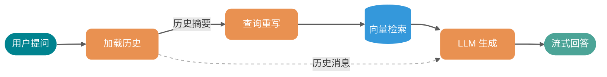
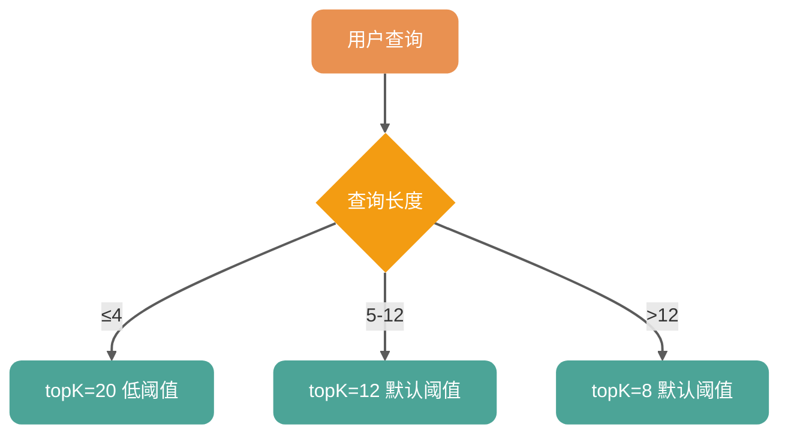

# RAG 问答优化：多轮上下文与短查询命中修复

> 本文讲知识库 RAG 问答的两个体验优化：多轮对话上下文注入和短查询命中修复。涉及 `KnowledgeBaseQueryService`、`RagChatSessionService` 的改动。如果你还不了解知识库模块的整体架构（文档上传、向量化、检索流程），建议先看知识库基础篇。向量检索和 embedding 的基本概念本文不展开。

文中涉及的后端代码在 `app/src/main/java/interview/guide/modules/knowledgebase/service/` 目录下，可直接对照源码。

* Github：<https://github.com/Snailclimb/interview-guide>
* Gitee：<https://gitee.com/SnailClimb/interview-guide>
* 教程地址：<https://t.zsxq.com/dQNVc>

***

用户打开知识库问答界面，选好知识库，输入“Java 有哪些基本数据类型”，AI 回答了 8 种类型。用户接着追问“那它们各自占用多少内存”，AI 却开始泛泛而谈，完全不知道“它们”指什么。换个场景，用户输入"JVM"想查 Java 虚拟机相关内容，系统却提示“未检索到相关信息”——明明知识库里有“Java 虚拟机”的文档。

这两个问题的根源不在向量模型。模型完全理解"JVM"和“Java 虚拟机”的语义等价，也理解“它们”指代的是上一轮提到的 8 种基本数据类型。问题出在系统设计上：RAG 问答流程是无状态的，每次提问都是独立的一次检索加生成；而向量检索之后还加了一层字面匹配的二次校验，把语义正确但字面不匹配的结果拦在了门外。

| 问题 | 挑战 | 方案关键词 |
| --- | --- | --- |
| 追问不连贯 | 每次提问独立，历史消息未注入 LLM | 有界加载历史 + ChatClient.messages() |
| 查询重写无上下文 | “那它呢”被改写成“它”，无检索价值 | 重写 prompt 注入历史摘要 |
| 短查询被误杀 | 字面匹配与语义匹配冲突 | 去掉字面确认，信任向量阈值 |

下面逐个展开。

## 最朴素的 RAG 问答流程

改动前的核心调用链很简单，不到 10 行有效代码：

```java
// RagChatSessionService.java
public Flux<String> getStreamAnswer(Long sessionId, String question) {
    RagChatSessionEntity session = sessionRepository.findByIdWithKnowledgeBases(sessionId)...;
    List<Long> kbIds = session.getKnowledgeBaseIds();
    return queryService.answerQuestionStream(kbIds, question); // 只有知识库 ID 和当前问题
}
```

`answerQuestionStream` 拿到知识库 ID 和问题文本，做向量检索，把命中的文档片段拼进 prompt，调用 LLM 生成回答。没有历史消息，没有上下文感知。

这个最简版本有两个明显的问题：追问时 LLM 不知道之前聊了什么；短查询的检索结果会被一层字面匹配误杀。接下来逐个解决。

***

## 痛点一：追问不连贯——RAG 问答无状态

### 问题出在哪

`RagChatSessionService` 虽然把每轮对话都存到了数据库（`rag_chat_messages` 表），但 `getStreamAnswer` 在调用 `KnowledgeBaseQueryService` 时只传了知识库 ID 和当前问题，从来不加载历史。每次提问都是独立的一次检索加生成，LLM 完全不知道之前聊了什么。

MVP 阶段这么设计是合理的。知识库问答场景下，大部分用户的提问是独立的（“这条面试题怎么答”、“这个概念是什么”），多轮追问的占比不高。每次都带历史消息会增加 token 消耗和响应延迟，所以先砍掉了这个能力。但随着用户量增长，追问场景越来越频繁，体验上的割裂感变得不可忽视。

### 注入历史消息

Spring AI 的 `ChatClient` 提供了 `.messages()` 方法，可以传入 `List<Message>` 作为对话历史。改造思路很直接：在 `getStreamAnswer` 中加载历史消息，通过 `.messages(history)` 传给 ChatClient。

```java
// RagChatSessionService.java — 改造后
public Flux<String> getStreamAnswer(Long sessionId, String question) {
    RagChatSessionEntity session = sessionRepository.findByIdWithKnowledgeBases(sessionId)...;
    List<Long> kbIds = session.getKnowledgeBaseIds();
    List<Message> history = queryProperties.getHistory().isEnabled()
        ? loadHistoryMessages(sessionId) : List.of();
    return queryService.answerQuestionStream(kbIds, question, history);
}
```

这段代码从数据库加载历史消息，转换为 Spring AI 的 `UserMessage` / `AssistantMessage`，传给查询服务。`queryProperties` 是 `KnowledgeBaseQueryProperties` 注入的实例，绑定到 `app.ai.rag` 配置前缀。

`loadHistoryMessages` 的实现有一个容易踩坑的细节。

### 加载历史的陷阱：排除当前轮消息

`prepareStreamMessage` 在流式请求开始时会保存两条记录：一条 `completed=true` 的 user 消息，一条 `completed=false` 的 AI 占位消息。加载历史时如果不过滤，就会把用户正在问的问题又喂给 LLM 一遍——等于在 prompt 里重复了一遍当前问题。

所以查询条件是 `completed = true`，并且按 `messageOrder DESC` 排列后丢弃第一条（当前轮的 user 消息）：

```java
// RagChatSessionService.java
private List<Message> loadHistoryMessages(Long sessionId) {
    int limit = queryProperties.getHistory().getMaxMessages() + 1;
    List<RagChatMessageEntity> recent = messageRepository
        .findRecentCompletedBySessionId(sessionId, PageRequest.of(0, limit));

    if (recent.isEmpty()) {
        return List.of();
    }
    // DESC 首条是当前轮 user 消息，排除
    List<RagChatMessageEntity> historyMessages = recent.size() <= 1
        ? List.of()
        : recent.subList(1, recent.size());

    // 反转为正序（时间从早到晚）
    return historyMessages.reversed().stream()
        .map(m -> m.getType() == RagChatMessageEntity.MessageType.USER
            ? (Message) new UserMessage(m.getContent())
            : (Message) new AssistantMessage(m.getContent()))
        .toList();
}
```

其中最关键的是 `recent.subList(1, recent.size())`——它排除了 DESC 排序后的第一条，也就是当前轮的 user 消息。如果只有一条记录（说明是会话的第一轮提问），直接返回空列表。

### 不加载全部消息：有界查询

长对话可能有上百条消息，AI 回复的 TEXT 列很大。全量加载既浪费数据库 I/O 又浪费堆内存，所以改用了有界查询：

```java
// RagChatMessageRepository.java
@Query("SELECT m FROM RagChatMessageEntity m WHERE m.session.id = :sessionId "
     + "AND m.completed = true ORDER BY m.messageOrder DESC")
List<RagChatMessageEntity> findRecentCompletedBySessionId(
    @Param("sessionId") Long sessionId, Pageable pageable);
```

调用时传入 `PageRequest.of(0, maxMessages + 1)`，在数据库层面就做了截断。没有用 `findBySessionIdOrderByMessageOrderAsc` 加载全部再在 Java 里截断。

这里有一个设计决策：为什么用 `Pageable` 而不是 `LIMIT` 子句？因为 JPQL 不支持 `LIMIT` 关键字（那是 SQL 的方言），Spring Data 的 `Pageable` 是 JPA 标准的分页方式，语义更清晰。

### 查询重写也要感知上下文

光在最终 LLM 调用时注入历史还不够。查询重写（Query Rewrite）是向量检索前的预处理步骤——把用户的自然语言问题改写成更适合检索的查询。如果用户追问“那它呢”，重写时没有上下文，改写出来的 query 就是“它”这种毫无检索价值的文本。

所以在重写 prompt 中也注入了历史摘要。重写模板 `knowledgebase-query-rewrite.st` 中的关键两行：

```markdown
5. 如果存在对话历史，结合上下文理解用户的追问意图

用户原始问题：
{question}
{history}
```

`{history}` 由 `formatHistoryForRewrite` 方法格式化为 `"用户: xxx\n助手: xxx"` 的文本。助手回复做了截断（超过 200 字只取前 200 字），避免 rewrite prompt 过长影响性能。

为什么不直接把完整的 `List<Message>` 传给重写 prompt，而是格式化成文本？因为重写用的是单次 `call()` 调用，不是对话模式。历史摘要作为文本片段拼进 prompt，比传 Message 对象更简单直接，也不需要额外的 ChatClient 配置。

### 效果对比

改造前：

```plain
用户：Java 有哪些基本数据类型？
AI：Java 有 8 种基本数据类型：byte、short、int、long、float、double、char、boolean。

用户：那它们各自占用多少内存？
AI：内存占用取决于具体的数据类型和运行环境...（泛泛而谈，不知道"它们"指什么）
```

改造后：

```plain
用户：Java 有哪些基本数据类型？
AI：Java 有 8 种基本数据类型：byte、short、int、long、float、double、char、boolean。

用户：那它们各自占用多少内存？
AI：Java 8 种基本数据类型的内存占用如下：byte(1字节)、short(2字节)...
```

重写后的查询也从”那它们各自占用多少内存”变成了类似”Java 基本数据类型 byte short int long float double char boolean 各自占用的字节数”，检索精度明显提高。

改造后的完整数据流如下，重点看”加载历史”同时向查询重写和 LLM 生成两个环节注入上下文：



***

## 痛点二：短查询被字面匹配误杀

### 问题出在哪

`KnowledgeBaseQueryService` 有一个 `hasEffectiveHit` 方法，对短查询（如"JVM"、"Redis"）做了一层额外的字面确认：先用 `contains()` 检查检索到的文档里是否包含查询词的字面文本，匹配不到就视为无效结果，全部丢弃。

```java
// 改造前的 hasEffectiveHit
private boolean hasEffectiveHit(String question, List<Document> docs) {
    if (docs == null || docs.isEmpty()) return false;
    if (!isShortTokenQuery(normalized)) return true; // 长查询直接信任向量检索

    String coreTerm = extractCoreTerm(normalized).toLowerCase();
    for (Document doc : docs) {
        if (doc.getText().toLowerCase().contains(coreTerm)) return true;
    }
    return false; // 字面匹配不上，全部丢弃
}
```

这个逻辑的初衷是合理的。短查询的 embedding 区分度低，容易召回弱相关内容，加一层字面确认可以降低误召回。但问题在于，字面匹配和语义匹配是两套不同的相似度体系，中文场景下同义替换非常普遍：

| 查询词 | 知识库中的表述 | 语义相关性 | `contains` 结果 |
| --- | --- | --- | --- |
| JVM | Java 虚拟机 | 完全相关 | 不匹配 |
| 缓存 | Redis 缓存穿透 | 相关 | 匹配 |
| GC | 垃圾回收机制 | 完全相关 | 不匹配 |
| 多线程 | 并发编程 | 相关 | 不匹配 |

"JVM" 搜不到“Java 虚拟机”，问题出在 `contains` 把正确结果拦在了门外，而向量模型完全能理解它们的语义等价。

### 去掉字面确认，信任向量阈值

做法很直接：`hasEffectiveHit` 简化为只检查非空，删掉全部字面匹配逻辑。

```java
// 改造后的 hasEffectiveHit
private boolean hasEffectiveHit(List<Document> docs) {
    return docs != null && !docs.isEmpty();
}
```

原来的 `isShortTokenQuery`、`extractCoreTerm` 以及三个正则常量（`SHORT_TOKEN_PATTERN`、`ZH_QUESTION_PREFIX`、`ZH_QUESTION_SUFFIX`）一并删除了。这些逻辑加起来 40 多行代码，维护成本不低，但在向量模型越来越强的今天，带来的保护效果已经不值得这个复杂度。

去掉字面确认后，短查询的质量保障完全依赖向量检索阶段。当前的 `resolveSearchParams` 方法按查询长度分三档检索参数：

```java
// KnowledgeBaseQueryService.java
private SearchParams resolveSearchParams(String question) {
    int compactLength = question.replaceAll("\\s+", "").length();
    if (compactLength <= shortQueryLength) {     // ≤ 4 字符（默认）
        return new SearchParams(topkShort, minScoreShort);   // topK=20, 更低阈值
    }
    if (compactLength <= 12) {                    // 5-12 字符
        return new SearchParams(topkMedium, minScoreDefault); // topK=12
    }
    return new SearchParams(topkLong, minScoreDefault);       // > 12 字符, topK=8
}
```

分档逻辑如下图所示：



短查询使用更大的 `topK`（20 vs 8）和更低的 `minScore` 阈值，因为它需要更多候选来弥补 embedding 区分度的不足。这是当前唯一的短查询差异化策略。

### 为什么不保留字面匹配做降级提示

有人可能会想：字面匹配不上时不丢弃，但在 prompt 里给 LLM 提示说“这些内容可能存在表述差异”，让 LLM 自行判断。我选择了直接去掉，原因有三：

1. **向量阈值已经是第一道门槛**：短查询的 `minScoreShort` 和普通查询的 `minScoreDefault` 本身就起到了过滤作用。如果弱相关内容会被误召回，调高阈值比加字面匹配更直接
2. **中文同义替换太普遍**：字面匹配在中文场景下误杀率太高。JVM/Java 虚拟机、GC/垃圾回收、多线程/并发编程，这些同义关系在技术文档里随处可见，`contains` 处理不了
3. **调阈值比维护正则更可持续**：如果发现误召回增加，调 `minScoreShort` 就行，不需要维护 `extractCoreTerm` 这种脆弱的正则逻辑

***

## 配置意图

历史上下文的行为通过 `KnowledgeBaseQueryProperties` 配置，绑定到 `app.ai.rag` 前缀：

```java
@Data
@ConfigurationProperties(prefix = "app.ai.rag")
public class KnowledgeBaseQueryProperties {
    private History history = new History();
    private Search search = new Search();
    // ...

    @Data
    public static class History {
        private boolean enabled = true;    // 关闭可回退到无状态模式
        private int maxMessages = 10;      // 最近 5 轮对话（1 轮 = 1 user + 1 assistant）
    }

    @Data
    public static class Search {
        private int shortQueryLength = 4;      // ≤ 4 字符视为短查询
        private int topkShort = 20;            // 短查询取 20 条候选
        private int topkMedium = 12;           // 中等查询取 12 条
        private int topkLong = 8;              // 长查询取 8 条
        private double minScoreShort = 0.25;   // 短查询最低相似度
        private double minScoreDefault = 0.28; // 非短查询最低相似度
    }
}
```

`history.enabled` 控制是否加载历史消息。检查在 `getStreamAnswer` 里做，如果关闭，不会触发任何额外的数据库查询。`history.maxMessages` 默认 10 条（5 轮对话），可以根据 token 预算调整——每多一轮，LLM 的输入 token 大约多几百个。

`search.shortQueryLength` 决定多短的查询会被当作“短查询”处理。当前默认 4 个字符（去掉空格后），像"JVM"、"GC"这种缩写词会命中短查询分支，获得更大的 topK 和更低的相似度阈值。

***

## 性能方面的考虑

三个点，都是在实际使用中踩过之后加的：

1. **有界查询**：没有加载全部消息再在 Java 里截断，而是在 Repository 层用了带 `Pageable` 参数的 `findRecentCompletedBySessionId`，只取最近 N+1 条已完成消息。长对话可能有上百条消息，AI 回复的 TEXT 列很大，全量加载既浪费数据库 I/O 又浪费堆内存
2. **功能开关前置**：`history.enabled` 的检查放在 `getStreamAnswer` 里，在调用 `loadHistoryMessages` 之前就判断。功能关闭时不触发任何数据库查询
3. **重写 prompt 中的截断**：`formatHistoryForRewrite` 把助手回复截断到 200 字。重写 prompt 的 LLM 调用本身是轻量的（单次 `call()`，输出只有一行），截断对精度影响很小，但能避免 prompt 过长导致额外的 token 消耗

***

## 写在最后

两个优化，两条实践原则：

1. **RAG 系统的上下文不只是 LLM 的事**。检索前的查询重写也需要上下文，否则追问被改写成无意义文本，后面的检索和生成都白费。两个环节要同步改造
2. **不要在向量检索之上再套字面匹配**。两种匹配体系的判断标准不同，混在一起只会互相干扰。如果向量检索的精度不够，调阈值和 topK，不要加 hack

这两个改动都不大，但背后是同一个认知：RAG 不是“向量检索 + LLM 生成”两步就完了的简单流程，每个环节都需要考虑上下文传递和语义一致性。


> 更新: 2026-04-29 17:10:08  
> 原文: <https://www.yuque.com/snailclimb/itdq8h/mnn5yigvhumlur1v>