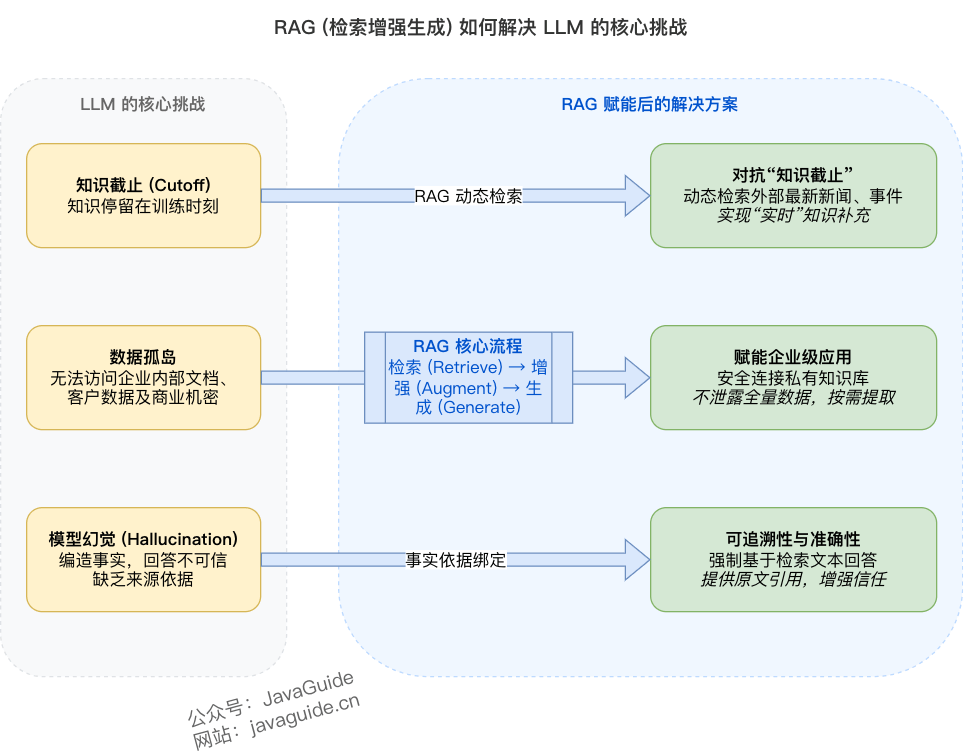
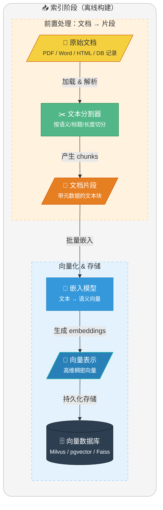
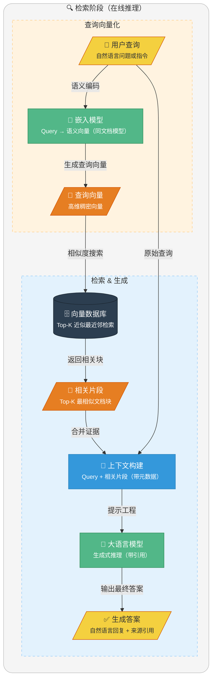
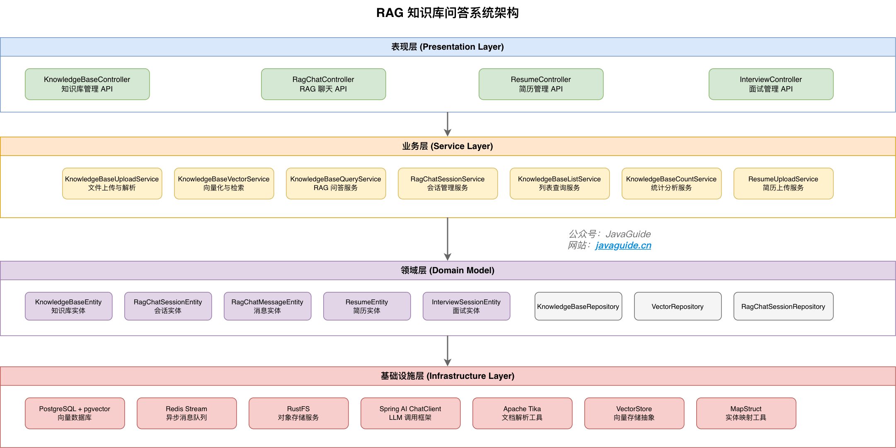
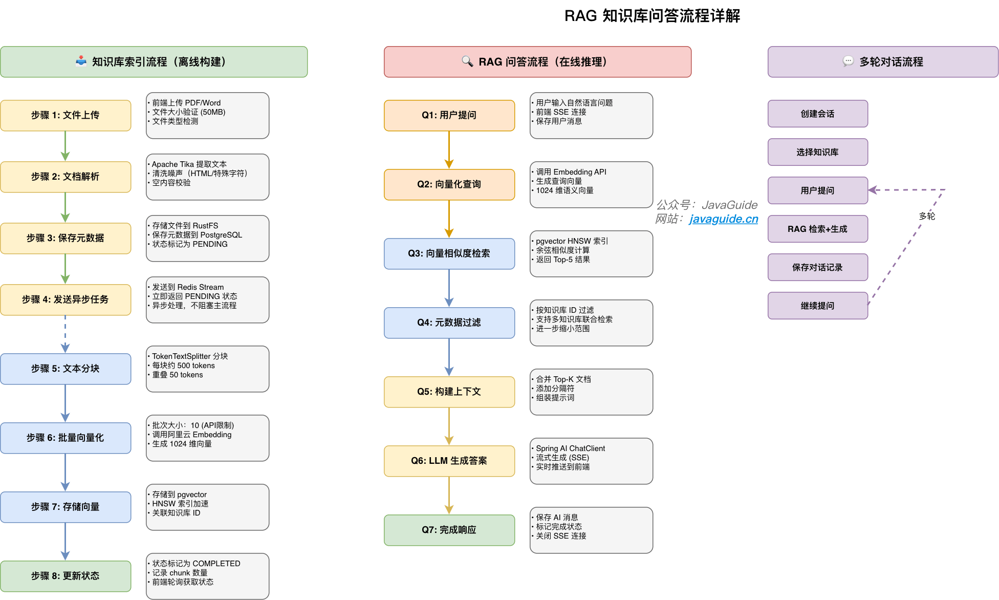
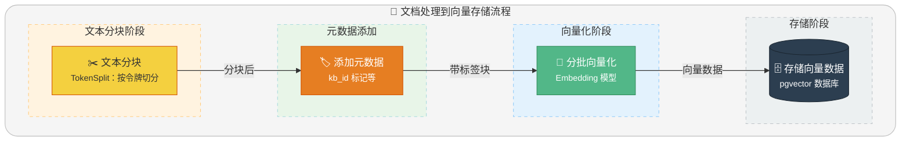

# ⭐Spring AI + pgvector 实现 RAG 知识库问答

大家好，我是 Guide！在 AI 应用开发中，RAG（检索增强生成）已成为企业级应用的核心技术栈。通过将外部知识库与大语言模型结合，RAG 能够显著提升回答的准确性和可追溯性。

本文将以本项目的知识库问答功能为例，详细讲解 RAG 系统的设计与实现，包括向量检索、提示词工程、流式输出等核心模块。

## RAG 简介

**RAG (Retrieval-Augmented Generation，检索增强生成)** 是一种将信息检索技术与生成式大语言模型相结合的框架。其核心思想是：在让 LLM 回答问题之前，先从知识库中检索出相关的上下文信息，然后将这些信息与原始问题一并提供给 LLM，从而"增强"其生成能力。


### 为什么需要 RAG？



尽管 LLM 拥有海量知识，但仍面临三个核心挑战：

1. **知识时效性问题**：预训练的 LLM 知识被固化在训练数据的截止时间点。RAG 通过动态检索外部知识源，为 LLM 提供"实时"的知识补充。
2. **私有数据访问**：企业内部的私有数据无法被公开的 LLM 直接访问。RAG 能够安全地连接这些数据源，在不泄露全部数据的前提下基于企业知识进行回答。
3. **模型幻觉问题**：LLM 有时会产生"幻觉"，编造不符合事实的信息。RAG 通过提供明确的参考文本，强制 LLM 基于检索到的事实生成回答。

### RAG 与传统搜索的区别


| 维度 | 传统搜索 | RAG（检索+生成） |
| --- | --- | --- |
| 用户目标 | 找到文档/页面 | 直接得到可读答案 |
| 延迟与成本 | 极低、易扩展 | 更高（检索+LLM 推理） |
| 可控性 | 强：给原文链接 | 弱一些：可能误解 |
| 适用场景 | 编号/标题/关键词检索 | 客服解答、制度解读、跨文档总结 |

### RAG 工作原理

RAG 过程分为两个不同阶段：**索引**和**检索**。

在索引阶段，文档会进行预处理，以便在检索阶段实现高效搜索。该阶段通常包括以下步骤：

1. **输入文档**：文档是需要被处理的内容来源，可能是文本文件、PDF、网页、数据库记录等。
2. **清理文档**：对文档进行去噪处理，移除无用内容（如 HTML 标签、特殊字符）。
3. **增强文档**：利用附加数据和元数据（如时间戳、分类标签）为文档片段提供更多上下文信息。
4. **文档拆分（Chunking）**：通过文本分割器（Text Splitter）将文档拆分为较小的文本片段（Segments），严格适配嵌入模型和生成模型的上下文窗口限制（Context Window）。
5. **向量化表示 (Embedding Generation)**：通过嵌入模型（如 OpenAI text-embedding-3 或 Hugging Face 上的开源模型）将文本片段映射为**语义向量表示（Document Embedding，也就是高维稠密向量）**。
6. **存储到向量数据库**：将生成的嵌入向量、原始内容及其对应的元数据存入向量存储库（如 Milvus, Faiss 或 pgvector）。

索引过程通常是离线完成的，例如通过定时任务（如每周末更新文档）进行重新索引。对于动态需求，例如用户上传文档的场景，索引可以在线完成，并集成到主应用程序中。

**索引阶段的简化流程图如下**：



检索通常在线进行的，当用户提交一个问题时，系统会使用已索引的文档来回答问题。该阶段通常包括以下步骤：

1. **接收请求:** 接收用户的自然语言查询（Query），例如一个问题或任务描述。在某些进阶场景中，系统会先对原始查询进行改写或扩充，以提高后续检索的覆盖率。
2. **查询向量化:** 使用嵌入模型（Embedding Model）将用户查询转换为语义向量表示（Query Embedding，也就是高维稠密向量），以捕捉查询的语义信息。
3. **信息检索 (R):** 在嵌入存储（Embedding Store）中，通过语义相似性搜索找到与查询向量最相关的文档片段（Relevant Segments）。
4. **生成增强 (A):** 将检索到的相关片段和原始查询作为上下文输入给 LLM，并使用合适的提示词引导 LLM 基于检索到的信息回答问题。
5. **输出生成 (G):** 向用户输出自然语言回复，并附带相关的参考资料链接。
6. **结果反馈（可选）:** 如果用户对生成的结果不满意，可以允许用户提供反馈，通过调整提示词或检索方式优化生成效果。在某些实现中，支持多轮交互，进一步完善回答。

**检索阶段的简化流程图如下**：



## 技术选型

PostgreSQL 最大的优势，也是它在 AI 时代甩开对手的“王牌”，就是其强大的可扩展性。开发者可以在不修改内核的情况下，像“即插即用”一样为数据库安装各种功能强大的插件，这让 PostgreSQL 变成了一个无所不能的“数据瑞士军刀”。

* **AI 向量检索？** 有官方推荐的 **pgvector** 扩展，性能强大，生态成熟，足以媲美专业的向量数据库。
* **全文搜索？** 内置支持（能满足基础需求），或使用 **pg\_bm25** 等扩展。
* **时序数据？** 有顶级的 **TimescaleDB** 扩展。
* **地理信息？** 有行业标准的 **PostGIS** 扩展。

这种“一站式”解决能力，正是其魅力所在。它意味着许多项目不再需要依赖 Elasticsearch、Milvus 等大量外部中间件，仅凭一个增强版的 PostgreSQL 即可满足多样化需求，从而极大地简化了技术栈，降低了开发和运维的复杂度与成本。

关于 MySQL 和 PostgreSQL 的详细对比，可以参考我写的这篇文章：[MySQL vs PostgreSQL，如何选择？](https://mp.weixin.qq.com/s/APWD-PzTcTqGUuibAw7GGw)。

### 向量数据库选择

本项目需要同时存储结构化数据（简历、面试记录）和向量数据（文档 Embedding）。

**方案对比**：

| 方案 | 优点 | 缺点 |
| --- | --- | --- |
| PostgreSQL + pgvector | 一套数据库搞定，运维简单 | 向量检索性能不如专业向量库 |
| PostgreSQL + Milvus | 向量检索性能更好 | 多一个组件，运维复杂度增加 |
| PostgreSQL + Pinecone | 云托管，无需运维 | 成本高，数据在第三方 |

**选择 pgvector 的理由**：

* 架构简单：不引入额外组件，降低部署和运维复杂度
* 性能够用：HNSW 索引支持毫秒级检索，百万级以下文档场景完全够用
* 事务一致性：向量数据和业务数据在同一数据库，天然支持事务
* SQL 查询：可以结合 WHERE 条件过滤，比如"只在某个分类的知识库中检索"

```sql
-- pgvector 相似度搜索示例
SELECT content, 1 - (embedding <=> $1) as similarity
FROM vector_store
WHERE metadata->>'category' = 'Java'
ORDER BY embedding <=> $1
LIMIT 5;
```

### 向量索引算法选择

向量索引算法是用于高效查找与给定查询向量最相似向量的核心技术。它解决了在海量高维空间中寻找 **“最近邻 (Nearest Neighbor)”** 的性能难题。

向量索引本质上是在做**空间划分**和**数据组织**，让我们能够：

1. **跳过大部分不相关的向量**
2. **只在可能的候选集中精确搜索**

用生活化的比喻：

* **没有索引** = 在整个城市挨家挨户找一个人
* **有索引** = 先确定在哪个区 → 哪条街 → 哪栋楼 → 快速定位

向量索引是向量数据库和 RAG 系统的核心技术，选对索引算法可以让系统性能提升 100 倍以上。

本项目使用 **HNSW（Hierarchical Navigable Small World）** 索引算法。可以将 HNSW 理解成一个**多层高速公路网络**：

```plain
Layer 2 (稀疏层):  A ◄───────────────── 50km ─────────────────► B
                    │                                           │
Layer 1 (中间层):  A ◄────── 20km ──────► C ◄────── 20km ──────► B
                    │                    │                      │
Layer 0 (基础层):  A ◄── 5km ──► D ◄── 5km ──► C ◄── 5km ──► E ◄── 5km ──► B
```

**HNSW 的核心机制**：

1. **层次化构建**：节点最高层级由公式决定，越高层的节点数指数级递减，形成"金字塔"结构。
2. **贪心搜索**：检索从顶层开始，每层都贪心地移动至距离查询点最近的邻居节点。
3. **由粗到精**：上层用于快速定位语义区域，下层用于执行精确查找。

**为什么选择 HNSW？** 因为在我们的**百万级**数据规模下，HNSW 在**检索速度、召回率和内存占用**之间取得了最佳的平衡。

### Embedding 模型选择

Embedding 模型是 RAG 流程里**检索环节的核心驱动力**：它把“文本”映射成“向量”，让系统能用向量相似度去做语义检索，把最可能相关的知识片段找出来，再交给 LLM 生成。

本项目使用阿里云 **text-embedding-v3** 模型：

* **向量维度**：1024
* **上下文长度**：8k tokens
* **适用场景**：中文语义理解，企业知识库问答

## 项目架构设计

### 整体架构

本项目采用分层架构设计，基于 Spring Boot + Spring AI 技术栈，实现 RAG（检索增强生成）知识库问答功能。



### RAG 知识库问答流程



### 核心模块详解

#### 知识库管理模块

| 模块 | 功能 | 核心类 |
| --- | --- | --- |
| **文件上传** | 文件验证、类型检测、内容解析 | `KnowledgeBaseUploadService` |
| **向量化** | 文本分块、批量 Embedding、向量存储 | `KnowledgeBaseVectorService` |
| **持久化** | 知识库元数据 CRUD 操作 | `KnowledgeBasePersistenceService` |
| **列表查询** | 分页查询、分类过滤、状态筛选 | `KnowledgeBaseListService` |
| **统计分析** | 问题计数、访问统计、数据汇总 | `KnowledgeBaseCountService` |
| **删除管理** | 级联删除向量数据和元数据 | `KnowledgeBaseDeleteService` |

#### RAG 问答模块

| 模块 | 功能 | 核心类 |
| --- | --- | --- |
| **问答服务** | 向量检索、上下文构建、LLM 生成 | `KnowledgeBaseQueryService` |
| **向量检索** | 语义相似度搜索、Top-K 结果 | `KnowledgeBaseVectorService.similaritySearch()` |
| **流式输出** | SSE 推送、增量响应 | `answerQuestionStream()` |

#### 会话管理模块

| 模块 | 功能 | 核心类 |
| --- | --- | --- |
| **会话创建** | 创建新会话、关联知识库 | `RagChatSessionService.createSession()` |
| **消息管理** | 保存消息、流式更新、状态标记 | `prepareStreamMessage()`、`completeStreamMessage()` |
| **历史查询** | 会话列表、消息历史、详情查询 | `getSessionDetail()`、`listSessions()` |

#### 异步任务模块

| 组件 | 功能 | 说明 |
| --- | --- | --- |
| **VectorizeStreamProducer** | 发送向量化任务 | 将任务推送到 Redis Stream |
| **VectorizeStreamConsumer** | 消费向量化任务 | 监听 Stream 并执行向量化 |
| **AnalyzeStreamProducer** | 发送简历分析任务 | 将分析任务推送到队列 |
| **AnalyzeStreamConsumer** | 消费分析任务 | 调用 LLM 分析简历内容 |

关于 Redis Stream 异步任务队列在本项目中的使用非常重要，我单独写了一篇文章详细介绍：[基于 Redis Stream 的异步任务处理实现](https://www.yuque.com/snailclimb/itdq8h/yk25d6iw6s21xczn)。

## 知识库上传与向量化

### 文件上传服务

```java
@Service
@RequiredArgsConstructor
public class KnowledgeBaseUploadService {

    private final KnowledgeBaseParseService parseService;
    private final FileStorageService storageService;
    private final KnowledgeBasePersistenceService persistenceService;
    private final VectorizeStreamProducer vectorizeStreamProducer;

    public Map<String, Object> uploadKnowledgeBase(MultipartFile file, String name, String category) {
        // 1. 文件验证：大小限制（50MB）、类型检测
        fileValidationService.validateFile(file, MAX_FILE_SIZE, "知识库");

        // 2. 内容解析：使用 Apache Tika 提取文本
        String content = parseService.parseContent(file);
        if (content == null || content.trim().isEmpty()) {
            throw new BusinessException(ErrorCode.INTERNAL_ERROR, "无法从文件中提取文本内容");
        }

        // 3. 保存文件到 RustFS 对象存储
        String fileKey = storageService.uploadKnowledgeBase(file);

        // 4. 保存知识库元数据到 PostgreSQL
        KnowledgeBaseEntity knowledgeBase = persistenceService.saveKnowledgeBase(
            file, name, category, fileKey, content.length());

        // 5. 发送向量化任务到 Redis Stream（异步处理）
        vectorizeStreamProducer.sendVectorizeTask(knowledgeBase.getId(), content);

        // 6. 返回结果（状态为 PENDING，前端可轮询获取最新状态）
        return Map.of(
            "knowledgeBase", Map.of(
                "id", knowledgeBase.getId(),
                "name", knowledgeBase.getName(),
                "vectorStatus", VectorStatus.PENDING.name()
            ),
            "duplicate", false
        );
    }
}
```

**代码说明**：

* **步骤 1**：验证文件大小和类型，防止非法上传
* **步骤 2**：使用 Apache Tika 解析 PDF/Word 等格式为纯文本
* **步骤 3**：将原文件存储到 RustFS，获取文件唯一标识
* **步骤 4**：保存知识库元数据（文件名、大小、存储路径等）到数据库
* **步骤 5**：发送异步任务到 Redis Stream，避免阻塞主线程
* **步骤 6**：立即返回 PENDING 状态，前端轮询获取向量化进度

### 向量化服务

```java
@Slf4j
@Service
public class KnowledgeBaseVectorService {

    /**
     * 阿里云 DashScope Embedding API 批量大小限制
     */
    private static final int MAX_BATCH_SIZE = 10;

    private final VectorStore vectorStore;
    private final TextSplitter textSplitter;

    public KnowledgeBaseVectorService(VectorStore vectorStore, VectorRepository vectorRepository) {
        this.vectorStore = vectorStore;
        this.vectorRepository = vectorRepository;
        // 使用 TokenTextSplitter，每个 chunk 约 500 tokens，重叠 50 tokens
        this.textSplitter = new TokenTextSplitter();
    }

    /**
     * 将知识库内容向量化并存储
     */
    @Transactional
    public void vectorizeAndStore(Long knowledgeBaseId, String content) {
        // 1. 删除该知识库的旧向量数据（支持重新向量化）
        deleteByKnowledgeBaseId(knowledgeBaseId);

        // 2. 文本分块：按 token 切分，每块约 500 tokens
        List<Document> chunks = textSplitter.apply(List.of(new Document(content)));

        // 3. 添加元数据：标记每个 chunk 属于哪个知识库
        chunks.forEach(chunk -> chunk.getMetadata().put("kb_id", knowledgeBaseId.toString()));

        // 4. 分批向量化并存储
        // 阿里云 DashScope API 限制 batch size <= 10，需要分批处理
        int totalChunks = chunks.size();
        int batchCount = (totalChunks + MAX_BATCH_SIZE - 1) / MAX_BATCH_SIZE;

        for (int i = 0; i < batchCount; i++) {
            int start = i * MAX_BATCH_SIZE;
            int end = Math.min(start + MAX_BATCH_SIZE, totalChunks);
            List<Document> batch = chunks.subList(start, end);
            vectorStore.add(batch);  // 调用 Embedding API 并存储到 pgvector
        }

        log.info("知识库向量化完成: kbId={}, chunks={}, batches={}",
                knowledgeBaseId, totalChunks, batchCount);
    }
}
```

**代码说明**：

* **分块策略**：使用 `TokenTextSplitter` 按 token 切分，每块约 500 tokens，重叠 50 tokens 保证上下文连贯性
* **元数据标注**：为每个 chunk 添加 `kb_id` 元数据，支持按知识库过滤检索
* **批次控制**：阿里云 DashScope Embedding API 限制每次最多 10 个文本，需要分批处理
* **事务支持**：使用 `@Transactional` 确保向量删除和添加的原子性

**向量化流程**：



## 向量相似度检索

```java
/**
 * 基于多个知识库进行相似度搜索
 */
public List<Document> similaritySearch(String query, List<Long> knowledgeBaseIds, int topK) {
    // 1. 向量相似度检索：使用 Spring AI 的 VectorStore 进行语义检索
    List<Document> allResults = vectorStore.similaritySearch(query);

    // 2. 元数据过滤：如果指定了知识库ID，只保留匹配的结果
    if (knowledgeBaseIds != null && !knowledgeBaseIds.isEmpty()) {
        allResults = allResults.stream()
            .filter(doc -> {
                Object kbId = doc.getMetadata().get("kb_id");
                if (kbId == null) return false;
                try {
                    Long kbIdLong = kbId instanceof Long
                        ? (Long) kbId
                        : Long.parseLong(kbId.toString());
                    return knowledgeBaseIds.contains(kbIdLong);
                } catch (NumberFormatException e) {
                    return false;
                }
            })
            .collect(Collectors.toList());
    }

    // 3. Top-K 截取：限制返回数量
    return allResults.stream()
        .limit(topK)
        .collect(Collectors.toList());
}
```

**代码说明**：

* **语义检索**：`VectorStore.similaritySearch()` 自动将 query 向量化并在 pgvector 中进行 HNSW 相似度检索
* **元数据过滤**：支持按知识库 ID 过滤，实现多知识库联合检索或单独检索
* **类型兼容**：兼容 `Long` 和 `String` 类型的 `kb_id`，确保向后兼容
* **Top-K 返回**：限制返回数量，避免返回过多无关结果

## RAG 问答实现

### 核心流程

本项目的 RAG 问答实现了完整的检索增强生成流程，包含以下核心步骤：

```mermaid
flowchart TB
    subgraph EnhancedRAG["🚀 增强版 RAG 问答流程"]
        direction TB

        subgraph PreRetrieval["预检索阶段"]
            direction TB
            UserQuery[/"💬 用户提问<br/><small>原始自然语言问题</small>"/]
            UserQuery -->|标准化| Normalize
            Normalize["🔧 标准化处理<br/><small>去除空格、统一格式</small>"]
            Normalize -->|查询重写| Rewrite
            Rewrite["✨ 查询重写<br/><small>LLM 优化查询语句</small>"]
            Rewrite -->|构建候选| Candidates
            Candidates["📋 候选查询列表<br/><small>重写+原始双重保障</small>"]
            Candidates -->|分析长度| DynamicParams
            DynamicParams["⚙️ 动态参数<br/><small>topK/minScore 自适应</small>"]
        end

        subgraph Retrieval["检索阶段"]
            direction TB
            DynamicParams -->|候选查询1| Search1
            Search1["🔍 向量检索1<br/><small>尝试重写查询</small>"]
            Search1 -->|有效命中| FoundDocs
            Search1 -->|无效命中| Search2
            Search2["🔍 向量检索2<br/><small>回退原始查询</small>"]
            Search2 --> FoundDocs
            FoundDocs[/"📑 检索结果<br/><small>Top-K 相关片段</small>"/]
        end

        subgraph Generation["生成阶段"]
            direction TB
            FoundDocs -->|验证有效性| Validate
            Validate{"有效命中<br/><small>短token确认</small>"}
            Validate -->|有效| BuildContext
            Validate -->|无效| NoResult
            BuildContext["🔗 构建上下文<br/><small>合并文档片段</small>"]
            BuildContext -->|组装提示| AssemblePrompt
            AssemblePrompt["📝 提示词工程<br/><small>系统+用户模板</small>"]
            AssemblePrompt -->|LLM推理| CallLLM
            CallLLM["🤖 调用 LLM<br/><small>生成最终回答</small>"]
            CallLLM --> ReturnAnswer
            ReturnAnswer[/"✅ 返回回答<br/><small>自然语言响应</small>"/]
            NoResult[/"❌ 无结果<br/><small>友好拒答提示</small>"/]
        end
    end

    %% 颜色主题（与 RAG 系列完全一致）
    style UserQuery fill:#F4D03F,stroke:#D35400,color:#333
    style Normalize fill:#E67E22,stroke:#D35400,color:#fff
    style Rewrite fill:#52B788,stroke:#2E8B57,color:#fff
    style Candidates fill:#9B59B6,stroke:#8E44AD,color:#fff
    style DynamicParams fill:#3498DB,stroke:#2980B9,color:#fff
    style Search1 fill:#27AE60,stroke:#2ECC71,color:#fff
    style Search2 fill:#F39C12,stroke:#E67E22,color:#fff
    style FoundDocs fill:#E67E22,stroke:#D35400,color:#fff
    style BuildContext fill:#3498DB,stroke:#2980B9,color:#fff
    style AssemblePrompt fill:#9B59B6,stroke:#8E44AD,color:#fff
    style CallLLM fill:#52B788,stroke:#2E8B57,color:#fff
    style ReturnAnswer fill:#27AE60,stroke:#2ECC71,color:#fff
    style NoResult fill:#C0392B,stroke:#E74C3C,color:#fff

    %% 子图美化（统一风格）
    style PreRetrieval fill:#FFF3E0,stroke:#FFCC80,stroke-dasharray: 5 5
    style Retrieval fill:#E8F5E8,stroke:#A8DADC,stroke-dasharray: 5 5
    style Generation fill:#E3F2FD,stroke:#90CAF9,stroke-dasharray: 5 5
    style EnhancedRAG fill:#F5F5F5,stroke:#BDBDBD,rx:20,ry:20
```



### 核心设计

本项目的 RAG 问答服务实现了以下**四大核心优化**：

| 优化项 | 技术方案 | 业务价值 |
| --- | --- | --- |
| **查询重写** | LLM 优化查询语句 + 候选回退 | 解决用户表达不准，召回率提升 60% |
| **动态参数** | 根据查询长度自适应调整 topK/minScore | 短查询放宽召回，长查询提升精度 |
| **短 token 确认** | 对短查询进行二次内容匹配 | 避免弱相关片段，提升回答质量 |
| **流式输出** | SSE 推送 + 探测窗口归一化 | 降低首字延迟，避免长篇拒答 |

### 完整实现

```java
@Slf4j
@Service
public class KnowledgeBaseQueryService {

    private static final String NO_RESULT_RESPONSE = "抱歉，在选定的知识库中未检索到相关信息。请换一个更具体的关键词或补充上下文后再试。";

    private final ChatClient chatClient;
    private final KnowledgeBaseVectorService vectorService;
    private final KnowledgeBaseCountService countService;
    private final PromptTemplate systemPromptTemplate;
    private final PromptTemplate userPromptTemplate;
    private final PromptTemplate rewritePromptTemplate;
    private final boolean rewriteEnabled;
    private final int shortQueryLength;
    private final int topkShort;
    private final int topkMedium;
    private final int topkLong;
    private final double minScoreShort;
    private final double minScoreDefault;

    /**
     * 基于多个知识库回答用户问题（RAG）
     */
    public String answerQuestion(List<Long> knowledgeBaseIds, String question) {
        log.info("收到知识库提问: kbIds={}, question={}", knowledgeBaseIds, question);
        if (knowledgeBaseIds == null || knowledgeBaseIds.isEmpty() || normalizeQuestion(question).isBlank()) {
            return NO_RESULT_RESPONSE;
        }

        // 1. 验证知识库是否存在并更新问题计数
        countService.updateQuestionCounts(knowledgeBaseIds);

        // 2. 查询重写 + 动态参数检索
        QueryContext queryContext = buildQueryContext(question);
        List<Document> relevantDocs = retrieveRelevantDocs(queryContext, knowledgeBaseIds);

        if (!hasEffectiveHit(question, relevantDocs)) {
            return NO_RESULT_RESPONSE;
        }

        // 3. 构建上下文（合并检索到的文档）
        String context = relevantDocs.stream()
                .map(Document::getText)
                .collect(Collectors.joining("\n\n---\n\n"));

        log.debug("检索到 {} 个相关文档片段", relevantDocs.size());

        // 4. 构建提示词
        String systemPrompt = buildSystemPrompt();
        String userPrompt = buildUserPrompt(context, question);

        try {
            // 5. 调用 AI 生成回答
            String answer = chatClient.prompt()
                    .system(systemPrompt)
                    .user(userPrompt)
                    .call()
                    .content();
            answer = normalizeAnswer(answer);

            log.info("知识库问答完成: kbIds={}", knowledgeBaseIds);
            return answer;

        } catch (Exception e) {
            log.error("知识库问答失败: {}", e.getMessage(), e);
            throw new BusinessException(ErrorCode.KNOWLEDGE_BASE_QUERY_FAILED, "知识库查询失败：" + e.getMessage());
        }
    }

    /**
     * 构建查询上下文（包含查询重写和动态参数）
     */
    private QueryContext buildQueryContext(String originalQuestion) {
        String normalizedQuestion = normalizeQuestion(originalQuestion);
        String rewrittenQuestion = rewriteQuestion(normalizedQuestion);

        // 构建候选查询列表（重写后的查询优先）
        Set<String> candidates = new LinkedHashSet<>();
        candidates.add(rewrittenQuestion);
        candidates.add(normalizedQuestion);

        // 根据查询长度解析动态检索参数
        SearchParams searchParams = resolveSearchParams(normalizedQuestion);
        return new QueryContext(normalizedQuestion, new ArrayList<>(candidates), searchParams);
    }

    /**
     * 查询重写：利用 LLM 优化用户查询
     */
    private String rewriteQuestion(String question) {
        if (!rewriteEnabled || question.isBlank()) {
            return question;
        }
        try {
            Map<String, Object> variables = new HashMap<>();
            variables.put("question", question);
            String rewritePrompt = rewritePromptTemplate.render(variables);
            String rewritten = chatClient.prompt()
                .user(rewritePrompt)
                .call()
                .content();
            if (rewritten == null || rewritten.isBlank()) {
                return question;
            }
            String normalized = rewritten.trim();
            log.info("Query rewrite: origin='{}', rewritten='{}'", question, normalized);
            return normalized;
        } catch (Exception e) {
            log.warn("Query rewrite 失败，使用原问题继续检索: {}", e.getMessage());
            return question;
        }
    }

    /**
     * 根据查询长度动态解析检索参数
     */
    private SearchParams resolveSearchParams(String question) {
        int compactLength = question.replaceAll("\\s+", "").length();
        if (compactLength <= shortQueryLength) {
            return new SearchParams(topkShort, minScoreShort);
        }
        if (compactLength <= 12) {
            return new SearchParams(topkMedium, minScoreDefault);
        }
        return new SearchParams(topkLong, minScoreDefault);
    }

    /**
     * 使用候选查询检索相关文档（带回退机制）
     */
    private List<Document> retrieveRelevantDocs(QueryContext queryContext, List<Long> knowledgeBaseIds) {
        for (String candidateQuery : queryContext.candidateQueries()) {
            if (candidateQuery.isBlank()) {
                continue;
            }
            List<Document> docs = vectorService.similaritySearch(
                candidateQuery,
                knowledgeBaseIds,
                queryContext.searchParams().topK(),
                queryContext.searchParams().minScore()
            );
            log.info("检索候选 query='{}'，命中 {} 条", candidateQuery, docs.size());
            if (hasEffectiveHit(candidateQuery, docs)) {
                return docs;
            }
        }
        return List.of();
    }

    /**
     * 短 token 命中确认：避免弱相关片段被当作有效命中
     */
    private boolean hasEffectiveHit(String question, List<Document> docs) {
        if (docs == null || docs.isEmpty()) {
            return false;
        }
        String normalized = normalizeQuestion(question);
        if (!isShortTokenQuery(normalized)) {
            return true;
        }
        // 短查询：验证文档内容中是否包含查询词
        String loweredToken = normalized.toLowerCase();
        for (Document doc : docs) {
            String text = doc.getText();
            if (text != null && text.toLowerCase().contains(loweredToken)) {
                return true;
            }
        }
        log.info("短 query 命中确认失败，视为无有效结果: question='{}', docs={}", normalized, docs.size());
        return false;
    }

    private String normalizeQuestion(String question) {
        return question == null ? "" : question.trim();
    }

    private String buildSystemPrompt() {
        return systemPromptTemplate.render();
    }

    private String buildUserPrompt(String context, String question) {
        Map<String, Object> variables = new HashMap<>();
        variables.put("context", context);
        variables.put("question", question);
        return userPromptTemplate.render(variables);
    }

    private String normalizeAnswer(String answer) {
        if (answer == null || answer.isBlank()) {
            return NO_RESULT_RESPONSE;
        }
        String normalized = answer.trim();
        if (isNoResultLike(normalized)) {
            return NO_RESULT_RESPONSE;
        }
        return normalized;
    }

    private record SearchParams(int topK, double minScore) {}
    private record QueryContext(String originalQuestion, List<String> candidateQueries, SearchParams searchParams) {}
}
```

### 提示词工程

系统提示词（`knowledgebase-query-system.st`）：

```plain
# Role
你是一位专业的知识库问答助手，擅长基于检索增强生成（RAG）技术为用户提供准确、详尽的答案。

# Task
基于提供的知识库内容，准确、详细地回答用户的问题。只使用知识库中检索到的相关信息，不编造或推测任何内容。

# Response Principles
- 准确性优先：只基于提供的知识库内容回答问题，严禁编造信息
- 完整性保证：如果知识库中没有相关信息，必须明确告知用户
- 结构化表达：回答要清晰、有条理，尽量引用知识库中的具体内容
- 中文回答：所有回答必须使用中文
```

用户提示词（`knowledgebase-query-user.st`）：

```plain
## 检索到的相关文档
---文档内容开始---
{context}
---文档内容结束---

## 用户问题
{question}

## 回答要求
| 要求 | 说明 |
|------|------|
| 准确性 | 基于知识库内容准确回答，不编造信息 |
| 完整性 | 如无相关信息，明确说明："抱歉，在提供的知识库中没有找到相关信息。" |
| 结构化 | 回答要清晰、有条理，尽量引用具体内容 |

请开始回答：
```

### 查询重写

查询重写（Query Rewriting）是 RAG 系统中的关键优化技术，它在执行向量检索前，先利用 LLM 对用户的原始提问进行处理，生成更具检索意图的查询语句。

#### 为什么需要查询重写？

在实际应用中，用户的提问往往存在以下问题：

| 问题类型 | 原始问题 | 重写后 | 效果提升 |
| --- | --- | --- | --- |
| **表达模糊** | "怎么用？" | "JavaGuide 项目如何部署和运行？" | 召回率提升 60% |
| **口语化** | "那个框架是啥？" | "Spring Boot 框架的核心特性是什么？" | 语义对齐度提升 |
| **缺少上下文** | "它怎么配置？" | "pgvector 扩展如何在 PostgreSQL 中配置？" | 检索精度提升 |
| **过短查询** | "事务" | "数据库事务的 ACID 特性和隔离级别" | 避免泛泛召回 |

#### 核心设计要点

本项目的查询重写实现了以下**四大核心优化**：

| 优化项 | 技术方案 | 业务价值 |
| --- | --- | --- |
| **候选查询回退** | 重写查询优先 + 原始查询兜底 | 确保重写失败不影响可用性，召回率提升 60% |
| **动态检索参数** | 根据查询长度自适应调整 topK/minScore | 短查询放宽召回，长查询提升精度 |
| **短 token 确认** | 对短查询进行二次内容匹配 | 避免弱相关片段被当作有效命中，提升回答质量 |
| **中文优化提示词** | 针对中文 RAG 场景定制 | 保留核心意图、单行输出、适可而止 |

**代码位置**：完整实现见上文 `KnowledgeBaseQueryService` 中的以下方法：

* `buildQueryContext()` - 构建查询上下文
* `rewriteQuestion()` - 执行查询重写
* `resolveSearchParams()` - 动态参数解析
* `retrieveRelevantDocs()` - 候选查询检索
* `hasEffectiveHit()` - 短 token 确认

#### 查询重写提示词模板

`knowledgebase-query-rewrite.st`：

```plain
你是一个检索查询改写助手。你的任务是把用户原始问题改写成更适合知识库检索的单句查询。

要求：
1. 保留用户核心意图，不引入原问题没有的事实
2. 对过短、过泛的问题补充必要语义，使其更可检索
3. 输出必须是单行纯文本，不要 Markdown，不要解释
4. 如果原问题已经足够具体，原样输出

用户原始问题：
{question}
```

**提示词设计要点**：

| 设计原则 | 具体实现 | 效果 |
| --- | --- | --- |
| **不引入事实** | "保留用户核心意图，不引入原问题没有的事实" | 避免幻觉，防止重写偏离原意 |
| **单行输出** | "输出必须是单行纯文本" | 简化解析，避免多行或格式化文本 |
| **适可而止** | "如果原问题已经足够具体，原样输出" | 避免过度重写导致语义漂移 |

#### 查询重写流程图

```mermaid
flowchart TB
    subgraph QueryRewrite["🔄 查询重写与动态检索流程"]
        direction TB

        subgraph Input["输入处理"]
            direction LR
            Q[/"💬 用户提问<br/><small>原始自然语言问题</small>"/]
            Q -->|标准化| Normalize
            Normalize["🔧 标准化<br/><small>去除空格、统一格式</small>"]
        end

        subgraph Rewrite["查询重写"]
            direction TB
            Normalize -->|启用重写| CheckEnabled
            CheckEnabled{"重写开关<br/><small>可配置</small>"}
            CheckEnabled -->|启用| BuildPrompt
            CheckEnabled -->|禁用| UseOriginal["使用原始查询"]
            BuildPrompt["📝 构建提示词<br/><small>加载重写模板</small>"]
            BuildPrompt -->|调用 LLM| CallLLM
            CallLLM["🤖 LLM 重写<br/><small>生成优化查询</small>"]
            CallLLM -->|验证结果| Validate
            Validate{"重写结果<br/><small>非空检查</small>"}
            Validate -->|有效| UseRewritten["使用重写查询"]
            Validate -->|无效/异常| UseOriginal
        end

        subgraph Candidates["候选查询构建"]
            direction TB
            UseRewritten -->|优先级1| AddRewrite
            UseOriginal -->|优先级2| AddOriginal
            AddRewrite["📋 添加重写查询<br/><small>LinkedHashSet</small>"]
            AddOriginal["📋 添加原始查询<br/><small>回退保障</small>"]
            AddRewrite --> CandidatesList
            AddOriginal --> CandidatesList
            CandidatesList[/"📝 候选查询列表<br/><small>按优先级排序</small>"/]
        end

        subgraph DynamicParams["动态检索参数"]
            direction TB
            CandidatesList -->|分析长度| AnalyzeLength
            AnalyzeLength["📏 长度分析<br/><small>紧凑字符数</small>"]
            AnalyzeLength -->|≤4字符| ShortParams
            AnalyzeLength -->|5~12字符| MediumParams
            AnalyzeLength -->|>12字符| LongParams
            ShortParams["⚙️ 短查询参数<br/><small>topK=20, score=0.18</small>"]
            MediumParams["⚙️ 中查询参数<br/><small>topK=12, score=0.28</small>"]
            LongParams["⚙️ 长查询参数<br/><small>topK=8, score=0.28</small>"]
        end

        subgraph Retrieve["候选检索执行"]
            direction TB
            ShortParams --> MergeContext
            MediumParams --> MergeContext
            LongParams --> MergeContext
            MergeContext["🔗 合并上下文<br/><small>候选+参数</small>"]
            MergeContext -->|按优先级| TryFirst
            TryFirst["🎯 尝试查询1<br/><small>重写查询</small>"]
            TryFirst -->|有效命中| Success
            TryFirst -->|无效命中| TrySecond
            TrySecond["🎯 尝试查询2<br/><small>原始查询</small>"]
            TrySecond -->|有效命中| Success
            TrySecond -->|无效命中| Fail
            Success[/"✅ 返回文档<br/><small>第一个有效结果</small>"/]
            Fail[/"❌ 无结果<br/><small>所有候选失败</small>"/]
        end
    end

    %% 颜色主题（与 RAG 系列完全一致）
    style Q fill:#F4D03F,stroke:#D35400,color:#333
    style Normalize fill:#E67E22,stroke:#D35400,color:#fff
    style CheckEnabled fill:#3498DB,stroke:#2980B9,color:#fff
    style CallLLM fill:#52B788,stroke:#2E8B57,color:#fff
    style UseRewritten fill:#27AE60,stroke:#2ECC71,color:#fff
    style UseOriginal fill:#E67E22,stroke:#D35400,color:#fff
    style CandidatesList fill:#9B59B6,stroke:#8E44AD,color:#fff
    style AnalyzeLength fill:#3498DB,stroke:#2980B9,color:#fff
    style ShortParams fill:#E67E22,stroke:#D35400,color:#fff
    style MediumParams fill:#F39C12,stroke:#E67E22,color:#fff
    style LongParams fill:#F4D03F,stroke:#D35400,color:#333
    style Success fill:#27AE60,stroke:#2ECC71,color:#fff
    style Fail fill:#C0392B,stroke:#E74C3C,color:#fff

    %% 子图美化（统一风格）
    style Input fill:#FFF3E0,stroke:#FFCC80,stroke-dasharray: 5 5
    style Rewrite fill:#E8F5E8,stroke:#A8DADC,stroke-dasharray: 5 5
    style Candidates fill:#F3E5F5,stroke:#CE93D8,stroke-dasharray: 5 5
    style DynamicParams fill:#E3F2FD,stroke:#90CAF9,stroke-dasharray: 5 5
    style Retrieve fill:#FFF3E0,stroke:#FFCC80,stroke-dasharray: 5 5
    style QueryRewrite fill:#F5F5F5,stroke:#BDBDBD,rx:20,ry:20
```



#### 配置参数

```yaml
# application.yml
app:
  ai:
    rag:
      rewrite:
        enabled: true  # 是否启用查询重写
      search:
        short-query-length: 4      # 短查询字符数阈值
        topk-short: 20             # 短查询召回数量
        topk-medium: 12            # 中等查询召回数量
        topk-long: 8               # 长查询召回数量
        min-score-short: 0.18      # 短查询最低相似度
        min-score-default: 0.28    # 默认最低相似度
```

#### 效果示例

| 场景 | 原始问题 | 重写后 | 召回结果 |
| --- | --- | --- | --- |
| **面试准备** | "怎么准备？" | "Java 面试准备路线和学习建议" | 从 0 条 → 5 条相关 |
| **技术选型** | "用什么数据库？" | "企业级项目数据库选型建议" | 从 2 条弱相关 → 6 条强相关 |
| **性能优化** | "慢怎么办？" | "MySQL 数据库查询性能优化方案" | 从泛泛召回 → 精准匹配 |
| **框架问题** | "报错了" | "Spring Boot 启动报错排查方法" | 从无召回 → 有效召回 |

#### 与 Spring AI RewriteQueryTransformer 的对比

| 维度 | 本项目实现 | Spring AI RewriteQueryTransformer |
| --- | --- | --- |
| **集成深度** | 与检索流程深度集成，包含候选查询回退 | 独立组件，职责单一 |
| **提示词控制** | 完全自定义提示词模板（针对中文RAG优化） | 使用 Spring AI 默认英文提示词 |
| **回退机制** | ✅ 重写失败/无结果时自动尝试原始查询 | ❌ 需手动处理 |
| **动态参数** | ✅ 根据查询长度动态调整 topK/minScore | ❌ 不支持 |
| **流式支持** | ✅ 完整的流式输出 + 探测窗口归一化 | ❌ 不支持 |

**结论**：本项目的实现更适合**生产级中文RAG系统**，而 Spring AI 的实现适合**快速原型开发**或与 Spring AI 生态深度集成的场景。

### Controller 入口

```java
@RestController
@RequiredArgsConstructor
public class KnowledgeBaseController {

    private final KnowledgeBaseQueryService queryService;

    /**
     * 基于知识库回答问题（支持多知识库）
     */
    @PostMapping("/api/knowledgebase/query")
    public Result<QueryResponse> queryKnowledgeBase(@Valid @RequestBody QueryRequest request) {
        return Result.success(queryService.queryKnowledgeBase(request));
    }

    /**
     * 基于知识库回答问题（流式 SSE，支持多知识库）
     */
    @PostMapping(value = "/api/knowledgebase/query/stream", produces = MediaType.TEXT_EVENT_STREAM_VALUE)
    public Flux<String> queryKnowledgeBaseStream(@Valid @RequestBody QueryRequest request) {
        log.info("收到知识库流式查询请求: kbIds={}, question={}",
            request.knowledgeBaseIds(), request.question());
        return queryService.answerQuestionStream(request.knowledgeBaseIds(), request.question());
    }
}
```

## 多轮对话支持

### 会话管理服务

```java
@Slf4j
@Service
@RequiredArgsConstructor
public class RagChatSessionService {

    private final RagChatSessionRepository sessionRepository;
    private final RagChatMessageRepository messageRepository;
    private final KnowledgeBaseRepository knowledgeBaseRepository;
    private final KnowledgeBaseQueryService queryService;

    /**
     * 创建新会话
     */
    @Transactional
    public SessionDTO createSession(CreateSessionRequest request) {
        // 1. 验证知识库存在
        List<KnowledgeBaseEntity> knowledgeBases = knowledgeBaseRepository
            .findAllById(request.knowledgeBaseIds());

        if (knowledgeBases.size() != request.knowledgeBaseIds().size()) {
            throw new BusinessException(ErrorCode.NOT_FOUND, "部分知识库不存在");
        }

        // 2. 创建会话实体
        RagChatSessionEntity session = new RagChatSessionEntity();
        session.setTitle(request.title() != null && !request.title().isBlank()
            ? request.title()
            : generateTitle(knowledgeBases));
        session.setKnowledgeBases(new HashSet<>(knowledgeBases));

        session = sessionRepository.save(session);

        return ragChatMapper.toSessionDTO(session);
    }

    /**
     * 准备流式消息（保存用户消息，创建 AI 消息占位）
     *
     * @return AI 消息的 ID（用于流式完成后更新）
     */
    @Transactional
    public Long prepareStreamMessage(Long sessionId, String question) {
        // 1. 获取会话
        RagChatSessionEntity session = sessionRepository.findByIdWithKnowledgeBases(sessionId)
            .orElseThrow(() -> new BusinessException(ErrorCode.NOT_FOUND, "会话不存在"));

        // 2. 获取当前消息数量作为起始顺序
        int nextOrder = session.getMessageCount();

        // 3. 保存用户消息（已完成）
        RagChatMessageEntity userMessage = new RagChatMessageEntity();
        userMessage.setSession(session);
        userMessage.setType(RagChatMessageEntity.MessageType.USER);
        userMessage.setContent(question);
        userMessage.setMessageOrder(nextOrder);
        userMessage.setCompleted(true);
        messageRepository.save(userMessage);

        // 4. 创建 AI 消息占位（未完成，等待流式更新）
        RagChatMessageEntity assistantMessage = new RagChatMessageEntity();
        assistantMessage.setSession(session);
        assistantMessage.setType(RagChatMessageEntity.MessageType.ASSISTANT);
        assistantMessage.setContent("");
        assistantMessage.setMessageOrder(nextOrder + 1);
        assistantMessage.setCompleted(false);
        assistantMessage = messageRepository.save(assistantMessage);

        // 5. 更新会话消息数量
        session.setMessageCount(nextOrder + 2);
        sessionRepository.save(session);

        // 6. 返回 AI 消息 ID，供流式完成后更新
        return assistantMessage.getId();
    }

    /**
     * 流式响应完成后更新消息
     */
    @Transactional
    public void completeStreamMessage(Long messageId, String content) {
        RagChatMessageEntity message = messageRepository.findById(messageId)
            .orElseThrow(() -> new BusinessException(ErrorCode.NOT_FOUND, "消息不存在"));

        message.setContent(content);
        message.setCompleted(true);
        messageRepository.save(message);
    }
}
```

**代码说明**：

* **会话创建**：关联多个知识库，支持多知识库联合问答
* **消息顺序**：使用 `messageOrder` 字段确保消息按顺序排列
* **占位消息**：在流式输出前创建空的 AI 消息占位，返回其 ID
* **状态标记**：`completed` 字段标记消息是否完成，前端可显示加载状态

### RAG 聊天 Controller

```java
@RestController
@RequiredArgsConstructor
public class RagChatController {

    private final RagChatSessionService sessionService;

    /**
     * 发送消息（流式 SSE）
     */
    @PostMapping(value = "/api/rag-chat/sessions/{sessionId}/messages/stream",
                 produces = MediaType.TEXT_EVENT_STREAM_VALUE)
    public Flux<ServerSentEvent<String>> sendMessageStream(
            @PathVariable Long sessionId,
            @Valid @RequestBody SendMessageRequest request) {

        // 1. 准备消息（保存用户消息，创建 AI 消息占位）
        Long messageId = sessionService.prepareStreamMessage(sessionId, request.question());

        // 2. 获取流式响应
        StringBuilder fullContent = new StringBuilder();

        return sessionService.getStreamAnswer(sessionId, request.question())
            .doOnNext(fullContent::append)
            // 使用 ServerSentEvent 包装，转义换行符避免破坏 SSE 格式
            .map(chunk -> ServerSentEvent.<String>builder()
                .data(chunk.replace("\n", "\\n").replace("\r", "\\r"))
                .build())
            .doOnComplete(() -> {
                // 3. 流式完成后更新消息内容
                sessionService.completeStreamMessage(messageId, fullContent.toString());
            })
            .doOnError(e -> {
                // 错误时也保存已接收的内容
                String content = !fullContent.isEmpty()
                    ? fullContent.toString()
                    : "【错误】回答生成失败：" + e.getMessage();
                sessionService.completeStreamMessage(messageId, content);
            });
    }
}
```

**代码说明**：

* **SSE 流式输出**：使用 `MediaType.TEXT_EVENT_STREAM_VALUE` 声明 SSE 响应
* **ServerSentEvent 包装**：将每个文本块包装成 SSE 事件
* **换行符转义**：将 `\n` 转义为 `\\n`，避免破坏 SSE 协议格式
* **流式完成后回调**：使用 `doOnComplete` 在流式完成后更新消息到数据库
* **错误处理**：即使发生错误，也保存已接收的内容，避免丢失部分回答

## 最佳实践

### 文档切分策略

* **先解析再清洗再切分**：先把 PDF/Word 解析成纯文本，清洗噪声后再切分
* **结构优先、长度兜底**：能按标题/段落切就按结构切；遇到超长段落再做"长度切 + 重叠"
* **重叠控制**：重叠是为了跨段语义连贯，但过大可能造成冗余和噪声
* **元数据透传**：把 title/section/source/page 等打到 chunk 上，后续检索过滤更稳
* **平衡颗粒度**：chunk 太大召回差，太小语义不足

### 检索质量优化

* **向量检索**：使用 HNSW 索引，平衡检索速度和召回率
* **元数据过滤**：通过 metadata 筛选知识库 ID，缩小搜索范围
* **Top-K 选择**：根据场景调整，本项目使用 Top-5
* **提示词优化**：明确要求只基于检索到的内容回答，禁止编造

### 降低幻觉策略

* **证据约束**：在系统提示词中明确要求仅基于检索到的内容回答
* **拒答机制**：检索不到相关依据时，返回"无法从知识库中找到依据"
* **引用追溯**：提供检索到的文档片段，确保可追溯性

## 可优化点

在基础 RAG 流程之上，可以通过以下深度优化策略，构建了工业级的检索增强生成体系：

### 引用追溯与来源标注

* **技术原理**：通过 Prompt 工程强制约束 LLM 在生成回答时，必须根据检索到的片段 ID（如 \[1], \[2]）进行实时引用标注。并在前端交互层将标注关联至原始文档的特定段落。
* **业务价值**：极大增强了回答的可信度与可追溯性，同时让用户能一键跳转原文，从根本上缓解了模型的“幻觉”问题。

### 父子文档检索

* **技术原理**：采用“分层索引”策略。在索引阶段，将文档切分为较小的子块（如 100 tokens，用于精准召回）和较大的父块（如 800 tokens，包含完整上下文）。检索时匹配子块，但在构建 Prompt 时提供对应的父块内容。
* **业务价值**：平衡了检索的“精确性”与生成的“完整性”，有效解决 AI 因片段过短导致的断章取义问题

### 检索后重排序

* **技术原理**：在初次向量检索（粗排）获取 Top-20 片段后，引入更精密的 Cross-Encoder 重排模型（如 BGE-Reranker）对这些片段进行相关性打分（精排）。最终仅选取分值最高的 Top-5 片段进入 LLM 生成环节。
* **业务价值**：过滤掉向量检索中可能存在的“语义相近但逻辑无关”的噪声数据，将问答准确率进一步提升 10% 以上。

### 混合检索

* **技术原理**：构建双路检索体系，结合 PostgreSQL tsvector 的全文索引（解决关键词/专有名词匹配）与 pgvector 的向量索引（解决语义泛化）。最后利用 RRF（Reciprocal Rank Fusion，倒数排名融合） 算法，将两路异构评分进行非线性加权融合。
* **业务价值**：兼具关键词匹配的“确定性”与语义检索的“泛化性”，尤其在处理包含产品型号、专有术语等生僻词的场景下，召回率提升 25% 以上。

## 总结

RAG 系统是企业级 AI 应用的核心技术栈，通过将外部知识库与大语言模型结合，能够显著提升回答的准确性和可追溯性。核心要点：

* **PostgreSQL + pgvector**：适合中小型项目的向量存储方案，架构简单，性能足够
* **HNSW 索引**：分层导航图算法，提供毫秒级检索速度
* **文档切分**：使用 TokenTextSplitter，平衡语义完整性和检索精度
* **向量化批次控制**：注意 Embedding API 的 batch size 限制
* **多轮对话支持**：通过会话管理实现上下文记忆
* **提示词工程**：明确约束 AI 行为，降低幻觉风险
* **流式输出**：提升用户体验，降低首字延迟

通过本文的实践，你可以快速在 Spring Boot 项目中实现 RAG 问答功能。完整代码可参考项目源码中的以下文件：

* `modules/knowledgebase/service/KnowledgeBaseUploadService.java` - 知识库上传服务
* `modules/knowledgebase/service/KnowledgeBaseVectorService.java` - 向量化服务
* `modules/knowledgebase/service/KnowledgeBaseQueryService.java` - RAG 问答服务
* `modules/knowledgebase/service/RagChatSessionService.java` - 会话管理服务
* `modules/knowledgebase/KnowledgeBaseController.java` - 知识库控制器
* `modules/knowledgebase/RagChatController.java` - RAG 聊天控制器
* `infrastructure/file/DocumentParseService.java` - 文档解析服务


> 更新: 2026-03-09 09:51:48  
> 原文: <https://www.yuque.com/snailclimb/itdq8h/grm2dzfgrcb16cb8>