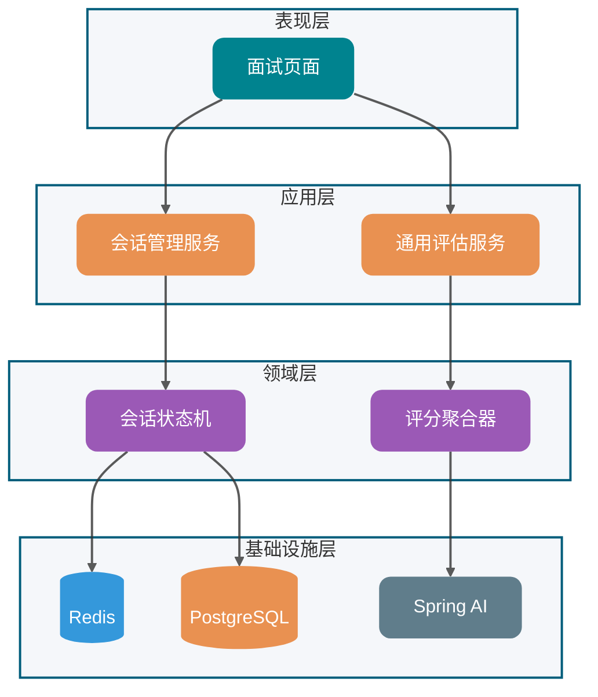
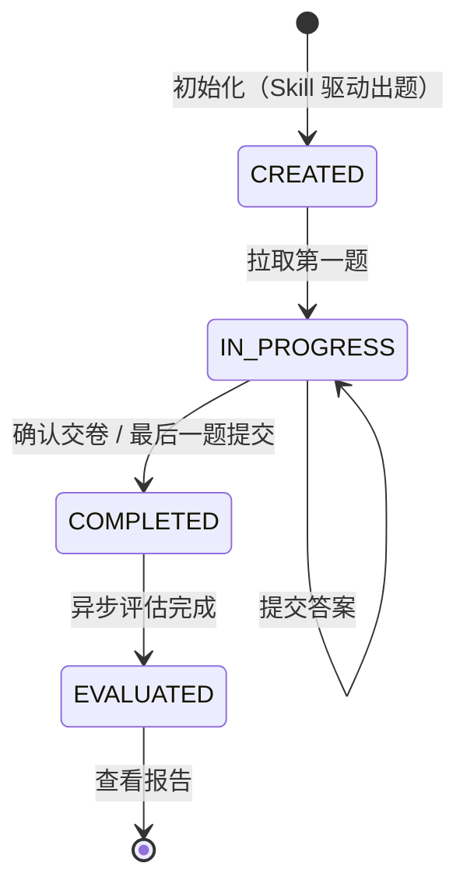
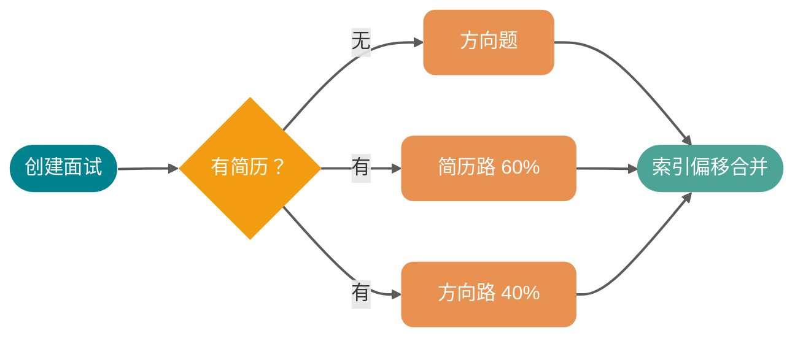
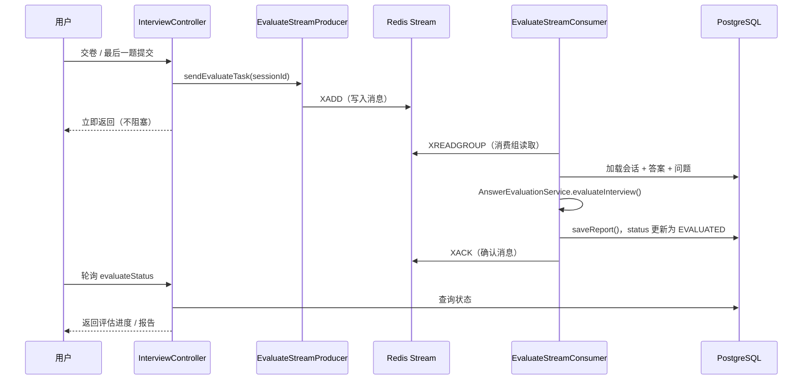

# ⭐模拟面试功能实现

大家好，我是 Guide。在 AI 辅助求职场景中，模拟面试需要解决如何**感知候选人背景、控制面试节奏以及产出专业评估报告**等问题。本文从业务架构与系统设计角度，探讨模拟面试功能的完整设计方案。

> **系列定位**：[《Spring AI 与大模型集成》](https://www.yuque.com/snailclimb/itdq8h/sitooa06s5qs7qd4)聚焦技术实现细节（ChatClient、Prompt 管理、Advisor 链等），[《Skill 驱动出题》](https://www.yuque.com/snailclimb/itdq8h/ikygop0vh7ubftpc)详细介绍 Skill 系统的架构设计与落地实现。如果你还不了解 Spring AI 的 ChatClient 和结构化输出机制，建议先看第一篇。本文不重复讲解这些基础概念。

先从一个用户视角的场景开始：用户打开页面，选择一个技术方向（比如 Java 后端），可选上传简历。系统用 30 秒左右生成一套面试题，每道题基于方向和简历背景量身定制。用户逐题作答，可以跳题、修改答案。点击交卷后，系统异步生成一份带逐题评分和总结的评估报告，大约一分钟后可查看。

本文解决三个核心问题：

| 问题域 | 核心挑战 | 方案关键词 |
| --- | --- | --- |
| **个性化出题** | 如何基于方向/简历生成针对性问题？ | Skill 驱动出题 + 简历并行双路 + 追问机制 |
| **交互体验** | 如何保证长流程的流畅性？ | 双层缓存 + 断点续答 |
| **专业评估** | 如何给出有价值的反馈？ | 分批评估 + 二次总结 + 评估基线 |

## 系统架构总览

下面这张图展示了系统的四层架构。重点关注数据流向：用户请求从表现层进入，经过应用层的会话管理和评估服务，最终到达基础设施层的 Redis、PostgreSQL 和 Spring AI：



## 有状态会话管理

### 为什么需要状态

大语言模型是无状态的，每次调用默认不携带上下文。在面试场景里，这是个根本性挑战——AI 不知道候选人是谁、已经问了哪些题、当前答到第几题。

最直觉的做法是把简历全文和历史对话每次都打进 Prompt。但这样有两个问题。第一，Token 成本随对话轮次线性增长——假设每轮对话约 500 Token，30 道题下来上下文会累积到 15000 Token，加上简历原文可能再加 3000-5000 Token，每次调用的成本会是第一轮的 30 倍以上。第二，LLM 对极长上下文的处理质量会下降，早期的题目和答案可能被"遗忘"（这个现象在学术上叫做 *Lost in the Middle*）。

本项目采用 **Stateful Session** 模式——业务状态由外部存储（Redis + PostgreSQL）维护，每次 AI 调用只注入本次所需的最小上下文。简历文本只在需要时注入（如出题、评估），日常答题交互只操作状态机和缓存。

### 有限状态机（FSM）设计

有限状态机（Finite State Machine，简称 FSM）是一种建模方式——系统在任意时刻只处于几种预定义状态之一，就像红绿灯只能是红、黄、绿中的一个，状态之间的切换由固定规则触发。面试的生命周期天然适合这个模型：一次面试只会处于"还没开始"、"正在答题"、"已交卷"、"已出分"这几种状态之一，且转换路径是单向不可逆的。

用 FSM 的核心动机是**防止非法操作**：没有状态约束，前端可以对一个已完成的会话重复提交答案，或者在会话还没开始时就发起评估请求。FSM 让每个操作只在合法状态下才能执行。

下面这张状态图展示了面试从创建到报告生成的完整生命周期，关注状态之间的单向流转：



| 状态 | 含义 | 触发动作 |
| :--- | :--- | :--- |
| **CREATED** | 题目已生成，等待候选人开始作答 | 拉取第一题时切换 |
| **IN\_PROGRESS** | 候选人正在答题，允许跳题和修改答案 | 提交最后一题 / 主动交卷 |
| **COMPLETED** | 答案采集完毕，异步评估任务已入队 | 异步评估任务完成 |
| **EVALUATED** | 报告已生成，会话终态 | 查看报告 |

有几个设计决策值得说明：

* **CREATED → IN\_PROGRESS** 的触发时机不是"点击开始"，而是**拉取第一题**（`getCurrentQuestion`），这样状态变更和实际操作原子对齐，不存在"已点开始但还没看题"的中间态；
* **IN\_PROGRESS → IN\_PROGRESS** 允许跳题和修改答案，每题通过 `PUT` 暂存、`POST` 最终提交，暂存不推进题号；
* **COMPLETED → EVALUATED** 由异步消费者触发，用户无法手动干预，是一条单向不可逆路径。

为了让状态与评估任务的进度解耦，实体上还有独立的 `evaluateStatus` 字段（`PENDING → PROCESSING → COMPLETED / FAILED`），用于前端轮询评估进度，与业务会话状态 `status` 是两条独立的状态线。

## 数据模型设计

### 核心实体关系

下面这张 ER 图展示了三张核心表的关系，注意 InterviewSession 是中心节点，Resume 可选关联（一次面试不一定有简历）：

```plain
┌─────────────────┐       ┌──────────────────────────────┐
│   Resume        │ 1──N  │      InterviewSession         │
│   (简历)         │       │          (会话表)             │
└─────────────────┘       │──────────────────────────────│
                          │ sessionId (唯一)              │
                          │ resumeId (可选)               │
                          │ skillId / difficulty          │
                          │ llmProvider                   │
                          │ status / evaluateStatus       │
                          │ totalQuestions / currentIndex │
                          │ questionsJson  ← 题目快照     │
                          │ overallScore / overallFeedback│
                          │ strengthsJson / improvementsJson│
                          └───────────────┬───────────────┘
                                          │ 1──N
                          ┌───────────────▼───────────────┐
                          │      InterviewAnswer           │
                          │          (答案表)              │
                          │───────────────────────────────│
                          │ question_index                 │
                          │ question / category            │
                          │ userAnswer / score / feedback  │
                          │ referenceAnswer / keyPoints    │
                          │ 唯一约束: (session_id, question_index) │
                          └───────────────────────────────┘
```

这里有两个值得关注的设计决策。

**第一，题目为什么存在 **`questionsJson`** 里，而不是单独一张题目表？**

题目在面试创建时就整体生成，后续只有读操作（每次拉取当前题），不存在局部更新的需求。如果单独建表，每次读取当前题要多一次 Join，出题后要批量插入 N 条记录。用 JSON 快照存储，读写都是整块操作，和实际使用模式完全吻合。追问的 `isFollowUp`、`parentQuestionIndex` 等字段都序列化在 JSON 里，不需要额外的关联查询。

**第二，答案表的唯一约束 **`(session_id, question_index)`** 是幂等设计的关键。**

用户可能在网络抖动时重复提交同一道题，评估任务也可能因失败而重试。有了这个唯一约束，答案写入统一走 upsert（存在就更新，不存在就插入），无论调用多少次结果都是确定的。这个约束还避免了评估报告"重复计分"的问题——`saveReport()` 直接更新已有记录的评分字段，而不是新增一条。

### 追问的线性展开

追问系统采用**线性展开**策略，将树状的问题结构（主问题 + 追问）扁平化为线性列表。主问题和追问按顺序排列，追问通过 `isFollowUp=true` 和 `parentQuestionIndex` 标注归属。

这个选择背后的权衡是：树形结构在渲染和评估上都需要递归处理，而线性列表让前端渲染（顺序遍历）、答题逻辑（统一索引推进）、评估聚合（按批次切分）都变得更简单。代价是牺牲了一些结构语义——但面试场景里并不需要动态调整追问树。

```json
[
  { "questionIndex": 0, "question": "MySQL 索引有哪些类型？", "type": "MYSQL", "isFollowUp": false },
  { "questionIndex": 1, "question": "请解释 B+ 树索引的查找过程。", "isFollowUp": true, "parentQuestionIndex": 0 },
  { "questionIndex": 2, "question": "Redis 支持哪些数据结构？", "type": "REDIS", "isFollowUp": false }
]
```

## 问题生成策略

### Skill 驱动 + 分类分配

问题生成的核心逻辑是 Skill 配置驱动的——每个 Skill 方向通过 `skill.meta.yml` 定义自己的分类（categories），每个分类有优先级（`ALWAYS_ONE`、`CORE`、`NORMAL`）和关联的参考题库（references）。`InterviewSkillService.calculateAllocation()` 根据分类优先级将总题数分配到各技术方向，Java 代码负责题数计算，LLM 只负责生成内容。

> Skill 系统的完整架构设计——`SKILL.md` 格式、Progressive Disclosure、分类分配算法、JD 解析——详见 [《Skill 驱动出题》](https://www.yuque.com/snailclimb/itdq8h/ikygop0vh7ubftpc)。本文聚焦出题在整体流程中的设计。

### 双路出题：最终方案

面试有两种模式：无简历时只考技术方向，有简历时要结合个人背景出针对性的问题。最直观的想法是在同一个 Prompt 里同时描述两件事——"按这个 Skill 出方向题，同时参考这份简历出个人题"。

实际上，这行不通。两类题的"出题语境"差太多：方向题需要 LLM 严格按照分类配额（MySQL 几道、Redis 几道）输出；简历题要 LLM 围绕"候选人简历里写过什么"展开。塞进同一份 Prompt，模型会被两套互相干扰的指令拽着走，结果就是两边都出得不像样子。

最终方案是\*\*拆成两次独立的 AI 调用，两路都用 \*\*`PlainChatClient`（不挂任何 Tool），在虚拟线程上并行执行；Skill 的参考内容由 Java 侧直接拼到 Prompt 里，不再让模型用工具调用拿。

下面这张图展示了出题的核心分支逻辑：无简历走单路，有简历走双路并行，最后通过索引偏移合并：



代码里两路都通过 `llmProviderRegistry.getPlainChatClient(llmProvider)` 拿 ChatClient，Skill 参考内容通过 `buildReferenceSection()` 批量注入 user prompt，Skill Persona 由 `buildSkillPersonaSection()` 拼到 system prompt。系统提示词里还有一句兜底指令："不要调用工具；请直接基于已提供的参考内容生成题目。"——这句话是为了防止某些 Provider 的"工具自动选择"特性偶发触发。

合并时，方向题的所有索引（`questionIndex`、`parentQuestionIndex`）需要整体加上简历题的数量——这是合并逻辑的关键细节，直接拼接会导致索引冲突。

降级策略也很重要：简历路失败时退化为全方向题，方向路失败时退化为全简历题，两路都失败时启动兜底题生成（按分类模板轮转）。核心原则是**宁可牺牲个性化，也要保证出题不中断**。

> **设计演进：为什么不用 Function Calling**：更早的版本里，方向路是挂着 `SkillsTool`（Spring AI 的 Function Calling 工具）来走的——让模型自己调工具拿"参考题库 + 分类配额"。看起来很优雅，跑起来发现一个隐蔽问题：**模型在执行 Function Call 时，会把工具的 JSON Schema 当成最高优先级的输出协议**，导致 Prompt 里关于"题型分布"、"避免重复"、"输出 JSON 格式"等指令被模型自动降权，结构化输出的解析失败率明显高于不挂工具的场景。这段经历直接催生了 PlainChatClient 的设计——只要要的是 JSON，就不挂工具。

### 历史问题去重

多次参加同一方向面试的候选人很容易遇到重复题目，这个体验很差。系统在出题时会注入最近 10 次同方向面试的历史题目，LLM 参考后避免重复。

去重数据用的不是纯文本，而是结构化的 `HistoricalQuestion(question, type, topicSummary)` 三元组。`type` 是技术分类键（如 `MYSQL`、`REDIS`），`topicSummary` 是 10 字以内的知识点摘要。这两个字段让 LLM 能做"语义层面"的去重（同一知识点换个问法也能识别），而不只是文本匹配。

去重注入的格式是按 `type` 聚合后格式化为"已考过的知识点"指令块，历史题目上限 60 条（只取主问题，排除追问）。

### 温度参数：当前实现与演进方向

温度（Temperature）调节模型输出的随机性，是影响 LLM 输出确定性的关键参数。

**当前实现**：项目通过 `LlmProviderRegistry` 构建 `ChatModel` 时统一设置 temperature，未显式配置的 Provider 走硬编码默认值 **0.2**（仅 Kimi Provider 显式设为 1.0）。也就是说，出题、追问、评分、评语等场景目前共享同一个温度值。

**演进方向**：面试不同阶段对确定性的需求其实不同，后续可以按场景细化温度配置：

| 场景 | 建议温度 | 原因 |
| --- | --- | --- |
| **出题** | 0.3 ~ 0.5 | 低温度保证题目规范、专业，避免生成偏题怪题 |
| **追问** | 0.5 ~ 0.7 | 适中温度允许根据用户回答生成个性化追问 |
| **评分** | 0.1 ~ 0.3 | 极低温度保证评分一致性和逻辑严谨性 |
| **评语** | 0.4 ~ 0.6 | 平衡专业性与可读性，避免评语千篇一律 |

实现方式可以是在 `LlmProviderRegistry` 的三种 Client 类型基础上，为每个 Service 方法增加 `ChatOptions` 覆盖，或在 Prompt 模板中定义场景级温度参数，由调用方按需注入。

## 存储方案：双层缓存与断点续答

面试是典型的长耗时、高频交互场景，一次面试可能持续 30-60 分钟，期间会有多次答案提交和题目切换。

当前实现以 PostgreSQL 为事实源：提交答案时先同步写入数据库，成功后再更新 Redis。Redis 负责会话热数据与断点续答，异步执行的是交卷后的评估任务。下面这张图展示了数据流向：



### 缓存键设计

`InterviewSessionCache` 维护两类缓存键，TTL 均为 24 小时：

| 键类型 | 格式 | 内容 | 用途 |
| --- | --- | --- | --- |
| **会话数据** | `interview:session:{sessionId}` | `CachedSession` JSON | 答题状态、进度、答案 |
| **简历映射** | `interview:resume:{resumeId}` | sessionId 字符串 | 快速查找未完成会话 |

简历映射键是断点续答的核心——用户重新进入时，系统先用 `resumeId` 查这个映射键拿到 `sessionId`，再加载会话数据，跳过了全表扫描。当会话完成或 TTL 到期时，映射键同步删除，避免脏数据。

下面这段代码做了三件事：先查映射键拿到 sessionId，再验证会话是否真的未完成，最后清理指向已完成会话的脏数据：

```java
public Optional<String> findUnfinishedSessionId(Long resumeId) {
    String key = buildResumeSessionKey(resumeId);
    String sessionId = redisService.get(key);
    if (sessionId != null) {
        Optional<CachedSession> sessionOpt = getSession(sessionId);
        if (sessionOpt.isPresent() && isUnfinishedStatus(sessionOpt.get().getStatus())) {
            return Optional.of(sessionId);
        } else {
            redisService.delete(key); // 映射指向已完成会话，清理掉
        }
    }
    return Optional.empty();
}
```

这里的 `delete(key)` 调用很关键——如果不做这步清理，下次查询还会命中这条过期数据，用户会被错误地导航到一个已完成的面试。

### 一致性策略与降级

关键状态变更（初始化、交卷）采用 **Write-Through with Degradation**（先写缓存再写数据库，DB 失败时降级）策略：先写 Redis 保证快速响应，再同步尝试写 PostgreSQL，DB 写入失败时记录 WARN 日志，不阻塞主流程。

这个设计的出发点是：面试是低价值事务，几秒的不一致窗口可接受，但高延迟不可接受。DB 是持久化的真相源——Redis 宕机或缓存丢失时，从 DB 全量重建会话，用户无感知。

| 故障场景 | 处理方式 |
| --- | --- |
| Redis 写入失败 | 返回错误给用户，操作终止 |
| DB 写入失败 | 记录 WARN 日志，用户无感知（以 Redis 为准继续） |
| Redis 宕机 | 降级直连 DB，延迟从 <10ms 增至 50~100ms |
| 缓存数据丢失 | 从 DB 反序列化重建会话，恢复至最后答题位置 |

## 评估报告生成策略

### 通用评估管线

评估逻辑被抽取到 `UnifiedEvaluationService`，文字面试和语音面试共享同一套管线。`AnswerEvaluationService` 现在只是一个薄适配器——把 `InterviewQuestionDTO` 转为通用的 `QaRecord`，调用统一评估服务，再把结果映射回面试报告格式。

这个抽取的直接收益是：两种面试模式的评分逻辑保持同步，改一处（比如调整评分权重）两边都生效，不存在"文字面试和语音面试评分标准不一致"的问题。

### 评估基线（Reference Baseline）

评估阶段会加载 Skill 方向对应的参考题库作为**评估基线**，为 LLM 提供评分的参考标准。它和出题阶段注入的 references 有本质区别：

* **出题阶段**：references 用于指导"出什么样的题"，上限 12000 字符，覆盖范围广；
* **评估阶段**：baseline 用于校准"打多少分算好"，上限 6000 字符，提炼的是答案标准。

如果 Skill 不存在或加载失败，baseline 为空字符串，LLM 凭自身知识评估——这是**可降级**的设计，评估不会因 Skill 配置问题而完全中断。

### 评分体系

评分权重定义在 Prompt 模板（`interview-evaluation-system.st`）里，不硬编码在 Java 中，修改权重无需重新部署：

| 维度 | 权重 | 说明 |
| --- | --- | --- |
| **准确性** | 40% | 答案是否正确，有无概念性错误 |
| **完整性** | 20% | 关键知识点覆盖是否全面 |
| **深度** | 25% | 是否能展开原理、结合实际场景 |
| **表达** | 15% | 逻辑是否清晰，表述是否准确 |

五档评分制：优秀（90-100）、良好（75-89）、及格（60-74）、不及格（40-59）、较差（0-39）。最终报告除整体分外，还会按技术栈分类聚合（MySQL 均分、Redis 均分等），以及输出 3-6 条优势和 3-6 条改进建议。

### 为什么要分批评估

一轮面试可能有 10 到 20 道题，最直觉的做法是把所有题目和回答塞进一个请求让模型评估。先看一组实际数据，确认"能不能装得下"：

**20 题全量评估的 Token 预估**（以默认模型 qwen3.5-flash 为例，上下文窗口 128K）：

| 组件 | 估算 Token 数 |
| --- | --- |
| System prompt（评分标准 + 安全指令 + JSON 格式约束） | ~1,050 |
| 简历摘要（代码上限 3000 字符） | ~2,000 |
| 评估基线（代码上限 6000 字符） | ~4,000 |
| 20 组 QA 记录（每题含问题 + 用户回答） | ~16,000 |
| **输入合计** | **~23,000** |
| 20 题的结构化评估输出（逐题 score/feedback/referenceAnswer + 批次级总评） | ~21,000 ~ 35,000 |
| **输入 + 输出合计** | **~44,000 ~ 58,000** |

输入侧 ~23K，距离 128K 上下文窗口还很远，**不会装不下**。真正的瓶颈在输出侧：大多数模型默认 max output tokens 是 4K-8K，20 题的结构化评估需要 ~21K-35K 输出 Token，**一定会被截断**。项目里也没设 `max_tokens`，走的是模型默认值——截断后 JSON 不完整，解析直接失败。

所以分批评估同时解决两个最核心的问题：

**输出 Token 不够**（最直接）。每批控制在较小规模（默认 8 道，通过环境变量 `APP_INTERVIEW_EVALUATION_BATCH_SIZE` 调整），单批输出 ~9K Token，在模型默认 max output tokens 范围内不会被截断。分批并不减少输入 Token（每批仍带简历摘要与评估基线），真正的收益在输出侧可控。

**结构化输出稳定性**（最常见）。批次评估走 `StructuredOutputInvoker`，每批要稳定产出固定形态的 JSON（逐题含 `score`、`feedback`、`referenceAnswer` 等字段）。一次塞进 20+ 道完整 Q\&A，JSON 节点一多，漏字段、格式错乱、解析失败的概率明显上升。单批体积小，`StructuredOutputInvoker` 的重试与降级也更好做。

**容错与降级粒度**。单批失败只影响该批题目，用 0 分与固定说明兜底，其余批次继续。如果一次性全量评估失败，整份报告都要重跑。

> **补充说明**：分批还有一个次要收益——推理均匀性。超长输入里模型对中段内容的注意力弱于头尾（*Lost in the Middle* 现象），分批让每道题都落在当前批的有效注意力区间内。

### 二次总结：从逐题评估到全局报告

下面这张流程图展示了从交卷到最终报告的完整管线，注意关键路径是"分批独立评估 → 逐题合并 → 二次总结"：


二次总结不是简单算术平均，而是让模型在**已逐题评估好的摘要**上做跨题归纳（例如多道题暴露同一类短板）。

| 阶段 | 输入要点 | 输出要点 |
| --- | --- | --- |
| **分批评估** | 每批子列表 Q\&A + 简历摘要 + 评估基线 | 每题分数与反馈、参考答案与要点；批次级中间总评与优劣势条目 |
| **二次总结** | 简历 + 基线 + `categorySummary`（按技术栈聚合平均分）+ `questionHighlights`（压缩摘要，限 20 条）+ 批次聚合的 fallback 文案 | 全局 `overallFeedback`、去重后的 strengths / improvements |

二次总结阶段喂入的是压缩后的数据——`questionHighlights`（题干截断约 50 字 + 单题反馈截断约 80 字，最多取前 20 题），以及按技术栈聚合的 `categorySummary`、各批拼起来的 fallback 文案。比再把完整问答全文塞一遍便宜得多。

降级策略分三层：

* **单批失败**：该批返回空报告，合并时用 0 分 + 固定说明兜底该批内题目，不阻塞其他批次。
* **二次汇总失败**：catch 后降级到批次聚合结果（拼接各批 `overallFeedback`、合并 strengths / improvements），无需整份报告重跑。
* **全部批次失败**：`evaluateBatch` 对每批返回 null 时，合并逻辑仍会为每道题填入 0 分与占位说明，并拼接默认综合句，仍会进入二次汇总——管线不会仅因"全批 null"而中断。

> **已知 tradeoff**：当前策略按题序固定步长切批，没有保证"主问题 + 追问"同批。默认 `follow-up-count` 为 1、批次为 8 时，主追问大概率同批。若把追问数调大，更稳妥的做法是按主问题组切批，保证整条追问链在同一批。面试中主动提这一点，能体现对边界条件的思考。

## 大规模评估的异步处理

### 为什么用 Redis Stream

评估任务通常耗时 10 秒以上（30 题的分批评估 + 二次总结）。同步等待会让用户在"交卷"这个操作上卡住很长时间，体验很差。

解耦方案有几种选择：

* `@Async` / 线程池：简单，但没有持久化，应用重启后任务丢失；
* Kafka / RabbitMQ：可靠，但引入了新的外部依赖；
* **Redis Stream**：项目已经依赖 Redis，Stream（Redis 5.0 引入的消息队列模型，支持消费组和消息确认）提供消息持久化和消费组语义，评估任务不会因应用重启而丢失，也不需要额外部署。

下面这张时序图展示了从用户交卷到报告生成的完整流程，注意"立即返回"和"异步评估"的分界点：



消费者的关键流程：`markProcessing`（状态 → PROCESSING）→ 加载 session 和答案 → `evaluateInterview` → `saveReport`（同时把 `status` 切为 `EVALUATED`）→ `markCompleted`（evaluateStatus → COMPLETED）→ XACK。

失败重试上限为 3 次（`retryCount` 字段随消息传递），超过后将 `evaluateStatus` 置为 FAILED 并写入错误信息到 `evaluateError` 字段（最长 500 字符），前端可展示具体失败原因。

### 虚拟线程与限流的权衡

项目使用 Java 21 虚拟线程，IO 等待期间线程资源几乎免费。但有一个常见的误区：**虚拟线程不解决外部 API 的限流问题**。

评估消费者如果大量并发，会瞬间向 LLM API（OpenAI、DashScope 等）发出数百个请求，触发 429 Too Many Requests。虚拟线程只是把瓶颈从"服务端线程数"转移到了"外部 API 限流策略"。

本项目通过 `@RateLimit` 注解（Redis + Lua 滑动时间窗口）对入口 API 做多维度限流：

| 接口 | 限流阈值 |
| --- | --- |
| 创建面试会话 | GLOBAL 5 次/秒 + IP 5 次/秒 |
| 提交答案 | GLOBAL 10 次/秒 |
| JD 解析 | IP 5 次/秒 |

限流 Lua 脚本保证每个维度（GLOBAL / IP / USER）的检查和扣减是原子操作，多个维度之间独立计数，各自有独立的滑动窗口。

## 总结

构建 AI 面试系统的关键在于**对业务逻辑的建模（状态机 + Skill 配置化）****以及****&#x5BF9;不确定性（LLM 输出）的结构化封装**。

几条实践建议：

* **逻辑剥离**：题数计算、分类分配、索引合并这类计算逻辑都由 Java 完成，不要指望 LLM 做精确计算；
* **配置驱动**：出题方向、分类权重、参考题库通过 Skill 配置文件管理，新增方向不改代码；
* **提示词版本化**：`.st` 模板文件纳入 Git 版本控制，调整权重、改变风格都有迹可查；
* **缓存优先**：高频交互场景下，Redis 热缓存对响应时延的影响远大于 SQL 优化；
* **评估可降级**：分批评估 + 二次总结 + 多层降级，单点故障不应让整个报告生成失败。

## 常见面试题

### 你们的面试系统用了状态机，为什么不直接用 if/else 判断当前状态？

> **追问**：会话状态 `status` 和评估任务状态 `evaluateStatus` 是两个独立字段，为什么要拆开？

**参考作答**：

if/else 判断当然能跑，但随着业务迭代会产生两个问题：一是防御性代码散落各处（比如"这里要先判断状态是否为 IN\_PROGRESS 才能提交答案"），改一个接口就要想想所有相关状态；二是非法操作要么被忽略、要么产生数据不一致（比如对已完成的会话重复交卷，导致评估任务被重复入队）。

状态机的价值是**把操作合法性的判断收敛到一个地方**。每个状态只允许固定的转换路径，非法状态直接抛 `BusinessException`。系统只有四个已知状态，每个状态下能做什么都是确定的。

关于两个状态字段：`status` 描述业务会话的生命周期（CREATED → IN\_PROGRESS → COMPLETED → EVALUATED），`evaluateStatus` 描述异步评估任务的执行进度（PENDING → PROCESSING → COMPLETED / FAILED）。用户交卷后 `status` 立刻变成 COMPLETED，但评估可能还需要 30 秒，期间 `evaluateStatus` 在 PROCESSING。如果合并成一个字段，就需要更多中间状态来描述"已交卷但评估中"，反而更复杂。

### 有简历时系统为什么要拆成两次独立的 AI 调用出题？

> **追问**：合并简历题和方向题时，题目索引是怎么处理的？

**参考作答**：

理论上可以用一个 Prompt，但方向题需要 LLM 严格按照分类配额输出，简历题要让 LLM 围绕"候选人简历里写过什么"展开，两种语境同时塞进一份 Prompt，指令互相干扰。

最终方案拆成两次独立调用，两路都用 `getPlainChatClient()`（不挂任何 Tool），Skill 参考内容由 Java 侧直接拼到 Prompt 里。两路用 `CompletableFuture` 在虚拟线程上并行 join，比串行执行节省约一半等待时间。

关于索引合并：两路独立生成的题目都从 `questionIndex = 0` 开始。合并时以简历路为基准，方向路整体加 `offset = 简历路列表展平后的总长度`（含追问行）。每条方向路题目的 `questionIndex` 和 `parentQuestionIndex` 都加上这个值——`parentQuestionIndex` 必须同步偏移，否则追问的归属关系会指向错误的主问题。

### 项目里 Redis 缓存和 PostgreSQL 同时写，一致性是怎么保证的？

> **追问**：断点续答是怎么实现的？为什么需要两种类型的缓存键？

**参考作答**：

采用 Write-Through with Degradation 策略：先写 Redis（快速响应），再同步尝试写 PostgreSQL，DB 写入失败时记录 WARN 日志，不阻塞主流程。面试是"低价值事务"——答题进度不一致的后果是用户重答几题，不是资金损失，所以可以接受几秒的不一致窗口。

断点续答依赖两种键的组合：会话键存完整会话状态，简历映射键存 sessionId 字符串。用户重新进入时，用 `resumeId` 查映射键拿到 `sessionId`，再加载完整会话。如果只有会话键，就要全表扫描所有键找到对应 resumeId 的会话——比直接一个 `GET` 命令查映射键慢得多。映射键相当于 resumeId → sessionId 的内存索引。

### 评估为什么要分批，二次总结具体做了什么？

> **追问**：如果 30 题被分成 4 批，每批独立评估，有没有可能第 1 批和第 3 批对同一个知识点给出了不同的评分标准？

**参考作答**：

分批主要解决两个问题：一是结构化输出的稳定性——单批题目过多时 JSON 形态复杂，漏字段、截断、解析失败概率上升；二是容错粒度——单批失败只影响该批题目，其余批次继续。

二次总结在 `UnifiedEvaluationService` 里：各批结果先合并成逐题的 `mergedEvaluations`，再单独调一次 LLM，输入压缩后的 `questionHighlights`（题干约 50 字 + 反馈约 80 字，最多 20 题）和 `categorySummary`（按技术栈聚合的平均分），生成全局 `overallFeedback` 和最终的 strengths / improvements。

关于批次间标尺漂移：独立批次确实可能带来松紧不一。缓解是每批都注入同一套评估基线和同一套 Prompt 权重表述。二次总结做叙事层归纳，不会回写修改各题原始分数。若业务要求强一致，需要额外设计标准化子步骤。


> 更新: 2026-07-24 15:26:50  
> 原文: <https://www.yuque.com/snailclimb/itdq8h/ges6m5r4a0aeh4r0>