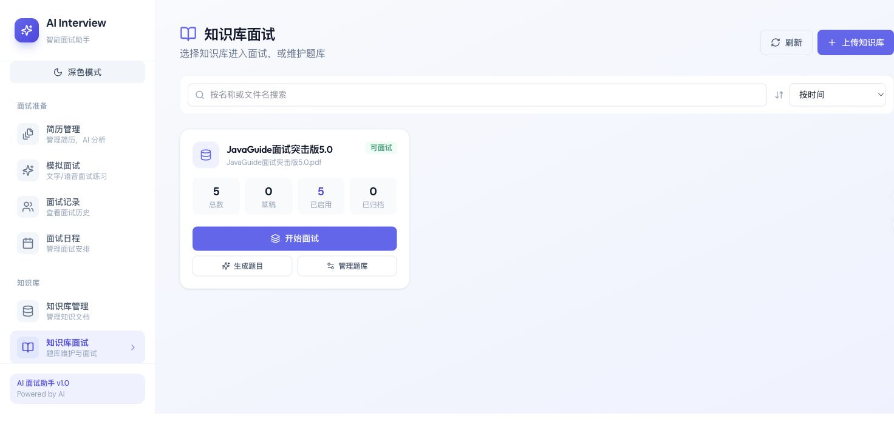
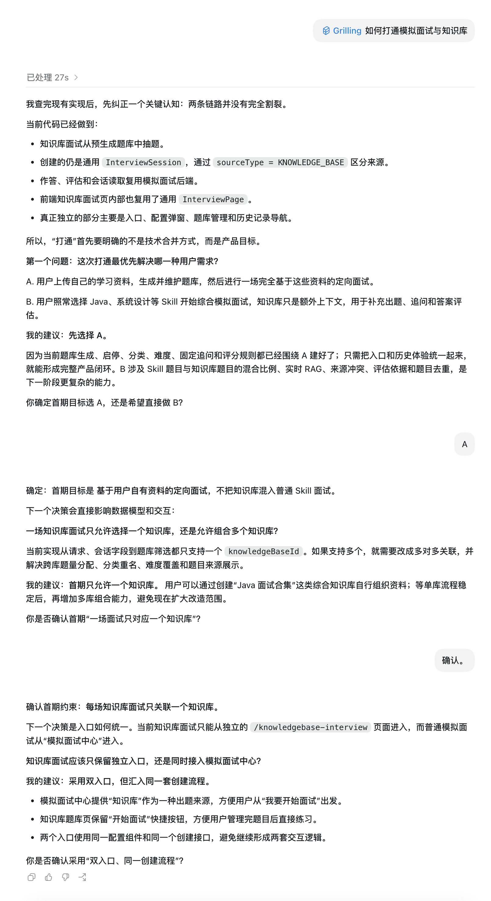
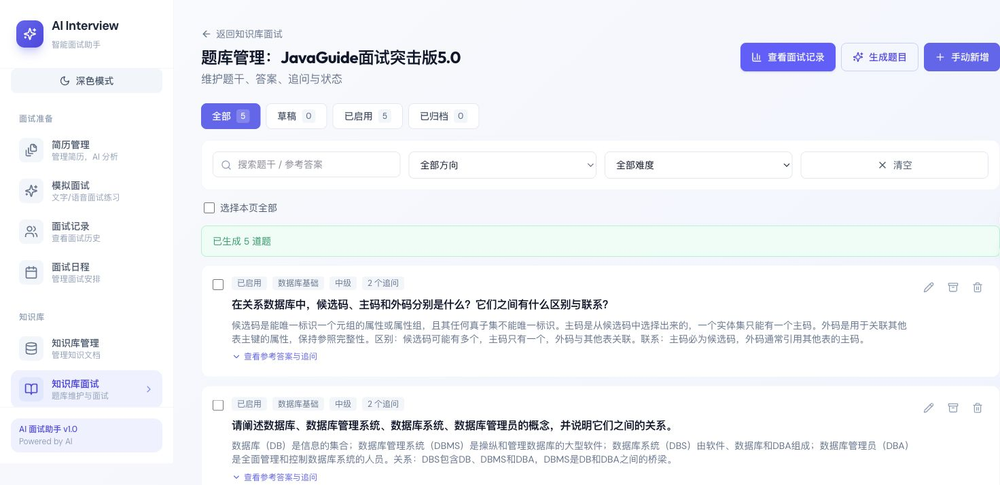
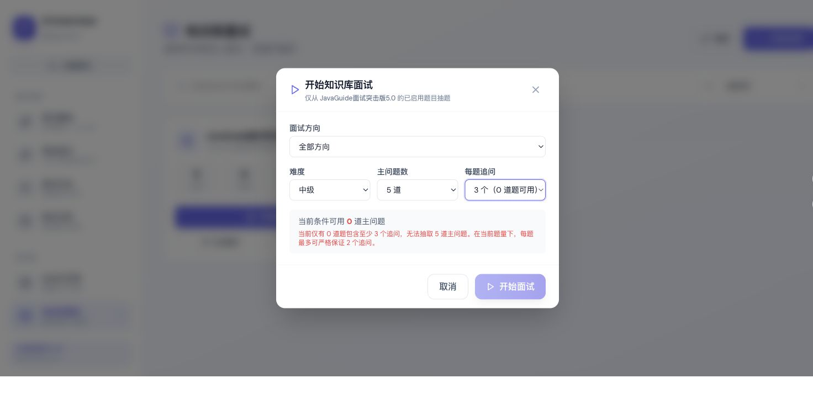
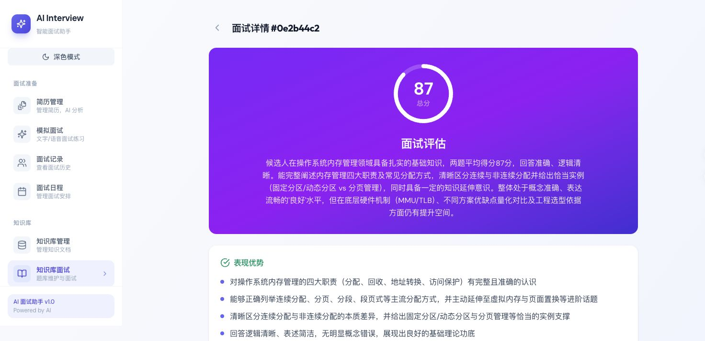

# ⭐️基于知识库面试

很多公司需要考察的内容，并不在通用面试题库里。

研发团队有自己的技术规范、架构方案和故障处理手册；客服与售后团队要熟悉产品文档、服务流程和常见问题；新员工培训、岗位认证、内部晋升也往往围绕公司已有资料展开。把这些内容整理成文档并不难，难的是如何持续把文档变成可用的题目，组织成一场面试，再给出有依据的评估结果。

通用题库适合考察 Java、Redis、MySQL 这类公共知识，但很难覆盖公司的具体项目和工作要求。让业务负责人手工维护整套题库又很费时间：每道题都要写参考答案、评分要点、评分规则和追问，资料更新后还要重新检查哪些题已经过期。

知识库面试希望解决的就是这段转换工作。公司先上传已有资料，系统从知识库中生成题库草稿；维护者审核并启用题目；员工或候选人完成面试后，系统再依据题库中的参考答案和评分规则生成报告。

这里有一个很容易被低估的问题：**题目生成参数与面试配置并不总是一致。**

例如，第一次生成题库时，每道主问题要求生成 2 个追问。等到正式开始面试，用户又在弹窗里选择了“每题追问 3 个”。旧实现允许继续创建，因为它会从追问池中尽量取：

```java
int n = Math.min(count, pool.size());
```

用户选择 3 个，题库里只有 2 个，最终的面试也只有 2 个。接口没有报错，页面能够继续，用户提交的配置却被静默降低了。

当前实现把两个阶段的语义分开处理：

* 生成题目时填写的追问数量是生成目标。模型可能少返回，维护者也可以在题库中增删追问。
* 开始面试时选择的追问数量是严格约束。每道入选主问题都必须提供足量的有效追问。

这条差异贯穿了整个实现：题库生成要允许人工修订，面试创建则必须兑现用户选择。

## 企业为什么需要知识库面试？

企业内部已经积累了大量可以用于培训和考核的内容，但文档本身无法直接回答三个问题：

1. 哪些内容适合转成面试题？
2. 一道题应该如何追问和评分？
3. 如何让不同批次的面试保持相对一致？

如果每次点击开始面试时都临时检索知识库并调用模型出题，题目会随着模型输出发生变化，维护者也没有机会提前检查参考答案和评分规则。一场面试结束后，想追溯“当时为什么这样评分”，只能依赖会话里临时生成的内容。

当前功能把知识库和面试之间增加了一层可维护题库。一次完整使用过程是：

1. 上传知识库并等待向量化完成。
2. 选择难度、题目数量、追问数量和方向数量，提交题库生成任务。
3. 在题库管理页审核题干、参考答案、评分要点、评分规则和追问。
4. 把确认可用的题目从 `DRAFT` 切换为 `ACTIVE`。
5. 按方向、难度、主问题数量和每题追问数量创建面试。
6. 完成作答，等待异步评估，再查看总分、逐题反馈和历史记录。

入口页会直接展示每个知识库的题目总数、草稿数、已启用数和已归档数。只有存在已启用题目的知识库，才进入可面试状态。`STALE` 题目会计入总数，但目前只在题库管理页单独统计和筛选。



这个首期范围是在开发前借助 `grilling` 这个 Skill 澄清出来的。

`grilling` 来自 [mattpocock/skills](https://github.com/mattpocock/skills)，不负责替项目写代码；它一次提出一个问题，把需求、依赖和取舍逐步问清楚。

围绕 [SpringAI 智能面试平台](https://mp.weixin.qq.com/s?__biz=Mzg2OTA0Njk0OA==\&mid=2247552320\&idx=1\&sn=a7e4e5a8d957446e6bb032d78b2fa5fb\&scene=21#wechat_redirect) 的知识库面试，它先确认首期是完全基于用户资料的定向面试，还是把知识库作为 Java、系统设计等通用 Skill 的补充上下文。前者可以直接复用已有题库、分类、难度、追问和评分规则；后者还要处理两类题目的混合比例、实时 RAG、来源冲突和评估依据，因此首期选择了纯知识库链路。

后续问题继续收紧范围：一场面试先绑定一个 `knowledgeBaseId`，暂不组合多个知识库；入口上保留知识库面试和普通模拟面试两个页面，底层继续复用 `InterviewSession`。这轮澄清没有改动代码，却提前确定了数据模型和复用方向，也解释了当前实现为什么以单知识库、独立入口和统一会话为主。



这套流程更适合重复使用的培训和考核场景。知识库负责限定内容范围，题库负责审核和状态管理，面试会话负责保存当次题目与答案，评估报告负责复盘。即使知识库后续更新，已经完成的面试仍然保留创建会话时的题目快照。

功能设计也因此有四个明确要求：

| 要求 | 对应实现 |
| --- | --- |
| 题目来源可控 | 只使用指定知识库召回的片段生成题目 |
| 题目可以维护 | 生成结果先进入 `DRAFT`，人工确认后再启用 |
| 面试配置可兑现 | 按实际有效追问数计算容量，不静默减少题目 |
| 评估依据可追溯 | 参考答案、评分要点和评分规则随会话保存 |

## 知识库题库如何生成？

知识库面试没有在用户点击“开始面试”时临时调用模型出题。临时生成会把向量检索、LLM 调用和会话创建塞进同一个请求，用户需要等待完整生成过程，题目也没有人工审核机会。

项目先把知识库内容转换成题库草稿，再从已启用题目中抽题。这样可以单独修改题干、参考答案和评分规则，也能停用不合适的题。



一道知识库题目包含以下数据：

| 字段 | 用途 |
| --- | --- |
| `difficulty` | 按初级、中级、高级筛选 |
| `category` | 面试方向，例如 Redis、JVM 调优 |
| `question` | 主问题题干 |
| `referenceAnswer` | 主问题参考答案 |
| `keyPointsJson` | 评分要点 |
| `scoringRubric` | 10 分制评分规则 |
| `followUpsJson` | 追问题目及各自的答案、要点和评分规则 |
| `sourceContext` | 生成题目时使用的知识库片段 |
| `kbContentHash` | 生成时的知识库内容哈希 |
| `status` | `DRAFT`、`ACTIVE`、`ARCHIVED` 或 `STALE` |

主问题和追问使用同一套评分信息。追问不是临时拼接的一句话，它也有参考答案、评分要点和评分规则：

```java
public record KnowledgeBaseQuestionFollowUpDTO(
    String question,
    String referenceAnswer,
    List<String> keyPoints,
    String scoringRubric
) {
}
```

### 从知识库片段到题库草稿

生成任务通过 Redis Stream 异步执行。HTTP 请求只负责校验知识库、保存生成参数并创建 `QUEUED` 任务，然后投递 `knowledgeBaseId + taskId`。Consumer 原子领取任务后进入 `PROCESSING`，读取参数快照，完成向量检索和 LLM 调用；生成结果最终通过一个短事务替换旧题，并把任务更新为 `COMPLETED`。

生成参数包括难度、主问题数量、每题追问数、方向数量和模型提供商。后端接口允许主问题数量为 1～30 道、每题追问数为 0～5 个、方向数量为 1～5 个；当前页面通过下拉框提供常用选项，题量为 3、5、10、15，追问数为 0～3，方向上限为 1、2、3、5。这份配置会和 `taskId` 一起保存在知识库中，页面刷新或服务重启后仍然能够恢复任务状态，也能在题库管理页显示最近一次生成目标。

生成服务没有把整份知识库直接放进 Prompt，而是使用四组固定查询召回内容：

```java
private List<String> buildGenerationQueries() {
  return List.of(
      "核心概念 定义 背景 原理",
      "关键流程 步骤 方法 工作机制",
      "规则约束 条件 边界 例外 限制",
      "典型案例 常见问题 应用场景 最佳实践"
  );
}
```

每组查询最多取 4 个片段，总数最多 12 个；相同文本会被去重，最终上下文截断在 5000 个字符。四组查询分别覆盖原理、流程、限制和实践，避免生成结果只集中在概念定义上。

如果没有召回任何有效内容，服务直接返回 `KNOWLEDGE_BASE_QUERY_FAILED`。缺少知识库上下文时继续生成，题目就可能来自模型自身知识，失去“基于指定知识库面试”的含义。

Prompt 除了知识库片段，还会带上已有方向和最近 20 道同难度题目。已有方向用于控制分类名称，已有题目用于提醒模型换一个知识点或考察角度。知识库内容会先经过 `PromptSanitizer`，再放进明确的数据边界中，降低文档内容被当成系统指令执行的风险。

LLM 返回的结构包括主问题、方向、知识点摘要、参考答案、评分要点、评分规则和追问：

```java
record QuestionDTO(
    String category,
    String type,
    String question,
    String topicSummary,
    String referenceAnswer,
    List<String> keyPoints,
    String scoringRubric,
    List<KnowledgeBaseQuestionFollowUpDTO> followUps
) {
}
```

项目使用 `BeanOutputConverter` 和统一的 `StructuredOutputInvoker` 处理结构化输出。模型结果落库前还会经过清洗：

* 空题干和同批重复题被跳过。
* 空方向回退为知识库名称。
* 空追问题干不计入有效追问。
* 超过目标数量的追问被截断。
* 少于目标数量的有效追问仍然保存。
* 所有生成题默认进入 `DRAFT`。

追问清洗的实现只截断超出的部分，不会因为数量不足而丢弃主问题：

```java
private String writeFollowUps(
    List<KnowledgeBaseQuestionFollowUpDTO> values,
    int followUpCount
) {
  try {
    List<KnowledgeBaseQuestionFollowUpDTO> sanitized =
        values == null ? List.of() : values.stream()
            .filter(value -> value != null
                && value.question() != null
                && !value.question().isBlank())
            .map(value -> new KnowledgeBaseQuestionFollowUpDTO(
                value.question().trim(),
                trimToNull(value.referenceAnswer()),
                value.keyPoints() == null
                    ? List.of()
                    : value.keyPoints().stream()
                        .filter(item -> item != null
                            && !item.isBlank())
                        .map(String::trim)
                        .toList(),
                trimToNull(value.scoringRubric())
            ))
            .limit(followUpCount)
            .toList();
    return objectMapper.writeValueAsString(sanitized);
  } catch (JacksonException e) {
    throw new BusinessException(
        ErrorCode.INTERNAL_ERROR,
        "序列化追问字段失败",
        e
    );
  }
}
```

“追问不足仍保存”是有意保留的行为。假设要求生成 3 个追问，模型只返回 2 个，题干、参考答案和已有追问可能仍然可用。维护者可以在题库中补写第 3 个，没必要丢掉整道题。

这也说明生成目标不能直接用于判断面试容量。正式面试看的是题库当前实际拥有多少个有效追问。

### 异步生成如何避免旧任务覆盖新题？

题目生成可能持续几十秒。期间会遇到重复点击、消息重复消费、Worker 重启，以及旧任务比新任务更晚返回等情况。

项目在知识库上保存 `questionGenTaskId` 和任务状态：

```latex
NONE → QUEUED → PROCESSING → COMPLETED
                         ↘ FAILED
```

Consumer 领取任务时，必须同时满足：

1. 消息里的 `taskId` 等于知识库当前保存的 `taskId`。
2. 当前状态仍然是 `QUEUED`。

保存题目之前还会再次校验同一个任务是否处于 `PROCESSING`。如果用户已经提交了新任务，旧 Worker 即使完成 LLM 调用，也不能删除或覆盖新任务的结果。

向量检索和 LLM 调用都在事务外执行。数据库事务只负责最后三件事：

```java
@Transactional(rollbackFor = Exception.class)
public boolean replaceQuestionsAndComplete(
    Long knowledgeBaseId,
    String taskId,
    List<KnowledgeBaseQuestionEntity> questions,
    int skippedCount
) {
  KnowledgeBaseEntity kb =
      lockKnowledgeBaseOrNull(knowledgeBaseId);

  if (!matches(
      kb,
      taskId,
      QuestionGenStatus.PROCESSING
  )) {
    return false;
  }

  questionRepository.deleteByKnowledgeBaseId(
      knowledgeBaseId
  );
  questionRepository.saveAll(questions);

  kb.setQuestionGenStatus(
      QuestionGenStatus.COMPLETED
  );
  kb.setQuestionGenSavedCount(questions.size());
  kb.setQuestionGenSkippedCount(skippedCount);
  return true;
}
```

删除旧题、保存新题和更新完成状态会一起提交。保存失败时整体回滚，不会出现“题目已经替换，页面却仍然显示生成中”的中间状态。

定时恢复任务每 60 秒扫描一次。`QUEUED` 超过 2 分钟会重新投递，`PROCESSING` 超过 20 分钟会先恢复为 `QUEUED` 再投递。这两个阈值目前写在代码中，生产环境更适合改成配置项。

## 追问数量如何严格校验？

假设当前有 5 道中级启用题，每道题都只有 2 个有效追问。用户计划抽 5 道主问题时，可用容量如下：

| 每题追问数 | 可用主问题数 | 能否开始 |
| ---: | ---: | --- |
| 0 | 5 | 可以 |
| 1 | 5 | 可以 |
| 2 | 5 | 可以 |
| 3 | 0 | 不可以 |
| 4 | 0 | 不可以 |
| 5 | 0 | 不可以 |

开始面试弹窗会请求容量接口：

```latex
GET /api/knowledgebase/{id}/interview-capacity
    ?category=Redis
    &difficulty=mid
    &mainQuestionCount=5
```

后端只读取指定难度下的 `ACTIVE` 题目，并过滤题干为空的追问。然后分别计算 0～5 个追问对应的可用主问题数：

```java
List<FollowUpOption> followUpOptions =
    IntStream.rangeClosed(0, MAX_FOLLOW_UP_COUNT)
        .mapToObj(count -> {
          int availableCount = (int) scopedSources.stream()
              .filter(source ->
                  source.followUps().size() >= count)
              .count();

          return new FollowUpOption(
              count,
              availableCount,
              mainQuestionCount > 0
                  && availableCount >= mainQuestionCount
          );
        })
        .toList();
```

`availableQuestionCount` 的含义是：当前方向和难度下，有多少道主问题至少包含 `count` 个有效追问。只有可用题数不少于计划抽取的主问题数，当前选项才会被标记为 `selectable`。

容量接口会返回 0～5 个追问的完整矩阵。当前前端只展示 0～3 这四个常用选项，并据此禁用不满足条件的追问数量，在选项旁展示可用题数：

```tsx
<option
  key={count}
  value={count}
  disabled={!optionCapacity?.selectable}
>
  {count} 个
  （{optionCapacity?.availableQuestionCount ?? 0} 道题可用）
</option>

```

如果每道启用题确实只有 2 个追问，“每题 3 个追问”会显示 0 道题可用，开始按钮也会被禁用。



生成目标为 2 不代表以后永远不能选择 3。维护者可以给部分题目补充追问；只要当前实际数据满足要求，容量接口就会放开 3 个追问的选项。

前端校验后，创建会话时后端还会重新检查：

```java
List<QuestionSource> candidates =
    toQuestionSources(raw).stream()
        .filter(source ->
            source.followUps().size() >= followUpCount)
        .toList();

if (candidates.size() < mainCount) {
  throw new BusinessException(
      ErrorCode.INTERVIEW_QUESTION_INSUFFICIENT,
      buildInsufficientMessage(
          mainCount,
          candidates.size(),
          category,
          difficulty,
          followUpCount
      )
  );
}
```

容量查询与创建请求之间存在时间差，题目可能被修改、删除或停用，接口也可能绕过前端直接调用。因此，前端容量矩阵负责提前提示，后端错误码 `3009` 负责维护最终约束。

这里已经移除了旧实现的 `Math.min` 降级策略。用户选择每题 3 个追问，最终创建出来的每道主问题就必须有 3 个追问；不足时直接拒绝创建。

## 面试会话如何组装？

容量校验通过后，`KnowledgeBaseInterviewService` 会打乱候选主问题，截取指定数量，再为每道主问题随机抽取严格数量的追问：

```java
List<QuestionSource> selected =
    new ArrayList<>(candidates);
Collections.shuffle(selected);

List<InterviewQuestionDTO> questions =
    buildQuestions(
        selected.subList(0, mainCount),
        followUpCount
    );
```

追问池大于请求数量时，代码使用 Fisher-Yates 局部洗牌抽取；追问池不足时抛出 `INTERVIEW_QUESTION_INSUFFICIENT`：

```java
private List<KnowledgeBaseQuestionFollowUpDTO> pickFollowUps(
    List<KnowledgeBaseQuestionFollowUpDTO> pool,
    int count
) {
  if (count <= 0) {
    return List.of();
  }

  if (pool == null || pool.size() < count) {
    throw new BusinessException(
        ErrorCode.INTERVIEW_QUESTION_INSUFFICIENT,
        "追问池在组装面试时发生变化，无法严格抽取 "
            + count + " 个追问"
    );
  }

  // 省略局部洗牌代码
  return copy.subList(0, count);
}
```

主问题和追问统一转换为 `InterviewQuestionDTO`。主问题保存参考答案、评分要点、评分规则和来源上下文；追问额外使用两个字段保留父子关系：

* `isFollowUp`：当前题是否为追问。
* `parentQuestionIndex`：对应主问题在会话中的索引。

组装时先记录主问题位置，再把抽中的追问指向它：

```java
int mainIndex = questions.size();

questions.add(
    InterviewQuestionDTO.fromQuestionBank(
        mainIndex,
        entity.getQuestion(),
        entity.getType(),
        entity.getCategory(),
        entity.getTopicSummary(),
        entity.getReferenceAnswer(),
        source.keyPoints(),
        entity.getScoringRubric(),
        entity.getSourceContext()
    )
);

for (KnowledgeBaseQuestionFollowUpDTO followUp : picked) {
  questions.add(new InterviewQuestionDTO(
      questions.size(),
      followUp.question(),
      entity.getType(),
      entity.getCategory(),
      entity.getTopicSummary(),
      null,
      null,
      null,
      true,
      mainIndex,
      followUp.referenceAnswer(),
      followUp.keyPoints(),
      followUp.scoringRubric(),
      entity.getSourceContext()
  ));
}
```

答题页面目前按线性顺序展示：主问题后面紧跟它抽中的追问。父子索引保留了题目结构，后续可以按主问题统计得分，或者根据主问题回答动态选择追问。

组装完成后，知识库面试复用普通文字面试的会话、答案和报告能力，只额外保存三个来源字段：

```latex
sourceType = KNOWLEDGE_BASE
knowledgeBaseId = 当前知识库 ID
interviewCategory = 本次选择的方向
```

`category` 为空表示从全部方向抽题，历史记录会显示“全部方向”。题目列表、当前进度和答案会持久化到数据库，并同步缓存到 Redis。正式提交答案时先落库，再更新缓存；缓存未命中时，可以根据数据库中的会话和答案恢复未完成会话。

## 答案如何异步评估？

每次提交答案时，后端先保存答案和当前题目索引。如果还有下一题，接口直接返回下一道 `InterviewQuestionDTO`；最后一题提交完成后，会话状态变为 `COMPLETED`，评估状态变为 `PENDING`，随后向评估 Stream 投递 `sessionId`：

```java
if (newStatus == SessionStatus.COMPLETED) {
  sessionCache.updateSessionStatus(
      request.sessionId(),
      SessionStatus.COMPLETED
  );
  enqueueEvaluationTask(request.sessionId());
}

private void enqueueEvaluationTask(String sessionId) {
  persistenceService.updateEvaluateStatus(
      sessionId,
      AsyncTaskStatus.PENDING,
      null
  );
  evaluateStreamProducer.sendEvaluateTask(sessionId);
}
```

这里有两个完成状态：

* `SessionStatus.COMPLETED` 表示所有题目已经回答完。
* `evaluateStatus = COMPLETED` 表示评估报告已经生成。

历史记录中的“已完成”以 `evaluateStatus = COMPLETED` 为主，同时兼容旧会话的 `EVALUATED` 状态。这样可以避免仍在评估的面试提前进入完成数量，用户点开后却看不到报告。

评估 Consumer 会从会话中恢复问题列表，从答案表恢复用户答案，再调用统一评估服务。知识库题目的参考答案、评分要点和评分规则会拼成评估上下文：

```java
private String buildQuestionReferenceContext(
    List<InterviewQuestionDTO> questions
) {
  StringBuilder sb = new StringBuilder();

  for (InterviewQuestionDTO question : questions) {
    if (!hasQuestionReference(question)) {
      continue;
    }

    sb.append("问题")
        .append(question.questionIndex() + 1)
        .append(": ")
        .append(question.question())
        .append('\n');

    appendIfPresent(
        sb,
        "参考答案",
        question.referenceAnswer()
    );

    if (question.keyPoints() != null
        && !question.keyPoints().isEmpty()) {
      sb.append("评分要点: ")
          .append(String.join("；", question.keyPoints()))
          .append('\n');
    }

    appendIfPresent(
        sb,
        "评分规则",
        question.scoringRubric()
    );
  }

  return sb.toString();
}
```

评估结果包含总分、分类得分、逐题反馈、优势、改进项和参考答案。评估服务会汇总会话快照中所有题目的参考答案、评分要点和评分规则，没有参考信息的题目会被跳过。只有整场面试都没有参考信息时，服务才尝试按会话的 `skillId` 加载 Skill 评估上下文。知识库面试当前使用没有业务含义的占位 `skillId`，加载不到对应 Skill 时会降级为无额外参考上下文。



最后一题提交后，前端进入“正在生成面试评估”页面，每 3 秒查询一次详情。省略页面中的状态辅助函数后，处理逻辑如下：

```tsx
const detail =
  await historyApi.getInterviewDetail(sessionId);

if (detail.evaluateStatus === 'COMPLETED') {
  navigate(
    `/knowledgebase-interview/${kbId}`
      + `/interviews/${sessionId}`,
    { replace: true }
  );
  return;
}

if (detail.evaluateStatus === 'FAILED') {
  setEvaluationError(
    detail.evaluateError
      || '面试评估失败，请前往面试记录查看'
  );
  return;
}

timer = setTimeout(pollEvaluation, 3000);
```

`PENDING` 和 `PROCESSING` 状态继续等待，`COMPLETED` 自动打开本次报告，`FAILED` 显示明确错误。轮询使用递归 `setTimeout`，上一次请求结束后才安排下一次，接口响应较慢时不会堆积多个请求。

## 工程取舍与验证

把知识库接到面试流程上，代码层面可以很快做出“检索内容并生成问题”的演示版本。真正进入重复使用的企业场景后，几处取舍会直接影响题库能不能维护、面试结果能不能解释。

| 设计问题 | 当前选择 | 考虑 |
| --- | --- | --- |
| 什么时候生成题目 | 提前生成题库草稿 | 避免开始面试时长时间等待，也给维护者审核机会 |
| 生成不足的追问怎么处理 | 保留草稿并提示不足 | 已生成的题干和答案仍可编辑，不浪费有效内容 |
| 正式面试能否少取追问 | 不允许静默减少 | 面试题量、时长和用户配置保持一致 |
| 是否新建一套面试系统 | 复用普通文字面试会话 | 答案保存、缓存恢复、评估和报告只维护一套 |
| 重新生成如何处理旧题 | 当前整库替换 | 实现清晰，但人工维护结果可能被覆盖，后续需要增量策略 |

其中最容易混淆的是“保留不完整草稿”和“拒绝不完整面试”。生成阶段允许模型少返回追问，是为了给人工维护留空间；面试阶段拒绝追问不足，是为了保证实际题量与配置一致。两个阶段采用不同规则，分别服务题库维护和正式考核。

复用普通文字面试也减少了重复实现。知识库模块负责题目来源和组卷，进入 `InterviewSessionDTO` 之后，答案保存、会话恢复、异步评估和报告展示都沿用已有能力。会话额外保存 `sourceType`、`knowledgeBaseId` 和 `interviewCategory`，历史记录仍然能够按知识库和方向筛选。

当前整库替换策略则有明显限制。重新生成题目时，`replaceQuestionsAndComplete` 会删除该知识库下的旧题。如果维护者已经手工修改了参考答案或评分规则，再次生成可能覆盖这些结果。面向长期使用时，更合理的方向是增加生成批次和来源类型，只替换未编辑草稿，人工题和历史已使用题目继续保留。

测试主要围绕异步任务和严格容量展开：

* 活动任务存在时拒绝重复提交。
* 重复消息只能被一个 Consumer 领取。
* 旧 `taskId` 不能替换题目或更新完成状态。
* 执行失败时可以恢复为 `QUEUED` 后重试。
* 追问多于生成目标时截断，少于目标时保留草稿。
* 空白追问题干不计入面试容量。
* 追问池不足时返回 `INTERVIEW_QUESTION_INSUFFICIENT`。
* 追问池足够时随机抽取恰好 N 个追问。
* 容量按方向和难度过滤。

前端测试覆盖容量提示、历史完成统计和评估完成跳转，共 13 项通过，生产构建通过。

浏览器回归还完成了一次真实流程：创建知识库面试、完成作答、停留在评估等待页、评估完成后自动进入详情，并正常展示 73 分和逐题评价。评估期间的新记录没有提前计入“已完成”，主流程页和记录页控制台错误均为 0。

目前还有四处需要继续处理：

1. 重新生成会删除该知识库下的旧题。后续可以增加生成批次和题目来源，区分人工题、生成草稿和历史已使用题目，支持增量生成。
2. 批内去重只处理归一化题干相同的情况，还没有检测语义相近的问题。
3. `kbContentHash` 和 `STALE` 状态已经存在，但知识库内容变化后还没有自动标记旧题。
4. 评估成功流程经过了浏览器回归，真实 LLM 失败、Redis 投递失败和报告保存失败仍需要端到端验证。

## 小结

知识库面试的实现重点不在“调用模型生成几道题”，而在生成之后能否兑现用户选择：

* 题目先进入可编辑的草稿，只有 `ACTIVE` 题目能参与面试。
* 生成追问数只是目标，面试追问数按当前有效数据严格校验。
* 前端展示容量，后端用错误码 `3009` 维护最终约束。
* 主问题、追问、参考答案和评分规则一起进入会话快照。
* 答题结束后异步评估，前端根据评估状态进入报告页。

所以，“生成 2 个追问，却可以选择 3 个开始面试”在旧实现中能够运行，是因为 `Math.min` 把用户选择当成了上限。当前实现已经移除静默降级：题库里没有足够的追问，系统就不会创建这场面试。


> 更新: 2026-08-10 17:45:52  
> 原文: <https://www.yuque.com/snailclimb/itdq8h/dfi98e7yq0arozs7>