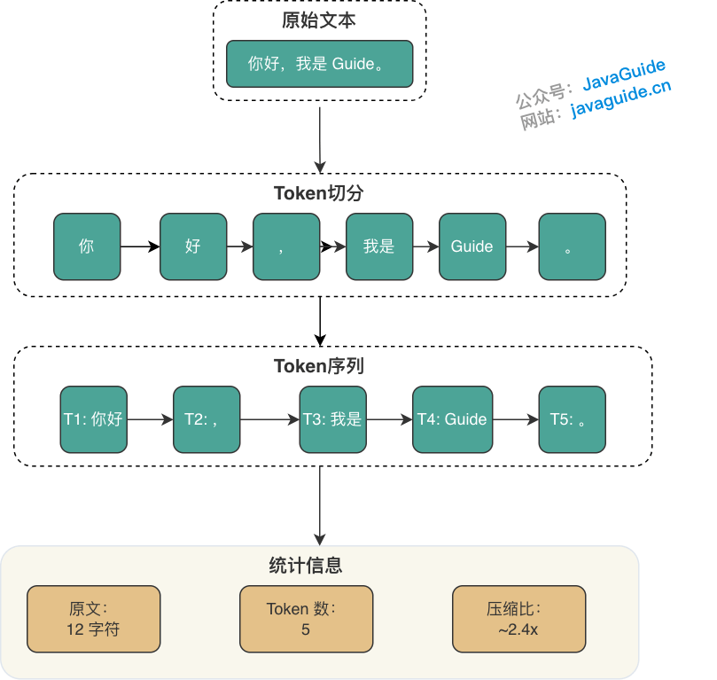
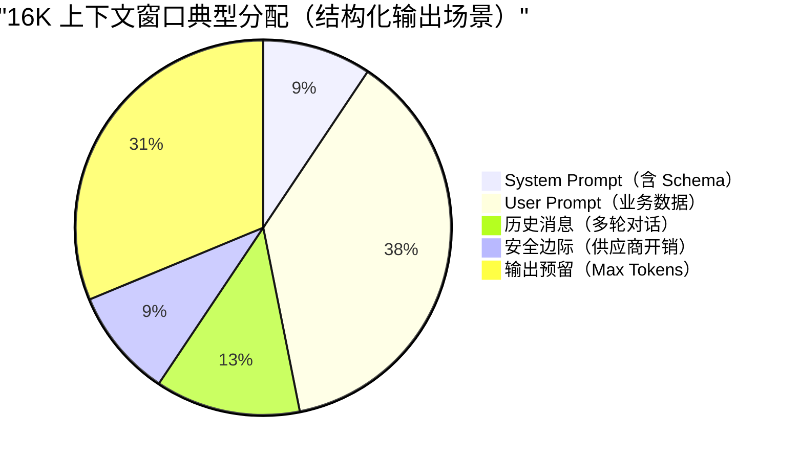

# 万字详解大模型核心概念：Token、Temperature、上下文窗口、Prompt 工程、结构化输出

大家好，我是 Guide。在使用 Spring AI 开发大模型应用时，你是否遇到过这些问题：为什么同一个 Prompt 每次输出结果不一样？上下文窗口 128K 到底能放多少内容？Temperature 设成多少才能稳定输出 JSON？RAG 检索效果不好该怎么调优？

这些问题的答案，都藏在大模型的核心概念里。**理解这些概念，是从"会用 API"进阶到"能调优、能排查问题"的关键一步。**

本文将从工程实践角度，系统梳理 Token、上下文窗口、解码参数、Prompt 工程、结构化输出、Embedding 和 RAG 等核心概念。每个概念都会结合本项目的实际应用场景，帮你建立"概念 → 参数 → 代码"的完整认知链路。

> **与**[《Spring AI 与大模型集成》](https://www.yuque.com/snailclimb/itdq8h/sitooa06s5qs7qd4)**的关系**：这篇文章聚焦于 Spring AI 的技术实现细节（ChatClient、Prompt 模板管理等），本文则是"前置知识储备"，帮你理解那些配置参数背后的原理与权衡。

## 大模型（LLM）到底在做什么

### Token

**Token** 是模型处理文本的基本单位，通常由子词（subword）切分算法（如 BPE/Unigram）产生。它不是“一个字”或“一个词”的严格等价物：

* 英文可能一个单词被拆成多个 Token；
* 中文可能一个词被拆成多个 Token，也可能多个字合并成一个 Token（取决于词频与词表）。

因此，工程上通常只用 **经验估算** 做容量规划，而用 **实际 API 返回的 usage**（若供应商提供）做精确计费与监控。

**经验估算（仅用于粗略规划）**：

* 英文：1 Token 大约对应 3~4 个字符（与文本类型相关）。
* 中文：1 Token 常见在 1~2 个汉字上下波动（与混排比例强相关）。

**💡**\*\* 成本趋势提示\*\*：Token 成本与编码器（Tokenizer） 版本强相关。早期模型（如 GPT-3.5）中文压缩率较低（约 1 字 1.5~2 Token）。但新一代模型（如 GPT-4o, Qwen2.5）词表扩容至 200k+，中文常用词已被收录为单个 Token，压缩率显著提升（趋近 1 字 1 Token）。**在做成本预算时，请务必查阅当前模型版本的官方 Tokenizer 演示，勿沿用旧模型经验。**

Token 划分的精细度会直接影响模型的理解能力。特别是在中文处理时，多音字和词组的划分需要更细致的策略。

**Token 化过程示例**：

* 原文：`你好，我是 Guide。`
* 切分：`[你好]` `[，]` `[我是]` `[Guide]` `[。]`
* 统计：原文 12 字符 -> Token 数 5 个 -> 压缩比 ~2.4x



> **⚠️**\*\* 注意\*\*：实际的 Token 切分由模型供应商的 Tokenizer 实现，不同供应商对相同文本可能产生不同的 Token 序列。生产环境中应使用对应供应商的 Tokenizer 工具进行精确计数。

### 上下文窗口（Context Window）

**上下文窗口**（或称“上下文长度”）是 LLM 的\*\*“工作记忆”（Working Memory）\*\*。它决定了模型在任何时刻可以处理或“记住”的文本量（以 Token 为单位）。

* **对话连续性**：它决定了模型能进行多长的多轮对话而不遗忘早期细节。
* **单次处理能力**：它决定了模型一次性能够处理的最大文档、代码库或数据样本的大小。

“模型支持 128K/200K/1M"指的是 **一次调用**里能放进模型的总 Token 上限。**注意它包含输入与输出的总和**，且往往被隐形成本占用：

* **System Prompt**：调节模型行为的系统指令（通常对用户隐藏，但占用窗口）。
* **User Prompt**：业务数据与指令。
* **多轮对话历史**：过往的消息记录。
* **RAG 检索片段**：从外部知识库检索到的补充信息。
* **工具调用 Schema**：函数定义与参数结构。
* **格式开销**：特殊字符、换行符、Markdown 标记等。
* **模型生成的输出 Token**：**（关键）** 输出也占用上下文窗口。

因此，你真正能塞进 Prompt 的“有效业务内容”往往远小于标称上限。

**⚠️**\*\* 注意输出硬限制\*\*：上下文窗口（Context Window）≠ 最大生成长度。 许多模型支持 128K 甚至 1M 输入，但单次输出上限（`max_completion_tokens`）可能仅为 4K~128K 不等。

### 上下文窗口为什么会有上限？

上下文窗口并非越大越好，它受限于 Transformer 架构的**自注意力机制（Self-Attention）**：

* **计算成本平方级增长**：计算需求与序列长度呈平方级关系（O(N^2)）。输入 Token 翻倍，处理能力需求可能变为 4 倍。这意味着**更长的上下文 = 更高的成本 + 更慢的推理速度**。
* **推理延迟增加**：随着上下文变长，模型生成每个新 Token 时需要关注的所有历史 Token 变多，导致输出速度逐渐变慢（尤其是首字延迟 TTFT 会显著增加）。
* **安全风险增加**：更长的上下文意味着更大的攻击面，模型可能更容易受到对抗性提示“越狱”攻击的影响。

### 上下文溢出的真实表现

当上下文接近上限或内容过长时，常见现象包括：

* **模型忽略早期约束**：System Prompt 里要求“必须输出 JSON"，但因距离生成点太远，注意力不足导致被忽略。
* **“中间丢失”现象（Lost in the Middle）**：即使在 1M 窗口模型中，模型对**开头和结尾**的信息最敏感，对**中间部分**的信息召回率显著下降。
* **回答漂移**：前半段还围绕问题，后半段开始总结/扩写/跑题。
* **RAG 失效**：检索文档过多，关键信息被稀释；或被截断导致证据链断裂。
* **成本与延迟激增**：1M 上下文会导致首字延迟（TTFT）显著增加，且 Token 成本呈线性增长。

在本项目里，你能看到两个典型的“上下文控制”手段：

* **智能截断**：不要简单粗暴地截断字符串。例如把简历内容做 **摘要提取** 或 **关键信息抽取**，避免把长文本原封不动塞进评估 prompt。
* **分批处理和二次汇总**：长面试评估按 batch 分段评估，再做二次汇总，避免单次调用 Token 过大。

即使拥有 1M 窗口，也建议设置 **软性预算上限**（如 128K）。除非必要，否则不要全量输入，以平衡成本、延迟与准确性。

### 一次调用的 Token 预算怎么做

把"上下文窗口"当成一个固定容量的桶，下图展示了一个典型调用的 Token 预算分配：



最实用的预算方式是：

$ \text{window} \ge \text{input\_tokens} + \text{max\_output\_tokens} $

其中 `input_tokens` 至少包含：

* system prompt（含 schema / 工具定义）
* user prompt（含变量替换后的实际文本）
* 历史消息（如果你做多轮对话）
* RAG context（如果你拼进来了）

工程上建议你反过来做预算（因为输出经常更可控）：

1. 先定 `max_output_tokens`（结构化输出通常不需要很长）
2. 再为输入预留安全边际（例如再留 10%~20% 给“供应商额外开销”：工具调用包装、隐藏 tokens、编码差异等）
3. 超预算时，用可解释的策略“减输入”而不是“赌模型会自我约束”：
   * 优先减少 RAG 的 Top-K 或做片段去重
   * 对长字段做摘要/截断（如简历、长回答）
   * 多段任务拆成多次调用（分批评估、两阶段生成）

## 解码（Decoding）与采样参数

模型本体输出的是 logits（未归一化分数）。解码阶段把 logits 转成概率分布，再决定“下一步选哪个 Token”。

### Temperature

典型实现是对 logits 做缩放：

$ p(t) = \text{softmax}\left(\frac{z\_t}{T}\right) $

* (T ≈ 1)：保持原始分布。
* (T < 1)：分布更尖锐，更倾向选择高概率 Token（更“稳”、更少发散）。
* (T > 1)：分布更平坦，低概率 Token 更容易被采样到（更“灵感”、也更容易偏离约束）。

**工程建议（经验值，非硬规则）**：

* **结构化提取 / JSON 输出**：优先低温（如 0~0.3），并配合严格 schema/解析失败重试策略。
* **评估/分析类文本**：中温（如 0.4~0.8）常见。
* **创作类内容**：更高温可增加多样性，但要承担一致性风险。

> **追求确定性？** 若需单元测试幂等或结果复现，仅设 `Temperature=0` 不够（GPU 浮点误差仍可能导致非确定性）。建议同时配置 `seed`\*\* 参数\*\*（如 OpenAI/DeepSeek 支持）。固定 seed + 低温可最大程度减少波动。

### Top-p（Nucleus Sampling）与 Top-k

它们都是“截断候选集合”的方法，目的是减少离谱 Token 被采样到的概率：

* **Top-k**：只保留概率最高的 k 个 Token，在这 k 个里采样。
* **Top-p**：按概率从高到低累加，保留累计概率达到 p 的最小集合，在集合内采样。

两者常见组合：

* 低温 + Top-p（如 0.9）用于“相对稳定但允许措辞多样”；
* 纯贪婪用于“尽量可复现的结构化输出”（但也可能更容易陷入重复）。

### Max Tokens / Stop Sequences

工程上你需要意识到两点：

* **Max Tokens 是硬上限**：到上限会被强制截断，常见结果是 JSON 缺括号、列表缺尾项。
* **Stop Sequences（停止词）是软切断**：如果 stop 设计不当，可能提前截断关键字段。

因此，结构化输出场景要把“截断风险”当成一类失败路径来设计缓解策略（见第 6 节）。

### Repetition / Presence / Frequency Penalty

很多 OpenAI 兼容 API 还会提供类似以下“惩罚项”（名称/语义可能不同）：

* **Repetition penalty**：降低已出现 token 的概率，缓解“复读机”。
* **Presence penalty**：鼓励引入新主题（更容易发散）。
* **Frequency penalty**：抑制高频词重复（更偏表达层面）。

它们的共同点是：都在解码阶段改变概率分布。工程上要特别小心：

* 结构化输出场景乱加 penalty，可能把必须出现的字段名也“惩罚掉”。
* 在 RAG 问答里加“鼓励新主题”的 penalty，反而会降低忠实度（faithfulness）。

如果你无法确认供应商的精确定义，建议把这些参数保持默认，优先用 **低温 + 更强约束 + 更短输出** 来获得稳定性。

### 流式输出（Streaming）

流式输出的核心价值是改善体验：用户更早看到内容（更低 TTFT，time-to-first-token）。\
但它通常不会显著降低“总 token 推理量”，因此：

* 总耗时（E2E latency）不一定下降；
* 仍然会被限流/配额影响；
* 如果你需要结构化输出，流式场景还要考虑“半成品 JSON”在前端/网关层的处理方式。

## Prompt 工程

### 什么是 Prompt？

Prompt（提示词）本质上是给大语言模型下达的指令。一个好的 Prompt 会精准定义模型的**角色（Role）、任务（Task）、上下文（Context）和输出格式（Format）** ，这四个要素能帮模型明确 “我是谁、要做什么、基于什么信息做、输出要长成什么样”，避免生成内容偏离需求。

**示例**（性能优化场景）：

> 你现在是一位有 10 年经验的资深 Java 架构师（角色），擅长性能优化与代码评审（补充角色能力，让定位更精准）。请评审以下 Java 接口代码的性能问题（任务）—— 代码功能是用户订单查询，当前线上 QPS 2000 时响应时间超 500ms（上下文：补充业务场景和现状，让评审更有针对性）。输出需包含 3 部分：
>
> 1. 性能瓶颈点（标注代码行 + 问题描述）；
> 2. 优化方案（附具体修改代码片段）；
> 3. 优化后预期性能指标（如响应时间、资源占用变化）（输出格式：明确结构，方便直接复用）。

### Prompt 越复杂越好?

实践中，一个常见的误区是认为 Prompt 越复杂越好，其实不然。

过于冗长和复杂的 Prompt，反而会让模型丢失焦点，导致上下文混乱和性能下降。

正确的做法应该是用最简洁的语言精准传递意图。简单任务（如查某个 API 用法、翻译一句话），一句话 Prompt 足够；复杂任务（如代码评审、方案设计），也无需堆砌细节，而是用结构化框架（如分 “角色 - 任务 - 上下文 - 输出要求”）明确边界，既保证信息完整，又不让模型偏离焦点。

### 什么是提示词工程？

简单来说，提示词工程（Prompt Engineering）是一门实践性很强的艺术与科学，核心是如何高效地与大模型沟通，以激发它解决特定问题的最大潜力。

### System Prompt vs User Prompt

| 类型 | 作用 | 特点 | 本项目示例 |
| --- | --- | --- | --- |
| **System Prompt** | 定义角色的行为、风格、约束 | 模型会优先遵守，通常隐藏 | "你是一位资深技术面试官..." |
| **User Prompt** | 具体的任务输入和上下文 | 用户可见，包含实际数据 | "请分析以下简历：..." |

**设计原则**：

```plain
# System Prompt 示例
# Role - 定义角色
你是一位拥有 10 年以上经验的资深 Java 后端技术专家。

# Task - 明确任务
请根据候选人简历生成面试问题。

# Constraints - 设置约束
- 问题必须与简历内容相关
- 每个问题必须包含追问
- 严禁出现简历未涉及的技术栈

# Output Format - 输出格式
请输出 JSON 格式，包含 questions 数组...
```

### 有哪些 Prompt 技巧？

#### 角色扮演 (Role-Playing)

给模型一个明确的专家身份，能极大地提升回答的专业性和相关性。

**示例对比**：

| 不使用角色扮演 | 使用角色扮演 |
| --- | --- |
| "解释什么是 JVM" | "你是一位拥有 10 年经验的资深 Java 架构师，请用通俗易懂的语言向初学者解释 JVM 的核心原理" |

**适用场景**：代码评审、架构设计、技术选型、面试模拟等需要专业视角的任务。

#### 思维链 (Chain-of-Thought, CoT)

这是处理所有需要推理的复杂任务时的核心技巧。在 Prompt 中明确要求模型"一步一步地思考"或"请列出你的推理步骤"。

**为什么有效**：

1. **强制逻辑推导**：让模型放慢速度，进行逐步推理，显著提高复杂问题（如数学题、逻辑分析、代码诊断）的准确率
2. **过程透明**：输出的推理过程完全可见，便于调试 Prompt 或验证结论可靠性
3. **对抗幻觉**：模型需要展示推导过程，编造事实的成本增加

**示例**：

```plain
请分析以下代码为什么会产生 NPE：

[代码片段]

请按照以下步骤分析：
1. 逐行检查可能为 null 的变量
2. 分析这些变量的赋值路径
3. 结合执行流程判断 NPE 触发条件
4. 给出具体的修复建议
```

#### 少样本 (Few-Shot Learning)

对于一些复杂或格式要求严格的任务，提供 1-3 个示例，让模型理解输入和输出的期望模式。

**示例（JSON 提取任务）**：

```plain
请从以下文本中提取人名、年龄和职业，输出 JSON 格式。

示例 1：
输入：张三今年25岁，是一名软件工程师。
输出：{"name": "张三", "age": 25, "occupation": "软件工程师"}

示例 2：
输入：李明，32岁，任职于某互联网公司担任产品经理。
输出：{"name": "李明", "age": 32, "occupation": "产品经理"}

现在请处理：
输入：王芳28岁，是一名数据分析师。
输出：
```

**适用场景**：格式转换、文本分类、信息提取、风格迁移等。

#### 任务分解 (Task Decomposition)

对于一个极其复杂的任务，将其分解成几个更小、更简单的子任务，让模型逐一完成后再汇总结果。这类似于软件工程中的"分治"思想。

**示例（长文档总结）**：

```plain
请完成以下文档分析任务：

第 1 步：提取文档中的核心论点（列出 3-5 个要点）
第 2 步：识别文档中的关键数据或事实
第 3 步：基于以上分析，生成一份 200 字的执行摘要
```

**本项目应用**：长面试评估采用"分批评估 + 二次汇总"的策略，本质就是任务分解思想的应用。

#### 结构化输出 (Structured Output)

要求模型以特定的结构化格式输出，并在 Prompt 中明确给出 Schema。

**最佳实践**：

1. **提供 Schema 模板**：明确字段名称、类型、取值范围
2. **使用低温参数**：temperature 0-0.3，提高稳定性
3. **设计降级策略**：解析失败时的修复/重试机制
4. **二次校验**：对关键字段进行范围、枚举、非空校验

**示例（Spring AI 实现）**：

```java
// 定义输出结构
public record QuestionListDTO(
    List<QuestionDTO> questions
) {}

public record QuestionDTO(
    String question,
    String type,
    String category,
    List<String> followUps
) {}

// 使用 BeanOutputConverter
BeanOutputConverter<QuestionListDTO> outputConverter =
    new BeanOutputConverter<>(QuestionListDTO.class);

// 在 Prompt 中追加格式指令
String systemPromptWithFormat = systemPrompt + "\n\n"
    + outputConverter.getFormat();
```

### 你的项目是怎么做的？

<font style="color:rgb(59, 69, 78);">参考这篇文章：</font><https://www.yuque.com/snailclimb/itdq8h/znhrmtie49dba7x7> 。

## 结构化输出

### JSON Schema 约束 vs Tool/Function Calling

**路线 A：JSON Schema 约束（纯文本输出 JSON）**

* 优点：实现简单、跨供应商。
* 缺点：仍然存在“少字段、错类型、夹带解释文字”的概率。

**路线 B：Tool/Function Calling（模型输出结构化参数）**

* 优点：结构化更强、可把关键动作交给程序执行。
* 缺点：供应商差异更大，需要更严格的鉴权、幂等与审计。

\*\*路线 C：Structured Outputs (Strict Mode) \*\*

* 优点：**受限解码（Constrained Decoding）**，在生成阶段直接屏蔽不符合 Schema 的 Token，格式错误率趋近于 0。
* 建议：若供应商支持（如 OpenAI），**优先启用 Strict Mode**，后端可简化为直接反序列化，无需复杂的修复重试链路。

本项目主要采用路线 A 配合路线 C 的思路：在 system prompt 中追加 schema 格式指令，并用 `BeanOutputConverter` 做反序列化。

### 为什么结构化输出仍然会失败

即使你要求“只输出 JSON"，仍然会遇到：

* 输出被截断（Max Tokens / 网络中断）
* 字段类型错误（把 `int` 写成 `"90 分"`）
* 多输出（JSON 前后夹说明文字）
* schema 漂移（你改了字段名，但 prompt 或代码没同步）

工程上建议把它当成“外部不可靠输入”来处理：

* **解析失败要有降级/重试**：例如重新发起一次“仅修复 JSON"的调用；或回退到保守的默认值。
* **重要字段要做二次校验**：范围校验、非空校验、枚举校验，避免脏数据进入业务流。

### 一个可落地的"结构化输出"处理流水线（推荐）

如果你希望把"JSON 输出"做成可用的工程能力，而不是靠运气，建议把调用链路拆成四步：

1. **生成阶段（Generation）**：低温 + schema 约束，拿到原始输出字符串
2. **解析阶段（Parsing）**：严格 JSON 解析，失败就进入修复阶段
3. **修复阶段（Repair，可选）**：再调用一次模型，但任务只做一件事：把"原始输出"修成"合法 JSON"，不得新增字段与解释文字
4. **校验阶段（Validation）**：对关键字段做强校验（范围、枚举、非空），不满足则降级

**关键好处**：把"模型不稳定"从业务逻辑里隔离出来，能统计每一步的失败率，并针对性优化（如降低输出长度、调低温度、强化 schema、提升超时配置等）。

## Embedding

### 向量嵌入（Embedding）是什么？

Embedding 模型把文本映射到高维向量空间，使得“语义相近”的文本向量距离更近。注意：

* Embedding 模型通常不同于聊天模型；它关注的是“语义表示”，而不是生成。
* 维度（dimensions）不是越高越好，它影响存储体积、索引构建时间和检索延迟。

本项目使用 `text-embedding-v3`，并配置 `dimensions: 1024`。

### 距离度量

向量相似度常见有三类：

* **Cosine Similarity / Cosine Distance**：关注方向，弱化长度影响。
* **Dot Product（点积）**：与向量长度有关，常配合归一化。
* **L2（欧氏距离）**：对长度敏感。

> 工程细节：有的 embedding 服务输出向量已经做过归一化，有的没有；这会影响“点积 vs 余弦”的等价性。生产系统里建议以“供应商文档 + 线下实验”确认，而不要靠直觉。

### 向量维度与存储成本

向量检索的成本常被低估。一个非常粗略但实用的估算是：

* 一个 `float32` 约 4 字节
* 1024 维向量的"裸向量"大小约：$ 1024 \times 4 \approx 4096 $ 字节（约 4KB）

如果你有 100 万个 chunk，光向量就可能到 4GB 量级（不含索引、元数据、行开销）。再考虑 HNSW 索引和数据库额外开销，容量会更高。

这并不是让你恐慌，而是提醒你：RAG 的工程落地不仅是“把文档扔进去”，还包含 **分块策略、去重、生命周期管理（删除/重建）、索引维护** 等一整套数据工程问题。

### Embedding 漂移（Embedding Drift）

embedding 空间不是“客观真理”，它由模型训练决定。常见的漂移来源：

* 供应商升级 embedding 模型（同名但版本变化）
* 你切换到另一家 embedding 模型（空间分布完全不同）
* 你改变了分块策略（chunk 语义粒度变化）

**工程结论**：向量库里的向量最好与“embedding 模型版本”绑定管理。换 embedding 模型时，通常需要 **重建向量库**，否则“旧向量 + 新查询向量”可能不在同一空间里，召回会显著下降。

## RAG

RAG（检索增强生成）是解决模型知识滞后和幻觉的核心方案。工程落地核心点：

1. **分块策略 (Chunking)**：按语义段落切分，避免切断上下文。保留重叠区（Overlap）以防信息丢失。
2. **混合检索 (Hybrid Search)**：结合 **向量检索**（语义匹配）与 **关键词检索**（BM25，精确匹配专有名词），提升召回鲁棒性。
3. **重排序 (Rerank)**：在召回后引入 Cross-Encoder 模型对结果精排，大幅提升顶部结果的准确性。

详细介绍可以参考这篇文章：<https://www.yuque.com/snailclimb/itdq8h/vefhs5pbbhflaqbk> 。


> 更新: 2026-03-20 12:58:48  
> 原文: <https://www.yuque.com/snailclimb/itdq8h/wmrx3llwphfxqu3s>