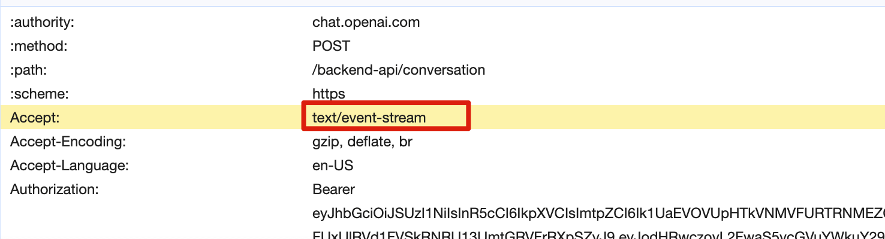
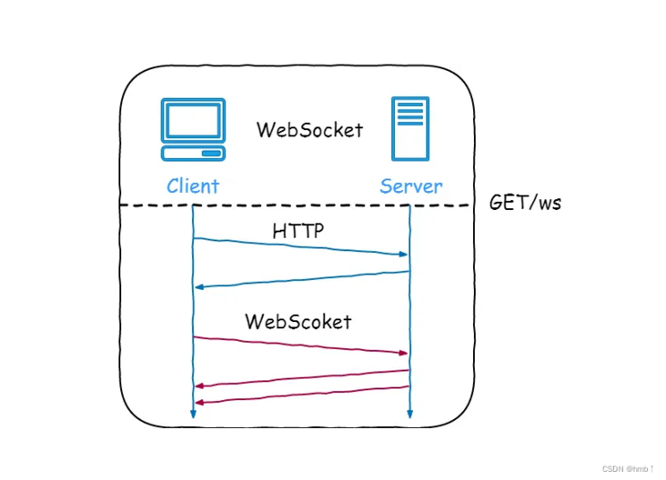
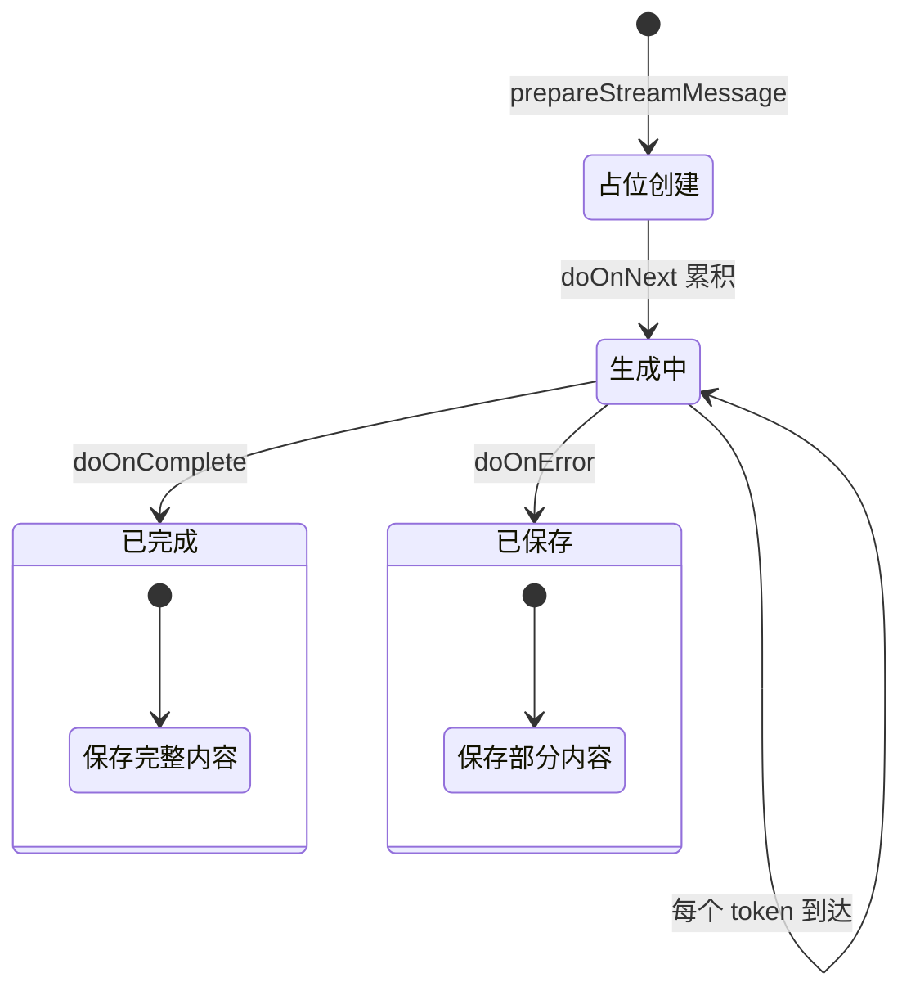

# 基于 SSE 实现打字机效果输出

> **系列定位**：本文讲 SSE 流式输出的实现原理和项目落地——SSE 协议格式、Spring Boot + Flux 混合模式、换行转义、前端渲染优化。Spring AI 基础集成见[《Spring AI 与大模型集成》](https://www.yuque.com/snailclimb/itdq8h/sitooa06s5qs7qd4)，知识库 RAG 问答见[《知识库 RAG 问答》](https://www.yuque.com/snailclimb/itdq8h/grm2dzfgrcb16cb8)。

用户在知识库聊天框输入问题后，不用等到 AI 生成完整回答才看到内容。系统会把回答逐字推送到页面，像 ChatGPT 一样“打字机”式展示。用户能实时看到 AI 在思考什么，也能随时中断不满意的回答。

全文围绕三个核心问题展开：

| 问题 | 挑战 | 方案关键词 |
| --- | --- | --- |
| 传统请求-响应模式下用户等待焦虑 | LLM 生成慢，用户不知道系统是否在工作 | SSE 流式推送 + Flux |
| SSE 协议对换行符敏感 | 回答中的 `\n` 会破坏事件边界 | 后端转义 + 前端反转义 |
| 长连接占用 Servlet 线程 | 200 并发 SSE 就能打满线程池 | 虚拟线程 + WebMVC/Flux 混合模式 |

大家好，我是 Guide。下面从 SSE 基础概念开始，逐步展开项目中的实现细节。

## SSE 简介

SSE（Server-Sent Events）是一种基于 HTTP 的服务器推送技术，允许服务器向客户端单向发送事件流。它是 HTML5 标准的一部分，相比传统轮询，延迟更低、资源消耗更少。



SSE 的主要特点：

* 单向通信：服务器向客户端推送数据
* 自动重连：浏览器断开时会自动尝试重连
* 文本格式：使用 UTF-8 编码的文本数据
* 标准协议：基于 HTTP/HTTPS，无需额外协议升级

### SSE 和 WebSocket 对比

WebSocket 是一种在 TCP 连接上进行全双工通信的协议，建立客户端和服务器之间的通信渠道。浏览器和服务器仅需一次握手，两者之间就直接可以创建持久性的连接，并进行双向数据传输。



SSE 与 WebSocket 都能实现服务端向客户端推送消息，但两者有几个关键区别：

* SSE 基于 HTTP 协议，不需要特殊的协议或服务器实现；WebSocket 需要单独的服务器来处理协议。
* SSE 单向通信，只能由服务端向客户端推送；WebSocket 全双工通信，双方可以同时发送和接收信息。
* SSE 实现简单，开发成本低，无需引入其他组件；WebSocket 传输数据需做二次解析，开发门槛高一些。
* SSE 默认支持断线重连；WebSocket 则需要自己实现。
* SSE 只能传送文本消息，二进制数据需要经过编码后传送；WebSocket 默认支持传送二进制数据。

### SSE 与 WebSocket 该如何选择？

* 选择 SSE：服务器单向推送数据，如实时通知、AI 流式生成。
* 选择 WebSocket：需要双向通信，如聊天室、协作编辑。

### SSE 协议格式

SSE 是一组基于 **UTF-8** 编码的纯文本流。每一个事件（Message）由一行或多行设置组成，最后必须以一个\*\*空行（两个换行符 `\n\n`）\*\*作为该事件的结束标志。

在同一个事件块内，各个字段（data, event, id, retry）的顺序没有严格要求，但它们必须紧挨着，中间不能有空行：

```latex
data: 第一行内容
data: 第二行内容
data: 第三行内容

id: 事件ID
event: 自定义事件类型
retry: 3000

data: 下一个事件
```

**字段说明**：

| 字段 | 说明 |
| --- | --- |
| `data` | 具体的业务数据。若有多行，自动拼接。 |
| `event` | 自定义事件类型（默认为 `message`）。 |
| `id` | 事件 ID，用于断线重连后恢复。 |
| `retry` | 告诉客户端如果连接掉线，等待多少毫秒后再尝试重连。 |
| `\n\n` | 事件分隔符（两个换行符分隔不同事件）。 |

## Spring Boot SSE 实现

概念讲清楚了，下面看怎么在 Spring Boot 里实现 SSE 流式输出。本项目使用的是 **WebMVC + Reactor 混合模式**：依赖 `spring-boot-starter-webmvc`，通过 Spring AI 传递依赖的 `reactor-core` 使用 `Flux` 做 SSE 输出。

> **WebMVC vs WebFlux**：WebFlux 是完全响应式的非阻塞架构，而 WebMVC + Flux 只是在 Controller 层使用响应式类型做 SSE 输出，底层仍是阻塞式 Servlet 模型。对于 AI 流式输出场景，这种混合模式已足够使用。

### 基础用法

最简单的 SSE 端点只需要一个 `@GetMapping` + `Flux<String>` 返回值：

```java
@GetMapping(value = "/stream", produces = MediaType.TEXT_EVENT_STREAM_VALUE)
public Flux<String> streamData() {
    return Flux.interval(Duration.ofMillis(500))
        .map(seq -> "data: 消息 " + seq + "\n\n");
}
```

代码说明：

* `MediaType.TEXT_EVENT_STREAM_VALUE`：声明响应类型为 SSE 事件流，值为 `text/event-stream`。
* `Flux<String>`：响应式流类型，返回多个字符串事件。
* `Flux.interval()`：每 500 毫秒发射一个递增序列。
* 手动拼接 SSE 格式：`data:` 前缀 + `\n\n` 分隔符。

### 使用 ServerSentEvent 包装

手动拼接 `data:` 前缀和 `\n\n` 分隔符容易出错。Spring 提供了 `ServerSentEvent<T>` 包装类，自动处理格式：

```java
@GetMapping(value = "/stream", produces = MediaType.TEXT_EVENT_STREAM_VALUE)
public Flux<ServerSentEvent<String>> streamData() {
    return Flux.interval(Duration.ofMillis(500))
        .map(seq -> ServerSentEvent.<String>builder()
            .id(String.valueOf(seq))           // 事件 ID
            .event("custom-event")              // 自定义事件类型
            .data("消息 " + seq)                // 事件数据
            .retry(3000L)                       // 重连间隔
            .build());
}
```

代码说明：

* `ServerSentEvent<T>`：Spring 提供的 SSE 事件包装类，自动处理 SSE 格式。
* 字段说明：
  * `id()`：设置事件唯一标识，客户端断线重传时可作为断点恢复的依据。
  * `event()`：自定义事件类型，客户端可通过 `addEventListener('custom-event')` 监听。
  * `retry()`：告诉客户端连接断开后等待多久重连（毫秒）。

### Spring AI 流式调用

前面两种是 SSE 的通用写法。在实际项目中，流式数据的源头是 Spring AI 的 `ChatClient`。它提供了流式调用接口，返回的 `Flux<String>` 可以直接作为 SSE 响应：

```java
Flux<String> responseFlux = chatClient.prompt()
    .system(systemPrompt)
    .user(userPrompt)
    .stream()  // 关键：使用 stream() 方法启用流式输出
    .content();
```

**流式调用特点**：

* 响应式编程：返回 `Flux<String>`，支持背压控制。
* 增量返回：每个 token 立即返回，不等待完整生成。
* 可配置重试策略和超时时间。

下面这张图展示了从用户提问到前端渲染的完整数据流，重点看 LLM 返回 token 后的换行转义环节：


## SSE 格式转义处理

上面讲了 SSE 的基本用法，但在实际项目中有一个容易踩的坑：SSE 协议用 `\n\n` 做事件分隔符，而 AI 生成的回答里经常包含换行符。不处理的话，一个换行就会把一条消息劈成两半。

SSE 协议使用 `\n\n` 作为事件分隔符，如果数据中包含换行符，会破坏协议格式：

```latex
# 错误示例：数据中的换行符破坏了 SSE 格式
data: 第一行内容
仍然在第一行           ← 被误认为是新的事件
data: 第二行内容

# 正确示例：转义换行符
data: 第一行内容\n仍然在第一行
data: 第二行内容\n

```

**后端转义实现**：

```java
.map(chunk -> ServerSentEvent.<String>builder()
    .data(chunk.replace("\n", "\\n").replace("\r", "\\r"))
    .build())
```

**前端反向转义**：

```typescript
const text = chunk.replace(/\\n/g, '\n').replace(/\\r/g, '\r');
```

## 错误处理与性能优化

格式转义解决了协议层的问题，但流式输出还有三个工程层面的挑战：超时控制、线程占用和 LLM 调用的重试策略。

### 超时控制

```java
return responseFlux
    .timeout(Duration.ofSeconds(30))
    .onErrorResume(TimeoutException.class, e -> {
        log.error("流式输出超时", e);
        return Flux.just("【错误】回答生成超时，请缩短问题或稍后重试。");
    });
```

### 背压控制

在 WebMVC + Reactor 混合模式下，`Flux` 的背压机制仍然有效，可以控制数据流速度：

```java
Flux<String> responseFlux = chatClient.prompt()
    .stream()
    .content()
    .onBackpressureBuffer();  // 缓冲背压
```

> **注意**：虽然 Reactor 的背压机制可用，但 WebMVC 底层仍是阻塞式 Servlet 线程模型，连接数受限于 Servlet 容器的线程池配置（如 Tomcat 的 `server.tomcat.threads.max`）。

### Servlet 容器配置

本项目使用虚拟线程（Java 21+），无需担心 SSE 长连接占用线程池：

```yaml
spring:
  threads:
    virtual:
      enabled: true  # 启用虚拟线程
```

虚拟线程 vs 平台线程：

| 场景 | 平台线程 | 虚拟线程 |
| --- | --- | --- |
| 200 并发 SSE | 线程池满，排队 | 轻松处理 |
| AI 调用等待 3 秒 | 线程阻塞，占用资源 | 自动挂起，让出资源 |
| 10000 并发请求 | 拒绝服务 | 正常处理 |

> **为什么不用 WebFlux？** 虚拟线程只需一行配置，无需重写代码；而 WebFlux 需要将 JPA 换成 R2DBC，改造成本极高。对于 I/O 密集型的 AI 应用，虚拟线程是更务实的选择。

启动日志可验证虚拟线程生效：

```bash
2026-02-20T22:53:47.015+08:00  INFO 49463 --- [ai-interview-platform] [cat-handler-116] i.g.m.knowledgebase.RagChatController    : 收到 RAG 聊天流式请求: sessionId=2, question=三面, 线程: VirtualThread[#244,tomcat-handler-116]/runnable@ForkJoinPool-1-worker-6 (虚拟线程: true)
```

关于虚拟线程的详细介绍可以看这篇文章：[虚拟线程常见问题总结](https://javaguide.cn/java/concurrent/virtual-thread.html)。

### 超时设置

LLM 调用超时**不要靠 Spring AI 的内置配置去管**。先看本项目对 Spring AI 自动重试的处理：

```yaml
spring:
  ai:
    retry:
      max-attempts: 1     # 显式关掉自动重试，避免重试和业务层失败处理打架
      on-client-errors: false
```

具体的“调用级别超时”，本项目走的是 Reactor 的 `.timeout(Duration)`——粒度细、和流式输出语义贴合：

```java
return chatClient.prompt()
    .system(systemPrompt).user(userPrompt)
    .stream().content()
    .timeout(Duration.ofSeconds(30))                 // 单次流式调用 30 秒上限
    .onErrorResume(TimeoutException.class, e -> {
        log.error("流式输出超时", e);
        return Flux.just("【错误】回答生成超时，请缩短问题或稍后重试。");
    });
```

> **避坑提示**：网上有不少教程会写成 `spring.ai.openai.chat.options.duration: 30s` 这种配置。本项目实际验证过——这个配置路径在 Spring AI 2.x 并不存在，写了也不会生效。需要在代码里通过 `OpenAiChatOptions.builder()` 设置，或者像本项目这样在 `Flux` 上挂 `.timeout()` 操作符。流式场景里后者更合适，能精确控制“首字超时 / 整体超时”等不同语义。

## 最佳实践

把前面各节的内容整理成可参考的实践清单。

### SSE 格式规范

SSE 对格式极其敏感，任何微小的格式偏差都可能导致客户端解析器挂起。

| 规范项 | 说明 | 项目实践 |
| --- | --- | --- |
| **数据转义** | `data` 字段内的原始数据若包含 `\n`，必须转义为 `\\n` | RAG 聊天使用 `chunk.replace("\\n", "\\\\n")` 转义 |
| **事件定界** | 严格使用 `\n\n`（双换行）作为每个事件块的结束标志 | 使用 `ServerSentEvent` 自动处理 |
| **字符编码** | 强制使用 UTF-8 | Spring Boot 默认使用 UTF-8 |
| **心跳机制** | 每隔 15-30 秒发送冒号开头的注释行（如 `: heartbeat\n\n`） | 本项目暂未实现，生产环境建议添加 |

### 稳定性与异常处理

SSE 是长连接，资源释放和状态一致性是重中之重。

| 策略维度 | 核心操作 | 项目实践 |
| --- | --- | --- |
| **消息占位** | 流式开始前先创建消息占位，完成后更新内容 | `prepareStreamMessage()` + `completeStreamMessage()` |
| **状态管理** | 使用 `completed` 字段区分“生成中”和“已完成” | 前端根据此字段显示 loading 状态 |
| **异常保存** | 无论成功或失败，都保存已接收的内容 | `doOnError` 中保存 `fullContent` |
| **超时降级** | 设置合理的超时时间，超时后返回友好提示 | `.timeout(Duration.ofSeconds(30))` + `onErrorResume` |

RAG 聊天流式处理示例：

消息从创建占位到最终完成的状态流转如下，重点看 `doOnNext` 累积内容、`doOnComplete` 成功保存、`doOnError` 失败也保存已接收的部分：



对应的核心代码如下：

```java
return sessionService.getStreamAnswer(sessionId, request.question())
    .doOnNext(fullContent::append)  // 累积完整内容
    .map(chunk -> ServerSentEvent.<String>builder()
        .data(chunk.replace("\n", "\\n").replace("\r", "\\r"))  // 转义换行符
        .build())
    .doOnComplete(() -> {
        // 成功：更新消息内容并标记为已完成
        sessionService.completeStreamMessage(messageId, fullContent.toString());
    })
    .doOnError(e -> {
        // 失败：保存已接收的部分内容
        String content = !fullContent.isEmpty()
            ? fullContent.toString()
            : "【错误】回答生成失败：" + e.getMessage();
        sessionService.completeStreamMessage(messageId, content);
    });
```

### 前端性能优化

流式数据高频更新会导致页面卡顿，需要优化渲染策略。

```typescript
// 使用 requestAnimationFrame + React Transition 优化渲染
let fullContent = '';
const rafRef = useRef<number>();

onMessage((chunk: string) => {
  fullContent += chunk;
  if (rafRef.current) {
    cancelAnimationFrame(rafRef.current);  // 取消上一次未执行的渲染
  }
  rafRef.current = requestAnimationFrame(() => {
    startTransition(() => {
      updateAssistantMessage(fullContent);
    });
  });
});
```

优化要点：

* `requestAnimationFrame`：将渲染推迟到下一帧，避免高频更新。
* `cancelAnimationFrame`：取消上一次未执行的渲染，只保留最新一次。
* `startTransition`：React 18 并发特性，将渲染标记为低优先级。

### Nginx 代理配置

如果使用 Nginx 反向代理，必须关闭缓冲配置：

```nginx
location /api/ {
    proxy_pass http://backend;
    proxy_buffering off;      # 关闭代理缓冲
    proxy_cache off;          # 关闭代理缓存
    proxy_read_timeout 300s;  # 读取超时时间
    proxy_set_header Connection '';     # 清空 Connection 头
    proxy_set_header Cache-Control 'no-cache';  # 禁止缓存
}
```

配置说明：

* `proxy_buffering off`：禁用缓冲，确保数据实时转发。
* `proxy_cache off`：禁用缓存，避免旧数据被缓存。
* `proxy_read_timeout`：设置合理的读取超时时间。
* `Connection ''`：清空 Connection 头，保持长连接。

## 总结

SSE 流式输出是提升 AI 应用用户体验的关键技术。回顾全文要点：

| 要点 | 说明 |
| --- | --- |
| 协议选择 | 单向推送选 SSE，双向通信选 WebSocket |
| 协议格式 | `data:` 前缀 + `\n\n` 分隔符 |
| 格式转义 | 换行符 `\n` → `\\n`，避免破坏事件分隔符 |
| 消息持久化 | 先创建占位 (`completed=false`)，完成后更新内容 |
| 异常处理 | 无论成功失败都保存已接收内容，避免数据丢失 |
| 前端优化 | 使用 RAF + React Transition 优化高频渲染 |

项目核心文件：

* `modules/knowledgebase/KnowledgeBaseController.java` - 知识库控制器
* `modules/knowledgebase/RagChatController.java` - RAG 聊天控制器
* `modules/knowledgebase/service/KnowledgeBaseQueryService.java` - 查询服务
* `modules/knowledgebase/service/RagChatSessionService.java` - 会话管理服务
* `frontend/src/api/knowledgebase.ts` - 知识库前端 API
* `frontend/src/api/ragChat.ts` - RAG 聊天前端 API


> 更新: 2026-04-29 15:32:00  
> 原文: <https://www.yuque.com/snailclimb/itdq8h/rfwnubp7b66e6q0c>