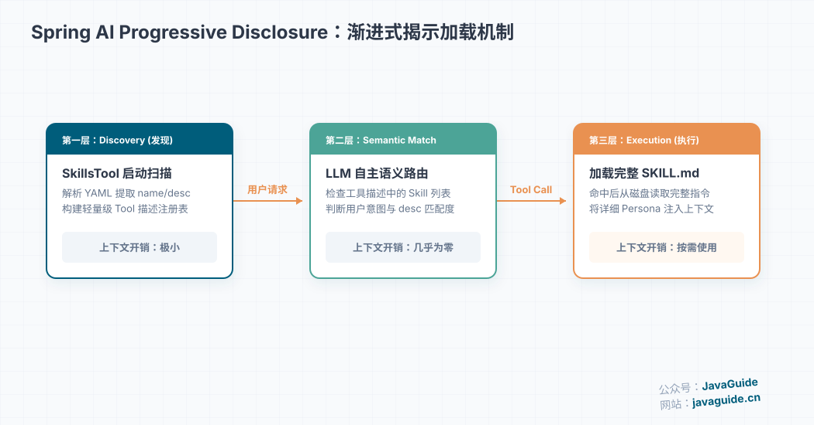
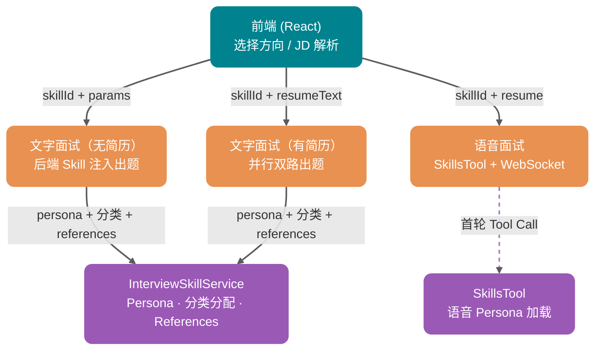
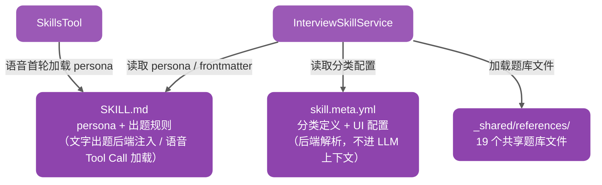
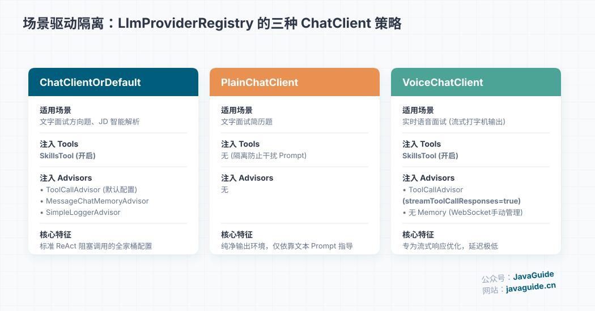
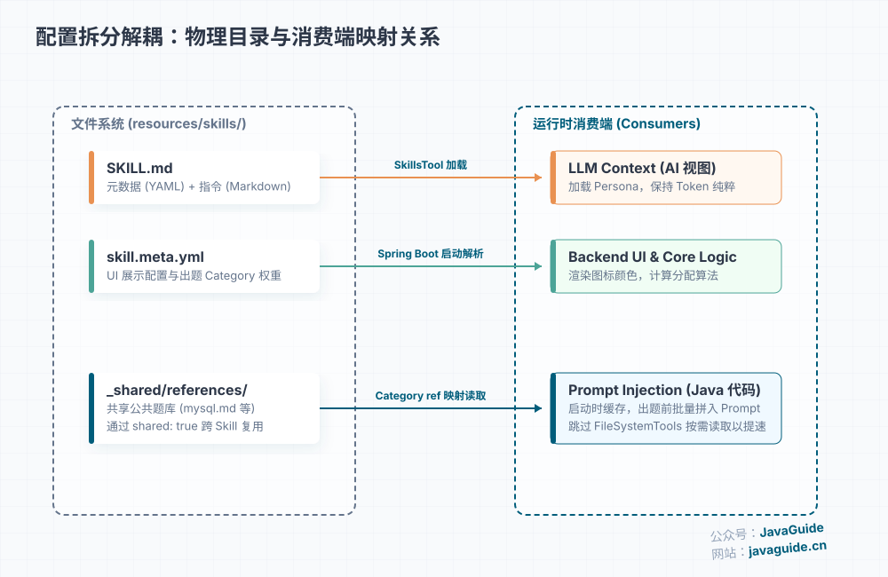
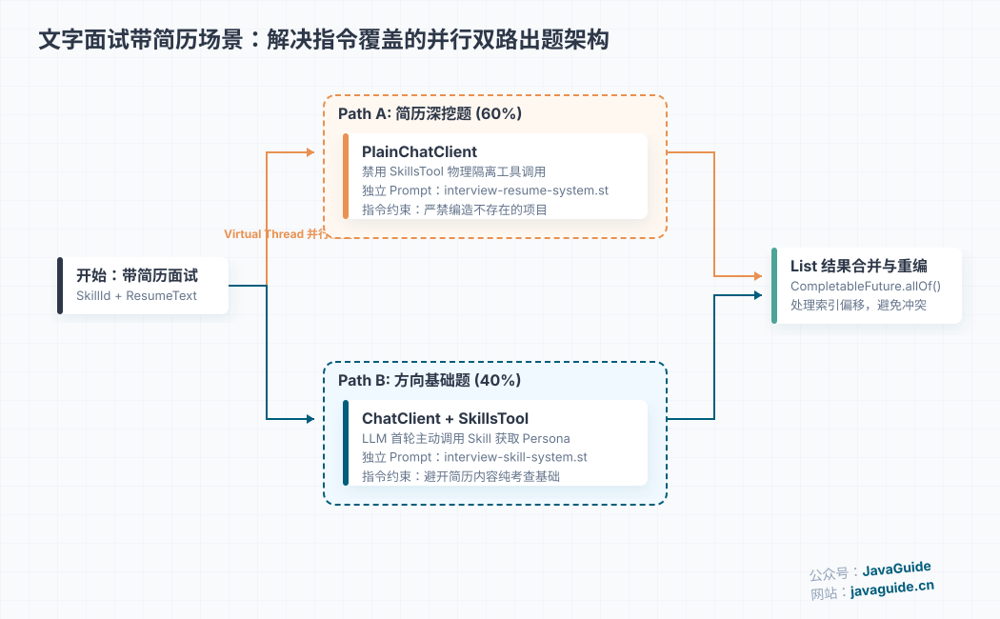
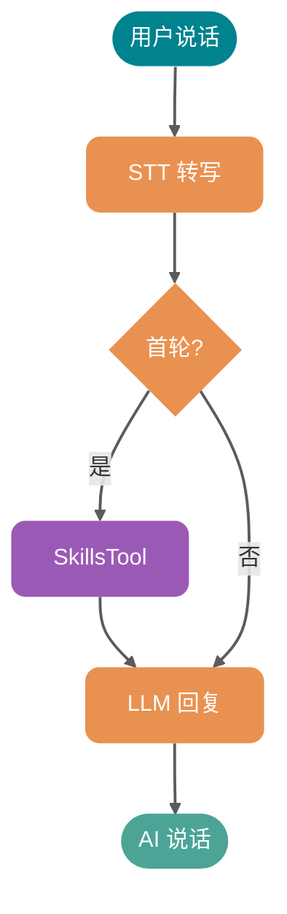
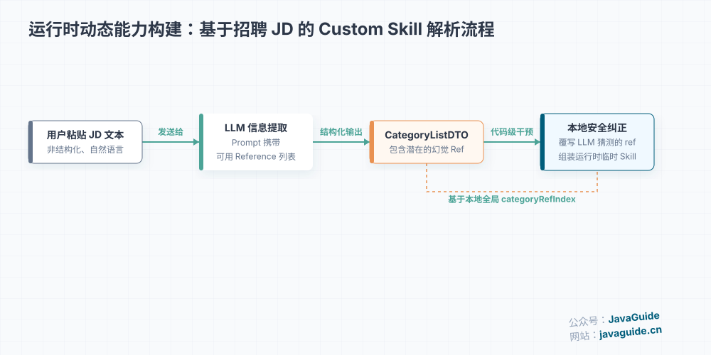

# 基于 Spring AI Skills 实现多方向面试系统的架构演进

# 基于 Spring AI Skills 实现多方向面试系统的架构演进

> **系列定位**：本文从架构设计角度讲面试出题的 Skill 系统——为什么用 SKILL.md 管理面试方向、三种 ChatClient 各自的职责、并行双路出题的踩坑过程。[Spring AI 基础集成](https://www.yuque.com/snailclimb/itdq8h/sitooa06s5qs7qd4)（ChatClient、Prompt 管理、Advisor 链）见《Spring AI 与大模型集成》，流式输出见《SSE 流式输出》。Agent Skills 概念下文有简要回顾，更详细的解释见 [JavaGuide](https://javaguide.cn/ai/agent/skills.html)。

大家好，我是 Guide。之前我在 [JavaGuide](https://javaguide.cn/ai/agent/skills.html) 上详细聊过 Agent Skills 的概念——**Skill 是一个用自然语言定义的、具有特定领域上下文的逻辑指令集，本质上是通过延迟加载（Lazy Loading）优化 Token 消耗的 Sub-Agent**。

它解决的核心问题是：**Prompt 适合单次任务，Skills 才是构建可复用 AI 能力的正确方式**。在团队协作中，很多隐性知识（代码规范、排查流程、Review 标准）都在老员工脑子里，Skills 的价值就是把它们变成显性的文档（SOP），让 AI 能够自主阅读、理解并执行。

| **组件** | **一句话定义** | **形象类比** |
| --- | --- | --- |
| **Prompt** | 即时意图表达的载体 | 用户说的话 |
| **Function Calling** | LLM 输出结构化调用的能力 | 神经信号 |
| **MCP** | 标准化的工具接入协议 | USB-C 接口 |
| **Skills** | 用自然语言定义的 sub-agent | 任务说明书 |

关于 Skills 的详细介绍，可以看这篇文章：[万字详解 Agent Skills：是什么？怎么用？和 Prompt、MCP 有什么区别？ - JavaGuide](https://javaguide.cn/ai/agent/skills.html)

概念讲清楚了，那在真实项目中这套思想到底怎么落地？本文就以我们面试平台的 Skill 系统为例，聊一聊从痛点出发的设计思路、Spring AI 官方提供了哪些能力、以及我们如何用 `spring-ai-agent-utils` 落地实现。

文中涉及的后端实现在 `app/src/main/java/interview/guide/modules/interview/skill/` 和 `app/src/main/java/interview/guide/modules/interview/service/` 目录下，前端实现在 `frontend/src/components/UnifiedInterviewModal.tsx` 中，可直接对照源码。

* Github：<https://github.com/Snailclimb/interview-guide>
* Gitee：<https://gitee.com/SnailClimb/interview-guide>
* 教程地址：<https://t.zsxq.com/dQNVc>

从用户视角看一眼这个系统：用户打开面试页面，从下拉菜单选一个方向（比如 Java 后端），可选上传简历或粘贴一段 JD。点开始后，系统在 10 秒内生成一套面试题，每道题按技术方向标记分类。有简历时，部分题目会围绕简历中的项目经历展开。语音面试模式下，AI 面试官以对应风格的角色开始多轮追问。

全文围绕五个核心问题展开：

| 问题 | 挑战 | 方案关键词 |
| --- | --- | --- |
| 面试方向硬编码在 Prompt 里 | 新增方向要改代码发版 | SKILL.md 目录化 + skill.meta.yml 配置拆分 |
| Tool 输出优先级压过文本指令 | 简历题和方向题无法在一次调用中兼顾 | 并行双路出题，各自独立的 Prompt 和 ChatClient |
| Provider 对 Tool 消息链路校验不一致 | 结构化输出中混入 Tool Call 会报 400 | 后端注入 persona 和 references，替代 Tool Call |
| 跨方向题库重复维护 | Redis 题在 Java、Python 方向各存一份 | `_shared/references/` + shared 标记 |
| 语音面试角色加载方式 | 后端注入每轮都占 Token，全量 Agent 又太重 | SkillsTool 首轮按需加载，不走 ReAct |

## 痛点：面试方向配置散落在代码里

在项目早期，面试出题是这样做的：写一个大的 Prompt，告诉 LLM “请出一套 Java 后端面试题”。这种做法能跑通 Demo，但在业务迭代中暴露出几个具体问题：

| **问题** | **具体表现** | **后果** |
| --- | --- | --- |
| **方向不可配置** | 面试方向硬编码在 Prompt 模板中 | 每新增一个方向就要改代码、发版 |
| **分类权重不可调** | 出题时的分类和权重写死在 Service 中 | 无法针对不同方向定制出题策略 |
| **角色指令分散** | persona（面试官角色）定义散落在多个 Prompt 文件中 | 改一处忘一处，风格不统一 |
| **无法共享资源** | Redis 题目在 Java 方向和 Python 方向重复维护 | 维护成本翻倍，质量难保证 |

这些问题本质上是**配置没有从代码中解耦**。解决它们不一定要用 `SKILL.md`——YAML、JSON、数据库配置表都能做。但面试场景有几个特殊需求，让我最终选择了 `SKILL.md` + `spring-ai-agent-utils`：

1. **persona（面试官角色）是长文本**：角色指令是几百字的 Prompt，纯 YAML 里用 `|` 块标量写，可读性和可维护性都差。
2. **题库需要目录组织**：面试题是按方向拆分的多个 Markdown 文件，需要 `references/` 目录结构来管理。
3. **需要统一的 persona 来源**：文字面试和语音面试都应该以同一份 `SKILL.md` 作为角色规则来源。差异只在加载方式：文字结构化出题由后端注入，语音面试通过 `SkillsTool` 按需加载。
4. **语音面试需要角色定制**：不同方向的 AI 面试官需要不同的 persona（出题风格、追问策略、考察重点），通过 `SkillsTool` 统一加载。

## Spring AI 官方的 Skills 机制

了解完痛点，先看看 Spring AI 官方提供了什么能力。

### SKILL.md 文件格式

2026 年 1 月，Spring 官方博客发布了 [Spring AI Agentic Patterns (Part 1): Agent Skills](https://spring.io/blog/2026/01/13/spring-ai-generic-agent-skills)，正式介绍了 Agent Skills 机制。核心思想是：

**将 AI Agent 的能力定义为 SKILL.md 文件——YAML frontmatter 存元数据，Markdown body 存指令。Agent 按需加载，用多少取多少。**

每个 Skill 是一个目录，结构如下：

```yaml
my-skill/
├── SKILL.md          # 必需：元数据（何时使用）+ 正文（指令、流程、示例）
├── scripts/          # 可选：可执行脚本（Python/Bash），按需调用
├── references/       # 可选：参考文档，按需读取
└── assets/           # 可选：模板、图片等资源
```

Spring AI 的实现采用了 **Tool-based Integration** 方案——把 Skills 注册为 LLM 可调用的工具（Tool），任何 LLM（OpenAI、Anthropic、Google Gemini 等）都能通过标准的 Function Calling 机制来触发 Skill 加载。这意味着 **Skills 定义一次，模型随意切换**，不存在供应商锁定。

### Progressive Disclosure（渐进式加载）

Spring AI Skills 的核心机制是官方称为 **Progressive Disclosure（渐进式揭示）** 的三层机制，用最小的上下文开销管理大量 Skill：



**第一层：Discovery（发现）**

启动时，`SkillsTool` 扫描配置的 Skills 目录，解析每个 SKILL.md 的 YAML frontmatter，提取 `name` 和 `description` 两个字段，构建一个轻量级的注册表。这个注册表被**直接嵌入到 **`Skill`** 工具的描述中**，LLM 在对话过程中就能“看到”所有可用的 Skill，而不需要消耗额外的对话上下文。即使注册了 100 个 Skill，上下文开销也只有每个 Skill 几十个 token。

**第二层：Semantic Matching（语义匹配）**

当用户发出请求时，LLM 检查嵌入在工具描述中的 Skill 列表。如果判断用户请求与某个 Skill 的 `description` 语义匹配，LLM 就会调用 `Skill` 工具并传入 Skill 名称。不需要向量搜索，不需要额外的匹配服务——**LLM 自己就是路由器**。

**第三层：Execution（执行）**

当 `Skill` 工具被调用时，`SkillsTool` 才从磁盘加载完整的 `SKILL.md` 内容，返回给 LLM，同时附带 Skill 的基础目录路径。LLM 随后按照 SKILL.md 中的指令执行任务。如果 Skill 引用了额外的参考文件或辅助脚本，LLM 会通过 `FileSystemTools` 的 `Read` 功能或 `ShellTools` 的 `Bash` 功能**按需加载**——脚本代码本身不会进入上下文窗口，只有输出结果会，这大大节省了 Token 消耗。

| **阶段** | **加载内容** | **上下文开销** |
| --- | --- | --- |
| Discovery | `name` + `description`（嵌入工具描述） | 极小（每个 Skill 几十个 token） |
| Semantic Matching | LLM 检查工具描述中的 Skill 列表 | 几乎为零 |
| Execution | 完整 `SKILL.md`（由 SkillsTool 加载） | 按需，只加载命中的 Skill |
| 资源加载 | `references` + `scripts`（由 LLM 按需调用 `FileSystemTools`/`ShellTools`） | 仅输出结果进入上下文 |

### spring-ai-agent-utils 提供了什么

`spring-ai-agent-utils`（`spring-ai-community` 组织）是这套机制的官方实现库，灵感来自 Claude Code 的工具规范。它提供了以下核心工具：

| **工具** | **能力** | **本项目是否使用** |
| --- | --- | --- |
| `SkillsTool` | Skill 发现、语义匹配、按需加载 | 是——语音面试 persona 加载；文字结构化出题不走 Tool Call |
| `FileSystemTools` | 读取文件内容（`Read` 函数） | 否——由 Java 代码直接加载 `references` |
| `ShellTools` | 执行脚本（`Bash` 函数） | 否 |
| `AskUserQuestionTool` | Agent 向用户提问 | 否——语音面试用 WebSocket 双向消息 |
| `TodoWriteTool` | 透明可追踪的多步骤任务管理 | 否 |

我们只用了 `SkillsTool` 这一个工具，但不是所有场景都让 LLM 主动调用它。文字面试的方向题和简历题都是**结构化 JSON 输出**，为了兼容 DeepSeek 这类对 OpenAI tool 消息链路校验更严格的模型，统一使用无工具的 `QuestionGenerationChatClient`。Skill 的 persona、分类和 references 由 Java 后端加载后注入 Prompt。语音面试仍然通过 `SkillsTool` 加载 persona，但不注册 FileSystemTools，也不走 ReAct 模式——延迟预算不允许额外的工具调用往返。

另外，Spring AI 同时集成了 Anthropic 的原生 Skills API——它运行在 Anthropic 的沙盒云容器中，支持 Excel/PowerPoint/Word/PDF 等预置文档生成，但仅限 Claude 模型。而 `spring-ai-agent-utils` 的 Generic Agent Skills 运行在你自己的环境中，对 LLM 提供商没有限制。两者可以在同一个应用中并存，各取所长。

我们在 `AgentUtilsConfiguration` 中注册了 `SkillsTool`，从 classpath 的 `skills/` 目录加载所有 Skill。这段代码只做了两件事：检查目录是否存在，以及把目录资源传给 `SkillsTool` 构建 ToolCallback：

```java
// common/ai/AgentUtilsConfiguration.java
@Bean("interviewSkillsToolCallback")
public ToolCallback interviewSkillsToolCallback() {
    String normalizedSkillsRoot = normalizeSkillsRoot(agentUtilsProperties.getSkillsRoot());
    Resource skillsRootResource = resourceLoader.getResource(normalizedSkillsRoot); // 默认 classpath:skills
    if (!skillsRootResource.exists()) {
        throw new IllegalStateException("未找到 skills 根目录，请检查配置: " + normalizedSkillsRoot);
    }
    return SkillsTool.builder()
        .addSkillsResource(skillsRootResource)
        .build();
}
```

> **生产提示**：对于打包部署的应用（JAR/WAR），使用 `addSkillsResource` 从 classpath 加载 Skills；本地开发时可以用 `addSkillsDirectory` 指定文件系统目录。

## 项目落地

### 整体架构

我们用 `spring-ai-agent-utils` 构建了 Skill 系统，四个场景分别用到了不同的能力层。下面两张图从两个维度展示这个架构——第一张看场景路由，第二张看数据来源：

第一张图重点看紫色虚线：只有语音面试（s3）通过 SkillsTool 加载 persona；文字面试（s1、s2）都由后端的 `InterviewSkillService` 注入配置：



第二张图看数据来源——`InterviewSkillService` 从 `SKILL.md` 读 persona、从 `skill.meta.yml` 读分类、从 `_shared/references/` 读题库；`SkillsTool` 只在语音面试时从 `SKILL.md` 加载 persona：



### 三种 ChatClient，三种用途

在 `LlmProviderRegistry` 中，我们维护了三种 ChatClient，各自有不同的工具集和 Advisor 配置：



下面是构建代码。重点看工具注册和 Advisor 配置的差异——`createPlainChatClient` 什么工具都不加，这是结构化输出稳定性的关键：

```java
// LlmProviderRegistry.java

// Agent/通用对话：SkillsTool + 全套 Advisor（Memory、ToolCall、SafeGuard）
private ChatClient createChatClient(String providerId) {
    OpenAiChatModel chatModel = buildChatModel(providerId);
    ChatClient.Builder builder = ChatClient.builder(chatModel);
    if (interviewSkillsToolCallback != null) {
        builder.defaultToolCallbacks(interviewSkillsToolCallback);
    }
    List<Advisor> advisors = buildDefaultAdvisors(providerId);
    if (!advisors.isEmpty()) {
        builder.defaultAdvisors(advisors.toArray(new Advisor[0]));
    }
    return builder.build();
}

// 结构化出题：纯净 ChatClient，不注册任何工具（仅 SafeGuardAdvisor）
// InterviewQuestionService 通过 getPlainChatClient() 获取
private ChatClient createPlainChatClient(String providerId) {
    OpenAiChatModel chatModel = buildChatModel(providerId);
    ChatClient.Builder builder = ChatClient.builder(chatModel);
    buildSafeGuardAdvisor().ifPresent(advisor -> builder.defaultAdvisors(advisor));
    return builder.build();
}

// 语音面试：SkillsTool + 流式 ToolCallAdvisor（streamToolCallResponses=true），不加 Memory Advisor
private ChatClient createVoiceChatClient(String providerId) {
    OpenAiChatModel chatModel = buildChatModel(providerId);
    ChatClient.Builder builder = ChatClient.builder(chatModel);
    if (interviewSkillsToolCallback != null) {
        builder.defaultToolCallbacks(interviewSkillsToolCallback);
    }
    List<Advisor> advisors = new ArrayList<>();
    if (toolCallingManager != null) {
        advisors.add(buildToolCallAdvisor(true, true)); // conversationHistory=true, stream=true
    }
    buildSafeGuardAdvisor().ifPresent(advisors::add);
    if (!advisors.isEmpty()) {
        builder.defaultAdvisors(advisors.toArray(new Advisor[0]));
    }
    return builder.build();
}
```

为什么文字结构化出题不用 `SkillsTool`？场景二会讲踩坑过程。为什么语音面试用 `VoiceChatClient`？场景三会展开。

这里后来做过一次重要调整：文字面试方向题也从 `getChatClientOrDefault()` 切到了 `getPlainChatClient()`。原因是方向题最终要走 `BeanOutputConverter` 解析 JSON，Tool Call 的中间消息会让部分 OpenAI 兼容模型（比如 DeepSeek）报错：`Messages with role 'tool' must be a response to a preceding message with 'tool_calls'`。Qwen 对这类消息链路比较宽容，所以旧实现看起来能跑；DeepSeek 校验更严格，问题就暴露出来了。

调整后，文字出题不是“不用 Skill”，而是换成了**后端驱动的 Skill 出题**：`InterviewSkillService` 读取 `SKILL.md` persona、`skill.meta.yml` 分类和 references，统一注入 Prompt；LLM 只负责按这些材料生成结构化题目。`SkillsTool` 留给语音面试这类真正需要模型在对话中动态加载 persona 的场景。

### 目录结构

```latex
resources/skills/
├── _shared/                        # 共享资源（不注册为 Skill）
│   └── references/
│       ├── redis.md                # Redis 通用面试题
│       ├── mysql.md                # MySQL 通用面试题
│       ├── java.md                 # Java 核心面试题
│       ├── spring.md               # Spring 面试题
│       ├── distributed.md          # 分布式系统面试题
│       ├── algorithm-data-structures.md  # 算法与数据结构
│       ├── system-design-scenarios.md    # 系统设计场景题
│       └── ...                     # 其他共享题库（共 19 个）
├── java-backend/
│   ├── SKILL.md                    # persona + 出题规则（Markdown body）
│   ├── skill.meta.yml              # 分类定义 + UI 展示配置
│   └── references/                 # （本 Skill 无专属题库，全部引用 _shared）
├── bytedance-backend/
│   ├── SKILL.md                    # 字节风格面试官 persona
│   └── skill.meta.yml
├── ali-backend/
│   ├── SKILL.md                    # 阿里风格面试官 persona
│   └── skill.meta.yml
├── java-backend-tencent/
│   ├── SKILL.md                    # 腾讯风格面试官 persona
│   └── skill.meta.yml
├── ai-agent-dev/
│   ├── SKILL.md                    # AI Agent 开发方向
│   └── skill.meta.yml
├── algorithm/
│   ├── SKILL.md                    # 算法方向
│   └── skill.meta.yml
├── frontend/
│   ├── SKILL.md
│   └── skill.meta.yml
├── python-backend/
│   ├── SKILL.md
│   └── skill.meta.yml
├── system-design/
│   ├── SKILL.md
│   └── skill.meta.yml
└── test-development/
    ├── SKILL.md
    └── skill.meta.yml
```

`_shared/references/` 解决了跨 Skill 共用题库的问题——Redis、MySQL 这类通用题目只维护一份，各 Skill 通过 `shared: true` 引用，避免“Java 方向的 Redis 题很新，Python 方向的还是旧的”这种不一致。

### 配置拆分：SKILL.md + skill.meta.yml

每个 Skill 由两个文件组成，各司其职：



`SKILL.md`（AI 读的）：YAML frontmatter 存元数据，Markdown body 存面试官 persona 和出题规则。文字结构化出题时由后端读取后注入 Prompt；语音面试时由 `SkillsTool` 加载到 LLM 上下文中。

`skill.meta.yml`（系统读的）：定义分类（categories）、UI 展示配置（图标、渐变色等）。这个文件只在后端解析，不会进入 LLM 上下文。

以 `java-backend` 为例：

`java-backend/SKILL.md`（persona 定义）：

```markdown
---
name: java-backend
description: 用于 Java 后端面试出题；优先围绕 Java 核心、MySQL、Redis、Spring 与项目实战，追问设计取舍、故障处理和性能优化。
---
# Overview
你是一位 Java 后端面试官，目标是识别候选人是否具备可上线的工程能力，而不是只会背概念。

# Instructions
1. 优先结合候选人简历和项目经历提问。
2. 提问顺序遵循：使用经验 -> 原理机制 -> 边界条件 -> 优化与故障。
3. 每个主问题都需要可追问，追问要落到真实场景和可观测指标。
4. 回答偏概念时，必须追问实现细节、失败场景、回滚方案。
5. 避免一次性给提示词，不要替候选人补全答案。

# Additional Resources
出题前优先参考这些资料，并按分类落题：
- JAVA -> java.md
- MYSQL -> mysql.md
- REDIS -> redis.md
- SPRING -> spring.md
- SYSTEM_DESIGN_SCENARIO/PROJECT -> system-design-scenarios.md + 简历项目
```

`java-backend/skill.meta.yml`（分类与展示配置）：

```yaml
displayName: Java 后端开发
display:
  icon: ☕
  gradient: from-blue-500 to-indigo-500
  iconBg: bg-blue-100 dark:bg-blue-900/30
  iconColor: text-blue-600 dark:text-blue-400
categories:
  - key: JAVA
    label: Java
    priority: CORE
    ref: java.md
    shared: true
  - key: MYSQL
    label: MySQL
    priority: CORE
    ref: mysql.md
    shared: true
  - key: REDIS
    label: Redis
    priority: CORE
    ref: redis.md
    shared: true
  - key: SPRING
    label: Spring
    priority: NORMAL
    ref: spring.md
    shared: true
  - key: SYSTEM_DESIGN_SCENARIO
    label: 系统设计/场景题
    priority: NORMAL
    ref: system-design-scenarios.md
    shared: true
  - key: PROJECT
    label: 项目经历
    priority: ALWAYS_ONE
```

几个设计细节：

**为什么要拆成两个文件**：SKILL.md 是给 LLM 看的——它需要 persona（面试官角色）和 Instructions（出题规则），但不需要知道“Java 后端”在前端显示什么图标、用什么渐变色。把 UI 配置和分类定义拆到 `skill.meta.yml`，SKILL.md 保持纯粹的自然语言指令，LLM 加载时的 token 开销更小、语义更清晰。

`ref`\*\* + **`shared`** 的组合\*\*：

| `shared` | 读取路径 | 示例 |
| --- | --- | --- |
| `true` | `skills/_shared/references/{ref}` | `mysql.md` → `_shared/references/mysql.md` |
| 未设置 | `skills/{skillId}/references/{ref}` | `custom-ref.md` → `java-backend/references/custom-ref.md` |
| 无 `ref` | 不加载题库，LLM 自由出题 | `PROJECT`（项目经历不适合预设题库） |

实际项目中，`_shared/references/` 已经积累了 19 个共享题库文件，覆盖 Java、MySQL、Redis、Spring、分布式、算法、网络、测试开发等方向。大部分 Skill（如 java-backend、bytedance-backend）不需要专属 references 目录，全部引用共享题库即可。只有差异化的 Skill 才需要自己的 references——比如 `ai-agent-dev` 方向有独立的 `ai-agent-dev.md` 题库。

**Category 优先级**：

| 优先级 | 含义 | 分配规则 |
| --- | --- | --- |
| `ALWAYS_ONE` | 必出 1 题 | 固定 1 题，不参与后续轮转 |
| `CORE` | 核心必考方向 | 保底 1 题 + 轮转分配剩余题目 |
| `NORMAL` | 普通方向 | 保底 1 题 + 轮转分配剩余题目 |

注意：NORMAL 也有保底 1 题的保障。这是后来迭代加上的——早期版本只给 CORE 保底，导致 SPRING、SYSTEM\_DESIGN 等 NORMAL 类目在题目较少时永远分不到题。

### 场景一：文字面试出题——后端 Skill 注入 + 分类分配

文字面试无简历时，是最基础的 Skill 使用场景。旧版本的流程是 **LLM 调用 Skill Tool → 获取 persona + 出题规则 → 结合 Java 代码注入的 references 出题**。这在 Qwen 上能跑，但切到 DeepSeek 后暴露了一个兼容性问题：方向题结构化解析阶段会报 400，错误信息是：

```latex
Messages with role 'tool' must be a response to a preceding message with 'tool_calls'
```

根因不是 DeepSeek 不能出题，而是 DeepSeek 对 OpenAI tool-call 消息链路校验更严格。文字面试出题最终要一次性返回 JSON，再由 `BeanOutputConverter` 解析；如果中途混入 `tool` 消息，任何 Provider 对 tool history 的兼容差异都会直接影响业务稳定性。

因此现在文字出题改成了 **后端驱动的 Skill 出题**：


出题的 system prompt 模板（`interview-question-skill-system.st`）也从 Tooling 指令改成了 Reference Material 指令：

```markdown
# Reference Material
- 后端已在用户消息中注入当前面试方向的分类、参考题库与约束。
- 不要调用工具；请直接基于已提供的参考内容生成题目。
```

`InterviewQuestionService` 会在渲染 system prompt 时追加 SKILL.md 的 persona：

```java
String systemPrompt = skillSystemPromptTemplate.render()
    + buildSkillPersonaSection(skill)
    + GENERIC_MODE_SYSTEM_APPEND
    + outputConverter.getFormat();
```

`user prompt` 中只保留模型生成题目真正需要的数据：

```markdown
## 问题分布要求
| 方向 | 数量 | 说明 |
|------|------|------|
{allocationTable}

## 参考题库（references）
{referenceSection}
```

这样做的结果是：文字面试仍然用到了 Skill 的 persona、分类、权重和 references，但不再让模型通过 Tool Call 读取 `SKILL.md`。它牺牲了一点“标准 Progressive Disclosure”的形式，换来的是结构化输出链路的稳定性和多 Provider 兼容性。

**References 为什么不走 FileSystemTools**：Spring AI 博客描述的完整 Progressive Disclosure 流程是——LLM 执行 Skill 时，如果需要 references，通过 FileSystemTools 的 `Read` 函数按需加载。我们跳过了这一层，改为 Java 代码直接把 references 拼进 prompt。这是一个对标准流程的有意偏离，原因在于文字面试的特殊性：它是单次结构化输出（一次性生成所有题目的 JSON），LLM 在生成前必须看到所有参考材料。如果走标准流程让 LLM 逐个调用 FileSystemTools 读取每个 category 的 reference，就是 N 次 Tool Call 往返（java-backend 有 6 个 category = 6 次往返），延迟和结构化输出质量都会受影响。

所以文字出题的策略是：**persona、分类和 references 都由 Java 后端批量注入，总量上限 12000 字符；SkillsTool 保留给语音面试这类多轮 Agent 场景**。如果未来文字面试改成“每轮只出 1 题”的多轮模式，references 再切回 FileSystemTools 按需读取会更合适。

#### 分类分配算法

无论走哪条路，方向题都需要把总题数分配到各个 Category。分配算法经过了两版迭代：

**第一版（不公平）**：ALWAYS\_ONE 先拿 → CORE 保底 → 剩余轮转（CORE 优先）。问题：NORMAL 类目在题目较少时永远拿到 0 题。

```latex
// java-backend，6 题
ALWAYS_ONE: PROJECT=1  → 剩余 5
CORE 保底: JAVA=1, MYSQL=1, REDIS=1  → 剩余 2
轮转: JAVA+=1, MYSQL+=1  → 剩余 0
结果: SPRING=0, SYSTEM_DESIGN_SCENARIO=0  ← 不公平
```

**第二版（公平覆盖）**：ALWAYS\_ONE 先拿 → **所有类目（CORE + NORMAL）各保底 1 题** → 剩余轮转（CORE 优先）。

```java
// InterviewSkillService.calculateAllocation()
// Phase 1: ALWAYS_ONE 保底各 1 题
for (SkillCategoryDTO cat : alwaysOneCats) {
    if (remaining > 0) { allocation.put(cat.key(), 1); remaining--; }
}

// Phase 2: 先给所有类目各 1 题（CORE 优先），保证覆盖率
for (SkillCategoryDTO cat : coreCats) {
    if (remaining > 0) { allocation.put(cat.key(), 1); remaining--; }
}
for (SkillCategoryDTO cat : normalCats) {
    if (remaining > 0) { allocation.put(cat.key(), 1); remaining--; }
}

// Phase 3: 剩余名额按 CORE 优先轮转分配
while (remaining > 0) {
    for (SkillCategoryDTO cat : coreCats) { ... }
    for (SkillCategoryDTO cat : normalCats) { ... }
}
```

```plain
// java-backend，10 题
Phase 1 - ALWAYS_ONE: PROJECT=1  → 剩余 9
Phase 2 - 全类目保底: JAVA=1, MYSQL=1, REDIS=1, SPRING=1, SYSTEM_DESIGN=1  → 剩余 4
Phase 3 - CORE 优先轮转: JAVA+=1, MYSQL+=1, REDIS+=1, JAVA+=1  → 剩余 0
结果: JAVA=3, MYSQL=2, REDIS=2, SPRING=1, SYSTEM_DESIGN=1, PROJECT=1
```

Phase 2 是关键改进——它确保了即使总题数很少，每个类目也至少有 1 题的覆盖率。

**边界情况**：当总题数不足以给所有类目保底时，Phase 2 按 CORE → NORMAL 顺序分配。比如 `java-backend` 有 6 个类目（含 ALWAYS\_ONE），但用户只要 4 道题——ALWAYS\_ONE 拿 1 题，剩余 3 题给 5 个类目保底，CORE 先拿（JAVA、MYSQL、REDIS），NORMAL 类目（SPRING、SYSTEM\_DESIGN）可能拿到 0 题。这是可接受的——核心方向优先覆盖，比均匀撒网的面试效果更好。

### 场景二：文字面试有简历——并行双路出题

文字面试有简历时，是整个系统最复杂的场景。这里的设计经历了多次迭代，最终采用了**并行双路出题**架构——这是一个值得展开讲的踩坑过程。

#### 踩坑：单次调用无法兼顾简历和方向

最初的设计是单次 AI 调用：把简历内容和 Skill 出题指令一起塞进 Prompt，期望 AI 能同时生成简历相关的题和方向基础题。但实际效果是：**AI 始终只出方向题，完全忽略简历**。

根因在于 `SkillsTool` 的输出（SKILL.md 内容）被 AI 视为权威指令，压过了 Prompt 中的文本指令。尝试了三种 Prompt 调优方案都失败了：

**尝试 1：在 system prompt 中动态追加简历模式指令**

```latex
# 简历出题模式
本次面试有候选人简历，请按以下比例出题：
- 简历相关项目题：60%
- 方向基础题：40%
```

实际输出：10 道题全是方向基础题，没有任何一题与简历中的项目或技术栈相关。AI 严格按照 SKILL.md 中的 Instructions 出题，完全无视了 system prompt 中的比例要求。

**尝试 2：在 user prompt 顶部注入出题策略**

```latex
【重要】请先按以下策略分配题目：
1. 前 6 题围绕简历中的项目经历和技术栈深挖
2. 后 4 题考察方向基础知识
简历内容：[...候选人简历文本...]
```

实际输出：前 6 题仍然是方向基础题，但 AI 在每题的 `category` 字段中标注了"RESUME"——它知道应该出简历题，但 SKILL.md 的 Instructions 压过了这个指令，导致题目内容仍然是方向题。

**尝试 3：修改 Skill Tool 指令为条件化调用**

```latex
- 当用户输入中包含简历内容时，不要调用 Skill 工具，直接基于简历出题
- 当用户输入中不包含简历内容时，才调用 Skill 工具加载出题规则
```

实际输出：AI 仍然调用 Skill 工具。工具输出中的 Instructions（“优先结合候选人简历和项目经历提问”）让 AI 觉得自己已经在出简历题了，但实际上它只是在方向题的包装下提到“请结合你的项目经验”——这不是真正的简历深挖。

根本原因是 Skill 工具的输出和文本指令在同一个上下文窗口中竞争优先级，AI 一致选择服从工具输出。**这不是 Prompt 的问题，是架构的问题。**

#### 解法：两个独立调用，各自用独立的 Prompt 和 ChatClient

把单次调用拆为两次并行调用，各自使用完全独立的 Prompt 模板，但统一使用结构化出题专用的无工具 ChatClient：



无简历时：走原有单次调用，不触发并行。

这套架构的关键设计点：

**结构化出题 ChatClient**：简历题和方向题都使用 `getPlainChatClient()`（不注册 SkillsTool，只加 SafeGuardAdvisor）。物理隔离比 Prompt 隔离更可靠——即使 Prompt 模板未来被修改，LLM 也无法意外触发 Tool Call，DeepSeek 这类严格校验 tool 消息链路的 Provider 也能稳定运行。

**独立 Prompt 模板**：简历题使用 `interview-question-resume-system.st` + `interview-question-resume-user.st`，方向题使用 `interview-question-skill-system.st` + `interview-question-skill-user.st`。两套模板变量完全不同——简历题模板有 `{resumeText}`，方向题模板有 `{allocationTable}`、`{referenceSection}` 和后端追加的 Skill persona。物理隔离，互不干扰。

**简历题 Prompt 的防幻觉约束**：

```markdown
# 出题标准
1. 只能针对简历中明确提到的项目、技术栈、架构设计提问
2. 严禁编造简历中不存在的项目、技术栈或场景
3. 重点考察：项目背景与候选人角色、技术选型理由、技术挑战与解决方案、实际贡献
```

**方向题 Prompt 的防简历泄露**：无简历时，方向题的 system prompt 动态追加约束：

```latex
# 通用面试模式
本次面试无候选人简历，请出该方向的标准面试题。
- 禁止出现"你在简历中提到..."、"你在项目中..."等暗示存在简历的表述
- 问题表述应与简历无关，直接考察该方向的技术能力
```

**虚拟线程并行**：使用 `Executors.newVirtualThreadPerTaskExecutor()` + `CompletableFuture.supplyAsync()` 并行发起两次 AI 调用，`questionExecutor` 在构造器里初始化、`@PreDestroy` 时 `shutdownNow()`。等待方式是**顺序 join**（先 `resumeFuture.join()`，成功后再 `directionFuture.join()`），不是 `CompletableFuture.allOf()`——简历路失败时会 `directionFuture.cancel(true)` 并降级，顺序 join 让失败处理的逻辑更清晰。Java 21 的虚拟线程让每次 AI 调用都运行在独立的轻量级线程上，不占用平台线程。

**降级策略**：简历题调用失败 → 只用方向题补全；方向题调用失败 → 只用简历题；两者都失败 → 走预设的兜底题。

**索引合并**：两批题目的 `questionIndex` 和 `parentQuestionIndex`（追问链）需要重新编号——第一批索引不变，第二批所有索引加上第一批的 `size()` 偏移：

```java
// InterviewQuestionService.mergeQuestionBatches()
int offset = first.size();
for (InterviewQuestionDTO q : second) {
    int newIndex = q.questionIndex() + offset;
    Integer newParent = q.parentQuestionIndex() != null
        ? q.parentQuestionIndex() + offset : null;
    merged.add(InterviewQuestionDTO.create(
        newIndex, q.question(), q.type(), q.category(),
        q.topicSummary(), q.isFollowUp(), newParent));
}
```

### 场景三：语音面试——SkillsTool 加载 Persona，但不走 ReAct

语音面试是 Skill 系统中最值得讨论架构选型的场景——它经历了从“后端直接加载 persona”到“接入 SkillsTool”的演进。为什么最终选择接入？接入多少？为什么不走更重的 ReAct 模式？

#### 为什么语音面试也应该用 SkillsTool

语音面试和文字结构化出题的要求不一样。文字出题追求一次性 JSON 稳定输出，所以 persona 由后端注入；语音面试是多轮 Agent 对话，更适合让模型在首轮通过 SkillsTool 加载完整 persona。

**Persona 来源仍然统一**：无论文字还是语音，源头都是同一份 `SKILL.md`。差异只在加载方式：文字结构化出题由后端读取后注入，语音面试由 SkillsTool 在首轮 Tool Call 中加载。

**保留 Progressive Disclosure 的优势**：Spring AI Skills 的核心价值是“LLM 按需加载，用多少取多少”。如果语音面试也由后端全量注入 persona，每一轮都会把完整角色规则塞进上下文；SkillsTool 的 Execution 层可以让 LLM 在需要时才触发加载。

所以最终决定：**语音面试保留 SkillsTool，让多轮对话场景继续使用 Agent Skills 的按需加载能力**。

#### 代价：首轮的 Tool Call 往返

诚实地说，这个决策有代价。

**延迟**：之前后端直接加载 persona 是零延迟——Java 代码读 SKILL.md → 拼接到 system prompt → 发给 LLM。接入 SkillsTool 后，首轮交互多了一次 Tool Call 往返（LLM 发出工具调用 → 后端执行 SkillsTool → 结果返回 → LLM 继续生成），额外增加约 200-500ms。好在只有首轮会触发——后续轮 LLM 已经持有 persona，不再调用 Tool。

**非确定性**：SkillsTool 的语义匹配依赖 LLM 的判断——LLM “看到” system prompt 中的 Skill 工具指令后，不保证 100% 会调用。如果 LLM 跳过了 Tool Call 直接回复，语音面试就没有完整 persona。

针对这个边界情况，我们在 system prompt 中保留了一行轻量兜底——“你是一位 {skillId} 方向的面试官”——写在 Skill tool 指令的前面。如果 LLM 正常调用 Tool，加载的完整 persona 会自然覆盖这行简短提示；如果 LLM 跳过 Tool Call 直接回复，至少有一个基本的方向指引（比如“你是一位 java-backend 方向的面试官”），AI 不会完全丢失面试方向。这个兜底的代价只有一行 prompt，不需要在 WebSocket handler 中做复杂的 Tool Call 检测逻辑。

#### 实现：VoiceChatClient + Skill 工具指令

语音面试使用专门的 `getVoiceChatClient()`——注册 SkillsTool + ToolCallAdvisor，但不加 Memory Advisor（完整代码见“三种 ChatClient”一节）。

关键参数 `streamToolCallResponses = true`：文字面试是单次 `call()` 调用（阻塞式），而语音面试用 `stream()` 流式输出。`ToolCallAdvisor` 默认 `streamToolCallResponses = false`，在流式模式下不会处理 Tool Call——必须显式设为 `true`。`createVoiceChatClient` 通过 `buildToolCallAdvisor(true, true)` 辅助方法构建 Advisor，第一个参数是 `conversationHistoryEnabled`，第二个是 `streamToolCallResponses`，两者都是 `true`，硬编码在方法内，不受配置文件影响。

`DashscopeLlmService` 中的调用方式只需改一行：

```java
// 之前：ChatClient chatClient = llmProviderRegistry.getPlainChatClient(provider);
// 之后：
ChatClient chatClient = llmProviderRegistry.getVoiceChatClient(provider);
```

Persona 不再由 `VoiceInterviewPromptService` 后端加载，改为 system prompt 中的 Skill 工具指令引导 LLM 自行调用：

```java
// VoiceInterviewPromptService.java（重构后）
private static final String SKILL_TOOL_INSTRUCTION = """
    你是一位 %s 方向的面试官。
    如果尚未加载完整的角色设定，请调用 Skill 工具（command: %s）加载该技能的 SKILL.md。
    工具输出包含完整的面试官角色和出题规则，后续对话应基于该角色进行。
    """;

public String generateSystemPromptWithContext(String skillId, String resumeText) {
    StringBuilder prompt = new StringBuilder();
    if (skillId != null && !skillId.isBlank()) {
        prompt.append(String.format(SKILL_TOOL_INSTRUCTION, skillId, skillId));
    }
    prompt.append("\n\n").append(VOICE_RESPONSE_CONSTRAINTS);
    if (resumeText != null && !resumeText.isEmpty()) {
        String safeResume = promptSanitizer.sanitize(resumeText);
        prompt.append("\n\n【实时语音面试 - 候选人简历内容】\n")
            .append("你已查阅过候选人简历。首轮仅用一句话说明已查阅，并立即进入首个问题。\n\n")
            .append("【简历解析文本】\n")
            .append(promptSanitizer.wrapWithDelimiters("resume", safeResume));
    }
    prompt.append(PromptSecurityConstants.ANTI_INJECTION_INSTRUCTION);
    return prompt.toString();
}
```

重构后，`VoiceInterviewPromptService` 不再依赖 `InterviewSkillService`——它只负责组装 system prompt，persona 的加载完全交给 SkillsTool。同时简历文本经过 `PromptSanitizer` 净化 + UUID 动态分隔符包裹，末尾追加 `ANTI_INJECTION_INSTRUCTION` 防止 Prompt 注入（详见《Prompt 注入防御设计》）。

#### 为什么不走 ReAct

Spring AI 的 ReAct 模式（Thought → Action → Observation 循环）允许 LLM 在多轮中调用多种工具——`SkillsTool`、`FileSystemTools`、`ShellTools` 等。这适合“AI 助手”类型的场景（如 Claude Code），但不适合语音面试，原因有两个：

1. **延迟预算不允许**：语音面试的实时流水线是 用户说话 → STT → LLM → TTS → AI 说话。每次 Tool Call 都是额外的网络往返——LLM 发出工具调用请求 → 后端执行 → 结果返回 → LLM 继续生成。在实时对话中，用户能感知到 200ms 以上的延迟。ReAct 模式下 LLM 可能调用 2-3 次工具才给出最终回复，延迟直接翻倍。
2. **语音对话不需要 references**：文字面试之所以需要 references 题库，是因为要一次性生成所有题目的 JSON 结构化输出——LLM 需要看到参考材料才能按分类出题。但语音面试是 2-4 句的口语对话，AI 面试官根据 persona + 简历 + 对话历史就能动态追问，不需要读取 references 文件。注册 FileSystemTools 纯粹是增加上下文噪声。

所以最终方案是 **SkillsTool only（只加载 persona），不加 FileSystemTools，不走 ReAct**：



`ToolCallAdvisor` 在单次 `call()`/`stream()` 内透明处理 Tool Call。对话历史仍由 WebSocket handler 手动管理（通过 `buildPromptContext()` 构建），Tool Call 的结果不会跨轮保留——每轮都是独立的 LLM 调用，首轮加载 persona 后的对话上下文由手动管理的 `conversationHistory` 维持。

#### 架构对比

| 特性 | 文字面试方向题 | 文字面试简历题 | 语音面试 |
| --- | --- | --- | --- |
| ChatClient | `getPlainChatClient()` | `getPlainChatClient()` | `getVoiceChatClient()` |
| SkillsTool | 无（后端注入 persona） | 无 | 有（LLM 调用加载 persona） |
| ToolCallAdvisor | 无 | 无 | 有（`streamToolCallResponses=true`） |
| Memory Advisor | 无 | 无 | 无（手动管理对话历史） |
| Persona 来源 | 后端注入 SKILL.md | 无 | SkillsTool 动态加载 |
| References | Java 代码注入到 Prompt | 无 | 不注入 |
| 简历处理 | 不涉及 | 独立 Prompt + 简历文本 | 注入 system prompt |
| LLM 交互 | 单次结构化输出 | 单次结构化输出 | 多轮对话（WebSocket） |

语音面试不是“不用 Agent”，而是“只用需要的 Agent 能力”。

### 自定义 Skill：JD 解析



除了预设的 10 个 Skill 目录，用户还可以粘贴一段 JD（职位描述），系统通过 LLM 动态提取面试分类：

```latex
JD 文本（≥50 字）→ jd-parse-system.st prompt → LLM → CategoryListDTO
     → [{key: "MYSQL", label: "MySQL", priority: "CORE", ref: "mysql.md", shared: true}, ...]
```

这是整个 Skill 系统中最有 AI 特色的部分。用户不需要关心 SKILL.md 的文件结构，直接粘贴一段招聘 JD，LLM 就能从中提取出面试应该考查的技术方向和优先级。比如一段字节跳动的 Java 后端 JD，LLM 可能提取出：MySQL（CORE）、Redis（CORE）、Kafka（NORMAL）、分布式系统（NORMAL）。

JD 解析的 Prompt 模板（`jd-parse-system.st`）中注入了一个预构建的参考文件列表（`{referenceFileList}`），列出了所有 `_shared/references/` 中可用的题库文件及其覆盖内容。LLM 提取分类时，会尽量匹配已有的 reference 文件——这样后续出题时就能直接使用共享题库。

JD 解析后，`InterviewSkillService.buildCustomSkill()` 还会做一步**本地纠正**：用 `categoryRefIndex`（启动时构建的全局 categoryKey → referenceFile 映射）覆盖 LLM 的 ref/shared 建议。这是一个安全措施——LLM 可能推荐不存在的 reference 文件，后端纠正后才安全。

```java
// InterviewSkillService.buildCustomSkill()
// JD 分类 reference 已按本地映射纠正
```

自定义 Skill 不持久化、不创建目录，仅在当前面试会话中有效。如果 JD 解析失败（比如内容太少、语言不支持），系统会回退到通用提问模式，不会阻塞用户操作。

假设用户粘贴了这段 JD（简化版）：

```latex
字节跳动 - Java 后端开发工程师
岗位要求：
- 熟悉 Java 语言，了解 JVM 原理
- 熟悉 MySQL、Redis，有高并发场景经验
- 熟悉 Kafka 或 RocketMQ 等消息队列
- 了解分布式系统设计（一致性、容错、负载均衡）
- 有微服务架构经验优先
```

LLM 提取结果（`CategoryListDTO`）：

```json
[
  {"key": "JAVA", "label": "Java", "priority": "CORE", "ref": "java.md", "shared": true},
  {"key": "MYSQL", "label": "MySQL", "priority": "CORE", "ref": "mysql.md", "shared": true},
  {"key": "REDIS", "label": "Redis", "priority": "CORE", "ref": "redis.md", "shared": true},
  {"key": "DISTRIBUTED", "label": "分布式系统", "priority": "NORMAL", "ref": "distributed.md", "shared": true},
  {"key": "SYSTEM_DESIGN_SCENARIO", "label": "系统设计", "priority": "NORMAL", "ref": "system-design-scenarios.md", "shared": true}
]
```

`buildCustomSkill()` 会用 `categoryRefIndex` 纠正 LLM 的 ref 建议（防止推荐不存在的文件），然后构建一个临时 `SkillDTO`。后续出题走标准流程——分配算法按 CORE/NORMAL 权重分配题目，references 从 `_shared/` 加载。

最终生成的面试题可能包含：JVM GC 调优（JAVA）、MySQL 索引失效场景（MYSQL）、Redis 缓存击穿方案（REDIS）、Kafka 消息丢失防护（DISTRIBUTED）、短链系统设计（SYSTEM\_DESIGN\_SCENARIO）——这些题目直接回应了 JD 中的技术要求。

## 可观测性

系统跑起来后，需要知道“哪个 Skill 被用了多少次”“AI 生成的主问题够不够”。现阶段不需要上 Prometheus + Grafana，用结构化日志就够了：

```java
// 方向题分配——通过这个日志发现分配不公平的问题
log.info("方向题生成: skill={}, total={}, allocation={}",
    skillId, questionCount, allocation);

// 并行出题——监控简历题/方向题的成功率和实际数量
log.info("并行出题成功: 简历题={}, 方向题={}, 合计={}",
    resumeQuestions.size(), directionQuestions.size(), merged.size());

// AI 生成不足——这是一个高频警告，AI 经常少生成主问题
log.warn("AI 生成主问题不足: 请求={}, 实际={}", maxMainCount, currentMainCount);
```

第三条日志特别值得注意。实际运行中发现，AI 在结构化输出时**经常少生成主问题**——请求 10 道题可能只返回 8 道。这个警告在日志中高频出现，说明 Prompt 的“questions 数组必须包含恰好 N 个元素”这条指令并不总是被严格遵守。目前通过 `capToMainCount()` 截断多余题目、保留不足题目，是一个务实的降级策略。

等系统稳定运行、积累了真实的调用数据后，再决定是否引入 Metrics 框架。**先有日志，后有仪表盘**——不要在还没跑起来的时候就搭监控。

## 常见面试问题

### SkillsTool 和直接在 Prompt 里维护 persona 文本有什么本质区别？

> **追问 a**：你说“Prompt 和 Tool 输出竞争时 AI 优先服从 Tool 输出”——这是偶发的还是稳定可复现的？
>
> **追问 b**：你们 references 是 Java 代码直接注入的，跳过了 FileSystemTools。有没有考虑过 persona 也后端注入，彻底不走 SkillsTool？

**参考作答**：

核心区别是“谁决定何时加载”。persona 写在 Prompt 里是全量注入，每次调用都占 Token；SkillsTool 只把 name 和 description 嵌进工具描述（每个 Skill 几十个 Token），LLM 自行判断是否需要、需要时才通过 Function Calling 触发加载完整 SKILL.md。

我们现在的边界更明确：文字结构化出题不走 SkillsTool，由后端注入 SKILL.md persona、分类和 references；语音面试走 SkillsTool，由模型在首轮按需加载 persona。这样不是否定 SkillsTool，而是按场景选择加载方式。

“Tool 输出优先”是稳定可复现的。我们在简历题场景反复验证：即使 system prompt 明确写了“不要调用 Skill 工具”，AI 仍然调用，然后用 SKILL.md 里“优先结合候选人简历提问”来解释自己的行为——它认为自己在合规。工具调用结果是“事实性”信号，Prompt 文字是“意图性”信号，两者竞争时事实性胜出，这不是 Prompt 工程能解决的。后来 DeepSeek 又暴露了另一个问题：部分 Provider 对 tool 消息链路校验严格，结构化 JSON 出题里混入 Tool Call 会直接 400。

references 不走 FileSystemTools 是性能取舍：java-backend 有 6 个 category，逐个调用 FileSystemTools 读取就是 6 次 Tool Call 往返。Java 代码批量加载后一次性注入，加了 12000 字符上限，速度更快且可控。现在 persona 也在文字出题里后端注入，换来的是 Provider 兼容性和结构化输出稳定性。

### Skills、MCP、Function Calling、Prompt 这四个概念怎么区分？什么场景该用 MCP，什么场景用 Skill？

> **追问 a**：两个 Skill 的 description 写得很像，LLM 路由会乱吗？你们是怎么写 description 的？
>
> **追问 b**：为什么选 spring-ai-agent-utils 的 Generic Skills 而不是 Anthropic 原生 Skills API？

**参考作答**：

我的分层理解：Function Calling 是机制（LLM 输出结构化 JSON 描述要调用什么函数），Prompt 是意图表达，MCP 解决外部系统连通性，Skills 解决业务逻辑编排。

MCP 和 Skills 最容易混淆。MCP 像 USB-C——统一协议让 AI 读文件、查数据库、调 API，需要运行一个 Server 进程，逻辑用代码实现。Skills 是自然语言描述的执行流程，可以包含多个 MCP 工具调用。简单判断：接外部系统 → MCP，定义业务流程 → Skill。

description 精确性是真实踩过的坑。我们 bytedance-backend 和 ali-backend 早期都写“Java 后端面试出题”，路由几乎随机。后来改成“用于字节跳动风格的 Java 后端面试；优先考察系统设计、高并发、分布式一致性，追问工程化落地”——加了风格和触发边界，路由才稳定。description 要写“何时激活”，不只是“能做什么”。

选 Generic Skills 不选 Anthropic 原生的原因很直接：Anthropic 原生只支持 Claude，供应商锁定强。我们设计目标是支持多个 LLM Provider（dashscope、minimax、deepseek 等切换），Generic Skills 通过 Function Calling 实现，任何支持 Tool Use 的模型都能用。

### 语音面试的句子级并发 TTS 管道怎么设计的？延迟瓶颈在哪里？

> **追问 a**：AI 说话时麦克风还在工作，服务端怎么避免把 AI 的声音当成用户输入？
>
> **追问 b**：WebRTC 相比现在 WebSocket + 服务端中转，能解决哪些问题？代价是什么？

**参考作答**：

延迟链路是：用户说话 → ASR → LLM 推理 → TTS 合成 → 播放。优化核心是不等上一环节全部完成再开始下一个。LLM 流式输出时，检测到句子结束符（句号、问号或达到 Token 长度阈值）就立即把这段文本发给 TTS 合成，多个句子并发提交（`Semaphore` + `CompletableFuture.supplyAsync`），第一个句子合成完就开始播放，后续音频在播放中继续合成。首包延迟从“等全部 TTS 完成”降到“第一个句子的 TTS 时间”。

已知最大瓶颈是服务端音频中转：客户端音频 → WebSocket → 服务端 → DashScope STT/TTS → 服务端 → WebSocket → 客户端。所有音频两跳经过服务端，弱网下端到端延迟很高。

回声防护：`SessionState` 里维护 `aiSpeaking`（`AtomicBoolean`）和 `aiSpeakEndAt`（`AtomicLong`）。AI 播放 TTS 时置 true，播放结束后写“当前时间 + 800ms 冷却期”。每次收到麦克风音频先检查 `isAiSpeakingOrCooldown()`，在冷却期内直接丢弃不送 VAD。用户想打断可手动点“提交”，不依赖 VAD 自动触发。

WebRTC 的价值：DTLS/UDP 天然丢包容忍（WebSocket 是 TCP 有队头阻塞），弱网音频断续能根本改善；浏览器内置硬件 AEC，回声消除效果远好于软件状态标志。代价是 SDP 协商、ICE 穿透、TURN/STUN 服务器，实现复杂度高很多，当前阶段是合理的技术债。

### LLM 出题数量经常少于请求数量，为什么会这样？你们怎么处理的？

> **追问 a**：Structured Output + JSON Schema 约束能解决这个问题吗？
>
> **追问 b**：如果要设计一套可观测性方案监控 Skill 出题链路，你会埋哪些关键指标？

**参考作答**：

LLM 不是精确的计数器。Prompt 里写了“恰好 N 个”，但接近 `max_tokens` 时会提前截断；LLM 对数字理解有偏差，把“10 个”当“大约 10 个”；推理过程中自认为“够了”就停。这是系统性行为，不是偶发。

处理策略是务实降级：`capToMainCount()` 截断超出的，不足的就接受（生成了 8 道用 8 道）。不补全的原因是补全要再发一次 AI 调用，延迟和成本都上去，8 道高质量的题比 10 道凑数的题对用户更有价值。

JSON Schema 能缓解但不能根治。`minItems`/`maxItems` 是约束不是断言，LLM 遇到 `max_tokens` 限制时仍然可能在数组未完整时停止生成。Schema 保证结构合法，不能保证元素数量精确，长度控制最终还是要在应用层做后处理。

可观测性分三层：**业务层**——每个 Skill 的请求量和成功率（全成功/部分成功/降级分别计数）、实际生成题数 vs 请求题数分布、各 category 实际分配数；**性能层**——P50/P95/P99 调用延迟（区分简历题、方向题、语音首轮）、Token 消耗分布、语音首轮 SkillsTool 触发率；**异常层**——语音 SkillsTool 未触发率、单路失败率、Stream 消费延迟和重试率（高重试率说明 LLM API 不稳定）。

## 总结

回顾整个设计，核心是回答三个问题：

1. **解决了什么问题**：将面试方向配置从代码中解耦——新增方向只需加目录 + SKILL.md + skill.meta.yml，调整策略只改配置不改代码，共享题库通过 `_shared/` 避免重复维护。
2. **为什么用 **`SKILL.md`** + spring-ai-agent-utils**：面试场景需要把 persona 和出题规则沉淀为自然语言资产，题库需要按分类注入（Java 代码直接加载 references），分类分配需要可配置的权重算法（`skill.meta.yml` 的 categories）。`spring-ai-agent-utils` 的 SkillsTool 继续覆盖语音面试的按需 persona 加载。
3. **三个场景，三种 ChatClient**：文字面试方向题和简历题都用无工具的 `QuestionGenerationChatClient`（结构化 JSON 输出稳定），语音面试用 `VoiceChatClient`（SkillsTool + 流式 ToolCallAdvisor，不加 Memory），其他 Agent 场景保留默认 `ChatClient`（可挂 SkillsTool + Advisor）。同一个 `LlmProviderRegistry`，根据场景选择不同的工具集和 Advisor 配置。

**最大的架构教训**：当 Prompt 和 Tool 输出在同一上下文中竞争时，AI 会优先服从 Tool 输出；当结构化 JSON 输出和 Tool Call 混在一起时，不同 Provider 对消息链路的容忍度也不同。文字面试用后端 Skill 注入 + 无工具 ChatClient，语音面试用 VoiceChatClient（注册 SkillsTool 加载 persona，但不加 FileSystemTools 避免不必要的工具干扰）。三个场景，同一个架构原则——Skill 是配置与能力边界，Tool Call 只是其中一种加载方式。

**好的架构不是一次设计到位的，而是在实际业务需求驱动下逐步演进出来的。从硬编码 → 单文件 YAML → SKILL.md + Agent Skills → 并行双路出题 + QuestionGenerationChatClient 物理隔离，每一步都是在解决上一个方案暴露出的具体问题。**


> 更新: 2026-04-29 10:18:44  
> 原文: <https://www.yuque.com/snailclimb/itdq8h/ikygop0vh7ubftpc>