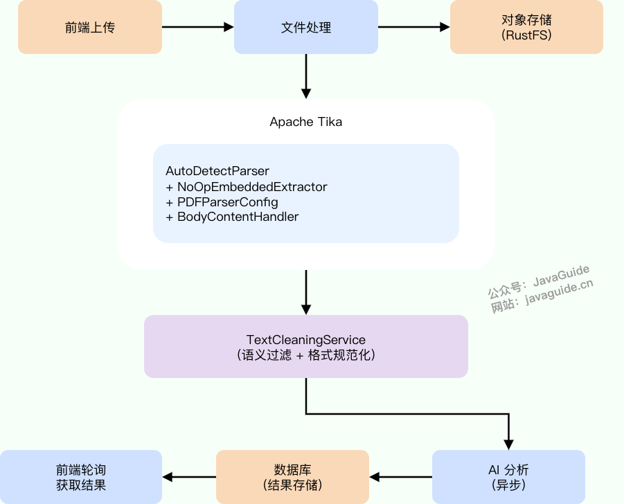
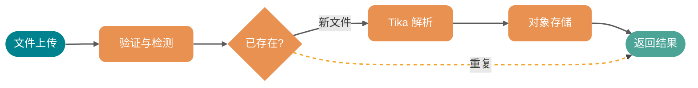
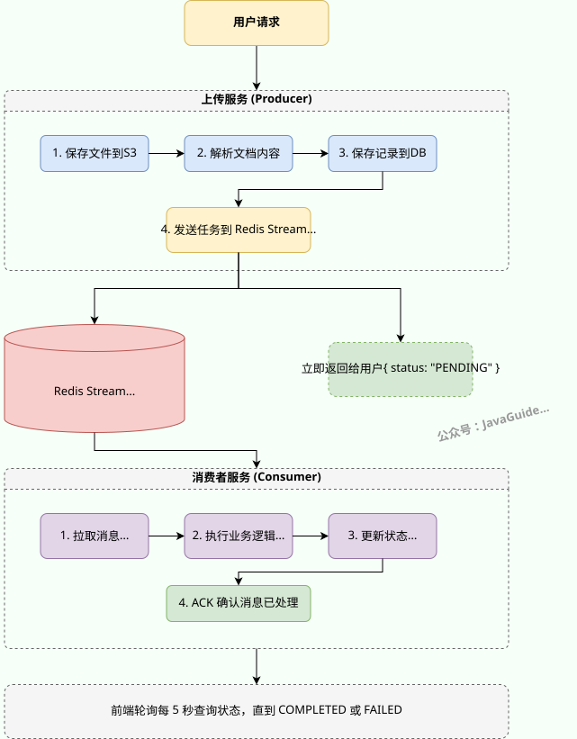

# 基于 Tika 实现多格式内容提取与解析

# 简历上传与解析

大家好，我是 Guide。

> **系列定位**：本文讲简历文件的上传、解析、清洗与去重——即 AI 分析之前的数据准备环节。Tika 的配置优化和双层清理策略是本文的重点。简历分析的 Prompt 设计见[《手把手教你写出生产级结构化 Prompt》](https://www.yuque.com/snailclimb/itdq8h/znhrmtie49dba7x7)，PDF 报告导出见[《基于 iText 8 实现 PDF 报告导出》](https://www.yuque.com/snailclimb/itdq8h/lqcckshs644447fx)，异步任务队列的完整实现见[《基于 Redis Stream 的异步任务处理》](https://www.yuque.com/snailclimb/itdq8h/yk25d6iw6s21xczn)。本文不重复这些前置内容。

## 从一个用户操作说起

用户点击“上传简历”，选择一份 PDF 或 Word 文件。几秒后页面显示“上传成功，正在分析中”。大约 10-30 秒后刷新页面，就能看到完整的简历分析报告——各维度评分、优势亮点、改进建议。

这个流程看起来简单：**上传文件 → 解析内容 → AI 分析 → 返回结果**。但“解析内容”这一步藏着不少工程问题。

很多人以为文件上传就是前端发个文件、后端存一下的事。我也曾这么想。但当测试中 Word 简历里混进了 `image1.jpeg`，PDF 解析出 `file:///tmp/apache-tika-xxx` 路径，AI 据此给出了“建议移除图片中的敏感路径信息”这种荒唐建议时，才意识到：**文件解析的质量直接决定了 AI 分析的天花板——垃圾进，垃圾出**。

本文解决四个核心问题：

| 问题 | 挑战 | 方案关键词 |
| --- | --- | --- |
| 文件类型伪造 | 后缀名和 Content-Type 都可以伪造 | 魔数检测（Tika detect） |
| 解析噪音 | 图片文件名、临时路径、分隔线污染正文 | NoOp + 双层清洗 |
| 内存安全 | 大文件导致 OOM | BodyContentHandler 限长 |
| 重复上传 | 同一文件多次上传浪费 AI 调用 | SHA-256 去重 |

## 最小可运行示例

在深入优化之前，先看 Tika 最基本的用法——两行代码解析一个文件：

```java
Tika tika = new Tika();
String text = tika.parseToString(inputStream);
```

这就是 Tika 的"Hello World"。对于一份干净的纯文本简历，输出可能还不错。但对于真实世界中的 Word/PDF 简历，它会带来三个问题：

* **嵌入资源污染**：Word 文档中的头像图片被提取为 `image1.jpeg`，混在正文里
* **临时路径泄露**：PDF 内嵌资源产生 `file:///tmp/apache-tika-123456.html` 这样的路径
* **无长度限制**：恶意文件可能产生超大文本，直接 OOM

这三个问题对应问题域总览表的第二、三行——解析噪音和内存安全。第一行（文件类型伪造）和第四行（重复上传）属于上传阶段的问题，后面会单独展开。

在展开之前，先解释本文反复出现的三个概念：

* **魔数（Magic Number）**：文件头部固定格式的字节序列，类似身份证号——不管你把 `.exe` 改名为 `.pdf`，文件头部的字节不会变，检测手段比后缀名和 Content-Type 可靠得多。
* **嵌入资源（Embedded Resource）**：Word/PDF 文件内部附带的图片、附件等子文档。类似快递箱里的填充物——你只要里面的商品，不需要泡沫。
* **双层清洗**：Tika 在解析阶段主动过滤是一层，解析后再用正则兜底清理是第二层。类似洗衣服——洗衣机先洗一遍，拿出来再检查有没有残留污渍。

## 技术选型：为什么是 Apache Tika

Java 生态的文档解析方案各有侧重：

| 方案 | 格式覆盖 | 核心优势 | 适用场景 |
| --- | --- | --- | --- |
| **Apache Tika** | 上千种格式 | 统一 API，自动识别类型 | 通用文档解析（首选） |
| Apache POI | 仅 Office | Word/Excel 结构控制细 | 仅处理 Office 报表 |
| Apache PDFBox | 仅 PDF | PDF 解析最稳定 | 仅处理 PDF |
| Pandoc | 极高 | 格式转换还原度高 | 离线转换（需系统安装） |

本项目选 Tika 而不是 POI + PDFBox 组合。Tika 的好处是一套 API 覆盖所有格式、自动检测类型，代码量少；代价是对单个格式的精细控制不如专用库。

对于简历解析，我们只需要干净的纯文本，不需要操作表格样式或注释批注，Tika 完全够用。`AutoDetectParser` 根据文件内容自动选择对应的解析器——底层封装了 PDFBox（处理 PDF）和 POI（处理 Office），不需要为每种格式写不同的处理逻辑。

依赖配置：

```groovy
// build.gradle
implementation "org.apache.tika:tika-core:${libs.versions.tika.get()}"
implementation "org.apache.tika:tika-parsers-standard-package:${libs.versions.tika.get()}"
```

`tika-core` 提供 API 层，`tika-parsers-standard-package` 包含所有主流格式的解析器实现。

## 上传流程：八步流水线

用户上传简历后，`ResumeUploadService.uploadAndAnalyze()` 按顺序执行 8 个步骤。整体架构如下：



下面这张流程图聚焦上传阶段的核心路径，重点看”验证与检测 → 去重检查”这段决策逻辑，命中去重的文件走黄色虚线直接返回，跳过后续的解析和存储：



8 步的职责分别是：文件验证（非空、大小）、类型检测（魔数）、去重检查（SHA-256）、Tika 解析、文本清洗、对象存储（RustFS/S3）、数据库入库（状态 PENDING）、推入 Redis Stream 异步分析。如果第 3 步命中去重，直接返回历史分析结果。

下面只展开技术含量最高的几步。完整的 8 步代码见 `ResumeUploadService.java`。

### Controller 入口

Controller 只做限流和委托，业务逻辑全在 Service 层。重点看两处：`@RateLimit` 注解控制上传频率，`isDuplicate` 判断区分首次上传和重复命中：

```java
@PostMapping(value = "/api/resumes/upload", consumes = MediaType.MULTIPART_FORM_DATA_VALUE)
@RateLimit(dimension = RateLimit.Dimension.GLOBAL, count = 5)
@RateLimit(dimension = RateLimit.Dimension.IP, count = 5)
public Result<Map<String, Object>> uploadAndAnalyze(@RequestParam("file") MultipartFile file) {
    Map<String, Object> result = uploadService.uploadAndAnalyze(file);
    boolean isDuplicate = (Boolean) result.get("duplicate");
    if (isDuplicate) {
        return Result.success("检测到相同简历，已返回历史分析结果", result);
    }
    return Result.success(result);
}
```

`@RateLimit` 是项目自定义的可重复注解，默认时间窗口 1 秒，全局每秒最多 5 次、单 IP 每秒最多 5 次，防止批量上传拖垮服务。重复简历的响应里带 `"duplicate": true`，前端据此展示不同的提示信息。

### 文件验证与类型检测

**朴素做法**：用 `file.getContentType()` 拿 Content-Type，再按后缀名校验。大多数教程就是这么写的。

**翻车场景**：任何人都可以用 `curl` 或 Postman 伪造 Content-Type 为 `application/pdf`，后缀名也可以随意改。如果后端信任了这些客户端提供的信息，一个伪装成 PDF 的可执行文件就能绕过校验上传成功。

**最终方案**：让 Tika 读取文件头部的魔数来判断真实类型，不依赖任何客户端提供的信息。项目封装了 `ContentTypeDetectionService`，底层调用 `tika.detect(inputStream, fileName)`，Tika 会读取文件的前几十个字节，匹配已知的文件签名——比如 PDF 以 `%PDF-` 开头，DOCX 以 `PK`（ZIP 格式）开头：

```java
// ContentTypeDetectionService 的核心调用
String contentType = tika.detect(inputStream, fileName);
```

检测到的 MIME 类型再与白名单比对：

```yaml
# application.yml
app:
  resume:
    allowed-types:
      - application/pdf
      - application/msword
      - application/vnd.openxmlformats-officedocument.wordprocessingml.document
      - text/plain
```

只接受 PDF、DOC、DOCX 和纯文本四种格式。

这里有一个双重防护的设计：业务层限制文件大小 10 MB，Spring 层的全局 multipart 配置允许 50 MB（为了兼容知识库模块的大文件上传）。两层限制独立生效，即使业务层的校验被遗漏，Spring 层仍然兜底。

### 文件去重：SHA-256

第三步检查文件是否已经上传过。`FileHashService` 对整个文件的原始字节计算 SHA-256 哈希值，`ResumePersistenceService` 在数据库的 `fileHash` 字段（有唯一索引 `idx_resume_hash`）中查找。如果命中，递增已有记录的访问计数，直接返回历史分析结果，不重复调用 AI。

我们选了 SHA-256 而不是 MD5。SHA-256 的好处是碰撞概率极低（2^128 级别），代价是计算稍慢。MD5 在理论上已证明存在碰撞攻击，但对简历去重这个场景实际风险极低。选 SHA-256 主要是出于工程习惯——安全哈希函数选更强的，不增加什么成本，万一以后复用到安全场景也不需要改。

这里有一个降级设计：如果哈希计算或查询失败，不会阻断上传流程，而是降级为正常上传。去重的目的是省 AI 调用，不是卡用户。

> 去重的完整实现（哈希计算、中文文件名转拼音、S3 存储路径生成）详见[《Spring Boot + RustFS 构建高性能 S3 兼容的对象存储服务》](https://www.yuque.com/snailclimb/itdq8h/ak232s1mfmgp920w)。

## Tika 解析优化：从默认方式到工程化配置

上传流程的第四步是“解析简历文本”，由 `DocumentParseService`（位于 `infrastructure.file` 包）完成。它在 `Tika.parseToString()` 的基础上做了四个关键配置。

### 四个配置项

下面这段代码是 `DocumentParseService.parseContent()` 的核心实现，配置了 Tika 解析器的行为。其中最关键的是第 3 步和第 4 步——它们直接决定了解析结果的干净程度：

```java
private String parseContent(InputStream inputStream)
        throws IOException, TikaException, SAXException {

    // 1. 自动检测解析器——根据文件内容选择 PDFBox、POI 等
    AutoDetectParser parser = new AutoDetectParser();

    // 2. 限制最大文本长度（5MB），防止 OOM
    BodyContentHandler handler = new BodyContentHandler(MAX_TEXT_LENGTH);

    Metadata metadata = new Metadata();
    ParseContext context = new ParseContext();

    // 3. 禁用嵌入文档提取——跳过图片、附件
    context.set(Parser.class, parser);
    context.set(EmbeddedDocumentExtractor.class,
        new NoOpEmbeddedDocumentExtractor());

    // 4. PDF 专用配置：关闭内嵌图片提取，按坐标排序
    PDFParserConfig pdfConfig = new PDFParserConfig();
    pdfConfig.setExtractInlineImages(false);
    pdfConfig.setSortByPosition(true);
    context.set(PDFParserConfig.class, pdfConfig);

    parser.parse(inputStream, handler, metadata, context);
    return handler.toString();
}
```

每个配置项对应解决一个具体问题：

| 配置项 | 解决的问题 | 效果 |
| --- | --- | --- |
| `BodyContentHandler(5MB)` | 大文件 OOM | 超过 5 MB 的文本抛 `SAXException`，而不是撑爆内存 |
| `NoOpEmbeddedDocumentExtractor` | Word 图片引用 `image1.jpeg` | 跳过所有嵌入资源，不提取文件名 |
| `PDFParserConfig.setExtractInlineImages(false)` | PDF 内嵌图片泄露 | 不提取 PDF 中的内嵌图片 |
| `PDFParserConfig.setSortByPosition(true)` | 多栏 PDF 阅读顺序错乱 | 按坐标从左到右、从上到下排序 |

`BodyContentHandler` 是 Tika 提供的装饰器，它只接收 SAX 管道中的正文事件（`characters`、`startElement`、`endElement`），文档的元数据（作者、创建时间等）由单独的 `Metadata` 对象接收，所以 `handler.toString()` 拿到的天然就是纯正文，不含文档属性信息。

`BodyContentHandler` 的构造参数是写缓冲区的最大字符数。达到上限后 Tika 抛 `SAXException`，由上层捕获并转换为业务异常。这里的 5 MB 是文本长度限制，不是文件大小——一个 3 MB 的 Word 文档，解析出的纯文本通常只有几百 KB，但一个恶意构造的文件可能让解析输出膨胀数十倍，这个上限就是防这种极端情况的。

我们选了 5 MB 而不是更小的值。5 MB 的好处是能覆盖超长简历（比如 50 页的学术 CV），代价是内存峰值略高。实际上大多数简历的解析文本在 10-50 KB 之间，5 MB 的上限几乎不会在正常使用中触发，主要是防恶意输入。

### NoOpEmbeddedDocumentExtractor 的工作原理

Tika 解析文档时，遇到嵌入资源（图片、附件）会调用 `EmbeddedDocumentExtractor` 接口。默认实现会提取这些资源并输出引用信息。`NoOpEmbeddedDocumentExtractor` 通过让 `shouldParseEmbedded()` 始终返回 `false`，告诉 Tika 跳过所有嵌入资源：

```java
@Slf4j
public class NoOpEmbeddedDocumentExtractor implements EmbeddedDocumentExtractor {

    @Override
    public boolean shouldParseEmbedded(Metadata metadata) {
        String resourceName = metadata.get("resourceName");
        if (resourceName != null) {
            log.debug("Skip embedded document: {}", resourceName);
        }
        return false;  // 始终跳过
    }

    @Override
    public void parseEmbedded(InputStream stream, ContentHandler handler,
            Metadata metadata, boolean outputHtml) {
        // 空实现——shouldParseEmbedded 返回 false 后不会被调用
    }
}
```

关键在 `shouldParseEmbedded()` 返回 `false`——Tika 解析时每遇到一个嵌入资源都会调用这个方法询问“要不要提取”，`false` 直接跳过，`parseEmbedded()` 永远不会被执行。跳过的资源类型包括 Word 中的图片（`image1.jpeg`）、PDF 中的内嵌附件、Excel 中的图表、PPT 中的幻灯片图片。

我们选了 NoOp 而不是解析后再用正则过滤。NoOp 的好处是从源头阻止噪音进入解析结果——噪音的格式不可预测，与其穷举所有可能的噪音模式，不如直接关掉嵌入资源提取。代价是简历中嵌入的项目截图、作品集图片也会被跳过，但这些信息在纯文本 AI 分析中本来就无法利用。

### 解析效果对比

**默认方式输出**（Word 简历，含头像和项目截图）：

```plain
image1.jpeg
张三
联系方式：138xxxx1234
image2.png
image3.jpeg
---
工作经验
XXX 公司 - 高级工程师
file:///tmp/tika-123.html?query=0
负责系统架构设计
```

**优化后输出**：

```plain
张三
联系方式：138xxxx1234

工作经验
XXX 公司 - 高级工程师
负责系统架构设计
```

噪音被完全清除——没有图片文件名，没有临时路径，没有分隔线。干净的文本直接送入 AI 分析，效果自然更好。

## 文本清洗：解析后的二次过滤

**朴素做法**：只依赖上面的 Tika 配置，解析完直接送给 AI。

**翻车场景**：某些 PDF 的特殊排版会在解析结果中残留 `file:///tmp/` 路径（即使已禁用了图片提取），有些 Word 文档的分隔线会变成连续的 `---` 或 `===`。这些噪音不是每次都出现，但一旦出现就会污染 AI 的输入。

**最终方案**：“双层清理”策略——Tika 配置是第一道防线，`TextCleaningService` 是第二道兜底：

| 场景 | Tika 处理 | TextCleaningService 处理 |
| --- | --- | --- |
| Word 嵌入图片 | NoOp 跳过 | 兜底清理残留文件名 |
| PDF 临时路径 | 部分场景仍泄露 | 正则过滤 `file://` |
| 特殊符号分隔线 | 无法处理 | 正则过滤 `---`、`===` |
| 连续空行 | 无法处理 | 压缩为单个空行 |
| 未知噪音 | 可能遗漏 | 兜底保障 |

`TextCleaningService.cleanText()` 的核心逻辑分两层。第一层是语义去噪——去掉控制字符、图片文件名、图片链接、文件路径和分隔线。第二层是格式规范化——统一换行符、去掉行尾空格、压缩连续空行。下面这段代码展示了两层清洗的执行顺序，重点看第一层五个正则的匹配目标——每个都针对一种具体的 Tika 残留噪音：

```java
public String cleanText(String text) {
    if (text == null || text.isBlank()) return "";

    String t = text;

    // 第一层：语义去噪
    t = CONTROL_CHARS.matcher(t).replaceAll("");       // 控制字符
    t = IMAGE_FILENAME_LINE.matcher(t).replaceAll("");  // image1.png 等整行
    t = IMAGE_URL.matcher(t).replaceAll("");            // http://xxx.png
    t = FILE_URL.matcher(t).replaceAll("");             // file:///tmp/xxx
    t = SEPARATOR_LINE.matcher(t).replaceAll("");       // ---、===、***

    // 第二层：格式规范化
    t = t.replace("\r\n", "\n").replace("\r", "\n");    // 统一换行符
    t = t.replaceAll("(?m)[ \t]+$", "");               // 去行尾空格
    t = t.replaceAll("\\n{3,}", "\n\n");               // 压缩连续空行

    return t.strip();
}
```

所有正则表达式都预编译为 `static final Pattern`，避免每次调用时重复编译。清理规则的设计原则是“精确匹配，降低误删风险”——比如图片文件名的正则要求整行必须是 `image1.png` 这种格式才删除，不会误删包含 "image" 这个词的正常文本；分隔线正则也要求整行都是连续符号才匹配。

## 异步分析：Redis Stream

上传流程的前 7 步都是毫秒级的本地操作，唯独第 8 步——AI 分析——通常需要 5-30 秒。如果放在 HTTP 请求内同步执行，前端要等很久才能拿到响应，超时风险也高。因此第 8 步只做一件事：把分析任务推入 Redis Stream，由后台消费者异步处理。上传接口在推入 Stream 后立刻返回 `PENDING` 状态：



### 为什么不用 @Async

Spring 的 `@Async` 注解也能实现异步，但它解决不了两个问题。第一，`@Async` 没有队列缓冲——100 个简历同时上传，会同时启动 100 个 AI 调用，瞬间打满 LLM API 的并发配额。第二，`@Async` 没有内置的消息确认和重试——任务失败就是失败了，需要自己写重试逻辑。

Redis Stream 提供消费者组、消息确认（ACK）和待处理列表（Pending List），消费者崩溃后未确认的消息可以被其他消费者重新认领。项目本身已经依赖 Redis（限流、缓存），不需要引入 Kafka 或 RabbitMQ 来增加运维负担。对于“每分钟几十到几百条异步任务”这个量级，Redis Stream 完全够用。

### 状态流转

简历实体的 `status` 字段经历四个状态：

| 状态 | 触发时机 | 含义 |
| --- | --- | --- |
| `PENDING` | 上传成功，任务已推入 Stream | 等待消费者处理 |
| `PROCESSING` | 消费者取出任务，开始 AI 分析 | 处理中 |
| `COMPLETED` | AI 分析完成，结果已入库 | 可查看报告 |
| `FAILED` | 重试 3 次仍失败 | 需手动触发重新分析 |

前端通过轮询简历详情接口获取状态变化。大多数简历在 10-30 秒内完成分析，前端通常轮询 5-10 次就能拿到最终结果。

> 异步任务的完整实现（消费者组配置、重试机制、消息确认、Pending List 监控）详见[《基于 Redis Stream 的异步任务处理》](https://www.yuque.com/snailclimb/itdq8h/yk25d6iw6s21xczn)。

## 故障场景速查

多组件协作难免出问题。这张表覆盖了上传解析链路的主要故障场景和系统应对方式，既是设计文档，也是排查问题时的速查卡：

| 故障场景 | 系统行为 | 用户感知 |
| --- | --- | --- |
| 文件类型不在白名单 | 业务异常，返回错误提示 | “仅支持 PDF、DOC、DOCX、TXT 格式” |
| 文件超过 10 MB | 业务异常，返回错误提示 | “文件大小不能超过 10MB” |
| 解析文本超过 5 MB | Tika 抛 `SAXException`，转为业务异常 | “文件内容过大，解析失败” |
| SHA-256 哈希计算失败 | 降级为正常上传，不阻断流程 | 用户无感知，正常上传 |
| S3 存储不可用 | 上传失败，数据库不写入 | “文件上传失败，请重试” |
| Redis Stream 不可用 | 文件和记录已保存，状态停留在 PENDING | 显示“分析中”，需手动触发重新分析 |
| AI 分析失败 | 消费者自动重试，最多 3 次 | 重试成功无感知；3 次失败后标记 FAILED |

## 总结

* **用魔数检测文件类型**：不要信任 HTTP Content-Type 或文件后缀名，让 Tika 读取文件头部字节判断真实类型。
* **禁用嵌入资源提取**：`NoOpEmbeddedDocumentExtractor` 从源头阻止噪音，比解析后再用正则清理更可靠。
* **双层清洗，互为兜底**：Tika 配置负责解析阶段的主动过滤，`TextCleaningService` 负责解析后的兜底清洗。两者配合才能覆盖所有噪音场景。
* **限制文本长度防 OOM**：`BodyContentHandler(5MB)` 在内存层面设了硬上限，恶意文件最多触发一个异常，不会拖垮整个服务。
* **SHA-256 去重省 AI 调用**：同一份简历上传两次，第二次直接返回缓存结果，省掉一次 AI 分析的成本。

## FAQ

**Q：为什么不在上传时就调用 AI 分析，而是推到异步队列？**

AI 分析一次简历通常需要 5-30 秒，放在 HTTP 请求内同步执行，前端要等很久才能拿到响应，超时风险也高。推入异步队列后，用户上传后立即得到 `PENDING` 状态，前端轮询即可。同时 Redis Stream 的消费速率受消费者数量控制，天然提供异步解耦与消费端限速—AI 服务过载时任务在队列中排队，不会压垮服务。

**Q：双层清洗会不会误删简历正文？**

清理规则都做了精确匹配来降低误删风险。图片文件名的正则要求整行必须是 `image1.png` 这种格式才删除，不会误删包含"image"这个词的正常文本。分隔线正则也要求整行都是连续符号才匹配。在实际使用中，没有出现过误删简历正文的情况。

**Q：如果用户修改了简历重新上传，去重会不会误判为重复？**

不会。SHA-256 去重基于文件的原始字节计算。只要文件内容有任何改动（哪怕只改了一个字），哈希值就会完全不同，系统会当作新文件处理。只有完全相同的文件才会命中去重逻辑。


> 更新: 2026-08-10 18:58:17  
> 原文: <https://www.yuque.com/snailclimb/itdq8h/rg801wh4daa3dnoz>