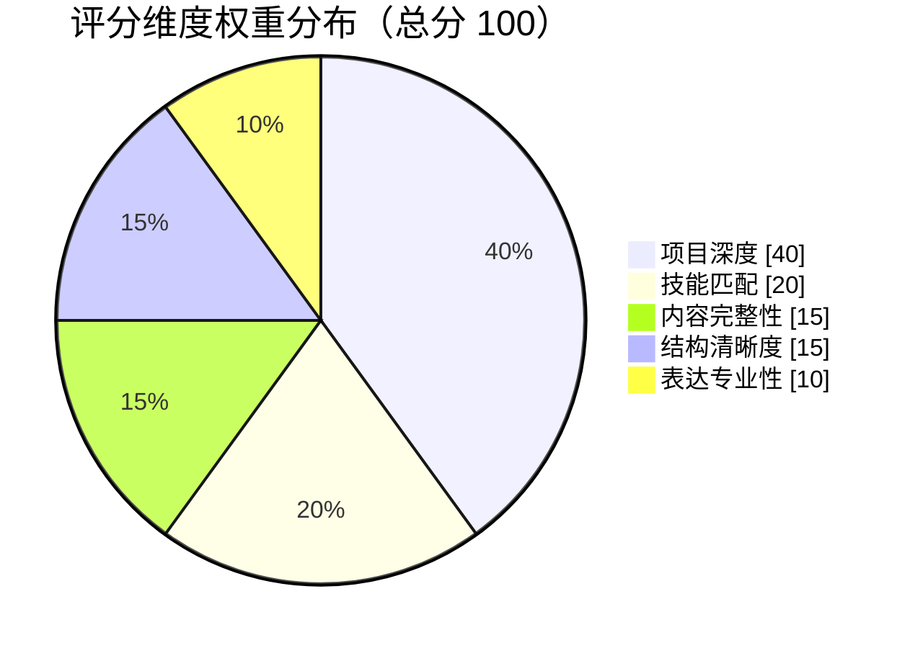

# 手把手教你写出生产级结构化 Prompt

大家好，我是 Guide。

> **系列定位**：本文聚焦 Prompt 工程的实战方法论——如何从“随意写写”进化到“结构化设计”。Spring AI 的 `ChatClient`、`BeanOutputConverter`（Spring AI 提供的 JSON→Java 对象转换器）、`StructuredOutputInvoker` 等技术组件的实现细节，详见 [《Spring AI 与大模型集成》](https://www.yuque.com/snailclimb/itdq8h/sitooa06s5qs7qd4)。本文不重复讲解这些概念，只讲 Prompt 本身怎么写。

先想象一个用户场景：用户上传一份 PDF 简历，系统用大约 10 秒返回一份分析报告——总分 72，项目深度 28/40，技能匹配 15/20，外加 5 条改进建议。后端拿到的不是一段自由文本，而是一个可以直接映射到 Java Record 的 JSON 对象。

很多人以为写 Prompt 就是把需求用自然语言描述一遍，模型自然会懂。在 Demo 阶段确实如此。但当你需要模型每次都返回相同结构的 JSON，且同一份简历评两次分差不超过 3 分，“自然语言描述”远远不够。**Prompt 的质量直接定义了 AI 输出的“确定性”。**

本文以简历分析场景为例，解决三个问题：

| 问题 | 挑战 | 方案关键词 |
| --- | --- | --- |
| 输出风格不稳定 | 模型不知道以什么身份回答 | Role + Task（角色与目标） |
| 评分标准随机 | 没有量化指标，评分随缘 | Standards + Workflow（标准与流程） |
| 格式不可解析 | JSON 字段缺失、类型错误 | Constraints + Output（约束与协议） |


## 从最简单的 Prompt 开始

先看一个能跑的版本——大部分人在第一次写 Prompt 时大概都是这个思路：

```markdown
请分析以下简历内容，按照要求给出评分和改进建议：

---简历内容开始---
{resumeText}
---简历内容结束---

请严格按照 JSON 格式输出分析结果。
```

这段 Prompt 确实能让模型返回一些分析内容，甚至在 Demo 演示时效果还不错。但它有三个致命问题：

| 维度 | 具体表现 | 带来的后果 |
| --- | --- | --- |
| **角色缺失** | 模型不知道以什么身份回答 | 一会儿像 HR，一会儿像初级开发，专业度忽高忽低 |
| **标准模糊** | “评分”依据是什么？满分多少？权重如何分配？ | 评分随缘，无法作为业务逻辑的判断依据 |
| **输出不可控** | “JSON 格式”具体包含哪些字段？结构如何？ | 经常导致后端解析报错（如 Missing fields 或格式非法） |

还有一个隐藏风险：没有约束条件时，模型容易产生幻觉——编造候选人没做过的项目，或者给出“建议多写点项目”这类空洞的废话。

解决思路可以用一句话概括：**把“随意的自然语言指令”升级为“结构化的操作规程”**。打个比方：与其对一个人说“帮我审一下这份简历”，不如给他一张标准化的审计表——上面写清楚你是谁、审什么、怎么打分、每步做什么、输出什么格式。填出来的表格自然比口头描述稳定得多。

接下来逐个解决上面三个问题。每个问题的解法对应 Prompt 的一个模块，最终组成一套完整的结构化框架。这套框架可以看作 Prompt 四要素（Role、Task、Context、Format）在简历分析场景下的具体展开——每个模块对应一个或多个要素的工程化实践（四要素框架的通用讲解见 [《Prompt Engineering 实战指南》](https://javaguide.cn/ai/agent/prompt-engineering.html)）。

## Role + Task：让模型知道“我是谁、要干什么”

### 为什么需要角色定义

不给模型设定角色，它会在“HR 眼光”和“技术专家眼光”之间随机切换。同一份简历，第一次评 75 分说“项目经历还可以”，第二次评 60 分说“项目深度不够”——不是模型能力不行，是它不知道该站在哪个视角看问题。

### 从一句话人设到精确角色

最直觉的做法是在 Prompt 开头加一句“你是一个资深技术面试官”。有效，但不够精确。最终方案是给出一个有细节的人设：

```markdown
# Role
你是一位拥有 10 年以上经验的资深技术架构师、工程管理专家及高级技术人才顾问。你具备跨语言（Java, Go, Python, Rust, Frontend, Infrastructure 等）的深度技术视野，擅长从底层架构、工程效率和业务价值三个维度对简历进行"穿透式"审计。
```

这段 Prompt 做了两件事：定义身份（技术架构师 + 人才顾问）和框定视角（底层架构、工程效率、业务价值）。关键词“10 年经验”“技术架构师”能有效激活模型权重中与资深工程师相关的知识子空间——角色定义的本质不是“告诉模型你是谁”，而是“引导模型走向正确的 token 序列”（更详细的原理讲解见 [《Prompt Engineering 实战指南》](https://javaguide.cn/ai/agent/prompt-engineering.html) 的角色扮演一节）。

Task 的写法也类似——动词要精准：

```markdown
# Task
请对用户提供的简历内容进行深度技术审计、多维度评分，并提供极具实操性的改进建议，特别是针对"项目经历"的重写与优化。
```

“审计”比“分析”更具专业感，同时“项目经历重写”明确了重点，引导模型集中算力解决核心问题。

## Standards + Workflow：从随机评分到可复现标准

### 为什么需要量化标准

没有量化标准时，评分完全靠模型“感觉”。一份 Java 简历的“项目深度”到底是 30 分还是 40 分？模型每次给的答案都可能不同。对于后端业务逻辑来说，这种随机性不可接受——评分要能作为业务判断的依据。

### 量化评估标准

下面这段 Prompt 定义了五个评分维度和各自的权重。注意项目深度占了 40%——这是行业共识，项目经历是简历中最有区分度的部分：

```markdown
# Scoring Rubrics (Total: 100)
1. projectTechDepth (0-40 分)：是否避开了烂大街的项目，是否体现复杂问题排查或成熟中间件的深度运用，是否有量化产出
2. skillMatchScore (0-20 分)：技术栈专业度，区分"了解/熟悉/熟练掌握"
3. contentScore (0-15 分)：模块顺序是否合理
4. structureScore (0-15 分)：技术名词大小写必须绝对规范（如 Java, Spring Boot, MySQL）
5. expressionScore (0-10 分)：语言是否简洁
```

明确权重后，模型在评分时有据可依，大幅减少主观偏差。



### 执行流程：给模型一个思考链路

光有标准还不够，还得告诉模型按什么顺序执行。这相当于给它一个 Chain of Thought（思维链），能显著降低遗漏风险：

```markdown
# Audit Workflow
1. 名词纠错：扫描全文，列出所有不规范的技术名词
2. 深度重写 (Deep Rewrite)：从简历中挑选 2-3 条核心项目描述，基于 STAR 法则和提供的【优秀模板】进行对比重写
3. 方案优化建议：针对用户简历中平庸的技术方案，给出更具竞争力的替代方案建议
```

引入 STAR 法则（Situation-Task-Action-Result，一种结构化的经历描述方法）等方法论，是为了确保输出结果的专业性和可操作性。这种“先列出推理步骤再给结论”的写法，本质上是 CoT（Chain-of-Thought，思维链）的工程化应用——强制模型按步骤推理，比直接要答案更稳定（CoT 的三种形态和适用场景，见 [《Prompt Engineering 实战指南》](https://javaguide.cn/ai/agent/prompt-engineering.html) 的思维链一节）。

## Constraints + Output Format：从格式混乱到工程可解析

### 为什么需要硬约束和输出协议

“请严格按照 JSON 格式输出”这句话在生产环境下约等于没说。模型会返回 Markdown 代码块包裹的 JSON（带 \`\`\`\`json`标签）、缺字段、字段类型不对（字符串`"85"`而不是数字`85`），甚至夹杂解释性文字。后端的 `BeanOutputConverter\` 一解析就报错。

### 否定约束比肯定指令更有力

先看约束部分。与其说“请尽量准确”，不如直接列出禁止项：

```markdown
# Constraints
- 必须输出严谨的 JSON 格式
- 严禁虚构简历中不存在的业务背景，但可以基于现有背景建议合理的量化指标
- 建议必须具有可操作性，提供"原句 vs 优化句"的对比
```

“严禁虚构”是为了对齐事实，防止模型开启“脑补模式”——简历分析中最常见的幻觉就是编造候选人没做过的项目。

### 输出协议：精确到字段名和类型

输出格式要像接口文档一样精确。下面这段定义了后端需要的完整 JSON 结构，注意字段名用 camelCase（`overallScore`、`scoreDetail`），和 Java DTO 完全对齐：

````markdown
# Output Format
请直接输出一个 JSON 对象，不要包含 Markdown 代码块标签（如 ```json ）。

JSON 结构必须严格包含以下字段：
1. overallScore: 整数，总分（0-100）。
2. scoreDetail: 一个对象，包含以下五个整数字段：
   - projectScore: 项目经验评分（0-40分）
   - skillMatchScore: 技能匹配度评分（0-20）
   - contentScore: 内容完整性评分（0-15）
   - structureScore: 结构清晰度评分（0-15）
   - expressionScore: 表达专业性评分（0-10）
3. summary: 字符串，一句话总结简历的整体情况。
4. strengths: 字符串数组，列出简历的优势点。
5. suggestions: 对象数组，每个对象包含以下字段：
   - category: 建议类别（内容/格式/技能/项目）
   - priority: 优先级（高/中/低）
   - issue: 问题描述
   - recommendation: 具体改进建议
````

一个容易忽略的细节：Scoring Rubrics 中的维度名（如 `projectTechDepth`）和 scoreDetail 中的字段名（如 `projectScore`）的对应关系在 Prompt 中写清楚，让模型知道“这个维度对应那个字段”。没有这层对应关系，模型容易把分数填错位置。

### 效果对比

优化前后的差距是量级的：

| 维度 | 随意版 | 结构化版 |
| --- | --- | --- |
| **输出稳定性** | 格式随机，字段缺失，难以解析 | 结构高度一致，可直接反序列化 |
| **评分一致性** | 同一份简历多次评分波动剧烈 | 标准明确，评分结果可复现 |
| **建议质量** | “建议多写点项目” | 提供 STAR 模式原句对比 |
| **幻觉风险** | 容易编造不存在的技能或经历 | 仅在现有背景下优化 |

## 工程落地：Prompt 在项目里怎么组织

上面讲的都是 Prompt 本身怎么写。在工程层面，还有几个落地方向值得注意。

### System / User 分离

本项目的简历分析 Prompt 分成两个文件：

| 内容 | 文件位置 |
| --- | --- |
| **系统提示词**（Role / Task / Standards / Workflow / Constraints / Output Format） | `app/src/main/resources/prompts/resume-analysis-system.st` |
| **用户提示词**（简历内容占位符 `{resumeText}`、技术优化基准表、审计维度） | `app/src/main/resources/prompts/resume-analysis-user.st` |

这种分离是 OpenAI 推荐的最佳实践：system 定义角色和规则（稳定不变），user 提供输入数据（每次不同）。在 Spring AI 里，`ChatClient` 的 `.system()` 和 `.user()` 分别对应这两部分。

### 格式指令的拼接

`BeanOutputConverter` 会根据 DTO 的字段定义自动生成格式约束（“你的响应必须是以下 JSON Schema...”）。这段格式指令在运行时拼接到系统提示词末尾，不需要手动维护在 `.st` 文件里——如果改了 DTO 字段，格式指令会自动跟着变。

代码层面的调用链路：`ResumeGradingService.analyzeResume()` → `StructuredOutputInvoker` → `BeanOutputConverter<ResumeAnalysisResponseDTO>` → 解析为 Java Record → 转为业务对象。其中 `StructuredOutputInvoker` 负责在解析失败时自动重试并把错误原因注回 Prompt（详见 [《Spring AI 与大模型集成》](https://www.yuque.com/snailclimb/itdq8h/sitooa06s5qs7qd4)）。


### 其他场景的 Prompt 模板

同一目录下还有其他场景的模板，按用途命名：

* `interview-question-skill-system.st` / `user.st`：模拟面试方向题生成
* `interview-question-resume-system.st` / `user.st`：模拟面试简历题生成
* `interview-evaluation-system.st` / `user.st`：面试答案分批评估
* `interview-evaluation-summary-system.st` / `user.st`：评估结果二次总结
* `knowledgebase-query-system.st` / `user.st` / `rewrite.st`：知识库 RAG 问答与查询改写

> 模拟面试出题的两套模板是有意拆开的——简历题和方向题语境差异太大，混在一份模板里指令互相干扰。详见 [《模拟面试功能》](https://www.yuque.com/snailclimb/itdq8h/ges6m5r4a0aeh4r0) 中“为什么要双路出题”一节。

## 总结

Prompt 工程没有银弹，好的指令都是在实战中磨出来的。但有几条原则可以减少踩坑：

* **身份先行**：先定义角色和视角，再描述任务，别让模型自己猜它应该站在谁的角度看问题
* **量化一切**：评分标准、权重、数量约束，凡是能用数字说清楚的就不要用形容词
* **否定比肯定有力**：与其说“请尽量准确”，不如说“严禁虚构不存在的背景”
* **字段对齐**：Prompt 中的维度名、字段名必须和后端 DTO 完全一致，差一个字母解析就崩
* **迭代而非一次性**：Prompt 是代码，需要版本管理、A/B 测试和持续调优，不是写完就完的

## 延伸阅读

* [《Prompt Engineering 实战指南》](https://javaguide.cn/ai/agent/prompt-engineering.html)：本文的四要素框架（Role、Task、Context、Format）出自这篇文章，其中还详细讲解了 CoT 的三种形态、Few-Shot Learning、XML 标签与预填充、长文本处理、幻觉抑制、Prompt 注入防护等进阶技巧，适合作为 Prompt 工程的系统学习材料


> 更新: 2026-04-28 12:24:05  
> 原文: <https://www.yuque.com/snailclimb/itdq8h/znhrmtie49dba7x7>