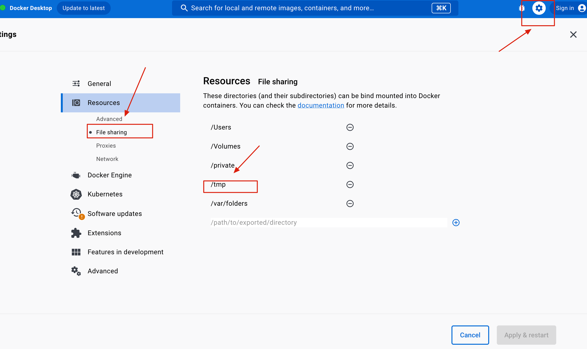
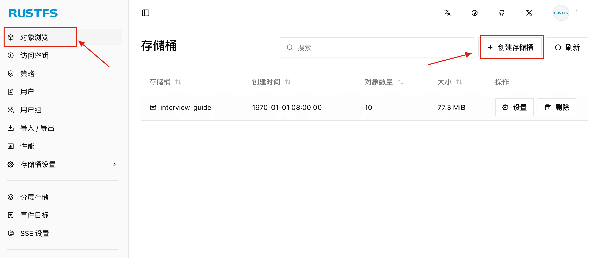
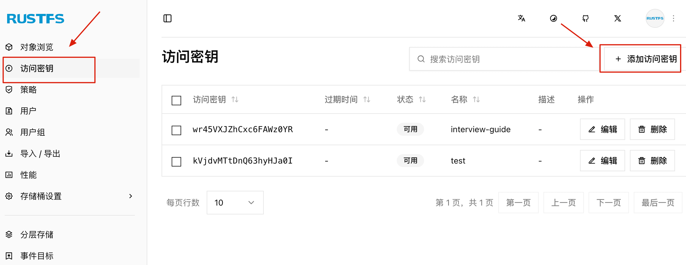

# Spring Boot + RustFS 构建高性能 S3 兼容的对象存储服务

大家好，我是 Guide！在 LLM 应用开发中，除了向量数据库这个“大脑”，我们还需要一个稳健、高性能的“储物间”来存放原始文档、图片或简历文件。

很多小伙伴习惯用 MinIO，但今天我要带大家认识一位“硬核新成员”——**RustFS**。它不仅完全兼容 S3 协议，更凭借 Rust 语言的特性，在内存安全和响应延迟上给了我们不少惊喜。

> 本项目是 Minio 兼容的，你也可以使用 Minio，无缝切换。

## RustFS 简介

RustFS 是一个基于 Rust 语言开发的高性能分布式对象存储软件，定位与 MinIO 高度相似，功能基本对齐 MinIO 开源版（包括分片上传、桶策略、版本控制、事件通知、生命周期管理等），完全兼容 AWS S3 协议，部署简单（Docker 一键启动），并提供现代化的可视化管理控制台。

根据官方同等硬件压测，RustFS 在小对象（4KB）场景下吞吐量约为 MinIO 的**2.3 倍**，大对象场景也高达**1.8~2.2 倍**。

与 MinIO 不同的是，RustFS 采用宽松的 Apache 2.0 许可证，对商业闭源产品更加友好。

由于 RustFS 完全兼容 S3 协议，我们可以直接使用 AWS S3 SDK 进行开发，无需额外适配。

## RustFS vs  Minio

| 比较维度 | Ceph | MinIO | RustFS |
| :--- | :--- | :--- | :--- |
| **开发语言** | C++ | Go | Rust |
| **开源许可证** | LGPL-2.1 / LGPL-3.0 | AGPL-3.0 | Apache-2.0 |
| **元数据中心** | 有（集中式/分布式元数据） | 无（去中心化） | 无（去中心化） |
| **块存储支持** | ✅ 支持 (RBD) | ❌ 不支持 | ❌ 不支持 |
| **文件存储支持** | ✅ 支持 (CephFS) | ❌ 不支持 | ❌ 不支持 |
| **架构设计** | 重型架构，设计复杂 | 轻量级架构，简洁高效 | 轻量级架构，极致性能 |
| **社区活跃度** | 高 | 高 | 中（处于上升期） |
| **许可证友好度** | 中（LGPL 限制较多） | 差（AGPL 对商用不友好） | **优**（Apache 协议极其友好） |
| **性能表现** | 强依赖硬件配置与调优 | 高性能、低延迟，适合大对象 | **极高性能**，利用 Rust 零成本抽象 |
| **文件协议** | S3, RBD, CephFS 等多种 | S3 | S3 |
| **使用/运维难度** | 高（配置复杂，门槛高） | 低（开箱即用，运维简单） | 低（部署简单，配置精简） |
| **扩容能力** | EB 级 | EB 级 | EB 级 |
| **硬件资源需求** | 高（对 CPU/内存消耗大） | 中（资源占用适中） | **低**（内存安全且占用极低） |
| **内存稳定性** | 稳定 | 高并发下可能存在抖动/GC 压力 | **极稳定**（无 GC，内存管理精细） |
| **扩容难度** | 难度高（数据重平衡压力大） | 难度低 | 难度低 |
| **数据重平衡** | 资源占用高，影响业务 | 资源占用低 | 资源占用低 |
| **商业支持** | ✅ 完善 | ✅ 完善 | ✅ 提供 |
| **成熟度/稳定性** | **极高**（多年生产环境验证） | **高**（对象存储事实标准） | **较低**（新兴项目，稳定性待验证） |

Ceph 和 MinIO 在行业内毫无疑问是出于领先地位的！

RustFS 的性能和内存安全是其亮点，并且其使用的 **Apache-2.0** 协议相比 MinIO 的 **AGPL** 在商业化落地上的巨大优势（这也是很多企业选择新方案的核心考量点）。不过，RustFS 作为新兴项目，在稳定性上存在短板。

关于为什么没有首选 MinIO ，可以参考我写的这篇文章：[对标MinIO！全新一代分布式文件系统诞生！](https://mp.weixin.qq.com/s/mYfj05je0EoH3siL-qJzBw)（被 RustFS 官方人员点赞认可过）。

## RustFS 安装

**前置条件：**

* 已安装 Docker（≥ 20.10）并能正常拉取镜像与运行容器
* 本地路径 `/tmp/rustfs/data`（或自定义路径）用于挂载对象数据

> 如果你使用的是 Docker Desktop，需要在设置中将数据目录添加到 File Sharing 列表。



**拉取镜像：**

```bash
docker pull rustfs/rustfs
```

**启动容器：**

RustFS SNSD Docker 运行方式，结合上述镜像与配置，执行（请注意修改 `-v` 挂载目录为你本地的实际路径）：

```bash
docker run -d \
  --name rustfs_local \
  -p 9000:9000 \
  -p 9001:9001 \
  -v /tmp/rustfs/data:/data \
  rustfs/rustfs:latest \
  /data
```

**各参数说明：**

| 参数 | 说明 |
| --- | --- |
| `-p 9000:9000` | 映射 S3 API 端口（应用程序访问） |
| `-p 9001:9001` | 映射 Web Console 端口（管理后台） |
| `-v /tmp/rustfs/data:/data` | 挂载数据卷，持久化存储 |
| `--name rustfs_local` | 容器自定义名称 |
| `-d` | 后台运行 |

## RustFS 管理后台

运行成功后，访问 <http://localhost:9001/> 进入管理后台。

* 用户名：**rustfsadmin**
* 密码：**rustfsadmin**

在管理后台可以：

* 创建和管理存储桶（Bucket）
* 查看文件列表
* 配置访问策略
* 生成 Access Key / Secret Key

你需要自己本地创建存储桶并且添加访问密钥，然后修改 `application.yml` 中对应的配置。





## Spring Boot 集成实战

### 添加依赖

```groovy
// build.gradle
dependencies {
    // AWS S3 SDK for RustFS storage
    implementation 'software.amazon.awssdk:s3:2.25.27'
}
```

**注意**：使用 AWS SDK v2 而非 v1，v2 是完全重写的异步优先版本，性能更好，API 设计更现代。

### 配置属性

```yaml
# application.yml
app:
  storage:
    endpoint: http://localhost:9000    # RustFS 服务地址
    access-key: ${RUSTFS_ACCESS_KEY}   # 访问密钥（建议使用环境变量）
    secret-key: ${RUSTFS_SECRET_KEY}   # 私密密钥
    bucket: interview-guide            # 存储桶名称
    region: us-east-1                  # 区域（S3协议需要，可任意设置）
```

**安全提示**：生产环境中，`access-key` 和 `secret-key` 应通过环境变量或密钥管理服务（如 Vault、AWS Secrets Manager）注入，**严禁硬编码**。

### 配置属性类

使用 `@ConfigurationProperties` 实现类型安全的配置绑定：

```java
@Data
@Component
@ConfigurationProperties(prefix = "app.storage")
public class StorageConfigProperties {

    private String endpoint;
    private String accessKey;
    private String secretKey;
    private String bucket;
    private String region = "us-east-1";
}
```

### S3 客户端配置

```java
@Configuration
@RequiredArgsConstructor
public class S3Config {

    private final StorageConfigProperties storageConfig;

    @Bean
    public S3Client s3Client() {
        AwsBasicCredentials credentials = AwsBasicCredentials.create(
            storageConfig.getAccessKey(),
            storageConfig.getSecretKey()
        );

        return S3Client.builder()
            .endpointOverride(URI.create(storageConfig.getEndpoint()))
            .region(Region.of(storageConfig.getRegion()))
            .credentialsProvider(StaticCredentialsProvider.create(credentials))
            .forcePathStyle(true)  // 关键配置：使用路径风格访问
            .build();
    }
}
```

**关键配置说明**：

| 配置项 | 说明 |
| --- | --- |
| `endpointOverride` | 覆盖默认的 AWS 端点，指向本地 RustFS |
| `forcePathStyle(true)` | **必须开启**，否则 SDK 会使用虚拟主机风格（`bucket.endpoint`）导致 DNS 解析失败 |
| `region` | S3 协议要求，本地部署可设为任意值 |

## 文件存储服务封装

### 服务类设计

将 S3 操作封装为统一的 `FileStorageService`，对上层业务屏蔽存储细节：

```java
@Slf4j
@Service
@RequiredArgsConstructor
public class FileStorageService {

    private final S3Client s3Client;
    private final StorageConfigProperties storageConfig;

    // 简历文件操作
    public String uploadResume(MultipartFile file) {
        return uploadFile(file, "resumes");
    }

    public byte[] downloadResume(String fileKey) {
        return downloadFile(fileKey);
    }

    public void deleteResume(String fileKey) {
        deleteFile(fileKey);
    }

    // 知识库文件操作
    public String uploadKnowledgeBase(MultipartFile file) {
        return uploadFile(file, "knowledgebases");
    }

    public void deleteKnowledgeBase(String fileKey) {
        deleteFile(fileKey);
    }

    // 通用方法...
}
```

设计要点：

1. **前缀分类**：不同业务使用不同前缀（`resumes/`、`knowledgebases/`）
2. **统一接口**：上传、下载、删除操作统一封装
3. **依赖注入**：通过构造器注入 S3Client 和配置类

### 文件上传

```java
/**
 * 通用文件上传方法
 */
private String uploadFile(MultipartFile file, String prefix) {
    String originalFilename = file.getOriginalFilename();
    String fileKey = generateFileKey(originalFilename, prefix);

    try {
        PutObjectRequest putRequest = PutObjectRequest.builder()
                .bucket(storageConfig.getBucket())
                .key(fileKey)
                .contentType(file.getContentType())
                .contentLength(file.getSize())
                .build();

        s3Client.putObject(putRequest,
            RequestBody.fromInputStream(file.getInputStream(), file.getSize()));

        log.info("文件上传成功: {} -> {}", originalFilename, fileKey);
        return fileKey;
    } catch (IOException e) {
        log.error("读取上传文件失败: {}", e.getMessage(), e);
        throw new BusinessException(ErrorCode.STORAGE_UPLOAD_FAILED, "文件读取失败");
    } catch (S3Exception e) {
        log.error("上传文件到RustFS失败: {}", e.getMessage(), e);
        throw new BusinessException(ErrorCode.STORAGE_UPLOAD_FAILED, "文件存储失败: " + e.getMessage());
    }
}
```

### 文件下载

```java
/**
 * 下载文件（通用方法）
 */
public byte[] downloadFile(String fileKey) {
    // 先检查文件是否存在
    if (!fileExists(fileKey)) {
        throw new BusinessException(ErrorCode.STORAGE_DOWNLOAD_FAILED, "文件不存在: " + fileKey);
    }

    try {
        GetObjectRequest getRequest = GetObjectRequest.builder()
                .bucket(storageConfig.getBucket())
                .key(fileKey)
                .build();
        return s3Client.getObjectAsBytes(getRequest).asByteArray();
    } catch (S3Exception e) {
        log.error("下载文件失败: {} - {}", fileKey, e.getMessage(), e);
        throw new BusinessException(ErrorCode.STORAGE_DOWNLOAD_FAILED, "文件下载失败: " + e.getMessage());
    }
}

/**
 * 检查文件是否存在
 */
public boolean fileExists(String fileKey) {
    try {
        HeadObjectRequest headRequest = HeadObjectRequest.builder()
                .bucket(storageConfig.getBucket())
                .key(fileKey)
                .build();
        s3Client.headObject(headRequest);
        return true;
    } catch (NoSuchKeyException e) {
        return false;
    } catch (S3Exception e) {
        log.warn("检查文件存在性失败: {} - {}", fileKey, e.getMessage());
        return false;
    }
}
```

### 文件删除

```java
/**
 * 通用文件删除方法
 */
private void deleteFile(String fileKey) {
    // 空键直接跳过
    if (fileKey == null || fileKey.isEmpty()) {
        log.debug("文件键为空，跳过删除");
        return;
    }

    // 检查文件是否存在，避免不必要的删除操作
    if (!fileExists(fileKey)) {
        log.warn("文件不存在，跳过删除: {}", fileKey);
        return;
    }

    try {
        DeleteObjectRequest deleteRequest = DeleteObjectRequest.builder()
                .bucket(storageConfig.getBucket())
                .key(fileKey)
                .build();
        s3Client.deleteObject(deleteRequest);
        log.info("文件删除成功: {}", fileKey);
    } catch (S3Exception e) {
        log.error("删除文件失败: {} - {}", fileKey, e.getMessage(), e);
        throw new BusinessException(ErrorCode.STORAGE_DELETE_FAILED, "文件删除失败: " + e.getMessage());
    }
}
```

### 存储桶管理

应用启动时自动创建存储桶：

```java
/**
 * 确保存储桶存在
 */
public void ensureBucketExists() {
    try {
        HeadBucketRequest headRequest = HeadBucketRequest.builder()
                .bucket(storageConfig.getBucket())
                .build();
        s3Client.headBucket(headRequest);
        log.info("存储桶已存在: {}", storageConfig.getBucket());
    } catch (NoSuchBucketException e) {
        log.info("存储桶不存在，正在创建: {}", storageConfig.getBucket());
        CreateBucketRequest createRequest = CreateBucketRequest.builder()
                .bucket(storageConfig.getBucket())
                .build();
        s3Client.createBucket(createRequest);
        log.info("存储桶创建成功: {}", storageConfig.getBucket());
    } catch (S3Exception e) {
        log.error("检查存储桶失败: {}", e.getMessage(), e);
    }
}
```

可以在应用启动时调用：

```java
@Component
@RequiredArgsConstructor
public class StorageInitializer implements ApplicationRunner {

    private final FileStorageService storageService;

    @Override
    public void run(ApplicationArguments args) {
        storageService.ensureBucketExists();
    }
}
```

## 文件 Key 设计规范

良好的文件 Key 设计对于文件管理至关重要：

```java
/**
 * 生成文件存储键
 * 格式: {prefix}/{yyyy/MM/dd}/{uuid}_{sanitized_filename}
 * 示例: resumes/2026/01/02/a1b2c3d4_zhangsan_resume.pdf
 */
private String generateFileKey(String originalFilename, String prefix) {
    LocalDateTime now = LocalDateTime.now();
    String datePath = now.format(DateTimeFormatter.ofPattern("yyyy/MM/dd"));
    String uuid = UUID.randomUUID().toString().substring(0, 8);
    String safeName = sanitizeFilename(originalFilename);
    return String.format("%s/%s/%s_%s", prefix, datePath, uuid, safeName);
}

/**
 * 清理文件名中的特殊字符
 */
private String sanitizeFilename(String filename) {
    if (filename == null) return "unknown";
    return filename.replaceAll("[^a-zA-Z0-9._-]", "_");
}
```

**设计原则**：

| 原则 | 说明 | 示例 |
| --- | --- | --- |
| 前缀分类 | 便于权限隔离和生命周期管理 | `resumes/`、`knowledgebases/` |
| 日期分片 | 避免单目录文件过多，便于按时间归档清理 | `2026/01/02/` |
| UUID 防冲突 | 确保文件名唯一性 | `a1b2c3d4_` |
| 保留原名 | 便于用户识别和搜索 | `_zhangsan_resume.pdf` |

## 业务集成示例

### 简历上传分析流程

`ResumeUploadService` 类的 `uploadAndAnalyze` 方法展示了完整的上传流程：

```java
/**
 * 上传并分析简历
 */
public Map<String, Object> uploadAndAnalyze(MultipartFile file) {
    // 1. 验证文件（大小、格式）
    fileValidationService.validateFile(file, MAX_FILE_SIZE, "简历");
    String contentType = parseService.detectContentType(file);
    validateContentType(contentType);

    // 2. 检查简历是否已存在（基于文件Hash去重）
    Optional<ResumeEntity> existingResume = persistenceService.findExistingResume(file);
    if (existingResume.isPresent()) {
        return handleDuplicateResume(existingResume.get());
    }

    // 3. 解析简历文本（使用 Apache Tika）
    String resumeText = parseService.parseResume(file);
    if (resumeText == null || resumeText.trim().isEmpty()) {
        throw new BusinessException(ErrorCode.RESUME_PARSE_FAILED,
            "无法从文件中提取文本内容，请确保文件不是扫描版PDF");
    }

    // 4. 保存简历到 RustFS
    String fileKey = storageService.uploadResume(file);
    String fileUrl = storageService.getFileUrl(fileKey);
    log.info("简历已存储到RustFS: {}", fileKey);

    // 5. 保存简历元数据到数据库
    ResumeEntity savedResume = persistenceService.saveResume(
        file, resumeText, fileKey, fileUrl);

    // 6. AI 分析简历
    ResumeAnalysisResponse analysis = gradingService.analyzeResume(resumeText);

    // 7. 保存分析结果
    persistenceService.saveAnalysis(savedResume, analysis);

    log.info("简历分析完成: {}, 得分: {}, resumeId={}",
        file.getOriginalFilename(), analysis.overallScore(), savedResume.getId());

    // 8. 返回结果
    return Map.of(
        "analysis", analysis,
        "storage", Map.of(
            "fileKey", fileKey,
            "fileUrl", fileUrl,
            "resumeId", savedResume.getId()
        ),
        "duplicate", false
    );
}
```

**流程图**：

```plain
┌─────────────┐     ┌─────────────┐     ┌─────────────┐
│  文件验证   │────▶│  去重检查   │────▶│  文本解析   │
└─────────────┘     └─────────────┘     └─────────────┘
                                               │
                                               ▼
┌─────────────┐     ┌─────────────┐     ┌─────────────┐
│  返回结果   │◀────│  AI 分析    │◀────│ RustFS存储  │
└─────────────┘     └─────────────┘     └─────────────┘
```

### 知识库删除流程

删除知识库需要处理多个关联资源，使用事务保证数据一致性：

```java
@Slf4j
@Service
@RequiredArgsConstructor
public class KnowledgeBaseDeleteService {

    private final KnowledgeBaseRepository knowledgeBaseRepository;
    private final RagChatSessionRepository sessionRepository;
    private final KnowledgeBaseVectorService vectorService;
    private final FileStorageService storageService;

    /**
     * 删除知识库
     * 删除顺序：RAG会话关联 → 向量数据 → RustFS文件 → 数据库记录
     */
    @Transactional(rollbackFor = Exception.class)
    public void deleteKnowledgeBase(Long id) {
        // 1. 获取知识库信息
        KnowledgeBaseEntity kb = knowledgeBaseRepository.findById(id)
            .orElseThrow(() -> new BusinessException(ErrorCode.NOT_FOUND, "知识库不存在"));

        // 2. 删除 RAG 会话中的关联（必须先删除，否则外键约束报错）
        List<RagChatSessionEntity> sessions = sessionRepository.findByKnowledgeBaseIds(List.of(id));
        for (RagChatSessionEntity session : sessions) {
            session.getKnowledgeBases().removeIf(kbEntity -> kbEntity.getId().equals(id));
            sessionRepository.save(session);
        }
        log.info("已从 {} 个会话中移除知识库关联", sessions.size());

        // 3. 删除向量数据（pgvector）
        try {
            vectorService.deleteByKnowledgeBaseId(id);
        } catch (Exception e) {
            log.warn("删除向量数据失败，继续删除: {}", e.getMessage());
        }

        // 4. 删除 RustFS 文件
        try {
            storageService.deleteKnowledgeBase(kb.getStorageKey());
        } catch (Exception e) {
            log.warn("删除RustFS文件失败，继续删除: {}", e.getMessage());
        }

        // 5. 删除数据库记录
        knowledgeBaseRepository.deleteById(id);
        log.info("知识库已删除: id={}", id);
    }
}
```

**删除顺序很重要**：

```plain
1. 解除会话关联  ──▶  避免外键约束错误
        │
        ▼
2. 删除向量数据  ──▶  清理 pgvector 中的嵌入
        │
        ▼
3. 删除存储文件  ──▶  释放 RustFS 空间
        │
        ▼
4. 删除数据库记录 ──▶  最后删除主记录
```

## 最佳实践

### 文件去重

使用文件内容 Hash 实现去重，避免重复存储相同文件：

```java
@Slf4j
@Service
public class FileHashService {

    private static final String HASH_ALGORITHM = "SHA-256";
    private static final int BUFFER_SIZE = 8192;

    /**
     * 计算文件的 SHA-256 哈希值
     */
    public String calculateHash(MultipartFile file) {
        try {
            return calculateHash(file.getBytes());
        } catch (IOException e) {
            throw new BusinessException(ErrorCode.INTERNAL_ERROR, "计算文件哈希失败");
        }
    }

    /**
     * 计算字节数组的哈希值
     */
    public String calculateHash(byte[] data) {
        try {
            MessageDigest digest = MessageDigest.getInstance(HASH_ALGORITHM);
            byte[] hashBytes = digest.digest(data);
            return bytesToHex(hashBytes);
        } catch (NoSuchAlgorithmException e) {
            throw new BusinessException(ErrorCode.INTERNAL_ERROR, "哈希算法不支持");
        }
    }

    /**
     * 流式计算哈希（适用于大文件）
     */
    public String calculateHash(InputStream inputStream) {
        try {
            MessageDigest digest = MessageDigest.getInstance(HASH_ALGORITHM);
            byte[] buffer = new byte[BUFFER_SIZE];
            int bytesRead;
            while ((bytesRead = inputStream.read(buffer)) != -1) {
                digest.update(buffer, 0, bytesRead);
            }
            return bytesToHex(digest.digest());
        } catch (NoSuchAlgorithmException | IOException e) {
            throw new BusinessException(ErrorCode.INTERNAL_ERROR, "计算文件哈希失败");
        }
    }

    private String bytesToHex(byte[] bytes) {
        StringBuilder result = new StringBuilder(bytes.length * 2);
        for (byte b : bytes) {
            result.append(String.format("%02x", b));
        }
        return result.toString();
    }
}
```

**在业务层使用**：

```java
/**
 * 检查简历是否已存在（基于文件内容 Hash）
 */
public Optional<ResumeEntity> findExistingResume(MultipartFile file) {
    String fileHash = fileHashService.calculateHash(file);
    Optional<ResumeEntity> existing = resumeRepository.findByFileHash(fileHash);

    if (existing.isPresent()) {
        log.info("检测到重复简历: hash={}", fileHash);
        // 更新访问次数
        ResumeEntity resume = existing.get();
        resume.incrementAccessCount();
        resumeRepository.save(resume);
    }

    return existing;
}
```

### 错误处理

针对不同的 S3 错误码进行差异化处理：

```java
try {
    s3Client.putObject(request, body);
} catch (S3Exception e) {
    switch (e.statusCode()) {
        case 403 -> throw new BusinessException(ErrorCode.PERMISSION_DENIED, "存储权限不足");
        case 404 -> throw new BusinessException(ErrorCode.NOT_FOUND, "存储桶不存在");
        case 507 -> throw new BusinessException(ErrorCode.STORAGE_FULL, "存储空间不足");
        default -> throw new BusinessException(ErrorCode.STORAGE_UPLOAD_FAILED, e.getMessage());
    }
}
```

### 大文件分片上传

对于超过 100MB 的大文件，建议使用分片上传（Multipart Upload）：

```java
public String uploadLargeFile(MultipartFile file, String prefix) {
    String fileKey = generateFileKey(file.getOriginalFilename(), prefix);

    // 1. 初始化分片上传
    CreateMultipartUploadRequest createRequest = CreateMultipartUploadRequest.builder()
        .bucket(storageConfig.getBucket())
        .key(fileKey)
        .contentType(file.getContentType())
        .build();
    String uploadId = s3Client.createMultipartUpload(createRequest).uploadId();

    try {
        // 2. 分片上传
        List<CompletedPart> completedParts = new ArrayList<>();
        byte[] buffer = new byte[5 * 1024 * 1024]; // 5MB per part
        int partNumber = 1;

        try (InputStream is = file.getInputStream()) {
            int bytesRead;
            while ((bytesRead = is.read(buffer)) > 0) {
                UploadPartRequest uploadRequest = UploadPartRequest.builder()
                    .bucket(storageConfig.getBucket())
                    .key(fileKey)
                    .uploadId(uploadId)
                    .partNumber(partNumber)
                    .build();

                UploadPartResponse response = s3Client.uploadPart(uploadRequest,
                    RequestBody.fromBytes(Arrays.copyOf(buffer, bytesRead)));

                completedParts.add(CompletedPart.builder()
                    .partNumber(partNumber++)
                    .eTag(response.eTag())
                    .build());
            }
        }

        // 3. 完成上传
        CompletedMultipartUpload completedUpload = CompletedMultipartUpload.builder()
            .parts(completedParts)
            .build();

        CompleteMultipartUploadRequest completeRequest = CompleteMultipartUploadRequest.builder()
            .bucket(storageConfig.getBucket())
            .key(fileKey)
            .uploadId(uploadId)
            .multipartUpload(completedUpload)
            .build();

        s3Client.completeMultipartUpload(completeRequest);
        return fileKey;

    } catch (Exception e) {
        // 4. 失败时取消上传，清理已上传的分片
        s3Client.abortMultipartUpload(AbortMultipartUploadRequest.builder()
            .bucket(storageConfig.getBucket())
            .key(fileKey)
            .uploadId(uploadId)
            .build());
        throw new BusinessException(ErrorCode.STORAGE_UPLOAD_FAILED, "大文件上传失败");
    }
}
```

本项目的核心是 Spring AI 实战，因此大文件分片上传这里仅作示例。想深入了解大文件上传（分片、断点续传、秒传）的原理和实现，可以参考星球专栏《后端面试高频系统设计&场景题》的这篇文章：[⭐如何解决大文件上传问题？](https://www.yuque.com/snailclimb/tangw3/hnkifck1z5erisgc)（密码获取：<https://t.zsxq.com/avfM0> ）。你只需要把这篇文章搞懂，你在简历上就可以写自己已经完成了大文件分片上传和秒传。

## 总结

RustFS 作为一个高性能的 S3 兼容存储系统，与 Spring Boot 的集成非常顺畅。核心要点：

| 要点 | 说明 |
| --- | --- |
| 使用 AWS SDK v2 | 性能更好，API 更现代，支持异步 |
| 开启 Path Style | 本地部署**必须**配置 `forcePathStyle(true)` |
| 合理设计 File Key | 前缀分类 + 日期分片 + UUID + 原文件名 |
| 配置外部化 | 密钥通过环境变量注入，严禁硬编码 |
| 文件去重 | 使用 SHA-256 哈希避免重复存储 |
| 错误处理 | 区分不同类型的 S3 异常，给出友好提示 |
| 删除顺序 | 先解除关联，再删文件，最后删记录 |

通过本文的实践，你可以快速在 Spring Boot 项目中集成 RustFS，实现可靠的文件存储功能。完整代码可参考项目源码中的以下文件：

* `infrastructure/file/FileStorageService.java` - 文件存储服务
* `infrastructure/file/FileHashService.java` - 文件哈希服务
* `common/config/S3Config.java` - S3 客户端配置
* `common/config/StorageConfigProperties.java` - 配置属性类


> 更新: 2026-02-20 22:44:59  
> 原文: <https://www.yuque.com/snailclimb/itdq8h/ak232s1mfmgp920w>