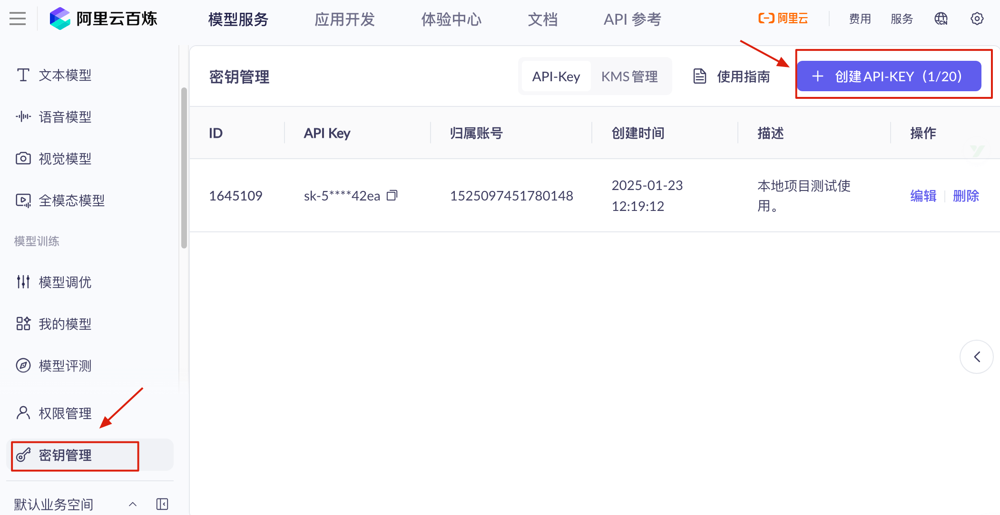
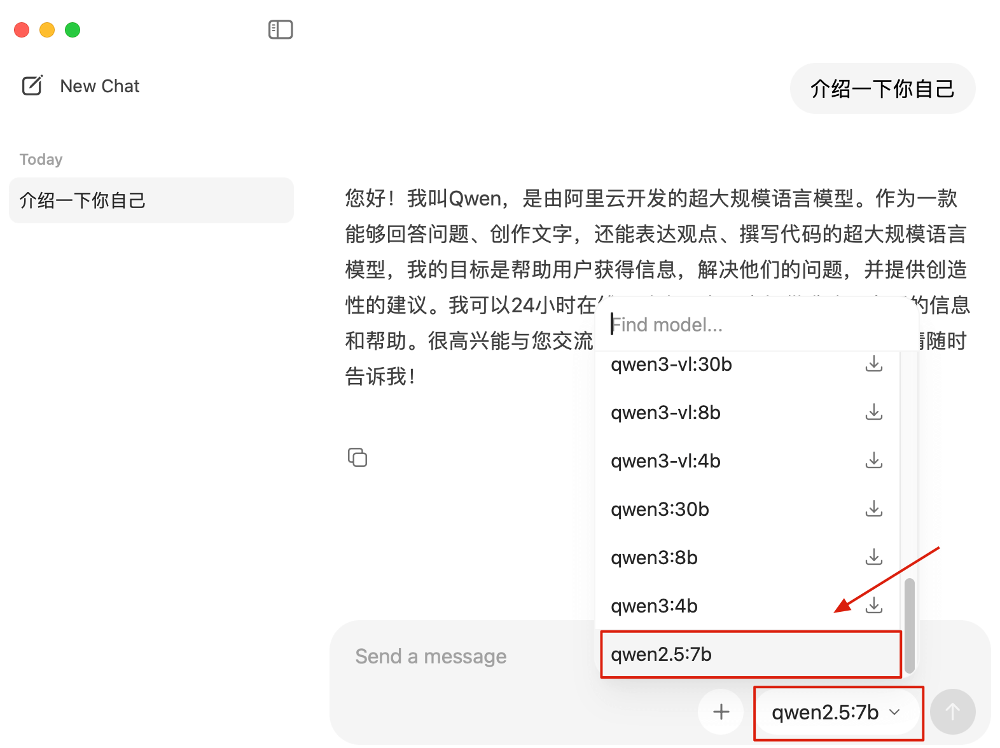

# ⭐大模型 API 申请和 Ollama 部署本地模型

大家好，我是 Guide！在 LLM 应用开发中，Prompt 写得再好，如果没有一个稳定靠谱的模型基座，输出结果依然像“开盲盒”。

很多小伙伴在项目起步时会纠结：到底是花钱买现成的 API 省心，还是自己折腾本地部署省钱？这篇文章就带大家做一次“穿透式”对比，拆解阿里云百炼 API 与 Ollama 本地部署这两大主流方案，帮你选出最适合你项目的方式。

## 云端 API vs 本地部署

在开始之前，先了解两种方案的特点，选择适合你的方式：

| **对比项** | **阿里云百炼 API (云端)** | **Ollama 本地部署 (本地)** | **点评** |
| --- | --- | --- | --- |
| **部署难度** | **零部署**，开箱即用 | 需要安装、配置环境 | 想快速上线选云端，想折腾底层选本地。 |
| **硬件要求** | **无要求** | 极高（内存/显存是刚需） | 本地跑 7B 模型至少得 16G 内存。 |
| **推理性能** | 极快（专业 GPU 集群） | 取决于你的显卡 | 生产环境的吞吐量云端完胜。 |
| **费用成本** | 按 Token 计费（有免费额度） | **完全免费** | 适合“白嫖”党做本地实验。 |
| **数据隐私** | 数据上传云端 | **数据 100% 本地化** | 金融、内网环境建议选本地。 |
| **适用场景** | **生产环境、高质量业务** | 开发测试、隐私敏感场景 | **没有银弹**，看你的业务痛点在哪。 |

如果是为了更好的分析效果，且不想因为硬件性能导致系统“假死”，个人强烈建议首选**阿里云百炼 API**。本地模型虽然香，但对普通开发机来说，处理长文本分析简直是“折磨”。

下面，我会详细介绍这两种接入大模型的方式

## 方案一：阿里云百炼 API

### 平台简介

阿里云百炼是一站式大模型开发与应用平台，集成了通义千问及主流第三方模型。它为开发者提供了**兼容 OpenAI 的 API** 及全链路模型服务，这意味着你可以使用标准的 OpenAI SDK 来调用阿里云的模型。

**核心优势**：

* 开箱即用，无需自行部署或运维
* 直接调用通义千问（Qwen）全系列模型
* 支持 DeepSeek、GLM 等第三方大模型
* 提供可视化应用构建能力

### 模型选择

#### 通义千问（Qwen）系列旗舰模型

| 模型 | 特点 | 适用场景 | 价格 |
| --- | --- | --- | --- |
| **qwen-max** | 效果最好，能力最强 | 复杂推理、多步骤任务 | 较高 |
| **qwen-plus** | 效果、速度、成本均衡 | 通用场景（推荐） | 中等 |
| **qwen-turbo** | 高性价比、低延迟 | 简单任务、快速响应 | 较低 |
| **qwen-coder-plus** | 代码专用，工具调用强 | 代码生成与理解 | 中等 |

#### 其他能力

* **多模态**：视觉理解、图像生成、视频生成、语音识别与合成
* **向量嵌入**：`text-embedding-v3`（推荐）、`text-embedding-v2`
* **细分领域**：长文本处理、翻译、法律、角色扮演等

#### 模型进阶服务

* [模型调优](https://help.aliyun.com/zh/model-studio/model-training-overview)：支持 SFT、CPT、DPO 等训练方法
* [模型部署](https://help.aliyun.com/zh/model-studio/model-deployment-introduction)：资源专享的推理服务
* [模型评测](https://help.aliyun.com/zh/model-studio/model-evaluation-overview)：人工评测、自动评测、基线评测

### 开通步骤

#### 1. 注册阿里云账号

如果没有阿里云账号，先[注册阿里云账号](https://account.aliyun.com/register/qr_register.htm?oauth_callback=https%3A%2F%2Fbailian.console.aliyun.com%2F%3FapiKey%3D1)。

#### 2. 开通阿里云百炼

使用**阿里云主账号**前往阿里云百炼大模型服务平台：

* [北京区域](https://bailian.console.aliyun.com/?tab=model#/model-market)（推荐国内用户）
* [新加坡区域](https://modelstudio.console.aliyun.com/?tab=home)（海外用户）

阅读并同意协议后，将自动开通服务。如果未弹出服务协议，则表示已经开通。

> 如果提示"您尚未进行实名认证"，请先完成[实名认证](https://help.aliyun.com/zh/account/verify-your-identity-individual-account)。

#### 3. 获取 API Key

前往**密钥管理**页面：

* [北京区域密钥管理](https://bailian.console.aliyun.com/?tab=model#/api-key)
* [新加坡区域密钥管理](https://modelstudio.console.aliyun.com/?tab=model#/api-key)

点击**创建 API-KEY**，保存生成的密钥。



> **安全提示**：API Key 等同于账号密码，请妥善保管，不要泄露或提交到代码仓库。

#### 4. 领取免费额度

新用户通常有免费试用额度，可在[模型用量](https://bailian.console.aliyun.com/?tab=model#/model-usage/free-quota)界面查看。

## 方案二：Ollama 本地部署

### Ollama 简介

[Ollama](https://ollama.com/) 是一个开源的本地大模型运行框架，让你可以在本地电脑上运行各种开源大模型。它提供了：

* **简单的命令行界面**：一行命令即可运行模型
* **OpenAI 兼容 API**：与云端 API 无缝切换
* **丰富的模型库**：支持 Llama、Qwen、Mistral、Gemma 等主流模型
* **跨平台支持**：macOS、Linux、Windows

### 安装 Ollama

#### macOS

使用命令下载：

```bash
# 使用 Homebrew 安装
brew install ollama
```

也可以直接访问 [Ollama 下载页面](https://ollama.com/download) 下载 macOS 安装包。

#### Linux

使用命令下载：

```bash
# 一键安装脚本
curl -fsSL https://ollama.com/install.sh | sh
```

也可以直接访问 [Ollama 下载页面](https://ollama.com/download) 下载 Linux 安装包。

#### Windows

访问 [Ollama 下载页面](https://ollama.com/download) 下载 Windows 安装包。

### 启动 Ollama 服务

#### 命令行启动

如果你想直接看到运行日志，或者在排查问题，可以使用这个命令：

```bash
ollama serve
```

这个命令会启动 Ollama 的 API 服务（默认端口 11434）。执行该命令后，该终端窗口会被占用，**不要关闭它**。你需要打开**另一个**新的终端窗口来输入 `ollama run` 或 `ollama list` 等命令。

在 Linux 上，Ollama 通常作为系统服务安装。

```bash
# 启动服务
sudo systemctl start ollama
# 停止服务
sudo systemctl stop ollama
# 设置开机自启
sudo systemctl enable ollama
# 查看服务状态（检查是否运行成功）
sudo systemctl status ollama

```

#### 图形化界面

对于 Windows 和 macOS 用户来说，也可以直接点击 Ollama 应用程序启动。

启动后，在任务栏右下角的系统托盘（Windows）/屏幕顶部的菜单栏（macOS）中会看到一个**羊驼图标**，这表示服务已在后台运行。

界面效果如下图所示：



通过可视化界面，你不需要在终端输入 `ollama run model`，直接点选即可聊天。并且，可以直观地看到哪些模型已下载。

所有的对话和模型运行都在你自己的电脑上完成，不会上传到云端。

### 验证安装

无论使用哪种方式启动，你都可以在浏览器中访问这个地址来验证：<http://localhost:11434>。

如果看到 **"Ollama is running"** 这行字，说明服务已经成功启动。

你也可以使用下面的命令验证：

```bash
ollama --version
# ollama version is 0.13.5
```

### 部署 Qwen 模型

#### 拉取 Qwen 模型

Ollama 提供了多个版本的 Qwen 模型，我们这里以  Qwen2.5 为例进行介绍，根据你的硬件配置选择

| 模型 | 参数量 | 内存需求 | 适用场景 |
| --- | --- | --- | --- |
| `qwen2.5:0.5b` | 0.5B | ~1GB | 轻量级测试 |
| `qwen2.5:1.5b` | 1.5B | ~2GB | 开发测试 |
| `qwen2.5:3b` | 3B | ~4GB | 日常使用 |
| `qwen2.5:7b` | 7B | ~8GB | 推荐配置 |
| `qwen2.5:14b` | 14B | ~16GB | 高质量输出 |
| `qwen2.5:32b` | 32B | ~32GB | 最佳效果 |
| `qwen2.5-coder:7b` | 7B | ~8GB | 代码专用 |

除了可视化界面下载模型之外，也可以使用命令行拉取：

```bash
# 拉取模型（以 7B 为例）
ollama pull qwen2.5:7b

# 拉取代码专用模型
ollama pull qwen2.5-coder:7b

# 查看已下载的模型
ollama list
```

#### 测试模型

除了可视化界面直接对话之外，也可以在命令行界面测试：

```bash
# 命令行对话测试
ollama run qwen2.5:7b

# 输入问题后按回车，输入 /bye 退出
>>> 你好，请介绍一下你自己
你好！我叫Qwen，是由阿里巴巴云开发的预训练语言模型。...
```

### Ollama 常用命令

```bash
# 模型管理
ollama list              # 查看已安装模型
ollama pull <model>      # 下载模型
ollama rm <model>        # 删除模型
ollama show <model>      # 查看模型信息

# 运行模型
ollama run <model>       # 交互式对话
ollama run <model> "问题" # 单次问答

# 服务管理
ollama serve             # 启动服务
ollama ps                # 查看运行中的模型

# 创建自定义模型
ollama create <name> -f Modelfile  # 从 Modelfile 创建
```

### 自定义模型配置

可以通过 Modelfile 创建自定义配置的模型：

```dockerfile
# Modelfile
FROM qwen2.5:7b

# 设置系统提示词
SYSTEM """
你是一个专业的 Java 面试官，擅长考察候选人的技术能力。
请用简洁专业的语言进行面试。
"""

# 调整参数
PARAMETER temperature 0.7
PARAMETER top_p 0.9
PARAMETER num_ctx 4096
```

```bash
# 创建自定义模型
ollama create interview-assistant -f Modelfile

# 使用自定义模型
ollama run interview-assistant
```

### 项目中使用本地模型

如果想要在项目中使用本地模型，可以这样修改 `application.yml`：

```yaml
spring:
  ai:
    openai:
      base-url: http://localhost:11434   # 不要加 /v1
      api-key: ollama
      chat:
        options:
          model: qwen2.5:7b
          temperature: 0.7
```

不过，不太建议这样做。我在自己的 20 款 Mac Pro 机器上实测简历分析耗时 10分多钟。

## 总结

本文主要介绍了接入大模型的两种主流方案：**阿里云百炼 API**（云端方案）与 **Ollama**（本地方案），并提供了详细的对比与操作指南。

**方案对比与选择**：

* **阿里云百炼 API**：适合**生产环境**。优势在于零部署、高性能 GPU 集群、模型质量最强（Qwen 全系列及第三方模型），按 Token 计费。
* **Ollama 本地部署**：适合**开发测试及隐私敏感场景**。优势在于完全免费、数据不出本地、无网络延迟，但受限于个人电脑硬件性能。

**阿里云百炼接入流程**：

* **模型丰富**：涵盖通义千问（qwen-max/plus/turbo）旗舰模型及多模态、向量嵌入等进阶服务。
* **开通便捷**：通过阿里云账号实名认证后，在百炼控制台创建 **API-KEY** 即可使用。其 API **兼容 OpenAI 标准**，方便开发者快速集成。

**Ollama 本地部署指南**：

* **跨平台支持**：支持 macOS、Linux 和 Windows，安装简单。
* **模型管理**：通过命令行（如 `ollama pull qwen2.5:7b`）或图形化界面快速部署 Qwen 系列开源模型。
* **灵活定制**：支持通过 `Modelfile` 自定义系统提示词（System Prompt）和推理参数（如 Temperature）。

**实践建议**：

* 对于高质量需求和复杂推理任务，**首推阿里云百炼 API**。
* 本地模型（如 Qwen2.5-7B）在普通硬件上处理长文本或复杂分析（如简历分析）时耗时较长（实测可能达 10 分钟以上），需根据硬件配置合理选择模型参数量。
* 在 Spring Boot 等项目中，两者均可通过修改 `base-url` 和 `api-key` 实现无缝切换。


> 更新: 2026-01-12 19:06:39  
> 原文: <https://www.yuque.com/snailclimb/itdq8h/ugtn0lm8wtyeoc82>