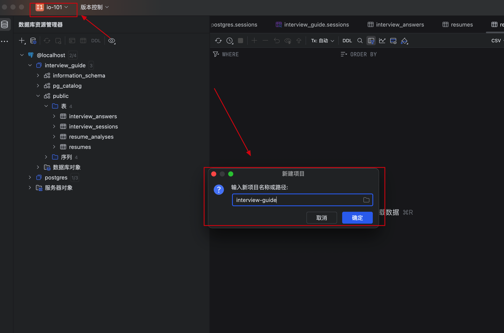
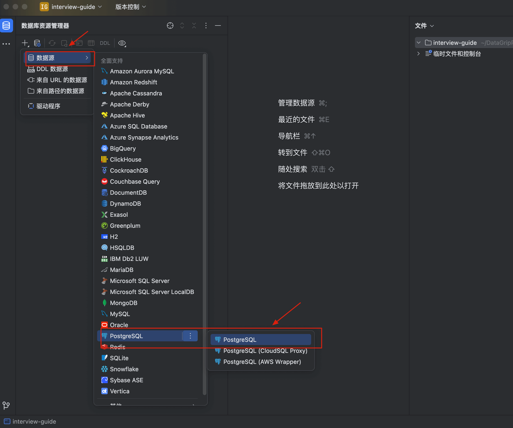
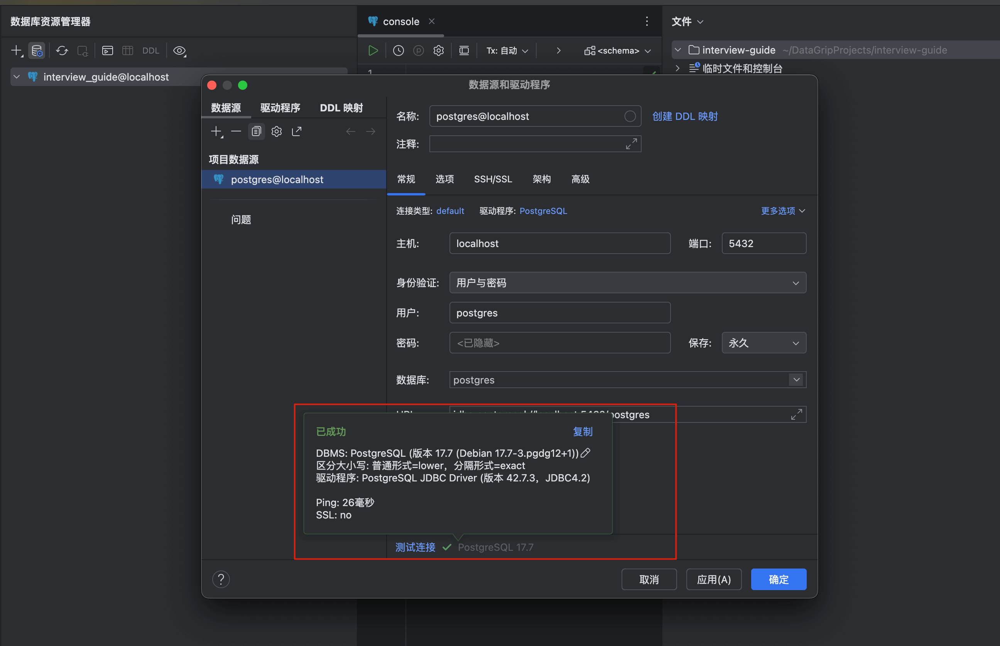
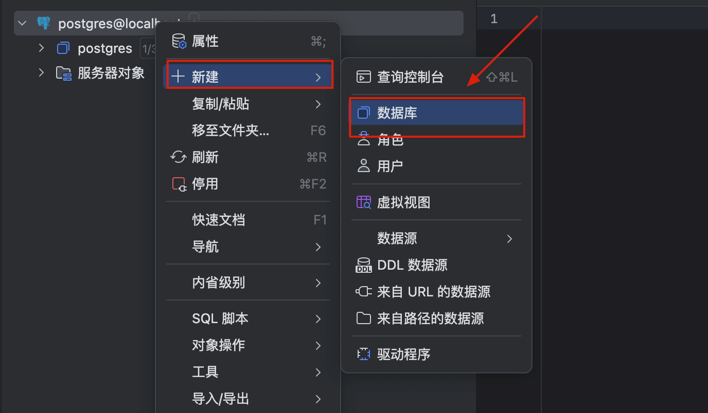
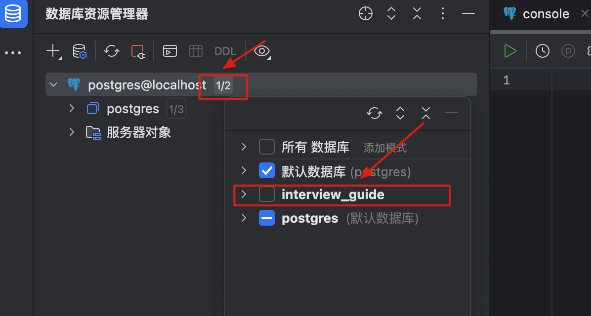

# 本地搭建 PostgreSQL + PGvector 向量数据库

大家好，我是 Guide。在 LLM 应用开发中，向量数据库是必不可少的“基座”。今天 Guide 带大家直接上手，用最优雅的方式在本地搭建一套 PostgreSQL + PGvector 环境，并配置好生产力工具 DataGrip。

这篇内容偏基础，非常适合编程经验一般、对 Docker 接触不多的同学学习。我会把每一个细小的“坑点”都讲透，帮你扫清障碍。

## Docker 快速安装 PostgreSQL + PGvector

我们直接使用官方封装好的镜像，一步到位。打开终端，直接复制并运行下面这段命令（请注意修改 `-v` 挂载目录为你本地的实际路径）：

```bash
docker run -d \
  --name my_pgvector \
  -p 5432:5432 \
  -e POSTGRES_PASSWORD=123456 \
  -v /Users/guide/docker/postgresql/data:/var/lib/postgresql/data \
  pgvector/pgvector:pg17
```

这条命令会在后台启动一个带有向量扩展（pgvector）的 PostgreSQL 17 数据库容器。

下面对命令进行拆分解释：

1. `docker run -d`：
   * `docker run`是 Docker 最常用的命令，用于创建一个新的容器并运行一个命令。
   * `-d` (detached): 意思是“后台运行”。如果不加这个参数，容器的运行日志会直接占据你的终端窗口，一旦你按下 `Ctrl+C` 或者关闭终端，容器通常会停止。加上 `-d` 后，容器会在后台静默运行。
2. `--name my_pgvector`：

* 为你的容器指定一个自定义名称叫 `my_pgvector`。方便后续管理。
* 如果没有这个参数，Docker 会随机分配一个像 `determined_byd` 这样古怪的名字。有了名字后，你可以直接通过 `docker stop my_pgvector` 来停止它。

3. `-p 5432:5432`：
   * 端口映射，格式为 `宿主机端口:容器内端口`。
   * PostgreSQL 默认在容器内部监听 `5432` 端口。通过这个映射，你可以通过访问你电脑（宿主机）的 `localhost:5432` 来连接这个数据库。
4. `-e POSTGRES_PASSWORD=123456`：设置默认超级用户 `postgres` 的登录密码。在生产环境下，千万不要用 `123456` 这么简单的密码，建议使用复杂的随机字符串。
5. `-v /Users/guide/docker/postgresql/data:/var/lib/postgresql/data`(重要！！！)
   * 挂载数据卷（Volume），格式为 `宿主机绝对路径:容器内路径`。
   * 这是最关键的部分，用于**数据持久化**。
   * 容器是一个“临时”的环境，删除容器会丢失内部所有数据。通过这个映射，数据库产生的所有数据都会实时写入到你的磁盘。即使你删除了容器，下次再挂载这个目录，数据依然存在。
6. `pgvector/pgvector:pg17`:指定使用的镜像名和标签（Tag）。

## 使用 DataGrip 管理 PostgreSQL数据库

**DataGrip 是什么？** 正如其官方所言，“一个工具，连接万千数据库”。DataGrip 的定位是一款**为开发者打造的、跨平台的数据库 IDE**。它不仅仅是一个数据库客户端，更是一个集成了智能代码补全、AI 辅助、Git 版本控制和强大 SQL 编辑功能的**一站式开发环境**。它的设计哲学是让数据库开发像在 IntelliJ IDEA 中写 Java 一样高效、智能。

DataGrip 拥有 JetBrains 家族标志性的**现代、简洁且高度集成的 IDE 风格**。对于熟悉 JetBrains 全家桶的开发者来说，几乎是零学习成本。它的界面为沉浸式编码而优化，所有功能都围绕着提升 SQL 编写和数据探索的效率展开。还能直接导入 IDEA、VS Code、Cursor 等常见开发 IDE 的配置。

最重要的是，**现在 DataGrip 只要是非商业用途，就可以免费使用！**

只需简单几步，即可免费白嫖 DataGrip：

1. 从 JetBrains 官网下载并安装最新版的 DataGrip，地址：<https://www.jetbrains.com/datagrip/>。
2. 启动应用，在激活窗口选择 **Non-commercial use**（非商业用途）。
3. 登录你的 JetBrains 账号或创建一个，并接受 Toolbox 非商业用途订阅协议。
4. 大功告成！

详细介绍可以看我写的这篇文章：[干掉 Navicat，DataGrip 官宣免费！！](https://mp.weixin.qq.com/s/yyrWRF1XjKhYZf_gwPatUw)。

### Step 1：新建项目

打开 DataGrip，新建一个 Project。



### Step 2：配置连接协议

如果是第一次使用，DataGrip 可能会提示你下载 PostgreSQL 驱动，直接点击 Download 即可，不要在这里卡壳。

点击左上角的 `+` 号，选择 **数据源 -> PostgreSQL**。



输入用户名 postgres ，密码 123456，连接默认数据库 postgres



### Step 3：创建你的业务数据库

连接成功后，右键点击服务器实例，选择 **新建 -> 数据库**。 这里我们创建一个名为 `interview_guide` 的数据库。



在弹出的窗口中，模板 (Template)、表空间 (Tablespace) 和所有者 (Owner) 保持默认即可。

其实本质就是在执行下面这行 SQL：

```sql
create database interview_guide;
```

### Step 4：激活数据库视图

创建完数据库后，点击 `postgres@localhost` 右侧的按钮（或通过搜索框），在菜单中**勾选**你刚创建的 `interview_guide`。只有勾选了，它才会出现在左侧的资源列表中，你才能进行后续的表操作。



## PGvector 向量功能

虽然镜像已经内置了向量功能，但 PostgreSQL 的设计是“插件按需加载”。按理说你得手动执行 `CREATE EXTENSION vector;`。

**但是！** 如果你用的是 **Spring AI**，你会发现哪怕不手动输入命令，项目也能跑。这是因为 Spring AI 的 `PgVectorStore` 已经在底层帮你把脏活累活干了。在 Spring 容器启动时，自动检测并初始化 PostgreSQL 的向量数据库环境。

我们来看一下这个类的源码就真相大白了！

```java
/**
 * PgVectorStore 实现了 InitializingBean 接口。
 * Spring 容器在完成 Bean 的属性注入后，会自动调用 afterPropertiesSet() 方法。
 */
public class PgVectorStore extends AbstractObservationVectorStore implements InitializingBean {

    @Override
    public void afterPropertiesSet() {
        // 1. 打印初始化日志，确认当前操作的表名和 Schema 名
        logger.info("Initializing PGVectorStore schema for table: {} in schema: {}", 
                this.getVectorTableName(), this.getSchemaName());

        logger.info("vectorTableValidationsEnabled {}", this.schemaValidation);

        // 2. 校验逻辑：如果开启了校验，则检查数据库中现有的表结构是否符合要求
        if (this.schemaValidation) {
            this.schemaValidator.validateTableSchema(this.getSchemaName(), this.getVectorTableName());
        }

        // 3. 初始化开关：如果 initializeSchema 为 false，则跳过后续的所有建表和安装插件操作
        // 这通常用于生产环境，由 DBA 手动预先创建好环境
        if (!this.initializeSchema) {
            logger.debug("Skipping the schema initialization for the table: {}", this.getFullyQualifiedTableName());
            return;
        }

        // --- 数据库底层环境准备 ---

        // 4. 安装 pgvector 插件：这是实现向量检索的核心扩展
        this.jdbcTemplate.execute("CREATE EXTENSION IF NOT EXISTS vector");
        
        // 5. 安装 hstore 插件：用于支持键值对存储（通常作为 metadata 的补充）
        this.jdbcTemplate.execute("CREATE EXTENSION IF NOT EXISTS hstore");

        // 6. 安装 UUID 插件：如果主键类型配置为 UUID，则需要安装此扩展来生成随机 ID
        if (this.idType == PgIdType.UUID) {
            this.jdbcTemplate.execute("CREATE EXTENSION IF NOT EXISTS \"uuid-ossp\"");
        }

        // 7. 创建数据库 Schema（命名空间），默认为 "public"
        this.jdbcTemplate.execute(String.format("CREATE SCHEMA IF NOT EXISTS %s", this.getSchemaName()));

        // --- 表结构处理 ---

        // 8. 危险操作：如果配置了 removeExistingVectorStoreTable 为 true，则先删除旧表
        // 警告：这会导致数据丢失，通常仅用于集成测试环境
        if (this.removeExistingVectorStoreTable) {
            this.jdbcTemplate.execute(String.format("DROP TABLE IF EXISTS %s", this.getFullyQualifiedTableName()));
        }

        // 9. 创建向量存储核心表
        // id: 主键，类型根据 getColumnTypeName() 动态决定（如 uuid, serial 等）
        // content: 原始文本内容
        // metadata: 关联的元数据，存储为 JSON 格式
        // embedding: 向量字段，指定维度 vector(N)
        this.jdbcTemplate.execute(String.format("""
                CREATE TABLE IF NOT EXISTS %s (
                    id %s PRIMARY KEY,
                    content text,
                    metadata json,
                    embedding vector(%d)
                )
                """, 
                this.getFullyQualifiedTableName(), 
                this.getColumnTypeName(), 
                this.embeddingDimensions()));

        // --- 性能优化：索引 ---

        // 10. 创建向量索引：提高相似度搜索的效率
        // 如果 createIndexMethod 不是 NONE（如 HNSW 或 IVFFlat），则执行创建索引语句
        if (this.createIndexMethod != PgIndexType.NONE) {
            this.jdbcTemplate.execute(String.format("""
                    CREATE INDEX IF NOT EXISTS %s ON %s USING %s (embedding %s)
                    """, 
                    this.getVectorIndexName(),          // 索引名称
                    this.getFullyQualifiedTableName(),  // 表名
                    this.createIndexMethod,             // 索引算法 (如 hnsw)
                    this.getDistanceType().index        // 距离度量函数 (如 vector_cosine_ops)
            ));
        }
    }
    
    // ... 其他方法
}
```

不过，需要注意的是：当 `initialize-schema: false` 时，Spring AI **不会自动创建** `vector_store` 表（上面源码中我也注释了相应的代码）。

```java
spring:
  ai:
    vectorstore:
      pgvector:
        initialize-schema: true 
```

建议开发环境设置为 true，方便快速启动。生产环境设置为 false，手动管理数据库 schema，避免意外变更。

## 总结

很多同学学技术容易卡在“环境搭建”这一步，其实只要理解了 **Docker 的隔离与持久化**、**IDE 的连接逻辑**以及**框架的自动初始化机制**，一切都会变得非常丝滑。

现在，你的本地已经拥有一套生产级别的向量数据库环境了。

**如果你在搭建过程中遇到任何报错，欢迎在评论区留言，我们一起复盘。**


> 更新: 2026-03-20 13:02:02  
> 原文: <https://www.yuque.com/snailclimb/itdq8h/iluxz0t2lboglmex>