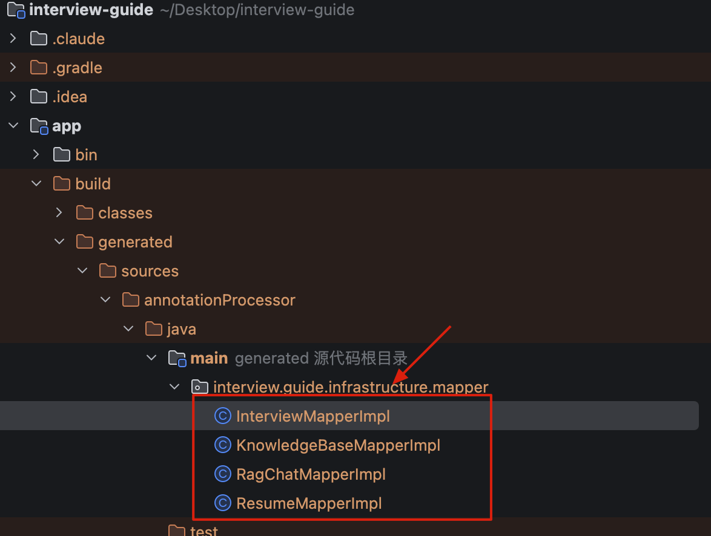

# MapStruct 实体映射最佳实践

大家好，我是 Guide！在分层架构的应用开发中，实体（Entity）与数据传输对象（DTO）之间的转换是一个常见且繁琐的任务。手工编写转换代码不仅容易出错，还难以维护。

MapStruct 是一个基于注解的 Java Bean 映射工具，能够自动生成类型安全、高性能的映射代码。本文将以本项目的实际应用为例，详细讲解 MapStruct 的最佳实践。

## MapStruct 简介

**MapStruct** 是一个面向 Java Bean 映射的 **编译时代码生成器**。它遵循“约定优于配置”的理念：在编译期读取 `@Mapper`、`@Mapping` 等注解与方法签名，生成明确、可读的映射实现代码；与依赖反射的方案不同，MapStruct 的映射逻辑在运行时就是普通的 Java 方法调用与属性赋值。

项目地址：<https://github.com/mapstruct/mapstruct>。

### 核心工作原理

从机制上讲，MapStruct 本质是一个 **Java 注解处理器（JSR 269 Annotation Processor）**：

**1. 识别注解**

Java 编译器在编译阶段执行注解处理器，MapStruct 会扫描带有 `@Mapper`（以及 `@MapperConfig`、`@Mapping`、`@Mappings`、`@BeanMapping` 等）的类型与方法，收集源/目标类型、字段对应关系、转换规则、组件模型等信息。

**2. 生成实现**：

MapStruct 根据接口方法签名与注解规则，在编译期生成实现类（默认 `XxxMapperImpl`），并将源码输出到 annotation processor 的生成源码目录，常见路径例如：

* Maven：`target/generated-sources/annotations/...`
* Gradle：`build/generated/sources/annotationProcessor/...`



**3. 运行时代码形态**

生成的实现通常是直接的 `new`、`getXxx()` / `setXxx()`、必要的 `null` 判断、集合遍历拷贝、类型转换方法调用等——**没有反射、没有动态代理、没有运行时解析表达式**。它的性能接近手写代码的性能上限，实际耗时仍会受对象创建数量、嵌套深度、集合大小、日期/枚举转换逻辑复杂度、JIT 优化等影响。

### 核心优势

* **编译时生成**：映射逻辑在编译期固化为 Java 源码，避免运行时反射开销与反射带来的可访问性/安全限制问题。
* **类型安全 + 编译期校验**：源/目标属性不存在、类型不匹配、缺失映射（取决于策略）等问题可以在编译期暴露，而不是在运行时踩坑。方法签名、可用字段、可用转换方法通常可补全、可跳转。
* **可读性强**：生成的代码清晰，排查问题时可以直接看 `XxxMapperImpl`，也可以在调试器中单步进入。
* **对复杂结构更友好**：支持嵌套对象映射、集合映射、枚举映射、多个源参数合并、`@AfterMapping/@BeforeMapping` 钩子等。
* **依赖注入支持**：通过 `componentModel = "spring"` 可生成带 `@Component` 的 Mapper，实现与 Spring 容器无缝集成（也支持 CDI、JSR330 等组件模型）。

### 主流方案对比

在选型时，我们需要平衡 **性能**、**易用性** 和 **安全性**。

**1. 性能实测（万次对象拷贝耗时）**

| 工具 | 简单对象(5 字段) | 复杂对象(含嵌套) | 核心原理 | 性能评价 | 备注 |
| --- | --- | --- | --- | --- | --- |
| **MapStruct** | 12ms | 15ms | 编译时生成代码(APT) | ⭐⭐⭐⭐⭐ 极致 | 零运行时开销 |
| **手写代码** | 11ms | 14ms | 直接调用 Getter/Setter | ⭐⭐⭐⭐⭐ 最优 | 维护成本高 |
| **Spring BeanUtils** | 35ms | ❌ 不支持 | 运行时反射+缓存 | ⭐⭐⭐ 尚可 | 仅支持同名同类型 |
| **ModelMapper** | 68ms | 120ms | 智能匹配+反射 | ⭐⭐ 较慢 | 功能最强大 |
| **Apache BeanUtils** | 210ms | 480ms | 运行时反射+类型转换 | ⭐ 很慢 | 不推荐使用 |

**2. 综合对比表：**

| 方案 | 性能 | 类型安全 | 编译检查 | 学习成本 | 嵌套对象 | 适用场景 | 特色优势 |
| --- | --- | --- | --- | --- | --- | --- | --- |
| **MapStruct** | ⚡ 最高 | ✅ 是 | ✅ 是 | 🟢 低 | 自动 | 新项目、高性能要求 | 编译时生成、零运行时开销 |
| **MapStruct-Plus** | ⚡ 最高 | ✅ 是 | ✅ 是 | 🟢 极低 | 自动 | MapStruct 增强版、国产首选 | 自动转换器、更少配置 |
| **手工编写** | ⚡ 最高 | ✅ 是 | ✅ 是 | - | 手动 | 极端性能要求 | 完全可控、无依赖 |
| **Spring BeanUtils** | ⚡⚡ 中 | ❌ 否 | ❌ 否 | 🟢 极低 | ❌ 手动 | Spring 项目、简单映射 | Spring 内置、无额外依赖 |
| **Orika** | ⚡⚡⚡ 高 | ✅ 是 | ❌ 否 | 🟡 中 | 自动 | 老项目改造 | 字节码生成、运行时优化 |
| **ModelMapper** | ⚡⚡ 中 | ❌ 否 | ❌ 否 | 🟡 中 | 自动 | 快速原型、复杂映射 | 智能匹配、配置灵活 |
| **Apache BeanUtils** | ⚡ 低 | ❌ 否 | ❌ 否 | 🟢 低 | ❌ 手动 | ⚠️ 不推荐使用 | 已过时、性能极差 |

Apache BeanUtils 性能低下的主因在于它对每一个属性的操作都会触发 `ConvertUtils.lookup` 查找，且没有有效的缓存机制。而 MapStruct 这种“零反射”方案，直接消除了所有运行时开销。

让我们结合项目中的实际代码，看看 MapStruct 是如何化繁为简的。

## 基础配置

**添加依赖：**

```groovy
// build.gradle
dependencies {
    implementation "org.mapstruct:mapstruct:${mapstructVersion}"
    annotationProcessor "org.mapstruct:mapstruct-processor:${mapstructVersion}"
}
```

## 基础映射器

**简单映射器定义：**

```java
@Mapper(
    componentModel = MappingConstants.ComponentModel.SPRING,
    unmappedTargetPolicy = ReportingPolicy.IGNORE
)
public interface KnowledgeBaseMapper {

    /**
     * 将知识库实体转换为列表项DTO
     */
    KnowledgeBaseListItemDTO toListItemDTO(KnowledgeBaseEntity entity);

    /**
     * 将知识库实体列表转换为列表项DTO列表
     */
    List<KnowledgeBaseListItemDTO> toListItemDTOList(List<KnowledgeBaseEntity> entities);
}
```

**关键细节解析：**

* `componentModel = SPRING`：这是 Spring Boot 开发者的首选。它会告诉 MapStruct 在生成的实现类上添加 `@Component` 注解，这样你就可以通过 `@Autowired` 或 `RequiredArgsConstructor` 将其注入到 Service 层。
* `unmappedTargetPolicy = IGNORE`：在 DTO 和 Entity 字段不完全对等时，这个配置能防止编译器产生大量的警告（Warning），让控制台保持清爽。
* **集合映射**：注意这里只定义了单体转换，MapStruct 会自动推导出如何处理 `List`。它会循环调用单体映射方法，开发者无需编写任何循环逻辑。

**在 Service 中使用：**

```java
@Service
@RequiredArgsConstructor
public class KnowledgeBaseListService {

    private final KnowledgeBaseMapper knowledgeBaseMapper;

    public List<KnowledgeBaseListItemDTO> listKnowledgeBases() {
        List<KnowledgeBaseEntity> entities = knowledgeBaseRepository.findAll();
        return knowledgeBaseMapper.toListItemDTOList(entities);
    }
}
```

## 高级映射技巧

### 自定义映射方法

当字段类型不一致、需要复杂的业务计算或调用外部工具类时，可以通过 `default` 方法实现自定义逻辑。

```java
@Mapper(
    componentModel = MappingConstants.ComponentModel.SPRING,
    unmappedTargetPolicy = ReportingPolicy.IGNORE
)
public interface RagChatMapper {

    /**
     * 从会话实体中提取知识库ID列表
     */
    @Named("extractKnowledgeBaseIds")
    default List<Long> extractKnowledgeBaseIds(RagChatSessionEntity session) {
        return session.getKnowledgeBaseIds();
    }

    /**
     * 获取消息类型字符串
     */
    @Named("getTypeString")
    default String getTypeString(RagChatMessageEntity message) {
        return message.getTypeString();
    }
}
```

**关键细节解析：**

* `@Named`\*\* 注解\*\*：这是自定义方法的“身份证”。通过给方法命名，我们可以在后续的 `@Mapping` 注解中通过名称引用它，避免 MapStruct 在自动匹配时产生混淆。
* `default`\*\* 关键字\*\*：在接口中定义带方法体的逻辑。MapStruct 会在生成的实现类中保留这些逻辑，并在需要时调用它们。
* **空值安全**：实战中务必在自定义方法内进行 `null` 检查，防止在映射过程中抛出 `NullPointerException`。

### 字段映射配置

使用 `@Mapping` 注解可以手动指定源字段（source）与目标字段（target）的对应关系，并应用自定义转换逻辑。

```java
@Mapping(target = "knowledgeBaseIds", source = "session", qualifiedByName = "extractKnowledgeBaseIds")
@Mapping(target = "type", source = "message", qualifiedByName = "getTypeString")
SessionDTO toSessionDTO(RagChatSessionEntity session);
```

**关键细节解析：**

* `source`\*\* 与 \*\*`target`：不仅支持直接映射属性名，还支持通过 `session.user.name` 这种点号表达式进行深层对象属性提取。
* `qualifiedByName`：通过名称引用上面定义的 `@Named` 方法。这是处理非标准转换、类型格式化（如日期转字符串）的核心手段。
* **多参数源**：MapStruct 支持传入多个对象作为数据源（如上面的 `session` 和 `message`），并将它们的属性合并填充到一个 DTO 中。

## 映射器组合与复用

### 引用其他映射器

使用 `uses` 属性引用其他映射器，实现代码复用：

```java
@Mapper(
    componentModel = MappingConstants.ComponentModel.SPRING,
    unmappedTargetPolicy = ReportingPolicy.IGNORE,
    uses = KnowledgeBaseMapper.class  // 引用其他映射器
)
public interface RagChatMapper {
    // ...
}
```

**关键细节解析：**

* `uses`\*\* 属性\*\*：这是 MapStruct 实现代码复用的核心。被引用的类可以是另一个 `@Mapper` 接口，也可以是一个普通的工具类（需定义为 Spring Bean）。
* **解耦优势**：通过 `uses`，我们可以避免在每个 Mapper 接口中重复编写相同的转换逻辑，保持代码的 DRY（Don't Repeat Yourself）原则。

### 集合映射

MapStruct 对集合转换提供了“全自动”支持，开发者只需定义单体对象的转换方法即可：

```java
// 自动处理 List 到 List 的映射
List<KnowledgeBaseListItemDTO> toListItemDTOList(List<KnowledgeBaseEntity> entities);

// 支持 Set 到 List 的映射
@Named("extractKnowledgeBaseNames")
default List<String> extractKnowledgeBaseNames(Collection<KnowledgeBaseEntity> knowledgeBases) {
    return knowledgeBases.stream()
        .map(KnowledgeBaseEntity::getName)
        .toList();
}
```

**关键细节解析：**

* **零循环代码**：MapStruct 会自动生成高效的 `for` 循环，并在循环内部调用你定义的单体映射逻辑。
* **集合类型兼容**：支持 `List`、`Set`、`Map` 之间的灵活转换，甚至支持将 `Set<Entity>` 转换为 `List<DTO>`。

## 常见问题解决

**1. 字段名不匹配：**

当源对象（Source）与目标对象（Target）的字段名不一致时，必须手动指定映射关系。

```java
// Entity: create_time -> DTO: createTime
@Mapping(target = "createTime", source = "create_time")
KnowledgeBaseListItemDTO toDTO(KnowledgeBaseEntity entity);
```

**2. 日期与类型自动转换：**

MapStruct 能够自动处理绝大多数 Java 基础类型转换，包括：

* `LocalDateTime` <-> `String`（支持 `dateFormat` 格式化）
* `Long` (时间戳) <-> `LocalDateTime`
* `Enum` <-> `String`

```java
@Mapping(target = "createTime", dateFormat = "yyyy-MM-dd HH:mm:ss")
KnowledgeBaseListItemDTO toDTO(KnowledgeBaseEntity entity);
```

**3. 处理 Null 值与默认值：**

通过 `nullValueCheckStrategy` 或自定义逻辑处理空值，防止业务链路中出现不符合预期的空字段。

```java
// 强制开启 Null 检查，如果源对象属性为 null，映射后保持目标对象默认值
@BeanMapping(nullValueCheckStrategy = NullValueCheckStrategy.ALWAYS)
SessionDTO toDTO(RagChatSessionEntity session);
```

## 进阶最佳实践

**1. 更新现有对象（@MappingTarget）：**

这是业务开发中最实用的特性。在“编辑”功能中，我们通常需要将 DTO 的值更新到已查询出的数据库实体中，而不是重新创建一个实体。

```java
@Mapper(componentModel = "spring")
public interface ResumeMapper {
    /**
     * 将 DTO 属性覆盖到已有的 Entity 中
     * 通过 NullValuePropertyMappingStrategy.IGNORE 避免 DTO 中的空字段覆盖数据库已有值
     */
    @BeanMapping(nullValuePropertyMappingStrategy = NullValuePropertyMappingStrategy.IGNORE)
    void updateEntityFromDto(ResumeUpdateDTO dto, @MappingTarget ResumeEntity entity);
}
```

**2. 标准化映射策略配置：**

建议在生产环境中使用严格的映射策略，利用编译期报错提前发现隐藏 Bug。

```java
@Mapper(
    componentModel = MappingConstants.ComponentModel.SPRING,
    // 如果目标 DTO 增加了字段但 Mapper 没配置，编译直接报错（推荐）
    unmappedTargetPolicy = ReportingPolicy.ERROR,
    // 引用公共转换器
    uses = {CommonMapper.class}
)
public interface RagChatMapper { ... }
```

**3. 解决 Lombok 绑定问题：**

在 `build.gradle` 中务必添加以下绑定，否则 MapStruct 可能无法识别 Lombok 生成的 Getter/Setter。

```groovy
annotationProcessor "org.projectlombok:lombok-mapstruct-binding:0.2.0"
```

**4. 抽取公共映射逻辑（CommonMapper）：**

不要在每个业务 Mapper 里重复编写相同的脱敏、格式化逻辑。将其抽取到 `CommonMapper` 中，并利用 `uses` 属性实现逻辑复用。

```java
@Mapper(componentModel = "spring")
public interface CommonMapper {
    default String maskPhone(String phone) {
        return phone == null ? null : phone.replaceAll("(\\d{3})\\d{4}(\\d{4})", "$1****$2");
    }
}
```

## MapStruct-Plus：国产增强方案

### 简介

**MapStruct Plus** 是 MapStruct 的增强工具，在保持 MapStruct 高性能特性的基础上，通过自动生成 Mapper 接口大幅简化开发流程，让 Java 类型转换更加便捷、优雅。

与 MapStruct 一样，MapStruct Plus 本质上是基于 **JSR 269** 的 Java 注解处理器，在编译期生成高性能的映射代码：

MapStruct Plus 内嵌 MapStruct，和 MapStruct 完全兼容，如果之前已经使用 MapStruct，可以无缝替换依赖。

相比原生 MapStruct，其亮点在于：

* **零接口定义（核心）**：通过在 Entity 上添加 `@AutoMapper` 注解，工具会自动在编译期生成对应的 Mapper 接口及实现类，大幅减少代码量。
* **Map 转对象支持**：内置了更加便捷的 Map 到 Java Bean 的转换能力。
* **循环嵌套处理**：针对复杂的类循环依赖场景，提供了更优雅的配置方案。
* **枚举转换强化**：提供了更简单的枚举与字符串/数值之间的自动映射机制。
* **多对一转换**：支持将多个源对象合并转换至一个目标对象。

项目地址：<https://github.com/linpeilie/mapstruct-plus>。

### 快速使用

只需三步即可完成配置：

```java
// 1. 在 Entity 上声明转换目标
@Data
@AutoMapper(target = UserDTO.class)
public class UserEntity {
    private Long id;
    private String username;
}

// 2. 编译后直接使用注入的 MapperFacade（或自动生成的接口）
@Autowired
private Converter converter; // MapStruct-Plus 提供的统一转换入口

UserDTO dto = converter.convert(userEntity, UserDTO.class);
```

### 选型建议

虽然 MapStruct-Plus 极大提升了开发效率，但在正式项目中仍需权衡：

| 维度 | 原生 MapStruct | MapStruct-Plus |
| --- | --- | --- |
| **维护主体** | 官方社区 (全球) | 个人开发者 |
| **维护频率** | 频繁 | 较少 |
| **功能丰富度** | 基础且标准 | 丰富且高度自动化 |
| **学习成本** | 较低（需理解注解） | 极低（注解驱动） |
| **插件支持** | 强（IDEA 官方插件） | 一般（依赖原生插件） |
| **适用场景** | **企业级核心业务、超大型项目** | **中小型项目、快速原型开发** |

## 总结

MapStruct 是 Java 实体映射的最佳选择，通过编译时代码生成实现了高性能和类型安全。核心要点：

**技术原理层面**：

* **编译时生成**：基于 APT（Annotation Processing Tool）机制，在编译期生成纯 Java 代码，实现"零反射、零运行时开销"。
* **类型安全保障**：通过编译期检查，将映射错误从运行时提前到编译时暴露，大幅降低线上故障风险。
* **可调试性强**：生成的代码清晰可读，支持断点调试和性能分析。

**最佳实践总结：**

* **组件模型选择**：Spring Boot 项目统一使用 `componentModel = SPRING`，实现与 IoC 容器的无缝集成
* **映射策略配置**：生产环境建议使用 `unmappedTargetPolicy = ERROR`，强制要求所有字段显式映射
* **代码复用机制**：通过 `uses` 属性引用公共 Mapper，避免重复编写转换逻辑
* **自定义转换逻辑**：利用 `@Named` + `qualifiedByName` 组合，优雅处理复杂业务规则
* **空值处理策略**：使用 `NullValuePropertyMappingStrategy.IGNORE` 避免意外的空值覆盖

通过本文的实践，你可以快速在 Spring Boot 项目中实现高效的实体映射。完整代码可参考项目源码中的以下文件：

* `infrastructure/mapper/KnowledgeBaseMapper.java` - 知识库映射器
* `infrastructure/mapper/RagChatMapper.java` - RAG 聊天映射器
* `infrastructure/mapper/ResumeMapper.java` - 简历映射器
* `infrastructure/mapper/InterviewMapper.java` - 面试映射器


> 更新: 2026-01-27 17:00:53  
> 原文: <https://www.yuque.com/snailclimb/itdq8h/ewytsrnw5rihf1m9>