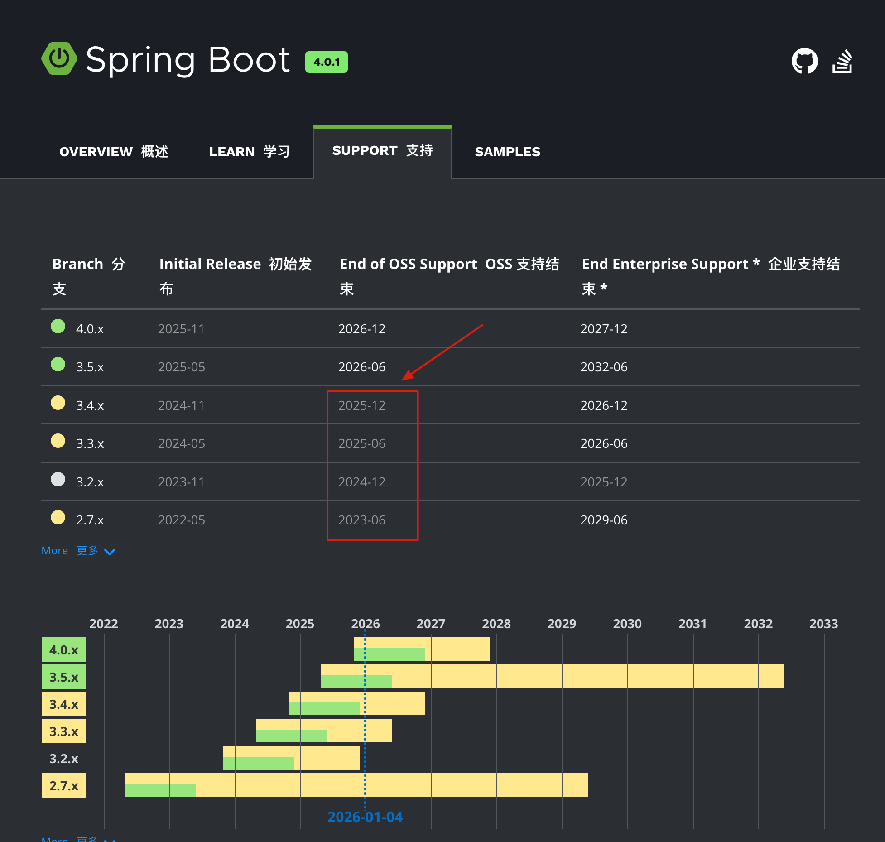
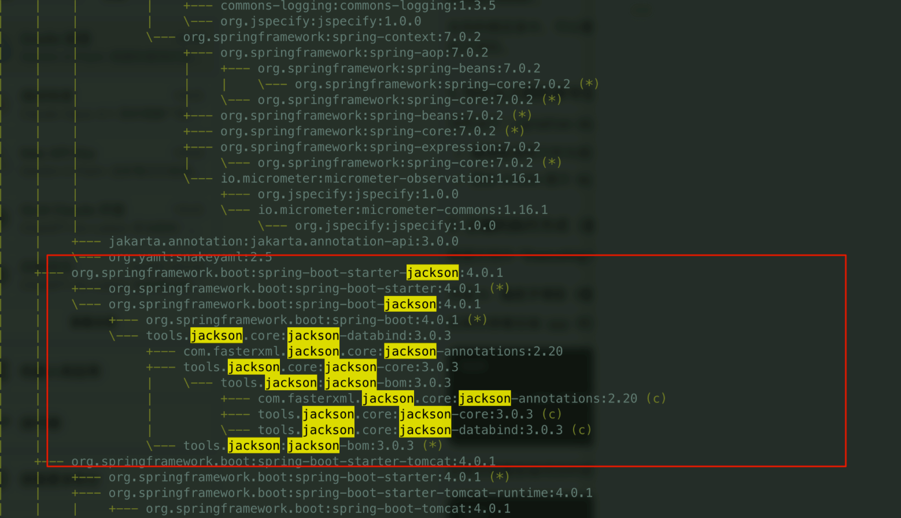

# Spring Boot 4.x 升级实战：Jackson 3、Spring AI 2.0 和 Boot 4.1 踩坑记录

大家好，我是 Guide。

这篇文章原本写的是 **InterviewGuide 从 Spring Boot 3.3 升级到 4.0** 的过程。最近我又顺手把项目继续升级到了 **Spring Boot 4.1.0 + Spring AI 2.0.0-RC2**，所以这次一起把文章更新一下。

先说结论：如果你的项目还在 Spring Boot 3.x，真正的大坑主要集中在 **3.x -> 4.0**，比如 Jackson 3、Boot Starter 模块化、Tomcat 11、Hibernate 7、Redisson 4 等；如果项目已经跑在 Spring Boot 4.0.x，升级到 4.1.0 的工作量会小很多，但 Spring AI、HTTP Client、监控和一些安全默认项仍然值得认真看一遍。

这次我更新的是 **InterviewGuide**，一个基于 Spring Boot、Java 21、Spring AI、React 开发的 AI 简历分析和模拟面试系统。

当前项目已验证版本：

* Spring Boot：`4.1.0`
* Spring AI：`2.0.0-RC2`
* Java：`21`
* Redisson：`4.0.0`
* PostgreSQL + pgvector：向量维度 `1024`
* 前端：React 18 + TypeScript + Vite + TailwindCSS 4

2026-06-11 补充：Spring 官网当前 Spring Boot 稳定版已显示为 4.1.0；Spring AI 2.0.0-RC2 于 2026-06-09 发布。

下面这张图是原文里保留的 Spring Boot 官方支持周期截图，能直观看到老版本进入维护尾声后的压力。



## 要不要升级？

先别急着升级。

对公司项目来说，如果系统已经稳定运行，升级大版本通常不是“顺手改个版本号”这么简单。老板不一定能看到收益，但线上出问题基本会有人记住是谁提的升级。

不过，对新项目、个人项目、正在快速迭代的项目来说，尽量跟上较新的稳定版本还是有价值的。原因很直接：

* 依赖生态会逐步围绕新版本适配。
* 老版本的安全修复窗口会结束。
* 新项目没有太多历史包袱，越早升级成本越低。
* Spring AI 这类新生态变化很快，版本太旧会更容易踩到已修复的问题。

我的建议是：

* 如果还在 Spring Boot 3.3 / 3.4：先升到 3.5，再考虑 4.0 / 4.1。
* 如果已经在 Spring Boot 4.0.x：可以评估升级到 4.1.0。
* 如果项目强依赖大量第三方 Spring Starter：先查兼容性，不要直接冲。

## 版本变更总览

这次可以分成两段看。

第一段是原来的主升级：`3.3.6 -> 4.0.1`。

| 组件 | 升级前 | 4.0 阶段 |
| --- | --- | --- |
| Spring Boot | 3.3.6 | 4.0.1 |
| Spring Framework | 6.x | 7.x |
| Spring AI | 1.1.2 | 2.0.0-M1 / M4 |
| Redisson | 3.24.3 | 4.0.0 |
| Gradle | 8.8 | 8.14+ |
| Hibernate | 6.x | 7.x |
| Tomcat | 10.x | 11.x |
| Jackson | 2.x | 3.x |
| iText | 7.2.5 | 8.0.5 |
| MapStruct | 1.5.5.Final | 1.6.3 |

第二段是这次补充升级：`4.0.1 -> 4.1.0`。

| 组件 | 4.0 阶段 | 当前版本 |
| --- | --- | --- |
| Spring Boot | 4.0.1 | 4.1.0 |
| Spring AI | 2.0.0-M4 | 2.0.0-RC2 |
| Spring Framework | 7.0.x | 7.0.8+ |
| Gradle 支持 | 8.14+ | 8.14+ / 9.x |
| Tomcat | 11.0.x | 11.0.x |
| Redisson | 4.0.0 | 4.0.0 |

Spring Boot 4.1.0 的系统要求里有一点要注意：它要求至少 Java 17，并兼容到 Java 26；显式支持 Gradle 8.14 及以上的 8.x，以及 Gradle 9.x。InterviewGuide 本身使用 Java 21，所以这一块不用额外调整。

## Step 1：升级 Gradle

Spring Boot 4.0 起就需要 Gradle 8.14 或更高版本。先升级 Gradle Wrapper：

```bash
./gradlew wrapper --gradle-version=8.14
```

对应 `gradle/wrapper/gradle-wrapper.properties`：

```properties
distributionUrl=https\://services.gradle.org/distributions/gradle-8.14-bin.zip
```

如果你准备直接上 Spring Boot 4.1，Gradle 8.14 仍然可用；如果团队已经准备升级 Gradle 9，也可以一起评估。但不要把“框架升级”和“构建系统大改”绑得太死，否则排查问题会变麻烦。

## Step 2：更新版本目录

InterviewGuide 使用 Gradle Version Catalog 管理版本，核心改动在 `gradle/libs.versions.toml`。

```toml
[versions]
spring-boot = "4.1.0"
springAi = "2.0.0-RC2"
springAiAgentUtils = "0.7.0"
tika = "2.9.2"
lombok = "1.18.36"
junit-jupiter = "5.12.0"
redisson = "4.0.0"
mapstruct = "1.6.3"
aws-sdk = "2.29.51"
itext = "8.0.5"
pinyin4j = "2.5.0"
springdoc = "3.0.2"

[plugins]
spring-boot = { id = "org.springframework.boot", version.ref = "spring-boot" }
spring-dependency-management = { id = "io.spring.dependency-management", version = "1.1.7" }
```

这里顺手提醒一下：`libs.versions.toml` 是 Gradle 7 引入、7.4 之后正式推荐的版本目录。它很适合这种项目，因为 Spring Boot、Spring AI、Redisson、MapStruct、iText 这些版本集中放在一起，升级时不容易漏。

## Step 3：替换 Boot 4 的 Starter

Spring Boot 4 的一个明显变化是模块化更细。以前常见的：

```groovy
implementation 'org.springframework.boot:spring-boot-starter-web'
```

在这个项目里改成了：

```groovy
implementation 'org.springframework.boot:spring-boot-starter-webmvc'
```

当前后端核心依赖大概是这样：

```groovy
dependencies {
  implementation 'org.springframework.boot:spring-boot-starter-actuator'
  implementation 'org.springframework.boot:spring-boot-starter-webmvc'
  implementation 'org.springframework.boot:spring-boot-starter-validation'
  implementation 'org.springframework.boot:spring-boot-starter-data-jpa'
  implementation 'org.springframework.boot:spring-boot-starter-websocket'

  implementation "org.springframework.ai:spring-ai-starter-model-openai:${libs.versions.springAi.get()}"
  implementation "org.springframework.ai:spring-ai-starter-vector-store-pgvector:${libs.versions.springAi.get()}"

  implementation "org.redisson:redisson-spring-boot-starter:${libs.versions.redisson.get()}"

  runtimeOnly 'io.micrometer:micrometer-registry-prometheus'

  implementation "com.itextpdf:itext-core:${libs.versions.itext.get()}"
  implementation "com.itextpdf:font-asian:${libs.versions.itext.get()}"
}
```

这次 4.1 升级我还顺手补了 Actuator 和 Prometheus。AI 项目里模型调用耗时、结构化输出重试、RAG 检索这些东西都需要观测，不加监控后面很难判断到底慢在哪里。

对应配置：

```yaml
management:
  endpoints:
    web:
      exposure:
        include: health,info,metrics,prometheus
  endpoint:
    health:
      probes:
        enabled: true
```

## Step 4：Jackson 3 迁移，这是 4.0 最大的坑

如果你是从 Spring Boot 3.x 升级到 4.x，Jackson 3 基本躲不开。

Jackson 3 将核心包名从 `com.fasterxml.jackson` 迁到了 `tools.jackson`。这意味着项目里很多 `ObjectMapper`、`JsonNode`、`TypeReference` 的导入都会失效。

常见替换如下：

| 升级前 | 升级后 |
| --- | --- |
| `com.fasterxml.jackson.databind.ObjectMapper` | `tools.jackson.databind.ObjectMapper` |
| `com.fasterxml.jackson.core.type.TypeReference` | `tools.jackson.core.type.TypeReference` |
| `com.fasterxml.jackson.core.JsonProcessingException` | `tools.jackson.core.JacksonException` |

示例：

```java
// 升级前
import com.fasterxml.jackson.core.JsonProcessingException;
import com.fasterxml.jackson.core.type.TypeReference;
import com.fasterxml.jackson.databind.ObjectMapper;

try {
  String json = objectMapper.writeValueAsString(data);
} catch (JsonProcessingException e) {
  // 处理异常
}
```

```java
// 升级后
import tools.jackson.core.JacksonException;
import tools.jackson.core.type.TypeReference;
import tools.jackson.databind.ObjectMapper;

try {
  String json = objectMapper.writeValueAsString(data);
} catch (JacksonException e) {
  // 处理异常
}
```

我在项目里主要改了 `PdfExportService`、`RedisService` 以及一些结构化输出相关类。

再补一句：升级后你可能会在依赖树里同时看到 Jackson 2 和 Jackson 3，别第一时间以为是冲突。Jackson 3 的核心实现迁到了新包，但很多注解仍然沿用旧包，比如常见的 `@JsonProperty`、`@JsonIgnore`。这是为了让 Java 生态有一个渐进迁移过程。

原文里这张依赖树截图也保留，很多人第一次看到 Jackson 2 和 3 同时出现，确实会下意识以为是依赖冲突。



## Step 5：Redisson 4.0 API 迁移

Redisson 4.0 对 Stream 相关类做了包调整。

```java
// 升级前
import org.redisson.api.StreamMessageId;

// 升级后
import org.redisson.api.stream.StreamMessageId;
```

InterviewGuide 里主要影响这些地方：

* `infrastructure/redis/RedisService.java`
* `modules/resume/listener/AnalyzeStreamConsumer.java`
* `modules/knowledgebase/listener/VectorizeStreamConsumer.java`

这一块没有 Jackson 那么痛，基本是编译报错一个改一个。

## Step 6：Spring AI 2.0 RC2 的几个实际变化

Spring AI 2.0.0-RC2 不是简单改版本号。

官方发布说明里提到，这个版本修复和增强了 OpenAI / Anthropic HTTP Client 配置、工具调用 Advisor 自动注册、OpenAI assistant history 中 `reasoning_content` 回放等问题。对 InterviewGuide 这种依赖 OpenAI 兼容接口、工具调用和多 Provider 的项目来说，这几个点都比较贴身。

项目里的主要改动有三类。

第一类是 OpenAI Client 构造方式变化。

之前项目里通过 Spring AI 的 `OpenAiApi` 构建底层 API；升级后改成了新的 OpenAI Java Client：

```java
import com.openai.client.OpenAIClient;
import com.openai.client.OpenAIClientImpl;
import com.openai.core.ClientOptions;
import com.openai.core.Timeout;
import com.openai.credential.BearerTokenCredential;
import org.springframework.ai.openai.http.okhttp.SpringAiOpenAiHttpClient;
```

核心逻辑变成：

```java
Timeout timeout = Timeout.builder()
    .connect(Duration.ofMillis(connectTimeout))
    .read(Duration.ofMillis(readTimeout))
    .build();

ClientOptions options = ClientOptions.Companion.builder()
    .apiKey(apiKey)
    .credential(BearerTokenCredential.create(apiKey))
    .baseUrl(resolveVersionedBaseUrl(baseUrl))
    .timeout(timeout)
    .httpClient(SpringAiOpenAiHttpClient.builder().timeout(timeout).build())
    .build();

return new OpenAIClientImpl(options);
```

这里有个小坑：很多 OpenAI 兼容服务的 Base URL 写法不一样，有的带 `/v1`，有的不带。项目里保留了一个 `ApiPathResolver`，如果 Base URL 末尾没有版本号，就自动补 `/v1`；如果已经是 `https://dashscope.aliyuncs.com/compatible-mode/v1`，就不重复补。

第二类是 ChatClient Builder API 的调整。

升级前常见写法：

```java
builder.defaultToolCallbacks(interviewSkillsToolCallback);
builder.defaultAdvisors(advisors.toArray(new Advisor[0]));
```

升级后改成：

```java
builder.defaultTools(interviewSkillsToolCallback);
builder.defaultAdvisors(advisors);
```

同时，`ToolCallAdvisor` 也改成了 `ToolCallingAdvisor`。项目里语音面试、技能工具调用都会受这个影响。

第三类是去掉 deprecated API。

升级时不要只追求编译通过，最好加一个：

```bash
./gradlew :app:compileJava --warning-mode all
```

这次我就是靠它把 Spring AI 的 deprecated 调用清干净的。否则现在能跑，不代表下一个 RC 或正式版还能跑。

## Step 7：Boot 4.1 的 HTTP Client SSRF 防护

这次 4.1 升级最有意思的坑，不在主业务，而在 Provider 连通性测试。

项目有一个“测试 LLM Provider 是否可用”的功能，前端填 Base URL、模型和 API Key 后，后端会发一次最小化请求。

这种功能天然有 SSRF 风险：用户如果填 `http://127.0.0.1:xxxx`、内网 IP、云元数据地址，就可能让服务端去访问不该访问的地址。

Spring Boot 4.1 的 release notes 里新增了 HTTP Client SSRF mitigation 相关能力，项目里顺手把测试请求的 `RestClient` 改成了 JDK Client，并加了地址过滤：

```java
HttpClientSettings settings = HttpClientSettings.defaults()
    .withConnectTimeout(Duration.ofSeconds(5))
    .withReadTimeout(Duration.ofSeconds(10))
    .withInetAddressFilter(
        InetAddressFilter.externalAddresses()
            .or(InetAddressFilter.adapt(InetAddress::isLoopbackAddress))
            .or("198.18.0.0/15"));

RestClient restClient = RestClient.builder()
    .defaultHeader("Authorization", "Bearer " + config.apiKey())
    .requestFactory(ClientHttpRequestFactoryBuilder.jdk().build(settings))
    .build();
```

这里为什么还允许了 `198.18.0.0/15`？

因为我的本地网络环境里，`dashscope.aliyuncs.com` 会被代理/DNS 解析到一个 fake IP，例如 `198.18.0.223`。如果只允许 `externalAddresses()`，测试会被误伤。这个规则不一定适合所有团队，但至少说明一件事：SSRF 防护不能只看代码，还要结合本地代理、公司网络和部署环境验证。

如果你们是生产系统，我更建议做成配置项，区分：

* 默认只允许公网地址。
* 开发环境可额外允许 loopback。
* 代理环境按需允许特定 CIDR。
* 禁止用户输入任意内网地址。

## Step 8：去掉过时配置

升级 Hibernate 7 之后，类似下面这种显式方言配置可以去掉：

```yaml
spring:
  jpa:
    properties:
      hibernate:
        dialect: org.hibernate.dialect.PostgreSQLDialect
```

Hibernate 能从 JDBC 元信息推断 PostgreSQL 方言。除非你有非常明确的兼容需求，否则不建议继续手写。少一行配置，就少一个以后过期或误配的地方。

## Step 9：Gradle 脚本语法也顺手修一下

这个问题不大，但升级 Gradle / Boot 插件后容易看到警告。

旧写法：

```groovy
maven { url 'https://maven.aliyun.com/repository/public/' }
```

改成：

```groovy
maven { url = uri('https://maven.aliyun.com/repository/public/') }
```

`settings.gradle` 和 `app/build.gradle` 里的仓库地址都可以统一改掉。

## Step 10：CORS 不要只配 localhost

这次浏览器验证时还踩了一个很实际的小坑。

后端连通性测试接口用 `curl` 可以成功，但前端页面里一直提示“请求失败，请重试”。最后发现不是 DashScope 的问题，而是 CORS。

原配置只允许：

```yaml
app:
  cors:
    allowed-origins: http://localhost:5173,http://localhost:5174,http://localhost:80
```

但我在浏览器里打开的是：

```plain
http://127.0.0.1:5173
```

`localhost` 和 `127.0.0.1` 在 CORS 里不是同一个 Origin。

最终配置改成：

```yaml
app:
  cors:
    allowed-origins: ${CORS_ALLOWED_ORIGINS:http://localhost:5173,http://localhost:5174,http://localhost:80,http://127.0.0.1:5173,http://127.0.0.1:5174,http://127.0.0.1:80}
```

这个问题很小，但非常容易误判成“模型 API 不通”。以后遇到前端失败、后端 curl 成功，先看浏览器控制台和后端 CORS 日志，别急着怀疑模型服务。

## 验证升级结果

升级完成后，我建议至少跑这几类验证。

后端编译和测试：

```bash
./gradlew :app:compileJava --warning-mode all
./gradlew :app:test --no-daemon
```

启动应用：

```bash
./gradlew :app:bootRun
```

Actuator 验证：

```bash
curl http://127.0.0.1:8080/actuator/health
curl http://127.0.0.1:8080/actuator/prometheus
```

前端构建：

```bash
cd frontend
pnpm run build
```

浏览器验证：

* 打开设置页。
* 配置 DashScope Provider。
* Base URL 使用 `https://dashscope.aliyuncs.com/compatible-mode/v1`。
* 聊天模型使用 `qwen3.5-flash`。
* 向量模型使用 `text-embedding-v3`。
* 向量维度使用 `1024`。
* 点击测试，确认显示“连接成功”。

这次项目里实际跑过：

```bash
./gradlew :app:compileJava --warning-mode all
./gradlew :app:test --no-daemon
```

并且在浏览器里验证了 DashScope Provider 连通。

## 常见问题

### 1. Spring Boot 4.1.0 要不要从 4.0.x 升？

如果项目已经在 4.0.x，通常可以评估升级。4.1.0 带来了 gRPC 支持、Jackson 配置增强、HTTP Client SSRF 防护、异步上下文传播、Actuator info 增强等能力。

但如果你项目里用了大量第三方 Starter，还是要先看兼容性。

### 2. Spring AI 2.0.0-RC2 能不能用于项目？

个人项目、新项目、内部系统可以尝试。它已经是 RC 阶段，并且修了不少 2.0 早期里和工具调用、OpenAI 兼容、HTTP Client 配置相关的问题。

但如果是强 SLA 的生产系统，最好等 2.0.0 GA，或者至少把模型调用封装在自己的 Provider 层，避免 Spring AI API 继续变化时影响业务代码。

InterviewGuide 里就是统一通过 `LlmProviderRegistry` 获取 `ChatClient`，业务代码不直接 new `OpenAiChatModel`。这样升级 Spring AI 时，主要改 Registry 和少量配置代码。

### 3. 为什么 curl 成功，浏览器失败？

优先查 CORS。

尤其注意 `localhost` 和 `127.0.0.1` 不是同一个 Origin。浏览器会严格区分协议、域名和端口。

### 4. 为什么 DashScope Base URL 有时会拼错？

OpenAI 兼容接口通常有两种写法：

```plain
https://api.example.com
https://api.example.com/v1
```

如果 SDK 内部默认补 `/v1`，而你传入的 Base URL 已经带 `/v1`，就可能变成重复路径。项目里专门加了 `ApiPathResolver` 来处理这个问题。

## 参考资料

* Spring Boot 项目页：<https://spring.io/projects/spring-boot/>
* Spring Boot 4.1 Release Notes：<https://github.com/spring-projects/spring-boot/wiki/Spring-Boot-4.1-Release-Notes>
* Spring Boot System Requirements：<https://docs.spring.io/spring-boot/system-requirements.html>
* Spring AI 2.0.0-RC2 发布公告：<https://spring.io/blog/2026/06/09/spring-ai-2-0-0-RC2-available-now/>
* Spring Boot 4.0 Migration Guide：<https://github.com/spring-projects/spring-boot/wiki/Spring-Boot-4.0-Migration-Guide>
* Redisson Changelog：<https://github.com/redisson/redisson/blob/master/CHANGELOG.md>
* Jackson 3 Release Notes：<https://github.com/FasterXML/jackson/wiki/Jackson-Release-3.0>

## 总结

这次升级可以拆成两句话：

如果你是从 Spring Boot 3.x 升到 4.x，重点盯住 Jackson 3、Starter 模块化、Tomcat 11、Hibernate 7、Redisson 4 这些大变化。

如果你已经在 Spring Boot 4.0.x，升级 4.1.0 的代码改动不会太夸张，但 Spring AI 2.0.0-RC2、HTTP Client SSRF 防护、Actuator/Prometheus、CORS 这些细节仍然值得认真处理。

最后还是那句老话：升级不要只看“能不能启动”。至少要做到能编译、测试通过、核心页面跑通、模型 Provider 连通、监控端点可用。这样升级才算真的落地。


> 更新: 2026-06-11 14:39:13  
> 原文: <https://www.yuque.com/snailclimb/itdq8h/ouioy5a5ckyfmofc>