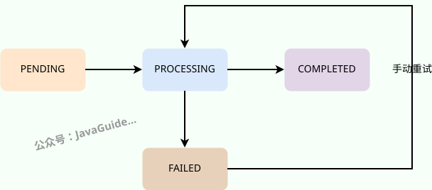

# ⭐基于 Redis Stream 的异步任务处理实现

大家好，我是 Guide！在 **InterviewGuide** 这个 AI 项目中，我们涉及到大量的长耗时操作（比如调用大模型 API 解析简历、对文档进行向量化）。如果让前端同步等待 20-30 秒，用户估计早就关掉页面走人了。

为了实现“上传即返回，后台稳如狗”的体验，我引入了 **Redis Stream**。

为什么没有用重型的 Kafka、RocketMQ，也没有直接用 PostgreSQL 的原生队列？今天就带你进行一次“穿透式复盘”，拆解如何构建一套轻量级、工业级的异步任务系统。

## 异步任务场景

项目中有三个典型的异步任务场景：

| 场景 | 说明 | 耗时 |
| --- | --- | --- |
| 知识库向量化 | 将上传的文档切分、生成向量嵌入并存储到 pgvector | 5-30 秒 |
| 简历 AI 分析 | 调用 LLM 对简历进行评分和建议生成 | 5-15 秒 |
| 面试报告生成 | 对面试会话进行综合评估，生成详细报告 | 5-20 秒 |

这些操作都涉及外部 API 调用（向量化模型、LLM），响应时间不稳定。如果采用同步处理，用户上传文件后需要长时间等待，体验极差，且容易触发 HTTP 超时。

## 技术选型

### 为什么选择 Redis Stream？

在做架构设计时，千万不要为了炫技而引入复杂性。我们需要在**性能、运维成本和业务规模**之间寻找平衡。

| 特性 | Redis Stream | Redis List | Redis pub/sub | Kafka | RabbitMQ |
| :--- | :--- | :--- | :--- | :--- | :--- |
| **消费者组** | ✅ 原生支持 | ❌ 需自己实现 | ❌ 不支持 (广播模式) | ✅ 支持 | ✅ 支持 |
| **消息确认** | ✅ ACK 机制 | ❌ 无 (需业务层处理) | ❌ 无 | ✅ 支持 | ✅ 支持 |
| **消息持久化** | ✅ 支持 | ✅ 支持 | ❌ 不支持 (掉线即丢失) | ✅ 支持 | ✅ 支持 |
| **消息回溯** | ✅ 支持 (基于 ID) | ❌ 不支持 (出队即删) | ❌ 不支持 | ✅ 支持 | ❌ 不支持 |
| **部署复杂度** | 低 (复用现有 Redis) | 低 | 低 | 高 | 中 |
| **运维成本** | 低 | 低 | 低 | 高 | 中 |
| **适用规模** | 中小规模 | 简单队列 | 实时通知/即时通信 | 大规模 | 中大规模 |

Redis Stream 是 Redis 5.0 引入的数据结构，专为消息队列场景设计。对于我们的项目而言：

1. **复用现有基础设施**：项目已经使用 Redis 做缓存，无需额外部署消息队列。
2. **消费者组支持**：天然支持多实例部署，消息只会被一个消费者处理。
3. **消息确认机制**：通过 ACK 机制确保消息不丢失。
4. **轻量级**：相比 Kafka/RabbitMQ，运维成本更低。

我在 [Redis 常见面试题总结(上)](https://javaguide.cn/database/redis/redis-questions-01.html)这篇文章中详细提到过如何基于 Redis 实现消息队列，还对比了 Redis List 和发布订阅 (pub/sub) 实现消息队列的差别。

### 为什么不用 PostgreSQL 做队列？

PostgreSQL 从 9.5 版本开始，可以通过 `SELECT ... FOR UPDATE SKIP LOCKED` 实现事务性队列。我们评估过这个方案，但最终选择 Redis Stream，主要基于**压力隔离**考量：

* 向量化任务是**高并发、写密集**的过程，大量的入队、出队、删除操作会产生海量 WAL 日志写入和表膨胀
* 在我们的设计中，PostgreSQL 承载的是用户前端的**核心查询负载**，不希望后台任务干扰用户体验
* 引入 Redis Stream 相当于做了一层**物理隔离**

### 那 Redis 岂不是多了个高可用风险点？

是的，引入中间件确实增加了链路复杂度。但考虑到 Redis 已经是系统中的标准组件（用于缓存），且本身支持主从复制或哨兵模式（Sentinel），这个成本相对于它带给主数据库的保护来说是值得的。

## 架构设计

### 整体流程

一句话描述：用户请求 → 生产者写入 Redis Stream → 消费者异步处理 → 更新状态 → 前端轮询获取结果。


### 状态流转



* `PENDING`\*\* (待处理)\*\*：初始状态。用户刚上传文件，任务已写入 DB 并推送到 Redis Stream，但消费者尚未开始处理。
* `PROCESSING`\*\* (处理中)\*\*：消费者从 Redis Stream 拉取到消息，开始执行业务逻辑前，通常会将状态更新为 `PROCESSING`。这样可以避免重复处理，也让用户知道“系统正在干活”。
* `COMPLETED`**(已完成)**：消费者业务逻辑执行成功，结果已保存。前端轮询到此状态后展示结果。
* `FAILED`**(失败)**：消费者处理过程中发生异常（如 AI 服务超时、解析错误）。

如果任务 `FAILED`，用户可以触发“手动重试”，将状态重置为 `PENDING`并重新向 Redis Stream 发送一条消息。

## 核心实现

### 通用常量定义

将三个模块共用的 Stream 配置统一到 `common/constant` 包下：

```java
// AsyncTaskStreamConstants.java
public final class AsyncTaskStreamConstants {

    private AsyncTaskStreamConstants() {}

    // ========== 通用消息字段 ==========
    public static final String FIELD_CONTENT = "content";
    public static final String FIELD_RETRY_COUNT = "retryCount";

    // ========== 通用消费者配置 ==========
    public static final int MAX_RETRY_COUNT = 3;       // 最大重试次数
    public static final int BATCH_SIZE = 10;           // 每次拉取消息数
    public static final long POLL_INTERVAL_MS = 1000;  // 轮询间隔（毫秒）
    public static final int STREAM_MAX_LEN = 1000;     // Stream 最大长度

    // ========== 知识库向量化 ==========
    public static final String KB_VECTORIZE_STREAM_KEY = "knowledgebase:vectorize:stream";
    public static final String KB_VECTORIZE_GROUP_NAME = "vectorize-group";
    public static final String KB_VECTORIZE_CONSUMER_PREFIX = "vectorize-consumer-";
    public static final String FIELD_KB_ID = "kbId";

    // ========== 简历分析 ==========
    public static final String RESUME_ANALYZE_STREAM_KEY = "resume:analyze:stream";
    public static final String RESUME_ANALYZE_GROUP_NAME = "analyze-group";
    public static final String RESUME_ANALYZE_CONSUMER_PREFIX = "analyze-consumer-";
    public static final String FIELD_RESUME_ID = "resumeId";

    // ========== 面试评估 ==========
    public static final String INTERVIEW_EVALUATE_STREAM_KEY = "interview:evaluate:stream";
    public static final String INTERVIEW_EVALUATE_GROUP_NAME = "evaluate-group";
    public static final String INTERVIEW_EVALUATE_CONSUMER_PREFIX = "evaluate-consumer-";
    public static final String FIELD_SESSION_ID = "sessionId";
}
```

### 通用任务状态

```java
// AsyncTaskStatus.java
public enum AsyncTaskStatus {
    PENDING,     // 待处理
    PROCESSING,  // 处理中
    COMPLETED,   // 完成
    FAILED       // 失败
}
```

### 为什么提取抽象类？

在 3 条异步链路（向量化、简历分析、面试评估）都落地后，我们发现 Producer/Consumer 的“骨架代码”高度重复：

* Consumer 都有：初始化消费者组、生成唯一 consumerName、启动单线程循环、ACK、重试、错误截断。
* Producer 都有：组装消息、写入 Stream、发送失败后的状态兜底。

如果继续复制粘贴，后续会出现两个问题：

1. **一致性风险**：某条链路修了 ACK/retry 细节，另外两条容易漏改。
2. **扩展成本高**：每加一种新任务，都要再写一套生命周期模板代码。

因此我们采用 **Template Method（模板方法）** 做收敛：

* `AbstractStreamConsumer<T>` 固定“消费生命周期”：`init -> consumeLoop -> processMessage -> ack/retry`；
* 业务子类只实现钩子：`parsePayload`、`processBusiness`、`markProcessing/Completed/Failed`；
* `AbstractStreamProducer<T>` 固定“发送流程”：`buildMessage -> streamAdd -> onSendFailed`；
* 业务子类只负责消息字段和失败后的状态回写。

这次抽象遵循一个原则：**只提取稳定骨架，不抽业务细节**。\
也就是说，抽象类只管“流程控制”，不管“向量化/分析/评估”各自的业务判断。

### 生产者 (Producer)

上传服务在保存数据后，将任务发送到 Redis Stream：

```java
// AbstractStreamProducer.java
@Slf4j
public abstract class AbstractStreamProducer<T> {

    private final RedisService redisService;

    protected void sendTask(T payload) {
        try {
            String messageId = redisService.streamAdd(
                streamKey(),
                buildMessage(payload),
                AsyncTaskStreamConstants.STREAM_MAX_LEN
            );
            log.info("{}任务已发送到Stream: {}, messageId={}",
                taskDisplayName(), payloadIdentifier(payload), messageId);
        } catch (Exception e) {
            log.error("发送{}任务失败: {}, error={}",
                taskDisplayName(), payloadIdentifier(payload), e.getMessage(), e);
            onSendFailed(payload, "任务入队失败: " + e.getMessage());
        }
    }

    protected abstract String taskDisplayName();
    protected abstract String streamKey();
    protected abstract Map<String, String> buildMessage(T payload);
    protected abstract String payloadIdentifier(T payload);
    protected abstract void onSendFailed(T payload, String error);
}
// VectorizeStreamProducer.java
@Slf4j
@Component
public class VectorizeStreamProducer extends AbstractStreamProducer<VectorizeStreamProducer.VectorizeTaskPayload> {

    private final KnowledgeBaseRepository knowledgeBaseRepository;

    record VectorizeTaskPayload(Long kbId, String content) {}

    public VectorizeStreamProducer(RedisService redisService, KnowledgeBaseRepository knowledgeBaseRepository) {
        super(redisService);
        this.knowledgeBaseRepository = knowledgeBaseRepository;
    }

    public void sendVectorizeTask(Long kbId, String content) {
        sendTask(new VectorizeTaskPayload(kbId, content));
    }

    @Override
    protected String streamKey() {
        return AsyncTaskStreamConstants.KB_VECTORIZE_STREAM_KEY;
    }

    @Override
    protected Map<String, String> buildMessage(VectorizeTaskPayload payload) {
        return Map.of(
            AsyncTaskStreamConstants.FIELD_KB_ID, payload.kbId().toString(),
            AsyncTaskStreamConstants.FIELD_CONTENT, payload.content(),
            AsyncTaskStreamConstants.FIELD_RETRY_COUNT, "0"
        );
    }
}
```

**这里的设计重点**：

* `sendTask(...)` 由抽象类统一，保证所有任务的发送日志、失败兜底行为一致；
* 子类仅关注“这类任务的 payload 长什么样”（`VectorizeTaskPayload`）和“消息字段如何映射”；
* 未来新增任务时，通常只需新增一个 payload + 4~5 个覆盖方法即可落地。

**关键点：MAXLEN 限制**

```java
// RedisService.java
public String streamAdd(String streamKey, Map<String, String> message, int maxLen) {
    RStream<String, String> stream = redissonClient.getStream(streamKey, StringCodec.INSTANCE);
    StreamAddArgs<String, String> args = StreamAddArgs.entries(message);
    if (maxLen > 0) {
        // 使用 trimNonStrict 实现近似裁剪，性能更好
        args.trimNonStrict().maxLen(maxLen);
    }
    return stream.add(args).toString();
}
```

如果不设置 `MAXLEN`，Stream 会无限增长，最终耗尽内存。我们曾经遇到过这个问题，详见下文"踩坑记录"。

### 消费者 (Consumer)

消费者是核心组件，负责从 Stream 读取消息并执行业务逻辑：

```java
// AbstractStreamConsumer.java（核心模板）
@Slf4j
public abstract class AbstractStreamConsumer<T> {

    private final RedisService redisService;
    private final AtomicBoolean running = new AtomicBoolean(false);
    private ExecutorService executorService;
    private String consumerName;

    @PostConstruct
    public void init() {
        this.consumerName = consumerPrefix() + UUID.randomUUID().toString().substring(0, 8);
        redisService.createStreamGroup(streamKey(), groupName());

        this.executorService = Executors.newSingleThreadExecutor(r -> {
            Thread t = new Thread(r, threadName());
            t.setDaemon(true);
            return t;
        });

        running.set(true);
        executorService.submit(this::consumeLoop);

        log.info("{}消费者已启动: consumerName={}", taskDisplayName(), consumerName);
    }

    @PreDestroy
    public void shutdown() {
        running.set(false);
        if (executorService != null) {
            executorService.shutdown();
        }
        log.info("{}消费者已关闭: consumerName={}", taskDisplayName(), consumerName);
    }

    private void consumeLoop() {
        while (running.get()) {
            try {
                redisService.streamConsumeMessages(
                    streamKey(),
                    groupName(),
                    consumerName,
                    AsyncTaskStreamConstants.BATCH_SIZE,
                    AsyncTaskStreamConstants.POLL_INTERVAL_MS,
                    this::processMessage
                );
            } catch (Exception e) {
                if (Thread.currentThread().isInterrupted()) {
                    break;
                }
                log.error("消费消息时发生错误: {}", e.getMessage(), e);
            }
        }
    }

    private void processMessage(StreamMessageId messageId, Map<String, String> data) {
        T payload = parsePayload(messageId, data);
        if (payload == null) {
            ackMessage(messageId);
            return;
        }
        int retryCount = parseRetryCount(data);

        try {
            markProcessing(payload);
            processBusiness(payload);
            markCompleted(payload);
            ackMessage(messageId);
        } catch (Exception e) {
            if (retryCount < AsyncTaskStreamConstants.MAX_RETRY_COUNT) {
                retryMessage(payload, retryCount + 1);
            } else {
                markFailed(payload, truncateError(
                    taskDisplayName() + "失败(已重试" + retryCount + "次): " + e.getMessage()
                ));
            }
            ackMessage(messageId);
        }
    }
    // ... 其他模板方法省略
}
// VectorizeStreamConsumer.java（仅保留业务差异）
@Slf4j
@Component
public class VectorizeStreamConsumer extends AbstractStreamConsumer<VectorizeStreamConsumer.VectorizePayload> {

    private final KnowledgeBaseVectorService vectorService;
    private final KnowledgeBaseRepository knowledgeBaseRepository;

    record VectorizePayload(Long kbId, String content) {}

    @Override
    protected String streamKey() {
        return AsyncTaskStreamConstants.KB_VECTORIZE_STREAM_KEY;
    }

    @Override
    protected VectorizePayload parsePayload(StreamMessageId messageId, Map<String, String> data) {
        String kbIdStr = data.get(AsyncTaskStreamConstants.FIELD_KB_ID);
        String content = data.get(AsyncTaskStreamConstants.FIELD_CONTENT);
        if (kbIdStr == null || content == null) {
            return null;
        }
        return new VectorizePayload(Long.parseLong(kbIdStr), content);
    }

    @Override
    protected void processBusiness(VectorizePayload payload) {
        vectorService.vectorizeAndStore(payload.kbId(), payload.content());
    }
    // ... 其他钩子方法省略
}
```

**这里的设计重点**：

* `AbstractStreamConsumer` 统一处理了 ACK 和 retry，避免“某个消费者忘记 ACK”这类隐患；
* 子类只写“业务差异点”，例如：如何解析消息、调用哪个业务 Service、如何更新状态；
* 生命周期钩子天然适配多任务：同样一套模板可以复用到简历分析、面试评估。

### 重构前后对比（思路层）

| 对比项 | 重构前 | 重构后 |
| --- | --- | --- |
| 生命周期代码 | 3 份 Consumer 几乎重复 | 抽到 `AbstractStreamConsumer` |
| 发送流程代码 | 3 份 Producer 几乎重复 | 抽到 `AbstractStreamProducer` |
| ACK / retry 一致性 | 依赖每个类手写，易漏 | 模板统一收口 |
| 新任务接入成本 | 需要复制整套骨架 | 只实现业务钩子 |
| 维护成本 | 改一处要同步多处 | 改模板即可全局生效 |

### Redis Service 封装

对 Redisson 的 Stream API 进行封装，提供更友好的接口：

```java
// RedisService.java (Stream 相关部分)
@Service
@RequiredArgsConstructor
public class RedisService {

    private final RedissonClient redissonClient;

    /**
     * Stream 消息处理器接口
     */
    @FunctionalInterface
    public interface StreamMessageProcessor {
        void process(StreamMessageId messageId, Map<String, String> data);
    }

    /**
     * 消费 Stream 消息（阻塞模式）
     * 使用 Redis BLOCK 参数，让服务端等待消息，比客户端轮询更高效
     */
    public boolean streamConsumeMessages(
            String streamKey,
            String groupName,
            String consumerName,
            int count,
            long blockTimeoutMs,
            StreamMessageProcessor processor) {

        RStream<String, String> stream = redissonClient.getStream(streamKey, StringCodec.INSTANCE);

        // 使用阻塞读取，让 Redis 服务端等待消息
        Map<StreamMessageId, Map<String, String>> messages = stream.readGroup(
            groupName,
            consumerName,
            StreamReadGroupArgs.neverDelivered()
                .count(count)
                .timeout(Duration.ofMillis(blockTimeoutMs))  // 阻塞等待
        );

        if (messages == null || messages.isEmpty()) {
            return false;
        }

        for (var entry : messages.entrySet()) {
            processor.process(entry.getKey(), entry.getValue());
        }

        return true;
    }

    /**
     * 创建消费者组（幂等操作）
     */
    public void createStreamGroup(String streamKey, String groupName) {
        RStream<String, String> stream = redissonClient.getStream(streamKey, StringCodec.INSTANCE);
        try {
            stream.createGroup(StreamCreateGroupArgs.name(groupName).makeStream());
        } catch (Exception e) {
            // BUSYGROUP 表示组已存在，可以忽略
            if (!e.getMessage().contains("BUSYGROUP")) {
                log.warn("创建消费者组失败: {}", e.getMessage());
            }
        }
    }

    /**
     * 发送消息到 Stream（带长度限制）
     */
    public String streamAdd(String streamKey, Map<String, String> message, int maxLen) {
        RStream<String, String> stream = redissonClient.getStream(streamKey, StringCodec.INSTANCE);
        StreamAddArgs<String, String> args = StreamAddArgs.entries(message);
        if (maxLen > 0) {
            args.trimNonStrict().maxLen(maxLen);
        }
        return stream.add(args).toString();
    }

    /**
     * 确认消息已处理
     */
    public void streamAck(String streamKey, String groupName, StreamMessageId... ids) {
        RStream<String, String> stream = redissonClient.getStream(streamKey, StringCodec.INSTANCE);
        stream.ack(groupName, ids);
    }
}
```

## 重试机制

### 自动重试

当任务处理失败时，如果未超过最大重试次数（默认 3 次），消费者会将任务重新发送到 Stream：


为了避免瞬时高峰导致雪崩，可扩展为指数退避（如 1s / 5s / 30s）。如果超过最大重试次数，更新数据库状态为 FAILED，不再重试。

### 手动重试

对于已标记为 FAILED 的任务，提供手动重试 API：

```java
// Controller
@PostMapping("/api/knowledgebase/{id}/revectorize")
public Result<Void> revectorize(@PathVariable Long id) {
    uploadService.revectorize(id);
    return Result.success(null);
}

// Service
@Transactional
public void revectorize(Long kbId) {
    KnowledgeBaseEntity kb = knowledgeBaseRepository.findById(kbId)
        .orElseThrow(() -> new BusinessException(ErrorCode.NOT_FOUND, "知识库不存在"));

    // 重新下载并解析文件
    String content = parseService.downloadAndParseContent(
        kb.getStorageKey(), kb.getOriginalFilename());

    // 重置状态
    kb.setVectorStatus(VectorStatus.PENDING);
    kb.setVectorError(null);
    knowledgeBaseRepository.save(kb);

    // 发送新任务
    vectorizeStreamProducer.sendVectorizeTask(kbId, content);
}
```

## 前端轮询

前端通过定时轮询获取任务状态更新：

```typescript
// KnowledgeBaseManagePage.tsx
useEffect(() => {
  // 只有存在待处理任务时才启动轮询
  const hasPendingItems = knowledgeBases.some(
    kb => kb.vectorStatus === 'PENDING' || kb.vectorStatus === 'PROCESSING'
  );

  if (hasPendingItems && !loading) {
    const timer = setInterval(() => {
      loadDataSilent();  // 静默刷新，不显示 loading 状态
    }, 5000);  // 每 5 秒轮询一次

    return () => clearInterval(timer);
  }
}, [knowledgeBases, loading, loadDataSilent]);
```

**优化点**：

| 优化 | 说明 |
| --- | --- |
| 条件轮询 | 仅当存在 PENDING/PROCESSING 任务时才轮询 |
| 静默刷新 | 不显示 loading 状态，避免页面闪烁 |
| 合理频率 | 5 秒间隔，平衡实时性与服务器压力 |

## 多实例部署

Redis Stream 的消费者组天然支持多实例部署：

```plain
┌─────────────────────────────────────────────────────────────┐
│                     Redis Stream                            │
│                 knowledgebase:vectorize                     │
└───────────────────────────┬─────────────────────────────────┘
                            │
                            ▼
              ┌─────────────────────────────┐
              │    Consumer Group           │
              │    "vectorize-group"        │
              └──────────────┬──────────────┘
                             │
            ┌────────────────┼────────────────┐
            ▼                ▼                ▼
   ┌─────────────┐  ┌─────────────┐  ┌─────────────┐
   │ Instance 1  │  │ Instance 2  │  │ Instance 3  │
   │ consumer-   │  │ consumer-   │  │ consumer-   │
   │ a1b2c3d4    │  │ e5f6g7h8    │  │ i9j0k1l2    │
   └─────────────┘  └─────────────┘  └─────────────┘
```

**关键特性**：

* 每个消费者有唯一的名称（UUID 前缀）
* 同一消费者组内的消息只会被一个消费者处理
* 消息处理失败后可以被其他消费者重新获取

```java
// AbstractStreamConsumer 中统一生成唯一消费者名称
this.consumerName = consumerPrefix()
    + UUID.randomUUID().toString().substring(0, 8);
// 例如: vectorize-consumer-a1b2c3d4
```

## 踩坑记录

### 坑 1：Stream 无限增长导致内存耗尽

**现象**：

Redis 中某个 Stream 消息无限增长，最终 Redis 内存耗尽。

**原因：**

一个常见的误区：`XACK` 只是确认消息已被消费，不会删除 Stream 里的消息条目。

* `XADD`：写入消息到 Stream
* `XREADGROUP`：消费者组读取消息
* `XACK`：确认消费（把消息从消费者组的 **PEL** / Pending Entries List “待处理列表”里移除）
* `XDEL`：从 Stream 中删除指定消息条目
* `XTRIM` / `MAXLEN`：裁剪 Stream（限制 Stream 长度，删除较旧的条目）

如果你既没有 `XDEL`，也没有 `XTRIM/MAXLEN`，那么 **Stream 里的历史消息会持续累积**，占用内存/磁盘。生产环境中，最推荐的方式是在写入时直接指定 **MAXLEN**，实现类似于定长环形队列的效果。

> 另外还有一种“堆积”是 **PEL 堆积**：消费者没有 `XACK`，导致待确认（pending）的消息越来越多。两者要区分排查。

**解决方案**：

发送消息时添加 **MAXLEN 限制**，自动裁剪旧消息：

```java
// 修复前
stream.add(StreamAddArgs.entries(message));

// 修复后（自动裁剪超过 1000 条的旧消息）
stream.add(StreamAddArgs.entries(message)
    .trimNonStrict().maxLen(1000));
```

* `trimNonStrict()`: 使用近似裁剪（`~`），性能更好
* `maxLen(1000)`: 保留最新 1000 条消息

### 坑 2：删除实体后异步任务报错

**问题**：

后台日志频繁出现 `简历不存在: ID=35` 的 Error。检查发现，这是由于用户删除了简历，但分析任务还在跑。

**原因：**

这是导致数据不一致的典型问题：

1. 用户上传简历 → 发送分析任务到 Redis Stream
2. 分析失败 → 消息进入 pending/等待重试
3. 用户删除简历 → 数据库记录已删除
4. 消费者重试处理 → 找不到简历 → 报错

**解决方案**：

把“生命周期校验”放在异步任务处理的最前面，并区分：

* **不可恢复错误**（实体不存在、参数非法）→ 记录后 ACK/丢弃
* **可恢复错误**（临时网络故障、依赖服务超时）→ 不 ACK，让其重试或进入重试队列

示例（用一次查询代替`existsById + findById`两次查询）：

```java
private void processMessage(StreamMessageId messageId, Map<String, String> data) {
    Long resumeId = Long.parseLong(data.get("resumeId"));

    var resumeOpt = resumeRepository.findById(resumeId);
    if (resumeOpt.isEmpty()) {
        // 不可恢复：实体已被用户删除（或数据已不存在）
        log.warn("检测到实体已被删除，跳过异步任务: resumeId={}", resumeId);
        ackMessage(messageId); // 必须 ACK，否则会反复重试造成噪音与堆积
        return;
    }

    try {
        Resume resume = resumeOpt.get();
        // 继续业务逻辑...
        ackMessage(messageId);
    } catch (TransientDependencyException e) {
        // 可恢复错误：不 ACK，让其重试（或转入重试/死信机制）
        log.warn("依赖异常，等待重试: resumeId={}, msgId={}", resumeId, messageId, e);
        throw e;
    } catch (Exception e) {
        // 根据你的策略决定是否 ACK/重试/转死信
        log.error("处理失败: resumeId={}, msgId={}", resumeId, messageId, e);
        throw e;
    }
}
```

### 坑 3：忘记 ACK 导致消息重复消费

**问题**：处理失败时只做了重试入队，忘记 ACK 原消息，导致原消息在 Pending List 中无限堆积。

**解决方案**：无论成功失败都要 ACK 原消息（已在 `AbstractStreamConsumer` 模板里统一处理）：

```java
try {
    // 业务逻辑...
    ackMessage(messageId);
} catch (Exception e) {
    if (retryCount < MAX_RETRY_COUNT) {
        retryMessage(...);  // 重新入队
    } else {
        updateStatus(FAILED);
    }
    ackMessage(messageId);  // 🔑 关键：失败也要 ACK
}
```

Redis Stream 是 at-least-once 模型，如果未 ACK，消息会一直存在于 PEL 中，可能被重复投递。因此必须在“最终决策点”统一 ACK，而不是在多处散落 ACK。

## 可优化点（作业）

我预留了一些优化方向，作为扩展练习，感兴趣的同学可以尝试实现。

### 1. 死信队列 (Dead Letter Queue)

当前实现中，超过最大重试次数的消息只是标记为 FAILED。可以考虑将这些消息转移到专门的死信队列，便于后续分析和人工处理。

```java
// 伪代码
if (retryCount >= MAX_RETRY_COUNT) {
    redisService.streamAdd("knowledgebase:vectorize:dlq", message);
    updateStatus(FAILED);
}
```

### 2. 处理超时检测

如果消费者在处理消息过程中宕机，消息会留在 Pending List 中。可以定时扫描 Pending List，将超时未确认的消息重新分配给其他消费者。

```java
// 使用 XPENDING 和 XCLAIM 命令
// 扫描超过 5 分钟未确认的消息
stream.pendingRange(groupName, StreamMessageId.MIN, StreamMessageId.MAX, 100);
stream.claim(groupName, consumerName, 5 * 60 * 1000, messageId);
```

### 3. Server-Sent Events (SSE) 替代轮询

当前前端使用 5 秒轮询获取状态更新，可以使用 SSE 实现服务端主动推送，减少不必要的请求：

```java
@GetMapping(value = "/status/{id}", produces = MediaType.TEXT_EVENT_STREAM_VALUE)
public Flux<ServerSentEvent<String>> streamStatus(@PathVariable Long id) {
    return Flux.interval(Duration.ofSeconds(1))
        .map(i -> {
            String status = getStatus(id);
            return ServerSentEvent.builder(status).build();
        })
        .takeUntil(sse -> "COMPLETED".equals(sse.data()) || "FAILED".equals(sse.data()));
}
```

### 4. 跨语言消费者 (Python Worker)

Redis Stream 支持多语言客户端。可以用 Python 实现向量化 Worker，充分利用 Python 在 AI 领域的生态优势：

```python
# Python 消费者示例
import redis

r = redis.Redis()
while True:
    messages = r.xreadgroup(
        groupname='vectorize-group',
        consumername='python-worker-1',
        streams={'knowledgebase:vectorize:stream': '>'},
        count=10,
        block=1000
    )
    for stream, message_list in messages:
        for message_id, data in message_list:
            # 使用 Python 库进行向量化
            embeddings = sentence_transformers.encode(data['content'])
            # ...
            r.xack(stream, 'vectorize-group', message_id)
```

## 总结

本项目通过 **Redis Stream** 构建了一个轻量级的异步任务队列，用于处理知识库向量化、简历分析、面试评估等耗时操作。

**核心优势**：

* **用户体验**：上传立即返回，无需等待。
* **系统解耦**：生产者与消费者分离，互不影响。
* **可靠性**：自动重试 + 手动重试，确保任务最终完成。
* **可扩展**：消费者组支持多实例水平扩展。
* **低成本**：复用现有 Redis，无需额外部署。

**技术选型**：

* **选 Redis Stream**：复用现有 Redis 基础设施；原生支持**消费者组**、**持久化**、**ACK 确认**、**按 ID 回溯**，相比 Kafka/RabbitMQ 运维成本更低，适合中小规模任务队列。
* **没选 PostgreSQL 队列**：虽然可以用 `SELECT ... FOR UPDATE SKIP LOCKED` 做事务队列，但会带来 WAL 写入、表膨胀等写压力，影响核心查询负载；使用 Stream 相当于做了**压力/职责隔离**。
* **可靠性权衡**：引入 Stream 增加链路复杂度，但 Redis 本就是标准组件，可用主从/哨兵保障，高可用成本可控。

**关键设计**：

| 决策点 | 选择 | 理由 |
| --- | --- | --- |
| 消息队列 | Redis Stream | 轻量级，复用现有 Redis |
| 消费模式 | Consumer Group | 支持多实例、消息确认 |
| 重试策略 | 最多 3 次 | 平衡可靠性与资源消耗 |
| 状态轮询 | 5 秒间隔 | 平衡实时性与服务器压力 |
| 消费者命名 | UUID 前缀 | 支持多实例唯一标识 |
| MAXLEN | 1000 | 防止 Stream 无限增长 |

对于中小规模的异步任务处理场景，Redis Stream 是一个非常实用的选择。如果未来业务规模增长到需要更强大的消息队列能力，可以考虑迁移到 Kafka 或 RocketMQ。


> 更新: 2026-02-24 21:44:44  
> 原文: <https://www.yuque.com/snailclimb/itdq8h/yk25d6iw6s21xczn>