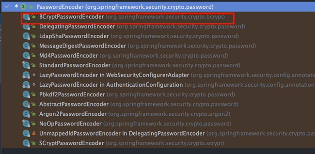

# 面试常见问题补充

## 安全

补充一些安全相关的面试题，大家可以根据自己需要选择性添加和准备。

### 认证授权是怎么做的？

认证授权是开发难度相对较大的一个功能，对于在校学生来说。

认证授权可以基于下面三个框架来做：

* [Sa-Token](https://github.com/dromara/sa-token)：轻量级 Java 权限认证框架。支持认证授权、单点登录、踢人下线、自动续签等功能。相比于 Spring Security 和 Shiro 来说，Sa-Token 内置的开箱即用的功能更多，使用也更简单。
* [Spring Security](https://github.com/spring-projects/spring-security)：Spring 官方安全框架，能够用于身份验证、授权、加密和会话管理，是目前使用最广泛的 Java 安全框架。
* [Shiro](https://github.com/apache/shiro)：Java 安全框架，功能和 Spring Security 类似，但使用起来更简单。

一般来说，Spring Security 用的最多，最权威。国人开源的 Sa-Token  易用性更强，也可以使用。个人的话，更推荐 Spring Security ，因为 Sa-Token  提供的开箱即用的功能太多，面试反而不太好发挥。

在面试的时候，结合你选择的框架去讲就好了。实际面试中不会问太难，你搞清楚你用的框架的认证授权的逻辑以及认证授权的一些常见概念就可以了，不用太担心。

下面这四篇是 JavaGuide 上认证授权相关的文章，推荐认真看看，看完之后应对面试对于项目认证授权部分的拷打应该绰绰有余了：

* [认证授权基础概念详解](https://javaguide.cn/system-design/security/basis-of-authority-certification.html)
* [JWT 基础概念详解](https://javaguide.cn/system-design/security/jwt-intro.html)
* [JWT 身份认证优缺点分析](https://javaguide.cn/system-design/security/advantages-and-disadvantages-of-jwt.html)
* [权限系统设计详解](https://javaguide.cn/system-design/security/design-of-authority-system.html)

下面这几道认证授权相关的问题被提问的概率很大（上面推荐的文章中基本都涵盖了这些问题的答案）：

1. 为什么选择使用 JWT？有什么优缺点？
2. 做过 Session 身份验证吗？它与 Token 身份验证有何不同？
3. 请解释一下同端互斥登录和强制下线是如何实现的？
4. 简单介绍一下你的项目是如何实现 RBAC 权限模型的？
5. 如何确保密码在传输和存储过程中的安全性？（参考答案见《后端面试高频系统设计&场景题》的这篇文章：<https://www.yuque.com/snailclimb/tangw3/pt0w151wtcal7oaf）>

如果你想要在登录这块加一些亮点的话，可以考虑引入第三方登录。另外，我在《后端面试高频系统设计&场景题》这个专栏中单独写过一篇文章来详细介绍第三方授权登录的原理，地址：[https://www.yuque.com/snailclimb/tangw3/kp5ug75dku4yu2q5](https://www.yuque.com/snailclimb/tangw3/kp5ug75dku4yu2q5（密码获取：https://t.zsxq.com/Uv3ByZn) （星球专栏密码获取：<https://t.zsxq.com/Uv3ByZn>）。

### 项目中密码是如何保存的？

如果我们需要保存密码这类敏感数据到数据库的话，需要先加密再保存。

Spring Security 提供了多种加密算法的实现，开箱即用，非常方便。这些加密算法实现类的接口是 `PasswordEncoder` ，如果你想要自己实现一个加密算法的话，也需要实现 `PasswordEncoder` 接口。

`PasswordEncoder` 接口一共也就 3 个必须实现的方法。

```java
public interface PasswordEncoder {
    // 加密也就是对原始密码进行编码
    String encode(CharSequence var1);
    // 比对原始密码和数据库中保存的密码
    boolean matches(CharSequence var1, String var2);
    // 判断加密密码是否需要再次进行加密，默认返回 false
    default boolean upgradeEncoding(String encodedPassword) {
        return false;
    }
}
```



官方推荐使用使用 Bcrypt 这种密钥派生算法（Key Derivation Function，简称 KDF，也称为密码哈希算法）。

我之前分享过一篇文章详细介绍：[简历别再写 MD5 加密密码了！](https://mp.weixin.qq.com/s/TcGnktKbZK9hrvNvvO7kgQ)。

### 你的项目敏感词脱敏是如何实现的？

数据脱敏是指对某些敏感信息通过脱敏规则进行数据的变形，实现敏感隐私数据的可靠保护。

在数据脱敏过程中，通常会采用不同的算法和技术，以根据不同的需求和场景对数据进行处理。例如，对于身份证号码，可以使用掩码算法（masking）将前几位数字保留，其他位用 “X” 或 "\*" 代替；对于姓名，可以使用伪造（pseudonymization）算法，将真实姓名替换成随机生成的假名。

如果你想为这个项目引入项目脱敏的话，可以参考这篇文章：[数据脱敏方案总结](https://javaguide.cn/system-design/security/data-desensitization.html)。


> 更新: 2026-03-03 20:34:47  
> 原文: <https://www.yuque.com/snailclimb/itdq8h/gsc65qnv474pxpy6>