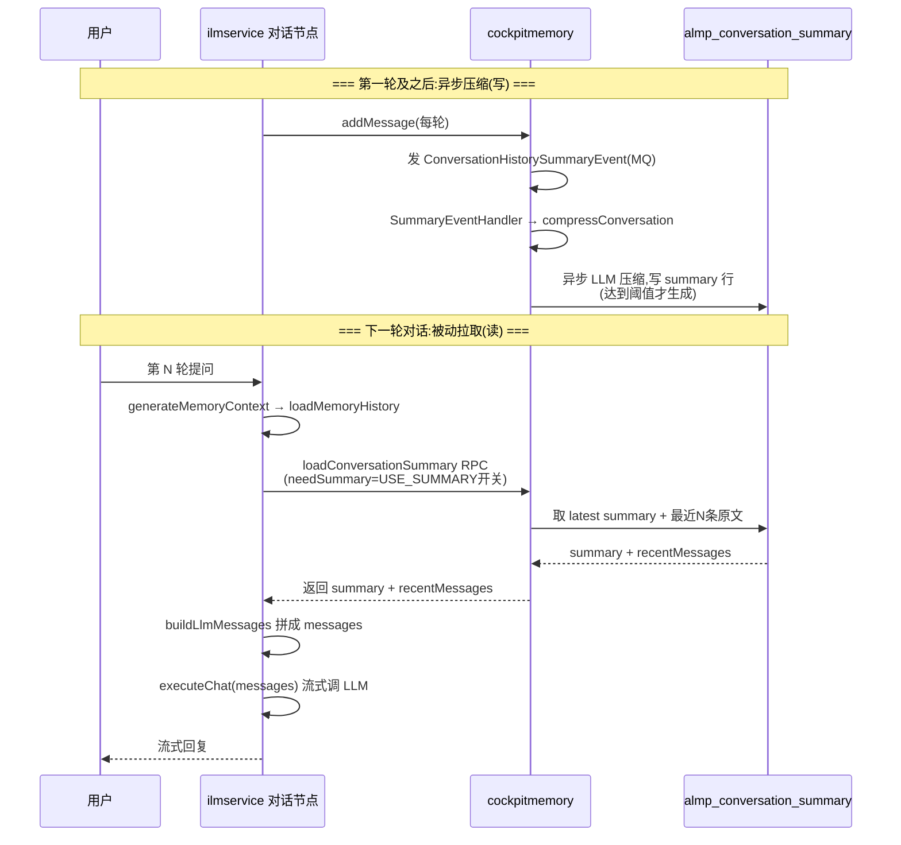
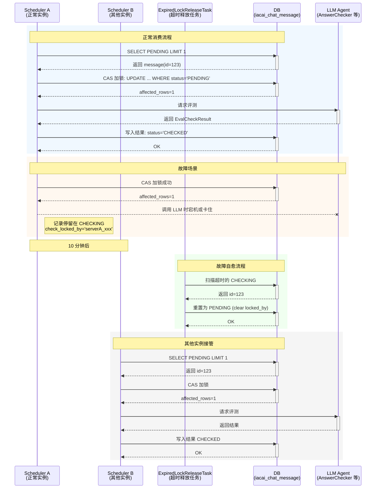

# 一、ALMP

## 阿里Agent开发岗暑期实习面经（挂）

岗位：Agent开发
面试时间：8月2号
已经GG了
一面整体聊得比较久，感觉这一轮主要还是围绕项目展开，项目深挖占了比较大比例。除了基础概念，面试官会结合场景继续追问实现细节
记录一下面试问题：

1. 介绍一下自己的项目，整体架构和技术栈是什么？
   两个项目

- 大模型平台项目, 主要以 Workflow 为主的单 agent 模型
- 另一个以 AgentScope 框架为主的一个 mutiAgent 客服系统
  整体技术栈是 springCloud, mq, rpc, cache, 定时任务

1. 项目中 Agent 的完整流程是怎样的？
   主要就是一个 reAct loop 的过程, 用的是 webFlux 响应式编程 subscribe 处理服务端流式, 再通过 observer (createStreamChatListener) 对象埋点三个方法回调它们数据用 httpServletResponse.getOutputStream 响应给前端

- user_prompt 进来先经历一系列前置处理 (限流, createSession, loadHistoryMsg, createAgent[builder-hook-skill-tool (preReasoningHook), buildSystemPrompt)]
- 进到 loop, 先 planner brain 按照提示词找到最佳的 subAgent 委派任务
- subAgent 再分析任务去 loadSkill/callTool, 如果需要其他 subAgent 协作可以调用 delegateToPlanner Tool 向上委托
- 处理完后 postHook 会强制要求调用 expressToUserTool 去美化答案
- 如果非流式调用则还会经过 reviewAgent

```
不算严重漏洞，你的描述适合口头沟通，但如果面试或文档级别，建议改这几处：

不要说是 WebFlux 处理 HTTP 流式；HTTP 是 Servlet SSE，内部 Agent 管道才是 Reactor。
不要叫 preReasoningHook；那是一组 agentscope Hook。
不要把 reviewAgent 说成所有非流式都走；它只是部分非流式场景，且依赖模板开关。
delegateToPlanner 不是回调 Planner，而是结束 Sub Agent 并把原因带回。
ExpressToUserTool 是白名单制，并非全部 Sub Agent 都有。

ExpressToUserTool 由 Sub Agent 在自己的 ReAct 循环里直接调用，不是 Planner 调用。
Sub Agent 调完 ExpressToUserTool 后返回 "Final Answer: ..." 这个结果，Planner 拿到 ToolResult 后识别到 "Final Answer:" 就知道该结束了。
且在 doExpress 时候就会流式推数据给用户: 把美化后的文本 直接推给用户（agentContext.sendTextOrChunkMsg(...)）；

Sub Agent 自己调 expressToUser 把答案直接写给用户，并返回 "Final Answer: ..." 给 Planner；Planner 识别到这个前缀或自己的 GuardHook 触发后结束循环；默认 Planner 和大多数 Sub Agent 的最大迭代次数都是 10 次。
```

相对准确的整体流程

```
用户请求 /api/chat/send
  │
  ├─ Controller: 黑名单检查
  ├─ 分支：
  │    stream=true  → ChatController.streamChat()
  │                      设 Content-Type=text/event-stream
  │                      创建 StreamChatListener → OutputStream
  │    stream=false → orchestrationService.chat()
  │
  ├─ Orchestration:
  │    流式：限流 → 参数校验 → 登录态 → createAgent → preprocess
  │    非流：createAgent → 推消息 → preprocess → executeWithRetry
  │
  ├─ createAgent:
  │    agentContextManager.init() (session、history)
  │    根据 from/botVariables 决定顶层 Agent (PLANNER / VOICE / SHOMI ...)
  │    AgentFactory 创建 Sub Agents 和 Review Agent
  │
  └─ AgentBase.init()（第一次 chat 时懒加载）
       ├─ load history
       ├─ buildSystemPrompt
       ├─ createToolkit / bindTool
       ├─ createSkillBox (loadSkill)
       └─ 注册 hooks

PlannerBrain (ReAct Loop)
  │
  ├─ 调用 AgentTools 中某个 Sub Agent 的 Tool
  │     → AgentTools.streamChatForLocal()
  │     → targetAgent.chatAsTool()
  │     → AgentBase.streamChat() / nonStreamChat()
  │           → agentInstance.stream(userMsg)  (Flux<Event>)
  │           → 事件经 context.push() 触发 listener
  │
  ├─ Sub Agent 内部调用 Skill / Tool
  │     必要时 delegateToPlanner → 结束本循环，返回给 Planner
  │
  ├─ 白名单 Agent 结束前需调用 ExpressToUserTool 美化
  │
  └─ Sub Agent 返回结果给 Planner → Planner 继续下一次思考

结束
  ├─ 流式：listener 写 END 事件后关闭 OutputStream
  ├─ 非流：collectList().block() 得到 ChatResponse
  │         （isupportLinks 场景如配置了 review 模板，再跑 AnswerReviewAgent）
  └─ PostProcess
```

1. 项目过程中针对 Agent 做过哪些优化？具体怎么调优？

- 用户主动刷新/停止会话 sse 流会停止 (IOException), 但是agent reasoning内部管道的 WebFlux 流不会停止 (这个好像没有解, 但是我想到一个解法是 observer 对象加一个默认方法, 下游 reasoning 阶段实现该方式写入中断逻辑)
- 长期记忆的写入以前通过 autoDream 每天晚上 11 点写, 先拉该用户的记忆再 merge, 只会有一条记忆. 现在换成加状态机每次聊天埋点状态位, 然后定时任务换成扫 7 天内的记忆, 也是合并 merge 写
- 指定工具和大 assistant 回答卸载到 map<uuid, content>, 再实现工具传入 uuid 可以再装载回来

1. Agent 优化有哪些常见手段？
   意图/回答引导加知识库召回充当 few-shot
   skill/tool 提示词+逻辑
   记忆, 上下文窗口管理
   SFT 微调训练

reviewAgent 重反思, 不过只针对 nonStream 场景
打标环节, 对于 badcase 修复
评测流程推测: 定时跑从 db 里捞每天的评测集(重点看转人工的工单 session), 针对不同的评测指标 (正确性, 拟人性, 语言一致性) 分别增加对应 llm 来评测, 将 llm 打标结果存 DB 后交由人工二次 check
-->
项目通过多个 Scheduler (ChatMessageCheck, TicketCheck, ChargeBack) 高频（30s 级）从 DB 捞取 PENDING 的在线消息/工单/ 拒付记录，利用 LLM Agent 对回复做多维度自动评估（正确性、拟人性、语言一致性、plan 路由/指令、专家等级、信息泄露等），把打标结果和原始 LLM 输出落库，最终由人工在 Eval Center 里二次复核修正。
部分对。同样的 AnswerCheckerAgent 一个 LLM 调用就输出 5 个维度的布尔值（正确性、拟人性、语言一致性、plan-agent、plan-instruction），不是每个指标一个独立 LLM。但泄露检测、专家等级 (智能客服质量评估专家, 每个 agent 有自己的 skill 提示词, 评估作为专家助手在对应领域的专业水平)、BadCase 根因分析确实有各自独立的 Agent
主业务：每 30 秒抢 1 条 PENDING 消息做 LLM 评测
故障自愈：每 10 分钟扫一次，释放超时的 CHECKING 锁

PENDING → PROCESSING → SUCCESS / FAILED / SKIPPED
<--

1. 基于项目设计一个场景，如果遇到类似问题应该怎么解决？
2. 语义检索是如何实现的？
   embedding 向量数据库的能力, 这个涉及到 cos 计算余弦相似度距离, 想想一个多维的空间例如 4096 维度, 用户输入转成其中的一个坐标, 然后看已有的坐标谁离的最近, 打分返回
3. 向量数据库在项目中具体承担什么作用？
   垂直领域专业知识检索
   或者充当提示词的 few-shot 引导 llm 正确返回
4. agentScope 为什么选择？底层流程了解吗？
   项目最终形态是多 agent 协作 + 需要统一 harness
   底层就是一个 react 的 loop, 基于这个 loop 多一些 hook. 其中统一的 msg 通讯
5. 模型输出结果如何控制规则？
   llm 参数:
   temperature 0.3
   topP 1.0
   maxTokens 8196
   contextMaxTokens 32000

每个 agent 的 systemPrompt 都通过 pebble template 渲染 twig 语法的方式动态注入插槽的提示词
而每个领域的 skill 则是通过 agentScope 的三层渐进式披露暴露, 1.首先是 subAgent 是 systemPrompt 框架会在最后注入 available_skill 暴露name+description 2.确定要调用后通过 load_skill_through_path 加载该 skill 3.skill里面如果提到了 references/script 则框架内部会通过 classLoader 进行加载

所有对用户的输出都会走 expressToUserTool 这里面列了所有规则, 一份共性的+n份agent特有的組合成一个 systemPrompt, 然后按 chunk 块 sse 给用户

1. 记忆模块是怎么设计的？
   短期记忆:
   slidingWindow 基于不同的 agent 作轮次截断 (user+assistant / tool_calls+tool_result 算一轮)
   如果指定的 tool (searchKnowledge, webFetch) 的 tool_result 结果过大则卸载结果到一个 map 数组 (uuid,content), 后续有需求再通过工具加载回来
   如果单条 msg 落库时候大于 65535 则采用 token 截断再落库

上下文隔离:
Planner（Brain Agent）用自己独立的 sessionId，每一个 Sub Agent 的持久化键都是 ${sessionId}_${AgentId}，彼此物理隔离。
planner 由于把 subAgent 充当工具, 所以上下文只 system+tool_calls+tool_result+assistant. 不会有 subAgent 内部的所有轮次对话记忆
每个 subAgent 有自己的独立记忆, 头部冗余两个 system msg 注入 历史对话+compressMemory, long-term memory

长期记忆:
planner 通过 rag 注入 few-shot 进行路由
subAgent 通过 hook 在开头注入两份 system 消息 (long-term memory + compress memory)

本项目记忆模块分为三大层：短期记忆（SlidingWindow）、上下文隔离（Planner/SubAgent）、长期记忆（Long-term + Compress）。

```
用户请求
   ↓
AgentBase / HarnessAgentAdapter.init()
   ↓  每个 Agent 有自己的 sessionId（SubAgent 带 _AgentId 后缀）
创建/恢复 SlidingWindowMemory / Harness Memory
   ↓
PreCallEvent
   ├─ AsyncPreCompressionHook: offloadAssistantMessages + truncateToMaxRounds
   └─ ContextTruncationHook: token 超限循环截断
   ↓
PreReasoningEvent
   ├─ AsyncContextOffloadHook: 大 tool_result 卸载到 uuid map
   ├─ GlobalHistorySummaryHook: SubAgent 注入全局历史摘要
   └─ HarnessLongTermMemoryMiddleware: 注入长期记忆（Harness 路径）
   ↓
LLM 推理 / 工具调用
   ↓
Planner 如需路由 → 调用 recallPlan / recallExperience 做 RAG few-shot
   ↓
Planner 如需 SubAgent → AgentTools 调用 SubAgent.chatAsTool()
   ↓ SubAgent 内部独立走完自己的记忆流，结果回传为 tool_result
PostCall / onComplete
   ├─ updateOriginalMemory
   ├─ truncateWorkingMemoryIfNeeded（单条超长截断）
   └─ saveTo session / state store
```

ContextTruncationHook 是用的 io.agentscope.core.memory.autocontext.TokenCounterUtil 工具计算的 token
然后 model 最大 context 优先取配置传的, 如果没传就默认 32k

1. 多轮、多会话场景下 memory 如何处理？
   首先是写记忆: 1.有写记忆的工具给 llm 自主决策, 2.然后有长期记忆的定时任务晚上 3 点执行写用户的偏好/个人信息等记忆
   再就是消费读记忆: 1.subAgent msgs 会注入长期记忆
2. 如果系统出现异常，整体的容错和异常处理机制怎么设计？

- tool 层通过统一的 ToolsTemplate 做了集中式的异常处理和兜底日志
- 每个异常位置加日志

1. 再给一个上下文处理相关的场景题，如何优化 context 管理？
2. 手撕算法：
   Greedy（贪心相关）

作者：找工小困兽
链接：https://www.nowcoder.com/feed/main/detail/3181217280144ee0ab47fe979dc28ff1?sourceSSR=search
来源：牛客网


> 评测定时任务单机 schedule 怎么保证并发, 乐观锁 CAS 在哪
> 数据库行级 CAS

> 直接 update 吗, 不需要 select for update 一下吗 ?
> 另外为什么不需要分布式锁来锁这条 msg ?

不用 select for update，直接 update 就够。问题的核心在于：这条 update 不是普通更新，而是带条件的 CAS（Compare-And-Swap）操作，数据库层面天然原子。
“只有当这条消息仍然是 PENDING 且没被锁时，才把它改成 CHECKING 并标记为我持有。”

为什么不需要分布式锁来锁这条 msg？
不需要，原因同样是：check_status + check_locked_by 的 CAS 更新本身就起到了“分布式锁”的作用。

那代码里的 AtomicBoolean 是干什么用的？
```
private static final AtomicBoolean running = new AtomicBoolean(false);

if (!running.compareAndSet(false, true)) {
    return;  // 本机上一轮还在跑，跳过
}
```
这只是本机 JVM 级别的保护，防止同一台机器上轮任务还没执行完，下一轮 30 秒调度又触发。它不能跨机器，跨机器的竞争还是靠数据库 CAS 解决。


过期锁怎么释放？
定时任务会扫, 10 min 周期
```
update iacai_chat_message
set check_locked_by = null,
    check_status = 'PENDING'
where check_locked_by is not null
  and check_status = 'CHECKING'
  and gmt_modified < date_sub(now(), interval 10 minute)
```

> ibotservice db id 怎么处理的
> 学一手 美团Leaf号段模式, 简单理解借助中间表递增的id表中拿一段id [0-2000] 放到内存去消费, 用完再拿...

> graph memory

| 维度              | Fact Memory                           | Graph Memory                                                 |
| ----------------- | ------------------------------------- | ------------------------------------------------------------ |
| **内容形态**      | 自然语言事实（如“用户喜欢黄焖鸡”）    | 实体-关系-实体三元组（如“用户 -> 喜欢 -> 黄焖鸡”）           |
| **分类方式**      | 按预定义 Topic（USER_PREFERENCES 等） | 由 iKnowledge 自动抽取实体类型                               |
| **存储层**        | iKnowledge 向量库                     | iKnowledge Graph RAG                                         |
| **写入方式**      | LLM 同步抽取 → 本地合并               | 发送原始文本 → iKnowledge 异步建图                           |
| **合并/更新机制** | 本地 LLM 决策 ADD/UPDATE/DELETE       | 由 iKnowledge 的 `conflictPromptTemplateId` 后台处理         |
| **召回方式**      | 向量语义相似度 + rerank               | 向量搜实体 + 图遍历                                          |
| **落地程度**      | 完整闭环，有变更记录                  | 已接入但依赖下游图能力成熟度                                 |
| **配置项**        | `enableFactMemory` 等                 | `enableGraphMemory`（设计里默认 false，待图知识库建设好再开） |


一句话：Fact 是“句子级记忆”，Graph 是“关系级记忆”；两者可以从同一段对话里并行产出，但召回后还没有做深度融合（mergedMemoryList 是预留字段）。


> (chunk & embedding) & (recall & rerank) (maximum recalls & minimum matching degree & qq/qa search)

## 模型区别
这里有四个概念, 其中涉及三种不同类型的模型

知识库录入时的 embedding model 和 recall 用的是同一个模型，不是另一个独立模型. 
当然 embedding 的时候可以多个, 即维护多个向量, 然后检索的时候只能选一个向量检索

recall & rerank 是不同的模型
三种模型角色的关系

| 阶段                  | 模型类型                    | 服务 ID 配置位置                                | 说明                                 |
| --------------------- | --------------------------- | ----------------------------------------------- | ------------------------------------ |
| **录入（embedding）** | bi-encoder / embedding 模型 | iknowledge 平台知识库配置                       | 把文档切片变成向量                   |
| **Recall**            | 同上的 embedding 模型       | 客户端不设置，服务端按知识库默认模型选          | 把 query 变成向量，和 doc 向量匹配   |
| **Rerank**            | cross-encoder               | 客户端 `ibotservice.sdk.rerankServiceId=877450` | 输入 (query, doc) 对，输出相关性分数 |

## chunk 做法
有一篇: `提升Rag大海捞针的能力`
官网文档（ANTOM_OFFICIAL_DOC）这一路的索引里，是同时存了“完整章节”和“切片”两套的
做法是: 拆细为了检索, 得到真正的答案后再按 meta 信息找到完整的 chapter 给后续 rerank 阶段

## 完整流程
Recall 出候选 + 补全上下文；Rerank 只打分不决策；
能不能透出、透出几条、按什么顺序，全是 BaseKnowledgeSearchTools 里的 Java 代码按 0.15 阈值和 Top10 截断决定的。


> 工作流透出给用户的 message / end 真假流式
> 只要 LLM 节点的直接下游是 MESSAGE/END，且满足 STREAM_ENABLE 就是真流式
> llm -> message ✅ 真流式
> llm -> end ✅ 真流式
> llm -> template -> end ❌ 非流式
> llm -> code -> end ❌ 非流式

> ilmservice BFS 图执行流程是怎么样的
```
用户问一句话：

1. **Facade 接进来**  
   收到 RPC 请求，查工作流图配置（start、llm、end 这些节点和边）。

2. **打包上下文**  
   把用户问题、历史消息、会话信息、debug 开关、流式 listener 装进 `AlmpFlowContext`。

3. **丢进线程池执行**  
   整个图执行提交到 `almpGraphExecutor`，RPC 线程不阻塞。

4. **BFS 开始排队**  
   引擎从 start 节点出发，把待执行节点放进一个优先级队列。

5. **一个个出队执行**  
   - 从队列取节点；
   - 路由到对应执行器（LLM 调模型、CODE 执行代码）；
   - 每个节点统一走：`before` → `execute` → `after`；
   - `after` 收集 debug 信息。

6. **唤醒下游节点**  
   当前节点跑完且成功后，检查它连出去的边条件，满足就把下游节点加入队列。

7. **循环直到队列为空**  
   所有节点都执行完，发布 `FlowCompleteEvent`。

8. **写 DB**  
   监听器收到完成事件，把各节点 trace 异步批量写入 `almp_session_tracer_info`。

9. **流式推给客户端（如果是流式）**  
   LLM 产生的 chunk 通过 End/Message 节点渲染后，实时推送给客户端 observer。

**一句话版本：**  
从 start 开始 → 维护一个执行队列 → 每个节点跑完前检查条件唤醒下游入队 → 直到没节点可跑 → 写 trace → 完。
```

## 一句话定位

> **SOFAServerless 是蚂蚁开源的一套"应用模块化 / 合并部署"框架，把"基座"和"业务模块"解耦，让一个 JVM 进程能动态装载多个业务模块，模块可独立开发、独立发布、按需扩缩，从而拿到接近 Serverless 的研发体验。**

## 它要解决什么问题（这是面试的重点，讲清痛点比讲实现更重要）

传统两种模式各有代价：

- **单体应用**：所有业务堆在一个应用里 → 改一行代码全量发布、依赖互相冲突、发布互相阻塞、一个业务拖垮全局。
- **微服务**：拆得越细，机器/运维成本越高，跨服务 RPC 联调、链路治理、数据一致性都变复杂。

SOFAServerless 取中间路线：**共用一个基座进程承载中间件与运维能力，业务以"模块"形式热插拔进来**。

- 相比单体：模块独立发布、依赖隔离、互不阻塞。
- 相比微服务：模块不单独占机器，省资源；模块间调用走 JVM 内通信而非网络，延迟低、联调简单。

## 核心概念与关键技术

| 概念 | 作用 |
|---|---|
| **基座（Base / Basement）** | JVM 主进程，承载中间件、公共能力、监控运维；通常就是 Master Biz，最先启动、常驻。 |
| **模块（Biz / Ark Biz）** | 一个业务代码包（fat-jar），可被动态安装、卸载、升级；只关心业务逻辑。 |
| **插件（Ark Plugin）** | 把公共依赖（如中间件 client）插件化，供多个模块共享，避免每个模块重复打包。 |
| **SOFAArk** | 底座，提供基于**自定义 ClassLoader 的类隔离 + 合并部署**能力，是整套方案的核心。 |
| **Arklet / 模块治理** | 模块的生命周期管理：安装、卸载、切换、灰度路由、流量按模块分流。 |

**关键技术点（面试可点出来）**：

1. **ClassLoader 隔离**：每个 Biz / Plugin 有独立 ClassLoader，模块间类互相隔离 → 解决依赖版本冲突，这是能让多业务合并部署的前提。
2. **合并部署（hot deploy）**：模块以 fat-jar 形式热装进运行中的基座，不用重启进程；升级 = 卸旧装新，可灰度。
3. **模块间通信**：模块间调用走 JVM 内 RPC（PRPC），保留编程模型上的"像调远程服务一样"，但实际是本地调用。
4. **基座下沉 + 模块瘦身**：中间件、监控、限流等下沉到基座，模块 jar 体积小、启动快，真正做到"业务方只写业务"。

## 面试话术模板

**30 秒版（电梯演讲）：**

> 我用的项目是蚂蚁的 SOFAServerless 模式。简单说就是把中间件、运维这些公共能力下沉成一个常驻的"基座"进程，业务代码打成"模块"动态热部署进去，模块之间靠 ClassLoader 隔离避免依赖冲突，可以独立开发、独立发布、独立灰度。相比单体它解耦了发布和依赖，相比微服务它省机器、联调简单，本质是用"合并部署 + 模块热插拔"拿到 Serverless 的研发体验。

**2 分钟版（被追问时展开）：**

1. 先讲痛点：单体发布互相阻塞、依赖冲突；微服务成本高、治理重。
2. 再讲定位：基座 + 模块，共用进程、独立发布。
3. 关键实现：SOFAArk 的 ClassLoader 隔离让多模块共存；模块热部署实现独立升级；模块间 PRPC 保留微服务编程模型但走 JVM 内调用。
4. 收益：模块瘦身后启动快、发布快、资源省；基座统一升级中间件不用每个业务方跟进。
5. 加分项：可以提一句它的代价——基座变更影响面大、模块与基座 API 版本要兼容、Classloader 隔离偶尔有反射/SPI 类型的坑（说明你真用过，不是背的）


# 二、MutiAgent

好，给你一份适合面试口的"一个问题排查"话术。按"现象 → 定位 → 根因 → 验证 → 解法 → 反思"来讲，细节都是你代码库里的真实情况，可信度高。

## STAR 完整版（约 2-3 分钟口述）

**背景**：我们这个项目是跑在 SOFA Serverless 上的业务模块，模块把自己的业务代码打成 Biz 动态合并部署到基座进程里，模块可以独立热发布、重启。缓存这块我用了基座公共组件 overseacommon 提供的 CacheService，对应实现是 CacheManagerImpl，序列化默认走 Hessian。

**现象**：线上偶发 ClassCastException，特点是"模块多次热重启之后才出现"，而且重启后用一段时间又会复现。报错信息很诡异——两个类名完全一样，class com.xxx.Foo cannot be cast to class com.xxx.Foo。

**定位过程**：

1. 第一反应是怀疑缓存里串了数据，但异常 message 里两个同名类、loader hash 不同，这立刻指向"ClassLoader 隔离导致同名不同类"，是 SOFA Serverless 合并部署的典型症状。
2. 顺着调用链追：业务 AntomCacheServiceImpl#getCacheResult 调用 cacheService.get(cacheName, key, type)，拿 Object 后 return (T) result。进到基座 CacheManagerImpl，反序列化走的是 SerializerFactory.getSerializer(...).deserialize(bytes, type)。
3. 关键发现：SerializerFactory 是个**静态单例 Map**，预先 new HessianSerializer()；而 HessianSerializer 内部又持有一个**静态的** com.caucho.hessian.io.SerializerFactory 单例（static 块里 new 出来，常驻基座 ClassLoader）。
4. 更关键：HessianSerializer.deserialize 里写的是 in.readObject()，**完全忽略了调用方传入的** clazz，反序列化出来的对象类型由 Hessian 流里的类全名 + 那个静态工厂的 ClassLoader 决定。

**根因**：

- 静态 SerializerFactory 在基座 ClassLoader 下创建一次、按类名缓存 deserializer，并绑定加载它的基座 ClassLoader。
- 我的缓存 DTO 是模块工程自带的，模块 ClassLoader 也定义了一份同名类。
- 模块 v1 首次反序列化某类型时，静态工厂把 deserializer 缓存了下来（持有 v1 loader 的 Class 引用）；模块重启用新 loader 装载 v2 后，命中同名缓存 → 反序列化出来的是**旧 v1 loader 的对象**，(T) 强转成 v2 loader 的同名类 → 两个 Class 对象不等 → ClassCastException。
- 副作用：v1 的 ModuleClassLoader 被静态缓存里的 Class 引用强持有，卸载不掉，造成 ClassLoader 泄漏。这也解释了"多次重启后才出现"——缓存里混进了多份不同 loader 的版本，命中旧条目就炸。

**验证**：

- 看异常 message：两个类全名相同、ClassLoader hash 不同，实锤 ClassLoader 隔离问题。
- 对比 JsonSerializer：它走 JSONSerializableUtil.deserializeEmptyToNull(str, clazz)，**显式用调用方传入的 clazz**，对象类型就是模块版本，cast 一定成功。这个差异把锅锁死在 Hessian 静态单例，而不是别的。
- 进一步可以 jmap 抓 heap dump，看 HessianSerializer.SERIALIZERFACTORY 的 deserializer 缓存里持有的 Class，getClassLoader() 指向的是否是已卸载的旧 ModuleClassLoader。

**解法**：

- 短期我用 ZCacheClient（走 tair）替换了这条缓存路径：一是绕开了基座 Hessian 静态单例这条链路；二是直接存 String/JSON 字符串，tair 不做按类名的对象反序列化，getObject 回来还是 String，业务侧自己 parseObject(text, Clazz.class)，用的就是模块传入的 clazz，从根上规避。
- 长期建议两条：(1) 跨模块/缓存共享的 DTO 类型下沉到基座并 export，模块 import 同一个 Class，从根本上消除"同名两份"；(2) 提报公共组件维护方修 HessianSerializer——不要用静态 SerializerFactory 单例，至少反序列化时按 Thread.currentThread().getContextClassLoader() 设置 loader，并把 readObject() 改成真正利用传入的 clazz。

**反思**：这件事让我对"合并部署 / 模块化"的本质有了更具体的理解——它的隔离是 ClassLoader 级别的，一旦公共组件里出现"静态单例 + 按类名缓存 + 绑定固定 ClassLoader"这种结构，就会和模块热重启互相冲突。通用原则：**基座静态容器不能持有模块 ClassLoader 加载的对象/Class 引用；反序列化这种动态类型解析必须用调用方 ClassLoader（TCCL 或传入的 clazz），不能绑定基座 loader**。

## 精简版（30-60 秒，被让"简单说一个你排查过的线上问题"时用）

> SOFA Serverless 模块多次热重启后偶发 ClassCastException，message 里两个同名类、ClassLoader 不同。追到基座公共缓存组件 overseacommon 的 HessianSerializer 用了一个静态 Hessian SerializerFactory 单例，按类名缓存 deserializer、绑定基座 ClassLoader，反序列化时还忽略调用方传入的 clazz。我的缓存 DTO 是模块自带的，模块重启换 ClassLoader 后，命中静态缓存里旧 loader 的 deserializer，返回旧 loader 的对象，cast 到新 loader 的同名类失败 → CCE，还顺带造成旧 ModuleClassLoader 泄漏。我用走 tair 的 ZCacheClient 改成存 String/JSON 字符串绕开，根治要把 DTO 下沉基座 or 修掉那个静态单例。核心经验是：合并部署下基座静态容器不能持有模块对象，反序列化类型解析必须用调用方 ClassLoader。

## 面试时几个容易被追问的点（提前想好）

- **"为什么不直接改 HessianSerializer？"** → 它在公共组件 jar 里，跨多个业务方使用，改它影响面大，要走中间件维护方流程；短期先用 ZCacheClient 存 String 规避是性价比最高的。
- **"DTO 下沉基座会不会有代价？"** → 会，DTO 变更要看是不是基座发布、和模块的版本兼容性要管理；但缓存这种"跨重启、跨模块共享"的场景，类型放基座本就更合理。
- **"你怎么确认是 Hessian 而不是 JSON？"** → 那个缓存的 serializerType=HESSIAN，且 JsonSerializer 显式用传入 clazz、不会复现，对照即可锁定。
- **"ClassLoader 泄漏怎么观察？"** → heap dump 里同名 ModuleClassLoader 实例有多个不回收，GC root 指向 caucho.hessian.io.SerializerFactory 的静态字段。

------

要不要我帮你把这段整理成简历上一条 bullet（"项目难点 / 排查过的线上问题"那种一行话），或者拟一份给 overseacommon 维护方的 issue 文案 + 修复 diff 建议？


**问题**：SOFA Serverless 模块多次热重启后偶发 ClassCastException。 **决策**：优先按调用链追根因，再用低风险的替代方案规避，根治留作公共组件优化。 **行动**：追到基座 overseacommon 的 HessianSerializer 静态 SerializerFactory 单例按类名缓存 deserializer、绑定基座 ClassLoader、反序列化忽略传入 clazz；改用 ZCacheClient(tair) 存 String/JSON 字符串绕开该链路。 **结果**：CCE 不再复现。 **反思**：合并部署下基座静态容器不能持有模块 ClassLoader 加载的对象，反序列化类型解析必须用调用方 ClassLoader（TCCL/传入 clazz）。

# 什么是三板斧

可灰度、可监控、可应急。

- 可监控：线上变更后，需监控观察变更影响业务的线上运行情况。
- 可灰度：原则上所有变更上线前都需要经过一个按批次逐步上线的验证过程。
- 可应急：所有变更上线前都应具备可随时操作的应急预案（回滚、切流等）。

# 如何应急？应急的流程？

流程：发现阶段->响应阶段->处理阶段->回顾阶段。

发现阶段：通过监控平台或人工发现不符合业务预期的现象。

响应阶段：负责的相关人员知悉异常并着手处理。

处理阶段：负责的相关人员进行止血/影响消除操作至异常恢复。

回顾阶段：对事件发生到处理的全过程回顾总结，对不足进行改进。	

## cockpitmemory
```plantUml
@startuml
' ===== 全局样式 =====


title <b>Compact Memory & Summary Memory 处理流程</b>
' ===== 参与者分组 =====
box "调用方" #E3F2FD
    participant caller
end box

box "服务层" #E8F5E9
    participant service as ser
end box

box "基础设施" #FFFDE7
    database db
    queue mq
end box

box "消费者" #FCE4EC
    participant factExtractConsumer as consumer
    participant summaryConsumer as sum
    participant timer
end box

box "外部依赖" #F3E5F5
    participant iknowledge as know
    participant ilmmodel as llm
end box

' ===== Phase 1: 消息写入 =====
== 写入当前轮次 & 发出记忆事件 ==

caller -> ser : rpc: addMessage\nassistantMsg / userMsg / u&a
note left
调用角色是 ilmservice:
Memory 编排节点: user+ai / ai
LLM 节点: user+ai
end note

activate ser #BBDEFB
ser -> db : batchInsert() 塞入当前轮次 Msg
note right
<color:red>almp_memory_record</color>
end note
activate db #FFF59D
db --> ser
deactivate db

ser -> mq : 根据开关发送两个 mq
note right #FFF9C4
两个记忆操作对应两个：
- ConversationHistorySummaryEvent
- MemoryGenerateEvent

消息体中额外写入 _eventType 字段（事件类全限定名），
供消费端反序列化为具体实现类。
end note
activate mq #C8E6C9
mq --> ser
deactivate mq

ser --> caller : return Result
deactivate ser

' ===== Phase 2: 并行消费 =====
== 并行：Fact 提取 / 兜底压缩 / Summary 压缩 ==

par 抽取记忆的 MQ Consumer

    loop MQ-MemoryGenerateEventHandler
        consumer -> mq : 拉取 MemoryGenerateEvent
        activate consumer #F8BBD0
        activate mq #C8E6C9

        consumer -> db : 更新 almp_session_memory_finish_record 表\nsession 时间和状态 running 保活
        activate db #FFF59D
        db --> consumer
        deactivate db

        consumer -> consumer : 判断是否达到配置的抽取阈值

        loop 调用 LLM 提取 Fact 记忆（带上下文超限重试）
            consumer -> llm : 将 historyMsg 拿去抽取记忆
            activate llm #E1BEE7
            llm --> consumer
            deactivate llm
        end

        note over consumer, llm #FFCCBC
        <color:red>两次 LLM 调用产生 Fact 记忆</color>
        1. extra：从 historyMsg 中抽取候选 fact
        2. merger：候选 fact 与已有记忆合并得到最终变更集
        end note

        consumer -> know : 将 llm 抽取到的记忆 list\n批量去召回看记忆库有没有
        activate know #E1BEE7
        know --> consumer
        deactivate know

        consumer -> llm : newFactMemories, historyMemories 过模型\n得到真正需要的变更集
        note right #FFCCBC
        <color:red>merger 操作</color>
        end note
        activate llm #E1BEE7
        llm --> consumer
        deactivate llm

        consumer -> know : 针对变更集执行 add, update, delete\n真正的记忆变更
        activate know #E1BEE7
        know --> consumer
        deactivate know

        consumer -> db : CAS 更新 almp_session_memory_finish_record 轮次水位
        activate db #FFF59D
        db --> consumer
        deactivate db

        deactivate mq
        deactivate consumer
    end

also 定时任务消费不活跃 session 当长期记忆（10 min）

    loop 定时任务-不活跃 session 兜底
        timer -> db : 扫描长期不活跃的 session
        activate timer #F8BBD0
        activate db #FFF59D
        db --> timer
        deactivate db

        timer -> timer : 继续 mq 那一套逻辑处理
        deactivate timer
    end

also 记忆压缩的 MQ Consumer

    loop MQ-ConversationHistorySummaryEventHandler
        sum -> mq : 拉取 ConversationHistorySummaryEvent
        activate sum #F8BBD0
        activate mq #C8E6C9

        sum -> sum : 逻辑同生成差不多\n判断阈值, 调用 llm, 落库
        note right #FFF9C4
        <color:red>不主动推送</color>，下一轮对话时被动拉取
        end note

        deactivate mq
        deactivate sum
    end

end

@enduml
```


## summary 具体用法


# 问题集

## vector DB

> rerank是干什么用的
> Recall 负责“找得全”，Rerank 负责“找得准”。

> 是qq召回还是qa召回
> 都有, GeneralQA 是qq, OfficialKnowledge qq qa都有

> 是keyword召回还是vector召回
> 以 Vector 为主，Keyword（ES）为辅。

> 召回的问题是用户原始问题, 还是经过了改写后的问题, 还是说调用该工具时候会重构问题成关键字
> 工具的描述是: 需要查询的内容，可以是问题、关键词等，使用英文查询效果更好 所以一般调用该工具实际传递的会是改写后的英文

遗漏点 (可能也是华点):

> 精排后章节补全：把零散的“片段”拼回完整的“章节”，避免回答断章取义。

```
// 1. 发现不完整切片
//    标签：antom_copilot_id=2.3, antom_copilot_full=N

// 2. 提取顶层章节号
String chapter = "2";   // 从 2.3 取出来的

// 3. 重新召回
List<Label> labels = [
    {key="antom_copilot_id", value="2"},
    {key="antom_copilot_full", value="Y"}
];

knowledgeRecallTools.recallKnowledgeRaw(
    request.title(),   // ← query 用的是不完整切片的 title
    10,
    0.0,
    Collections.singletonList(ANTOM_OFFICIAL_DOC),
    labels,
    IndexType.ES,
    RecallMode.FEATURE_ONLY,
    agentContext
);
```

召回期补全：用 antom_copilot_id + full=Y 召回“完整章节切片”来替换片段。
精排后补全：用 antom_copilot_chapter 召回“同一大章节下的所有小节”，再拼成完整 Markdown 章节。

> 既然结果是为了拿完整章节, 那么为什么最小 chunk 单位不就只到章节就好, 为什么还要切片多此一举让这里多一些逻辑操作又再去检索
> 这是个很好的问题。表面上确实“多此一举”，但这其实是 RAG 系统里很常见的一个 trade-off： 检索时要“细粒度”，回答时要“完整上下文”。

## Cockpitmemory

> 记忆生成的状态机
> RUNNING  →  GENERATING  →  FINISH   （生成成功）
> RUNNING  →  GENERATING  →  RUNNING  （生成失败，重试次数 +1）
> RUNNING  →  GENERATING  →  FAILED   （重试次数超过 MAX_RETRY_COUNT，一般为 3 次）

> 定时任务扫表解决 session 尾部, 是如何定位到尾部的具体位置的

## antomcopilotai

> 心跳任务怎么运行的
> java.util.concurrent.ScheduledExecutorService#scheduleAtFixedRate 默认 20 s 执行一次周期性, isupportLinks工单场景使用

> !!既然有了 sessionManager 管理 session 消息, 为什么还要有 SlidingWindowMemory
> 用户会话级, Agent 运行时级. 一个会持久化(session表), 一个内存临时的记忆(也会存, session级别的subAgent会重现消费).  subAgent 可以理解为临时工 worker, planner 只关注结果, 中间过程忽略
> subAgent 的 sessionId 是 sessionId_agentId, 落到内存变量中

> subAgent delegate到另外的 subAgent 记忆怎么处理
> 真正的工具是 delegateToPlanner(reason), 不会共享

> subAgent 记忆怎么存的
> working/offloaded/original 三份数据, 优先存前两个就行, 后一个也存但是不怎么用
> working-Msg: 是卸载过指定tool的大 tool_result 结果后的 msgs
> offloaded-Map(uid:content): 是卸载的内容在这
> 有一个工具可以传 uid 加载完整的 content
> original: 没卸载的完整的, 用于审计啥的

> 范式后的 review 这一步会做吗
> 流式场景：用户已经边看边接收了原始 answer，直接返回 expressResult，没有 review 的机会。
> 非流式场景：答案还没发给用户，可以整体拿给 AnswerReviewAgent 重审后再返回。

> antomcopilotai 上下文怎么管理的

PreCallEvent:
AsyncPreCompressionHook(5)      → 滑动窗口截断/ASSISTANT
... 其他 Hook
ContextTruncationHook(999)      → Token 硬截断兜底
PreReasoningEvent:
GlobalHistorySummaryHook(-100)  → 注入全局历史 到 subAgent 充当第二个 role:SYSTEM (只针对 subAgent)
AsyncContextOffloadHook(50)     → 大工具结果卸载, tool_result(只针对特定的 tool, 例如 Rag) 卸载
PostReasoningEvent:
FinalAnswerGuardHook(-70)       → Planner Final Answer 后强停
DelegateFinishHook(-70)         → Sub Agent delegate 后强停
PlannerConsecutiveAgentGuardHook(-55)
PlannerNoToolCallGuardHook(-50)
ExpressToolGuardHook(-40)

> CC 上下文怎么管理的 (vs)
> TODO

> 我记得summary记忆也是塞到了前面, 用 hook 实现的, 这里长期记忆没有用 hook 实现? 而是重写了 onReasoning 吗? 所有 llm 都会有 reasoning 这一步吗 ? 如果没有开 think 呢
> 你的感觉没错：PreReasoningEvent 和 onReasoning 在时机上几乎等价，都是 LLM 调用前的预处理阶段。
> 出现两套只是因为：
> PreReasoningEvent 是 ReActAgent 时代的 Hook 产物；
> onReasoning 是 HarnessAgent 路径下补的 Middleware，主要是为了支持异步 retrieve 和更灵活的 pipeline 控制。
> 在 Harness 路径里，两者共存塞不同的上下文，业务上是冗余的， можно 把它们都统一成 Middleware 或都统一成 Hook。

Reasoning 不是修改用户问题，而是 Agent 基于完整上下文调用 LLM 做决策的过程。
决策结果可能是直接回答，也可能是调用工具；如果需要工具，就进入下一次 reasoning，直到得出最终答案。
Hook/Middleware 只是在 reasoning 前负责“组装上下文”。

一次 reasoning 理解为 Agent 的一次“决策周期”：

```
输入：当前所有上下文（system prompt + history + memory + user msg + 之前的 tool result）
    │
    ▼
调用 LLM
    │
    ▼
LLM 输出：
  ├─ 直接给出最终答案 → agent 结束
  └─ 想调用某个 tool → 框架执行 tool，把结果塞回 messages，进入下一次 reasoning
```

> Harness 核心公式
> 生产级 Agent = 模型潜能 − 模型熵增+Harness 约束

- 大模型本质是"熵增"的：它基于概率生成，输出具有不确定性，输入微小的 Prompt 变化可能导致巨大的行为漂移。
- Harness 本质是"熵减"的：它用确定性的代码逻辑去框住不确定的模型输出。
  熵可以简单理解: 一种混乱程度, 例如耳机线只会

### 问题集+

> 该项目为什么需要Heartbeat Flux
> PlannerAgent 本身不是“直接回答”，而是“编排大脑”
> PlannerAgent.java 继承自 AgentBase，底层是 ReActAgent 的 Reasoning → ToolCall → ToolResult → Reasoning 循环。它的工作方式不是一次性生成答案，而是：

首轮 LLM 推理：分析用户意图，决定调用哪个 Sub Agent。
同步调用 Sub Agent：AgentTools.streamChatForLocal() 里执行 agent.chatAsTool()，阻塞等待 Sub Agent 完整跑完自己的 ReAct 循环。
收到结果后的收尾轮 LLM 推理：把 Sub Agent 返回的 "Final Answer: xxx" 再重新生成一遍作为自己的回答。
光是步骤 1 + 3 就至少有 2 轮 Planner 自身 LLM 调用，中间还卡着一次完整 Sub Agent 推理。

```
用户输入
    ↓
Planner 首轮 LLM 推理 → 决定调用哪个 Sub Agent
    ↓
Planner 阻塞调用 Sub Agent（agent.chatAsTool）
    ↓
Sub Agent 内部跑 ReAct 循环（工具调用、知识库召回等）
    ↓
Sub Agent 最后调用 expressToUser
    ↓
expressToUser 调用轻量模型流式生成答案
    ↓
答案逐 chunk 通过 SSE 推送给用户           ← 这是用户真正“看到答案”的阶段
    ↓
Sub Agent 返回 "Final Answer: xxx" 给 Planner
    ↓
Planner 收到结果后结束（harness 优化后直接 stopAgent）
```

> expressToUser 是怎么输出的, 怎么调用的 llm 并回调 listener 给前端的

> planenr & subAgent 在 React 阶段的 llm 调用是非流式的吗 ? 只有 expressToUser 给用户时候 llm 是流式 ?
> Planner/Sub Agent 的 ReAct LLM 调用确实是按“完整推理轮次”返回消息，而不是 token-by-token 流式；其实也是流式只不过等在那里组装成一个完整的才返回
> 只有 expressToUser 和少数直接调用模型的工具是 chunk 级别推送给用户的。

## 评测任务

正常消费：Scheduler 每 30 秒从 DB 捞一条 PENDING，用 CAS 把状态改成 CHECKING 并加锁，调 LLM 评测，最后把结果写回 CHECKED。
故障场景：如果某台机器抢到锁之后宕机或 hang 在 LLM 调用上，这条记录就会一直卡在 CHECKING，其他 Scheduler 也捞不到。
自愈机制：独立跑一个超时释放定时任务，每 10 分钟扫一次，把超过 10 分钟仍处于 CHECKING 的记录重置为 PENDING，让其他实例重新抢。

