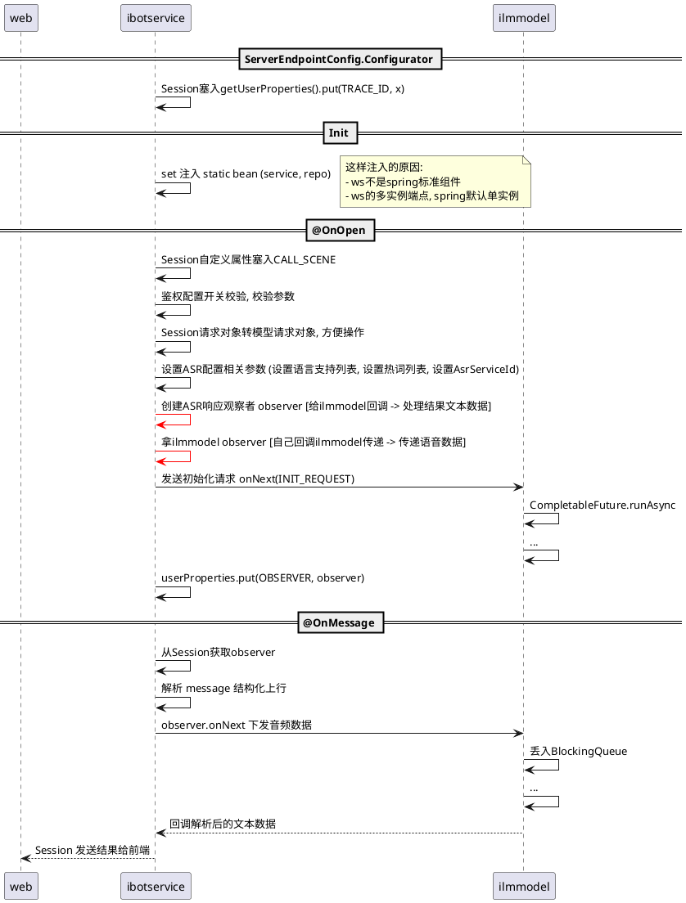

# 250611
Get it
开发小 tips instand of "+"
适合一个参数 String.format("%s items is empty", this.fieldName))```
适合多个参数 MessageFormat.format("{0}{1}",x1,x2)

actuator path
● /beans
● /mappings -> API
● /loggers

转换插件, 比较难搜到   记一下   keywords = convertor
Generate-Convertor


ws 注入
static属性只能 set 注入: https://blog.csdn.net/myli92/article/details/124183788
@Autowired：这是Spring的注解，用于自动注入依赖。但是由于WebSocketServer类的实例化不是由Spring控制的，因此不能直接在类的字段上使用@Autowired进行自动注入。

final
final 关键字在 Java 中确实意味着该变量的引用（对于对象类型的变量）不能再被改变。但是需要明确的是，final 关键字的作用是针对对象引用，而不是针对对象内部的内容。

```
final ArrayList<String> list = new ArrayList<>();
list.add("Hello");  // 允许：这是在修改对象的内部状态
list = new ArrayList<>(); // 不允许：试图改变 list 的引用
```


# 索引
> 搭配食用更香
>
> [https://javaguide.cn/database/mysql/mysql-query-execution-plan.html#possible-keys](https://javaguide.cn/database/mysql/mysql-query-execution-plan.html#possible-keys)
>


+ zdal 分表键是否必传
+ 帝隐, 事务传递事务里套事务的必要性

<font style="color:#DF2A3F;background-color:#FBDE28;"></font>

<font style="color:#DF2A3F;background-color:#FBDE28;"></font>

<font style="color:#DF2A3F;background-color:#FBDE28;"></font>

<font style="color:#DF2A3F;background-color:#FBDE28;"></font>

<font style="color:#DF2A3F;background-color:#FBDE28;"></font>

---


<font style="color:#DF2A3F;background-color:#FBDE28;">lock user 作用</font>

<font style="color:#DF2A3F;background-color:#FBDE28;"></font>

questionMessage for update  

想象相当于

synchronized (this)   一把锁就行了横向

<font style="color:#DF2A3F;background-color:#FBDE28;"></font>

<font style="color:#DF2A3F;background-color:#FBDE28;"></font>

只针对

<font style="color:#DF2A3F;background-color:#FBDE28;"></font>

<font style="color:#DF2A3F;background-color:#FBDE28;"></font>

<font style="color:#DF2A3F;background-color:#FBDE28;">---------  chushi CR</font>

+ 用id lock,   sql lock不用id lock会锁表吗
    - id 不管用什么方法漏出来
    - 锁问题,  改答案
+ stopSession  是否可以复用


+ <font style="background-color:#FBDE28;">锁问题还是答案 ?   </font>


+ **<font style="color:#DF2A3F;">分布式锁 + 数据库锁    ---  周末</font>**
    - 唯一区别锁超时时间
    - 数据库锁也有时间


---


order by 会走索引


onNext 必定会查这个cacheFlag, 如果没有就是null

所以提前塞一个false占位还是不塞到时候取 null 好像两者性能方面没关系

我只知道缓存命中率是玖承写的, 具体是平台有这个命中率的监控告警才这么做吗


---


# 记录📝
****

> h2 数据库  schema.sql   	int / bigint ✔️      int(11) **✖️**
>

****


## 泛型擦除问题


> **调用方法里下面这一行有泛型擦除问题！！！**
>

```java
return JSON.parseObject(result, new TypeReference<Result<T>>() {});
```

解法第三个入参直接：`TypeReference<Result<T>> typeReference`

以前：       

```java
public <T> Result<T> callServiceByGet(String url, Map<String, String> params, Class<T> responseType)
```


后补充

1. <font style="color:rgb(51, 51, 51);">编译时的泛型声明：</font>

```java
public class GenericClass<T> {
    private T data;  // 编译时指定为特定类型

    public void setData(T data) {
        this.data = data;
    }

    public T getData() {
        return data;
    }
}
```

<font style="color:rgb(51, 51, 51);"></font>

2. <font style="color:rgb(51, 51, 51);">运行时变成 JSONObject 的原因：</font>

```java
// 编译时
GenericClass<UserDTO> userGeneric = new GenericClass<>();
userGeneric.setData(userDTO);

// 实际运行时
// 由于类型擦除，T 会被替换为 Object
// 如果数据来自 JSON 反序列化，往往会变成 JSONObject
```


1. <font style="color:rgb(51, 51, 51);">解决方案：</font>

```java
// 方案1：明确类型转换
public class GenericClass<T> {
    private T data;
    private Class<T> clazz;  // 存储类型信息

    public GenericClass(Class<T> clazz) {
        this.clazz = clazz;
    }

    public T getData() {
        if (data instanceof JSONObject) {
            // 将 JSONObject 转换为目标类型
            return ((JSONObject)data).toJavaObject(clazz);
        }
        return data;
    }
}

// 使用
GenericClass<UserDTO> generic = new GenericClass<>(UserDTO.class);

// 方案2：使用TypeReference
public class GenericClass<T> {
    private T data;
    private TypeReference<T> typeReference;

    public GenericClass(TypeReference<T> typeReference) {
        this.typeReference = typeReference;
    }

    public T getData() {
        if (data instanceof JSONObject) {
            return JSON.parseObject(
                ((JSONObject)data).toJSONString(), 
                typeReference
            );
        }
        return data;
    }
}

// 使用
GenericClass<UserDTO> generic = new GenericClass<>(
    new TypeReference<UserDTO>(){}
);


// quding就是用了第一种

/**
 * @author quding
 * @since 2022/2/23
 */
public final class DataKey<T> implements ValueKey<T> {

    /**
     * 缓存实例
     */
    private static final ConcurrentMap<String, DataKey<?>> ourDataKeyIndex = new ConcurrentHashMap<>();

    /**
     * 对应的数据名称
     */
    public final String dataId;

    /**
     * 案例信息
     */
    public final String example;
    /**
     * 对应值类型,解决泛型获取不方便问题
     */
    public final Class<T> clazz;

    private DataKey(String dataId, Class<T> clazz) {
        this.dataId = dataId;
        this.clazz = clazz;
        this.example = null;
    }

    private DataKey(String dataId, Class<T> clazz, String example) {
        this.dataId = dataId;
        this.clazz = clazz;
        this.example = example;
    }

    public static <T> DataKey<T> create(String dataId, Class<T> clazz) {
        //noinspection unchecked
        return (DataKey<T>)ourDataKeyIndex.computeIfAbsent(dataId.concat(clazz.getName()), k -> new DataKey<>(dataId, clazz));
    }

    public static <T> DataKey<T> create(String dataId, Class<T> clazz, String example) {
        //noinspection unchecked
        return (DataKey<T>)ourDataKeyIndex.computeIfAbsent(dataId.concat(clazz.getName()), k -> new DataKey<>(dataId, clazz, example));
    }
```

<font style="color:rgb(51, 51, 51);"></font>


解决方案：

1. 保存Class信息
2. 使用TypeReference
3. 显式类型转换
4. 自定义转换逻辑


+ <font style="color:rgb(51, 51, 51);background-color:rgb(249, 250, 255);">是的，枚举类可以使用 == 运算符进行比较。这是因为枚举类型在 Java 中有以下特性：</font>  
<font style="color:rgb(51, 51, 51);background-color:rgb(249, 250, 255);">枚举常量是单例的：每个枚举常量在 JVM 中只有一个实例。</font>
+ <font style="color:rgb(51, 51, 51);">一个select forupdate加一个update语句 这两句需要开事务包裹吗  XD：</font>**<font style="color:rgb(51, 51, 51);">需要</font>**  
`<font style="color:rgb(51, 51, 51);background-color:rgb(249, 250, 255);">SELECT ... FOR UPDATE</font>`<font style="color:rgb(51, 51, 51);background-color:rgb(249, 250, 255);"> 语句会在数据行上加锁，直到当前事务结束（提交或回滚）。如果你没有将它们包裹在一个事务中，锁将只在执行这个 </font>`<font style="color:rgb(51, 51, 51);background-color:rgb(249, 250, 255);">SELECT</font>`<font style="color:rgb(51, 51, 51);background-color:rgb(249, 250, 255);"> 语句的期间有效。可能在 </font>`<font style="color:rgb(51, 51, 51);background-color:rgb(249, 250, 255);">SELECT</font>`<font style="color:rgb(51, 51, 51);background-color:rgb(249, 250, 255);"> 完成后，其他线程或事务就已经可以对同一行进行修改，这使得在没有事务的情况下，它的锁定效果大打折扣。</font>
+ **初石：web层的入参 与 biz层 和领域层 还有vo 可能是一致的 但是也有可能随着迭代会有变化          最标准的写法就是 一层写一个**  
这个可以看防腐层B站那个视频那个图  
B站视频 [https://www.bilibili.com/video/BV1kw411h7tY/?spm_id_from=333.1387.favlist.content.click](https://www.bilibili.com/video/BV1kw411h7tY/?spm_id_from=333.1387.favlist.content.click)  
<font style="color:rgb(0, 0, 0);">ddd很复杂的 我们现在的项目只是用了一点领域的思想</font>
+ 师兄写代码扩展性好
    - <font style="color:rgb(0, 0, 0);">扩展性 - chat需要兼容下游响应, 例如 List 接 get(0)</font>
    - <font style="color:rgb(0, 0, 0);">扩展性 - 写接口不要局限死, 例如修改扩展属性不要单一个入参key可以设计成Map多个入参</font>

<font style="color:rgb(0, 0, 0);"></font>

<font style="color:rgb(0, 0, 0);"></font>

> <font style="color:rgb(0, 0, 0);">间隙锁</font>
>

<font style="color:rgb(51, 51, 51);background-color:rgb(247, 249, 253);">间隙锁（Gap Lock）是MySQL InnoDB存储引擎的一种锁机制</font>

<font style="color:rgb(51, 51, 51);background-color:rgb(247, 249, 253);">在这种情况下，由于事务A对区间 (3, 8) 加了间隙锁，事务B将被阻塞，直到事务A提交或回滚。这就防止了幻读的发生。</font>

```java
---事务A
START TRANSACTION;
SELECT * FROM table WHERE id BETWEEN 3 AND 8 FOR UPDATE;

---事务B
START TRANSACTION;
INSERT INTO table (id) VALUES (6);
```

<font style="color:rgb(0, 0, 0);"></font>

<font style="color:rgb(0, 0, 0);"></font>

<font style="color:rgb(51, 51, 51);background-color:rgb(247, 249, 253);">TODO 事务的传播行为、</font><font style="color:#DF2A3F;background-color:rgb(247, 249, 253);">SQL三级缓存！！！</font>

<font style="color:rgb(0, 0, 0);"></font>

<font style="color:rgb(0, 0, 0);"></font>

> <font style="color:rgb(0, 0, 0);">灰度-监控-应急</font>
>

<font style="color:rgb(0, 0, 0);">灰度：测试账号先去线上测 / 开一个商户或者用户  少量的</font>

<font style="color:rgb(0, 0, 0);">灰度没问题，逐步推全  观察监控</font>

<font style="color:rgb(0, 0, 0);">有问题应急手段 - 开关（暂时不可用了）入口不透出了</font>

<font style="color:rgb(0, 0, 0);"></font>

<font style="color:rgb(0, 0, 0);"></font>

**<font style="color:rgb(0, 0, 0);">思从深行从简</font>**

  


<font style="color:rgb(51, 51, 51);"></font>

> java 10 var 特性
>

<font style="color:rgb(51, 51, 51);">java中以下写法： --- 		var req = new KnowledgeBaseCreateReq(); ---</font>

<font style="color:rgb(51, 51, 51);background-color:rgb(247, 249, 253);">在 Java 中，您提到的这行代码使用了 </font>`<font style="color:rgb(51, 51, 51);background-color:rgb(247, 249, 253);">var</font>`<font style="color:rgb(51, 51, 51);background-color:rgb(247, 249, 253);"> 关键字，这是从 Java 10 开始引入的局部变量类型推断功能。使用 </font>`<font style="color:rgb(51, 51, 51);background-color:rgb(247, 249, 253);">var</font>`<font style="color:rgb(51, 51, 51);background-color:rgb(247, 249, 253);"> 时，Java 编译器会根据右侧的表达式自动推断出变量的类型。在您的示例中，</font>`<font style="color:rgb(51, 51, 51);background-color:rgb(247, 249, 253);">req</font>`<font style="color:rgb(51, 51, 51);background-color:rgb(247, 249, 253);"> 的类型会被推断为 </font>`<font style="color:rgb(51, 51, 51);background-color:rgb(247, 249, 253);">KnowledgeBaseCreateReq</font>`<font style="color:rgb(51, 51, 51);background-color:rgb(247, 249, 253);"> 类型。</font>

<font style="color:rgb(51, 51, 51);background-color:rgb(247, 249, 253);"></font>

<font style="color:rgb(51, 51, 51);background-color:rgb(247, 249, 253);"></font>

> spring 配置文件优先级
>

<font style="color:rgb(51, 51, 51);background-color:rgb(247, 249, 253);">在 </font>`<font style="color:rgb(51, 51, 51);background-color:rgb(247, 249, 253);">--spring.profiles.active=test</font>`<font style="color:rgb(51, 51, 51);background-color:rgb(247, 249, 253);"> 的情况下，加载顺序和生效情况如下：</font>

1. `**<font style="color:rgb(51, 51, 51);background-color:rgb(247, 249, 253);">application-test.properties</font>**`<font style="color:rgb(51, 51, 51);background-color:rgb(247, 249, 253);">（优先级最高）</font>
2. `**<font style="color:rgb(51, 51, 51);background-color:rgb(247, 249, 253);">application.properties</font>**`<font style="color:rgb(51, 51, 51);background-color:rgb(247, 249, 253);">（次之）</font>
3. `**<font style="color:rgb(51, 51, 51);background-color:rgb(247, 249, 253);">application-default.properties</font>**`<font style="color:rgb(51, 51, 51);background-color:rgb(247, 249, 253);">（最后）</font>

<font style="color:rgb(51, 51, 51);background-color:rgb(247, 249, 253);"></font>

<font style="color:rgb(51, 51, 51);background-color:rgb(247, 249, 253);"></font>

> for 和 forEach return效果不一样
>

<font style="color:#DF2A3F;background-color:rgb(249, 250, 255);">在 Java 的 </font>`<font style="color:#DF2A3F;background-color:rgb(249, 250, 255);">forEach</font>`<font style="color:#DF2A3F;background-color:rgb(249, 250, 255);"> 循环中，如果在 Lambda 表达式内使用 </font>`<font style="color:#DF2A3F;background-color:rgb(249, 250, 255);">return</font>`<font style="color:#DF2A3F;background-color:rgb(249, 250, 255);"> 语句，它只会终止当前的迭代，而不会影响后续的迭代。换句话说，</font>`<font style="color:#DF2A3F;background-color:rgb(249, 250, 255);">return</font>`<font style="color:#DF2A3F;background-color:rgb(249, 250, 255);"> 只退出当前的 Lambda 表达式，不会中断整个 </font>`<font style="color:#DF2A3F;background-color:rgb(249, 250, 255);">forEach</font>`<font style="color:#DF2A3F;background-color:rgb(249, 250, 255);"> 循环。</font><font style="color:rgb(51, 51, 51);background-color:rgb(247, 249, 253);"></font>

```java
import java.util.Arrays;
import java.util.List;

public class ForEachExample {
    public static void main(String[] args) {
        List<Integer> numbers = Arrays.asList(1, 2, 3, 4, 5);

        // 实现一个 forEach 循环
        numbers.forEach(number -> {
            if (number % 2 == 0) {
                return; // 跳过偶数
            }
            System.out.println(number); // 仅打印奇数
        });

        // 输出：
        // 1
        // 3
        // 5
    }
}

```


# Git revert merge [XD]
git revert 一次merge 不要远程分支commit记录, 它的parent 1是main分支, parent 2是远程分支
我不想要远程分支的提交, 只想保留本地分支记录

git revert -m 1 51b1636c

note: 谨慎revert merge 会留记录, 别人的合不上来
不要revert别人的, 容易出事     示例我干掉别人的留了记录合到master, 别人合不进来了就因为我的那个revert记录是最新的

# -m 参数指定要保留的 parent 编号
-m 是 mainline 的缩写。
在 merge commit 中，mainline 表示要保留的主线路径。因为 merge commit 有两个父提交（parent commits），Git 需要知道应该以哪个 parent 作为主线来进行 revert。
# Bean 注入, 多种
## 注入Bean三种方式
### 第一种：com.alipay.ibotservice.service.biz.adapter.ABTestAdapter
> 适配器模式：  ABTestAdapter 实现了适配器模式，充当 A/B 测试规则与目标处理器的中介。适配器模式使得不同规则处理器可以使用统一接口，提供了更好的灵活性和可扩展性。
>

// TODO: 2024/11/5 也有叫  工厂单词的，这里叫适配器单词

后: 这不是工厂模式

关键就是 @PostConstruct 注解

### 适配器
map

```java
@Component
public class ABTestAdapter {
    /**
     * rule 规则处理器
     */
    private final Map<String, IABTestRuleProcessor>   ruleProcessorMap   = new LinkedHashMap<>();

    /**
     * 注册 rule 规则处理器
     */
    public void registerRule(IABTestRuleProcessor processor) {
        ruleProcessorMap.put(processor.getABRuleType().getCode(), processor);
    }
}
```

register

```java
@Component
public class ABTestFlowProportionRuleProcessor implements IABTestRuleProcessor {

    /**
     * 实验规则适配器
     */
    @Resource
    private ABTestAdapter abTestAdapter;

    /**
     * 初始化构建
     */
    @PostConstruct
    public void init() {
        abTestAdapter.registerRule(this);
    }
```


第二种方法：

> 两种方式: 
>
> + **<font style="color:rgb(51, 51, 51);background-color:rgb(249, 250, 255);">使用</font>****<font style="color:rgb(51, 51, 51);background-color:rgb(249, 250, 255);"> </font>**`**<font style="color:rgb(51, 51, 51);background-color:rgb(249, 250, 255);">@Autowired</font>**`<font style="color:rgb(51, 51, 51);background-color:rgb(249, 250, 255);">：代码会更简洁，通常更容易理解，因为 Spring 会自动处理依赖。</font>
> + **<font style="color:rgb(51, 51, 51);background-color:rgb(249, 250, 255);">使用 </font>**`**<font style="color:rgb(51, 51, 51);background-color:rgb(249, 250, 255);">ApplicationContextAware</font>**`<font style="color:rgb(51, 51, 51);background-color:rgb(249, 250, 255);">：在某些高级场景中，这可能会更灵活，特别是在需要直接控制 </font>`<font style="color:rgb(51, 51, 51);background-color:rgb(249, 250, 255);">ApplicationContext</font>`<font style="color:rgb(51, 51, 51);background-color:rgb(249, 250, 255);">、使用工厂方法或处理不同環境的 Bean 的情况下。</font>
>

<font style="color:rgb(51, 51, 51);background-color:rgb(249, 250, 255);">ApplicationContextAware</font>

> <font style="color:rgb(51, 51, 51);background-color:rgb(249, 250, 255);">实现 </font>`<font style="color:rgb(51, 51, 51);background-color:rgb(249, 250, 255);">ApplicationContextAware</font>`<font style="color:rgb(51, 51, 51);background-color:rgb(249, 250, 255);"> 的一个好处是能够直接在您的类中设置 </font>`<font style="color:rgb(51, 51, 51);background-color:rgb(249, 250, 255);">ApplicationContext</font>`<font style="color:rgb(51, 51, 51);background-color:rgb(249, 250, 255);">，从而在整个 Bean 的生命周期内使用它。此外，通过实现这个接口，您不再需要通过依赖注入 (</font>`<font style="color:rgb(51, 51, 51);background-color:rgb(249, 250, 255);">@Autowired</font>`<font style="color:rgb(51, 51, 51);background-color:rgb(249, 250, 255);">) 来获取 </font>`<font style="color:rgb(51, 51, 51);background-color:rgb(249, 250, 255);">ApplicationContext</font>`<font style="color:rgb(51, 51, 51);background-color:rgb(249, 250, 255);">。</font>
>

```java
@Component
public class ABTestAdapter implements ApplicationContextAware {

    // rule 规则处理器
    private final Map<String, IABTestRuleProcessor> ruleProcessorMap = new LinkedHashMap<>();

    // xd 这里不需要 @Autowired
    private ApplicationContext applicationContext;

    @Override
    public void setApplicationContext(ApplicationContext applicationContext) throws BeansException {
        this.applicationContext = applicationContext;
    }

    // xd 和第一种比这里只要一次 PostConstruct, 不需要在每个 Processor 都注册
    @PostConstruct
    public void init() {
        ruleProcessorMap.putAll(applicationContext.getBeanOfType(IABTestRuleProcessor.class)
    }
```


**<font style="color:rgb(51, 51, 51);background-color:rgb(249, 250, 255);">@Autowired</font>**

> 不需要实现接口&重写方法了, 适用简单场景      上面那个是想用复杂场景 要更灵活 !!!
>

```java
@Autowired
private ApplicationContext applicationContext;


// xd 和第一种比这里只要一次 PostConstruct, 不需要在每个 Processor 都注册
@PostConstruct
public void init() {
    ruleProcessorMap.putAll(applicationContext.getBeanOfType(IABTestRuleProcessor.class)
}
```


TODODODODODO   一定梳理好这part
TODO 调研是否直接就 xml 配置文件给注入了 ???   区别上面全代码方式 !!!!!!!!!!!
public class SharedTaskExecutor implements Executer {

    /**
     * jobprocessor map
     */
    private Map<String, SharedTaskProcessor> sharedProcessorMap = Maps.newHashMap();
}

    <bean id="sharedTaskExecutor" class="com.alipay.ilmprod.service.scheduler.executor.SharedTaskExecutor">
        <property name="sharedProcessorMap" ref="sharedProcessorMap"/>
    </bean>
    
    <util:map id="sharedProcessorMap" key-type="java.lang.String"
              value-type="com.alipay.ilmprod.service.scheduler.processor.SharedTaskProcessor"
              map-class="java.util.HashMap">
        <entry key="EC_ILMPROD_EXPIER_SESSION_DELETE" value-ref="deleteExpireSessionTaskProcessor"/>
        <entry key="EC_ILMPROD_LABEL_DATA_SYN" value-ref="labelDataSynTaskProcessor"/>
        <entry key="EC_ILMPROD_LABEL_DATA_REFLOW" value-ref="labelDataReflowTaskProcessor"/>
    </util:map>


补充:   ws 只能用set 注入,   因为 ws 属于 java 原生系,       注入属于 spring 框架系


# Date 1213
md 的序号
1. 使用句点作为分隔符（如 1.1.）：这是一种常见的学术或专业文档中的标题编号格式，清晰明确，可以很好地表达层次关系。

spring 官网就是这种


1. 不使用句点（如 1.1）：这种方式在一些文档中也被广泛使用，特别是在简单的 Markdown 文档或用于 GitHub 等地方，不带句点看起来稍微简洁一些。
系分语雀就是


ilmservice：
● 多线程学习
  ○ 分清主线程什么时候走完
  ○ completeFuture.asynchxxx  到底阻塞后续的不？？？   看lingqi那个
● 设计模式
● chushi杭州他们就是硬看  没这个技能就淘汰，我还是把下游啃掉！！！

要深入细致捋代码，不要蒙头debug。   要找错误原因！！！像今天走Error错误   都不知道错误的触发点在哪     那个点为什么会走到 error！！！

# Date 1101
1. 网页视频倍速小技巧    补充第一点
document.querySelector('video')   

* selector：一个字符串，表示要匹配的 CSS 选择器。这个字符串可以是简单的选择器（如类、ID、标签）或复杂的选择器（如组合选择器、伪类等）
* document.querySelector("#myId");    document.querySelector(".myClass");   "div.myClass > p"  "ul li:first-child"


Mac：
Chrome cmd+opt+left / cmd+shift+] 可以左右切换标签【好使！！！】


# 工具类
do2domain 工具类生成方法：
```
package com.alipay.ilmprod.service.converter;

import com.alipay.ilmcommon.dal.mybatis.domain.Bot;
import com.alipay.ilmcommon.dal.mybatis.domain.CardTemplate;
import com.alipay.ilmcommon.dal.mybatis.model.single.BotDO;
import com.alipay.ilmcommon.dal.mybatis.model.single.CardTemplateDO;
import com.alipay.ilmprod.service.request.CreateCardTemplateBizRequest;
import com.alipay.ilmprod.service.response.CreateCardTemplateBizResponse;

import java.lang.reflect.Field;
import java.util.ArrayList;
import java.util.Arrays;
import java.util.List;

public class ConvertorBuilder {

    public static void main(String[] args) {
        System.out.println(buildConvertor(CardTemplateDO.class, CardTemplate.class));
    }

    /**
     * 生成converter function代码
     * 根据参数的所有字段自动生成，同名字段互相转换，如果字段类型不一样编译器有红线提示，自己改一下
     *
     * @param from 参数类
     * @param to   返回类
     * @return 代码
     */
    public static String buildConvertor(Class<?> from, Class<?> to) {
        String fromName = from.getSimpleName();
        fromName = fromName.substring(0, 1).toLowerCase() + fromName.substring(1);

        String toName = to.getSimpleName();
        toName = toName.substring(0, 1).toLowerCase() + toName.substring(1);

        String span = "  ";
        StringBuilder sb = new StringBuilder();
        sb.append(String.format("public static %s convert%s2%s(%s %s) {\n", to.getSimpleName(), from.getSimpleName(), to.getSimpleName(),
            from.getSimpleName(), fromName));
        sb.append(span).append(String.format("if (%s == null) {return null;}\n", fromName));
        sb.append(span).append(String.format("%s %s = new %s();\n", to.getSimpleName(), toName, to.getSimpleName()));
        for (Field field : getAllFields(from)) {
            String fieldName = field.getName();
            fieldName = fieldName.substring(0, 1).toUpperCase() + fieldName.substring(1);

            if (field.getType().getSimpleName().equals("boolean")) {
                sb.append(span).append(String.format("%s.set%s(%s.is%s());\n", toName, fieldName, fromName, fieldName));
            } else {
                sb.append(span).append(String.format("%s.set%s(%s.get%s());\n", toName, fieldName, fromName, fieldName));
            }
        }
        sb.append(span).append("return ").append(toName).append(";\n}");
        return sb.toString();
    }

    private static List<Field> getAllFields(Class<?> clazz) {
        Field[] fields = clazz.getDeclaredFields();
        List<Field> fieldList = new ArrayList<>(Arrays.asList(fields));

        while (true) {
            clazz = clazz.getSuperclass();
            System.out.println("getSuperclass " + clazz);
            if (clazz == Object.class) {
                return fieldList;
            }

            fields = clazz.getDeclaredFields();
            fieldList.addAll(Arrays.asList(fields));
        }
    }
}

```

# Date 1030 事务思考 
> 后再补充：看代码全是用本地事务Template代码模板，【事务在注入Bean的角度思考，是不是分布式/本地就以数据库角度去看！！！有无跨库    例如两套系统用的同一个数据源transactionTemplateForSharding.execute  那就是没跨库？？】
## 本地事务 vs 分布式事务思考
> `<font style="color:rgb(51, 51, 51);background-color:rgb(247, 249, 253);">TransactionTemplate</font>`<font style="color:rgb(51, 51, 51);background-color:rgb(247, 249, 253);"> 是 Spring 框架中的一部分，用于简化事务管理。它主要用于处理本地事务，而不是分布式事务。</font>
>
> **<font style="color:rgb(51, 51, 51);background-color:rgb(247, 249, 253);">分布式事务的处理</font>**<font style="color:rgb(51, 51, 51);background-color:rgb(247, 249, 253);">：如果您的应用需要处理分布式事务（即跨多个数据源或系统的事务）</font>
>

<font style="color:rgb(51, 51, 51);background-color:rgb(247, 249, 253);"></font>

<font style="color:#DF2A3F;background-color:rgb(247, 249, 253);">TODO：思考其他系统怎么处理的，A：同ALMP一样的</font>

<font style="color:#DF2A3F;background-color:rgb(247, 249, 253);">很少用到分布式事务，具体看eshop代码和xts代码</font>

```java
//Step1.开启两阶段分布式事务
//step1.1 开启分布式事务
//step1.2 分布式参与者一：发券
//如果结果为空，超时等情况，直接回滚第一阶段，不做任何处理
//step1.3 处理事务成功的逻辑
shardTransactionTemplate.execute(new TransactionCallbackWithoutResult() {
    @Override
    protected void doInTransactionWithoutResult(TransactionStatus status) {
        //step1.1 开启分布式事务
        shardBusinessActivityControlService.start
```


本地事务外面再套一层分布式锁是不是能达到类似分布式事务的效果

A：<font style="color:rgb(51, 51, 51);background-color:rgb(247, 249, 253);">将本地事务外面包裹一层分布式锁可以在某些情况下提供一定程度的原子性和一致性，类似于分布式事务的效果，但并不能完全替代分布式事务</font>

<font style="color:rgb(51, 51, 51);background-color:rgb(247, 249, 253);"></font>

---

ZDAL 单库单表 / 分库分表两套数据源、事务管理器、事务模板


```json
   /**
     * 分库分表数据源
     */
    @Bean(initMethod = "init")
    public ZdalDataSource shardingDataSource() {
        return ZdalDataSourceBuilder.create()
            //应用数据源,实际使用时换成应用自身的数据源
            .appDsName("ilmprod_ds")
            //如果appName为当前应用,不需要声明该字段
            .appName("ilmprod")
            //应用数据源版本,实际使用时换成应用自身的数据源版本
            .version("EI63711501")
            //这里使用的示例数据源非dbMesh数据源
            .useDbMesh(false).build();
    }
```


```java
    /**
     * 分库分表事务管理器
     */
    @Bean
    public PlatformTransactionManager txManagerForSharding(@Qualifier(value = "shardingDataSource") DataSource dataSource) {
        return new DataSourceTransactionManager(dataSource);
    }
```


```java
    /**
     * 分库分表的事务模板
     *
     * @param txManagerForSharding
     * @return
     */
    @Bean
    public TransactionTemplate transactionTemplateForSharding(
        @Qualifier(value = "txManagerForSharding") PlatformTransactionManager txManagerForSharding) {
        return new TransactionTemplate(txManagerForSharding);
    }
```


```java
    /**
     * 事务模版
     */
    @Autowired
    @Qualifier("transactionTemplateForSharding")
    private TransactionTemplate            transactionTemplateForSharding;


// 【使用】
transactionTemplateForSharding.executeWithoutResult(status -> {});
```


### 思考
> <font style="color:rgb(51, 51, 51);">直接用事务模板TransactionTemplate与使用@Trasaction注解，两者作用一样吗</font>
>

`**<font style="color:rgb(51, 51, 51);background-color:rgb(247, 249, 253);">TransactionTemplate</font>**`**<font style="color:rgb(51, 51, 51);background-color:rgb(247, 249, 253);">: ALMP用的都是这种</font>**

    - <font style="background-color:rgb(247, 249, 253);">编程式事务管理。</font>
    - <font style="background-color:rgb(247, 249, 253);">需要手动创建和使用 </font>`<font style="background-color:rgb(247, 249, 253);">TransactionTemplate</font>`<font style="background-color:rgb(247, 249, 253);"> 对象，并在代码中显式地定义事务的边界。</font>
    - <font style="background-color:rgb(247, 249, 253);">适合需要更细粒度控制事务行为的场景。</font>

```java
/** 单表事务模板 */
@Autowired
@Qualifier("transactionTemplateForSingle")
private TransactionTemplate                 transactionTemplate;

// 开启事务
return transactionTemplate.execute()
```


`**<font style="color:rgb(51, 51, 51);background-color:rgb(247, 249, 253);">@Transactional</font>**`<font style="color:rgb(51, 51, 51);background-color:rgb(247, 249, 253);">:</font>

+ <font style="background-color:rgb(247, 249, 253);">声明式事务管理。</font>
+ <font style="background-color:rgb(247, 249, 253);">通过注解自动管理事务，方法开始时自动启动事务，方法结束时自动提交或回滚。</font>
+ <font style="background-color:rgb(247, 249, 253);">更加简洁和易于理解，适合大多数场景。</font>


+ **<font style="background-color:rgb(247, 249, 253);">基本作用</font>**<font style="background-color:rgb(247, 249, 253);">:</font>
    - <font style="color:rgb(51, 51, 51);background-color:rgb(247, 249, 253);">两者都可以实现事务的提交和回滚，确保在数据库操作时的一致性。</font>
+ **<font style="background-color:rgb(247, 249, 253);">特性</font>**<font style="background-color:rgb(247, 249, 253);">:</font>
    - `<font style="color:rgb(51, 51, 51);background-color:rgb(247, 249, 253);">@Transactional</font>`<font style="color:rgb(51, 51, 51);background-color:rgb(247, 249, 253);"> </font><font style="color:rgb(51, 51, 51);background-color:rgb(247, 249, 253);">更加方便，适合简单的业务流程，能够自动处理异常的回滚。</font>
    - `<font style="color:rgb(51, 51, 51);background-color:rgb(247, 249, 253);">TransactionTemplate</font>`<font style="color:rgb(51, 51, 51);background-color:rgb(247, 249, 253);"> 提供了更高的灵活性，可以用于复杂的事务控制、显式的事务管理和嵌套事务等。</font>

## 什么时候用分布式事务
> 时刻谨记这个case，拿GuliMall想一下！  两套库
>

<font style="color:rgb(51, 51, 51);background-color:rgb(247, 249, 253);">分布式事务通常用于需要</font>**<font style="color:#DF2A3F;background-color:rgb(247, 249, 253);">跨多个数据库</font>**<font style="color:rgb(51, 51, 51);background-color:rgb(247, 249, 253);">或微服务进行一致性操作的场景。以下是一个简单的示例来说明何时该使用分布式事务。</font>

### <font style="color:rgb(51, 51, 51);background-color:rgb(247, 249, 253);">示例场景：在线购物系统</font>
<font style="color:rgb(51, 51, 51);background-color:rgb(247, 249, 253);">假设我们有一个在线购物平台，涉及以下两个服务：</font>

1. **<font style="color:rgb(51, 51, 51);background-color:rgb(247, 249, 253);">订单服务</font>**<font style="color:rgb(51, 51, 51);background-color:rgb(247, 249, 253);">：负责创建和管理订单。</font>
2. **<font style="color:rgb(51, 51, 51);background-color:rgb(247, 249, 253);">库存服务</font>**<font style="color:rgb(51, 51, 51);background-color:rgb(247, 249, 253);">：负责管理商品库存。</font>

#### <font style="color:rgb(51, 51, 51);background-color:rgb(247, 249, 253);">业务流程</font>
<font style="color:rgb(51, 51, 51);background-color:rgb(247, 249, 253);">用户下单时，系统需要执行以下步骤：</font>

1. <font style="color:rgb(51, 51, 51);background-color:rgb(247, 249, 253);">在</font><font style="color:rgb(51, 51, 51);background-color:rgb(247, 249, 253);"> </font>**<font style="color:rgb(51, 51, 51);background-color:rgb(247, 249, 253);">订单服务</font>**<font style="color:rgb(51, 51, 51);background-color:rgb(247, 249, 253);"> </font><font style="color:rgb(51, 51, 51);background-color:rgb(247, 249, 253);">中创建一个新订单。</font>
2. <font style="color:rgb(51, 51, 51);background-color:rgb(247, 249, 253);">在</font><font style="color:rgb(51, 51, 51);background-color:rgb(247, 249, 253);"> </font>**<font style="color:rgb(51, 51, 51);background-color:rgb(247, 249, 253);">库存服务</font>**<font style="color:rgb(51, 51, 51);background-color:rgb(247, 249, 253);"> </font><font style="color:rgb(51, 51, 51);background-color:rgb(247, 249, 253);">中减少对应商品的库存。</font>

#### <font style="color:rgb(51, 51, 51);background-color:rgb(247, 249, 253);">问题场景</font>
<font style="color:rgb(51, 51, 51);background-color:rgb(247, 249, 253);">考虑以下可能发生的情况：</font>

1. **<font style="background-color:rgb(247, 249, 253);">成功创建订单但库存不足</font>**<font style="background-color:rgb(247, 249, 253);">：</font>
    - <font style="color:rgb(51, 51, 51);background-color:rgb(247, 249, 253);">用户在下单时，订单成功创建，但是在调用库存服务时发现库存不足。此时，订单已经创建，但商品库存却未更新，导致数据不一致。</font>
2. **<font style="background-color:rgb(247, 249, 253);">库存更新成功但订单创建失败</font>**<font style="background-color:rgb(247, 249, 253);">：</font>
    - <font style="color:rgb(51, 51, 51);background-color:rgb(247, 249, 253);">首先，库存服务成功减少了商品库存，但在订单服务中创建订单时发生了失败。此时，库存已被减少，但订单却未创建，同样造成数据不一致。</font>

#### <font style="color:rgb(51, 51, 51);background-color:rgb(247, 249, 253);">分布式事务的必要性</font>
<font style="color:rgb(51, 51, 51);background-color:rgb(247, 249, 253);">在上述场景中，为了确保数据的一致性：</font>

+ **<font style="color:rgb(51, 51, 51);background-color:rgb(247, 249, 253);">需要使用分布式事务</font>**<font style="color:rgb(51, 51, 51);background-color:rgb(247, 249, 253);"> </font><font style="color:rgb(51, 51, 51);background-color:rgb(247, 249, 253);">来确保这两项操作要么同时成功，要么同时失败。</font>
+ <font style="color:rgb(51, 51, 51);background-color:rgb(247, 249, 253);">例如，可以采用</font><font style="color:rgb(51, 51, 51);background-color:rgb(247, 249, 253);"> </font>**<font style="color:rgb(51, 51, 51);background-color:rgb(247, 249, 253);">两阶段提交（2PC）</font>**<font style="color:rgb(51, 51, 51);background-color:rgb(247, 249, 253);"> </font><font style="color:rgb(51, 51, 51);background-color:rgb(247, 249, 253);">协议，或者使用</font><font style="color:rgb(51, 51, 51);background-color:rgb(247, 249, 253);"> </font>**<font style="color:rgb(51, 51, 51);background-color:rgb(247, 249, 253);">Saga 模式</font>**<font style="color:rgb(51, 51, 51);background-color:rgb(247, 249, 253);"> </font><font style="color:rgb(51, 51, 51);background-color:rgb(247, 249, 253);">进行事务管理。</font>

### <font style="color:rgb(51, 51, 51);background-color:rgb(247, 249, 253);">选择分布式事务的总结</font>
+ <font style="color:rgb(51, 51, 51);background-color:rgb(247, 249, 253);">当你的业务逻辑需要跨越多个数据库、微服务或外部系统，且这些操作之间存在强一致性要求时，应考虑使用分布式事务。</font>
+ <font style="color:rgb(51, 51, 51);background-color:rgb(247, 249, 253);">分布式事务可以有效地解决因网络延迟、服务故障等引起的数据不一致问题。</font>

<font style="color:rgb(51, 51, 51);background-color:rgb(247, 249, 253);">这种情况下，若未使用分布式事务，可能导致系统出现不一致，最终影响用户体验和业务流程。因此，分布式事务在涉及复杂业务操作时显得尤为重要。</font>


# Date 1030
在使用 Log4j 时，`org.apache.log4j.MDC` 是 "Mapped Diagnostic Context" 的缩写。它的作用是帮助你将相关数据（如诊断信息）与日志事件关联，尤其在多线程环境中，这样的上下文信息可以方便地在日志中打印。

### 主要作用
1. **上下文信息**：MDC 允许你将一些上下文信息（如用户 ID、请求标识符、会话 ID 等）存储在日志消息中。这使得在查看日志时可以更轻松地关联和追踪特定的操作或事务。
2. **多线程支持**：在多线程应用中，标准的静态变量可能会被多个线程共享，导致数据不一致。MDC 使用线程本地存储（Thread Local Storage），确保每个线程中的 MDC 数据是隔离的，因此你可以为每个线程设置不同的上下文信息，而不会相互影响。
3. **增强可读性**：通过在日志条目中包含这些上下文信息，可以提高日志的可读性，便于排查问题。例如，包含 `traceId` 可以让开发者更容易地找到与特定请求相关的所有日志，尤其在分布式系统中。

### 具体代码示例
```java
import org.apache.log4j.MDC;

// 将 traceId 存储到 MDC 中
MDC.put("traceId", originTraceId);

// 在日志中记录信息
log.info("Processing request...");

// 处理完成后清除 MDC 中的 traceId
MDC.remove("traceId");
```

在这个示例中：

+ `MDC.put("traceId", originTraceId);` 将 `originTraceId` 放入 MDC 中，这样在记录日志时，可以引用该上下文信息。
+ 当记录日志时，日志框架会自动捕捉 MDC 中的上下文信息，并将其附加到日志输出中（前提是你的日志配置是这样做的）。
+ `MDC.remove("traceId");` 用于在处理完成后清除 MDC 中的 `traceId`，以避免线程中的信息泄露。

### 日志输出
如果你的日志配置文件（如 `log4j.properties` 或 `log4j.xml`）已经设置了输出格式，可能会看到类似的日志条目：

```plain
INFO [Thread-1] [traceId=abc123] Processing request...
```

这样，你就可以很容易地查看该请求的处理线程和相关的 `traceId`。

### 总结
使用 MDC 可以提高日志的组织和可追溯性，尤其在处理复杂的多线程或分布式应用程序时，能够有效地推动问题的诊断和跟踪。如果你需要进一步了解具体实现或有其他问题，请告诉我！


# Date
linux命令：师兄：grep 'traceId' * -r -n  
* *: 表示当前目录下的所有文件。如果您在目录中运行该命令，它会搜索所有普通文件。
* -n: 这个选项用于在输出中显示匹配行的行号。这对定位确切的位置非常有帮助。
* -F 选项是 grep 命令的一个参数，用来告诉 grep 将要搜索的模式视为“固定字符串”。具体来说，使用 -F 选项时，grep 将不对搜索字符串进行正则表达式解析，而是按照字面意思直接匹配。


补充：今天linux排traceId排了一天：
grep 0602197917302739263311898811136 * -nrC20

-C<显示行数>--context=<显示行数>或-<显示行数># 除了显示符合范本样式的那一列之外，并显示该列之前后的内容。
实测是上下，C20 就是上下额外显示20行
在你提到的 grep 命令中，* 是一个通配符，用于表示文件，而不是正则表达式中的量词。理解这两者的不同可以帮助你更准确地使用 grep 命令。

当模式不包含空格或特殊字符时：在大多数情况下，0602197917302821832302213811136 这样的简单字符串可以直接作为参数传递给 grep，不需要引号。
当模式包含空格、特殊字符或需要避免被 Shell 扩展时：在这种情况下，最好使用引号将模式包裹起来。例如：


***
# 0907 before

macTips
* idea 一个opt键拖动光标就是处理多行

```
Err: 请求有安全风险,阻断请求
head 需要 referer 参数            TODO

Err: {"errorCode":"IPAY_RS_510000400","errorDesc":"ImktException: targetCode is blank","sofaId":"2184025317135075637686583e2fa6","success":false}
content-type:application/x-www-form-urlencoded; charset=UTF-8  也必要
body 也是一样，没有就会上面错误   （curl对应请求参数就是   --data-raw  ？？？） 就是payload
```


document.querySelector("#questionQuality > label:nth-child(1)").click();
● 在JavaScript中，click() 方法是一个模拟点击事件的行为。当你在一个DOM元素上调用 click() 方法时，浏览器会为这个元素触发一个点击事件，就像用户亲自点击了这个元素一样。
● >: 这个符号表示直接子元素选择器。它指定了我们只选择那些直接作为前面元素子元素的元素，而不是孙元素或其他更深层次的后代元素。
● :nth-child(1): 这是一个伪类选择器，用于选择某个元素的特定子元素。在这里，它指定了我们要找的是父元素的第一个子元素。注意这里的计数是从1开始的，所以nth-child(1)实际上指的是第一个子元素。

立志用功，如种树然
再看 javaguide 单独起一篇   引用这篇文章！！！

note - Basic
● 【强制】避免用Apache Beanutils进行属性的copy。
  ○ 性能原因


通过设置 response.setHeader("Cache-Control", "no-cache");，你可以确保浏览器每次请求这一资源时都要向服务器验证其是否有更新，从而避免使用过期的缓存数据。这有助于确保数据的实时性和有效性，特别是在处理需要频繁更新或敏感的数据时。

如果不设置 Cache-Control 参数，浏览器和其他缓存服务器的默认行为可能会导致缓存问题，特别是在需要提供实时数据或处理敏感信息的情况下。为了确保数据的实时性和安全性，通常建议明确设置 Cache-Control 头，以控制缓存策略。根据具体需求，可以选择 no-cache、no-store、max-age等不同的策略。


普通索引 vs 唯一索引
● 普通索引：仅加速查询。
  ○ INDEX idx_username_email (username, email),
● 唯一索引：加速查询 + 列值唯一（可以有 NULL）。
  ○ UNIQUEINDEX idx_email (email),


AntLearn
爵非：
面试基本会问：分布式事务   
因为 Ant 用的 xts（框架）

永毅：
我面试的时候都会问 RPC幂等 重试怎么设计的 能不能考虑周全就是做过RPC和没做过RPC的区别
xd 学习xts时候接口都要重试ttc好像也要保持幂等

● 出了很多起 P1 故障！强调了很多次技术风险！！！


```plant
在 Java 数据库操作中，使用「FOR UPDATE」来锁定数据通常是通过 JDBC（Java Database Connectivity）来实现的。你一般会在 SQL 查询中使用「FOR UPDATE」，以确保在该查询执行期间，其他事务不能修改查询结果集中的数据。
解锁数据通常意味着提交（commit）或回滚（rollback）事务。具体步骤如下：
1. 创建数据库连接：
创建一个数据库连接，并关闭自动提交模式，确保你可以手动控制事务。
2. 执行查询并锁定数据：
使用「FOR UPDATE」在 SQL 查询中锁定数据。
3. 进行数据操作：
在锁定的数据基础上进行需要的操作（例如更新、删除等）。
4. 提交或回滚事务：
完成操作后，提交（commit）事务。如果出现错误或需要取消操作，则回滚（rollback）事务。
5. 关闭连接：

FOR UPDATE 只能在事务（transaction）内使用。在 SQL 数据库中，FOR UPDATE 子句通常用于锁定所选的行，以便在事务完成之前其他事务无法对此行进行修改。它确保了当前事务对数据的修改是安全的、不受其他事务并发修改的影响。
```


## java
> StringBuilder 清空API
>

```java
StringBuilder sb = new StringBuilder("Hello, World!");
sb.setLength(0);  // 清空StringBuilder内容
System.out.println(sb);  // 这会打印一个空字符串
```


> for update
>

`<font style="color:#DF2A3F;background-color:rgb(247, 249, 253);">FOR UPDATE</font>`<font style="color:#DF2A3F;background-color:rgb(247, 249, 253);"> 只能在事务（transaction）内使用。在 SQL 数据库中，</font>`<font style="color:#DF2A3F;background-color:rgb(247, 249, 253);">FOR UPDATE</font>`<font style="color:#DF2A3F;background-color:rgb(247, 249, 253);"> 子句通常用于锁定所选的行，以便在事务完成之前其他事务无法对此行进行修改。它确保了当前事务对数据的修改是安全的、不受其他事务并发修改的影响。</font>


## 项目
> 在类A引用类B的内部类，post方法参数报错
>
> `@PostMapping("/chat")
>
>  public Object chat(@RequestBody ChatRequest request)` 
>

<font style="color:rgb(51, 51, 51);background-color:rgb(247, 249, 253);">在Spring中处理JSON反序列化时，如果你的内部类不是静态的（非静态内部类），它会隐含地携带一个对外部类实例的引用。这可能会导致Jackson在反序列化时出现问题，因为它无法构造这个外部类的实例并且无法正确设置这个隐含的外部类引用。</font>

<font style="color:rgb(51, 51, 51);background-color:rgb(247, 249, 253);">将</font>**<font style="color:rgb(51, 51, 51);background-color:rgb(247, 249, 253);">内部类定义为静态</font>**<font style="color:rgb(51, 51, 51);background-color:rgb(247, 249, 253);">则可以比较好地避免这种问题，因为静态内部类不携带外部类的引用，它的生命周期和外部类实例没有关联。</font>


> chat 接口
>

Subscriber【观察者模式】（onNext、onError、onComplete  -> call SseEmitter.class SendMethod）


> **<font style="color:rgb(51, 51, 51);background-color:rgb(247, 249, 253);">观察者模式 vs 订阅模式</font>**
>

+ **<font style="color:rgb(51, 51, 51);background-color:rgb(247, 249, 253);">观察者模式</font>**<font style="color:rgb(51, 51, 51);background-color:rgb(247, 249, 253);">: 通常是直接的关系，观察者直接注册到主题上。主题知道所有的观察者，并且在状态变化时逐个通知。观察者需要知道主题，并</font>**<font style="color:rgb(51, 51, 51);background-color:rgb(247, 249, 253);">直接与其交互</font>**<font style="color:rgb(51, 51, 51);background-color:rgb(247, 249, 253);">。</font>
+ **<font style="color:rgb(51, 51, 51);background-color:rgb(247, 249, 253);">订阅模式</font>**<font style="color:rgb(51, 51, 51);background-color:rgb(247, 249, 253);">: 通常通过更为复杂的中介（例如消息队列或事件总线）实现。发布者与订阅者之间不直接知道对方，</font>**<font style="color:rgb(51, 51, 51);background-color:rgb(247, 249, 253);">而是通过中介进行通信</font>**<font style="color:rgb(51, 51, 51);background-color:rgb(247, 249, 253);">。这样，发布者不需要知道谁在订阅其消息。</font>


## 个人
+ <font style="color:rgb(0, 0, 0);">借着这个代码的机会说下，所有人写的代码，不管是在哪里，都要遵循规范，别被别人贴上"xxx写的代码贼丑/贼垃圾/不太行"的这些标签。@所有人   
  </font><font style="color:rgb(0, 0, 0);">xd 应该是有人看了我们的脚本说的</font>
    - <font style="color:rgb(0, 0, 0);">不用说 gptsh 我们的代码被人叼了</font>


要时刻告诫自己分清主次

+ 代码写不完，核心链路都没出来？   给别人感受很不好，赶时间就不要钻就算不赶时间也要先完成主链路！！！   改习惯


+ <font style="color:rgb(0, 0, 0);">好，就怕过程中我说的方式不对，重要的是朝着正确的方向前进，你们要抓紧成长起来，尤其是你，还指望你能承担更多东西呢</font>
+ **<font style="color:rgb(0, 0, 0);">自己写的周报，要思考一下，你小组组长和组员的区别是什么，额外做了哪些事，写写成长也可以。</font>**


StudyTips
● 平台
● 持续学习
开心boss第一次开会说到，自己实力可以躺  搞大模型经常加班很晚  为什么？
因为爽，希望自己也能找到这个爽点


## AdapterCommand
> **<font style="color:rgb(51, 51, 51);">适配器模式（Adapter Pattern）</font>**<font style="color:rgb(51, 51, 51);"> 和 </font>**<font style="color:rgb(51, 51, 51);">防腐层（Anti-Corruption Layer, ACL）模式</font>**<font style="color:rgb(51, 51, 51);"> 的结合</font>
>
> + 防腐层更侧重于隔离和转换，防止外部模型的影响
> + 适配器模式更侧重于接口转换
>
> 结构性 **适配器模式**   包一层, 转接头           所有 `integration`都用这个包住
>
> 自己新建的req/resp对象属于核心模型层，而AdapterCommandService作为适配器
>

+ 自己新建 req resp 到model层, 不用facade jar里的 !!!     
实践凌祺那次就好改, 多问一答要变动他只要改一处


**<font style="color:rgb(51, 51, 51);">防腐层是否属于23种经典设计模式？</font>**

**<font style="color:rgb(51, 51, 51);">A: 防腐层</font>**<font style="color:rgb(51, 51, 51);">是DDD的架构模式，用于隔离外部模型的污染；</font>

+ <font style="color:rgb(51, 51, 51);">架构借鉴DDD, 防腐层讲解  B站视频 </font>[https://www.bilibili.com/video/BV1kw411h7tY/?spm_id_from=333.1387.favlist.content.click](https://www.bilibili.com/video/BV1kw411h7tY/?spm_id_from=333.1387.favlist.content.click)


service Level

interface AdapterCommandService

+ platform
+ execute   convert2Local


### 代码流程
> 适配器 service Interface
>

```java
com.alipay.ilmservice.service.integration.AdapterCommandService

/**
 * 当前指令对应的平台
 */
AdapterPlatform platform();

/**
 * 执行一个命令
 * @param cmd 命令本身
 * @return 执行结果
 * @param <T> 返回类信息
 */
<T> T execute(AdapterCommand<T> cmd);
```


> 集成命令, 返回类信息的`<T>` 是防腐层内部模型的 resp
>
> **<font style="color:#DF2A3F;">`(Class<List<BotHistoryMessage>>) (Class<?>) List.class;`</font>**
>

```java
com.alipay.ilmservice.model.integration.AdapterCommand
public interface AdapterCommand<T> {

    /**
     * 当前指令对应的平台
     */
    AdapterPlatform platform();

    /**
     * 当前指令对应的接口
     * @return 接口信息
     */
    default String api() {
        return null;
    }

    /**
     * 调用方式
     */
    default ApiMethod apiMethod() {
        return ApiMethod.HTTP_GET;
    };

    /**
     * 返回类信息
     */
    Class<T> respClazz();

}


com.alipay.ilmservice.model.almp.integration.ibotservice.AlmpBotHistorySearchCmd
@Data
public class AlmpBotHistorySearchCmd implements AdapterCommand<List<BotHistoryMessage>> {
    /**
     * 机器人id
     */
    private String  botId;
    /**
     * 会话id
     */
    private String  sessionId;
    /**
     * 轮次
     */
    private Integer epoch;
    /**
     * 用户id
     */
    private String userId;

    @Override
    public AdapterPlatform platform() {
        return AdapterPlatform.ALMP_BOT;
    }

    @Override
    @SuppressWarnings("unchecked")
    public Class<List<BotHistoryMessage>> respClazz() {
        return (Class<List<BotHistoryMessage>>) (Class<?>) List.class;
    }
}
```


> com.alipay.ilmservice.service.almp.integration.ibotservice.AlmpBotFacadeAdapter
>
> queryBotHistory() step: 1. facade rpc  2. **<font style="color:#DF2A3F;">convertTo本地防腐层resp</font>**  3. 强转 (T)
>

```java
@Component
public class AlmpBotFacadeAdapter implements AdapterCommandService, Almp {

    @Resource
    private BotMessageInnerFacade botMessageInnerFacade;

    @Override
    public AdapterPlatform platform() {
        return AdapterPlatform.ALMP_BOT;
    }

    @Override
    public <T> T execute(AdapterCommand<T> cmd) {

        if (cmd instanceof AlmpBotHistorySearchCmd) {
            return queryBotHistory((AlmpBotHistorySearchCmd) cmd);
        }

        throw new UnsupportedOperationException("no support " + cmd.getClass().getName());
    }
```


## FAQ
> **C/B 用的工作流版本, C (publish)   B (draft)**
>
> 两种工作流状态 by workflowId
>

publish - streamChat where 1. versionMax 2. enable (check evn e.g. PROD)

draft - debugChat where 1. versionMax

+ **B端就是 max version**
+ **C端就是 可用版本 (prod只能发布态, pre可以草稿灰度发布三态) + max version**

---


## TODO
com.alipay.ilmservice.model.dag.LlmServiceConfDataKeys

doOnNext

DDD - 防腐化 (**<font style="color:#DF2A3F;">转换, 收敛</font>**, 语义)

<font style="color:rgb(51, 51, 51);">SynchronousQueue, 线程池用这个, 后续直接拒绝</font>

`<font style="color:rgb(51, 51, 51);">ThreadPoolExecutor executor = new SofaThreadPoolExecutor(100, 200, 5L, TimeUnit.MINUTES, new SynchronousQueue<>(), namedThreadFactory, new ThreadPoolExecutor.AbortPolicy());</font>`

<font style="color:rgb(51, 51, 51);"></font>

---

## 0606 补充ibot两个接口 (需要串通整条链路, <font style="color:#DF2A3F;">到ilmservice ilmmodel</font>)
### asr



FAQ

#### 在非标准Spring组件中(比如websocket)注入Spring管理bean的方法 
static属性 set 注入: [https://blog.csdn.net/myli92/article/details/124183788](https://blog.csdn.net/myli92/article/details/124183788)

+ @Autowired：这是Spring的注解，用于自动注入依赖。但是由于WebSocketServer类的实例化不是由Spring控制的，因此不能直接在类的字段上使用@Autowired进行自动注入。
+ <font style="color:rgb(35, 38, 59);background-color:rgba(255, 255, 255, 0.9);">设置</font>**<font style="color:#DF2A3F;background-color:rgba(255, 255, 255, 0.9);">静态字段</font>**`**<font style="color:rgb(216, 59, 100);background-color:rgb(249, 242, 244);">userMapper</font>**`<font style="color:rgb(35, 38, 59);background-color:rgba(255, 255, 255, 0.9);">的值来解决该问题 !!!</font>


### 


## AdapterCommand
> **<font style="color:rgb(51, 51, 51);">适配器模式（Adapter Pattern）</font>**<font style="color:rgb(51, 51, 51);"> 和 </font>**<font style="color:rgb(51, 51, 51);">防腐层（Anti-Corruption Layer, ACL）模式</font>**<font style="color:rgb(51, 51, 51);"> 的结合</font>
>
> + 防腐层更侧重于隔离和转换，防止外部模型的影响
> + 适配器模式更侧重于接口转换
>
> 结构性 **适配器模式**   包一层, 转接头           所有 `integration`都用这个包住
>
> 自己新建的req/resp对象属于核心模型层，而AdapterCommandService作为适配器
>

+ 自己新建 req resp 到model层, 不用facade jar里的 !!!     
实践凌祺那次就好改, 多问一答要变动他只要改一处


**<font style="color:rgb(51, 51, 51);">防腐层是否属于23种经典设计模式？</font>**

**<font style="color:rgb(51, 51, 51);">A: 防腐层</font>**<font style="color:rgb(51, 51, 51);">是DDD的架构模式，用于隔离外部模型的污染；</font>

+ <font style="color:rgb(51, 51, 51);">架构借鉴DDD, 防腐层讲解  B站视频 </font>[https://www.bilibili.com/video/BV1kw411h7tY/?spm_id_from=333.1387.favlist.content.click](https://www.bilibili.com/video/BV1kw411h7tY/?spm_id_from=333.1387.favlist.content.click)


service Level

interface AdapterCommandService

+ platform
+ execute   convert2Local


### 代码流程
> 适配器 service Interface
>

```java
com.alipay.ilmservice.service.integration.AdapterCommandService

/**
 * 当前指令对应的平台
 */
AdapterPlatform platform();

/**
 * 执行一个命令
 * @param cmd 命令本身
 * @return 执行结果
 * @param <T> 返回类信息
 */
<T> T execute(AdapterCommand<T> cmd);
```


> 集成命令, 返回类信息的`<T>` 是防腐层内部模型的 resp
>
> **<font style="color:#DF2A3F;">`(Class<List<BotHistoryMessage>>) (Class<?>) List.class;`</font>**
>

```java
com.alipay.ilmservice.model.integration.AdapterCommand
public interface AdapterCommand<T> {

    /**
     * 当前指令对应的平台
     */
    AdapterPlatform platform();

    /**
     * 当前指令对应的接口
     * @return 接口信息
     */
    default String api() {
        return null;
    }

    /**
     * 调用方式
     */
    default ApiMethod apiMethod() {
        return ApiMethod.HTTP_GET;
    };

    /**
     * 返回类信息
     */
    Class<T> respClazz();

}


com.alipay.ilmservice.model.almp.integration.ibotservice.AlmpBotHistorySearchCmd
@Data
public class AlmpBotHistorySearchCmd implements AdapterCommand<List<BotHistoryMessage>> {
    /**
     * 机器人id
     */
    private String  botId;
    /**
     * 会话id
     */
    private String  sessionId;
    /**
     * 轮次
     */
    private Integer epoch;
    /**
     * 用户id
     */
    private String userId;

    @Override
    public AdapterPlatform platform() {
        return AdapterPlatform.ALMP_BOT;
    }

    @Override
    @SuppressWarnings("unchecked")
    public Class<List<BotHistoryMessage>> respClazz() {
        return (Class<List<BotHistoryMessage>>) (Class<?>) List.class;
    }
}
```


> com.alipay.ilmservice.service.almp.integration.ibotservice.AlmpBotFacadeAdapter
>
> queryBotHistory() step: 1. facade rpc  2. **<font style="color:#DF2A3F;">convertTo本地防腐层resp</font>**  3. 强转 (T)
>

```java
@Component
public class AlmpBotFacadeAdapter implements AdapterCommandService, Almp {

    @Resource
    private BotMessageInnerFacade botMessageInnerFacade;

    @Override
    public AdapterPlatform platform() {
        return AdapterPlatform.ALMP_BOT;
    }

    @Override
    public <T> T execute(AdapterCommand<T> cmd) {

        if (cmd instanceof AlmpBotHistorySearchCmd) {
            return queryBotHistory((AlmpBotHistorySearchCmd) cmd);
        }

        throw new UnsupportedOperationException("no support " + cmd.getClass().getName());
    }
```


## FAQ
> **C/B 用的工作流版本, C (publish)   B (draft)**
>
> 两种工作流状态 by workflowId
>

publish - streamChat where 1. versionMax 2. enable (check evn e.g. PROD)

draft - debugChat where 1. versionMax

+ **B端就是 max version**
+ **C端就是 可用版本 (prod只能发布态, pre可以草稿灰度发布三态) + max version**

---


## TODO
com.alipay.ilmservice.model.dag.LlmServiceConfDataKeys

doOnNext

DDD - 防腐化 (**<font style="color:#DF2A3F;">转换, 收敛</font>**, 语义)

<font style="color:rgb(51, 51, 51);">SynchronousQueue, 线程池用这个, 后续直接拒绝</font>

`<font style="color:rgb(51, 51, 51);">ThreadPoolExecutor executor = new SofaThreadPoolExecutor(100, 200, 5L, TimeUnit.MINUTES, new SynchronousQueue<>(), namedThreadFactory, new ThreadPoolExecutor.AbortPolicy());</font>`

<font style="color:rgb(51, 51, 51);"></font>

---

## 0606 补充ibot两个接口 (需要串通整条链路, <font style="color:#DF2A3F;">到ilmservice ilmmodel</font>)
### asr


FAQ

#### 在非标准Spring组件中(比如websocket)注入Spring管理bean的方法 
static属性 set 注入: [https://blog.csdn.net/myli92/article/details/124183788](https://blog.csdn.net/myli92/article/details/124183788)

+ @Autowired：这是Spring的注解，用于自动注入依赖。但是由于WebSocketServer类的实例化不是由Spring控制的，因此不能直接在类的字段上使用@Autowired进行自动注入。
+ <font style="color:rgb(35, 38, 59);background-color:rgba(255, 255, 255, 0.9);">设置</font>**<font style="color:#DF2A3F;background-color:rgba(255, 255, 255, 0.9);">静态字段</font>**`**<font style="color:rgb(216, 59, 100);background-color:rgb(249, 242, 244);">userMapper</font>**`<font style="color:rgb(35, 38, 59);background-color:rgba(255, 255, 255, 0.9);">的值来解决该问题 !!!</font>


## 项目学习
> chat 接口
>

**Subscriber**【观察者模式-import org.reactivestreams.Subscriber;】来使用 SSE

+ onNext
+ onError
+ onComplete


补充：现在换成了RPC

package com.alipay.sofa.rpc.transport;

public interface **SofaStreamObserver**`<T>`


> chat 接口 - 观察者模式 vs 订阅模式
>

+ **<font style="color:rgb(51, 51, 51);background-color:rgb(247, 249, 253);">观察者模式</font>**<font style="color:rgb(51, 51, 51);background-color:rgb(247, 249, 253);">: 通常是直接的关系，观察者直接注册到主题上。主题知道所有的观察者，并且在状态变化时逐个通知。观察者需要知道主题，并</font>**<font style="color:rgb(51, 51, 51);background-color:rgb(247, 249, 253);">直接与其交互</font>**<font style="color:rgb(51, 51, 51);background-color:rgb(247, 249, 253);">。</font>
+ **<font style="color:rgb(51, 51, 51);background-color:rgb(247, 249, 253);">订阅模式</font>**<font style="color:rgb(51, 51, 51);background-color:rgb(247, 249, 253);">: 通常通过更为复杂的中介（例如消息队列或事件总线）实现。发布者与订阅者之间不直接知道对方，</font>**<font style="color:rgb(51, 51, 51);background-color:rgb(247, 249, 253);">而是通过中介进行通信</font>**<font style="color:rgb(51, 51, 51);background-color:rgb(247, 249, 253);">。这样，发布者不需要知道谁在订阅其消息。</font>


## 多线程相关
> 线程池（原子性保证、重试机制 RETRY_LIMIT）、判空 & 日志
>
> 需要多多加强！！！serious！
>

+ 线程池创建，多线程方式 call page 页！
    - `ExecutorService pool = new ThreadPoolExecutor(CORE_THREAD_NUM_PROCESS_LIST, 10, 5,

            TimeUnit.SECONDS, new LinkedBlockingQueue<>(10000), new ThreadFactoryBuilder().build(),
            
            new ThreadPoolExecutor.CallerRunsPolicy());`

```java
在Java的线程池(ThreadPoolExecutor)中，CallerRunsPolicy和AbortPolicy是两种处理任务拒绝的策略，它们属于RejectedExecutionHandler接口的不同实现。以下是这两种策略的典型使用场景：

AbortPolicy
场景描述：当线程池无法接受更多的任务时（例如，线程池已关闭、线程数量达到最大值且工作队列也满了），如果使用AbortPolicy策略，线程池会抛出一个RejectedExecutionException异常，通知调用者任务被拒绝执行。
适用情况：适用于那些对任务处理失败非常敏感的系统，或者在设计上不允许任务丢失的场景。通过抛出异常，可以让调用者知道任务提交失败，并且可以据此做出相应的错误处理，比如重试、记录日志、或者采取其他补偿措施。
CallerRunsPolicy
场景描述：当线程池无法接受新任务时，如果配置了CallerRunsPolicy策略，那么提交任务的线程（调用者线程）将会自己直接执行这个任务，而不是将其丢弃或者抛出异常。
适用情况：适合于那些任务相对不那么紧急，且系统能够容忍短暂的响应延迟的场景。这种策略减少了任务丢失的风险，同时避免了因为频繁拒绝任务而导致的异常。它特别适合于客户端-服务器模型中服务器负载较高，但仍希望客户端请求至少得到一定程度处理的情况，即使是以牺牲客户端响应时间为代价。
总结
选择哪种策略主要取决于应用程序的需求和容错机制：

如果应用程序需要严格的错误处理机制，并且不能容忍任务的丢失，可以选择AbortPolicy，并通过捕获异常进行相应处理。
如果应用程序可以接受任务在调用者线程中执行，以减少拒绝任务的情况，同时愿意承担可能的性能影响（尤其是如果调用者线程是UI线程或重要的业务逻辑线程），则可以选择CallerRunsPolicy。
在实际应用中，可以根据具体需求灵活选择或自定义RejectedExecutionHandler策略，以满足系统的特定要求。
```

    - pool.execute 线程执行内部还可再构建线程 innerPool
        * innerPool 到业务场景是：外面 pool curl page页，innerPool curl 详情
        * `ExecutorService innerPool = new ThreadPoolExecutor(CORE_THREAD_NUM_PROCESS_DETAIL, 10,
    
                    5, TimeUnit.SECONDS, new LinkedBlockingQueue<>(10000),
    
                    new ThreadFactoryBuilder().build(), new ThreadPoolExecutor.CallerRunsPolicy());`

`+ List<QAVO> qavos = new CopyOnWriteArrayList<>();`
    - 线程安全 List，<font style="color:rgb(51, 51, 51);background-color:rgb(247, 249, 253);">它允许多个线程同时读写列表，而不会出现数据不一致的情况。</font>
+ ⭐️ innerPool.awaitTermination(Long.MAX_VALUE, TimeUnit.MINUTES);
    - <font style="color:rgb(51, 51, 51);background-color:rgb(247, 249, 253);">awaitTermination 方法用于等待线程终止。它将阻塞当前线程，直到线程终止或超时。如果线程在超时时间内没有终止，则抛出 InterruptedException。</font>
    - <font style="color:rgb(51, 51, 51);background-color:rgb(247, 249, 253);">比较 异步编排 区别</font>

```java
innerPool.shutdown();
innerPool.awaitTermination(Long.MAX_VALUE, TimeUnit.MINUTES);

int temp = counter.incrementAndGet();

System.out.println("处理完" + pageNum + "页, 已完成" + temp + "页");
```

+ // page 页数据封装到 dto 结果对象   xd 失败重试机制，3次保证 templateListQueryResult 有值

```java
private static final Integer RETRY_LIMIT                    = 3;

TemplateListQueryResult templateListQueryResult = null;
for (int retryTimes = 0; retryTimes < RETRY_LIMIT
     && templateListQueryResult == null; retryTimes++) {
    try {
        templateListQueryResult = queryVoucherList(pageNum, pageSize);
    } catch (IOException e) {
        e.printStackTrace();
    }
}
```


> ibotservice 
>
> 多线程竞态
>

```java
// 是否停止输出的标记
AtomicBoolean isStopFlag = new AtomicBoolean(false);
// 最后一次更新db的时间
AtomicReference<Date> lastUpdateDbTime = new AtomicReference<Date>();
```


## 其他学习
+ **ZonedDateTime**
    - 1.8 才有的带时区的时间 API，可用于比较时间
+ **Timer** 可以简单的替代一下 SpringSchedule
    - <font style="color:rgb(0, 0, 0);background-color:rgb(245, 242, 240);">timer</font><font style="color:rgb(153, 153, 153);background-color:rgb(245, 242, 240);">.</font><font style="color:rgb(221, 74, 104);background-color:rgb(245, 242, 240);">schedule</font><font style="color:rgb(153, 153, 153);background-color:rgb(245, 242, 240);">(</font><font style="color:rgb(0, 0, 0);background-color:rgb(245, 242, 240);">task</font><font style="color:rgb(153, 153, 153);background-color:rgb(245, 242, 240);">,</font><font style="color:rgb(0, 0, 0);background-color:rgb(245, 242, 240);"> firstTime</font><font style="color:rgb(153, 153, 153);background-color:rgb(245, 242, 240);">,</font><font style="color:rgb(153, 0, 85);background-color:rgb(245, 242, 240);">1000</font><font style="color:rgb(154, 110, 58);">*</font><font style="color:rgb(153, 0, 85);background-color:rgb(245, 242, 240);">60</font><font style="color:rgb(154, 110, 58);">*</font><font style="color:rgb(153, 0, 85);background-color:rgb(245, 242, 240);">60</font><font style="color:rgb(154, 110, 58);">*</font><font style="color:rgb(153, 0, 85);background-color:rgb(245, 242, 240);">24</font><font style="color:rgb(153, 153, 153);background-color:rgb(245, 242, 240);">);</font>  
    <font style="color:rgb(112, 128, 144);background-color:rgb(245, 242, 240);">调度任务：从 firstTime 开始，之后每 24 小时（即 86400000 毫秒）执行一次</font>
+ templates.stream().filter(**Objects**::nonNull)
    - Objects，package java.util;     java 居然有这个工具类！！！才知道
+ ⭐️ 取 List 重复元素：通过两个 Set 处理！！！

```java
public static List<QAVO> findDuplicates(List<QAVO> list) {
    Set<QAVO> seen = new HashSet<>();
    Set<QAVO> duplicates = new HashSet<>();

    for (QAVO qavo : list) {
        if (!seen.add(qavo)) {
            duplicates.add(qavo);
        }
    }

    return new ArrayList<>(duplicates);
}
```


> <font style="color:rgb(51, 51, 51);">修改以下代码，不要用+号拼接，用逗号，注意性能 </font>
>
> <font style="color:rgb(51, 51, 51);">AssertUtil.notNull(config, IlmProdCommonResultCode.PARAM_ILLEGAL, "ChatMappingConfig is null. Url: " + url + ", WalletId: " + walletId); </font>
>

可以使用 `String.format` 方法来替代 `+` 号拼接，并使用逗号分隔参数。这种方法在性能上会更好，因为它在构建字符串时不会创建不必要的中间对象。下面是修改后的代码：

```java
AssertUtil.notNull(config, IlmProdCommonResultCode.PARAM_ILLEGAL,
        String.format("ChatMappingConfig is null. Url: %s, WalletId: %s", url, walletId));
```

这种方式能够有效提高性能，特别是在字符串拼接较多时。


**<font style="color:rgb(51, 51, 51);">用+号为什么会创建不必要的中间对象</font>**  
<font style="color:rgb(51, 51, 51);background-color:rgb(247, 249, 253);">在 Java 中，当使用 </font>`<font style="color:rgb(51, 51, 51);background-color:rgb(247, 249, 253);">+</font>`<font style="color:rgb(51, 51, 51);background-color:rgb(247, 249, 253);"> 号进行字符串拼接时，编译器会在代码运行时创建多个字符串对象。这是因为 Java 的字符串是不可变的，每次进行拼接时，都会生成一个新的字符串对象。</font>

<font style="color:rgb(51, 51, 51);"></font>