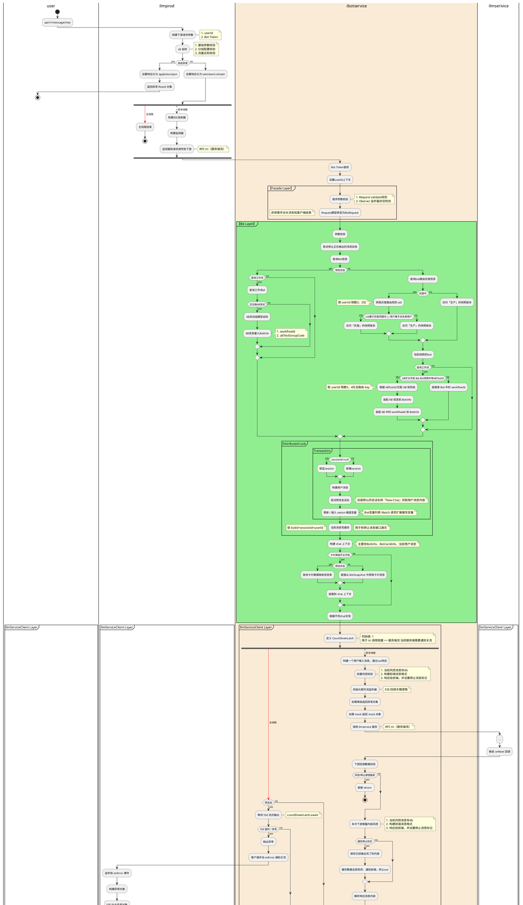

# ✨ ALMP

> 参考 coze, 但是 ALMP 是 toB 的
>
> 目标让每个钱包拥有自己的大模型平台, 并能快速创建智能机器人. 对外输出的智能助手可以直接复用

> ibotservice作为用户端的统一门面，提供用户与bot的交互服务。

## 系统职责

### 整体到局部

> ALMP 整体

我们的定位：**<font style="color:#DF2A3F;">平台的平台</font>**，把大模型平台快速输出给钱包，让每个钱包都有一个大模型平台，再提供给钱包的用户使用。

vs coze toC (**个人开发者**) 而言, ALMP 的定位:  toB (**把平台卖给钱包**)   
钱包带着自己的品牌, 输出给商户 吸引更多商户  
自己怎么售卖, 给底下商户怎么定价这就是它自己决定


> ibotservice 局部

是什么?  ---> 面向钱包用户，提供Bot用户服务

+ _Gcash - __**FoodPanda**__ _(e.g. 外卖智能助理 Bot)_ - User_
+ _**Gcash**__ (e.g. G小助 Bot) - User_


> 从 ALMP 产品层来看属于最下面给用户用的这层

1. A+: <font style="color:rgb(0, 0, 0);">ialmp-front</font>
2. 钱包: ilmmng
3. 商户: ilmprod
4. **用户: ibotservice**

### 回顾整体


bot的管理端操作：ilmprod 【管理时接口】<font style="color:#DF2A3F;">面向钱包商户，提供Bot配置和运营能力</font>

bot的用户操作：ibotservice 【运行时接口】<font style="color:#DF2A3F;">面向钱包用户，提供Bot用户服务</font>

ilmservice 大模型服务，Agent平台


**系统应用列表：**

+ <font style="color:#DF2A3F;">ibotservice</font><font style="color:rgb(0, 0, 0);"> 机器人服务端 ，C端</font>
  - **<font style="color:rgb(0, 0, 0);">bot的用户操作</font>**
  - <font style="color:rgb(0, 0, 0);">面向钱包用户，提供Bot用户服务</font>
  - **会话管理、一间多答、聊天服务、渲染引擎、长期上下文记忆、流式输出、聊天记录管理**
+ <font style="color:#DF2A3F;">ilmprod</font><font style="color:rgb(0, 0, 0);"> 一站式大模型</font><font style="color:#DF2A3F;">运营</font><font style="color:rgb(0, 0, 0);">产品（打标，etc.）</font>
  - **<font style="color:rgb(0, 0, 0);">bot的管理端操作</font>**
  - <font style="color:rgb(0, 0, 0);">面向钱包运营，从小程序平台升级上来，提供钱包入驻，产品开通（小程序，大模型平台，隐私计算，ASAP）的能力</font>
  - **商户入驻、Bot管理、开放市场、Bot运营**
+ <font style="color:#DF2A3F;">ilmservice</font><font style="color:rgb(0, 0, 0);"> 大模型服务，</font><font style="color:#DF2A3F;">Agent平台</font><font style="color:rgb(0, 0, 0);">（会话-意图识别-Agent-workflow、搜索、计费、预算）  
  </font><font style="color:rgb(0, 0, 0);">调用：  
  </font><font style="color:rgb(0, 0, 0);">ilmsearch 大模型搜索  
  </font><font style="color:rgb(0, 0, 0);">ilmplugin 大模型插件  
  </font><font style="color:rgb(0, 0, 0);">ilmknowledge 知识库平台</font>
    - <font style="color:rgb(0, 0, 0);">提供工作流运行，大模型推理，插件调用，知识召回等能力</font>
+ <font style="color:rgb(0, 0, 0);">ilmbill 大模型</font><font style="color:#DF2A3F;">计费和账单</font>
  - <font style="color:rgb(0, 0, 0);">负责模型推理/训练/部署计费和账单</font>


| **<font style="color:#FFFFFF;">应用分层</font>** | **<font style="color:#FFFFFF;">应用名称</font>**             | **<font style="color:#FFFFFF;">应用职责</font>**             |
| ------------------------------------------------ | ------------------------------------------------------------ | ------------------------------------------------------------ |
| 产品层                                           | 钱包科技输出平台-impprod（升级）                             | 面向钱包运营，从小程序平台升级上来，提供钱包入驻，产品开通（小程序，大模型平台，隐私计算，ASAP）的能力 |
|                                                  | **大模型建站平台ALMP-ialmp（新建）**                         | 面向A+运营，给钱包输出一个大模型平台                         |
|                                                  | **钱包大模型管理后台-ilmmng（新建）**                        | 面向钱包运营，提供钱包管理，商户管理能力                     |
|                                                  | <font style="color:#DF2A3F;">钱包大模型AI应用开发平台-ilmprod（新建）</font> | 面向钱包商户，提供Bot配置和运营能力                          |
|                                                  | Bot端-前端应用（新建）                                       | 面向用户的前端应用，提供Bot聊天机器人界面，对话等各种能力    |
|                                                  | <font style="color:#DF2A3F;">Bot端服务-ibotservice（新建）</font> | 面向钱包用户，提供Bot用户服务                                |
| 核心能力和服务层                                 | Agent平台-ilmservice（升级）                                 | 提供工作流运行，大模型推理，插件调用，知识召回等能力         |
|                                                  | 大模型插件-ilmplugin（新建）                                 | 提供各种插件的接入，管理，对接外部服务，供Agent调用          |
|                                                  | 知识库平台-iknowledge（新建）                                | 负责知识加工，存储                                           |
|                                                  | 半结构化知识库平台-ioriginknowledge（新建）                  | 负责半结构化知识加工，编辑                                   |
|                                                  | 大模型搜索-ilmsearch（新建）                                 | 负责知识检索，召回，精排                                     |
|                                                  | 模型训练服务-ilmmodel（新建）                                | 负责模型推理，模型训练，模型部署                             |
| 其他                                             | 大模型效果评估服务-ilmevaluation（新建）                     | 负责Bot评测，模型评测                                        |
|                                                  | 大模型计费和账单-ilmbill（新建）                             | 负责模型推理/训练/部署计费和账单                             |


## 剖析项目

> ibotservice 20250415 
>
> + /chat QPS 大致 150-200
> + memory QPS 大致 500-600 最多的一个facade


自己单一个鉴权, **特性 sign 加密**

+ ALMP 自己的前端

同用一个鉴权

+ API - Http协议
+ API - RPC协议


### 系统依赖


### 领域模型

> ibotsercie 所感知领域模型


## <font style="color:rgb(0, 0, 0);">主要业务逻辑</font>

### ~~发消息活动图 - old~~



## FAQ

> 能问下这个userMessage、botMessage还有userSession、botSession有什么区别 分别是干什么的吗

我理解的是: user / bot 最主要就是分表路由键不同为的是检索

另外有些小点区别

2B: 例如 bot 额外多一些打标, debugInfo相关运维维度的属性

2C: user 侧重的就是用户侧


> MechantUserId != **<font style="color:#DF2A3F;">UserId </font>**[为什么不能等于, 这两为什么不是同一个]

TenantId -> MerchantId -> MerchantUserId (B) -> **<font style="color:#DF2A3F;">UserId </font>**(C)

+ B / C 不一样两套系统, MerchantUserId 相当于 bizUserId
+ 一个是B端的用户，用的是ilogin的操作员体系；一个是C端用户，是almp域内的  
  B端的用户，登录能力会更完善一些，包括鉴权改密之类的，c端用户没有这些能力
+ <font style="color:#DF2A3F;">因为c端和b端用户不是同一个人，c端的用户可以是任何人，b端必须是商户开发者</font>

<font style="color:#DF2A3F;"></font>

> 超时时间

+ rpc超时时间优先级: 1. 消费端  2. 服务端  3. 框架默认兜底配置 3000ms
  - [https://yuque.antfin.com/middleware/sofa-rpc/annotation-configuration#h1b2X](https://yuque.antfin.com/middleware/sofa-rpc/annotation-configuration#h1b2X)
  - [https://yuque.antfin.com/middleware/sofa-rpc/troubleshooting-guide#%E8%BF%98%E6%98%AF%E6%B2%A1%E8%A7%A3%E5%86%B3%EF%BC%8C%E9%82%A3%E5%B0%B1-debug-%E2%80%94%E2%80%94-%E4%BB%A5%E8%B6%85%E6%97%B6%E9%97%AE%E9%A2%98%E4%B8%BA%E4%BE%8B](https://yuque.antfin.com/middleware/sofa-rpc/troubleshooting-guide#%E8%BF%98%E6%98%AF%E6%B2%A1%E8%A7%A3%E5%86%B3%EF%BC%8C%E9%82%A3%E5%B0%B1-debug-%E2%80%94%E2%80%94-%E4%BB%A5%E8%B6%85%E6%97%B6%E9%97%AE%E9%A2%98%E4%B8%BA%E4%BE%8B)
+ sse 超时时间自己设置的 120s 这里


>  核实确定 C/B 用的工作流版本

* B端就是 max version

* C端就是 可用版本 (prod只能发布态, pre可以草稿灰度发布三态) + max version


# ibotservice学习

## 知识铺垫

> SSE
>
> org.springframework.web.servlet.mvc.method.annotation.SseEmitter


> 流式监听器 (RPC 异步观察者模式)   其实底层就是 org.reactivestreams.Subscriber (ilmservice 就直接用这个)
>
> sofaRpc: com.alipay.sofa.rpc.transport.SofaStreamObserver

在 SOFA RPC 框架中，`SofaStreamObserver` 是用于将异步流观察者直接传递给下游的。它允许在客户端和服务端之间建立一个流式的异步通信模式。

`SofaStreamObserver` 是 SOFA RPC 客户端和服务端之间进行数据流传输的一个观察者（Observer），它负责处理服务端响应的数据流。在 SOFA RPC 的实现中，`SofaStreamObserver` 可能是用来处理异步请求的，因此它能提供数据流的异步处理能力。


> sofaRPC, 底层用了 grpc

triple (流式 vs tr非流式) - tri 有三种方式

+ 客户端流
+ chat - 服务端流
+ asr - 双向


## 可以看的两个接口

+ chat tri接口 (ibotservice-ilmservice-ilmmodel-ilmbill)
  - 对调用方 - SSE (服务端推送)
  - 对下游 - RPC服务端流 (Observer异步通信) 
    * 底层应该是: reactive 那个包下的那个  
      org.reactivestreams.Subscriber 回调通讯
    * 用 grpc 来发起调用
+ asr tri接口 (ibotservice-ilmmodel)
  - 对调用方 - WS
  - 对下游 - RPC双向流 (两个Observer)


## 其他特点

重点除了上面两个接口还可以讲下一些特性

> 模板方法设计, 所有接口都统一包裹, 方便log

    - 所有接口统一 req, resp, (有基类)  context
    - 统一三步走 paramCheck, execute, onFail  
    - 统一返回 Result
    - 统一摘要日志**serviceMonitorModel**, 日志监控例如 
        * BIZ-SHARE LOG 统一打出 try request,  catch 异常日志
        * BIZ_DIGEST 统一 finally 摘要日志

```json
public class Loggers {
    /**
     * BIZ-SHARE LOG
     * 格式化：是
     * 说明：SHARE日志请在模板放内使用 & 一定格式
     */
    final public static Logger BIZ_SHARE       = LoggerFactory.getLogger("BIZ-SHARE");
    /**
     * BIZ-SERVICE LOG
     * 说明：SERVICE日志可以在任意地方使用 & 无格式
     */
    final public static Logger BIZ_SERVICE     = LoggerFactory.getLogger("BIZ-SERVICE");
    /**
     * BIZ-DIGEST LOG
     * 说明：DIGEST日志请在模板方法finally使用 & 固定格式
     */
    final public static Logger BIZ_DIGEST      = LoggerFactory.getLogger("BIZ-DIGEST");
    /**
     * BIZ-INTEGRATION LOG
     * 说明：INTEGRATION请在服务集成外部时使用 & 无格式
     */
    final public static Logger BIZ_INTEGRATION = LoggerFactory.getLogger("BIZ-INTEGRATION");
    /**
     * BIZ-CHAT LOG
     * 说明：CHAT专属的日志 & 固定格式
     */
    final public static Logger BIZ_CHAT        = LoggerFactory.getLogger("BIZ-CHAT");
}
```


> 前端 sign 加密

1. 前后端约定一套sha256数字指纹
2. 读配置中心是否需要鉴权 sign
3. 加密request得到string对比前端传过来的 sign 【验签】
4. extra - now vs 前端传的时间 (30s 内) [多了时间的校验]


> 通过countDownLatch控制sse超时, 异步转同步

`completed = countDownLatch.await(streamOutputWrapper.getTimeout(), TimeUnit.SECONDS);`

注意(CR手册): 使用CountDownLatch进行异步转同步操作时，每个线程退出前必须调用countDown方法，线程执行代码注意catch异常，确保countDown方法可以执行，避免主线程无法执行至countDown方法，直到超时才返回结果。【finish要去coutdown】


# ilmprod学习

> #上游
>
> 钱包科技输出平台，提供包括但不限于大模型、隐私计算，APSP等服务
>
> 
>
> #下游
>
> 智能机器人会话执行平台
>
> 模型训练/推理平台
>
> 知识库嵌入/检索/重排序


### Code

> workflow version 这种版本 +1 -1   initVersion, nextVersion

就算只有两个操作也可以搞一个util来

```java
public class VersionUtils {

    /**
     * 获取初始版本
     * @return 初始版本
     */
    public static Integer initVersion() {
        return 1;
    }

    /**
     * 指定零版本号
     * @return 零版本号
     */
    public static Integer zeroVersion() {
        return 0;
    }

    /**
     * 得到下一个版本
     * @param version 当前版本
     * @return 下一个版本
     */
    public static Integer nextVersion(Integer version) {
        return version + 1;
    }

    /**
     * 得到上一个版本
     * @param version 当前版本
     * @return 上一个版本
     */
    public static Integer lastVersion(Integer version) {
        return version - 1;
    }
}
```


# ilmservice学习

> 集合蚂蚁自研、开源、商用大模型，打造开箱即用的多模态大模型应用服务。整合数据资源和算力资源，串联模型研发生命周期，以保证资源的合规、高效利用，并降低大模型开发与应用门槛。


> cs笔记, 重点看工作流执行


凌祺一套, Hierarchy 如下:

1. Interface GraphExecute
2. Abstract AbstractGraphExecuteBfsEngine
3. class ChainGraphExecutor


屈定一套

com.alipay.ilmservice.service.dag.impl.AbstractFlowStepExecuteGraph#bfsFlowExecute


ps: 两套逻辑几乎一致, 就只有入口不同, C端用的凌祺那套

重点执行顺序如下 2 -> 3 loop

1. **调度算法：BFS广度优先遍历**
2. **constructQueueNodeTaskFuture  (就是不停 loop 此方法)**
3. **<font style="color:#DF2A3F;">runAndCallNodeExecute</font>**** 节点运行+下游节点唤醒**
   1. **runAsync executeNode**
   2. **whenComplete 下游节点唤醒 --> 2 (loop)**


****

## 小Tips

> mybatis 通过代码方式走DB, 而不是.xml

```javascript
/**
 * 根据工作流id查询符合条件的工作流配置信息
 *
 * @param flowId 工作流id
 * @return 工作流配置
 */
public WorkflowConfig queryValidWorkflowConfig(String flowId) {

  Example<AlmpWorkflowConfigDO> example = new Example<>();
  example.orderBy(AlmpWorkflowConfigDO::getVersion, Order.DESC);

  Example.Criteria<AlmpWorkflowConfigDO> criteria = example.createCriteria();
  criteria.andEqualTo(AlmpWorkflowConfigDO::getFlowId, flowId);
  criteria.andIn(AlmpWorkflowConfigDO::getStatus, AlmpStatus.getEnableStatus());

  return almpWorkflowConfigMapper.selectByExample(example).stream().map(WorkflowConfig::of).findFirst().orElse(null);
}
```


> org.reactivestreams.Subscriber

ilmservice 的listener是直接用的它, 不是RPC包下的那个Observer对象	

用自己项目构建的这个 listener (**<font style="color:#DF2A3F;">只自己用</font>**) 回调 ibot 的那个 observer  onNext xxx

RPC包下的Observer底层应该也是它


> com.google.common.eventbus.EventBus

用它异步来写写入debug记录 DB


步骤

1. eventBus.post(new FlowStartEvent(context, new Date(), input));
2. FlowExecutionEvent.FlowStartEvent 它是内部类,   eventBus.register
3. 消费者- `@Subscribe onFlowStart(FlowExecutionEvent.FlowStartEvent event) `


> EnvConfig

```java
@Configuration
public class EnvConfig {

    /**
     * 生效环境工具日志使用
     */
    @Bean
    public EnvironmentUtils effectStatusUtils() {
        return new EnvironmentUtils();
    }

    /**
     * jexl引擎
     */
    @Bean
    public JexlEngineAdapter jexlEngineAdapter() {
        return new JexlEngineAdapter();
    }

}
```


> 1. 环境状态管理工具

```java
public class EnvironmentUtils implements EnvironmentAware {

    public static Environment environment;
    
    @Override
    public void setEnvironment(Environment environment) {
        EnvironmentUtils.environment = environment;
        LogUtils.CONFIG_CACHE.info("当前环境:{}", EnvironmentUtils.getCurrentStatus());
    }
}
```

> 2. implements JexlContext

实现父类三个, 拿关键东西

```sql
@Override
    public Object get(String name) {
        return this.nodeOutputCtx.get(name);
    }

    @Override
    public void set(String name, Object value) {
        throw new UnsupportedOperationException();
    }

    @Override
    public boolean has(String name) {
        return this.nodeOutputCtx.containsKey(name);
    }
```


> 一些默认值通过 `DataKey`来拿
>
> 整套项目全是通过这个拿, 很频繁

```json
/**
     * 节点超时时间
     */
    public static final DataKey<Integer> FLOW_NODE_TIMEOUT_SECOND = DataKey.createInteger("FLOW_NODE_TIMEOUT_SECOND");
```

```json
public final class DataKey<T> implements ValueKey<T> {

    /**
     * 缓存实例
     */
    private static final ConcurrentMap<String, DataKey<?>> ourDataKeyIndex = new ConcurrentHashMap<>();

    /**
     * 对应的数据名称
     */
    public final String dataId;

    /**
     * 案例信息
     */
    public final String example;
    /**
     * 对应值类型,解决泛型获取不方便问题
     */
    public final Class<T> clazz;

  public static <T> DataKey<T> create(String dataId, Class<T> clazz) {
        //noinspection unchecked
        return (DataKey<T>)ourDataKeyIndex.computeIfAbsent(dataId.concat(clazz.getName()), k -> new DataKey<>(dataId, clazz));
    }
```


1. <font style="color:rgb(13, 18, 57);">ConcurrentMap：</font>
   - <font style="color:#DF2A3F;">需要线程间共享数据</font>
   - <font style="color:rgb(13, 18, 57);">需要线程安全的数据访问</font>
   - <font style="color:rgb(13, 18, 57);">缓存数据</font>
2. <font style="color:rgb(13, 18, 57);">ThreadLocal：</font>
   - <font style="color:rgb(13, 18, 57);">线程上下文数据存储</font>
   - <font style="color:rgb(13, 18, 57);">事务管理</font>
   - <font style="color:rgb(13, 18, 57);">用户会话管理</font>


> @EventListener vs `com.google.common.eventbus.EventBus`
>
> + 这里项目用的是 EventBus
> + iexpvap 用的是 @EventListener
>
> ps: EventBus 1. 性能好些  2. 不依赖spring框架 框架无关性

```java
@Bean()
public ThreadPoolExecutor directJobExecutor() {
    LogUtils.CONFIG_CACHE.info("directJobExecutor start");

    ThreadFactory namedThreadFactory = new ThreadFactoryBuilder()
            .setNameFormat("direct-job-pool-%d")
            .setUncaughtExceptionHandler(threadUncaughtExceptionHandler)
            .build();

    ThreadPoolExecutor executor = new SofaThreadPoolExecutor(10, 20, 5L, TimeUnit.MINUTES, new ArrayBlockingQueue<>(1000), namedThreadFactory, new ThreadPoolExecutor.AbortPolicy());
    LogUtils.CONFIG_CACHE.info("directJobExecutor finish");
    return executor;
}

------

@Bean("eventBus")
public EventBus eventBus() {
    EventBus eventBus = new EventBus();
    // 注册同步监听器实例,数量不多,直接手动注册即可
    eventBus.register(almpFlowDebugDataEventListener);
    eventBus.register(almpNodeDebugDataEventListener);
    eventBus.register(almpNodeTimeoutEventListener);
    eventBus.register(almpNodeDebugTraceListener);
    eventBus.register(almpToolDebugDataEventListener);
    return eventBus;
}

@Bean("asyncEventBus")
public EventBus asyncEventBus() {
    AsyncEventBus asyncEventBus = new AsyncEventBus(directJobExecutor);
    // 同样的监听器也注册到异步EventBus
    asyncEventBus.register(almpFlowDebugDataEventListener);
    asyncEventBus.register(almpNodeDebugTraceListener);
    return asyncEventBus;
}

------

@Component
public class EventBusWrapper {
    @Resource
    private EventBus eventBus;

    @Resource
    private AsyncEventBus asyncEventBus;

    public void post(Object event) {
        eventBus.post(event);
    }

    public void postAsync(Object event) {
        asyncEventBus.post(event);
    }
}
```


> `<font style="color:rgb(13, 18, 57);">@JsonIgnoreProperties(ignoreUnknown = true)</font>`<font style="color:rgb(13, 18, 57);"> 的作用是在 JSON 序列化/反序列化时忽略未知属性</font>

xd? 不存在POJO类中的其他字段序列化和反序列化就会被忽略


## AdapterCommand

> **<font style="color:rgb(51, 51, 51);">适配器模式（Adapter Pattern）</font>**<font style="color:rgb(51, 51, 51);"> 和 </font>**<font style="color:rgb(51, 51, 51);">防腐层（Anti-Corruption Layer, ACL）模式</font>**<font style="color:rgb(51, 51, 51);"> 的结合</font>
>
> + 防腐层更侧重于隔离和转换，防止外部模型的影响
> + 适配器模式更侧重于接口转换
>
> 结构性 **适配器模式**   包一层, 转接头           所有 `integration`都用这个包住
>
> 自己新建的req/resp对象属于核心模型层，而AdapterCommandService作为适配器

+ 自己新建 req resp 到model层, 不用facade jar里的 !!!     
  实践凌祺那次就好改, 多问一答要变动他只要改一处


**<font style="color:rgb(51, 51, 51);">防腐层是否属于23种经典设计模式？</font>**

**<font style="color:rgb(51, 51, 51);">A: 防腐层</font>**<font style="color:rgb(51, 51, 51);">是DDD的架构模式，用于隔离外部模型的污染；</font>

+ <font style="color:rgb(51, 51, 51);">架构借鉴DDD, 防腐层讲解  B站视频 </font>[https://www.bilibili.com/video/BV1kw411h7tY/?spm_id_from=333.1387.favlist.content.click](https://www.bilibili.com/video/BV1kw411h7tY/?spm_id_from=333.1387.favlist.content.click)


```
@startuml

start
:外部系统;
-> 适配器模式（接口转换）;

:AdapterCommandService;
-> 防腐层模式（模型隔离）;

:内部模型层 (req/resp);
-> 核心业务逻辑;

end

@enduml
```


service Level

interface AdapterCommandService

+ platform
+ execute   convert2Local


## FAQ

> **C/B 用的工作流版本, C (publish)   B (draft)**
>
> 两种工作流状态 by workflowId

publish - streamChat where 1. versionMax 2. enable (check evn e.g. PROD)

draft - debugChat where 1. versionMax


---


## TODO

com.alipay.ilmservice.model.dag.LlmServiceConfDataKeys

doOnNext

DDD - 防腐化 (**<font style="color:#DF2A3F;">转换, 收敛</font>**, 语义)

<font style="color:rgb(51, 51, 51);">SynchronousQueue, 线程池用这个, 后续直接拒绝</font>

`<font style="color:rgb(51, 51, 51);">ThreadPoolExecutor executor = new SofaThreadPoolExecutor(100, 200, 5L, TimeUnit.MINUTES, new SynchronousQueue<>(), namedThreadFactory, new ThreadPoolExecutor.AbortPolicy());</font>`