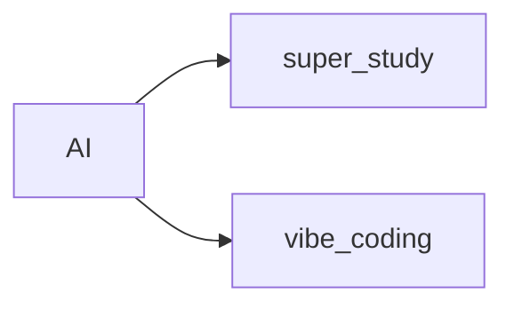

# AI 

> **ALL in AI**
>
> **让 AI 取代所有那些耗费时间但缺乏创造力的工作, 把我的精力专注在真正有意义的事情上。**

## AI 时代的超级学习者

> MoneyXYZ 超级学习者  AI时代

人力资源 -> 资源说的就是我们
我们 = 工具人&资产

## Vibe Coding

> Vibe Coding: 与 AI 一起解决问题
>
> Vibe Coding 就是通过自然语言（在需要时结合代码），同 AI协作来解决实际问题的过程。

怎样开始: 找到一个你真正想解决的问题

根深蒂固的低效学习模式: ~~先学习工具再解决问题 !!!~~ 工具不是目的只是手段

正确做法: get your hands dirty，直奔主题

btw: 不要放弃思考, 阮一峰很多摘录都提到这点

笔记记录，不用老想着第一时间就用llm帮忙写代码(初石帮看，一下就看出明明就是一个三元表达式就搞定，llm写一堆！！！)  联想ruanyifeng几篇周刊说用ai丧失思考能力！！！ 【XD它几篇的摘录都是这样】 找到，深思，放ai 我自己那个文章！

todo claude code

## LLM

#### token 计算

用 dify 有感:

一次请求里，**凡是发给模型看的内容，全都算 token**：

- ✅ system_prompt
- ✅ user_prompt
- ✅ assistant 的历史上下文（如果你带了）
- ✅ 工具调用产生的内容
- ❌ 只有 **没发给模型的内容** 才不算

manus用的哪个agent范式

增强版 react