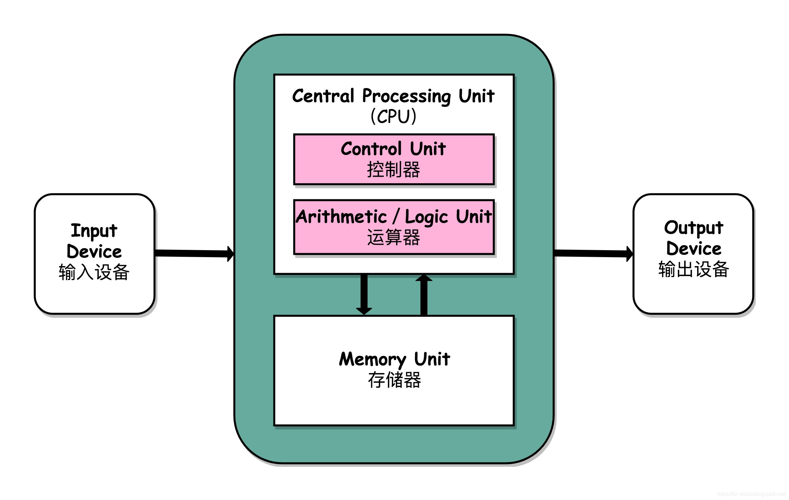
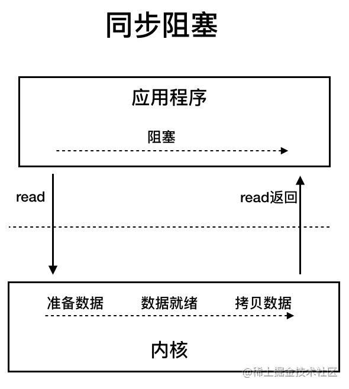
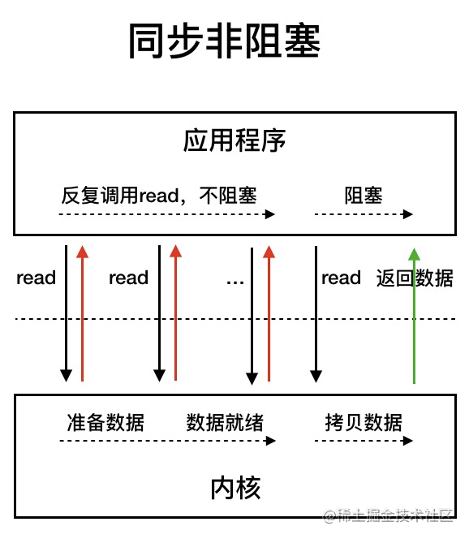
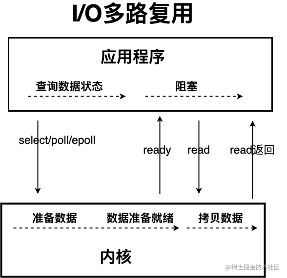
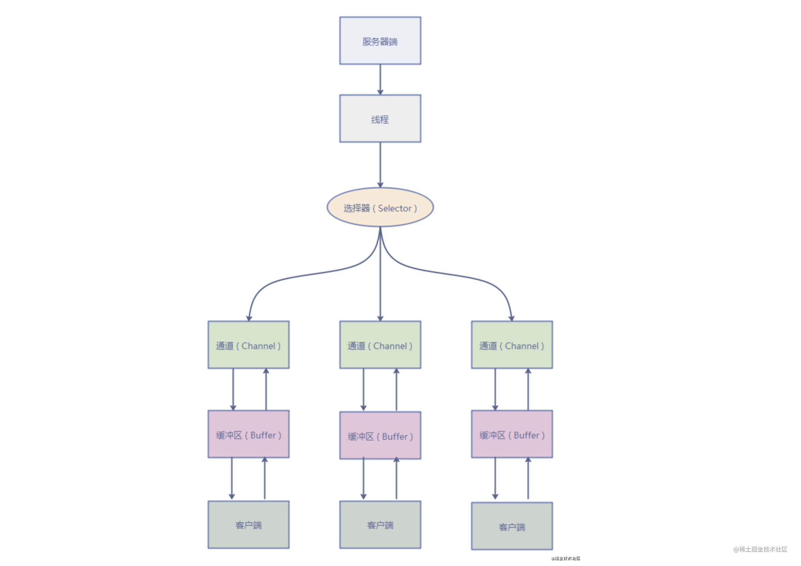
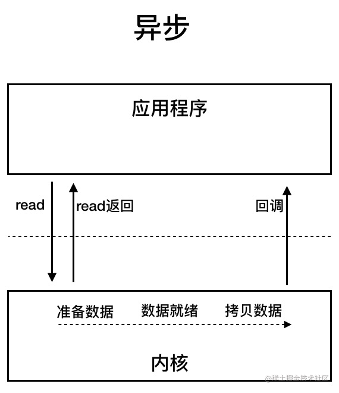

# Java IO 模型常见面试题总结

面试中经常喜欢问的一个问题，因为通过这个问题，面试官可以顺便了解一下你的操作系统的水平。

IO 模型这块确实挺难理解的，需要太多计算机底层知识。写这篇文章用了挺久，就非常希望能把我所知道的讲出来吧!希望朋友们能有收获！为了写这篇文章，还翻看了一下《UNIX 网络编程》这本书，太难了，我滴乖乖！心痛~

*个人能力有限。如果文章有任何需要补充/完善/修改的地方，欢迎在评论区指出，共同进步！*

## 前言

I/O 一直是很多小伙伴难以理解的一个知识点，这篇文章我会将我所理解的 I/O 讲给你听，希望可以对你有所帮助。

## I/O

### 何为 I/O?

I/O（**I**nput/**O**utpu） 即**输入／输出** 。

**我们先从计算机结构的角度来解读一下 I/O。**

根据冯.诺依曼结构，计算机结构分为 5 大部分：运算器、控制器、存储器、输入设备、输出设备。

输入设备（比如键盘）和输出设备（比如显示屏）都属于外部设备。网卡、硬盘这种既可以属于输入设备，也可以属于输出设备。

输入设备向计算机输入数据，输出设备接收计算机输出的数据。

**从计算机结构的视角来看的话， I/O 描述了计算机系统与外部设备之间通信的过程。**

**我们再先从应用程序的角度来解读一下 I/O。**

根据大学里学到的操作系统相关的知识：为了保证操作系统的稳定性和安全性，一个进程的地址空间划分为 **用户空间（User space）** 和 **内核空间（Kernel space ）** 。

像我们平常运行的应用程序都是运行在用户空间，只有内核空间才能进行系统态级别的资源有关的操作，比如如文件管理、进程通信、内存管理等等。也就是说，我们想要进行 IO 操作，一定是要依赖内核空间的能力。

并且，用户空间的程序不能直接访问内核空间。

当想要执行 IO 操作时，由于没有执行这些操作的权限，只能发起系统调用请求操作系统帮忙完成。

因此，用户进程想要执行 IO 操作的话，必须通过 **系统调用** 来间接访问内核空间

我们在平常开发过程中接触最多的就是 **磁盘 IO（读写文件）** 和 **网络 IO（网络请求和响应）**。

**从应用程序的视角来看的话，我们的应用程序对操作系统的内核发起 IO 调用（系统调用），操作系统负责的内核执行具体的 IO 操作。也就是说，我们的应用程序实际上只是发起了 IO 操作的调用而已，具体 IO 的执行是由操作系统的内核来完成的。**

当应用程序发起 I/O 调用后，会经历两个步骤：

1. 内核等待 I/O 设备准备好数据
2. 内核将数据从内核空间拷贝到用户空间。

### 有哪些常见的 IO 模型?

UNIX 系统下， IO 模型一共有 5 种： **同步阻塞 I/O**、**同步非阻塞 I/O**、**I/O 多路复用**、**信号驱动 I/O** 和**异步 I/O**。

这也是我们经常提到的 5 种 IO 模型。

## Java 中 3 种常见 IO 模型

### BIO (Blocking I/O)

**BIO 属于同步阻塞 IO 模型** 。

同步阻塞 IO 模型中，应用程序发起 read 调用后，会一直阻塞，直到在内核把数据拷贝到用户空间。

在客户端连接数量不高的情况下，是没问题的。但是，当面对十万甚至百万级连接的时候，传统的 BIO 模型是无能为力的。因此，我们需要一种更高效的 I/O 处理模型来应对更高的并发量。

### NIO (Non-blocking/New I/O)

Java 中的 NIO 于 Java 1.4 中引入，对应 `java.nio` 包，提供了 `Channel` , `Selector`，`Buffer` 等抽象。NIO 中的 N 可以理解为 Non-blocking，不单纯是 New。它支持面向缓冲的，基于通道的 I/O 操作方法。 对于高负载、高并发的（网络）应用，应使用 NIO 。

Java 中的 NIO 可以看作是 **I/O 多路复用模型**。也有很多人认为，Java 中的 NIO 属于同步非阻塞 IO 模型。

跟着我的思路往下看看，相信你会得到答案！

我们先来看看 **同步非阻塞 IO 模型**。

同步非阻塞 IO 模型中，应用程序会一直发起 read 调用，等待数据从内核空间拷贝到用户空间的这段时间里，线程依然是阻塞的，直到在内核把数据拷贝到用户空间。

相比于同步阻塞 IO 模型，同步非阻塞 IO 模型确实有了很大改进。通过轮询操作，避免了一直阻塞。

但是，这种 IO 模型同样存在问题：**应用程序不断进行 I/O 系统调用轮询数据是否已经准备好的过程是十分消耗 CPU 资源的。**

这个时候，**I/O 多路复用模型** 就上场了。

IO 多路复用模型中，线程首先发起 select 调用，询问内核数据是否准备就绪，等内核把数据准备好了，用户线程再发起 read 调用。read 调用的过程（数据从内核空间->用户空间）还是阻塞的。

> 目前支持 IO 多路复用的系统调用，有 select，epoll 等等。select 系统调用，是目前几乎在所有的操作系统上都有支持
>
> * **select 调用** ：内核提供的系统调用，它支持一次查询多个系统调用的可用状态。几乎所有的操作系统都支持。
> * **epoll 调用** ：linux 2.6 内核，属于 select 调用的增强版本，优化了 IO 的执行效率。

**IO 多路复用模型，通过减少无效的系统调用，减少了对 CPU 资源的消耗。**

Java 中的 NIO ，有一个非常重要的**选择器 ( Selector )** 的概念，也可以被称为 **多路复用器**。通过它，只需要一个线程便可以管理多个客户端连接。当客户端数据到了之后，才会为其服务。

### AIO (Asynchronous I/O)

AIO 也就是 NIO 2。Java 7 中引入了 NIO 的改进版 NIO 2,它是异步 IO 模型。

异步 IO 是基于事件和回调机制实现的，也就是应用操作之后会直接返回，不会堵塞在那里，当后台处理完成，操作系统会通知相应的线程进行后续的操作。

目前来说 AIO 的应用还不是很广泛。Netty 之前也尝试使用过 AIO，不过又放弃了。这是因为，Netty 使用了 AIO 之后，在 Linux 系统上的性能并没有多少提升。

最后，来一张图，简单总结一下 Java 中的 BIO、NIO、AIO。

## 参考

* 《深入拆解 Tomcat & Jetty》
* 如何完成一次 IO：[https://llc687.top/post/如何完成一次-io/](https://llc687.top/post/%E5%A6%82%E4%BD%95%E5%AE%8C%E6%88%90%E4%B8%80%E6%AC%A1-io/)
* 程序员应该这样理解 IO：<https://www.jianshu.com/p/fa7bdc4f3de7>
* 10 分钟看懂， Java NIO 底层原理：<https://www.cnblogs.com/crazymakercircle/p/10225159.html>
* IO 模型知多少 | 理论篇：<https://www.cnblogs.com/sheng-jie/p/how-much-you-know-about-io-models.html>
* 《UNIX 网络编程 卷 1；套接字联网 API 》6.2 节 IO 模型

> 更新: 2023-04-17 09:53:52  
> 原文: <https://www.yuque.com/snailclimb/mf2z3k/qcyq7f>