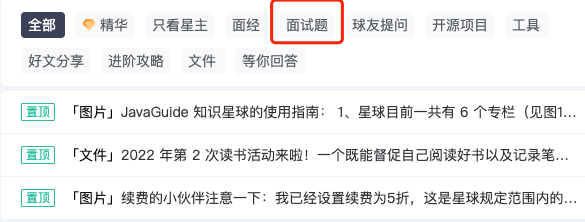

# 技术面试题篇

欢迎阅读**「技术面试题篇」**相关的文章，这个系列主要内容是面试题，内容涵盖系统设计、Java、数据库、常见框架、分布式、高并发等内容。

下面这些和技术面试题相关的星球精华帖或许对你也有帮助:

- [x] [有哪些算法题值得一刷？](https://t.zsxq.com/112NOhdQ5)
- [x] [如何准备 SQL 笔试题？](https://t.zsxq.com/12jMaKPOm)
- [x] [Kubernetes 面试题总结](https://t.zsxq.com/11ybguIta)
- [x] [Spring Cloud Alibaba 常见组件介绍&面试问题总结](https://t.zsxq.com/11GUwbnRA)
- [x] [几种比较典型的系统设计案例（电商系统、优惠卷系统、红包系统、任务调度系统 ……）](https://t.zsxq.com/103PdUIa9)

另外，星球有一个分享面试题的专题：

> 更新: 2024-03-13 13:52:22  
> 原文: <https://www.yuque.com/snailclimb/mf2z3k/ahazlg>