# 服务治理：分布式事务解决方案有哪些？

**网上已经有很多关于分布式事务的文章了，为啥还要写一篇？**

1. 第一是我觉得大部分文章理解起来挺难的，不太适合一些经验不多的小伙伴。这篇文章我的目标就是让即使是没啥工作经验的小伙伴们都能真正看懂分布式事务。
2. 第二是我觉得大部分文章介绍的不够详细，很对分布式事务相关比较重要的概念都没有提到。

开始聊分布式事务之前，我们先来回顾一下事务相关的概念。

## 事务

我们设想一个场景，这个场景中我们需要插入多条相关联的数据到数据库，不幸的是，这个过程可能会遇到下面这些问题：

* 数据库中途突然因为某些原因挂掉了。
* 客户端突然因为网络原因连接不上数据库了。
* 并发访问数据库时，多个线程同时写入数据库，覆盖了彼此的更改。
* ......

上面的任何一个问题都可能会导致数据的不一致性。为了保证数据的一致性，系统必须能够处理这些问题。事务就是我们抽象出来简化这些问题的首选机制。事务的概念起源于数据库，目前，已经成为一个比较广泛的概念。

**何为事务？** 一言蔽之，**事务是逻辑上的一组操作，要么都执行，要么都不执行。**

事务最经典也经常被拿出来说例子就是转账了。假如小明要给小红转账 1000 元，这个转账会涉及到两个关键操作，这两个操作必须都成功或者都失败。

1. 将小明的余额减少 1000 元
2. 将小红的余额增加 1000 元。

事务会把这两个操作就可以看成逻辑上的一个整体，这个整体包含的操作要么都成功，要么都要失败。这样就不会出现小明余额减少而小红的余额却并没有增加的情况。


## 数据库事务

大多数情况下，我们在谈论事务的时候，如果没有特指**分布式事务**，往往指的就是**数据库事务**。

数据库事务在我们日常开发中接触的最多了。如果你的项目属于单体架构的话，你接触到的往往就是数据库事务了。

**那数据库事务有什么作用呢？**

简单来说，数据库事务可以保证多个对数据库的操作（也就是 SQL 语句）构成一个逻辑上的整体。构成这个逻辑上的整体的这些数据库操作遵循：**要么全部执行成功,要么全部不执行** 。

```sql
# 开启一个事务
START TRANSACTION;
# 多条 SQL 语句
SQL1,SQL2...
## 提交事务
COMMIT;
```

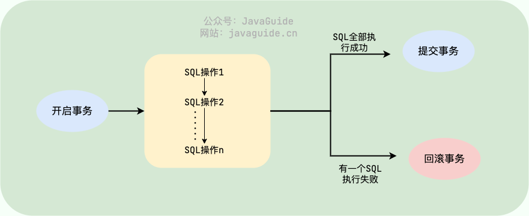

另外，关系型数据库（例如：`MySQL`、`SQL Server`、`Oracle` 等）事务都有 **ACID** 特性：


1. **原子性**（`Atomicity`） ： 事务是最小的执行单位，不允许分割。事务的原子性确保动作要么全部完成，要么完全不起作用；
2. **一致性**（`Consistency`）： 执行事务前后，数据保持一致，例如转账业务中，无论事务是否成功，转账者和收款人的总额应该是不变的；
3. **隔离性**（`Isolation`）： 并发访问数据库时，一个用户的事务不被其他事务所干扰，各并发事务之间数据库是独立的；
4. **持久性**（`Durability`）： 一个事务被提交之后。它对数据库中数据的改变是持久的，即使数据库发生故障也不应该对其有任何影响。

🌈 这里要额外补充一点：**只有保证了事务的持久性、原子性、隔离性之后，一致性才能得到保障。也就是说 A、I、D 是手段，C 是目的！** 想必大家也和我一样，被 ACID 这个概念被误导了很久! 我也是看周志明老师的公开课[《周志明的软件架构课》](https://time.geekbang.org/opencourse/intro/100064201)才搞清楚的（多看好书！！！）。

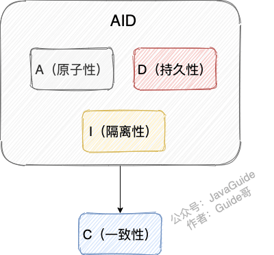

另外，DDIA 也就是 [《Designing Data-Intensive Application（数据密集型应用系统设计）》](https://book.douban.com/subject/30329536/) 的作者在他的这本书中如是说：

> Atomicity, isolation, and durability are properties of the database, whereas consis‐\
> tency (in the ACID sense) is a property of the application. The application may rely\
> on the database’s atomicity and isolation properties in order to achieve consistency,\
> but it’s not up to the database alone.
>
> 翻译过来的意思是：原子性，隔离性和持久性是数据库的属性，而一致性（在 ACID 意义上）是应用程序的属性。应用可能依赖数据库的原子性和隔离属性来实现一致性，但这并不仅取决于数据库。因此，字母 C 不属于 ACID 。

《Designing Data-Intensive Application（数据密集型应用系统设计）》这本书强推一波，值得读很多遍！豆瓣有接近 90% 的人看了这本书之后给了五星好评。另外，中文翻译版本已经在 Github 开源，地址：<https://github.com/Vonng/ddia> 。

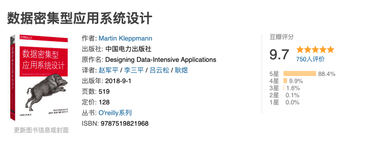

**数据事务的实现原理呢？**

我们这里以 MySQL 的 InnoDB 引擎为例来简单说一下。

MySQL InnoDB 引擎使用 **redo log(重做日志)** 保证事务的**持久性**，使用 **undo log(回滚日志)** 来保证事务的**原子性**。MySQL InnoDB 引擎通过 **锁机制**、**MVCC** 等手段来保证事务的隔离性（ 默认支持的隔离级别是 <code>**REPEATABLE-READ**</code> ）。

## 分布式事务

微服务架构下，一个系统被拆分为多个小的微服务。每个微服务都可能存在不同的机器上，并且每个微服务可能都有一个单独的数据库供自己使用。这种情况下，一组操作可能会涉及到多个微服务以及多个数据库。举个例子：电商系统中，你创建一个订单往往会涉及到订单服务（订单数加一）、库存服务（库存减一）等等服务，这些服务会有供自己单独使用的数据库。

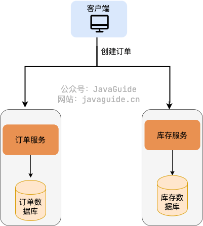

**那么如何保证这一组操作要么都执行成功，要么都执行失败呢？**

这个时候单单依靠数据库事务就不行了！我们就需要引入 **分布式事务** 这个概念了！

实际上，只要跨数据库的场景都需要用到引入分布式事务。比如说单个数据库的性能达到瓶颈或者数据量太大的时候，我们需要进行 **分库**。分库之后，同一个数据库中的表分布在了不同的数据库中，如果单个操作涉及到多个数据库，那么数据库自带的事务就无法满足我们的要求了。

一言蔽之，**分布式事务的终极目标就是保证系统中多个相关联的数据库中的数据的一致性！**

那既然分布式事务也属于事务，理论上就应该准守事物的 ACID 四大特性。但是，考虑到性能、可用性等各方面因素，我们往往是无法完全满足 ACID 的，只能选择一个比较折中的方案。

针对分布式事务，又诞生了一些新的理论。

## 分布式事务基础理论

### CAP 理论和 BASE 理论

CAP 理论和 BASE 理论是分布式领域非常非常重要的两个理论。不夸张地说，只要问到分布式相关的内容，面试官几乎是必定会问这两个分布式相关的理论。

不论是你面试也好，工作也罢，都非常有必要将这两个理论搞懂，并且能够用自己的理解给别人讲出来。

我这里就不多提这两个理论了，不了解的小伙伴，可以看我前段时间写过的一篇相关的文章：[《CAP 和 BASE 理论了解么？可以结合实际案例说下不？》](https://mp.weixin.qq.com/s?__biz=Mzg2OTA0Njk0OA==\&mid=2247495298\&idx=1\&sn=965be0f54ab44bda818656db1f21a39f\&chksm=cea1a149f9d6285f1169413ab7663ca2a9c1a8440a5ae5816566eb66b20e4d86f5db1002f66c\&token=657875872\&lang=zh_CN#rd) 。

### 一致性的 3 种级别

我们可以把对于系统一致性的要求分为下面 3 种级别：

* **强一致性** ：系统写入了什么，读出来的就是什么。
* **弱一致性** ：不一定可以读取到最新写入的值，也不保证多少时间之后读取到的数据是最新的，只是会尽量保证某个时刻达到数据一致的状态。
* **最终一致性** ：弱一致性的升级版。系统会保证在一定时间内达到数据一致的状态，

除了上面这 3 个比较常见的一致性级别之外，还有读写一致性、因果一致性等一致性模型，具体可以参考[《Operational Characterization of Weak Memory Consistency Models》](https://es.cs.uni-kl.de/publications/datarsg/Senf13.pdf)这篇论文。因为日常工作中这些一致性模型很少见，我这里就不多做阐述（因为我自己也不是特别了解 😅）。

业界比较推崇是 **最终一致性**，但是某些对数据一致要求十分严格的场景比如银行转账还是要保证强一致性。

### 柔性事务

互联网应用最关键的就是要保证高可用， 计算式系统几秒钟之内没办法使用都有可能造成数百万的损失。在此场景下，一些大佬们在 CAP 理论和 BASE 理论的基础上，提出了 **柔性事务** 的概念。 **柔性事务追求的是最终一致性。**

实际上，柔性事务就是 **BASE 理论 +业务实践**。 柔性事务追求的目标是：我们根据自身业务特性，通过适当的方式来保证系统数据的最终一致性。 像 **TCC**、 **Saga**、**MQ 事务** 、**本地消息表** 就属于柔性事务。

### 刚性事务

与柔性事务相对的就是 **刚性事务** 了。前面我们说了，**柔性事务追求的是最终一致性** 。那么，与之对应，刚性事务追求的就是 **强一致性**。像**2PC** 、**3PC** 就属于刚性事务。

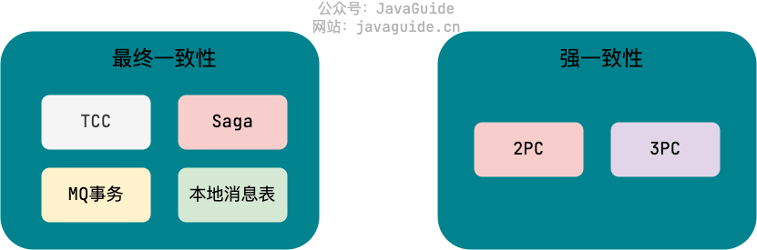

## 分布式事务解决方案

分布式事务的解决方案有很多，比如：**2PC**、**3PC**、**TCC**、**本地消息表**、**MQ 事务**（Kafka 和 RocketMQ 都提供了事务相关功能） 、**Saga** 等等。

2PC、3PC 属于业务代码无侵入方案，都是基于 XA 规范衍生出来的实现，XA 规范是 X/Open 组织定义的分布式事务处理（DTP，Distributed Transaction Processing）标准。TCC、Saga 属于业务侵入方案，MQ 事务依赖于使用消息队列的场景，本地消息表不支持回滚。

这些方案的适用场景有所区别，我们需要根据具体的场景选择适合自己项目的解决方案。

开始介绍 2PC 和 3PC 之前，我们先来介绍一下 2PC 和 3PC 涉及到的一些角色（XA 规范的角色组成）：

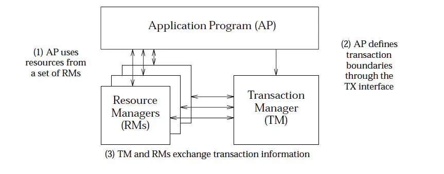

* **AP（Application Program）**：应用程序本身。
* **RM（Resource Manager）** ：资源管理器，也就是事务的参与者，绝大部分情况下就是指数据库（后文会以关系型数据库为例），一个分布式事务往往涉及到多个 RM。
* **TM（Transaction Manager）** ：事务管理器，负责管理全局事务，分配事务唯一标识，监控事务的执行进度，并负责事务的提交、回滚、失败恢复等。

### 2PC（两阶段提交协议）

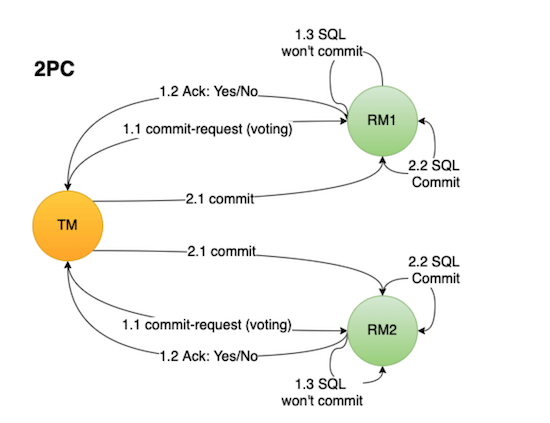

2PC（Two-Phase Commit）这三个字母的含义:

* **2** -> 指代事务提交的 2 个阶段
* **P**-> Prepare (准备阶段)
* **C** ->Commit（提交阶段）

2PC 将事务的提交过程分为 2 个阶段：**准备阶段** 和 **提交阶段** 。

#### 准备阶段(Prepare)

准备阶段的核心是“询问”事务参与者执行本地数据库事务操作是否成功。

准备阶段的工作流程：

1. **事务协调者/管理者（后文简称 TM）** 向所有涉及到的 **事务参与者（后文简称 RM）** 发送消息询问：“你是否可以执行事务操作呢？”，并等待其答复。
2. **RM** 接收到消息之后，开始执行本地数据库事务预操作比如写 redo log/undo log 日志，**此时并不会提交事务** 。
3. **RM** 如果执行本地数据库事务操作成功，那就回复“Yes”表示我已就绪，否则就回复“No”表示我未就绪。

#### 提交阶段(Commit)

提交阶段的核心是“询问”事务参与者提交本地事务是否成功。

当所有事务参与者都是“就绪”状态的话：

1. **TM** 向所有参与者发送消息：“你们可以提交事务啦！”（**Commit 消息**）
2. **RM** 接收到 **Commit 消息** 后执行 **提交本地数据库事务** 操作，执行完成之后 **释放整个事务期间所占用的资源**。
3. **RM** 回复：“事务已经提交” （**ACK 消息**）。
4. **TM** 收到所有 **事务参与者** 的 **ACK 消息** 之后，整个分布式事务过程正式结束。

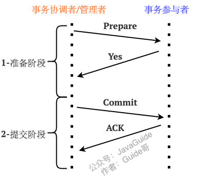

当任一事务参与者是“未就绪”状态的话：

1. **TM** 向所有参与者发送消息：“你们可以执行回滚操作了！”（**Rollback 消息**）。
2. **RM** 接收到 **Rollback 消息** 后执行 **本地数据库事务回滚** 执行完成之后 **释放整个事务期间所占用的资源**。
3. **RM** 回复：“事务已经回滚” （**ACK 消息**）。
4. **TM** 收到所有 **RM** 的 **ACK 消息** 之后，中断事务。

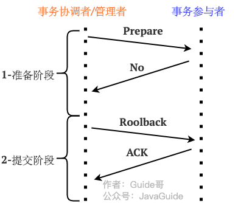

#### 总结

简单总结一下 **2PC** 两阶段中比较重要的一些点：

1. **准备阶段** 的主要目的是测试 **RM** 能否执行 **本地数据库事务** 操作（!!!注意：这一步并不会提交事务）。
2. **提交阶段** 中 **TM** 会根据 **准备阶段** 中 **RM** 的消息来决定是执行事务提交还是回滚操作。
3. **提交阶段** 之后一定会结束当前的分布式事务

**2PC 的优点：**

* 实现起来非常简单，各大主流数据库比如 MySQL、Oracle 都有自己实现。
* 针对的是数据强一致性。不过，仍然可能存在数据不一致的情况。

**2PC 存在的问题：**

* **同步阻塞** ：事务参与者会在正式提交事务之前会一直占用相关的资源。比如用户小明转账给小红，那其他事务也要操作用户小明或小红的话，就会阻塞。
* **数据不一致** ：由于网络问题或者TM宕机都有可能会造成数据不一致的情况。比如在第2阶段（提交阶段），部分网络出现问题导致部分参与者收不到 Commit/Rollback 消息的话，就会导致数据不一致。
* **单点问题** ： TM在其中也是一个很重要的角色，如果TM在准备(Prepare)阶段完成之后挂掉的话，事务参与者就会一直卡在提交(Commit)阶段。

### 3PC（三阶段提交协议）

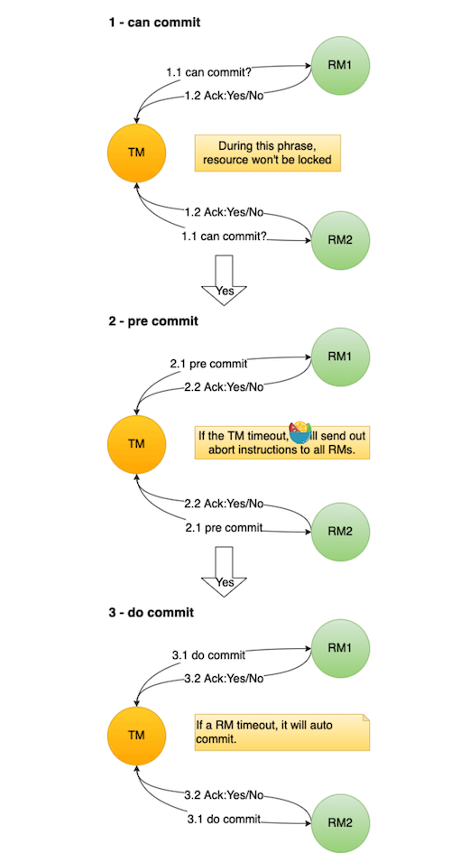

3PC 是人们在 2PC 的基础上做了一些优化得到的。3PC 把 2PC 中的 **准备阶段(Prepare)** 做了进一步细化，分为 2 个阶段：

* 准备阶段(CanCommit)
* 预提交阶段(PreCommit)

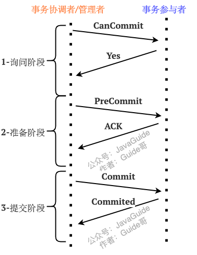

#### 准备阶段(CanCommit)

<font style="color:rgb(59, 69, 78);">准备阶段 RM 不会执行事务操作，TM 只是向 RM 发送 </font>**<font style="color:rgb(59, 69, 78);">准备请求</font>**<font style="color:rgb(59, 69, 78);"> ，顺便询问一些信息比如事务参与者能否执行本地数据库事务操作。RM 回复“Yes”、“No”或者直接超时未回复。</font>

#### 预提交阶段(PreCommit)

如果准备阶段所有的 RM 回复 “Yes”的话，TM 就会向所有的 RM 发送 **PreCommit 消息（预提交请求）** ，RM 收到消息之后会执行本地数据库事务预操作比如写 redo log/undo log 日志。

如果准备阶段有任一 RM 回复“NO” 或者直接超时未回复的话，TM 就会给所有 RM 发送 **Abort 消息（中断请求）** ，RM 收到消息后直接中断事务。这样其实对 RM 来说损失并不大，因为本质上 RM 到现在还并没有实际做什么事情。

如果 RM 成功的执行了事务预操作，就返回 “YES”。否则，返回“No”（最后的反悔机会）。

预提交阶段 TM 与 RM 都引入了超时机制，如果 **参与者** 没有收到 TM 的 PreCommit 消息，或者 TM 没有收到参与者返回的预执行结果状态，那么在超过等待时间后，事务就会中断，这就避免了事务的阻塞。

#### 执行事务提交阶段（DoCommit）

**执行事务提交（DoCommit）** 阶段就开始进行真正的事务提交。

如果预提交阶段所有的 RM 回复 “YES”的话，TM 就会向所有的 RM 发送 **DoCommit 消息（执行事务提交请求）** ，RM 收到消息之后会执行本地数据库事务提交，并在完成后释放占用的资源。当事务提交成功后，RM 会返回 “YES”。

如果预提交阶段有任一 RM 回复“NO”或者直接超时未回复的话，TM 就会给所有 RM 发送 **Abort 消息（中断请求）** ，RM 收到消息后会进行事务回滚，释放资源，中断本次事务。

如果 RM 在设定时间内并没有 TM 的 DoCommit 消息，RM 会认为 TM 可能发生了故障，会直接进行事务提交。

只要预提交阶段阶段所有参与者 都返回了`Yes`，那么只要进入第三阶段，事务基本上都能执行成功的。

#### 总结

**3PC 除了将2PC 中的准备阶段(Prepare) 做了进一步细化之外，还做了哪些改进？**

3PC 还同时在事务管理者和事务参与者中引入了 **超时机制** ，如果在一定时间内没有收到事务参与者的消息就默认失败，进而避免事务参与者一直阻塞占用资源。2PC 中只有事务管理者才拥有超时机制，当事务参与者长时间无法与事务协调者通讯的情况下（比如协调者挂掉了），就会导致无法释放资源阻塞的问题。

不过，3PC 并没有完美解决 2PC 的阻塞问题，引入了一些新问题比如性能糟糕，而且，依然存在数据不一致性问题。因此，3PC 的实际应用并不是很广泛，多数应用会选择通过复制状态机解决 2PC 的阻塞问题。

### TCC（补偿事务）

TCC 属于目前比较火的一种柔性事务解决方案。TCC 这个概念最早诞生于数据库专家帕特 · 赫兰德（Pat Helland）于 2007 发表的 [《Life beyond Distributed Transactions: an Apostate’s Opinion》](https://www.ics.uci.edu/~cs223/papers/cidr07p15.pdf) 这篇论文，感兴趣的小伙伴可以阅读一下这篇论文。

简单来说，TCC 是 Try、Confirm、Cancel 三个词的缩写，它分为三个阶段：

1. **Try（尝试）阶段** : 尝试执行。完成业务检查，并预留好必需的业务资源。
2. **Confirm（确认）阶段** ：确认执行。当所有事务参与者的 Try 阶段执行成功就会执行 Confirm ，Confirm 阶段会处理 Try 阶段预留的业务资源。否则，就会执行 Cancel 。
3. **Cancel（取消）阶段** ：取消执行，释放 Try 阶段预留的业务资源。

每个阶段由业务代码控制，这样可以避免长事务，性能更好。

我们拿转账场景来说：

1. **Try（尝试）阶段** : 在转账场景下，Try 要做的事情是就是检查账户余额是否充足，预留的资源就是转账资金。
2. **Confirm（确认）阶段** ： 如果 Try 阶段执行成功的话，Confirm 阶段就会执行真正的扣钱操作。
3. **Cancel（取消）阶段** ：释放 Try 阶段预留的转账资金。

一般情况下，当我们使用`TCC`模式的时候，需要自己实现 `try`, `confirm`, `cancel` 这三个方法，来达到最终一致性。

正常情况下，会执行 `try`, `confirm` 方法。

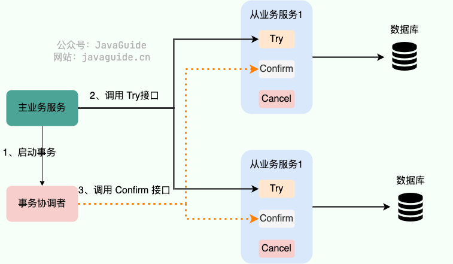

出现异常的话，会执行 `try`, `cancel` 方法。

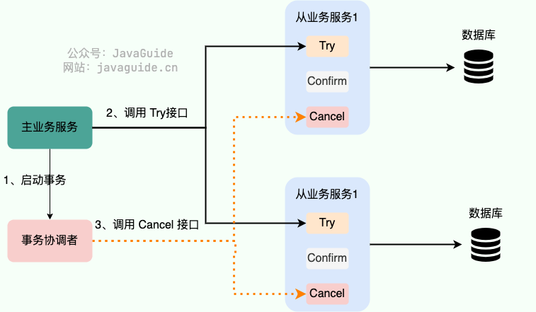

Try 阶段出现问题的话，可以执行 Cancel。**那如果 Confirm 或者 Cancel 阶段失败了怎么办呢？**

TCC 会记录事务日志并持久化事务日志到某种存储介质上比如本地文件、关系型数据库、Zookeeper，事务日志包含了事务的执行状态，通过事务执行状态可以判断出事务是提交成功了还是提交失败了，以及具体失败在哪一步。如果发现是 Confirm 或者 Cancel 阶段失败的话，会进行重试，继续尝试执行 Confirm 或者 Cancel 阶段的逻辑。重试的次数通常为 6 次，如果超过重试的次数还未成功执行的话，就需要人工介入处理了。

如果代码没有特殊 Bug 的话，Confirm 或者 Cancel 阶段出现问题的概率是比较小的。

**事务日志会被删除吗？** 会的。如果事务提交成功（没有抛出任何异常），就可以删除对应的事务日志，节省资源。

**TCC 模式不需要依赖于底层数据资源的事务支持，但是需要我们手动实现更多的代码**，属于 **侵入业务代码** 的一种分布式解决方案。

TCC 事务模型的思想类似 2PC，我简单花了一张图对比一下二者。

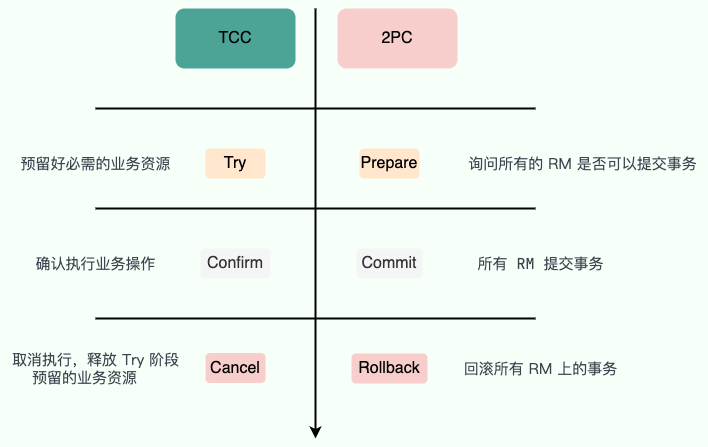

**TCC 和 2PC/3PC 有什么区别呢？**

* 2PC/3PC 依靠数据库或者存储资源层面的事务，TCC 主要通过修改业务代码来实现。
* 2PC/3PC 属于业务代码无侵入的，TCC 对业务代码有侵入。
* 2PC/3PC 追求的是强一致性，在两阶段提交的整个过程中，一直会持有数据库的锁。TCC 追求的是最终一致性，不会一直持有各个业务资源的锁。

针对 TCC 的实现，业界也有一些不错的开源框架。不同的框架对于 TCC 的实现可能略有不同，不过大致思想都一样。

1. [**ByteTCC**](https://github.com/liuyangming/ByteTCC) : ByteTCC 是基于 Try-Confirm-Cancel（TCC）机制的分布式事务管理器的实现。 相关阅读：[关于如何实现一个 TCC 分布式事务框架的一点思考](https://www.bytesoft.org/how-to-impl-tcc/)
2. [**Seata**](https://seata.io/zh-cn/index.html) :Seata 是一款开源的分布式事务解决方案，致力于在微服务架构下提供高性能和简单易用的分布式事务服务。
3. [**Hmily**](https://gitee.com/shuaiqiyu/hmily) : 金融级分布式事务解决方案。

### MQ 事务

RocketMQ 、 Kafka、Pulsar 、QMQ 都提供了事务相关的功能。事务允许事件流应用将消费，处理，生产消息整个过程定义为一个原子操作。

这里我们拿 RocketMQ 来说（图源：《消息队列高手课》）。相关阅读：[RocketMQ 事务消息参考文档](https://rocketmq.apache.org/docs/transaction-example/) 。

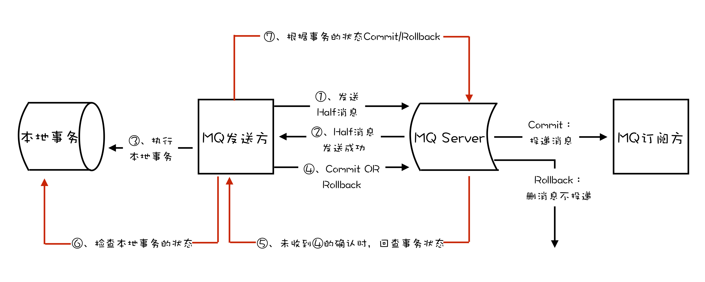

1. MQ 发送方（比如物流服务）在消息队列上开启一个事务，然后发送一个“半消息”给 MQ Server/Broker。事务提交之前，半消息对于 MQ 订阅方/消费者（比如第三方通知服务）不可见
2. “半消息”发送成功的话，MQ 发送方就开始执行本地事务。
3. MQ 发送方的本地事务执行成功的话，“半消息”变成正常消息，可以正常被消费。MQ 发送方的本地事务执行失败的话，会直接回滚。

从上面的流程中可以看出，MQ 的事务消息使用的是两阶段提交（2PC），简单来说就是咱先发送半消息，等本地事务执行成功之后，半消息才变为正常消息。

**如果 MQ 发送方提交或者回滚事务消息时失败怎么办？**

RocketMQ 中的 Broker 会定期去 MQ 发送方上反查这个事务的本地事务的执行情况，并根据反查结果决定提交或者回滚这个事务。

事务反查机制的实现依赖于我们业务代码实现的对应的接口，比如你要查看创建物流信息的本地事务是否执行成功的话，直接在数据库中查询对应的物流信息是否存在即可。

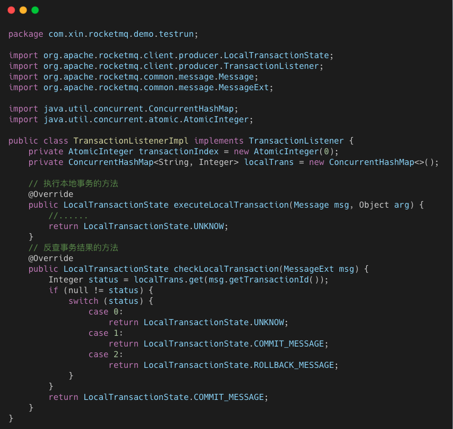

**如果正常消息没有被正确消费怎么办呢？**

消息消费失败的话，RocketMQ 会自动进行消费重试。如果超过最大重试次数这个消息还是没有正确消费，RocketMQ 就会认为这个消息有问题，然后将其放到 **死信队列**。

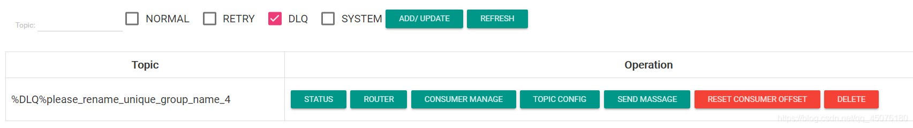

进入死信队列的消费一般需要人工处理，手动排查问题。

**QMQ**  的事务消息就没有 RocketMQ 实现的那么复杂了，它借助了数据库自带的事务功能。其核心思想其实就是 eBay 提出的 **本地消息表** 方案，将分布式事务拆分成本地事务进行处理。

我们维护一个本地消息表用来存放消息发送的状态，保存消息发送情况到本地消息表的操作和业务操作要在一个事务里提交。这样的话，业务执行成功代表消息表也写入成功。

然后，我们再单独起一个线程定时轮询消息表，把没处理的消息发送到消息中间件。

消息发送成功后，更新消息状态为成功或者直接删除消息。

RocketMQ 的事务消息方案中，如果消息队列挂掉，数据库事务就无法执行了，整个应用也就挂掉了。

QMQ 的事务消息方案中，即使消息队列挂了也不会影响数据库事务的执行。

因此，QMQ 实现的方案能更加适应于大多数业务。不过，这种方法同样适用于其他消息队列，只能说 QMQ 封装的更好，开箱即用罢了！

相关阅读： [面试官：RocketMQ 分布式事务消息的缺点？](https://mp.weixin.qq.com/s/cBx1l1zaThN6_808fMl27g)

### Saga

Saga 绝对可以说是历史非常悠久了，Saga 事务理论在 1987 年 Hector & Kenneth 在 ACM 发表的论文 [《Sagas》](https://www.cs.cornell.edu/andru/cs711/2002fa/reading/sagas.pdf) 中就被提出了，早于分布式事务概念的提出。

Saga 属于长事务解决方案，其核心思想是将长事务拆分为多个本地短事务（本地短事务序列）。

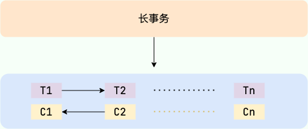

* 长事务 —> T1,T2 ~ Tn 个本地短事务
* 每个短事务都有一个补偿动作 —> C1,C2 ~ Cn

下图来自于 [微软技术文档—Saga 分布式事务](https://docs.microsoft.com/zh-cn/azure/architecture/reference-architectures/saga/saga) 。

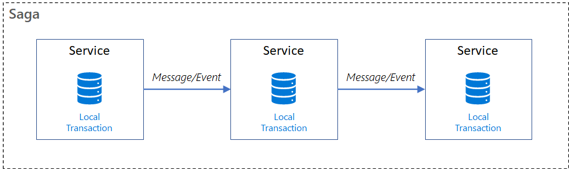

如果 T1,T2 ~ Tn 这些短事务都能顺利完成的话，整个事务也就顺利结束，否则，将采取恢复模式。

**反向恢复** ：

* 简介：如果 Ti 短事务提交失败，则补偿所有已完成的事务（一直执行 Ci 对 Ti 进行补偿）。
* 执行顺序：T1，T2，…，Ti（失败），Ci（补偿），…，C2，C1。

**正向恢复** ：

* 简介：如果 Ti 短事务提交失败，则一直对 Ti 进行重试，直至成功为止。
* 执行顺序：T1，T2，…，Ti（失败），Ti（重试）…，Ti+1，…，Tn。

和 TCC 类似，Saga 正向操作与补偿操作都需要业务开发者自己实现，因此也属于 **侵入业务代码** 的一种分布式解决方案。和 TCC 很大的一点不同是 Saga 没有“Try” 动作，它的本地事务 Ti 直接被提交。因此，性能非常高！

理论上来说，补偿操作一定能够执行成功。不过，当网络出现问题或者服务器宕机的话，补偿操作也会执行失败。这种情况下，往往需要我们进行人工干预。并且，为了能够提高容错性（比如 Saga 系统本身也可能会崩溃），保证所有的短事务都得以提交或补偿，我们还需要将这些操作通过日志记录下来（Saga log，类似于数据库的日志机制）。这样，Saga 系统恢复之后，我们就知道短事务执行到哪里了或者补偿操作执行到哪里了。

另外，因为 Saga 没有进行“Try” 动作预留资源，所以不能保证隔离性。这也是 Saga 比较大的一个缺点。

针对 Saga 的实现，业界也有一些不错的开源框架。不同的框架对于 Saga 的实现可能略有不同，不过大致思想都一样。

1. [**ServiceComb Pack**](https://github.com/apache/servicecomb-pack) ：微服务应用的数据最终一致性解决方案。
2. [**Seata**](https://seata.io/zh-cn/index.html) :Seata 是一款开源的分布式事务解决方案，致力于在微服务架构下提供高性能和简单易用的分布式事务服务。

## 分布式事务开源项目

1. [**Seata**](http://seata.io/zh-cn/) ：Seata 是一款开源的分布式事务解决方案，致力于在微服务架构下提供高性能和简单易用的分布式事务服务。经历过双 11 的实战考验。
2. [**Hmily**](https://gitee.com/dromara/hmily) ：Hmily 是一款高性能，零侵入，金融级分布式事务解决方案，目前主要提供柔性事务的支持，包含 `TCC`, `TAC`(自动生成回滚 SQL) 方案，未来还会支持 `XA` 等方案。个人开发项目，目前在京东数科重启，未来会成为京东数科的分布式事务解决方案。
3. [**Raincat**](https://gitee.com/dromara/Raincat) : 2 阶段提交分布式事务中间件。
4. [**Myth**](https://gitee.com/dromara/myth) : 采用消息队列解决分布式事务的开源框架, 基于 Java 语言来开发（JDK1.8），支持 Dubbo，SpringCloud,Motan 等 rpc 框架进行分布式事务。


> 更新: 2023-11-18 16:03:43  
> 原文: <https://www.yuque.com/snailclimb/mf2z3k/ng9vmg>