# Netty 常见面试题总结

很多小伙伴搞不清楚为啥要学习 Netty ，正式今天这篇文章开始之前，简单说一下自己的看法：

* Netty 基于 NIO （NIO 是一种同步非阻塞的 I/O 模型，在 Java 1.4 中引入了 NIO），使用 Netty 可以极大地简化 TCP 和 UDP 套接字服务器等网络编程，并且性能以及安全性等很多方面都非常优秀。
* 我们平常经常接触的 Dubbo、RocketMQ、Elasticsearch、gRPC、Spark 等等热门开源项目都用到了 Netty。
* 大部分微服务框架底层涉及到网络通信的部分都是基于 Netty 来做的，比如说 Spring Cloud 生态系统中的网关 Spring Cloud Gateway。

简单总结一下和 Netty 相关问题。

## BIO,NIO 和 AIO 有啥区别？

👨‍💻**面试官** ：先来简单介绍一下 BIO,NIO 和 AIO 3 者的区别吧！

🙋 **我** ：好的！

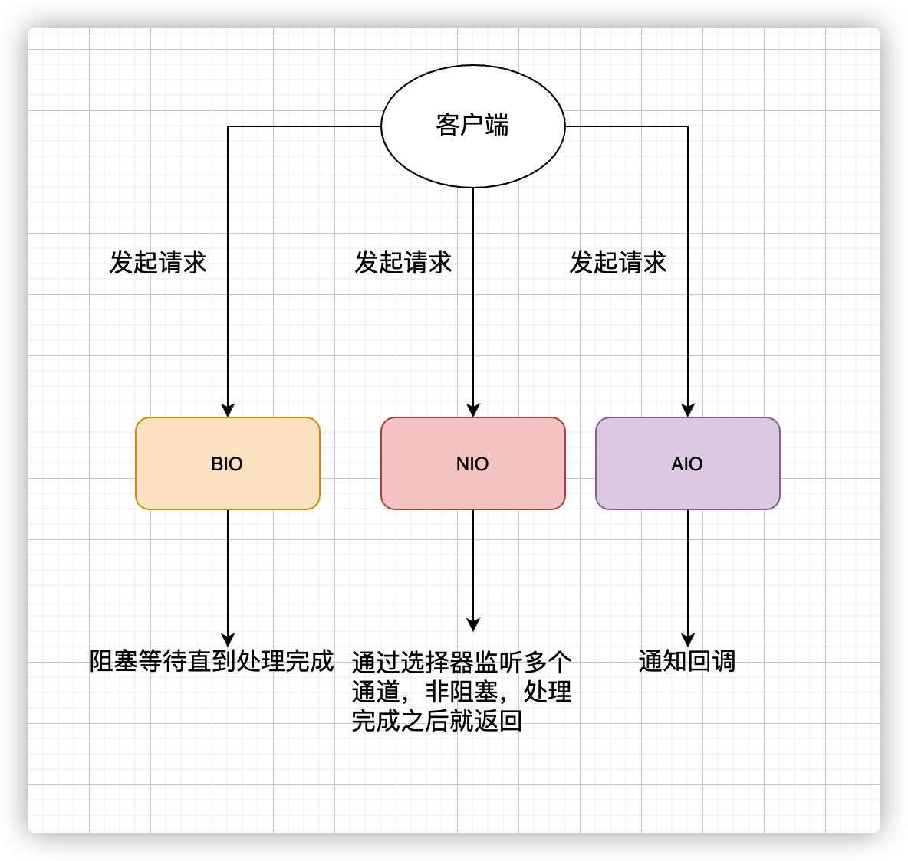

* **BIO (Blocking I/O):** 同步阻塞 I/O 模式，数据的读取写入必须阻塞在一个线程内等待其完成。在客户端连接数量不高的情况下，是没问题的。但是，当面对十万甚至百万级连接的时候，传统的 BIO 模型是无能为力的。因此，我们需要一种更高效的 I/O 处理模型来应对更高的并发量。
* **NIO (Non-blocking/New I/O):** NIO 是一种同步非阻塞的 I/O 模型，于 Java 1.4 中引入，对应 `java.nio`包，提供了 `Channel` , `Selector`，`Buffer` 等抽象。NIO 中的 N 可以理解为 Non-blocking，不单纯是 New。它支持面向缓冲的，基于通道的 I/O 操作方法。 NIO 提供了与传统 BIO 模型中的 `Socket` 和 `ServerSocket` 相对应的 `SocketChannel` 和 `ServerSocketChannel` 两种不同的套接字通道实现,两种通道都支持阻塞和非阻塞两种模式。对于高负载、高并发的（网络）应用，应使用 NIO 的非阻塞模式来开发
* **AIO (Asynchronous I/O):** AIO 也就是 NIO 2。在 Java 7 中引入了 NIO 的改进版 NIO 2,它是异步非阻塞的 IO 模型。异步 IO 是基于事件和回调机制实现的，也就是应用操作之后会直接返回，不会堵塞在那里，当后台处理完成，操作系统会通知相应的线程进行后续的操作。AIO 是异步 IO 的缩写，虽然 NIO 在网络操作中，提供了非阻塞的方法，但是 NIO 的 IO 行为还是同步的。对于 NIO 来说，我们的业务线程是在 IO 操作准备好时，得到通知，接着就由这个线程自行进行 IO 操作，IO 操作本身是同步的。查阅网上相关资料，我发现就目前来说 AIO 的应用还不是很广泛，Netty 之前也尝试使用过 AIO，不过又放弃了。

关于 IO 模型更详细的介绍，你可以看这篇文章：[《常见的 IO 模型有哪些？Java 中的 BIO、NIO、AIO 有啥区别？》](https://javaguide.cn/java/io/io-model.html) 这篇文章。

## Netty 是什么？

👨‍💻**面试官** ：那你再来介绍一下自己对 Netty 的认识吧！小伙子。

🙋 **我** ：好的！那我就简单用 3 点来概括一下 Netty 吧！

1. Netty 是一个 **基于 NIO** 的 client-server(客户端服务器)框架，使用它可以快速简单地开发网络应用程序。
2. 它极大地简化并优化了 TCP 和 UDP 套接字服务器等网络编程,并且性能以及安全性等很多方面甚至都要更好。
3. **支持多种协议** 如 FTP，SMTP，HTTP 以及各种二进制和基于文本的传统协议。

用官方的总结就是：**Netty 成功地找到了一种在不妥协可维护性和性能的情况下实现易于开发，性能，稳定性和灵活性的方法。**

*网络编程我愿意称中 Netty 为王 。*

## 为啥不直接用 NIO 呢?

👨‍💻**面试官** ：你上面也说了 Netty 基于 NIO，那为啥不直接用 NIO 呢?。

不用 NIO 主要是因为 NIO 的编程模型复杂而且存在一些 BUG，并且对编程功底要求比较高。下图就是一个典型的使用 NIO 进行编程的案例：

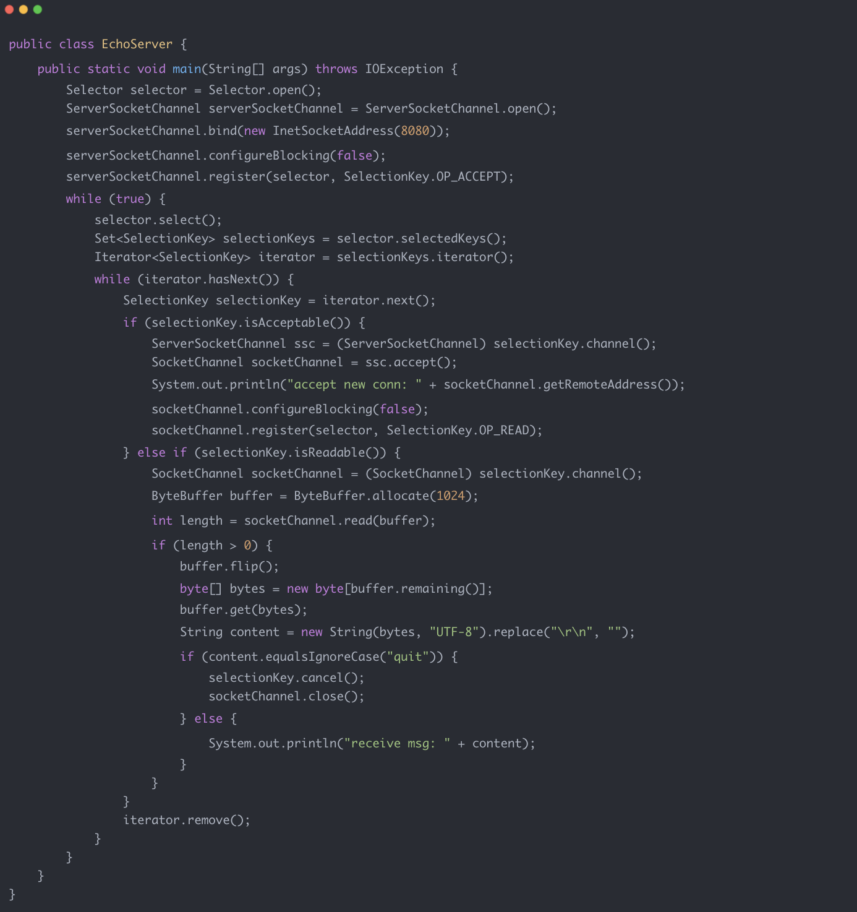

而且，NIO 在面对断连重连、包丢失、粘包等问题时处理过程非常复杂。Netty 的出现正是为了解决这些问题，更多关于 Netty 的特点可以看下面的内容。

## 为什么要用 Netty？

👨‍💻**面试官** ：为什么要用 Netty 呢？能不能说一下自己的看法。

🙋 **我** ：因为 Netty 具有下面这些优点，并且相比于直接使用 JDK 自带的 NIO 相关的 API 来说更加易用。

* 统一的 API，支持多种传输类型，阻塞和非阻塞的。
* 简单而强大的线程模型。
* 自带编解码器解决 TCP 粘包/拆包问题。
* 自带各种协议栈。
* 真正的无连接数据包套接字支持。
* 比直接使用 Java 核心 API 有更高的吞吐量、更低的延迟、更低的资源消耗和更少的内存复制。
* 安全性不错，有完整的 SSL/TLS 以及 StartTLS 支持。
* 社区活跃
* 成熟稳定，经历了大型项目的使用和考验，而且很多开源项目都使用到了 Netty， 比如我们经常接触的 Dubbo、RocketMQ 等等。
* ......

## Netty 应用场景了解么？

👨‍💻**面试官** ：能不能通俗地说一下使用 Netty 可以做什么事情？

🙋 **我** ：凭借自己的了解，简单说一下吧！理论上来说，NIO 可以做的事情 ，使用 Netty 都可以做并且更好。Netty 主要用来做**网络通信** :

1. **作为 RPC 框架的网络通信工具** ： 我们在分布式系统中，不同服务节点之间经常需要相互调用，这个时候就需要 RPC 框架了。不同服务节点的通信是如何做的呢？可以使用 Netty 来做。比如我调用另外一个节点的方法的话，至少是要让对方知道我调用的是哪个类中的哪个方法以及相关参数吧！
2. **实现一个自己的 HTTP 服务器** ：通过 Netty 我们可以自己实现一个简单的 HTTP 服务器，这个大家应该不陌生。说到 HTTP 服务器的话，作为 Java 后端开发，我们一般使用 Tomcat 比较多。一个最基本的 HTTP 服务器可要以处理常见的 HTTP Method 的请求，比如 POST 请求、GET 请求等等。
3. **实现一个即时通讯系统** ： 使用 Netty 我们可以实现一个可以聊天类似微信的即时通讯系统，这方面的开源项目还蛮多的，可以自行去 Github 找一找。
4. **实现消息推送系统** ：市面上有很多消息推送系统都是基于 Netty 来做的。
5. ......

## 哪些开源项目用到了 Netty?

我们平常经常接触的 Dubbo、RocketMQ、Elasticsearch、gRPC 等等都用到了 Netty。

可以说大量的开源项目都用到了 Netty，所以掌握 Netty 有助于你更好的使用这些开源项目并且让你有能力对其进行二次开发。

实际上还有很多很多优秀的项目用到了 Netty,Netty 官方也做了统计，统计结果在这里：<https://netty.io/wiki/related-projects.html> 。

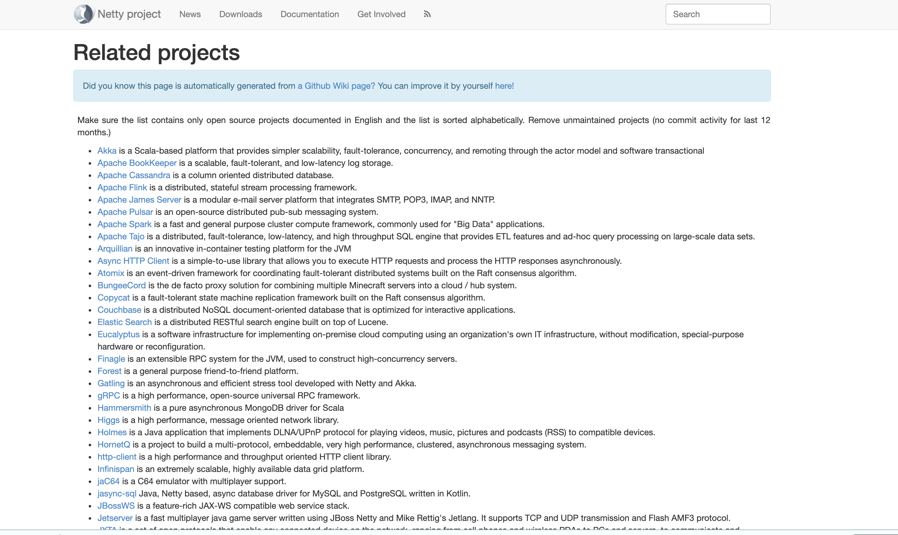

## 介绍一下 Netty 的核心组件？

👨‍💻**面试官** ：Netty 核心组件有哪些？分别有什么作用？

🙋 **我** ：表面上，嘴上开始说起 Netty 的核心组件有哪些，实则，内心已经开始 mmp 了，深度怀疑这面试官是存心搞我啊！

简单介绍 Netty 最核心的一些组件（*对于每一个组件这里不详细介绍*）。通过下面这张图你可以将我提到的这些 Netty 核心组件串联起来。

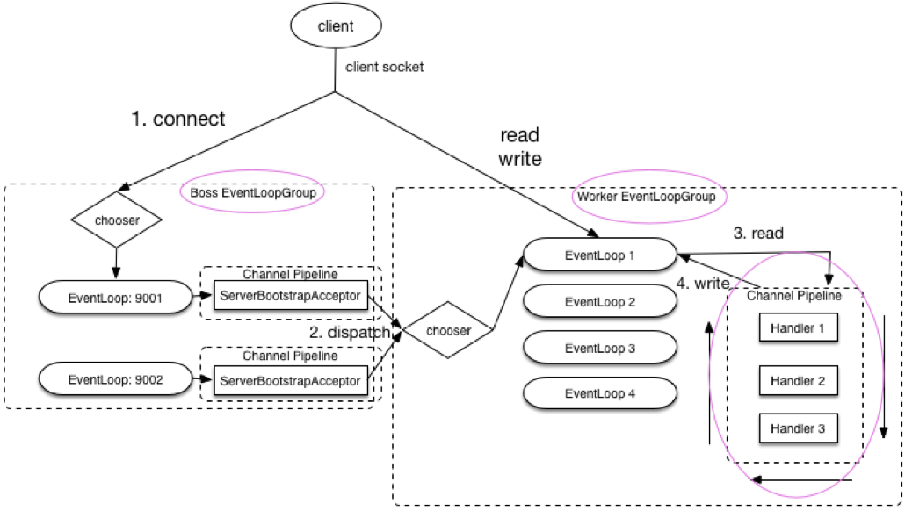

### Bytebuf（字节容器）

**网络通信最终都是通过字节流进行传输的。 **<code>**ByteBuf**</code>** 就是 Netty 提供的一个字节容器，其内部是一个字节数组。** 当我们通过 Netty 传输数据的时候，就是通过 `ByteBuf` 进行的。

我们可以将 `ByteBuf` 看作是 Netty 对 Java NIO 提供了 `ByteBuffer` 字节容器的封装和抽象。

有很多小伙伴可能就要问了 ： **为什么不直接使用 Java NIO 提供的 **<code>**ByteBuffer**</code>** 呢？**

因为 `ByteBuffer` 这个类使用起来过于复杂和繁琐。

### Bootstrap 和 ServerBootstrap（启动引导类）

<code>**Bootstrap**</code>\*\* 是客户端的启动引导类/辅助类\*\*，具体使用方法如下：

```java
        EventLoopGroup group = new NioEventLoopGroup();
        try {
            //创建客户端启动引导/辅助类：Bootstrap
            Bootstrap b = new Bootstrap();
            //指定线程模型
            b.group(group).
                    ......
            // 尝试建立连接
            ChannelFuture f = b.connect(host, port).sync();
            f.channel().closeFuture().sync();
        } finally {
            // 优雅关闭相关线程组资源
            group.shutdownGracefully();
        }
```

<code>**ServerBootstrap**</code>\*\* 是服务端的启动引导类/辅助类\*\*，具体使用方法如下：

```java
        // 1.bossGroup 用于接收连接，workerGroup 用于具体的处理
        EventLoopGroup bossGroup = new NioEventLoopGroup(1);
        EventLoopGroup workerGroup = new NioEventLoopGroup();
        try {
            //2.创建服务端启动引导/辅助类：ServerBootstrap
            ServerBootstrap b = new ServerBootstrap();
            //3.给引导类配置两大线程组,确定了线程模型
            b.group(bossGroup, workerGroup).
                   ......
            // 6.绑定端口
            ChannelFuture f = b.bind(port).sync();
            // 等待连接关闭
            f.channel().closeFuture().sync();
        } finally {
            //7.优雅关闭相关线程组资源
            bossGroup.shutdownGracefully();
            workerGroup.shutdownGracefully();
        }
    }
```

从上面的示例中，我们可以看出：

1. `Bootstrap` 通常使用 `connect()` 方法连接到远程的主机和端口，作为一个 Netty TCP 协议通信中的客户端。另外，`Bootstrap` 也可以通过 `bind()` 方法绑定本地的一个端口，作为 UDP 协议通信中的一端。
2. `ServerBootstrap`通常使用 `bind()` 方法绑定本地的端口上，然后等待客户端的连接。
3. `Bootstrap` 只需要配置一个线程组— `EventLoopGroup` ,而 `ServerBootstrap`需要配置两个线程组— `EventLoopGroup` ，一个用于接收连接，一个用于具体的 IO 处理。

### Channel（网络操作抽象类）

`Channel` 接口是 Netty 对网络操作抽象类。通过 `Channel` 我们可以进行 I/O 操作。

一旦客户端成功连接服务端，就会新建一个 `Channel` 同该用户端进行绑定，示例代码如下：

```java
   //  通过 Bootstrap 的 connect 方法连接到服务端
   public Channel doConnect(InetSocketAddress inetSocketAddress) {
        CompletableFuture<Channel> completableFuture = new CompletableFuture<>();
        bootstrap.connect(inetSocketAddress).addListener((ChannelFutureListener) future -> {
            if (future.isSuccess()) {
                completableFuture.complete(future.channel());
            } else {
                throw new IllegalStateException();
            }
        });
        return completableFuture.get();
    }
```

比较常用的`Channel`接口实现类是 ：

* `NioServerSocketChannel`（服务端）
* `NioSocketChannel`（客户端）

这两个 `Channel` 可以和 BIO 编程模型中的`ServerSocket`以及`Socket`两个概念对应上。

### EventLoop（事件循环）

#### EventLoop 介绍

这么说吧！`EventLoop`（事件循环）接口可以说是 Netty 中最核心的概念了！

《Netty 实战》这本书是这样介绍它的：

> `EventLoop` 定义了 Netty 的核心抽象，用于处理连接的生命周期中所发生的事件。

是不是很难理解？说实话，我学习 Netty 的时候看到这句话是没太能理解的。

说白了，<code>**EventLoop**</code>\*\* 的主要作用实际就是责监听网络事件并调用事件处理器进行相关 I/O 操作（读写）的处理。\*\*

#### Channel 和 EventLoop 的关系

那 `Channel` 和 `EventLoop` 直接有啥联系呢？

<code>**Channel**</code>\*\* 为 Netty 网络操作(读写等操作)抽象类，**<code>**EventLoop**</code>** 负责处理注册到其上的\*\*<code>**Channel**</code>\*\* 的 I/O 操作，两者配合进行 I/O 操作。\*\*

#### EventloopGroup 和 EventLoop 的关系

`EventLoopGroup` 包含多个 `EventLoop`（每一个 `EventLoop` 通常内部包含一个线程），它管理着所有的 `EventLoop` 的生命周期。

并且，<code>**EventLoop**</code>\*\* 处理的 I/O 事件都将在它专有的 **<code>**Thread**</code>** 上被处理，即 **<code>**Thread**</code>** 和 **<code>**EventLoop**</code>** 属于 1 : 1 的关系，从而保证线程安全。\*\*

下图是 Netty **NIO** 模型对应的 `EventLoop` 模型。通过这个图应该可以将`EventloopGroup`、`EventLoop`、 `Channel`三者联系起来。

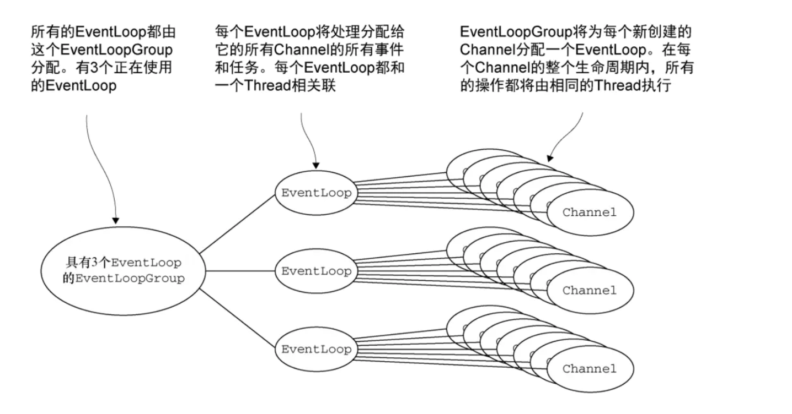

<font style="color:gray;">https://www.jianshu.com/p/128ddc36e713</font>

### ChannelHandler（消息处理器） 和 ChannelPipeline（ChannelHandler 对象链表）

下面这段代码使用过 Netty 的小伙伴应该不会陌生，我们指定了序列化编解码器以及自定义的 `ChannelHandler` 处理消息。

```java
        b.group(eventLoopGroup)
                .handler(new ChannelInitializer<SocketChannel>() {
                    @Override
                    protected void initChannel(SocketChannel ch) {
                        ch.pipeline().addLast(new NettyKryoDecoder(kryoSerializer, RpcResponse.class));
                        ch.pipeline().addLast(new NettyKryoEncoder(kryoSerializer, RpcRequest.class));
                        ch.pipeline().addLast(new KryoClientHandler());
                    }
                });
```

<code>**ChannelHandler**</code>\*\* 是消息的具体处理器，主要负责处理客户端/服务端接收和发送的数据。\*\*

当 `Channel` 被创建时，它会被自动地分配到它专属的 `ChannelPipeline`。 一个`Channel`包含一个 `ChannelPipeline`。 `ChannelPipeline` 为 `ChannelHandler` 的链，一个 pipeline 上可以有多个 `ChannelHandler`。

我们可以在 `ChannelPipeline` 上通过 `addLast()` 方法添加一个或者多个`ChannelHandler` （*一个数据或者事件可能会被多个 Handler 处理*） 。当一个 `ChannelHandler` 处理完之后就将数据交给下一个 `ChannelHandler` 。

当 `ChannelHandler` 被添加到的 `ChannelPipeline` 它得到一个 `ChannelHandlerContext`，它代表一个 `ChannelHandler` 和 `ChannelPipeline` 之间的“绑定”。 `ChannelPipeline` 通过 `ChannelHandlerContext`来间接管理 `ChannelHandler` 。

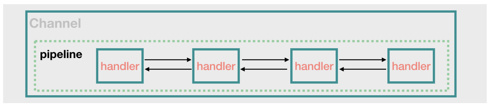

<font style="color:gray;">https://www.javadoop.com/post/netty-part-4</font>

### ChannelFuture（操作执行结果）

```java
public interface ChannelFuture extends Future<Void> {
    Channel channel();

    ChannelFuture addListener(GenericFutureListener<? extends Future<? super Void>> var1);
     ......

    ChannelFuture sync() throws InterruptedException;
}
```

Netty 中所有的 I/O 操作都为异步的，我们不能立刻得到操作是否执行成功。

不过，你可以通过 `ChannelFuture` 接口的 `addListener()` 方法注册一个 `ChannelFutureListener`，当操作执行成功或者失败时，监听就会自动触发返回结果。

```java
ChannelFuture f = b.connect(host, port).addListener(future -> {
  if (future.isSuccess()) {
    System.out.println("连接成功!");
  } else {
    System.err.println("连接失败!");
  }
}).sync();
```

并且，你还可以通过`ChannelFuture` 的 `channel()` 方法获取连接相关联的`Channel` 。

```java
Channel channel = f.channel();
```

另外，我们还可以通过 `ChannelFuture` 接口的 `sync()`方法让异步的操作变成同步的。

```java
//bind()是异步的，但是，你可以通过 sync()方法将其变为同步。
ChannelFuture f = b.bind(port).sync();
```

## NioEventLoopGroup 默认的构造函数会起多少线程？

👨‍💻**面试官** ：看过 Netty 的源码了么？`NioEventLoopGroup` 默认的构造函数会起多少线程呢？

🙋 **我** ：嗯嗯！看过部分。

回顾我们在上面写的服务器端的代码：

```java
// 1.bossGroup 用于接收连接，workerGroup 用于具体的处理
EventLoopGroup bossGroup = new NioEventLoopGroup(1);
EventLoopGroup workerGroup = new NioEventLoopGroup();
```

为了搞清楚`NioEventLoopGroup` 默认的构造函数 到底创建了多少个线程，我们来看一下它的源码。

```java
    /**
     * 无参构造函数。
     * nThreads:0
     */
    public NioEventLoopGroup() {
        //调用下一个构造方法
        this(0);
    }

    /**
     * Executor：null
     */
    public NioEventLoopGroup(int nThreads) {
        //继续调用下一个构造方法
        this(nThreads, (Executor) null);
    }

    //中间省略部分构造函数

    /**
     * RejectedExecutionHandler（）：RejectedExecutionHandlers.reject()
     */
    public NioEventLoopGroup(int nThreads, Executor executor, final SelectorProvider selectorProvider,final SelectStrategyFactory selectStrategyFactory) {
       //开始调用父类的构造函数
        super(nThreads, executor, selectorProvider, selectStrategyFactory, RejectedExecutionHandlers.reject());
    }
```

一直向下走下去的话，你会发现在 `MultithreadEventLoopGroup` 类中有相关的指定线程数的代码，如下：

```java
    // 从1，系统属性，CPU核心数*2 这三个值中取出一个最大的
    //可以得出 DEFAULT_EVENT_LOOP_THREADS 的值为CPU核心数*2
    private static final int DEFAULT_EVENT_LOOP_THREADS = Math.max(1, SystemPropertyUtil.getInt("io.netty.eventLoopThreads", NettyRuntime.availableProcessors() * 2));

    // 被调用的父类构造函数，NioEventLoopGroup 默认的构造函数会起多少线程的秘密所在
    // 当指定的线程数nThreads为0时，使用默认的线程数DEFAULT_EVENT_LOOP_THREADS
    protected MultithreadEventLoopGroup(int nThreads, ThreadFactory threadFactory, Object... args) {
        super(nThreads == 0 ? DEFAULT_EVENT_LOOP_THREADS : nThreads, threadFactory, args);
    }
```

综上，我们发现 `NioEventLoopGroup` 默认的构造函数实际会起的线程数为 <code>**CPU核心数*2**</code>。

另外，如果你继续深入下去看构造函数的话，你会发现每个`NioEventLoopGroup`对象内部都会分配一组`NioEventLoop`，其大小是 `nThreads`, 这样就构成了一个线程池， 一个`NIOEventLoop` 和一个线程相对应，这和我们上面说的 `EventloopGroup` 和 `EventLoop`关系这部分内容相对应。

## Reactor 线程模型

👨‍💻**面试官** ：大部分网络框架都是基于 Reactor 模式设计开发的。你先聊聊 Reactor 线程模型吧！

🙋 **我** ：好的呀！

**Reactor 是一种经典的线程模型，Reactor 模式基于事件驱动，特别适合处理海量的 I/O 事件。**

Reactor 线程模型分为单线程模型、多线程模型以及主从多线程模型。

> 以下图片来源于网络，原出处不明，如有侵权请联系我。

### 单线程 Reactor

所有的 IO 操作都由同一个 NIO 线程处理。

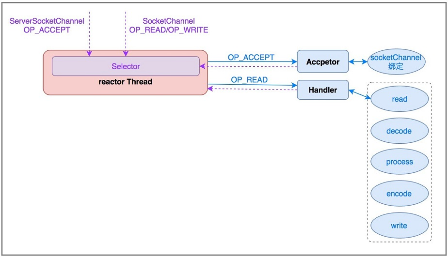

**单线程 Reactor 的优点是对系统资源消耗特别小，但是，没办法支撑大量请求的应用场景并且处理请求的时间可能非常慢，毕竟只有一个线程在工作嘛！所以，一般实际项目中不会使用单线程 Reactor 。**

为了解决这些问题，演进出了 Reactor 多线程模型。

### 多线程 Reactor

一个线程负责接受请求,一组 NIO 线程处理 IO 操作。

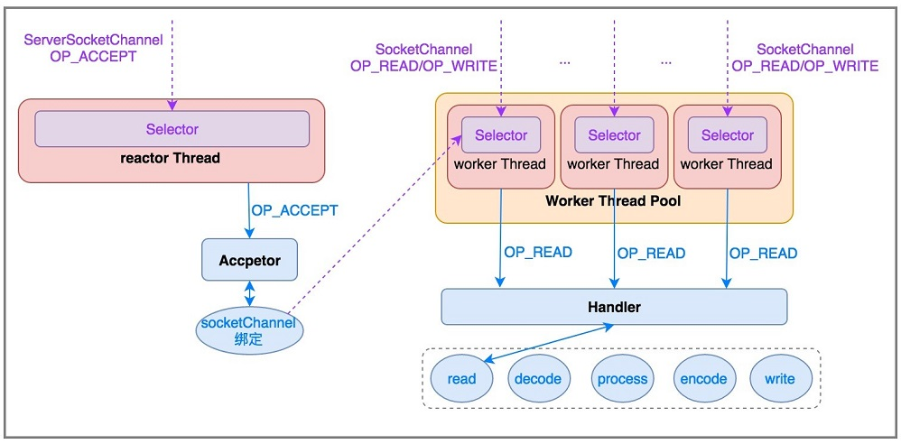

**大部分场景下多线程 Reactor 模型是没有问题的，但是在一些并发连接数比较多（如百万并发）的场景下，一个线程负责接受客户端请求就存在性能问题了。**

为了解决这些问题，演进出了主从多线程 Reactor 模型。

### 主从多线程 Reactor

一组 NIO 线程负责接受请求，一组 NIO 线程处理 IO 操作。

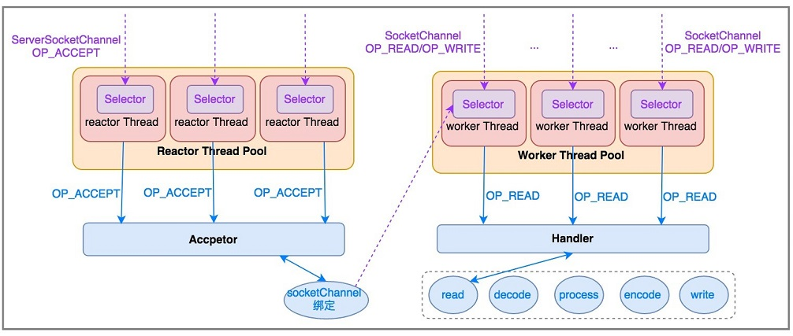

## Netty 线程模型了解么？

👨‍💻**面试官** ：说一下 Netty 线程模型吧！

🙋 **我** ：大部分网络框架都是基于 Reactor 模式设计开发的。

> Reactor 模式基于事件驱动，采用多路复用将事件分发给相应的 Handler 处理，非常适合处理海量 IO 的场景。

在 Netty 主要靠 `NioEventLoopGroup` 线程池来实现具体的线程模型的 。

我们实现服务端的时候，一般会初始化两个线程组：

1. <code>**bossGroup**</code> :接收连接。
2. <code>**workerGroup**</code> ：负责具体的处理，交由对应的 Handler 处理。

下面我们来详细看一下 Netty 中的线程模型吧！

### 单线程模型

一个线程单独处理客户端连接以及 I/O 读写，涉及到 `accept`、`read`、`decode`、`process`、`encode`、`send` 等事件。

对于高负载、高并发，并且对性能要求比较高的场景不适用。

对应到 Netty 代码是下面这样的：

> 使用 `NioEventLoopGroup` 类的无参构造函数设置线程数量的默认值就是 \**CPU 核心数 *2** 。

```java
  //1.eventGroup既用于处理客户端连接，又负责具体的处理。
  EventLoopGroup eventGroup = new NioEventLoopGroup(1);
  //2.创建服务端启动引导/辅助类：ServerBootstrap
  ServerBootstrap b = new ServerBootstrap();
            boobtstrap.group(eventGroup, eventGroup)
            //......
```

### 多线程模型

一个 Acceptor 线程只负责监听客户端的连接，一个 NIO 线程池负责处理 I/O 读写。

多线程模型满足绝大部分应用场景，并发连接量不大的时候没啥问题，但是遇到并发连接大的时候就可能会出现问题，成为性能瓶颈。

对应到 Netty 代码是下面这样的：

```java
// 1.bossGroup 用于接收连接，workerGroup 用于具体的处理
EventLoopGroup bossGroup = new NioEventLoopGroup(1);
EventLoopGroup workerGroup = new NioEventLoopGroup();
try {
  //2.创建服务端启动引导/辅助类：ServerBootstrap
  ServerBootstrap b = new ServerBootstrap();
  //3.给引导类配置两大线程组,确定了线程模型
  b.group(bossGroup, workerGroup)
    //......
```

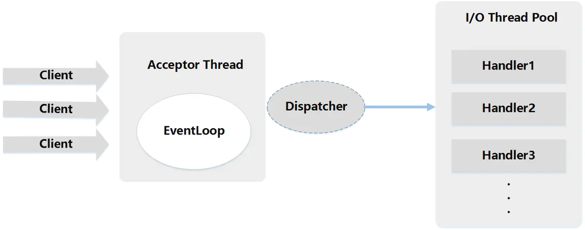

### 主从多线程模型

从一个 主线程 NIO 线程池中选择一个线程作为 Acceptor 线程，绑定监听端口，接收客户端连接的连接，其他线程负责后续的接入认证等工作。连接建立完成后，Sub NIO 线程池负责具体处理 I/O 读写。

如果多线程模型无法满足你的需求的时候，可以考虑使用主从多线程模型 。

```java
// 1.bossGroup 用于接收连接，workerGroup 用于具体的处理
EventLoopGroup bossGroup = new NioEventLoopGroup();
EventLoopGroup workerGroup = new NioEventLoopGroup();
try {
  //2.创建服务端启动引导/辅助类：ServerBootstrap
  ServerBootstrap b = new ServerBootstrap();
  //3.给引导类配置两大线程组,确定了线程模型
  b.group(bossGroup, workerGroup)
    //......
```

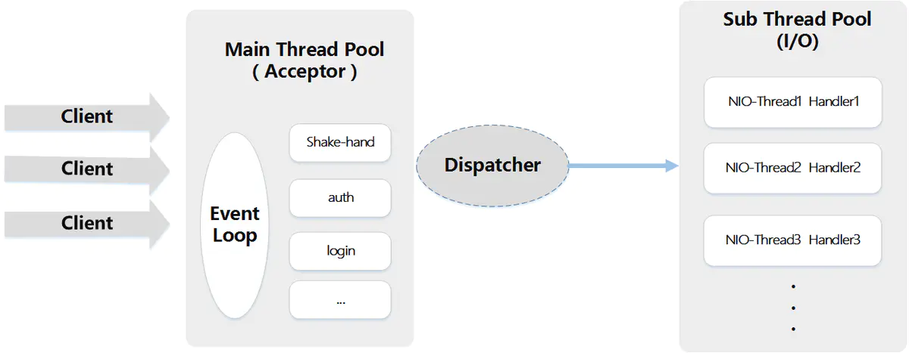

## Netty 服务端和客户端的启动过程了解么？

### 服务端

```java
// 1.bossGroup 用于接收连接，workerGroup 用于具体的处理
EventLoopGroup bossGroup = new NioEventLoopGroup(1);
EventLoopGroup workerGroup = new NioEventLoopGroup();
try {
    //2.创建服务端启动引导/辅助类：ServerBootstrap
    ServerBootstrap b = new ServerBootstrap();
    //3.给引导类配置两大线程组,确定了线程模型
    b.group(bossGroup, workerGroup)
            // (非必备)打印日志
            .handler(new LoggingHandler(LogLevel.INFO))
            // 4.指定 IO 模型
            .channel(NioServerSocketChannel.class)
            .childHandler(new ChannelInitializer<SocketChannel>() {
                @Override
                public void initChannel(SocketChannel ch) {
                    ChannelPipeline p = ch.pipeline();
                    //5.可以自定义客户端消息的业务处理逻辑
                    p.addLast(new HelloServerHandler());
                }
            });
    // 6.绑定端口,调用 sync 方法阻塞知道绑定完成
    ChannelFuture f = b.bind(port).sync();
    // 7.阻塞等待直到服务器Channel关闭(closeFuture()方法获取Channel 的CloseFuture对象,然后调用sync()方法)
    f.channel().closeFuture().sync();
} finally {
    //8.优雅关闭相关线程组资源
    bossGroup.shutdownGracefully();
    workerGroup.shutdownGracefully();
}
```

简单解析一下服务端的创建过程具体是怎样的：

1、首先你创建了两个 `NioEventLoopGroup` 对象实例：`bossGroup` 和 `workerGroup`。

* `bossGroup` : 用于处理客户端的 TCP 连接请求。
* `workerGroup` ： 负责每一条连接的具体读写数据的处理逻辑，真正负责 I/O 读写操作，交由对应的 `Handler` 处理。

举个例子：我们把公司的老板当做 `bossGroup`，员工当做 `workerGroup`，`bossGroup` 在外面接完活之后，扔给 `workerGroup` 去处理。一般情况下我们会指定 `bossGroup` 的 线程数为 1（并发连接量不大的时候） ，`workGroup` 的线程数量为 \**CPU 核心数 *2** 。另外，根据源码来看，使用 `NioEventLoopGroup` 类的无参构造函数设置线程数量的默认值就是 \**CPU 核心数 *2** 。

2、接下来 我们创建了一个服务端启动引导/辅助类： `ServerBootstrap`，这个类将引导我们进行服务端的启动工作。

3、通过 `group()` 方法给引导类 `ServerBootstrap` 配置两大线程组，确定了线程模型。

通过下面的代码，我们实际配置的是多线程模型，这个在上面提到过。

```java
EventLoopGroup bossGroup = new NioEventLoopGroup(1);
EventLoopGroup workerGroup = new NioEventLoopGroup();
```

4、通过`channel()`方法给引导类 `ServerBootstrap`指定了 IO 模型为`NIO`

* `NioServerSocketChannel` ：指定服务端的 IO 模型为 NIO，与 BIO 编程模型中的`ServerSocket`对应
* `NioSocketChannel` : 指定客户端的 IO 模型为 NIO， 与 BIO 编程模型中的`Socket`对应

5、通过 `childHandler()`方法给引导类创建一个`ChannelInitializer` ，然后指定了服务端消息的业务处理逻辑 `HelloServerHandler` 对象。

6、调用 `ServerBootstrap` 类的 `bind()`方法绑定端口。

### 客户端

```java
    //1.创建一个 NioEventLoopGroup 对象实例
    EventLoopGroup group = new NioEventLoopGroup();
    try {
        //2.创建客户端启动引导/辅助类：Bootstrap
        Bootstrap b = new Bootstrap();
        //3.指定线程组
        b.group(group)
                //4.指定 IO 模型
                .channel(NioSocketChannel.class)
                .handler(new ChannelInitializer<SocketChannel>() {
                    @Override
                    public void initChannel(SocketChannel ch) throws Exception {
                        ChannelPipeline p = ch.pipeline();
                        // 5.这里可以自定义消息的业务处理逻辑
                        p.addLast(new HelloClientHandler(message));
                    }
                });
        // 6.尝试建立连接
        ChannelFuture f = b.connect(host, port).sync();
        // 7.等待连接关闭（阻塞，直到Channel关闭）
        f.channel().closeFuture().sync();
    } finally {
        group.shutdownGracefully();
    }
```

继续分析一下客户端的创建流程：

1、创建一个 `NioEventLoopGroup` 对象实例

2、创建客户端启动的引导类是 `Bootstrap`

3、通过 `group()` 方法给引导类 `Bootstrap` 配置一个线程组

4、通过`channel()`方法给引导类 `Bootstrap`指定了 IO 模型为`NIO`

5、通过 `handler()`方法给引导类创建一个`ChannelInitializer` ，然后指定了客户端消息的业务处理逻辑 `HelloClientHandler` 对象

6、调用 `Bootstrap` 类的 `connect()`方法进行连接，这个方法需要指定两个参数：

* `inetHost` : ip 地址
* `inetPort` : 端口号

```java
    public ChannelFuture connect(String inetHost, int inetPort) {
        return this.connect(InetSocketAddress.createUnresolved(inetHost, inetPort));
    }

    public ChannelFuture connect(SocketAddress remoteAddress) {
        ObjectUtil.checkNotNull(remoteAddress, "remoteAddress");
        this.validate();
        return this.doResolveAndConnect(remoteAddress, this.config.localAddress());
    }
```

`connect` 方法返回的是一个 `Future` 类型的对象

```java
public interface ChannelFuture extends Future<Void> {
  ......
}
```

也就是说这个方是异步的，我们通过 `addListener` 方法可以监听到连接是否成功，进而打印出连接信息。具体做法很简单，只需要对代码进行以下改动：

```java
ChannelFuture f = b.connect(host, port).addListener(future -> {
  if (future.isSuccess()) {
    System.out.println("连接成功!");
  } else {
    System.err.println("连接失败!");
  }
}).sync();
```

## 什么是 TCP 粘包/拆包?有什么解决办法呢？

👨‍💻**面试官** ：什么是 TCP 粘包/拆包?

🙋 **我** ：TCP 为了高效传输，并不会把应用层发来的数据当作一个个独立的消息来处理，而是把它们看作一串没有边界的字节流。它只保证这些字节的顺序是正确的，但并不保证应用层一次 write 操作的数据，会在接收端被一次 read 操作完整地读到。

这就导致了所谓的“粘包/拆包”现象：

* **粘包 (Packet Sticky):** 当发送方发送的数据很小，或者接收方处理不及时，TCP 为了提高网络效率（例如 Nagle 算法），可能会将多个小的数据包合并成一个大的数据包一次性发送出去。这样，接收方一次读取到的就是多个逻辑消息“粘”在了一起。
* **拆包 (Packet Splitting):** 当发送方要发送的数据超过了 TCP 的最大报文段长度（MSS），或者超过了网络链路的 MTU，TCP 会将这个大的数据块拆分成多个小的数据包进行发送。这时，接收方可能需要多次读取才能获得一个完整的逻辑消息。

**举个例子**：我连续发送三次“你好”、“你真帅啊！”、“哥哥！”，但在接收端，因为上述机制，可能会一次性收到 你好你真帅啊！哥哥！（粘包），也可能先收到 你好你，再收到 真帅啊！哥哥！（拆包）。

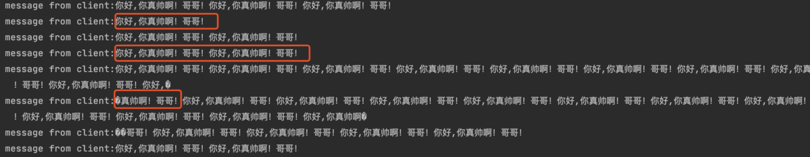

👨‍💻**面试官** ：那有什么解决办法呢?

🙋 **我** ：

解决这个问题的核心思想，就是**在应用层我们自己来定义消息的边界**。常见的方法有三种：

1. **固定长度消息：** 就是发送方和接收方约定好，每个消息都是固定长度，比如 100 个字节。接收方每次就读取 100 个字节来当做一个完整的消息。这种方法简单，但缺点是浪费空间，不够灵活。
2. **特殊分隔符：** 在每个消息的末尾加上一个特殊的分隔符，比如换行符` \n` 或者其他不会在消息正文中出现的字符。接收方只要读到这个分隔符，就知道一个消息结束了。HTTP 协议的头部就是用换行符来分隔的。
3. **消息头 + 消息体（推荐）：** 这是最常用也最灵活的方式。我们把消息分成‘头’和‘体’两部分。**消息头里通常包含一个表示消息体长度的字段**。接收方先读取固定长度的头部，解析出接下来要接收的消息体有多长，然后再根据这个长度去准确地读取消息体。

在 Netty 框架中，这几种方案都有成熟的解码器（Decoder）可以直接使用，非常方便：

* `FixedLengthFrameDecoder` 对应固定长度方案。
* `DelimiterBasedFrameDecoder` 和 `LineBasedFrameDecoder`（针对换行符）对应特殊分隔符方案。
* `LengthFieldBasedFrameDecoder` 对应消息头+消息体方案，它提供了丰富的参数配置，非常强大。

当然，刚刚说的是如何划分消息的边界。至于**消息体里的具体内容**，我们会用像 JSON、Protobuf、Kryo 这些序列化框架把它转成字节数组，这样不仅效率高，还能实现跨语言通信。所以，一个完整的流程通常是：**先用 Protobuf 等工具把对象序列化成字节数组（这是消息体），然后再用‘长度+内容’的方式把它发送出去。**

## Netty 长连接、心跳机制了解么？

👨‍💻**面试官** ：TCP 长连接和短连接了解么？

🙋 **我** ：我们知道 TCP 在进行读写之前，server 与 client 之间必须提前建立一个连接。建立连接的过程，需要我们常说的三次握手，释放/关闭连接的话需要四次挥手。这个过程是比较消耗网络资源并且有时间延迟的。

所谓，短连接说的就是 server 端 与 client 端建立连接之后，读写完成之后就关闭掉连接，如果下一次再要互相发送消息，就要重新连接。短连接的优点很明显，就是管理和实现都比较简单，缺点也很明显，每一次的读写都要建立连接必然会带来大量网络资源的消耗，并且连接的建立也需要耗费时间。

长连接说的就是 client 向 server 双方建立连接之后，即使 client 与 server 完成一次读写，它们之间的连接并不会主动关闭，后续的读写操作会继续使用这个连接。长连接的可以省去较多的 TCP 建立和关闭的操作，降低对网络资源的依赖，节约时间。对于频繁请求资源的客户来说，非常适用长连接。

👨‍💻**面试官** ：为什么需要心跳机制？Netty 中心跳机制了解么？

🙋 **我** ：

在 TCP 保持长连接的过程中，可能会出现断网等网络异常出现，异常发生的时候， client 与 server 之间如果没有交互的话，它们是无法发现对方已经掉线的。为了解决这个问题, 我们就需要引入 **心跳机制** 。

心跳机制的工作原理是: 在 client 与 server 之间在一定时间内没有数据交互时, 即处于 idle 状态时, 客户端或服务器就会发送一个特殊的数据包给对方, 当接收方收到这个数据报文后, 也立即发送一个特殊的数据报文, 回应发送方, 此即一个 PING-PONG 交互。所以, 当某一端收到心跳消息后, 就知道了对方仍然在线, 这就确保 TCP 连接的有效性.

TCP 实际上自带的就有长连接选项，本身是也有心跳包机制，也就是 TCP 的选项：`SO_KEEPALIVE`。 但是，TCP 协议层面的长连接灵活性不够。所以，一般情况下我们都是在应用层协议上实现自定义心跳机制的，也就是在 Netty 层面通过编码实现。通过 Netty 实现心跳机制的话，核心类是 `IdleStateHandler` 。

## Netty 的零拷贝了解么？

👨‍💻**面试官** ：讲讲 Netty 的零拷贝？

🙋 **我** ：

维基百科是这样介绍零拷贝的：

> 零复制（英语：Zero-copy；也译零拷贝）技术是指计算机执行操作时，CPU 不需要先将数据从某处内存复制到另一个特定区域。这种技术通常用于通过网络传输文件时节省 CPU 周期和内存带宽。

在 OS 层面上的 `Zero-copy` 通常指避免在 `用户态(User-space)` 与 `内核态(Kernel-space)` 之间来回拷贝数据。而在 Netty 层面 ，零拷贝主要体现在对于数据操作的优化。

Netty 中的零拷贝体现在以下几个方面：

1. 堆外内存，避免 JVM 堆内存到堆外内存的数据拷贝。
2. 使用 Netty 提供的 `CompositeByteBuf` 类, 可以将多个`ByteBuf` 合并为一个逻辑上的 `ByteBuf`, 避免了各个 `ByteBuf` 之间的拷贝。
3. 通过 `Unpooled.wrappedBuffer` 可以将 `byte` 数组包装成 `ByteBuf` 对象，包装过程中不会产生内存拷贝。
4. `ByteBuf` 支持 `slice` 操作, 因此可以将 `ByteBuf` 分解为多个共享同一个存储区域的 `ByteBuf`, 避免了内存的拷贝。
5. 通过 `FileRegion` 包装的`FileChannel#tranferTo()` 实现文件传输, 可以直接将文件缓冲区的数据发送到目标 `Channel`, 避免了传统通过循环 `write` 方式导致的内存拷贝问题.

## 参考

* netty 学习系列二：NIO Reactor 模型 & Netty 线程模型：<https://www.jianshu.com/p/38b56531565d>
* 《Netty 实战》
* Netty 面试题整理(2):[https://metatronxl.github.io/2019/10/22/Netty-面试题整理-二/](https://metatronxl.github.io/2019/10/22/Netty-%E9%9D%A2%E8%AF%95%E9%A2%98%E6%95%B4%E7%90%86-%E4%BA%8C/)
* Netty（3）—源码 NioEventLoopGroup:<https://www.cnblogs.com/qdhxhz/p/10075568.html>
* 对于 Netty ByteBuf 的零拷贝(Zero Copy) 的理解: <https://www.cnblogs.com/xys1228/p/6088805.html>

[\
](https://www.cnblogs.com/xys1228/p/6088805.html)


> 更新: 2025-12-16 01:20:06  
> 原文: <https://www.yuque.com/snailclimb/mf2z3k/wlr1b0>