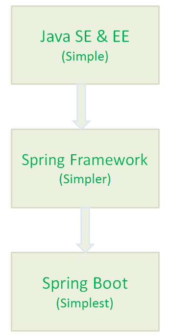
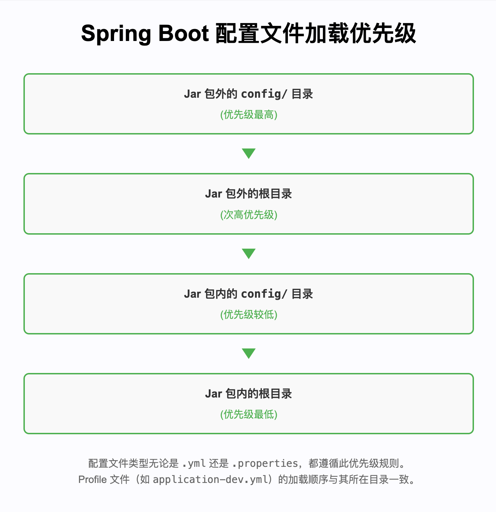
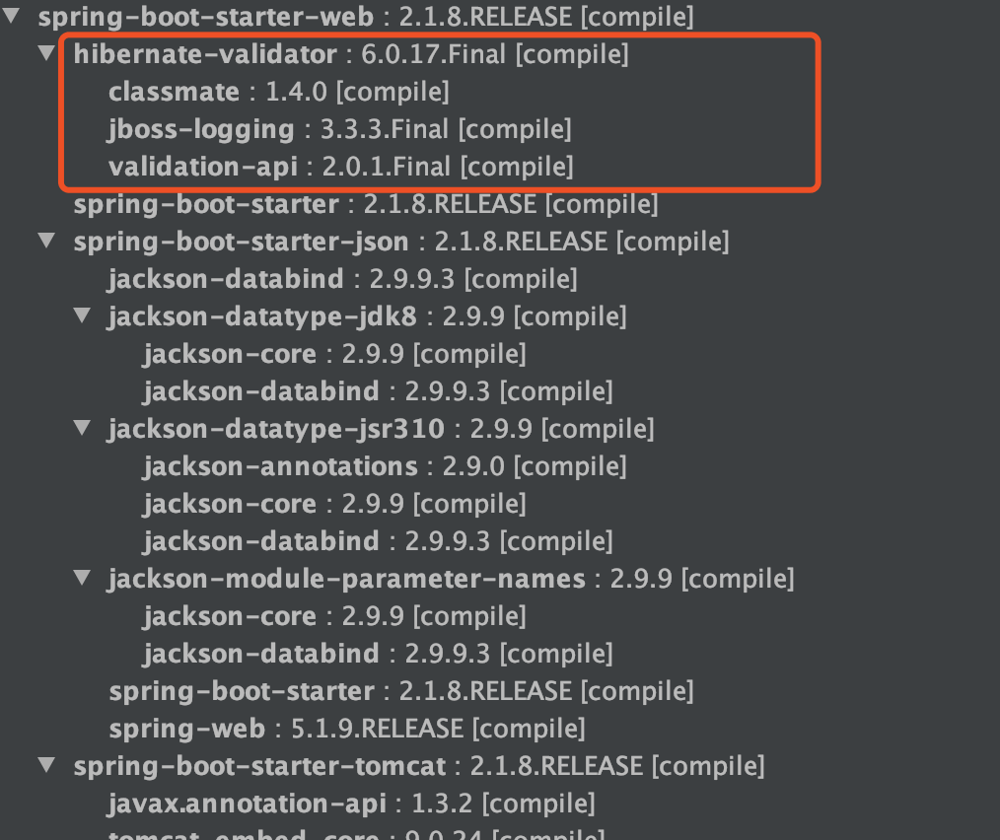

# SpringBoot 常见面试题总结

市面上关于 Spring Boot 的面试题抄来抄去，毫无价值可言。

这篇文章，我会简单就自己这几年使用 Spring Boot 的一些经验，总结一些常见的面试题供小伙伴们自测和学习。少部分关于 Spring/Spring Boot 的介绍参考了官网，其他皆为原创。

### 1. 简单介绍一下 Spring?有啥缺点?

Spring 最初是作为**重量级企业开发框架 Enterprise JavaBeans (EJB)** 的一种轻量级替代方案而出现的。它旨在简化企业级 Java 开发，其核心思想是利用**依赖注入 (Dependency Injection, DI)** 和**面向切面编程 (Aspect-Oriented Programming, AOP)** 这两大特性，通过普通的 **Java 对象 (Plain Old Java Object, POJO)** 来实现过去通常由 EJB 提供的复杂功能。

尽管 Spring 的核心组件设计是轻量级的，但在早期版本中，其配置却相对“重量级”，尤其依赖于大量的 XML 文件进行定义和管理。

为了减轻配置负担，Spring 进行了持续改进：

* **Spring 2.5** 引入了**基于注解的组件扫描**，显著减少了应用程序内部组件所需的显式 XML 配置。
* **Spring 3.0** 推出了**基于 Java 的配置 (JavaConfig)**，提供了一种类型安全且易于重构的配置方式，可作为 XML 配置的替代方案。

然而，即便如此，Spring 的配置工作仍然不可避免。例如，开启事务管理、Spring MVC 等特性时，仍然需要使用 XML 或 Java 进行显式配置。集成第三方库（例如基于 Thymeleaf 的 Web 视图）以及配置 Servlet 和过滤器（例如 Spring 的 DispatcherServlet）时，也需要在 `web.xml` 或 Servlet 初始化代码中进行相应的配置。虽然组件扫描和 Java 配置简化了部分配置工作，整体的配置工作量依然可观。

此外，除了配置本身的复杂性，管理项目依赖（尤其是处理不同库之间的版本冲突）也是一个常见的痛点，这些都消耗了开发者大量的时间和精力。

### 2. 为什么要有 SpringBoot?

Spring Boot 的核心目标是通过简化配置、优化依赖管理、加速项目启动和部署流程，帮助开发者专注于业务逻辑的实现，减少在环境搭建和配置上的时间消耗。



接下来的这个问题，会详细介绍 Spring Boot 的优势。

### 3. 说出使用 Spring Boot 的主要优点

1. **显著提升开发效率**：Spring Boot 通过自动配置、起步依赖 (Starters) 和其他开箱即用的功能，极大地减少了项目初始化、配置编写和样板代码的工作量，使开发者能更快地构建和交付应用。
2. **与 Spring 生态系统的无缝集成**：作为 Spring 家族的一员，Spring Boot 能够方便地整合 Spring 框架下的其他成熟模块（如 Spring Data、Spring Security、Spring Batch 等），充分利用 Spring 强大的生态系统，简化整合工作。
3. **强大的自动配置能力**：遵循“约定优于配置”的原则，Spring Boot 能够根据项目依赖自动配置大量的常见组件（如数据源、Web 容器、消息队列等），提供合理的默认设置。同时也允许开发者根据需要轻松覆盖或定制配置，极大减少了繁琐的手动配置工作。
4. **内嵌 Web 服务器支持**：Spring Boot 自带内嵌的 HTTP 服务器（如 Tomcat、Jetty），开发者可以像运行普通 Java 程序一样运行 Spring Boot 应用程序，极大地简化了开发和测试过程。
5. **适合微服务架构**：Spring Boot 使得每个微服务都可以独立运行和部署，简化了微服务的开发、测试和运维工作，成为构建微服务架构的理想选择。
6. **提供强大的构建工具支持**：Spring Boot 为常用的构建工具（如 Maven 和 Gradle）提供了专门的插件，简化了项目的打包（如创建可执行 JAR）、运行、测试以及依赖管理等常见构建任务。
7. **丰富的监控和管理功能**：通过 Spring Boot Actuator 模块，可以轻松地为应用添加生产级的监控和管理端点，方便了解应用运行状况、收集指标、进行健康检查等。

### 4. 什么是 Spring Boot Starters?

这是 Spring Boot 官方对 Spring Boot Starters 的介绍：

> Spring Boot Starters are a set of convenient dependency descriptors that you can include in your application. You get a one-stop-shop for all the Spring and related technology that you need without having to hunt through sample code and copy paste loads of dependency descriptors.
>
> Spring Boot Starters 是一组便捷的依赖描述符（dependency descriptors），你可以将它们直接包含到你的应用程序中。通过使用这些 Starters，你可以一次性获取所有与 Spring 及相关技术搭配使用的所需依赖，而无需费力地在示例代码中寻找或复制粘贴大量的依赖描述符。

Spring Boot Starters 是一组便捷的依赖描述符，它们预先打包了常用的库和配置。当我们开发 Spring 应用时，只需添加一个 Starter 依赖项，即可自动引入所有必要的库和配置，而无需手动逐一添加和配置相关依赖。

这种机制显著简化了开发过程，特别是在处理复杂项目时尤为高效。通过添加一个简单的 Starter 依赖，开发者可以快速集成所需的功能，避免了手动管理多个依赖的繁琐和潜在错误。这不仅节省了时间，还减少了配置错误的风险，从而提升了开发效率。

**举个例子：** 在没有 Spring Boot Starters 之前，开发一个 RESTful 服务或 Web 应用程序通常需要手动添加多个依赖，比如 Spring MVC、Tomcat、Jackson 等。这不仅繁琐，还容易导致版本不兼容的问题。而有了 Spring Boot Starters，我们只需添加一个依赖，如 `spring-boot-starter-web`，即可包含所有开发 REST 服务所需的库和依赖。

```xml
<dependency>
    <groupId>org.springframework.boot</groupId>

    <artifactId>spring-boot-starter-web</artifactId>

</dependency>

```

这个 `spring-boot-starter-web` 依赖包含了 Spring MVC（用于处理 Web 请求）、Tomcat（默认嵌入式服务器）、Jackson（用于 JSON 处理）等依赖项。这种方式极大地简化了开发过程，让我们可以更加专注于业务逻辑的实现。

以下是一些常见的 Spring Boot Starter 及其用途：

1. `spring-boot-starter`：基础的 Starter，包含了启动 Spring 应用所需的核心依赖，如 Spring 框架本身和日志系统（默认使用 SLF4J 和 Logback）。
2. `spring-boot-starter-web`：用于构建 Web 应用程序，包括 RESTful 服务。它包含了 Spring MVC、Tomcat（默认嵌入式服务器）、Jackson 等依赖。
3. `spring-boot-starter-data-jpa`：用于构建 JPA 应用程序，包含 Spring Data JPA 和 Hibernate。它简化了数据库访问层的开发，提供了对关系型数据库的便捷操作。
4. `spring-boot-starter-security`：用于集成 Spring Security，提供身份验证和授权功能，帮助开发者快速实现安全机制。
5. `spring-boot-starter-test`：提供测试所需的依赖，包含了 JUnit、Mockito、Spring Test 等库，帮助开发者编写单元测试、集成测试和 Mock 测试。
6. `spring-boot-starter-actuator`：可以监控应用程序的运行状态，还可以收集应用程序的各种指标信息。
7. `spring-boot-starter-aop`：提供对面向切面编程（AOP）的支持，包含 Spring AOP 和 AspectJ。
8. `spring-boot-starter-validation`：集成了 Hibernate Validator，用于实现 Java Bean 的校验机制，通常与 Spring MVC 或 Spring Data 一起使用。
9. ......

### 5. Spring Boot 支持哪些内嵌 Servlet 容器？如何选择？

Spring Boot 提供了三种内嵌 Web 容器，分别为 **Tomcat**、**Jetty** 和 **Undertow** 。

当你在项目中引入 `spring-boot-starter-web` 这个起步依赖时，Spring Boot 默认会包含并启用 Tomcat 作为内嵌 Servlet 容器。

如果你想使用 Jetty 或 Undertow，需要在构建文件（如 Maven 的 `pom.xml`或 Gradle 的 `build.gradle`）中，从 `spring-boot-starter-web` 中排除默认的 Tomcat 依赖 (`spring-boot-starter-tomcat`)，添加你想使用的容器对应的 Starter 依赖（例如 `spring-boot-starter-jetty` 或 `spring-boot-starter-undertow`）。

Maven：

```xml
<dependency>
    <groupId>org.springframework.boot</groupId>
    <artifactId>spring-boot-starter-web</artifactId>
    <exclusions>
        <!-- 排除默认的 Tomcat 依赖 -->
        <exclusion>
            <artifactId>spring-boot-starter-tomcat</artifactId>
            <groupId>org.springframework.boot</groupId>
        </exclusion>
    </exclusions>
</dependency>
<!--引入其他的 Servlet 容器-->
<dependency>
    <artifactId>spring-boot-starter-jetty</artifactId>
    <groupId>org.springframework.boot</groupId>
</dependency>

```

**Gradle:**

```groovy
compile("org.springframework.boot:spring-boot-starter-web") {
     exclude group: 'org.springframework.boot', module: 'spring-boot-starter-tomcat'
}
compile("org.springframework.boot:spring-boot-starter-jetty")
```

在 Spring Boot 项目中，我们可以根据具体应用场景和性能需求，灵活地选择不同的嵌入式 Servlet 容器来提供 HTTP 服务：

1. **Tomcat**：适用于大多数常规 Web 应用程序和 RESTful 服务，易于使用和配置，但在高并发场景下确实可能不如 Undertow 表现出色。
2. **Undertow**：Undertow 具有极低的启动时间和资源占用，支持非阻塞 IO（NIO），在高并发场景下表现出色，性能优于 Tomcat。
3. **Jetty**：如果应用程序涉及即时通信、聊天系统或其他需要保持长连接的场景，Jetty 是一个更好的选择。它在处理长连接和 WebSocket 时表现优越。另外。Jetty 在性能和内存使用方面通常优于 Tomcat，虽然在极端高并发场景中可能略逊于 Undertow。

**⚠️**\*\* 注意\*\* ：

Spring Boot 4.0 完全移除了对 Undertow 的内嵌支持——不仅删掉了 **spring-boot-starter-undertow**，也不再提供任何 Undertow 相关的自动配置。移除的根本原因是：Spring Boot 4.0 基线升级到 Servlet 6.1（也就是说必须支持 Servlet 6.1 才能留在 starter 列表里），而截至 2025-10 官方发布说明时，Undertow 尚未兼容该版本。

### 6. Spring Boot 默认使用的日志框架是什么？

Spring Boot 默认选用 SLF4J (Simple Logging Facade for Java) 作为其日志门面 (Facade) / 日志抽象层，并搭配 Logback 作为默认的具体日志实现库 (Implementation)。

关于日志框架的详细介绍，可以参考这篇文章：

[日志记录方案有哪些？](https://www.yuque.com/snailclimb/mf2z3k/srwasy4ubg4htbzg)

### 7. 介绍一下@SpringBootApplication 注解

`@SpringBootApplication` 是 Spring Boot 项目的核心注解，通常用于标记应用程序的主类（即包含 `main` 方法的类）。它的主要作用是一站式地启用 Spring Boot 的关键特性，简化项目的初始配置。

`SpringBootApplication.java`

```java
package org.springframework.boot.autoconfigure;
@Target(ElementType.TYPE)
@Retention(RetentionPolicy.RUNTIME)
@Documented
@Inherited
@SpringBootConfiguration // 配置类
@EnableAutoConfiguration // 自动配置
@ComponentScan(excludeFilters = {
        @Filter(type = FilterType.CUSTOM, classes = TypeExcludeFilter.class),
        @Filter(type = FilterType.CUSTOM, classes = AutoConfigurationExcludeFilter.class) }) // 组件扫描
public @interface SpringBootApplication {
   ......
}
```

`SpringBootConfiguration.java`

```java
package org.springframework.boot;
@Target(ElementType.TYPE)
@Retention(RetentionPolicy.RUNTIME)
@Documented
@Configuration // 本质上是一个 @Configuration
public @interface SpringBootConfiguration {

}
```

可以看出大概可以把 `@SpringBootApplication`看作是 `@Configuration`、`@EnableAutoConfiguration`、`@ComponentScan` 注解的集合。根据 SpringBoot 官网，这三个注解的作用分别是：

* `@SpringBootConfiguration`：表明被标记的类是一个配置类，Spring 容器会处理该类，并可以从中定义 Bean 或导入其他配置类。
* `@EnableAutoConfiguration`：启用 SpringBoot 的自动配置机制。
* `@ComponentScan`： 启用组件扫描，扫描被`@Component` (`@Service`,`@Controller`)注解的 Bean，注解默认会扫描该类所在的包下所有的类。

### 8. Spring Boot 的自动配置是如何实现的?

Spring Boot 的自动配置机制是通过 `@SpringBootApplication` 注解启动的，这个注解本质上是几个关键注解的组合。我们可以将 `@SpringBootApplication` 看作是 `@Configuration`、`@EnableAutoConfiguration` 和 `@ComponentScan` 注解的集合。

* `@EnableAutoConfiguration`: 启用 Spring Boot 的自动配置机制。它是自动配置的核心，允许 Spring Boot 根据项目的依赖和配置自动配置 Spring 应用的各个部分。
* `@ComponentScan`: 启用组件扫描，扫描被 `@Component`（以及 `@Service`、`@Controller` 等）注解的类，并将这些类注册为 Spring 容器中的 Bean。默认情况下，它会扫描该类所在包及其子包下的所有类。
* `@Configuration`: 允许在上下文中注册额外的 Bean 或导入其他配置类。它相当于一个具有 `@Bean` 方法的 Spring 配置类。

`@EnableAutoConfiguration`是启动自动配置的关键，源码如下(建议自己打断点调试，走一遍基本的流程)：

```java
import java.lang.annotation.Documented;
import java.lang.annotation.ElementType;
import java.lang.annotation.Inherited;
import java.lang.annotation.Retention;
import java.lang.annotation.RetentionPolicy;
import java.lang.annotation.Target;
import org.springframework.context.annotation.Import;

@Target({ElementType.TYPE})
@Retention(RetentionPolicy.RUNTIME)
@Documented
@Inherited
@AutoConfigurationPackage
@Import({AutoConfigurationImportSelector.class})
public @interface EnableAutoConfiguration {
    String ENABLED_OVERRIDE_PROPERTY = "spring.boot.enableautoconfiguration";

    Class<?>[] exclude() default {};

    String[] excludeName() default {};
}
```

这个注解通过 `@Import` 导入了 `AutoConfigurationImportSelector` 类，而 `AutoConfigurationImportSelector` 是自动配置的核心类之一。`@Import` 注解的作用是将指定的配置类或 Bean 导入到当前的配置类中。

`AutoConfigurationImportSelector` 类的 `getCandidateConfigurations` 方法会加载所有可用的自动配置类，并将这些类的信息以 `List` 的形式返回。这些配置类会被 Spring 容器管理为 Bean，从而实现自动配置。

```java
    protected List<String> getCandidateConfigurations(AnnotationMetadata metadata, AnnotationAttributes attributes) {
        List<String> configurations = SpringFactoriesLoader.loadFactoryNames(getSpringFactoriesLoaderFactoryClass(),
                getBeanClassLoader());
        Assert.notEmpty(configurations, "No auto configuration classes found in META-INF/spring.factories. If you "
                + "are using a custom packaging, make sure that file is correct.");
        return configurations;
    }
```

这里使用了 `SpringFactoriesLoader` 来加载位于 `META-INF/spring.factories` 文件中的自动配置类。这些配置类会根据应用的具体条件（例如类路径中的依赖）自动配置相应的组件。

**自动配置信息有了，那么自动配置还差什么呢？**

***

`@Conditional` 注解！在自动配置类中，Spring Boot 使用了一系列条件注解（如 `@Conditional`、`@ConditionalOnClass`、`@ConditionalOnBean` 等）来判断某些配置是否应该生效。这些注解是 `@Conditional` 注解的扩展，用于在特定条件满足时才启用相应的配置。

例如，在 Spring Security 的自动配置中，有一个名为 `SecurityAutoConfiguration` 的自动配置类，它导入了 `WebSecurityEnablerConfiguration` 类。

`WebSecurityEnablerConfiguration` 类的源码如下：

```java
@Configuration
@ConditionalOnBean(WebSecurityConfigurerAdapter.class)
@ConditionalOnMissingBean(name = BeanIds.SPRING_SECURITY_FILTER_CHAIN)
@ConditionalOnWebApplication(type = ConditionalOnWebApplication.Type.SERVLET)
@EnableWebSecurity
public class WebSecurityEnablerConfiguration {

}
```

`WebSecurityEnablerConfiguration`类中使用`@ConditionalOnBean`指定了容器中必须还有`WebSecurityConfigurerAdapter` 类或其实现类。所以，一般情况下 Spring Security 配置类都会去实现 `WebSecurityConfigurerAdapter`，这样自动将配置就完成了。

最后，简单总结一下：Spring Boot 的自动配置机制通过 `@EnableAutoConfiguration` 启动。该注解利用 `@Import` 注解导入了 `AutoConfigurationImportSelector` 类，而 `AutoConfigurationImportSelector` 类则负责加载并管理所有的自动配置类。这些自动配置类通常在`META-INF/spring.factories` 文件中声明，并根据项目的依赖和配置条件，通过条件注解（如 `@ConditionalOnClass`、`@ConditionalOnBean` 等）判断是否应该生效。

⭐自动配置是详细的源码解读可以参考 [JavaGuide](https://javaguide.cn/) 上这篇文章：[SpringBoot 自动装配原理详解](https://javaguide.cn/system-design/framework/spring/spring-boot-auto-assembly-principles.html)。

### 9. 开发 RESTful Web 服务常用的注解有哪些？

**Spring Bean 相关：**

* `@Autowired` : 自动导入对象到类中，被注入进的类同样要被 Spring 容器管理。
* `@RestController` : `@RestController`注解是`@Controller和`@`ResponseBody`的合集,表示这是个控制器 bean,并且是将函数的返回值直 接填入 HTTP 响应体中,是 REST 风格的控制器。
* `@Component` ：通用的注解，可标注任意类为 `Spring` 组件。如果一个 Bean 不知道属于哪个层，可以使用`@Component` 注解标注。
* `@Repository` : 对应持久层即 Dao 层，主要用于数据库相关操作。
* `@Service` : 对应服务层，主要涉及一些复杂的逻辑，需要用到 Dao 层。
* `@Controller` : 对应 Spring MVC 控制层，主要用于接受用户请求并调用 Service 层返回数据给前端页面。

**处理常见的 HTTP 请求类型：**

* `@GetMapping` : GET 请求、
* `@PostMapping` : POST 请求。
* `@PutMapping` : PUT 请求。
* `@DeleteMapping` : DELETE 请求。

**前后端传值：**

* `@RequestParam`以及`@Pathvariable`：`@PathVariable`用于获取路径参数，`@RequestParam`用于获取查询参数。
* `@RequestBody` ：用于读取 Request 请求（可能是 POST,PUT,DELETE,GET 请求）的 body 部分并且 Content-Type 为 `application/json` 格式的数据，接收到数据之后会自动将数据绑定到 Java 对象上去。系统会使用`HttpMessageConverter`或者自定义的`HttpMessageConverter`将请求的 body 中的 json 字符串转换为 Java 对象。

详细介绍可以查看这篇文章：[Spring/Spring Boot 常用注解总结](https://javaguide.cn/system-design/framework/spring/spring-common-annotations.html) 。

### 10. Spirng Boot 常用的两种配置文件是？

Spring Boot 支持使用外部配置文件来管理应用程序的配置项，最常用的两种文件格式是：

**1、**`application.properties`

采用标准的 Java Properties 文件格式，即键值对 (key=value) 的形式，每一行定义一个配置项。

```properties
server.port=8080
spring.datasource.url=jdbc:mysql://localhost:3306/mydb
```

***

**2、**`application.yml`\*\* (或 .yaml)\*\*

***

采用 YAML (YAML Ain't Markup Language) 格式，这是一种层级化、以缩进表示结构的数据序列化语言。相比 `.properties` 文件，YAML 格式通常更易于阅读，尤其是在配置项较多或具有嵌套结构时，结构更清晰。并且，对于具有共同前缀的配置项，YAML 可以通过层级嵌套避免重复书写前缀，使配置更简洁。

```yaml
server:
  port: 8080
spring:
  datasource:
    url: jdbc:mysql://localhost:3306/mydb
```

###

### 11. Spring Boot 如何加载配置文件？如果两种配置文件同时存在，会怎样处理？

Spring Boot 会自动从类路径的根目录（通常是项目的 `src/main/resources/` 目录）下查找并加载名为 `application.properties` 或 `application.yml` (包括 `.yaml` 扩展名) 的文件。

如果在同一目录下同时存在 `application.properties` 和 `application.yml` 文件，`application.properties` 文件中的配置项优先级更高，会覆盖 `application.yml` 中相同的配置项。为了避免配置冲突和混淆，建议在一个项目中只使用一种格式。

如果开发者没有提供任何 `application.properties` 或 `application.yml` 文件，或者文件中没有定义某个特定的配置项，Spring Boot 将会使用其内置的默认配置值（如果该配置项有默认值的话）。

### 12. Spring Boot 常用的读取配置文件的方法有哪些？

#### 声明配置类

`@Configuration` 主要用于声明一个类是 Spring 的配置类。虽然也可以用 `@Component` 注解替代，但 `@Configuration` 能够更明确地表达该类的用途（定义 Bean），语义更清晰，也便于 Spring 进行特定的处理（例如，通过 CGLIB 代理确保 `@Bean` 方法的单例行为）。

```java
@Configuration
public class AppConfig {

    // @Bean 注解用于在配置类中声明一个 Bean
    @Bean
    public TransferService transferService() {
        return new TransferServiceImpl();
    }

    // 配置类中可以包含一个或多个 @Bean 方法。
}
```

#### 读取配置信息

在应用程序开发中，我们经常需要管理一些配置信息，例如数据库连接细节、第三方服务（如阿里云 OSS、短信服务、微信认证）的密钥或地址等。通常，这些信息会**集中存放在配置文件**（如 `application.yml` 或 `application.properties`）中，方便管理和修改。

Spring 提供了多种便捷的方式来读取这些配置信息。假设我们有如下 `application.yml` 文件：

```yaml
wuhan2020: 2020年初武汉爆发了新型冠状病毒，疫情严重，但是，我相信一切都会过去！武汉加油！中国加油！

my-profile:
  name: Guide哥
  email: koushuangbwcx@163.com

library:
  location: 湖北武汉加油中国加油
  books:
    - name: 天才基本法
      description: 二十二岁的林朝夕在父亲确诊阿尔茨海默病这天，得知自己暗恋多年的校园男神裴之即将出国深造的消息——对方考取的学校，恰是父亲当年为她放弃的那所。
    - name: 时间的秩序
      description: 为什么我们记得过去，而非未来？时间“流逝”意味着什么？是我们存在于时间之内，还是时间存在于我们之中？卡洛·罗韦利用诗意的文字，邀请我们思考这一亘古难题——时间的本质。
    - name: 了不起的我
      description: 如何养成一个新习惯？如何让心智变得更成熟？如何拥有高质量的关系？ 如何走出人生的艰难时刻？
```

下面介绍几种常用的读取配置的方式：

1、`@Value("${property.key}")` 注入配置文件（如 `application.properties` 或 `application.yml`）中的单个属性值。它还支持 Spring 表达式语言 (SpEL)，可以实现更复杂的注入逻辑。

```java
@Value("${wuhan2020}")
String wuhan2020;
```

2、`@ConfigurationProperties`可以读取配置信息并与 Bean 绑定，用的更多一些。

```java
@Component
@ConfigurationProperties(prefix = "library")
class LibraryProperties {
    @NotEmpty
    private String location;
    private List<Book> books;

    @Setter
    @Getter
    @ToString
    static class Book {
        String name;
        String description;
    }
  省略getter/setter
  ......
}
```

你可以像使用普通的 Spring Bean 一样，将其注入到类中使用。

```java
@Service
public class LibraryService {

    private final LibraryProperties libraryProperties;

    @Autowired
    public LibraryService(LibraryProperties libraryProperties) {
        this.libraryProperties = libraryProperties;
    }

    public void printLibraryInfo() {
        System.out.println(libraryProperties);
    }
}
```

#### 加载指定的配置文件

`@PropertySource` 注解允许加载自定义的配置文件。适用于需要将部分配置信息独立存储的场景。

```java
@Component
@PropertySource("classpath:website.properties")

class WebSite {
    @Value("${url}")
    private String url;

  省略getter/setter
  ......
}
```

***

**注意**：当使用 `@PropertySource` 时，确保外部文件路径正确，且文件在类路径（classpath）中。

更多内容请查看我的这篇文章：[10 分钟搞定 SpringBoot 如何优雅读取配置文件？](https://mp.weixin.qq.com/s?__biz=Mzg2OTA0Njk0OA==\&mid=2247486181\&idx=2\&sn=10db0ae64ef501f96a5b0dbc4bd78786\&chksm=cea2452ef9d5cc384678e456427328600971180a77e40c13936b19369672ca3e342c26e92b50\&token=816772476\&lang=zh_CN#rd) 。

### 13. Spring Boot 加载配置文件的优先级了解么？

Spring Boot 加载配置文件的优先级设计得非常灵活，主要是为了方便我们在不同环境（开发、测试、生产）下覆盖或指定配置。它的原则是：**后加载的覆盖先加载的，而且离用户（或部署环境）越近的优先级越高**。

**加载顺序如下**：

1. 当前项目根目录下 `config/` 子目录的配置文件 （`./config/application.yml` 或 `./config/application.properties`）：优先级最高，通常放在运行 Jar 包同级的 `config` 目录里。
2. 当前项目根目录下的配置文件 （`./application.yml` 或 `./application.properties`）： 直接放在运行 Jar 包同级目录里，优先级次之。
3. 类路径内 `config/` 子目录的配置文件 （`classpath:/config/application.yml` 或 `classpath:/config/application.properties`）： 对应项目中的 `src/main/resources/config/` 下的文件，优先级再次之。
4. 类路径下的配置文件 （`classpath:/application.yml` 或 `classpath:/application.properties`）： 对应项目中的 `src/main/resources/` 根目录下的文件，在这些位置里优先级最低。

总结：Jar 包外 `config/` > Jar 包外根目录 > Jar 包内 `config/`> Jar 包内根目录。



**简单记忆规则**：

* **包外 > 包内**（方便部署时覆盖配置）。
* `config/`\*\* 目录 > 根目录\*\*（无论包内还是包外，`config` 目录里的配置优先级更高）。

如果某个 Profile 文件（如 `application-dev.yml`）被激活（通过 `spring.profiles.active=dev` 指定），那么，**在同一个目录下**，Profile 文件的优先级高于通用文件。例如：

* `src/main/resources/application-dev.yml` 的配置会覆盖 `src/main/resources/application.yml` 中的同名配置。
* 同样地，Jar 包外的 `config/application-dev.yml` 会覆盖 `config/application.yml`。

通过这样的灵活设计，Spring Boot 能很好地适应各种环境的配置需求，同时确保配置文件的覆盖和管理清晰有序。

### 14. 常用的 Bean 映射工具有哪些？

我们经常在代码中会对一个数据结构封装成DO、SDO、DTO、VO等，而这些Bean中的大部分属性都是一样的，所以使用属性拷贝类工具可以帮助我们节省大量的 set 和 get 操作。

常用的 Bean 映射工具有：Spring BeanUtils、Apache BeanUtils、MapStruct、ModelMapper、Dozer、Orika、JMapper 。

由于 Apache BeanUtils 、Dozer 、ModelMapper 性能太差，所以不建议使用。MapStruct 性能更好而且使用起来比较灵活，是一个比较不错的选择。

这里以 MapStruct 为例，简单演示一下转换效果。

1、定义两个类 `Employee` 和 `EmployeeDTO`。

```java
public class Employee {
    private int id;
    private String name;
    // getters and setters
}

public class EmployeeDTO {
    private int employeeId;
    private String employeeName;
    // getters and setters
}
```

2、定义转换接口让 `Employee` 和 `EmployeeDTO`互相转换。

```java
@Mapper
public interface EmployeeMapper {
    // Spring 项目可以将 Mapper 注入到 IoC 容器中，这样就可以像 Spring Bean 一样调用了
    EmployeeMapper INSTANT = Mappers.getMapper(EmployeeMapper.class);

    @Mapping(target="employeeId", source="entity.id")
    @Mapping(target="employeeName", source="entity.name")
    EmployeeDTO employeeToEmployeeDTO(Employee entity);

    @Mapping(target="id", source="dto.employeeId")
    @Mapping(target="name", source="dto.employeeName")
    Employee employeeDTOtoEmployee(EmployeeDTO dto);
}
```

3、实际使用。

```java
//  EmployeeDTO 转  Employee
Employee employee = EmployeeMapper.INSTANT.employeeToEmployeeDTO(employee);

//  Employee 转  EmployeeDTO
EmployeeDTO employeeDTO = EmployeeMapper.INSTANT.employeeDTOtoEmployee(employeeDTO);
```

相关阅读：

* [MapStruct，降低无用代码的神器 - 大淘宝技术 - 2022](https://mp.weixin.qq.com/s/5iwth_Q-zC72g07RFvZuCg) （推荐）：对于 MapStruct 的各种操作介绍的更详细一些，涉及到一对多字段互转、为转换加缓存、 利用 Spring 进行依赖注入等高级用法。
* [告别 BeanUtils，Mapstruct 从入门到精通 - 大淘宝技术 - 2022](https://mp.weixin.qq.com/s/8yDzCzLB-9LncZVeAnMJmA) ：主要和 Spring 的 BeanUtils 做了简单对比，介绍的相对比较简单。

### 15. Spring Boot 如何监控系统实际运行状况？

Spring Boot 提供了 **Actuator** 模块，作为应用监控和管理的基础设施。通过引入 Actuator，我们可以方便地了解和监控应用的内部运行状态。

要使用 Actuator，首先需要在项目的 `pom.xml` (如果是 Maven 项目) 或 `build.gradle` (如果是 Gradle 项目) 文件中添加相应的依赖：

```xml
<dependency>
    <groupId>org.springframework.boot</groupId>
    <artifactId>spring-boot-starter-actuator</artifactId>
</dependency>

```

集成 Actuator 后，Spring Boot 应用会自动暴露一系列 **端点 (Endpoints)** 。这些端点是标准的 HTTP 接口，可以通过访问它们来获取应用的各种运行时信息。例如：

* `/actuator/health`: 这是最常用的端点之一。通过 GET 请求访问它，可以获取应用的核心健康状况信息（如数据库连接状态、磁盘空间等）。其返回结果通常被用于服务发现、负载均衡器的健康检查等场景。
* `/actuator/info`: 显示应用自定义的基本信息。
* `/actuator/metrics`: 提供详细的应用性能指标，如 JVM 内存使用、CPU 负载、HTTP 请求统计等。
* `/actuator/env`: 查看应用当前的环境变量、系统属性、配置文件属性等。

出于安全考虑，Spring Boot 默认可能只暴露 `/health` 和 `/info` 端点。你需要通过配置文件，例如 `application.properties` 或 `application.yml`，使用 `management.endpoints.web.exposure.include` 属性来明确指定需要暴露哪些端点，例如设置为 \*\*\*\*\* 暴露所有端点，或具体列出 **health,info,metrics** 等。

```yaml
management:
  endpoints:
    web:
      exposure:
        # 显式暴露的端点列表，设置为 "*" 以暴露所有端点
        include: "*"
        # 可选：隐藏某些端点（例如：不暴露 `shutdown`）
        exclude: "shutdown"
  endpoint:
    health:
      # 自定义健康检查策略，例如包含数据库和磁盘空间检查
      show-details: "always" # 可选值："always"、"when-authorized"、"never"
  health:
    diskspace:
      # 配置磁盘健康检查的阈值
      threshold: 10MB
```

不过，实际工作中，我们一般会使用更成熟的监控系统例如 Prometheus ，很少会直接用 Spring Boot Actuator。

关于监控系统的详细介绍可以查看这篇文章：

[服务治理：监控系统如何做？](https://www.yuque.com/snailclimb/mf2z3k/nsl2gh)

### 16. Spring Boot 如何做请求参数校验？

数据校验是保障系统稳定性和安全性的关键环节。即使在用户界面（前端）已经实施了数据校验，**后端服务仍必须对接收到的数据进行再次校验**。这是因为前端校验可以被轻易绕过（例如，通过开发者工具修改请求或使用 Postman、curl 等 HTTP 工具直接调用 API），恶意或错误的数据可能直接发送到后端。因此，后端校验是防止非法数据、维护数据一致性、确保业务逻辑正确执行的最后一道，也是最重要的一道防线。

Bean Validation 是一套定义 JavaBean 参数校验标准的规范 (JSR 303, 349, 380)，它提供了一系列注解，可以直接用于 JavaBean 的属性上，从而实现便捷的参数校验。

* **JSR 303 (Bean Validation 1.0):** 奠定了基础，引入了核心校验注解（如 `@NotNull`、`@Size`、`@Min`、`@Max` 等），定义了如何通过注解的方式对 JavaBean 的属性进行校验，并支持嵌套对象校验和自定义校验器。
* **JSR 349 (Bean Validation 1.1):** 在 1.0 基础上进行扩展，例如引入了对方法参数和返回值校验的支持、增强了对分组校验（Group Validation）的处理。
* **JSR 380 (Bean Validation 2.0):** 拥抱 Java 8 的新特性，并进行了一些改进，例如支持 `java.time` 包中的日期和时间类型、引入了一些新的校验注解（如 `@NotEmpty`, `@NotBlank`等）。

Bean Validation 本身只是一套**规范（接口和注解）**，我们需要一个实现了这套规范的**具体框架**来执行校验逻辑。目前，**Hibernate Validator** 是 Bean Validation 规范最权威、使用最广泛的参考实现。

* Hibernate Validator 4.x 实现了 Bean Validation 1.0 (JSR 303)。
* Hibernate Validator 5.x 实现了 Bean Validation 1.1 (JSR 349)。
* Hibernate Validator 6.x 及更高版本实现了 Bean Validation 2.0 (JSR 380)。

在 Spring Boot 项目中使用 Bean Validation 非常方便，这得益于 Spring Boot 的自动配置能力。关于依赖引入，需要注意：

* 在较早版本的 Spring Boot（通常指 2.3.x 之前）中，`spring-boot-starter-web` 依赖默认包含了 hibernate-validator。因此，只要引入了 Web Starter，就无需额外添加校验相关的依赖。
* 从 Spring Boot 2.3.x 版本开始，为了更精细化的依赖管理，校验相关的依赖被移出了 spring-boot-starter-web。如果你的项目使用了这些或更新的版本，并且需要 Bean Validation 功能，那么你需要显式地添加 `spring-boot-starter-validation` 依赖：

```xml
<dependency>
    <groupId>org.springframework.boot</groupId>
    <artifactId>spring-boot-starter-validation</artifactId>
</dependency>

```



非 SpringBoot 项目需要自行引入相关依赖包，这里不多做讲解，具体可以查看我的这篇文章：[如何在 Spring/Spring Boot 中做参数校验？你需要了解的都在这里！](https://mp.weixin.qq.com/s?__biz=Mzg2OTA0Njk0OA==\&mid=2247485783\&idx=1\&sn=a407f3b75efa17c643407daa7fb2acd6\&chksm=cea2469cf9d5cf8afbcd0a8a1c9cc4294d6805b8e01bee6f76bb2884c5bc15478e91459def49\&token=292197051\&lang=zh_CN#rd)。

👉 需要注意的是：所有的注解，推荐使用 JSR 注解，即`javax.validation.constraints`，而不是`org.hibernate.validator.constraints`

#### 一些常用的字段验证的注解

Bean Validation 规范及其实现（如 Hibernate Validator）提供了丰富的注解，用于声明式地定义校验规则。以下是一些常用的注解及其说明：

* `@NotNull`: 检查被注解的元素（任意类型）不能为 `null`。
* `@NotEmpty`: 检查被注解的元素（如 `CharSequence`、`Collection`、`Map`、`Array`）不能为 `null` 且其大小/长度不能为 0。注意：对于字符串，`@NotEmpty` 允许包含空白字符的字符串，如 `" "`。
* `@NotBlank`: 检查被注解的 `CharSequence`（如 `String`）不能为 `null`，并且去除首尾空格后的长度必须大于 0。（即，不能为空白字符串）。
* `@Null`: 检查被注解的元素必须为 `null`。
* `@AssertTrue` / `@AssertFalse`: 检查被注解的 `boolean` 或 `Boolean` 类型元素必须为 `true` / `false`。
* `@Min(value)` / `@Max(value)`: 检查被注解的数字类型（或其字符串表示）的值必须大于等于 / 小于等于指定的 `value`。适用于整数类型（`byte`、`short`、`int`、`long`、`BigInteger` 等）。
* `@DecimalMin(value)` / `@DecimalMax(value)`: 功能类似 `@Min` / `@Max`，但适用于包含小数的数字类型（`BigDecimal`、`BigInteger`、`CharSequence`、`byte`、`short`、`int`、`long`及其包装类）。 `value` 必须是数字的字符串表示。
* `@Size(min=, max=)`: 检查被注解的元素（如 `CharSequence`、`Collection`、`Map`、`Array`）的大小/长度必须在指定的 `min` 和 `max` 范围之内（包含边界）。
* `@Digits(integer=, fraction=)`: 检查被注解的数字类型（或其字符串表示）的值，其整数部分的位数必须 ≤ `integer`，小数部分的位数必须 ≤ `fraction`。
* `@Pattern(regexp=, flags=)`: 检查被注解的 `CharSequence`（如 `String`）是否匹配指定的正则表达式 (`regexp`)。`flags` 可以指定匹配模式（如不区分大小写）。
* `@Email`: 检查被注解的 `CharSequence`（如 `String`）是否符合 Email 格式（内置了一个相对宽松的正则表达式）。
* `@Past` / `@Future`: 检查被注解的日期或时间类型（`java.util.Date`、`java.util.Calendar`、JSR 310 `java.time` 包下的类型）是否在当前时间之前 / 之后。
* `@PastOrPresent` / `@FutureOrPresent`: 类似 `@Past` / `@Future`，但允许等于当前时间。
* ......

#### 验证请求体(RequestBody)

当 Controller 方法使用 `@RequestBody` 注解来接收请求体并将其绑定到一个对象时，可以在该参数前添加 `@Valid` 注解来触发对该对象的校验。如果验证失败，它将抛出`MethodArgumentNotValidException`。

```java
@Data
@AllArgsConstructor
@NoArgsConstructor
public class Person {
    @NotNull(message = "classId 不能为空")
    private String classId;

    @Size(max = 33)
    @NotNull(message = "name 不能为空")
    private String name;

    @Pattern(regexp = "((^Man$|^Woman$|^UGM$))", message = "sex 值不在可选范围")
    @NotNull(message = "sex 不能为空")
    private String sex;

    @Email(message = "email 格式不正确")
    @NotNull(message = "email 不能为空")
    private String email;
}


@RestController
@RequestMapping("/api")
public class PersonController {
    @PostMapping("/person")
    public ResponseEntity<Person> getPerson(@RequestBody @Valid Person person) {
        return ResponseEntity.ok().body(person);
    }
}
```

#### 验证请求参数(Path Variables 和 Request Parameters)

对于直接映射到方法参数的简单类型数据（如路径变量 `@PathVariable` 或请求参数 `@RequestParam`），校验方式略有不同：

1. **在 Controller 类上添加 **`@Validated`** 注解**：这个注解是 Spring 提供的（非 JSR 标准），它使得 Spring 能够处理方法级别的参数校验注解。**这是必需步骤。**
2. **将校验注解直接放在方法参数上**：将 `@Min`, `@Max`, `@Size`, `@Pattern` 等校验注解直接应用于对应的 `@PathVariable` 或 `@RequestParam` 参数。

一定一定不要忘记在类上加上 `@Validated` 注解了，这个参数可以告诉 Spring 去校验方法参数。

```java
@RestController
@RequestMapping("/api")
@Validated // 关键步骤 1: 必须在类上添加 @Validated
public class PersonController {

    @GetMapping("/person/{id}")
    public ResponseEntity<Integer> getPersonByID(
            @PathVariable("id")
            @Max(value = 5, message = "ID 不能超过 5") // 关键步骤 2: 校验注解直接放在参数上
            Integer id
    ) {
        // 如果传入的 id > 5，Spring 会在进入方法体前抛出 ConstraintViolationException 异常。
        // 全局异常处理器同样需要处理此异常。
        return ResponseEntity.ok().body(id);
    }

    @GetMapping("/person")
    public ResponseEntity<String> findPersonByName(
            @RequestParam("name")
            @NotBlank(message = "姓名不能为空") // 同样适用于 @RequestParam
            @Size(max = 10, message = "姓名长度不能超过 10")
            String name
    ) {
        return ResponseEntity.ok().body("Found person: " + name);
    }
}
```

### 17. 如何使用 Spring Boot 实现全局异常处理？

Spring Boot 应用程序可以借助 `@RestControllerAdvice` 和 `@ExceptionHandler` 实现全局统一异常处理。

```java
@RestControllerAdvice
public class GlobalExceptionHandler {
    @ExceptionHandler(BusinessException.class)
    public Result businessExceptionHandler(HttpServletRequest request, BusinessException e){
        ...
        return Result.faild(e.getCode(), e.getMessage());
    }
    ...
}
```

`@RestControllerAdvice` 是 Spring 4.3 中引入的，是`@ControllerAdvice` 和 `@ResponseBody` 的结合体，你也可以将  `@RestControllerAdvice` 替换为`@ControllerAdvice`和  `@ResponseBody`。这样的话，如果响应内容不是数据的话，就不需要在方法上添加 `@ResponseBody`，更加灵活。

```java
@ControllerAdvice
public class GlobalExceptionHandler {
    @ExceptionHandler(BusinessException.class)
    @ResponseBody  
    public Result businessExceptionHandler(HttpServletRequest request, BusinessException e){
        ...
        return Result.fail(e.getCode(), e.getMessage());
    }
    ...
}
```

更多关于 Spring Boot 异常处理的内容，请看我的这两篇文章：

1. [SpringBoot 处理异常的几种常见姿势](https://mp.weixin.qq.com/s?__biz=Mzg2OTA0Njk0OA==\&mid=2247485568\&idx=2\&sn=c5ba880fd0c5d82e39531fa42cb036ac\&chksm=cea2474bf9d5ce5dcbc6a5f6580198fdce4bc92ef577579183a729cb5d1430e4994720d59b34\&token=2133161636\&lang=zh_CN#rd)
2. [使用枚举简单封装一个优雅的 Spring Boot 全局异常处理！](https://mp.weixin.qq.com/s?__biz=Mzg2OTA0Njk0OA==\&mid=2247486379\&idx=2\&sn=48c29ae65b3ed874749f0803f0e4d90e\&chksm=cea24460f9d5cd769ed53ad7e17c97a7963a89f5350e370be633db0ae8d783c3a3dbd58c70f8\&token=1054498516\&lang=zh_CN#rd)

### 18. Spring Boot 中如何实现定时任务?多节点重复执行如何避免？

我们使用 `@Scheduled` 注解就能很方便地创建一个定时任务。

```java
@Component
public class ScheduledTasks {
    private static final Logger log = LoggerFactory.getLogger(ScheduledTasks.class);
    private static final SimpleDateFormat dateFormat = new SimpleDateFormat("HH:mm:ss");

    /**
     * fixedRate：固定速率执行。每5秒执行一次。
     */
    @Scheduled(fixedRate = 5000)
    public void reportCurrentTimeWithFixedRate() {
        log.info("Current Thread : {}", Thread.currentThread().getName());
        log.info("Fixed Rate Task : The time is now {}", dateFormat.format(new Date()));
    }
}
```

单纯依靠 `@Scheduled` 注解 还不行，我们还需要在 SpringBoot 中我们只需要在启动类上加上`@EnableScheduling` 注解，这样才可以启动定时任务。`@EnableScheduling` 注解的作用是发现注解 `@Scheduled` 的任务并在后台执行该任务。

Spring Task 在多节点部署时，如果不采取措施，每个节点都会执行相同的定时任务，导致重复执行。这主要是因为每个节点上都运行着独立的 Spring 容器，每个容器都拥有自己的定时任务调度器，并独立地根据配置的时间触发任务，互不干扰。如果多个节点的配置相同，就会导致同一任务在多个节点上并发执行。这种情况不仅浪费资源，还可能导致数据不一致、资源竞争等问题，最终导致业务逻辑错误，例如重复处理相同的数据、发送重复的通知。

**如何防止多节点重复执行？**

***

**1、分布式锁**

***

利用数据库或者 Redis、ZooKeeper 等中间件实现分布式锁，确保在同一时刻仅有一个节点可获取锁并触发对应的定时任务。[分布式锁常见实现方案总结](https://javaguide.cn/distributed-system/distributed-lock-implementations.html)这篇文章对基于 Redis 或者 ZooKeeper 实现分布式锁进行了详细介绍。

另外，[ShedLock](https://github.com/lukas-krecan/ShedLock)是一个专门用于解决定时任务重复执行问题的开源库，支持多种存储方式（如数据库、Redis、ZooKeeper 等）来实现分布式锁，使用简单方便，直接利用 `@SchedulerLock` 注解即可：

```java
// 每 15 分钟执行一次任务
@Scheduled(cron = "0 */15 * * * *")
// scheduledTaskName 是锁的名称
// lockAtLeastFor 可以确保锁最少被持有的时间，这里为 10 分钟。lockAtMostFor 可以确保即使节点死亡，锁也会被释放。
@SchedulerLock(name = "scheduledTaskName", lockAtLeastFor = "10m", lockAtMostFor = "16m")
public void scheduledTask() {
    logger.info("Executing scheduled task");
    // Simulate some work by sleeping
    try {
        Thread.sleep(15000); // Sleep for 15 seconds
    } catch (InterruptedException e) {
        Thread.currentThread().interrupt();
    }
}
```

这种方式简单灵活，但需要额外维护分布式锁的获取与释放逻辑，对异常情况需要专门处理（例如节点故障导致锁无法正常释放）。

这种方式可能需要引入额外的中间件，例如 Redis，但如果项目本身就用到了，那就不需要引入了。并且，可以直接基于数据库实现分布式锁，这样就不需要依赖中间件了。

**2、使用分布式任务调度工具**

***

使用专门的分布式任务调度工具，可以有效避免多节点重复执行，例如 Elastic Job、XXL-JOB、PowerJob。关于这些分布式任务调度工具的详细介绍，可以参考我写的这篇文章：[Java 定时任务详解](https://javaguide.cn/system-design/schedule-task.html)。

这种方式支持更强大的分布式任务管理功能，易于扩展，适合大规模的分布式环境。不过，需要引入额外的框架，增加了系统的复杂性。

### 19. 你的项目是如何统一返回结果的？

在现代 Web 开发中，尤其是前后端分离的架构下，定义一套统一的 API 响应格式变得非常重要。主要原因如下：

1. **前端处理一致性：** 为前端（Web、App 等）提供一个稳定、可预测的数据结构。无论请求成功还是失败，返回的数据格式骨架保持一致，简化了前端对响应数据的解析、状态管理和界面渲染逻辑。
2. **标准化错误处理：** 能够以统一的方式传递操作结果的状态码（业务状态码，可能不同于 HTTP 状态码）、描述信息。这使得前端可以更容易地捕获和处理各种业务异常，并向用户展示友好的提示。
3. **提高开发效率和可维护性：** 后端开发者遵循统一规范输出响应，前端开发者也基于此规范进行消费，减少了沟通成本和因格式不一致导致的错误，提升了整体开发效率和系统的可维护性。

一个良好设计的统一响应体通常包含以下关键信息：

1. **业务状态码 (Code):** 用于精确标识请求处理结果的业务状态。通常使用数字或字符串表示，并通过枚举（Enum）进行集中管理，提高可读性和可维护性。例如，200 可能表示成功，4001 表示参数错误，5001 表示用户不存在等。
2. **状态/描述信息 (Message):** 对业务状态码的文字说明，用于辅助调试或直接展示给用户（需注意信息安全）。
3. **业务数据 (Data):** 实际请求需要返回的核心业务数据，其类型通常是泛型的（T），可以是单个对象、列表、分页信息等。成功时填充数据，失败时通常为 null。
4. **(可选) 时间戳 (Timestamp):** 记录响应生成的时间，有助于追踪和调试。

**代码实现示例（基本结构）：**

***

```java
// 业务状态码枚举 (示例)
public enum ResultEnum implements IResult { // IResult 接口可能是自定义的，用于规范枚举结构
    SUCCESS(200, "接口调用成功"), // 建议使用更通用的成功码，如 200 或 0
    VALIDATE_FAILED(4001, "参数校验失败"), // 使用更明确的错误码段
    COMMON_FAILED(5000, "系统内部异常"),   // 通用失败码
    FORBIDDEN(4003, "没有权限访问资源");  // 权限相关错误码

    private Integer code;
    private String message;

    // 构造函数、getter 等...
}

// 统一响应体封装类 (示例)
public class Result<T> { // 类名建议用 Result, Response, ApiResponse 等
    private Integer code;
    private String message;
    private T data;
    // 可以添加 private long timestamp;

    // 构造函数...

    // 静态工厂方法，方便创建实例
    public static <T> Result<T> success(T data) {
        // 建议直接传入 ResultEnum 实例，更类型安全
        // return new Result<>(ResultEnum.SUCCESS.getCode(), ResultEnum.SUCCESS.getMessage(), data);
        return build(ResultEnum.SUCCESS, data);
    }

    public static Result<?> fail(ResultEnum status) {
        return build(status, null);
    }

     public static Result<?> fail(ResultEnum status, String message) {
        return build(status.getCode(), message, null); // 允许覆盖默认消息
    }

    // 私有构造或静态 build 方法...
    private static <T> Result<T> build(ResultEnum status, T data) {
        return new Result<>(status.getCode(), status.getMessage(), data);
    }

     private static <T> Result<T> build(Integer code, String message, T data) {
        return new Result<>(code, message, data);
    }
    // getter...
}
```

在 Spring Boot 项目中，将 Controller 的返回结果自动包装成上述 Result 格式，主要有两种常见方式：

**1、手动（显式）封装**

***

这是最直接的方式，实际开发中用的最多。在每个 Controller 方法中，显式地调用 `Result` 类的静态工厂方法（如 `Result.success(data)` 或 `Result.fail(...)`）来创建并返回统一格式的响应对象。

```java
@GetMapping("/list")
public Result<List<SysPost>> getPosts() {
    List<SysPost> posts = // ... 获取数据 ...
    // 手动调用静态方法进行封装
    return Result.success(posts);
}
```

***

**2、自动（无侵入式）封装 (Automatic Wrapping via ResponseBodyAdvice)**

***

利用 Spring MVC 提供的 `ResponseBodyAdvice` 接口和 `@RestControllerAdvice` 注解，在响应体被写入（序列化为 JSON）之前，全局拦截 Controller 的返回值，并自动将其包装进 `Result<T>` 结构中。

基本思路如下：

1. 创建一个类实现 `ResponseBodyAdvice<Object>` 接口并在该类上添加 `@RestControllerAdvice` 注解，使其成为全局生效的切面。
2. 实现 `supports` 方法，定义哪些 Controller 方法的返回值需要被处理（例如，排除特定类型或路径）。
3. 实现 `beforeBodyWrite` 方法，在此方法中获取原始返回值 body，如果 body 不是 `Result` 类型，则将其包装成 `Result.success(body)` 或根据情况处理异常并包装为 `Result.fail(...)`，然后返回新的 `Result` 对象。

篇幅问题这里就不贴具体实现代码了，比较简单，具体实现方式可以参考这篇文章：[Spring Boot 无侵入式 实现 API 接口统一 JSON 格式返回](https://blog.csdn.net/qq_34347620/article/details/102239179) 。

需要注意的是：这种方式在 Spring Cloud OpenFeign 的继承模式下是有侵入性，解决办法见：[SpringBoot 无侵入式 API 接口统一格式返回，在 Spring Cloud OpenFeign 继承模式具有了侵入性](https://blog.csdn.net/qq_34347620/article/details/124295302) 。

无侵入的方式，一般改造旧项目的时候用的比较多。

### \*\*<font style="color:rgb(26, 28, 30);">20. SpringBoot </font>\*\*如何提供多个版本的接口？

随着业务的发展和技术升级，API 不可避免地会发生变化。API 版本控制的核心目标是，在**不破坏现有客户端兼容性**的前提下，允许 API 进行**平滑的迭代与演进**。它为 API 的提供者和消费者之间建立了一个明确的契约，确保新旧版本的 API 可以共存，并让客户端能够选择性地迁移到新版本。

在 Spring Boot 项目中，常见的 API 版本控制策略主要有以下几种：

**方式一：通过 URI 路径 (Path Versioning)**

***

将 API 版本号直接嵌入到 URL 路径中。这是最直观、最常用的方法之一。

示例：

```java
// --- V1 Controller ---
@RestController
@RequestMapping("/api/v1/users")
public class UserControllerV1 {
    @GetMapping
    public ResponseEntity<List<User>> getUsers() {
        // ... 返回 V1 版本的用户列表 ...
        return ResponseEntity.ok(userService.getUsersV1());
    }
}

// --- V2 Controller ---
@RestController
@RequestMapping("/api/v2/users")
public class UserControllerV2 {
    @GetMapping
    public ResponseEntity<List<UserV2>> getUsers() {
        // ... 返回 V2 版本的用户列表 ...
        return ResponseEntity.ok(userService.getUsersV2());
    }
}
```

* **优点**:
  * **清晰直观：** 版本信息直接体现在 URL 中，非常易于开发者理解、沟通和在浏览器中直接测试。
  * **路由友好：** 对网关、负载均衡器及框架（如 Spring MVC）的内部路由都非常友好，易于实现和管理。
* **缺点**:
  * **URI 污染/冗长：** 随着版本增加，URL 路径可能变得越来越长或显得不够纯粹（版本号侵入路径）。
  * **潜在的代码冗余：** 不同版本的 Controller 可能包含相似逻辑。若不加以良好设计（例如在 Service 层进行逻辑复用），可能导致 Controller 层代码重复。

***

**方式二：通过查询参数 (Query Parameter Versioning)**

***

将版本信息作为 URL 的查询参数传递。

示例：

```java
@RestController
@RequestMapping("/api/users")
public class UserController {

    // 匹配 GET /api/users?version=1
    @GetMapping(params = "version=1")
    public ResponseEntity<List<User>> getUsersV1() {
        // ... 返回 V1 版本的用户列表 ...
        return ResponseEntity.ok(userService.getUsersV1());
    }

    // 匹配 GET /api/users?version=2
    @GetMapping(params = "version=2")
    public ResponseEntity<List<UserV2>> getUsersV2() {
        // ... 返回 V2 版本的用户列表 ...
        return ResponseEntity.ok(userService.getUsersV2());
    }
}
```

* **优点**:
  * **URI 路径稳定：** 核心资源的 URL 路径 (/api/users) 保持不变，仅通过参数区分版本。
* **缺点**:
  * **易于忽略：** 客户端可能忘记添加 `version` 参数，导致请求路由到默认或错误的版本。
  * **缓存处理可能复杂：** 需要确保 CDN 或代理缓存能正确处理基于查询参数变化的响应。
  * **语义可能模糊：** 查询参数通常用于过滤、分页等数据筛选操作，将其用于版本控制有时被认为不够符合 RESTful 语义直觉。

***

**方式三：通过子域名 (Subdomain Versioning)**

***

将版本信息放在主机名的子域名部分。这种方式在基础设施层面（DNS 和网关/负载均衡器）配置，非 Controller 直接体现。

示例: `GET v1.api.example.com/users` 或 `GET v2.api.example.com/users`

* **优点：**
  * **物理隔离与独立部署：** 不同版本可轻松路由至完全不同的后端服务实例、集群或代码库，便于实现物理隔离、独立部署、扩展和技术栈演进。
  * **适用于大型系统：** 特别适合需要按版本进行物理隔离或由不同团队维护的大型分布式系统。
* **缺点：**
  * **基础设施复杂性高：** 需要额外的 DNS 配置、HTTPS 证书管理（通配符或多域名证书）、以及更复杂的网关/负载均衡路由规则。
  * **成本与维护负担：** 对于中小型应用或单体服务，引入和维护子域名的成本和复杂性可能过高。

***

**方式四：通过自定义请求头 (Custom Header Versioning)**

***

通过自定义的 HTTP 请求头来指定所需的 API 版本。

示例:

```java
@RestController
@RequestMapping("/api/users")
public class UserController {

    // 匹配 GET /api/users 且请求头包含 X-API-Version=1
    @GetMapping(headers = "X-API-Version=1")
    public ResponseEntity<List<User>> getUsersV1() {
        // ... 返回 V1 版本的用户列表 ...
        return ResponseEntity.ok(userService.getUsersV1());
    }

    // 匹配 GET /api/users 且请求头包含 X-API-Version=2
    @GetMapping(headers = "X-API-Version=2")
    public ResponseEntity<List<UserV2>> getUsersV2() {
        // ... 返回 V2 版本的用户列表 ...
        return ResponseEntity.ok(userService.getUsersV2());
    }
}
```

* **优点：**
  * **URI 路径稳定：** 核心资源的 URL 路径保持不变。
* **缺点：**
  * **可见性低：** 版本信息隐藏在请求头中，不如 URL 直观，不便于直接在浏览器地址栏测试或分享包含版本信息的链接。
  * **依赖客户端实现：** 强依赖客户端开发者知晓并正确设置版本请求头。
  * **调试相对不便：** 需要使用开发者工具或专门的 HTTP 客户端来检查和设置请求头。
  * **缓存配置要求：** 需要代理或 CDN 正确处理 Vary 响应头（例如 `Vary: X-API-Version`，用是告知缓存机制），以确保能根据请求头缓存和提供不同版本的响应。

Spring Framework 7.0 引入了原生的 API 版本控制支持，大幅简化了多版本 API 的管理。

开发者可以在 `@RequestMapping` 注解中定义 `version` 属性，Spring MVC 或 Spring WebFlux 会根据配置的版本解析策略，从当前请求中提取版本信息，并将其与处理方法的 `version` 属性进行匹配，最终将请求路由到最合适的控制器方法。

```java
@RestController
@RequestMapping("/api/users")
public class UserController {

    // 匹配 GET /api/users 且版本为 1.0
    @GetMapping(version = "1.0")
    public ResponseEntity<List<User>> getUsersV1() {
        // ... 返回 V1 版本的用户列表 ...
        return ResponseEntity.ok(userService.getUsersV1());
    }

    // 匹配 GET /api/users 且版本为 2.0
    @GetMapping(version = "2.0")
    public ResponseEntity<List<UserV2>> getUsersV2() {
        // ... 返回 V2 版本的用户列表 ...
        return ResponseEntity.ok(userService.getUsersV2());
    }
}
```

Spring Framework 7.0 的版本解析机制非常灵活，支持上述多种策略：

| 策略 | 描述 | 优点 | 缺点 |
| --- | --- | --- | --- |
| **URI 路径版本控制** | 在 URL 路径中包含版本号（如 `/api/v1/users`） | 简单直观，易于理解和在浏览器中测试，缓存友好 | 可能导致 URI 结构冗余，不够 "RESTful" |
| **请求头版本控制** | 通过自定义请求头（如 `X-API-Version`）指定版本 | URI 保持简洁稳定 | 可见性差，不易调试，依赖客户端正确设置 |
| **查询参数版本控制** | 通过查询参数传递版本号（如 `/api/users?version=1`） | 实现简单，URI 结构清晰 | 语义上可能被误用，可能影响某些缓存机制 |
| **媒体类型版本控制** | 基于 Accept 头的自定义媒体类型确定版本（如 `application/vnd.myapi.v1+json`） | 最符合 REST 原则，利用内容协商机制 | 实现和使用相对复杂，客户端需正确设置 Accept 头 |

除了服务器端的增强，Spring Framework 7.0 也考虑到了客户端的需求。当使用 Spring 提供的 HTTP 客户端工具（如 `RestTemplate`、`WebClient`）时，开发者可以在发送请求时方便地指定所需的 API 版本。这对于确保客户端能够精确地与特定版本的 API 端点进行交互至关重要，特别是在服务端同时部署了多个 API 版本的情况下。

详细介绍可以查看这篇文章：[Spring 7.0 新特性真香，API 版本控制更丝滑了！](https://mp.weixin.qq.com/s/Bo9cHXSBEpXiLCrUPdec5A)。


> 更新: 2026-03-06 07:47:11  
> 原文: <https://www.yuque.com/snailclimb/mf2z3k/vqe4gz>