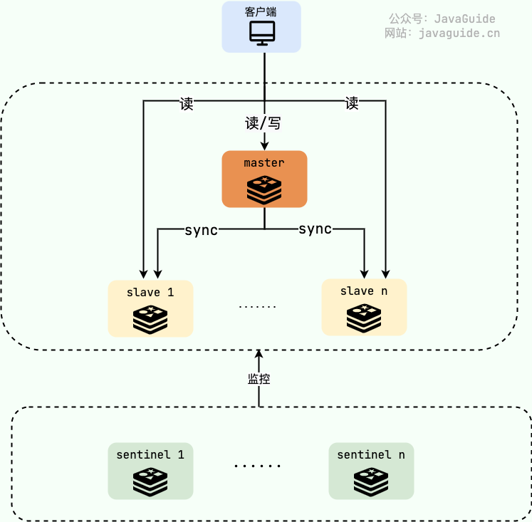
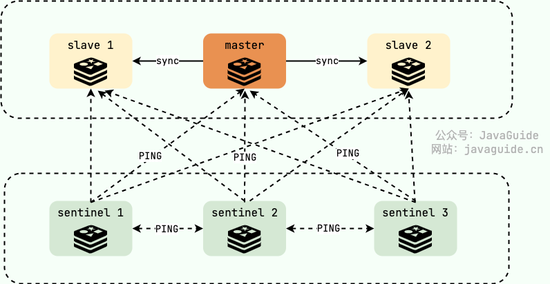
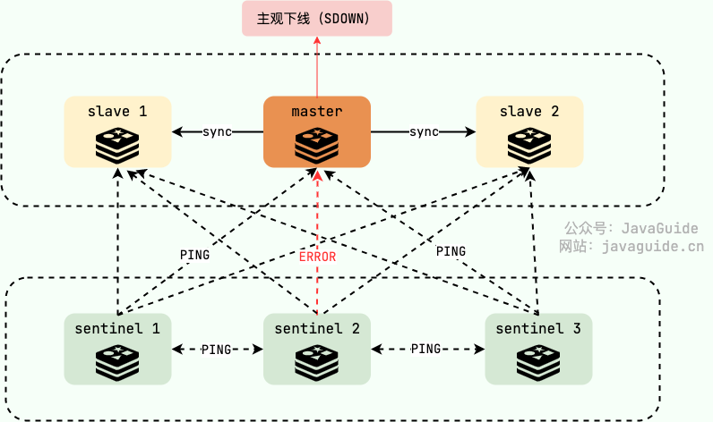
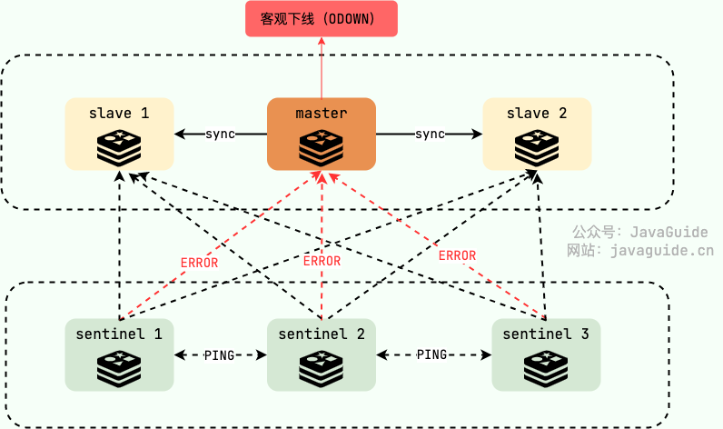

# Redis Sentinel：如何实现自动化地故障转移？

普通的主从复制方案下，一旦 master 宕机，我们需要从 slave 中手动选择一个新的 master，同时需要修改应用方的主节点地址，还需要命令所有从节点去复制新的主节点，整个过程需要人工干预。人工干预大大增加了问题的处理时间以及出错的可能性。

我们可以借助 Redis 官方的 Sentinel（哨兵）方案来帮助我们解决这个痛点，实现自动化地故障切换。

建议带着下面这些重要的问题（面试常问）阅读：

1. 什么是 Sentinel？ 有什么用？
2. Sentinel 如何检测节点是否下线？主观下线与客观下线的区别?
3. Sentinel 是如何实现故障转移的？
4. 为什么建议部署多个 sentinel 节点（哨兵集群）？
5. Sentinel 如何选择出新的 master（选举机制）?
6. 如何从 Sentinel 集群中选择出 Leader ？
7. Sentinel 可以防止脑裂吗？

## 什么是 Sentinel？

**Sentinel（哨兵）** 只是 Redis 的一种运行模式 ，不提供读写服务，默认运行在 26379 端口上，依赖于 Redis 工作。Redis Sentinel 的稳定版本是在 Redis 2.8 之后发布的。

Redis 在 Sentinel 这种特殊的运行模式下，使用专门的命令表，也就是说普通模式运行下的 Redis 命令将无法使用。

通过下面的命令就可以让 Redis 以 Sentinel 的方式运行:

```bash
redis-sentinel /path/to/sentinel.conf
或者
redis-server /path/to/sentinel.conf --sentinel
```

Redis 源码中的`sentinel.conf`是用来配置 Sentinel 的，一个常见的最小配置如下所示：

```plain
// 指定要监视的 master
// 127.0.0.1 6379 为 master 地址
// 2 表示当有 2 个 sentinel 认为 master 失效时，master 才算真正失效
sentinel monitor mymaster 127.0.0.1 6379 2
// master 节点宕机多长时间才会被 sentinel 认为是失效
sentinel down-after-milliseconds mymaster 60000
sentinel failover-timeout mymaster 180000
sentinel parallel-syncs mymaster 1

sentinel monitor resque 192.168.1.3 6380 4
sentinel down-after-milliseconds resque 10000
sentinel failover-timeout resque 180000
// 在发生主备切换时最多可以有 5 个 slave 同时对新的 master 进行同步
sentinel parallel-syncs resque 5
```

Redis Sentinel 实现 Redis 集群高可用，只是在主从复制实现集群的基础下，多了一个 Sentinel 角色来帮助我们监控 Redis 节点的运行状态并自动实现故障转移。

当 master 节点出现故障的时候， Sentinel 会帮助我们实现故障转移，自动根据一定的规则选出一个 slave 升级为 master，确保整个 Redis 系统的可用性。整个过程完全自动，不需要人工介入。



## Sentinel 有什么作用？

根据 [Redis Sentinel 官方文档](https://redis.io/topics/sentinel)的介绍，sentinel 节点主要可以提供 4 个功能：

* **监控**：监控所有 redis 节点（包括 sentinel 节点自身）的状态是否正常。
* **故障转移**：如果一个 master 出现故障，Sentinel 会帮助我们实现故障转移，自动将某一台 slave 升级为 master，确保整个 Redis 系统的可用性。
* **通知** ：通知 slave 新的 master 连接信息，让它们执行 replicaof 成为新的 master 的 slave。
* **配置提供** ：客户端连接 sentinel 请求 master 的地址，如果发生故障转移，sentinel 会通知新的 master 链接信息给客户端。

Redis Sentinel 本身设计的就是一个分布式系统，建议多个 sentinel 节点协作运行。这样做的好处是：

* **容错性增强:** 多个 sentinel 节点通过投票机制来判断 master 节点是否真正失效，避免了因网络波动等因素导致的误判。
* **高可用性:** 即使某个 Sentinel 节点失效，其他节点仍然可以继续监控和执行故障转移，确保系统的可用性。

**如果想要实现高可用，建议将哨兵 Sentinel 配置成单数且大于等于 3 台。**

一个最简易的 Redis Sentinel 集群如下所示（官方文档中的一个例子），其中：

* M1 表示 master，R2、R3 表示 slave；
* S1、S2、S3 都是 sentinel；
* quorum 表示判定 master 失效最少需要的仲裁节点数。这里的值为 2 ，也就是说当有 2 个 sentinel 认为 master 失效时，master 才算真正失效。

```lua
       +----+
       | M1 |
       | S1 |
       +----+
          |
+----+    |    +----+
| R2 |----+----| R3 |
| S2 |         | S3 |
+----+         +----+

Configuration: quorum = 2
```

如果 M1 出现问题，只要 S1、S2、S3 其中的两个投票赞同的话，就会开始故障转移工作，从 R2 或者 R3 中重新选出一个作为 master。

## Sentinel 如何检测节点是否下线？

> 相关的问题：
>
> * 主观下线与客观下线的区别?
> * Sentinel 是如何实现故障转移的？
> * 为什么建议部署多个 sentinel 节点（哨兵集群）？

Redis Sentinel 中有两个下线（Down）的概念：

* **主观下线(SDOWN)** ：sentinel 节点认为某个 Redis 节点已经下线了（主观下线），但还不是很确定，需要其他 sentinel 节点的投票。
* **客观下线(ODOWN)** ：法定数量（通常为过半）的 sentinel 节点认定某个 Redis 节点已经下线（客观下线），那它就算是真的下线了。

也就是说，**主观下线** 当前的 sentinel 自己认为节点宕机，客观下线是 sentinel 整体达成一致认为节点宕机。

每个 sentinel 节点以每秒钟一次的频率向整个集群中的 master、slave 以及其他 sentinel 节点发送一个 PING 命令。



如果对应的节点超过规定的时间（down-after-millseconds）没有进行有效回复的话，就会被其认定为是 **主观下线(SDOWN)** 。注意！这里的有效回复不一定是 PONG，可以是-LOADING 或者 -MASTERDOWN 。



如果被认定为主观下线的是 slave 的话， sentinel 不会做什么事情，因为 slave 下线对 Redis 集群的影响不大，Redis 集群对外正常提供服务。但如果是 master 被认定为主观下线就不一样了，sentinel 整体还要对其进行进一步核实，确保 master 是真的下线了。

所有 sentinel 节点要以每秒一次的频率确认 master 的确下线了，当法定数量（通常为过半）的 sentinel 节点认定 master 已经下线， master 才被判定为 **客观下线(ODOWN)** 。这样做的目的是为了防止误判，毕竟故障转移的开销还是比较大的，这也是为什么 Redis 官方推荐部署多个 sentinel 节点（哨兵集群）。



随后， sentinel 中会有一个 Leader 的角色来负责故障转移，也就是自动地从 slave 中选出一个新的 master 并执行完相关的一些工作(比如通知 slave 新的 master 连接信息，让它们执行 replicaof 成为新的 master 的 slave)。

如果没有足够数量的 sentinel 节点认定 master 已经下线的话，当 master 能对 sentinel 的 PING 命令进行有效回复之后，master 也就不再被认定为主观下线，回归正常。

这里简单总结一下 master 主观下线、客观下线和 master 恢复后的处理，帮助大家更好的理解整个过程：

1. **主观下线（Subjectively Down，SDOWN）：**  如果 master 在指定时间内（`down-after-milliseconds` 配置项指定，默认为 30 秒）未响应 sentinel 的 PING 命令，或返回无效回复，该 sentinel 会将其标记为主观下线。这仅仅是单个 sentinel 的判断，还需要其他 sentinel 节点的投票。
2. **客观下线（Objectively Down，ODOWN）：**  当一个 sentinel 将 master 标记为 SDOWN 后，它会向其他监控相同 master 的 sentinel 发送 `is-master-down-by-addr` 命令，询问它们是否也认为 master SDOWN。如果足够数量（`quorum` 配置项指定，通常为过半）的 sentinel 实例也认为 master SDOWN，则该 sentinel 实例会将 master 标记为客观下线。
3. **故障转移（Failover）：** 只有当 master 被标记为 ODOWN 后，sentinel 才会启动故障转移流程，选举新的 master。
4. **Master 恢复后的处理：**
   * **SDOWN 阶段恢复：** 如果 master 在被标记为 SDOWN 后，但在达到 ODOWN 之前恢复响应，sentinel 会取消 SDOWN 标记，master 恢复正常工作，不会触发故障转移。
   * **ODOWN 阶段及之后恢复：** 如果 master 在被标记为 ODOWN 后，也就是故障转移已经完成后恢复响应。sentinel 会自动将其配置为新 master 的从节点，无需手动操作。若原 master 因网络隔离或配置问题未自动加入集群，需手动执行 `REPLICAOF` 或 `SLAVEOF`。

## Sentinel 如何选择出新的 master?

slave 必须是在线状态才能参加新的 master 的选举，筛选出所有在线的 slave 之后，通过下面 3 个维度进行最后的筛选（优先级依次降低）：

1. **slave 优先级** ：可以通过修改 `slave-priority`（`redis.conf`中配置，Redis5.0 后该配置属性名称被修改为 `replica-priority`） 配置的值来手动设置 slave 的优先级。`slave-priority`默认值为 100，其值越小得分越高，越有机会成为 master。比如说假设有三个优先级分别为 10,100,25 的 slave ，哨兵将选择优先级为 10 的。不过，0 是一个特殊的优先级值 ，如果一个 slave 的 `slave-priority`值为 0，代表其没有参加 master 选举的资格。如果没有优先级最高的，再判断复制进度。
2. **复制进度** ：Sentinel 总是希望选择出数据最完整（与旧 master 数据最接近）也就是复制进度最快的 slave 被提升为新的 master，复制进度越快得分也就越高。
3. **runid(运行 id)** ：通常经过前面两轮筛选已经成功选出来了新的 master，万一真有多个 slave 的优先级和复制进度一样的话，那就 runid 小的成为新的 master，每个 redis 节点启动时都有一个 40 字节随机字符串作为运行 id。

## 如何从 Sentinel 集群中选择出 Leader ？

我们前面说了，当 sentinel 集群确认有 master 客观下线了，就会开始故障转移流程，故障转移流程的第一步就是在 sentinel 集群选择一个 leader，让 leader 来负责完成故障转移。

**如何选择出 Leader 角色呢？**

这就需要用到分布式领域的 **共识算法** 了。简单来说，共识算法就是让分布式系统中的节点就一个问题达成共识。在 sentinel 选举 leader 这个场景下，这些 sentinel 要达成的共识就是谁才是 leader 。

大部分共识算法都是基于 Paxos 算法改进而来，在 sentinel 选举 leader 这个场景下使用的是 [**Raft 算法**](https://javaguide.cn/distributed-system/theorem\&algorithm\&protocol/raft-algorithm.html)。这是一个比 Paxos 算法更易理解和实现的共识算法—Raft 算法。更具体点来说，Raft 是 Multi-Paxos 的一个变种，其简化了 Multi-Paxos 的思想，变得更容易被理解以及工程实现。

对于学有余力并且想要深入了解 Raft 算法实践以及 sentinel 选举 leader 的详细过程的同学，推荐阅读下面这两篇文章：

* [Raft 算法详解](https://javaguide.cn/distributed-system/protocol/raft-algorithm.html)
* [Raft 协议实战之 Redis Sentinel 的选举 Leader 源码解析](https://cloud.tencent.com/developer/article/1021467)

## Sentinel 可以防止脑裂吗？

还是上面的例子，如果 M1 和 R2、R3 之间的网络被隔离，也就是发生了脑裂，M1 和 R2 、 R3 隔离在了两个不同的网络分区中。这意味着，R2 或者 R3 其中一个会被选为 master，这里假设为 R2。

但是！这样会出现问题了！！

如果客户端 C1 是和 M1 在一个网络分区的话，从网络被隔离到网络分区恢复这段时间，C1 写入 M1 的数据都会丢失，并且，C1 读取的可能也是过时的数据。这是因为当网络分区恢复之后，M1 将会成为 slave 节点。

```lua
         +----+
         | M1 |
         | S1 | <- C1 (writes will be lost)
         +----+
            |
            /
            /
+------+    |    +----+
| [M2] |----+----| R3 |
| S2   |         | S3 |
+------+         +----+
```

想要解决这个问题的话也不难，对 Redis 主从复制进行配置即可。

```lua
min-replicas-to-write 1
min-replicas-max-lag 10
```

下面对这两个配置进行解释：

* **min-replicas-to-write 1**：用于配置写 master 至少写入的 slave 数量，设置为 0 表示关闭该功能。3 个节点的情况下，可以配置为 1 ，表示 master 必须写入至少 1 个 slave ，否则就停止接受新的写入命令请求。
* **min-replicas-max-lag 10** ：用于配置 master 多长时间（秒）无法得到从节点的响应，就认为这个节点失联。我们这里配置的是 10 秒，也就是说 master 10 秒都得不到一个从节点的响应，就会认为这个从节点失联，停止接受新的写入命令请求。

不过，这样配置会降低 Redis 服务的整体可用性，如果 2 个 slave 都挂掉，master 将会停止接受新的写入命令请求。

[\
](https://juejin.cn/post/6844903663362637832)


> 更新: 2025-03-16 16:39:54  
> 原文: <https://www.yuque.com/snailclimb/mf2z3k/ft4h1g>