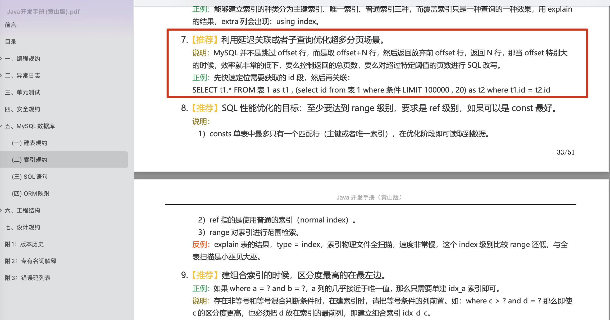
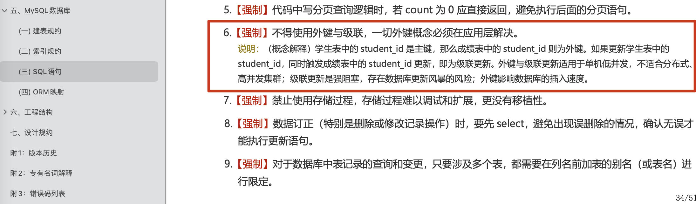
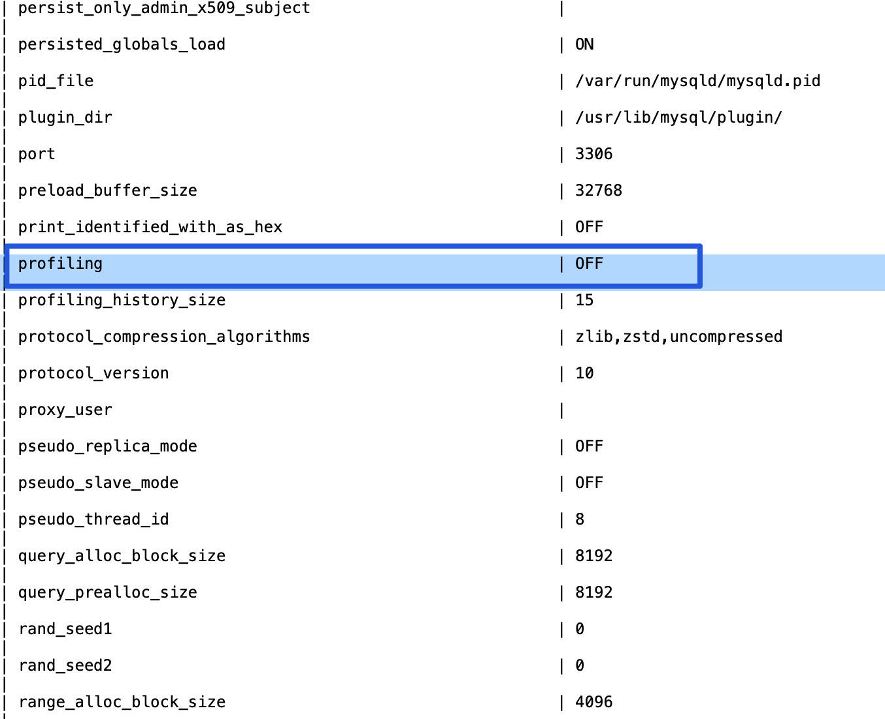
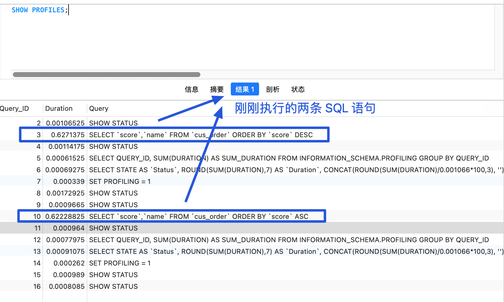
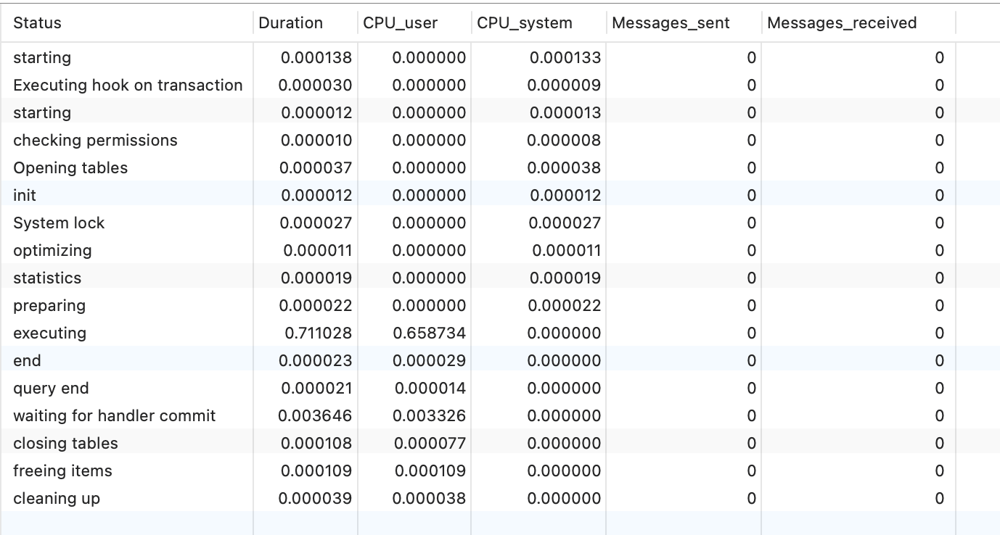

# 高性能：有哪些常见的 SQL 优化手段？

## 避免使用 SELECT \*

* `SELECT *` 会消耗更多的 CPU。
* `SELECT *` 无用字段增加网络带宽资源消耗，增加数据传输时间，尤其是大字段（如 varchar、blob、text）。
* `SELECT *` 无法使用 MySQL 优化器覆盖索引的优化（基于 MySQL 优化器的“覆盖索引”策略又是速度极快，效率极高，业界极为推荐的查询优化方式）
* `SELECT <字段列表>` 可减少表结构变更带来的影响。

## 深度分页优化

普通的分页在数据量小的时候耗费时间还是比较短的。

```sql
# 从第10000行开始，获取10条记录。
SELECT `score`,`name` FROM `cus_order` LIMIT 10000, 10;
```

如果数据量变大，达到百万甚至是千万级别，普通的分页耗费的时间就非常长了。像这种查询偏移量过大的场景我们称为深度分页。

```sql
# 从第1000000行开始，获取10条记录。
SELECT `score`,`name` FROM `cus_order` LIMIT 1000000, 10
```

**如何优化呢？** 可以将上述 SQL 语句修改为**子查询**。

```sql
# 子查询查出当前分页的首行id
SELECT `score`, `name` FROM `cus_order`
WHERE id >= (SELECT id FROM `cus_order` LIMIT 1000000, 1)
LIMIT 10;
```

我们先查询出 limit 第一个参数对应的主键值，再根据这个主键值再去过滤并 limit，这样效率会更快一些。

阿里巴巴《Java 开发手册》中也有对应的描述：

> 利用延迟关联或者子查询优化超多分页场景。



不过，子查询的结果会产生一张新表，会影响性能，应该尽量避免大量使用子查询。并且，这种方法只适用于 ID 是正序的。在复杂分页场景，往往需要通过过滤条件，筛选到符合条件的 ID，此时的 ID 是离散且不连续的。

当然，我们也可以利用子查询先去获取目标分页的 ID 集合，然后再根据 ID 集合获取内容，但这种写法非常繁琐，不如使用延迟关联。

延迟关联的优化思路，跟子查询的优化思路其实是一样的：都是把条件转移到主键索引树，减少回表的次数。

```sql
SELECT `score`,`name` FROM `cus_order` a, (SELECT id from `cus_order` LIMIT 1000000, 10) b
WHERE a.id = b.id;
```

也可以使用 INNER JOIN（内连接）来连接主查询和子查询，而不是逗号连接。

```sql
SELECT `score`,`name` FROM `cus_order` a
INNER JOIN(SELECT id from `cus_order` LIMIT 1000000, 10) b 
ON a.id = b.id
LIMIT 10;
```

我们先提取对应的主键，再将这个主键表与原数据表关联。

除了上面提到的子查询和延迟关联之外，覆盖索引对深度分页优化也有一定帮助。

索引中已经包含了所有需要获取的字段的查询方式称为覆盖索引。**覆盖索引的好处：**

* **避免 InnoDB 表进行索引的二次查询，也就是回表操作:** InnoDB 是以聚集索引的顺序来存储的，对于 InnoDB 来说，二级索引在叶子节点中所保存的是行的主键信息，如果是用二级索引查询数据的话，在查找到相应的键值后，还要通过主键进行二次查询才能获取我们真实所需要的数据。而在覆盖索引中，二级索引的键值中可以获取所有的数据，避免了对主键的二次查询（回表），减少了 IO 操作，提升了查询效率。
* **可以把随机 IO 变成顺序 IO 加快查询效率:** 由于覆盖索引是按键值的顺序存储的，对于 IO 密集型的范围查找来说，对比随机从磁盘读取每一行的数据 IO 要少的多，因此利用覆盖索引在访问时也可以把磁盘的随机读取的 IO 转变成索引查找的顺序 IO。

```sql
# 如果只需要查询 id, code, type 这三列，可建立 code 和 type 的覆盖索引
SELECT id, code, type FROM t_order
ORDER BY code
LIMIT 1000000, 10;
```

不过，当查询的结果集占表的总行数的很大一部分时，可能就不会走索引了，自动转换为全表扫描。当然了，也可以通过 `FORCE INDEX` 来强制查询优化器走索引，但这种提升效果一般不明显。

## 尽量避免多表做 join

阿里巴巴《Java 开发手册》中有这样一段描述：

> 【强制】超过三个表禁止 join。需要 join 的字段，数据类型保持绝对一致;多表关联查询时，保证被关联 的字段需要有索引。


join 的效率比较低，主要原因是因为其使用嵌套循环（Nested Loop）来实现关联查询，三种不同的实现效率都不是很高：

* **Simple Nested-Loop Join** ：没有进过优化，直接使用笛卡尔积实现 join，逐行遍历/全表扫描，效率最低。
* **Block Nested-Loop Join** ：利用 JOIN BUFFER 进行优化，性能受到 JOIN BUFFER 大小的影响，相比于 Simple Nested-Loop Join 性能有所提升。不过，如果两个表的数据过大的话，无论如何优化，Block Nested-Loop Join 对性能的提升都非常有限。
* **Index Nested-Loop Join** ：在必要的字段上增加索引，使 join 的过程中可以使用到这个索引，这样可以让 Block Nested-Loop Join 转换为 Index Nested-Loop Join，性能得到进一步提升。

实际业务场景避免多表 join 常见的做法有两种：

1. **单表查询后在内存中自己做关联** ：对数据库做单表查询，再根据查询结果进行二次查询，以此类推，最后再进行关联。
2. **数据冗余**，把一些重要的数据在表中做冗余，尽可能地避免关联查询。很笨的一种做法，表结构比较稳定的情况下才会考虑这种做法。进行冗余设计之前，思考一下自己的表结构设计的是否有问题。

更加推荐第一种，这种在实际项目中的使用率比较高，除了性能不错之外，还有如下优势：

1. **拆分后的单表查询代码可复用性更高** ：join 联表 SQL 基本不太可能被复用。
2. **单表查询更利于后续的维护** ：不论是后续修改表结构还是进行分库分表，单表查询维护起来都更容易。

不过，如果系统要求的并发量不大的话，我觉得多表 join 也是没问题的。很多公司内部复杂的系统，要求的并发量不高，很多数据必须 join 5 张以上的表才能查出来。

知乎上也有关于这个问题的讨论：[MySQL 多表关联查询效率高点还是多次单表查询效率高，为什么？](https://www.zhihu.com/question/68258877)，感兴趣的可以看看。

## 建议不要使用外键与级联

阿里巴巴《Java 开发手册》中有这样一段描述：

> 不得使用外键与级联，一切外键概念必须在应用层解决。



网络上已经有非常多分析外键与级联缺陷的文章了，个人认为不建议使用外键主要是因为对分库分表不友好，性能方面的影响其实是比较小的。

## 选择合适的字段类型

存储字节越小，占用也就空间越小，性能也越好。

**a.某些字符串可以转换成数字类型存储比如可以将 IP 地址转换成整型数据。**

数字是连续的，性能更好，占用空间也更小。

MySQL 提供了两个方法来处理 ip 地址

* `INET_ATON()` ： 把 ip 转为无符号整型 (4-8 位)
* `INET_NTOA()` :把整型的 ip 转为地址

插入数据前，先用 `INET_ATON()` 把 ip 地址转为整型，显示数据时，使用 `INET_NTOA()` 把整型的 ip 地址转为地址显示即可。

**b.对于非负型的数据 (如自增 ID,整型 IP，年龄) 来说,要优先使用无符号整型来存储。**

无符号相对于有符号可以多出一倍的存储空间

```sql
SIGNED INT -2147483648~2147483647
UNSIGNED INT 0~4294967295
```

**c.小数值类型（比如年龄、状态表示如 0/1）优先使用 TINYINT 类型。**

**d.对于日期类型来说， 一定不要用字符串存储日期。可以考虑 DATETIME、TIMESTAMP 和 数值型时间戳。**

这三种种方式都有各自的优势，根据实际场景选择最合适的才是王道。下面再对这三种方式做一个简单的对比，以供大家实际开发中选择正确的存放时间的数据类型：

| 类型 | 存储空间 | 日期格式 | 日期范围 | 是否带时区信息 |
| --- | --- | --- | --- | --- |
| DATETIME | 5~8字节 | YYYY-MM-DD hh:mm:ss\[.fraction] | 1000-01-01 00:00:00\[.000000] ～ 9999-12-31 23:59:59\[.999999] | 否 |
| TIMESTAMP | 4~7字节 | YYYY-MM-DD hh:mm:ss\[.fraction] | 1970-01-01 00:00:01\[.000000] ～ 2038-01-19 03:14:07\[.999999] | 是 |
| 数值型时间戳 | 4字节 | 全数字如1578707612 | 1970-01-01 00:00:01之后的时间 | 否 |

MySQL 时间类型选择的详细介绍请看这篇：[MySQL时间类型数据存储建议](https://javaguide.cn/database/mysql/some-thoughts-on-database-storage-time.html)。

**e.金额字段用 decimal，避免精度丢失。**

decimal 用于存储有精度要求的小数比如与金钱相关的数据，可以避免浮点数带来的精度损失。

在 Java 中，MySQL 的 decimal 类型对应的是 Java 类 `java.math.BigDecimal` 。

`BigDecimal`的详细介绍请参考这篇：[BigDecimal 详解](https://javaguide.cn/java/basis/bigdecimal.html)。

**f.尽量使用自增 id 作为主键。**

如果主键为自增 id 的话，每次都会将数据加在 B+树尾部（本质是双向链表），时间复杂度为 O(1)。在写满一个数据页的时候，直接申请另一个新数据页接着写就可以了。

如果主键是非自增 id 的话，为了让新加入数据后 B+树的叶子节点还能保持有序，它就需要往叶子结点的中间找，查找过程的时间复杂度是 O(lgn)。如果这个也被写满的话，就需要进行页分裂。页分裂操作需要加悲观锁，性能非常低。

不过， 像分库分表这类场景就不建议使用自增 id 作为主键，应该使用分布式 ID 比如 uuid 。

相关阅读：[数据库主键一定要自增吗？有哪些场景不建议自增？](https://mp.weixin.qq.com/s/vNRIFKjbe7itRTxmq-bkAA)。

**g.不建议使用 **<code>**NULL**</code>** 作为列默认值。**

`NULL` 跟 `''`(空字符串)是两个完全不一样的值，区别如下：

* `NULL` 代表一个不确定的值,就算是两个 `NULL`,它俩也不一定相等。例如，`SELECT NULL=NULL`的结果为 false，但是在我们使用`DISTINCT`,`GROUP BY`,`ORDER BY`时,`NULL`又被认为是相等的。
* `''`的长度是 0，是不占用空间的，而`NULL` 是需要占用空间的。
* `NULL` 会影响聚合函数的结果。例如，`SUM`、`AVG`、`MIN`、`MAX` 等聚合函数会忽略 `NULL` 值。 `COUNT` 的处理方式取决于参数的类型。如果参数是 `*`(`COUNT(*)`)，则会统计所有的记录数，包括 `NULL` 值；如果参数是某个字段名(`COUNT(列名)`)，则会忽略 `NULL` 值，只统计非空值的个数。
* 查询 `NULL` 值时，必须使用 `IS NULL` 或 `IS NOT NULLl` 来判断，而不能使用 =、!=、 <、> 之类的比较运算符。而`''`是可以使用这些比较运算符的。

## 尽量用 UNION ALL 代替 UNION

UNION 会把两个结果集的所有数据放到临时表中后再进行去重操作，更耗时，更消耗 CPU 资源。

UNION ALL 不会再对结果集进行去重操作，获取到的数据包含重复的项。

不过，如果实际业务场景中不允许产生重复数据的话，还是可以使用 UNION。

## 批量操作

对于数据库中的数据更新，如果能使用批量操作就要尽量使用，减少请求数据库的次数，提高性能。

```sql
# 反例
INSERT INTO `cus_order` (`id`, `score`, `name`) VALUES (1, 426547, 'user1');
INSERT INTO `cus_order` (`id`, `score`, `name`) VALUES (1, 33, 'user2');
INSERT INTO `cus_order` (`id`, `score`, `name`) VALUES (1, 293854, 'user3');

# 正例
INSERT into `cus_order` (`id`, `score`, `name`) values(1, 426547, 'user1'),(1, 33, 'user2'),(1, 293854, 'user3');
```

## Show Profile 分析 SQL 执行性能

为了更精准定位一条 SQL 语句的性能问题，需要清楚地知道这条 SQL 语句运行时消耗了多少系统资源。 `[SHOW PROFILE](https://dev.mysql.com/doc/refman/5.7/en/show-profile.html)` 和 `[SHOW PROFILES](https://dev.mysql.com/doc/refman/5.7/en/show-profiles.html)` 展示 SQL 语句的资源使用情况，展示的消息包括 CPU 的使用，CPU 上下文切换，IO 等待，内存使用等。

MySQL 在 5.0.37 版本之后才支持 Profiling，`select @@have_profiling` 命令返回 `YES` 表示该功能可以使用。

```sql
 mysql> SELECT @@have_profiling;
+------------------+
| @@have_profiling |
+------------------+
| YES              |
+------------------+
1 row in set (0.00 sec)
```

> **注意** ：`SHOW PROFILE` 和 `SHOW PROFILES` 已经被弃用，未来的 MySQL 版本中可能会被删除，取而代之的是使用 [Performance Schema](https://dev.mysql.com/doc/refman/8.0/en/performance-schema.html)。在该功能被删除之前，我们简单介绍一下其基本使用方法。

想要使用 Profiling，请确保你的 `profiling` 是开启（on）的状态。

你可以通过 `SHOW VARIABLES` 命令查看其状态：



也可以通过 `SELECT @@profiling`命令进行查看：

```sql

mysql> SELECT @@profiling;
+-------------+
| @@profiling |
+-------------+
|           0 |
+-------------+
1 row in set (0.00 sec)
```

默认情况下， `Profiling` 是关闭（off）的状态，你直接通过`SET @@profiling=1`命令即可开启。

开启成功之后，我们执行几条 SQL 语句。执行完成之后，使用 `SHOW PROFILES` 可以展示当前 Session 下所有 SQL 语句的简要的信息包括 Query\_ID（SQL 语句的 ID 编号） 和 Duration（耗时）。

具体能收集多少个 SQL，由参数 `profiling_history_size` 决定，默认值为 15，最大值为 100。如果设置为 0，等同于关闭 Profiling。



如果想要展示一个 SQL 语句的执行耗时细节，可以使用`SHOW PROFILE` 命令。

`SHOW PROFILE` 命令的具体用法如下：

```sql
SHOW PROFILE [type [, type] ... ]
    [FOR QUERY n]
    [LIMIT row_count [OFFSET offset]]

type: {
    ALL
  | BLOCK IO
  | CONTEXT SWITCHES
  | CPU
  | IPC
  | MEMORY
  | PAGE FAULTS
  | SOURCE
  | SWAPS
}
```

在执行`SHOW PROFILE` 命令时，可以加上类型子句，比如 CPU、IPC、MEMORY 等，查看具体某类资源的消耗情况：

```sql
SHOW PROFILE CPU,IPC FOR QUERY 8;
```

如果不加 `FOR QUERY {n}`子句，默认展示最新的一次 SQL 的执行情况，加了 `FOR QUERY {n}`，表示展示 Query\_ID 为 n 的 SQL 的执行情况。



## 优化慢 SQL

为了优化慢 SQL ，我们首先要找到哪些 SQL 语句执行速度比较慢。

MySQL 慢查询日志是用来记录 MySQL 在执行命令中，响应时间超过预设阈值的 SQL 语句。因此，通过分析慢查询日志我们就可以找出执行速度比较慢的 SQL 语句。

出于性能层面的考虑，慢查询日志功能默认是关闭的，你可以通过以下命令开启：

```sql
# 开启慢查询日志功能
SET GLOBAL slow_query_log = 'ON';
# 慢查询日志存放位置
SET GLOBAL slow_query_log_file = '/var/lib/mysql/ranking-list-slow.log';
# 无论是否超时，未被索引的记录也会记录下来。
SET GLOBAL log_queries_not_using_indexes = 'ON';
# 慢查询阈值（秒），SQL 执行超过这个阈值将被记录在日志中。
SET SESSION long_query_time = 1;
# 慢查询仅记录扫描行数大于此参数的 SQL
SET SESSION min_examined_row_limit = 100;
```

设置成功之后，使用 `show variables like 'slow%';` 命令进行查看。

```bash
| Variable_name       | Value                                |
+---------------------+--------------------------------------+
| slow_launch_time    | 2                                    |
| slow_query_log      | ON                                   |
| slow_query_log_file | /var/lib/mysql/ranking-list-slow.log |
+---------------------+--------------------------------------+
3 rows in set (0.01 sec)
```

我们故意在百万数据量的表(未使用索引)中执行一条排序的语句：

```sql
SELECT `score`,`name` FROM `cus_order` ORDER BY `score` DESC;
```

确保自己有对应目录的访问权限：

```bash
chmod 755 /var/lib/mysql/
```

查看对应的慢查询日志：

```bash
 cat /var/lib/mysql/ranking-list-slow.log
```

我们刚刚故意执行的 SQL 语句已经被慢查询日志记录了下来：

```plain
# Time: 2022-10-09T08:55:37.486797Z
# User@Host: root[root] @  [172.17.0.1]  Id:    14
# Query_time: 0.978054  Lock_time: 0.000164 Rows_sent: 999999  Rows_examined: 1999998
SET timestamp=1665305736;
SELECT `score`,`name` FROM `cus_order` ORDER BY `score` DESC;
```

这里对日志中的一些信息进行说明：

* `Time` ：被日志记录的代码在服务器上的运行时间。
* `User@Host`：谁执行的这段代码。
* `Query_time`：这段代码运行时长。
* `Lock_time`：执行这段代码时，锁定了多久。
* `Rows_sent`：慢查询返回的记录。
* `Rows_examined`：慢查询扫描过的行数。

实际项目中，慢查询日志通常会比较复杂，我们需要借助一些工具对其进行分析。像 MySQL 内置的 `mysqldumpslow` 工具就可以把相同的 SQL 归为一类，并统计出归类项的执行次数和每次执行的耗时等一系列对应的情况。

找到了慢 SQL 之后，我们可以通过 `EXPLAIN` 命令分析对应的 `SELECT` 语句：

```sql
mysql> EXPLAIN SELECT `score`,`name` FROM `cus_order` ORDER BY `score` DESC;
+----+-------------+-----------+------------+------+---------------+------+---------+------+--------+----------+----------------+
| id | select_type | table     | partitions | type | possible_keys | key  | key_len | ref  | rows   | filtered | Extra          |
+----+-------------+-----------+------------+------+---------------+------+---------+------+--------+----------+----------------+
|  1 | SIMPLE      | cus_order | NULL       | ALL  | NULL          | NULL | NULL    | NULL | 997572 |   100.00 | Using filesort |
+----+-------------+-----------+------------+------+---------------+------+---------+------+--------+----------+----------------+
1 row in set, 1 warning (0.00 sec)
```

比较重要的字段说明：

* `select_type` ：查询的类型，常用的取值有 SIMPLE（普通查询，即没有联合查询、子查询）、PRIMARY（主查询）、UNION（UNION 中后面的查询）、SUBQUERY（子查询）等。
* `table` ：表示查询涉及的表或衍生表。
* `type` ：执行方式，判断查询是否高效的重要参考指标，结果值从差到好依次是：ALL < index < range ~ index\_merge < ref < eq\_ref < const < system。
* `rows` : SQL 要查找到结果集需要扫描读取的数据行数，原则上 rows 越少越好。
* ......

关于 Explain 的详细介绍，请看这篇文章：[MySQL 执行计划分析](https://javaguide.cn/database/mysql/mysql-query-execution-plan.html)。另外，再推荐一下阿里的这篇文章：[慢 SQL 治理经验总结](https://mp.weixin.qq.com/s/LZRSQJufGRpRw6u4h_Uyww)，总结的挺不错。

## 正确使用索引

正确使用索引可以大大加快数据的检索速度（大大减少检索的数据量）。

### 选择合适的字段创建索引

* **不为 NULL 的字段** ：索引字段的数据应该尽量不为 NULL，因为对于数据为 NULL 的字段，数据库较难优化。如果字段频繁被查询，但又避免不了为 NULL，建议使用 0,1,true,false 这样语义较为清晰的短值或短字符作为替代。
* **被频繁查询的字段** ：我们创建索引的字段应该是查询操作非常频繁的字段。
* **被作为条件查询的字段** ：被作为 WHERE 条件查询的字段，应该被考虑建立索引。
* **频繁需要排序的字段** ：索引已经排序，这样查询可以利用索引的排序，加快排序查询时间。
* **被经常频繁用于连接的字段** ：经常用于连接的字段可能是一些外键列，对于外键列并不一定要建立外键，只是说该列涉及到表与表的关系。对于频繁被连接查询的字段，可以考虑建立索引，提高多表连接查询的效率。

### 被频繁更新的字段应该慎重建立索引

虽然索引能带来查询上的效率，但是维护索引的成本也是不小的。 如果一个字段不被经常查询，反而被经常修改，那么就更不应该在这种字段上建立索引了。

### 尽可能的考虑建立联合索引而不是单列索引

因为索引是需要占用磁盘空间的，可以简单理解为每个索引都对应着一颗 B+树。如果一个表的字段过多，索引过多，那么当这个表的数据达到一个体量后，索引占用的空间也是很多的，且修改索引时，耗费的时间也是较多的。如果是联合索引，多个字段在一个索引上，那么将会节约很大磁盘空间，且修改数据的操作效率也会提升。

### 注意避免冗余索引

冗余索引指的是索引的功能相同，能够命中索引(a, b)就肯定能命中索引(a) ，那么索引(a)就是冗余索引。如（name,city ）和（name ）这两个索引就是冗余索引，能够命中前者的查询肯定是能够命中后者的 在大多数情况下，都应该尽量扩展已有的索引而不是创建新索引。

### 考虑在字符串类型的字段上使用前缀索引代替普通索引

前缀索引仅限于字符串类型，较普通索引会占用更小的空间，所以可以考虑使用前缀索引带替普通索引。

### 避免索引失效

索引失效也是慢查询的主要原因之一，常见的导致索引失效的情况有下面这些：

* \~~使用 ~~<code>~~SELECT *~~</code>~~ 进行查询;~~ `SELECT *` 不会直接导致索引失效（如果不走索引大概率是因为 where 查询范围过大导致的），但它可能会带来一些其他的性能问题比如造成网络传输和数据处理的浪费、无法使用索引覆盖;
* 创建了组合索引，但查询条件未准守最左匹配原则;
* 在索引列上进行计算、函数、类型转换等操作;
* 以 % 开头的 LIKE 查询比如 `LIKE '%abc';`;
* 查询条件中使用 OR，且 OR 的前后条件中有一个列没有索引，涉及的索引都不会被使用到;
* IN 的取值范围较大时会导致索引失效，走全表扫描(NOT IN 和 IN 的失效场景相同);
* 发生[隐式转换](https://javaguide.cn/database/mysql/index-invalidation-caused-by-implicit-conversion.html);
* ……

推荐阅读这篇文章：

[美团暑期实习一面：MySQl 索引失效的场景有哪些？](https://mp.weixin.qq.com/s/mwME3qukHBFul57WQLkOYg)

### 删除长期未使用的索引

删除长期未使用的索引，不用的索引的存在会造成不必要的性能损耗 MySQL 5.7 可以通过查询 sys 库的 schema\_unused\_indexes 视图来查询哪些索引从未被使用

## 参考

* MySQL 8.2 Optimizing SQL Statements：<https://dev.mysql.com/doc/refman/8.0/en/statement-optimization.html>
* 为什么阿里巴巴禁止数据库中做多表 join - Hollis：<https://mp.weixin.qq.com/s/GSGVFkDLz1hZ1OjGndUjZg>
* MySQL 的 COUNT 语句，竟然都能被面试官虐的这么惨 - Hollis：<https://mp.weixin.qq.com/s/IOHvtel2KLNi-Ol4UBivbQ>
* MySQL 性能优化神器 Explain 使用分析：<https://segmentfault.com/a/1190000008131735>
* 如何使用 MySQL 慢查询日志进行性能优化 ：<https://kalacloud.com/blog/how-to-use-mysql-slow-query-log-profiling-mysqldumpslow/>


> 更新: 2024-09-13 17:06:39  
> 原文: <https://www.yuque.com/snailclimb/mf2z3k/abc2sv>