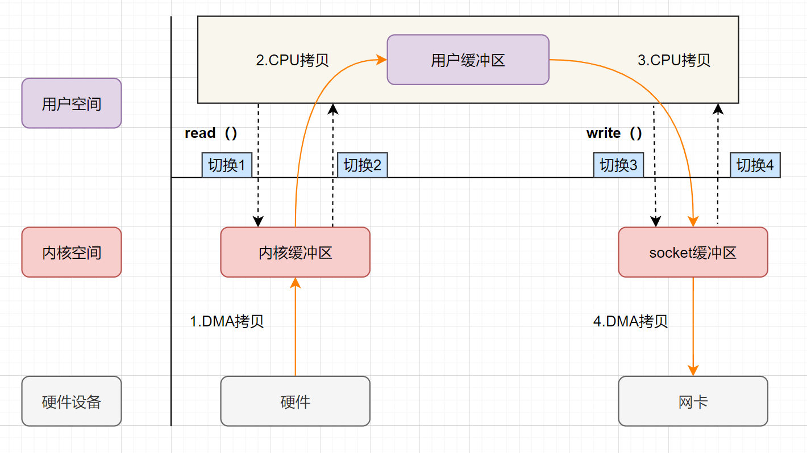
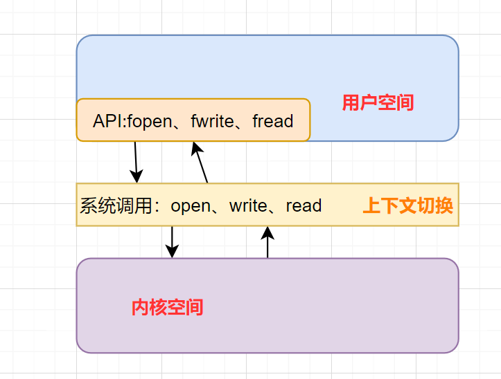
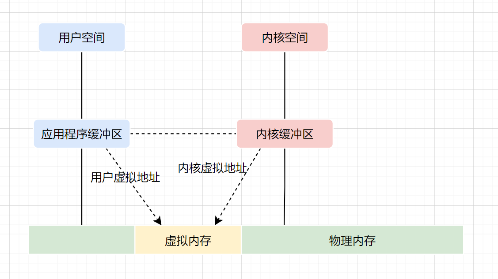
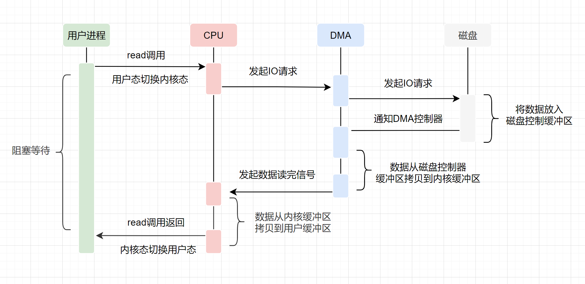
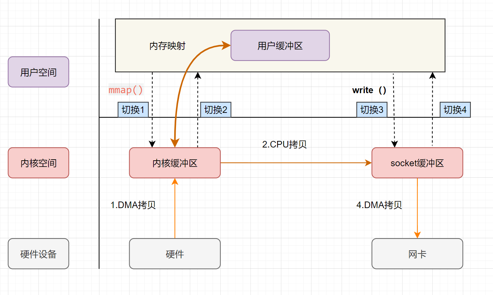
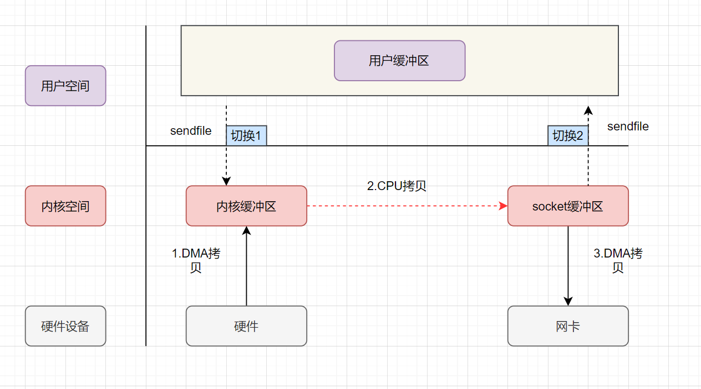
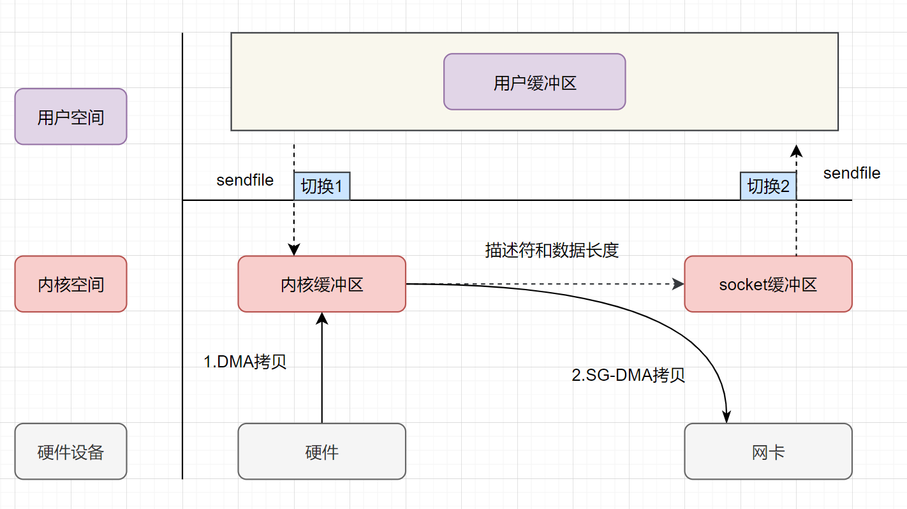

# 高性能：零拷贝为什么能提升性能？

> **相关面试题** ：
>
> * 简单描述一下传统的 IO 执行流程，有什么缺陷？
>
> * 什么是零拷贝？
>
> * 零拷贝实现的几种方式
>
> * Java 提供的零拷贝方式
>
> 作者：程序员田螺 ，公众号：捡田螺的小男孩
>
> 《Java 面试指北》已获授权并对其内容进行了完善。

零拷贝算是一个老生常谈的问题啦，很多顶级框架都用到了零拷贝来提升性能，比如我们经常接触到的 Kafka 、RocketMQ、Netty 。

搞懂零拷贝不仅仅可以让自己对这些框架的认识更进一步，还可以让自己在面试中更游刃有余。毕竟，面试中对于零拷贝的考察非常常见，尤其是大厂。

通常情况下，面试官不会直接提问零拷贝，他会先问你 Kafka/RocketMQ/Netty 为什么快，然后你回答到了零拷贝之后，他再去挖掘你对零拷贝的认识。

## 1.什么是零拷贝

零拷贝字面上的意思包括两个，“零”和“拷贝”：

* **“拷贝”** ：就是指数据从一个存储区域转移到另一个存储区域。
* **“零”** ：表示次数为 0，它表示拷贝数据的次数为 0。

合起来，那 **零拷贝** 就是不需要将数据从一个存储区域复制到另一个存储区域。

> 零拷贝是指计算机执行 IO 操作时，CPU 不需要将数据从一个存储区域复制到另一个存储区域，从而可以减少上下文切换以及 CPU 的拷贝时间。它是一种`I/O`操作优化技术。

## 2. 传统 IO 的执行流程

做服务端开发的小伙伴，文件下载功能应该实现过不少了吧。如果你实现的是一个 **Web 程序**，前端请求过来，服务端的任务就是：将服务端主机磁盘中的文件从已连接的 socket 发出去。关键实现代码如下：

```java
while((n = read(diskfd, buf, BUF_SIZE)) > 0)
    write(sockfd, buf , n);
```

传统的 IO 流程，包括 read 和 write 的过程。

* `read`：把数据从磁盘读取到内核缓冲区，再拷贝到用户缓冲区。
* `write`：先把数据写入到 socket 缓冲区，最后写入网卡设备。

**流程图如下：**



* 用户应用进程调用 `read` 函数，向操作系统发起 IO 调用，**上下文从用户态转为内核态（切换 1）**
* DMA 控制器把数据从磁盘中，读取到内核缓冲区。
* CPU 把内核缓冲区数据，拷贝到用户应用缓冲区，**上下文从内核态转为用户态（切换 2）**，read 函数返回
* 用户应用进程通过 write 函数，发起 IO 调用，**上下文从用户态转为内核态（切换 3）**
* CPU 将应用缓冲区中的数据，拷贝到 socket 缓冲区
* DMA 控制器把数据从 socket 缓冲区，拷贝到网卡设备，**上下文从内核态切换回用户态（切换 4）**，write 函数返回

从流程图可以看出，传统 IO 的读写流程，包括了 4 次上下文切换（4 次用户态和内核态的切换），4 次数据拷贝（**两次 CPU 拷贝以及两次的 DMA 拷贝**)，什么是 DMA 拷贝呢？我们一起来回顾下，零拷贝涉及的**操作系统知识点**哈。

## 3. 零拷贝相关的知识点回顾

### 3.1 内核空间和用户空间

我们电脑上跑着的应用程序，其实是需要经过**操作系统**，才能做一些特殊操作，如磁盘文件读写、内存的读写等等。因为这些都是比较危险的操作，**不可以由应用程序乱来**，只能交给底层操作系统来。

因此，操作系统为每个进程都分配了内存空间，一部分是用户空间，一部分是内核空间。**内核空间是操作系统内核访问的区域，是受保护的内存空间，而用户空间是用户应用程序访问的内存区域。** 以 32 位操作系统为例，它会为每一个进程都分配了**4G**(2 的 32 次方)的内存空间。

* **内核空间** ：主要提供进程调度、内存分配、连接硬件资源等功能
* **用户空间** ：提供给各个程序进程的空间，它不具有访问内核空间资源的权限，如果应用程序需要使用到内核空间的资源，则需要通过系统调用来完成。进程从用户空间切换到内核空间，完成相关操作后，再从内核空间切换回用户空间。

### 3.2 什么是用户态、内核态

* 如果进程运行于内核空间，被称为进程的内核态
* 如果进程运行于用户空间，被称为进程的用户态。

### 3.3 什么是上下文切换

**什么是上下文？**

> CPU 寄存器，是 CPU 内置的容量小、但速度极快的内存。而程序计数器，则是用来存储 CPU 正在执行的指令位置、或者即将执行的下一条指令位置。它们都是 CPU 在运行任何任务前，必须的依赖环境，因此叫做 CPU 上下文。

**什么是 CPU 上下文切换？**

> 它是指，先把前一个任务的 CPU 上下文（也就是 CPU 寄存器和程序计数器）保存起来，然后加载新任务的上下文到这些寄存器和程序计数器，最后再跳转到程序计数器所指的新位置，运行新任务。

一般我们说的**上下文切换**，就是指内核（操作系统的核心）在 CPU 上对进程或者线程进行切换。进程从用户态到内核态的转变，需要通过**系统调用**来完成。系统调用的过程，会发生**CPU 上下文的切换**。

> CPU 寄存器里原来用户态的指令位置，需要先保存起来。接着，为了执行内核态代码，CPU 寄存器需要更新为内核态指令的新位置。最后才是跳转到内核态运行内核任务。



### 3.4 虚拟内存

现代操作系统使用虚拟内存，即虚拟地址取代物理地址，使用虚拟内存可以有 2 个好处：

* 虚拟内存空间可以远远大于物理内存空间
* 多个虚拟内存可以指向同一个物理地址

正是**多个虚拟内存可以指向同一个物理地址**，可以把内核空间和用户空间的虚拟地址映射到同一个物理地址，这样的话，就可以减少 IO 的数据拷贝次数啦，示意图如下



### 3.5 DMA 技术

DMA，英文全称是 **Direct Memory Access**，即直接内存访问。**DMA**本质上是一块主板上独立的芯片，允许外设设备和内存存储器之间直接进行 IO 数据传输，其过程**不需要 CPU 的参与**。

我们一起来看下 IO 流程，DMA 帮忙做了什么事情.



* 用户应用进程调用 read 函数，向操作系统发起 IO 调用，进入阻塞状态，等待数据返回。
* CPU 收到指令后，对 DMA 控制器发起指令调度。
* DMA 收到 IO 请求后，将请求发送给磁盘；
* 磁盘将数据放入磁盘控制缓冲区，并通知 DMA
* DMA 将数据从磁盘控制器缓冲区拷贝到内核缓冲区。
* DMA 向 CPU 发出数据读完的信号，把工作交换给 CPU，由 CPU 负责将数据从内核缓冲区拷贝到用户缓冲区。
* 用户应用进程由内核态切换回用户态，解除阻塞状态

可以发现，DMA 做的事情很清晰啦，它主要就是**帮忙 CPU 转发一下 IO 请求，以及拷贝数据**。为什么需要它的？

> 主要就是效率，它帮忙 CPU 做事情，这时候，CPU 就可以闲下来去做别的事情，提高了 CPU 的利用效率。大白话解释就是，CPU 老哥太忙太累啦，所以他找了个小弟（名叫 DMA） ，替他完成一部分的拷贝工作，这样 CPU 老哥就能着手去做其他事情。

## 4. 零拷贝实现的几种方式

零拷贝并不是没有拷贝数据，而是减少用户态/内核态的切换次数以及 CPU 拷贝的次数。零拷贝实现有多种方式，分别是

* mmap+write
* sendfile
* 带有 DMA 收集拷贝功能的 sendfile

### 4.1 mmap+write 实现的零拷贝

mmap 的函数原型如下：

```c
void *mmap(void *addr, size_t length, int prot, int flags, int fd, off_t offset);
```

* `addr` ：指定映射的虚拟内存地址
* `length` ：映射的长度
* `prot` ：映射内存的保护模式
* `flags` ：指定映射的类型
* `fd` : 进行映射的文件句柄
* `offset` : 文件偏移量

前面一小节，零拷贝相关的知识点回顾，我们介绍了**虚拟内存**，可以把内核空间和用户空间的虚拟地址映射到同一个物理地址，从而减少数据拷贝次数！mmap 就是用了虚拟内存这个特点，它将内核中的读缓冲区与用户空间的缓冲区进行映射，所有的 IO 都在内核中完成。

`mmap+write`实现的零拷贝流程如下：



* 用户进程通过`mmap方法`向操作系统内核发起 IO 调用，**上下文从用户态切换为内核态**。
* CPU 利用 DMA 控制器，把数据从硬盘中拷贝到内核缓冲区。
* **上下文从内核态切换回用户态**，mmap 方法返回。
* 用户进程通过`write`方法向操作系统内核发起 IO 调用，**上下文从用户态切换为内核态**。
* CPU 将内核缓冲区的数据拷贝到的 socket 缓冲区。
* CPU 利用 DMA 控制器，把数据从 socket 缓冲区拷贝到网卡，**上下文从内核态切换回用户态**，write 调用返回。

可以发现，`mmap+write`实现的零拷贝，I/O 发生了**4**次用户空间与内核空间的上下文切换，以及 3 次数据拷贝。其中 3 次数据拷贝中，包括了**2 次 DMA 拷贝和 1 次 CPU 拷贝**。

`mmap`是将读缓冲区的地址和用户缓冲区的地址进行映射，内核缓冲区和应用缓冲区共享，所以节省了一次 CPU 拷贝‘’并且用户进程内存是**虚拟的**，只是**映射**到内核的读缓冲区，可以节省一半的内存空间。

### 4.2 sendfile 实现的零拷贝

`sendfile`是 Linux2.1 内核版本后引入的一个系统调用函数，API 如下：

```c
ssize_t sendfile(int out_fd, int in_fd, off_t *offset, size_t count);
```

* `out_fd` :为待写入内容的文件描述符，一个 socket 描述符。，
* `in_fd` :为待读出内容的文件描述符，必须是真实的文件，不能是 socket 和管道。
* `offset` ：指定从读入文件的哪个位置开始读，如果为 NULL，表示文件的默认起始位置。
* `count` ：指定在 fdout 和 fdin 之间传输的字节数。

`sendfile` 表示在两个文件描述符之间传输数据，它是在**操作系统内核**中操作的，**避免了数据从内核缓冲区和用户缓冲区之间的拷贝操作**，因此可以使用它来实现零拷贝。

`sendfile` 实现的零拷贝流程如下：



1. 用户进程发起 sendfile 系统调用，**上下文（切换 1）从用户态转向内核态**
2. DMA 控制器，把数据从硬盘中拷贝到内核缓冲区。
3. CPU 将读缓冲区中数据拷贝到 socket 缓冲区
4. DMA 控制器，异步把数据从 socket 缓冲区拷贝到网卡，
5. **上下文（切换 2）从内核态切换回用户态**，sendfile 调用返回。

可以发现，`sendfile`实现的零拷贝，I/O 发生了**2**次用户空间与内核空间的上下文切换，以及 3 次数据拷贝。其中 3 次数据拷贝中，包括了**2 次 DMA 拷贝和 1 次 CPU 拷贝**。那能不能把 CPU 拷贝的次数减少到 0 次呢？有的，即`带有DMA收集拷贝功能的sendfile`！

### 4.3 sendfile+DMA scatter/gather 实现的零拷贝

linux 2.4 版本之后，对`sendfile`做了优化升级，引入 SG-DMA 技术，其实就是对 DMA 拷贝加入了`scatter/gather`操作，它可以直接从内核空间缓冲区中将数据读取到网卡。使用这个特点搞零拷贝，即还可以多省去**一次 CPU 拷贝**。

sendfile+DMA scatter/gather 实现的零拷贝流程如下：



1. 用户进程发起 sendfile 系统调用，**上下文（切换 1）从用户态转向内核态**
2. DMA 控制器，把数据从硬盘中拷贝到内核缓冲区。
3. CPU 把内核缓冲区中的**文件描述符信息**（包括内核缓冲区的内存地址和偏移量）发送到 socket 缓冲区
4. DMA 控制器根据文件描述符信息，直接把数据从内核缓冲区拷贝到网卡
5. **上下文（切换 2）从内核态切换回用户态**，sendfile 调用返回。

可以发现，`sendfile+DMA scatter/gather`实现的零拷贝，I/O 发生了**2**次用户空间与内核空间的上下文切换，以及 2 次数据拷贝。其中 2 次数据拷贝都是包**DMA 拷贝**。这就是真正的 **零拷贝（Zero-copy)** 技术，全程都没有通过 CPU 来搬运数据，所有的数据都是通过 DMA 来进行传输的。

## 5. java 提供的零拷贝方式

* Java NIO 对 mmap 的支持
* Java NIO 对 sendfile 的支持

### 5.1 Java NIO 对 mmap 的支持

Java NIO 有一个`MappedByteBuffer`的类，可以用来实现内存映射。它的底层是调用了 Linux 内核的**mmap**的 API。

**mmap 的小 demo**如下：

```java
public class MmapTest {

    public static void main(String[] args) {
        try {
            FileChannel readChannel = FileChannel.open(Paths.get("./jay.txt"), StandardOpenOption.READ);
            MappedByteBuffer data = readChannel.map(FileChannel.MapMode.READ_ONLY, 0, 1024 * 1024 * 40);
            FileChannel writeChannel = FileChannel.open(Paths.get("./siting.txt"), StandardOpenOption.WRITE, StandardOpenOption.CREATE);
            //数据传输
            writeChannel.write(data);
            readChannel.close();
            writeChannel.close();
        }catch (Exception e){
            System.out.println(e.getMessage());
        }
    }
}
```

### 5.2 Java NIO 对 sendfile 的支持

FileChannel 的`transferTo()/transferFrom()`，底层就是 sendfile() 系统调用函数。Kafka 这个开源项目就用到它，平时面试的时候，回答面试官为什么这么快，就可以提到零拷贝`sendfile`这个点。

```java
@Override
public long transferFrom(FileChannel fileChannel, long position, long count) throws IOException {
   return fileChannel.transferTo(position, count, socketChannel);
}
```

**sendfile 的小 demo**如下：

```java
public class SendFileTest {
    public static void main(String[] args) {
        try {
            FileChannel readChannel = FileChannel.open(Paths.get("./jay.txt"), StandardOpenOption.READ);
            long len = readChannel.size();
            long position = readChannel.position();

            FileChannel writeChannel = FileChannel.open(Paths.get("./siting.txt"), StandardOpenOption.WRITE, StandardOpenOption.CREATE);
            //数据传输
            readChannel.transferTo(position, len, writeChannel);
            readChannel.close();
            writeChannel.close();
        } catch (Exception e) {
            System.out.println(e.getMessage());
        }
    }
}
```

## 参考与感谢

* [框架篇：小白也能秒懂的 Linux 零拷贝原理](https://juejin.cn/post/6887469050515947528)
* [深入剖析 Linux IO 原理和几种零拷贝机制的实现](https://juejin.cn/post/6844903949359644680#heading-11)
* [阿里二面：什么是 mmap？](https://mp.weixin.qq.com/s/sG0rviJlhVtHzGfd5NoqDQ)


> 更新: 2022-05-29 15:13:33  
> 原文: <https://www.yuque.com/snailclimb/mf2z3k/yc7k8o>