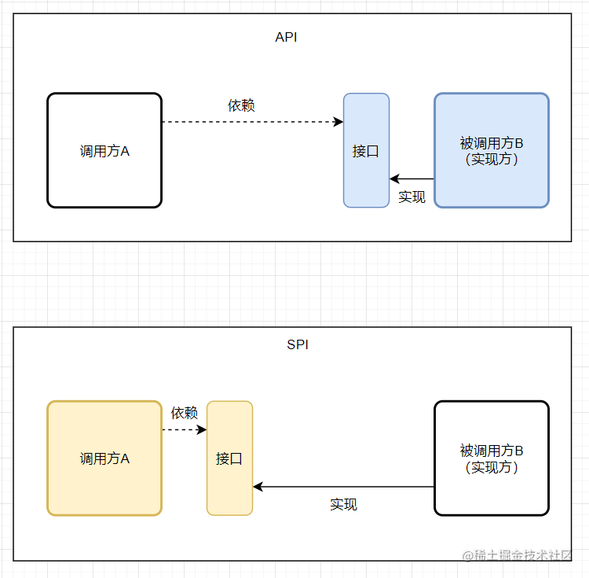

# Java基础常见面试题自测

## 数据类型

**Java 中有哪 8 种基本数据类型？它们的默认值和占用的空间大小知道不？ 说说这 8 种基本数据类型对应的包装类型。【****⭐⭐⭐⭐****】**

💡 提示：Java 中有 8 种基本数据类型，分别为：

1. 6 种数字类型 ：`byte`、`short`、`int`、`long`、`float`、`double`
2. 1 种字符类型：`char`
3. 1 种布尔型：`boolean`。

**包装类型的常量池技术了解么？【****⭐⭐⭐⭐⭐****】**

💡 提示：Java 基本类型的包装类的大部分（`Byte`,`Short`,`Integer`,`Long` ,`Character`,`Boolean`）都实现了常量池技术。

🌈 拓展：整型包装类对象之间值的比较应该使用 `equals` 方法

**为什么要有包装类型？【****⭐⭐⭐****】**

💡 提示： 基本类型有默认值、泛型参数不能是基本类型

**什么是自动拆装箱？原理？【****⭐⭐⭐⭐⭐****】**

💡 提示：基本类型和包装类型之间的互转。装箱其实就是调用了 包装类的`valueOf()`方法，拆箱其实就是调用了 `xxxValue()`方法。

**遇到过自动拆箱引发的 NPE 问题吗？【****⭐⭐⭐⭐****】**

💡 提示：两个常见的场景：

* 数据库的查询结果可能是 null，因为自动拆箱，用基本数据类型接收有 NPE 风险
* 三目运算符使用不当会导致诡异的 NPE 异常

## 面向对象

<code>**String**</code>**、**<code>**StringBuffer**</code>\*\* 和 **<code>**StringBuilder**</code>** 的区别是什么? **<code>**String**</code>** 为什么是不可变的?【****⭐⭐⭐⭐⭐****】\*\*

💡 提示：可以从可变性、线程安全性、性能这几个角度来回答。

**重载和重写的区别？【****⭐⭐⭐⭐⭐****】**

💡 提示：可以从下面几个角度来回答：

* 发生范围
* 参数列表
* 返回值类型
* 异常
* 访问修饰符
* 发生阶段\ <code>**==**</code>\*\* 和 **<code>**equals()**</code>** 的区别【****⭐⭐⭐⭐⭐****】\*\*

💡 提示：<code>**==**</code> 对于基本类型和引用类型的作用效果是不同的，<code>**equals()**</code> 不能用于判断基本数据类型的变量，只能用来判断两个对象是否相等。`equals()` 方法存在两种使用情况：

* \*\*类没有重写 \*\*<code>**equals()**</code>**方法** ：通过`equals()`比较该类的两个对象时，等价于通过“==”比较这两个对象，使用的默认是 `Object`类`equals()`方法。
* \*\*类重写了 \*\*<code>**equals()**</code>**方法** ：一般我们都重写 `equals()`方法来比较两个对象中的属性是否相等；若它们的属性相等，则返回 true(即，认为这两个对象相等)。

**内部类了解吗？匿名内部类了解吗？【****⭐⭐⭐****】**

内部类分为下面 4 种：

* 成员内部类
* 静态内部类
* 局部（方法）内部类
* 匿名内部类

**深拷贝和浅拷贝区别了解吗？什么是引用拷贝？【****⭐⭐⭐⭐****】**

💡 提示：浅拷贝会在堆上创建一个新的对象（区别于引用拷贝的一点），不过，如果原对象内部的属性是引用类型的话，浅拷贝会直接复制内部对象的引用地址，也就是说拷贝对象和原对象共用同一个内部对象。深拷贝会完全复制整个对象，包括这个对象所包含的内部对象。

**接口和抽象类有什么共同点和区别？如何选择？【****⭐⭐⭐⭐⭐****】**

💡 提示：接口主要用于对类的行为进行约束，你实现了某个接口就具有了对应的行为。抽象类主要用于代码复用，强调的是所属关系。

## 反射&注解&泛型

**Java 反射？反射有什么优点/缺点？你是怎么理解反射的（为什么框架需要反射）？【****⭐⭐⭐⭐⭐****】**

💡 提示： 想想你平时使用框架为啥能够如此方便。想想动态代理以及注解和反射之间的关系。

**谈谈对 Java 注解的理解，解决了什么问题？【****⭐⭐⭐****】**

💡 提示： 想想你平时使用框架为啥能够如此方便。另外，需要注意注解的解析依赖于反射机制，务必要提前把反射机制搞懂。

**Java 泛型了解么？泛型的作用？什么是类型擦除？泛型有哪些限制？介绍一下常用的通配符？【****⭐⭐⭐⭐****】**

💡 提示：

* 好处：编译期间的类型检测（安全）、可读性更好
* Java 的泛型是伪泛型

## SPI

**什么是 SPI？有什么用？【****⭐⭐⭐⭐****】**

💡 提示：很多框架都使用了 Java 的 SPI 机制，比如：Spring 框架、数据库加载驱动、日志接口、以及 Dubbo 的扩展实现等等。面试的时候，如果可以结合具体的应用来讲会更好一些。

**SPI 和 API 有什么区别？【****⭐⭐⭐⭐****】**

💡 提示：

**Java SPI 实现原理了解吗？【****⭐⭐⭐****】**

💡 提示：这个属于进阶内容了，一般只会在大厂面试中遇到。

相关阅读：[Java SPI 使用及原理分析 - 董宗磊 - 2021](https://dongzl.github.io/2021/01/16/04-Java-Service-Provider-Interface/)

## I/O

**I/O 流为什么要分为字节流和字符流呢?【****⭐⭐⭐****】**

💡 提示：问题本质想问：不管是文件读写还是网络发送接收，信息的最小存储单元都是字节，那为什么 I/O 流操作要分为字节流操作和字符流操作呢？

**Java IO 中的设计模式有哪些？【****⭐⭐⭐****】**

💡 提示：了解几个常见的就行了比如装饰器、适配器、工厂、观察者。

相关阅读：[Java IO 设计模式总结 - JavaGuide - 2022](https://javaguide.cn/java/io/io-design-patterns.html) 。

**BIO,NIO,AIO 有什么区别?【****⭐⭐⭐⭐⭐****】**

💡 提示：IO 模型这块挺难理解的，需要很多计算机底层知识。建议小伙伴们克服困难，一定要把这个点搞明白。

相关阅读：[Java IO 模型详解 - JavaGuide - 2022](https://javaguide.cn/java/io/io-model.html) 。

> 更新: 2023-01-30 16:25:26  
> 原文: <https://www.yuque.com/snailclimb/mf2z3k/gre6gr>