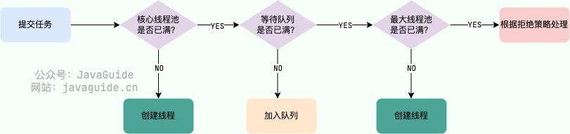

# Java 并发常见面试题自测

Java 并发在面试中还是非常常问的，需要多花一些时间准备！另外，个人建议你在项目经历中提到一两条多线程相关的应用，例如 [CompletableFuture 编排任务](https://t.zsxq.com/oEXEh)。

📌**说明**：

1. 下面这些 Java 并发自测问题的详细参考答案你都可以在 [JavaGuide ](https://javaguide.cn/cs-basics/network/other-network-questions.html)中找到。我还会直接给出对应的参考文章，方便你查阅。
2. ⭐代表重要程度，⭐越多表现面试越爱问，越要认真准备。

如果觉得 Java 并发知识点太多的话，完全可以按照这个自测来准备，把握重点，这样可以节省不少时间！

## 基础

> 相关阅读：[Java 并发常见面试题总结（上） - JavaGuide](https://javaguide.cn/java/concurrent/java-concurrent-questions-01.html)

### 什么是线程和进程?线程与进程的关系,区别及优缺点？⭐⭐⭐⭐

💡 提示：可以从从 JVM 角度说进程和线程之间的关系

### 为什么要使用多线程呢? ⭐⭐⭐

💡 提示：从计算机角度来说主要是为了充分利用多核 CPU 的能力，从项目角度来说主要是为了提升系统的性能。

### 说说线程的生命周期和状态? ⭐⭐⭐⭐

💡 提示： 6 种状态（`NEW`、`RUNNABLE`、`BLOCKED`、`WAITING`、`TIME_WAITING`、`TERMINATED`）。

🌈 拓展：在操作系统中层面线程有 `READY` 和 `RUNNING` 状态，而在 JVM 层面只能看到 `RUNNABLE` 状态。

### 什么是线程死锁?如何避免死锁?如何预防和避免线程死锁? ⭐⭐⭐⭐

💡 提示： 这里最好能够结合代码来聊，你要确保自己可以写出有死锁问题的代码。

🌈 拓展：项目中遇到死锁问题是比较常见的，除了要搞懂上面这些死锁的基本概念之外，你还要知道线上项目遇到死锁问题该如何排查和解决。

## 乐观锁和悲观锁

> 相关阅读：[乐观锁和悲观锁详解 - JavaGuide](https://javaguide.cn/java/concurrent/optimistic-lock-and-pessimistic-lock.html)

### 乐观锁和悲观锁的区别 ⭐⭐⭐⭐⭐

💡 提示：乐观锁和悲观锁的最终目的都是为了保证线程安全，避免在并发场景下的资源竞争问题，但乐观锁不会真的去加锁。

### 如何实现乐观锁？ ⭐⭐⭐⭐

💡 提示：乐观锁一般会使用版本号机制或 CAS 算法实现，CAS 算法相对来说更多一些，这里需要格外注意。

### `CAS` 了解么？原理？ ⭐⭐⭐⭐⭐

💡 提示：多地方都用到了 `CAS` 比如 `ConcurrentHashMap` 采用 `CAS` 和 `synchronized` 来保证并发安全，再比如`java.util.concurrent.atomic`包中的类通过 `volatile+CAS` 重试保证线程安全性。和面试官聊 `CAS` 的时候，你可以结合 `CAS` 的一些实际应用来说。

### 乐观锁存在哪些问题？ ⭐⭐⭐

💡 提示： ABA 问题、循环时间长开销大、只能保证一个共享变量的原子操作

### 什么是 ABA 问题？ABA 问题怎么解决？ ⭐⭐⭐⭐

💡 提示： 所谓 ABA 问题，就是一个值原来是 A，变成了 B，又变回了 A。这个时候使用 CAS 是检查不出变化的，但实际上却被更新了两次。ABA 问题的解决思路是在变量前面追加上版本号或者时间戳。从 JDK 1.5 开始，JDK 的 atomic 包里提供了一个类 `AtomicStampedReference` 类来解决 ABA 问题。

## JMM

> 相关阅读：[JMM（Java 内存模型）详解 - JavaGuide](https://javaguide.cn/java/concurrent/jmm.html)

### 并发编程的三个重要特性 ⭐⭐⭐⭐⭐

💡 提示： 原子性、可见性、有序性

### 什么是 JMM？为什么需要 JMM？ ⭐⭐⭐⭐⭐

💡 提示：对于 Java 来说，你可以把 JMM 看作是 Java 定义的并发编程相关的一组规范，除了抽象了线程和主内存之间的关系之外，其还规定了从 Java 源代码到 CPU 可执行指令的这个转化过程要遵守哪些和并发相关的原则和规范，其主要目的是为了简化多线程编程，增强程序可移植性的。

相关阅读：[JMM（Java 内存模型）详解](https://javaguide.cn/java/concurrent/jmm.html)

### JMM 是如何抽象线程和主内存之间的关系？⭐⭐⭐⭐⭐

💡 提示：Java 内存模型的抽象示意图如下：

### Java 内存区域和 JMM 有何区别？ ⭐⭐⭐⭐

💡 提示： Java 内存区域和内存模型是完全不一样的两个东西。

### happens-before 原则是什么？为什么需要 happens-before 原则？ ⭐⭐⭐

💡 提示：happens-before 原则的诞生是为了程序员和编译器、处理器之间的平衡。程序员追求的是易于理解和编程的强内存模型，遵守既定规则编码即可。编译器和处理器追求的是较少约束的弱内存模型，让它们尽己所能地去优化性能，让性能最大化。

## synchronized 和 volatile

### `synchronized` 关键字 ⭐⭐⭐⭐⭐

💡 提示：`synchronized` 关键字几乎是面试必问，你需要搞懂下面这些 `synchronized` 关键字相关的问题：

* `synchronized` 关键字的作用，自己是怎么使用的。
* `synchronized` 关键字的底层原理（重点！！！）
* JDK1.6 之后的 `synchronized` 关键字底层做了哪些优化。`synchronized` 锁升级流程。
* `synchronized` 和 `ReentrantLock` 的区别。
* `synchronized` 和 `volatile` 的区别。

### `volatile` 关键字 ⭐⭐⭐⭐⭐

💡 提示：`volatile` 关键字同样是一个重点！结合 `JMM`（Java Memory Model，Java 内存模型）来回答就行了。

## ThreadLocal

### ThreadLocal 有什么用？⭐⭐⭐

💡 提示：`ThreadLocal` 用于为每个线程提供独立的变量副本，解决多线程环境中的数据竞争和线程安全问题。每个线程都有自己的“本地变量盒子”，确保数据互不干扰。通过 `ThreadLocal`，线程可以使用 `get()` 和 `set()` 方法访问和修改自己的副本，从而避免线程安全问题。

### ThreadLocal 原理了解吗？⭐⭐⭐⭐⭐

💡 提示：

* 每个线程都有一个 `ThreadLocalMap`。
* `ThreadLocal` 变量的值存储在这个 `ThreadLocalMap` 中，而不是直接在 `ThreadLocal` 对象上。
* `ThreadLocal` 作为键，存储和访问线程特有的数据。
* 通过 `get()` 和 `set()` 方法，`ThreadLocal` 传递和管理变量值。

<code>ThreadLocal</code> 数据结构如下图所示：

## 线程池

> 相关阅读：[Java 线程池详解 - JavaGuide ](https://javaguide.cn/java/concurrent/java-thread-pool-summary.html)。

### 为什么要用线程池？⭐⭐⭐⭐

💡 提示：

* **降低资源消耗**。通过重复利用已创建的线程降低线程创建和销毁造成的消耗。
* **提高响应速度**。当任务到达时，任务可以不需要等到线程创建就能立即执行。
* **提高线程的可管理性**。线程是稀缺资源，如果无限制的创建，不仅会消耗系统资源，还会降低系统的稳定性，使用线程池可以进行统一的分配，调优和监控。

### 为什么不推荐使用内置线程池？⭐⭐⭐⭐⭐

💡 提示：

* `FixedThreadPool` 和 `SingleThreadExecutor` 使用 `LinkedBlockingQueue`，任务队列长度为 `Integer.MAX_VALUE`，可能导致 OOM。
* `CachedThreadPool` 使用 `SynchronousQueue`，线程数量可达 `Integer.MAX_VALUE`，任务过多时可能导致 OOM。
* `ScheduledThreadPool` 和 `SingleThreadScheduledExecutor` 使用 `DelayedWorkQueue`，任务队列长度为 `Integer.MAX_VALUE`，可能导致 OOM。

### 线程池常见参数有哪些？如何解释？⭐⭐⭐⭐⭐

💡 提示：<code>corePoolSize</code>、<code>maximumPoolSize</code>、<code>workQueue</code>、<code>keepAliveTime</code>、<code>threadFactory</code>、<code>handler</code>。

### 线程池的拒绝策略有哪些？⭐⭐⭐⭐⭐

💡 提示：

| 策略 | 描述 |
| --- | --- |
| `AbortPolicy` | 抛出异常拒绝新任务。 |
| `CallerRunsPolicy` | 在调用者线程中运行被拒绝任务，可能影响性能。 |
| `DiscardPolicy` | 直接丢弃新任务。 |
| `DiscardOldestPolicy` | 丢弃最早的未处理任务。 |

### 线程池的核心线程会被回收吗？⭐⭐⭐

💡 提示：

`ThreadPoolExecutor` 默认不会回收核心线程，即使它们已经空闲了。这是为了减少创建线程的开销，因为核心线程通常是要长期保持活跃的。但是，如果线程池是被用于周期性使用的场景，且频率不高（周期之间有明显的空闲时间），可以考虑将 `allowCoreThreadTimeOut(boolean value)` 方法的参数设置为 `true`，这样就会回收空闲（时间间隔由 `keepAliveTime` 指定）的核心线程了。

换一种问法：

* `keepAliveTime` 对核心线程是否生效，是否能杀死核心线程?
* 如果我想杀死核心线程应该怎么做?

### 线程池常用的阻塞队列有哪些？⭐⭐⭐

💡 提示：容量为 `Integer.MAX_VALUE` 的 `LinkedBlockingQueue`（无界阻塞队列）、`SynchronousQueue`（同步队列）、`DelayedWorkQueue`（延迟队列）、`ArrayBlockingQueue`（有界阻塞队列）。

### 线程池处理任务的流程了解吗？⭐⭐⭐⭐⭐

💡 提示：

### 线程池中线程异常后，销毁还是复用？⭐⭐⭐⭐

💡 提示：

使用`execute()`时，未捕获异常导致线程终止，线程池创建新线程替代；使用`submit()`时，异常被封装在`Future`中，线程继续复用。

### 如何设计一个能够根据任务的优先级来执行的线程池？⭐⭐⭐⭐

💡 提示：

可以考虑使用 `PriorityBlockingQueue` （优先级阻塞队列）作为任务队列。

## AQS

> 相关阅读：[AQS 详解 - JavaGuide](https://javaguide.cn/java/concurrent/aqs.html)。

### AQS 是什么？AQS 的原理是什么？⭐⭐⭐⭐⭐

💡 提示：

AQS 的全称为 `AbstractQueuedSynchronizer` ，翻译过来的意思就是抽象队列同步器。这个类在 `java.util.concurrent.locks` 包下面。AQS 核心思想是，如果被请求的共享资源空闲，则将当前请求资源的线程设置为有效的工作线程，并且将共享资源设置为锁定状态。如果被请求的共享资源被占用，那么就需要一套线程阻塞等待以及被唤醒时锁分配的机制，这个机制 AQS 是用 **CLH 队列锁** 实现的，即将暂时获取不到锁的线程加入到队列中。

### Semaphore 有什么用？Semaphore 的原理是什么？⭐⭐⭐⭐

💡 提示：

`Semaphore` 是共享锁的一种实现，它默认构造 AQS 的 `state` 值为 `permits`，你可以将 `permits` 的值理解为许可证的数量，只有拿到许可证的线程才能执行。

### CountDownLatch 有什么用？CountDownLatch 的原理是什么？用过 CountDownLatch 么？什么场景下用的？⭐⭐⭐⭐

💡 提示：

`CountDownLatch` 允许 `count` 个线程阻塞在一个地方，直至所有线程的任务都执行完毕，一次性的。

### CyclicBarrier 有什么用？CyclicBarrier 的原理是什么？⭐⭐⭐

💡 提示：

`CyclicBarrier` 和 `CountDownLatch` 非常类似，它也可以实现线程间的技术等待，但是它的功能比 `CountDownLatch` 更加复杂和强大。主要应用场景和 `CountDownLatch` 类似。

> 更新: 2026-07-24 15:14:21  
> 原文: <https://www.yuque.com/snailclimb/mf2z3k/cm70wa>