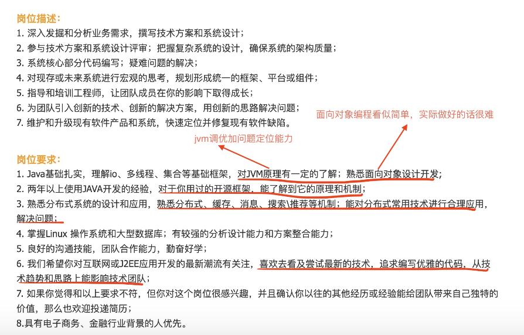
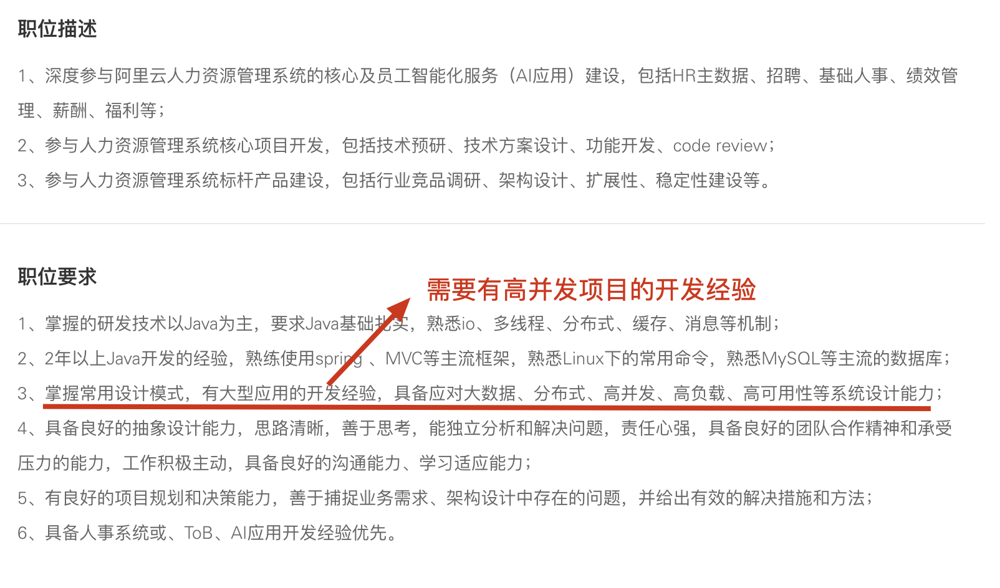
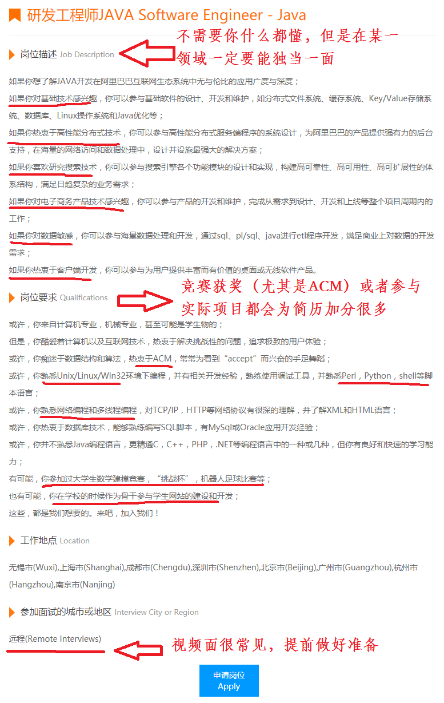
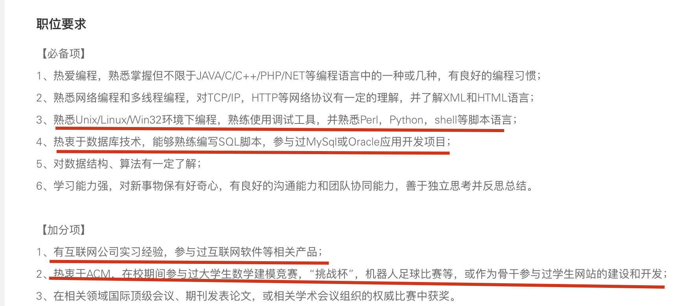

# 大厂招聘更看重什么能力？

我们平时要拿大厂的要求来鞭策自己，尽量避免一直待在自己的舒适区。

那大厂想要什么样的人才呢？我们可以从大厂的招聘要求中得到答案！

**先从已经有两年左右开发经验的工程师角度来看：**

支付宝高级 Java 开发工程师招聘要求：

阿里云智能高级 Java 开发工程师招聘要求：

从上面这些招聘信息可以看出，除去 Java 基础/集合/多线程这些，下面这些点格外重要：

1. **底层知识比如 JVM、网络、操作系统** ：不只是懂概念，而是能结合实际场景使用，例如能用 `jmap / jstack / arthas` 等工具排查线上问题、能看懂 GC 日志、抓包分析网络异常。
2. **面向对象编程能力** ：我理解这个不仅包括“面向对象编程”，还有 SOLID 软件设计原则以及各种设计模式的应用，最终目的是写出高质量的代码。
3. **Linux**：熟练使用常见命令（排查 CPU、内存、IO、网络问题），有在 Linux 环境下实际部署、排查问题的经验。
4. **底层原理** ：理解 Spring/SpringBoot、MyBatis、RPC、MQ、Redis 等的核心工作原理，能在问题出现时不只是“重启服务”，而是知道去哪里查、怎么改。
5. **系统设计能力** ：能从零设计一个系统：业务拆分、数据库建模、接口设计、技术选型。能画出清晰的架构图，讲清楚为什么这么设计。
6. \*\*解决问题的能力：\*\*线上遇到问题之后有独立排查和解决问题的经验。
7. **分布式知识应用** ：常见的分布式理论尽量要搞懂，缓存、消息队列等等都要掌握，关键是还要能使用这些技术解决实际问题而不是纸上谈兵。
8. **高并发项目开发经验**：很多大厂的岗位都会要求求职者必须有高并发项目的实际开发经验。这个要求无可厚非，毕竟大厂的很多项目并发量确实高。
9. **优秀技术品质** :有持续学习的习惯、敢尝试新技术、追求编写优雅的代码等等。

**再从应届生的角度来看：**

阿里 Java 工程师招聘要求：

阿里云 Java 开发工程师招聘要求：

从上面这些招聘信息可以看出，下面是这些点在面试大厂的时候是比较重要：

1. 有互联网公司的实习经验，最好是中大厂（当下求职面试有实习经验几乎是必选项了）；
2. 参加过竞赛（含金量超高的是 ACM，可选）；
3. 对数据结构与算法非常熟练（手撕算法是入场券）；
4. 参与过实际项目，能讲清楚你负责的模块、技术栈、遇到的问题和解决过程（尽量不要是那种烂大街的项目）。
5. 熟悉 Python、Shell、Perl 其中一门脚本语言；
6. 熟悉如何优化 Java 代码、有写出质量更高的代码的意识；
7. 熟悉分布式相关的知识，最好是有相关的实践经验（很卷！）；
8. 熟悉自己所用框架的底层知识比如 Spring/Boot、MyBatis；
9. 有高并发项目的实际开发经验（绝大部分同学都很难有参与高并发项目的机会）；
10. 有大数据开发经验等等（这个我理解的是极少数后端岗位才有要求，并不是必需的，没有大数据开发经验也没关系）。
11. 会用 AI 辅助学习和开发（25 年最新补充，最重要的是会用 AI 编程工具，懂一些 AI 辅助开发的小技巧）

虽然上面列举的是 Java 方向的招聘要求，但对于其他后端方向大体上也是类似的，具备参考价值！

从来到大学之后，我的好多阅历非常深的老师经常就会告诫我们：“ 一定要有一门自己的特长，不管是技术还好还是其他能力 ” 。我觉得这句话真的非常有道理！

刚刚也提到了要有一门特长，所以在这里再强调一点：公司不需要你什么都会，但是在某一方面你一定要有过于常人的优点。换言之就是我们不需要去掌握每一门技术（你也没精力去掌握这么多技术），而是需要去深入研究某一门技术，对于其他技术我们可以简单了解一下。

我觉得一个好的 Java 程序员应该具备下面这些素质：

1. **Java 基础** ：一定要熟练掌握 Java 基本语法、数据类型、泛型、反射、注解、SPI、IO 等等基础知识。
2. **多线程（进阶）** ：不光要掌握多线程的简单实用（尽量要在项目实践，多线程方向优化实践可以参考：https://t.zsxq.com/0c1uS7q2Y），还要搞懂重要知识（比如 Concurrent 包下的一些类、AQS）的原理。
3. **JVM(可选)** ：一般是大厂才会问到，面试中小厂就没必要准备了。JVM 面试中比较常问的是 [Java 内存区域](https://javaguide.cn/java/jvm/memory-area.html)、[JVM 垃圾回收](https://javaguide.cn/java/jvm/jvm-garbage-collection.html)、[类加载器和双亲委派模型](https://javaguide.cn/java/jvm/classloader.html) 以及 JVM 调优和问题排查（我之前分享过一些[常见的线上问题案例](https://t.zsxq.com/0bsAac47U)，里面就有 JVM 相关的）。
4. **算法和数据结构**：如果你想进入大厂的话，我推荐你在学习完 Java 基础或者多线程之后，就开始每天抽出一点时间来学习算法和数据结构。为了提高自己的编程能力，你也可以坚持刷 Leetcode。
5. **前端知识** ：学习前端基础(HTML、CSS、JavaScript),当然 BootStrap、VUE 等等前端框架你也可以了解一下。
6. **Git** : 版本控制工具 Git 是团队协作开发必备的。
7. **Maven** ： 学习常用框架之前可以提前花时间学习一下 Maven 的使用，千万不要 到处找 Jar 包，下载 Jar 包（如果你做的项目没用上包管理工具，那请你尽快换一个新点的教程看）。
8. **Docker**：我们可以使用 Docker 安装各种软件和中间件，还可以将自己的程序部署到 Docker 中。
9. **MySQL** : 学习 MySQL 的基本使用，基本的增删改查，索引需要重点关注，存储过程可以简单了解一下。
10. **PostgreSQL（可选）**：和 MySQL 一样，PostgreSQL 也是开源免费且功能强大的关系型数据库。PostgreSQL 的 Slogan 是“**世界上最先进的开源关系型数据库**” 。客观来说，PostgreSQL 确实比 MySQL 优秀。不过，目前国内 MySQL 还是主流，PostgreSQL 是可选择性学习的。关于二者的对比，可以看我写的这篇文章：[MySQL vs PostgreSQL，如何选择？](https://mp.weixin.qq.com/s/APWD-PzTcTqGUuibAw7GGw) 。
11. **Redis**：作为最常用的分布式缓存，Redis 是必须要掌握的。除了 Redis 作为缓存的基本使用之外，Redis 的其他应用场景尽量要掌握，比如 Redis 实现分布式锁、限流、延迟队列、各种复杂的业务场景（比如维护排行榜）等等，更进一步，你还要知道 Redis 常见性能优化方式以及生产问题的解决。
12. **框架** ：学习 Spring AOP 和 IoC 这俩比较重要的概念，掌握 SpringBoot、Mybatis、JUnit、Mockito 等框架的使用，吃透 Spring 原理（可选，大厂面试必备）。
13. **Linux** ：学会 Linux 的基本使用(常见命令、基本概念)即可，一些底层概念性的东西不是必需的。
14. **分布式（进阶）** ：常见的分布式理论（CAP 理论、BASE 理论、Paxos 算法、Gossip 协议、Raft 算法等等）、远程调用（RPC 和 HTTP 客户端）、服务注册于发现、API 网关、配置中心、分布式 ID、分布式事务、分布式链路追踪。
15. **微服务（进阶）** ：微服务的一些基本概念、SpringCloud 和 Spring Cloud Alibaba 那一套都可以学习一下。我比较推荐的是学习 Spring Cloud Alibaba，因为首先它是阿里开源的，文档比较丰富，另外，它比较新，各种组件都可以说很不错。
16. **高性能（进阶）** ： CDN（掌握概念和原理即可）、消息队列（选择主流消息队列中的一个深入学习即可）、读写分离&分库分表（掌握概念和原理即可）、负载均衡、缓存……这些。
17. **高可用（进阶）** ： 主要就是限流&降级&熔断、集群、超时和重试机制这些。
18. **云原生（可选）** ：算是未来的一个趋势，可以作为一个新的职业方向考虑，目前正处于蓝海阶段，具体可以参考我写的这篇文章：[云原生时代，程序员应该掌握哪些能力？](https://mp.weixin.qq.com/s/ZVbwNnvRwXxQqk7A-OA27g) 。
19. **核心竞争力（进阶）** ：Java 编码优秀实践、SQL 调优、定位解决线上问题的能力等等。
20. **AI 辅助编程（25 年最新重点补充）**：不仅要会使用 AI 编程工具，更要掌握一套高效利用 AI 辅助开发的实战技巧。

Java 后端完整的学习路线可以参考：[耗时一个月，这可能是你所见过的最用心、最全面的 Java 后端学习路线](https://t.zsxq.com/15y1s9mA5)。

最后，关于如何高效自学编程和快速学习新技术，可以参考下面这两篇文章：

[如何更高效地自学编程？](https://www.yuque.com/snailclimb/mf2z3k/imaxdd)

[如何快速学习新技术？](https://www.yuque.com/snailclimb/mf2z3k/cpo8gd)

> 更新: 2025-12-04 17:17:55  
> 原文: <https://www.yuque.com/snailclimb/mf2z3k/sg31f0>