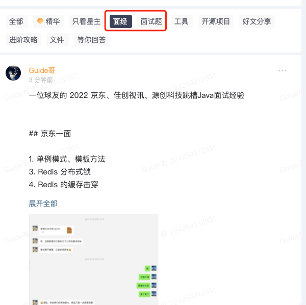

# 面经篇

欢迎阅读**「面经篇」**相关的文章，这个系列会持续为大家分享超有价值的面试经验，希望能帮你少走弯路，直通 Offer！

古人云:“**他山之石，可以攻玉**” 。多看看别人分享的面经，无论是成功的经验还是宝贵的教训，都能为我们指明方向，有效规避不必要的弯路！

除了《Java面试指北》中整理的面经之外，星球还有一个专门分享面经的专题：

**为何推荐选择我整理的面经？**

与牛客网等平台上海量的面经信息相比，《Java面试指北》中提供的面经在质量筛选和价值挖掘上投入了更多精力。每一份被收录的面经，都力求：

+ **内容真实、有启发性**： 优先选择那些能反映实际面试场景、考察重点和面试官思路的经验。
+ **提供深度学习资源**： 针对面经中出现的关键问题，会精心提供高质量的参考资料（通常是我撰写的深度解析文章）或直接给出核心参考答案。

**相对来说，我更倾向于提供参考资料而非直接答案。为什么呢？**

我的考量主要基于以下两点：

1. **追求深度理解与知识拓展**： 我这里提供的参考资料往往对相关知识点有更系统、更深入的阐述。通过阅读这些资料，你不仅能理解面试题的答案，更能借此机会巩固和拓展相关的知识体系，做到知其然更知其所以然。
2. **保证内容的时效性与维护效率**： 许多面试问题具有共通性，答案也可能随着技术发展或认知深化而需要更新。通过链接到我原创的深度文章（这些文章会持续维护和迭代），可以确保您获取到的是最新、最完善的解答，避免了因分散在各篇面经中逐一修改答案而可能产生的疏漏或不一致。当然，对于我原创内容未能完全覆盖的领域，我们也会精选业界优秀技术博主的深度好文作为补充，确保每一份参考都质量杠杠的。

> 更新: 2025-06-23 11:58:29  
> 原文: <https://www.yuque.com/snailclimb/mf2z3k/da3umi>