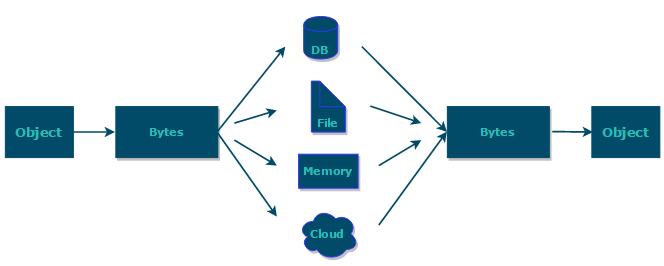
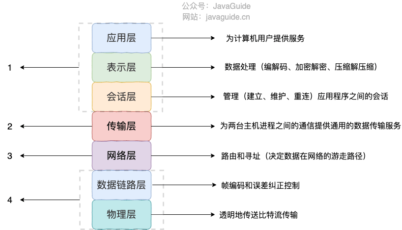
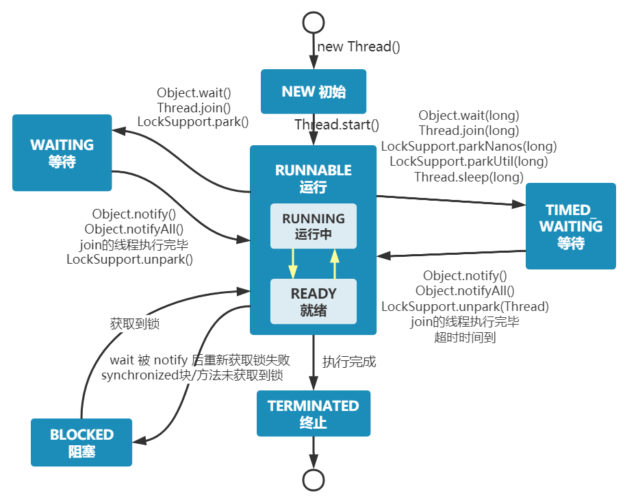
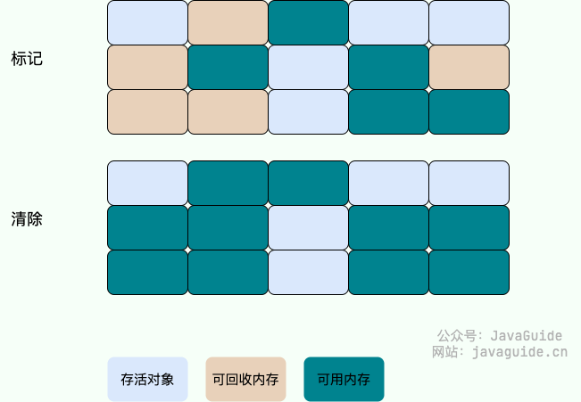
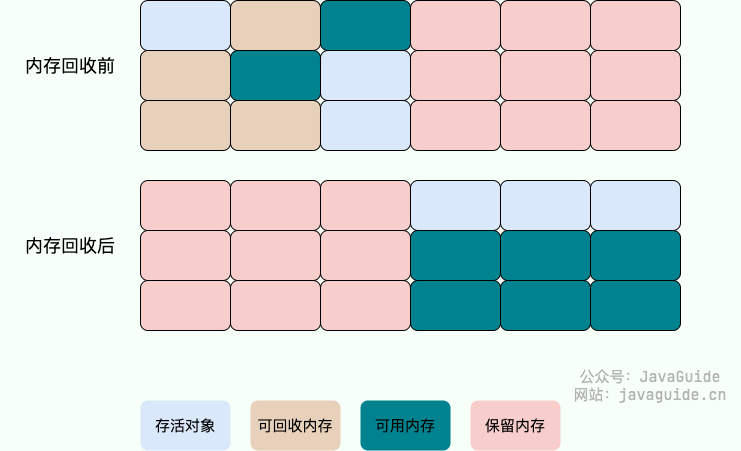
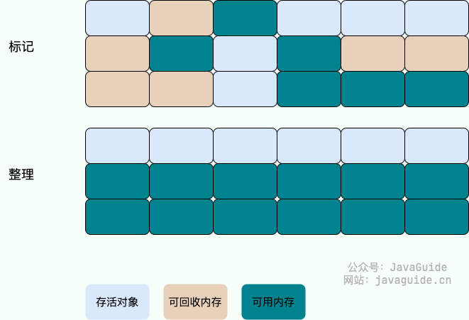
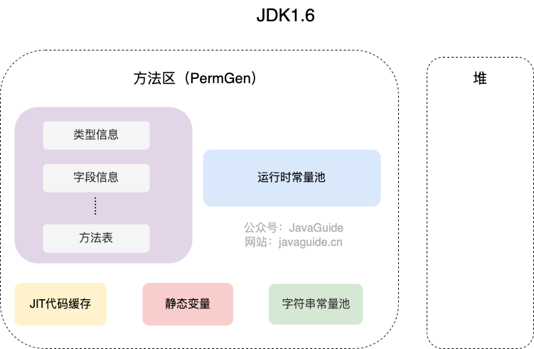
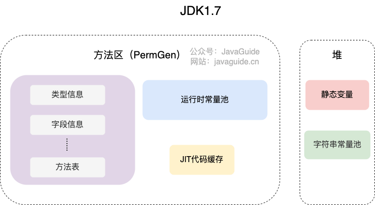

# ⭐️vivo 校招面经，很简单

分享一位读者面试 vivo Java 岗位的面经，涵盖详细的参考答案。这些问题涵盖了 Java 基础、多线程、数据库、JVM 内存管理以及设计模式的应用，同时也涉及了面试中的自我介绍和实习经历的描述技巧：

* 自我介绍
* 介绍自己的实习经历，做了什么，学到了什么
* 重载和重写什么区别？项目中用到了吗？
* 构造方法可以有多个吗？能被重写吗？
* 接口和抽象类如何选择？为什么？
* 什么是序列化?什么是反序列化?
* 为什么用索引？如何创建索引？哪些字段适合创建索引？
* 如何分析 SQL 性能?
* 线程的状态有哪些？如何理解？
* 为什么不直接创建线程？自定义线程池需要指定哪些参数？重要性如何？
* 垃圾回收算法有哪些？
* 字符串常量池什么作用？
* 谈谈你用到的设计模式，为什么用？

## 面试题

八股较多，但都偏基础，难度较低。

我对一二面提到的部分有代表性的面试问题进行了整理，并添加了参加答案供大家复习参考。

### 1、自我介绍

一个好的自我介绍应该包含这几点要素：

1. 用简单的话说清楚自己主要的技术栈于擅长的领域，例如 Java 后端开发、分布式系统开发；
2. 把重点放在自己的优势上，重点突出自己的能力比如自己的定位的 bug 的能力特别厉害；
3. 避免避实就虚，适当举例体现自己的能力，例如过往的比赛经历、实习经历；
4. 自我介绍的时间不宜过长，一般是 1~2 分钟之间。

### 2、介绍自己的实习经历，做了什么，学到了什么

如果你有实习经历的话，自我介绍之后，第二个问题一般就是聊你的实习经历。面试之前，一定要提前准备好对应的话术，突出介绍自己实习期间的贡献。

很多同学实习期间可能接触不到什么实际的开发任务，大部分时间可能都是在熟悉和维护项目。对于这种情况，你可以适当润色这段实习经历，找一些简单的功能研究透，包装成自己参与做的，大部分同学都是这么做的。不用担心面试的时候会露馅，只要不挑选那种明显不会交给实习生做的任务，你自己也能讲明白就行了。不过，还是更建议你在实习期间尽量尝试主动去承担一些开发任务，这样整个实习经历对个人提升也会更大一些。

### 3、重载和重写什么区别？项目中用到了吗？

重写就是子类对父类方法的重新改造，外部样子不能改变，内部逻辑可以改变。

| 区别点 | 重载方法 | 重写方法 |
| :--- | :--- | :--- |
| 发生范围 | 同一个类 | 子类 |
| 参数列表 | 必须修改 | 一定不能修改 |
| 返回类型 | 可修改 | 子类方法返回值类型应比父类方法返回值类型更小或相等 |
| 异常 | 可修改 | 子类方法声明抛出的异常类应比父类方法声明抛出的异常类更小或相等； |
| 访问修饰符 | 可修改 | 一定不能做更严格的限制（可以降低限制） |
| 发生阶段 | 编译期 | 运行期 |

### 4、构造方法可以有多个吗？能被重写吗？

构造方法具有以下特点：

* **名称与类名相同**：构造方法的名称必须与类名完全一致。
* **没有返回值**：构造方法没有返回类型，且不能使用 `void` 声明。
* **自动执行**：在生成类的对象时，构造方法会自动执行，无需显式调用。

构造方法**不能被重写（override）**，但**可以被重载（overload）**。因此，一个类中可以有多个构造方法，这些构造方法可以具有不同的参数列表，以提供不同的对象初始化方式。

### 5、接口和抽象类如何选择？为什么？

#### 接口和抽象类的共同点

* **实例化**：接口和抽象类都不能直接实例化，只能被实现（接口）或继承（抽象类）后才能创建具体的对象。
* **抽象方法**：接口和抽象类都可以包含抽象方法。抽象方法没有方法体，必须在子类或实现类中实现。

#### 接口和抽象类的区别

* **设计目的**：接口主要用于对类的行为进行约束，你实现了某个接口就具有了对应的行为。抽象类主要用于代码复用，强调的是所属关系。
* **继承和实现**：一个类只能继承一个类（包括抽象类），因为 Java 不支持多继承。但一个类可以实现多个接口，一个接口也可以继承多个其他接口。
* **成员变量**：接口中的成员变量只能是 `public static final` 类型的，不能被修改且必须有初始值。抽象类的成员变量可以有任何修饰符（`private`, `protected`, `public`），可以在子类中被重新定义或赋值。
* **方法**：
  * Java 8 之前，接口中的方法默认是 `public abstract` ，也就是只能有方法声明。自 Java 8 起，可以在接口中定义 `default`（默认） 方法和 `static` （静态）方法。 自 Java 9 起，接口可以包含 `private` 方法。
  * 抽象类可以包含抽象方法和非抽象方法。抽象方法没有方法体，必须在子类中实现。非抽象方法有具体实现，可以直接在抽象类中使用或在子类中重写。

在 Java 8 及以上版本中，接口引入了新的方法类型：`default` 方法、`static` 方法和 `private` 方法。这些方法让接口的使用更加灵活。

Java 8 引入的`default` 方法用于提供接口方法的默认实现，可以在实现类中被覆盖。这样就可以在不修改实现类的情况下向现有接口添加新功能，从而增强接口的扩展性和向后兼容性。

```java
public interface MyInterface {
    default void defaultMethod() {
        System.out.println("This is a default method.");
    }
}
```

Java 8 引入的`static` 方法无法在实现类中被覆盖，只能通过接口名直接调用（ `MyInterface.staticMethod()`），类似于类中的静态方法。`static` 方法通常用于定义一些通用的、与接口相关的工具方法，一般很少用。

```java
public interface MyInterface {
    static void staticMethod() {
        System.out.println("This is a static method in the interface.");
    }
}
```

Java 9 允许在接口中使用 `private` 方法。`private`方法可以用于在接口内部共享代码，不对外暴露。

```java
public interface MyInterface {
    // default 方法
    default void defaultMethod() {
        commonMethod();
    }

    // static 方法
    static void staticMethod() {
        commonMethod();
    }

    // 私有静态方法，可以被 static 和 default 方法调用
    private static void commonMethod() {
        System.out.println("This is a private method used internally.");
    }

      // 实例私有方法，只能被 default 方法调用。
    private void instanceCommonMethod() {
        System.out.println("This is a private instance method used internally.");
    }
}
```

### 6、什么是序列化?什么是反序列化?

如果我们需要持久化 Java 对象比如将 Java 对象保存在文件中，或者在网络传输 Java 对象，这些场景都需要用到序列化。

简单来说：

* **序列化**：将数据结构或对象转换成可以存储或传输的形式，通常是二进制字节流，也可以是 JSON, XML 等文本格式
* **反序列化**：将在序列化过程中所生成的数据转换为原始数据结构或者对象的过程

对于 Java 这种面向对象编程语言来说，我们序列化的都是对象（Object）也就是实例化后的类(Class)，但是在 C++这种半面向对象的语言中，struct(结构体)定义的是数据结构类型，而 class 对应的是对象类型。

下面是序列化和反序列化常见应用场景：

* 对象在进行网络传输（比如远程方法调用 RPC 的时候）之前需要先被序列化，接收到序列化的对象之后需要再进行反序列化；
* 将对象存储到文件之前需要进行序列化，将对象从文件中读取出来需要进行反序列化；
* 将对象存储到数据库（如 Redis）之前需要用到序列化，将对象从缓存数据库中读取出来需要反序列化；
* 将对象存储到内存之前需要进行序列化，从内存中读取出来之后需要进行反序列化。

维基百科是如是介绍序列化的：

> **序列化**（serialization）在计算机科学的数据处理中，是指将数据结构或对象状态转换成可取用格式（例如存成文件，存于缓冲，或经由网络中发送），以留待后续在相同或另一台计算机环境中，能恢复原先状态的过程。依照序列化格式重新获取字节的结果时，可以利用它来产生与原始对象相同语义的副本。对于许多对象，像是使用大量引用的复杂对象，这种序列化重建的过程并不容易。面向对象中的对象序列化，并不概括之前原始对象所关系的函数。这种过程也称为对象编组（marshalling）。从一系列字节提取数据结构的反向操作，是反序列化（也称为解编组、deserialization、unmarshalling）。

综上：**序列化的主要目的是通过网络传输对象或者说是将对象存储到文件系统、数据库、内存中。**



<font style="color:gray;">https://www.corejavaguru.com/java/serialization/interview-questions-1</font>

**序列化协议对应于 TCP/IP 4 层模型的哪一层？**

我们知道网络通信的双方必须要采用和遵守相同的协议。TCP/IP 四层模型是下面这样的，序列化协议属于哪一层呢？

1. 应用层
2. 传输层
3. 网络层
4. 网络接口层



如上图所示，OSI 七层协议模型中，表示层做的事情主要就是对应用层的用户数据进行处理转换为二进制流。反过来的话，就是将二进制流转换成应用层的用户数据。这不就对应的是序列化和反序列化么？

因为，OSI 七层协议模型中的应用层、表示层和会话层对应的都是 TCP/IP 四层模型中的应用层，所以序列化协议属于 TCP/IP 协议应用层的一部分。

### 7、为什么用索引？如何创建索引？哪些字段适合创建索引？

使用索引可以大大加快数据的检索速度（大大减少检索的数据量）, 减少 IO 次数，这也是创建索引的最主要的原因。

通过创建唯一性索引，可以保证数据库表中每一行数据的唯一性。

索引使用示例：

```sql
-- 创建索引
CREATE INDEX order_id_index ON cus_order (id);

-- 创建唯一索引 (假设 order_no 字段需要保证唯一性)
CREATE UNIQUE INDEX order_order_no_unique_index ON cus_order (order_no);

-- 删除索引
ALTER TABLE cus_order DROP INDEX order_id_index;

--  其他字段的索引示例
ALTER TABLE cus_order ADD INDEX order_customer_id_index (customer_id);
ALTER TABLE cus_order ADD INDEX order_create_time_index (create_time);

-- 覆盖索引示例 (假设查询语句经常用到 score, name, amount)
CREATE INDEX order_score_name_amount_index ON cus_order (score, name, amount);
```

**适合创建索引的字段**：

* **不为 NULL 的字段**：索引字段的数据应该尽量不为 NULL，因为对于数据为 NULL 的字段，数据库较难优化。如果字段频繁被查询，但又避免不了为 NULL，建议使用 0,1,true,false 这样语义较为清晰的短值或短字符作为替代。
* **被频繁查询的字段**：我们创建索引的字段应该是查询操作非常频繁的字段。
* **被作为条件查询的字段**：被作为 WHERE 条件查询的字段，应该被考虑建立索引。
* **频繁需要排序的字段**：索引已经排序，这样查询可以利用索引的排序，加快排序查询时间。
* **被经常频繁用于连接的字段**：经常用于连接的字段可能是一些外键列，对于外键列并不一定要建立外键，只是说该列涉及到表与表的关系。对于频繁被连接查询的字段，可以考虑建立索引，提高多表连接查询的效率。

### 8、如何分析 SQL 性能?

我们可以使用 `EXPLAIN` 命令来分析 SQL 的 **执行计划** 。执行计划是指一条 SQL 语句在经过 MySQL 查询优化器的优化会后，具体的执行方式。

`EXPLAIN` 并不会真的去执行相关的语句，而是通过 **查询优化器** 对语句进行分析，找出最优的查询方案，并显示对应的信息。

`EXPLAIN` 适用于 `SELECT`, `DELETE`, `INSERT`, `REPLACE`, 和 `UPDATE`语句，我们一般分析 `SELECT` 查询较多。

我们这里简单来演示一下 `EXPLAIN` 的使用。

`EXPLAIN` 的输出格式如下：

```sql
mysql> EXPLAIN SELECT `score`,`name` FROM `cus_order` ORDER BY `score` DESC;
+----+-------------+-----------+------------+------+---------------+------+---------+------+--------+----------+----------------+
| id | select_type | table     | partitions | type | possible_keys | key  | key_len | ref  | rows   | filtered | Extra          |
+----+-------------+-----------+------------+------+---------------+------+---------+------+--------+----------+----------------+
|  1 | SIMPLE      | cus_order | NULL       | ALL  | NULL          | NULL | NULL    | NULL | 997572 |   100.00 | Using filesort |
+----+-------------+-----------+------------+------+---------------+------+---------+------+--------+----------+----------------+
1 row in set, 1 warning (0.00 sec)
```

各个字段的含义如下：

| **列名** | **含义** |
| --- | --- |
| id | SELECT 查询的序列标识符 |
| select\_type | SELECT 关键字对应的查询类型 |
| table | 用到的表名 |
| partitions | 匹配的分区，对于未分区的表，值为 NULL |
| type | 表的访问方法 |
| possible\_keys | 可能用到的索引 |
| key | 实际用到的索引 |
| key\_len | 所选索引的长度 |
| ref | 当使用索引等值查询时，与索引作比较的列或常量 |
| rows | 预计要读取的行数 |
| filtered | 按表条件过滤后，留存的记录数的百分比 |
| Extra | 附加信息 |

### 9、 线程的状态有哪些？如何理解？

Java 线程在运行的生命周期中的指定时刻只可能处于下面 6 种不同状态的其中一个状态：

* NEW: 初始状态，线程被创建出来但没有被调用 `start()` 。
* RUNNABLE: 运行状态，线程被调用了 `start()`等待运行的状态。
* BLOCKED：阻塞状态，需要等待锁释放。
* WAITING：等待状态，表示该线程需要等待其他线程做出一些特定动作（通知或中断）。
* TIME\_WAITING：超时等待状态，可以在指定的时间后自行返回而不是像 WAITING 那样一直等待。
* TERMINATED：终止状态，表示该线程已经运行完毕。

线程在生命周期中并不是固定处于某一个状态而是随着代码的执行在不同状态之间切换。

Java 线程状态变迁图(图源：[挑错 |《Java 并发编程的艺术》中关于线程状态的三处错误](https://mp.weixin.qq.com/s/UOrXql_LhOD8dhTq_EPI0w))：



由上图可以看出：线程创建之后它将处于 **NEW（新建）** 状态，调用 `start()` 方法后开始运行，线程这时候处于 **READY（可运行）** 状态。可运行状态的线程获得了 CPU 时间片（timeslice）后就处于 **RUNNING（运行）** 状态。

> 在操作系统层面，线程有 READY 和 RUNNING 状态；而在 JVM 层面，只能看到 RUNNABLE 状态（图源：[HowToDoInJava](https://howtodoinJava.com/)：[Java Thread Life Cycle and Thread States](https://howtodoinJava.com/Java/multi-threading/Java-thread-life-cycle-and-thread-states/)），所以 Java 系统一般将这两个状态统称为 **RUNNABLE（运行中）** 状态 。
>
> **为什么 JVM 没有区分这两种状态呢？** （摘自：[Java 线程运行怎么有第六种状态？ - Dawell 的回答](https://www.zhihu.com/question/56494969/answer/154053599) ） 现在的时分（time-sharing）多任务（multi-task）操作系统架构通常都是用所谓的“时间分片（time quantum or time slice）”方式进行抢占式（preemptive）轮转调度（round-robin 式）。这个时间分片通常是很小的，一个线程一次最多只能在 CPU 上运行比如 10-20ms 的时间（此时处于 running 状态），也即大概只有 0.01 秒这一量级，时间片用后就要被切换下来放入调度队列的末尾等待再次调度。（也即回到 ready 状态）。线程切换的如此之快，区分这两种状态就没什么意义了。


* 当线程执行 `wait()`方法之后，线程进入 **WAITING（等待）** 状态。进入等待状态的线程需要依靠其他线程的通知才能够返回到运行状态。
* **TIMED\_WAITING(超时等待)** 状态相当于在等待状态的基础上增加了超时限制，比如通过 `sleep（long millis）`方法或 `wait（long millis）`方法可以将线程置于 TIMED\_WAITING 状态。当超时时间结束后，线程将会返回到 RUNNABLE 状态。
* 当线程进入 `synchronized` 方法/块或者调用 `wait` 后（被 `notify`）重新进入 `synchronized` 方法/块，但是锁被其它线程占有，这个时候线程就会进入 **BLOCKED（阻塞）** 状态。
* 线程在执行完了 `run()`方法之后将会进入到 **TERMINATED（终止）** 状态。

相关阅读：[线程的几种状态你真的了解么？](https://mp.weixin.qq.com/s/R5MrTsWvk9McFSQ7bS0W2w) 。

### 10、为什么不直接创建线程？自定义线程池需要指定哪些参数？重要性如何？

池化技术想必大家已经屡见不鲜了，线程池、数据库连接池、HTTP 连接池等等都是对这个思想的应用。池化技术的思想主要是为了减少每次获取资源的消耗，提高对资源的利用率。

**线程池**提供了一种限制和管理资源（包括执行一个任务）的方式。 每个**线程池**还维护一些基本统计信息，例如已完成任务的数量。

这里借用《Java 并发编程的艺术》提到的来说一下**使用线程池的好处**：

* **降低资源消耗**。通过重复利用已创建的线程降低线程创建和销毁造成的消耗。
* **提高响应速度**。当任务到达时，任务可以不需要等到线程创建就能立即执行。
* **提高线程的可管理性**。线程是稀缺资源，如果无限制的创建，不仅会消耗系统资源，还会降低系统的稳定性，使用线程池可以进行统一的分配，调优和监控。

`ThreadPoolExecutor`\*\* 3 个最重要的参数：\*\*

* `corePoolSize`\*\* :\*\* 任务队列未达到队列容量时，最大可以同时运行的线程数量。
* `maximumPoolSize`\*\* :\*\* 任务队列中存放的任务达到队列容量的时候，当前可以同时运行的线程数量变为最大线程数。
* `workQueue`**:** 新任务来的时候会先判断当前运行的线程数量是否达到核心线程数，如果达到的话，新任务就会被存放在队列中。

`ThreadPoolExecutor`其他常见参数 :

* `keepAliveTime`:线程池中的线程数量大于 `corePoolSize` 的时候，如果这时没有新的任务提交，核心线程外的线程不会立即销毁，而是会等待，直到等待的时间超过了 `keepAliveTime`才会被回收销毁。
* `unit` : `keepAliveTime` 参数的时间单位。
* `threadFactory` :executor 创建新线程的时候会用到。
* `handler` :饱和策略。关于饱和策略下面单独介绍一下。

下面这张图可以加深你对线程池中各个参数的相互关系的理解（图片来源：《Java 性能调优实战》）：


当任务队列未满时，最多可以同时运行的线程数量就是核心线程数。任务队列中存放的任务满了之后，最多可以同时运行的线程数量就是最大线程数。

### 11、垃圾回收算法有哪些？

#### 标记-清除算法

标记-清除（Mark-and-Sweep）算法分为“标记（Mark）”和“清除（Sweep）”阶段：首先标记出所有不需要回收的对象，在标记完成后统一回收掉所有没有被标记的对象。

它是最基础的收集算法，后续的算法都是对其不足进行改进得到。这种垃圾收集算法会带来两个明显的问题：

1. **效率问题**：标记和清除两个过程效率都不高。
2. **空间问题**：标记清除后会产生大量不连续的内存碎片。



关于具体是标记可回收对象还是不可回收对象，众说纷纭，两种说法其实都没问题，我个人更倾向于是前者。

如果按照前者的理解，整个标记-清除过程大致是这样的：

1. 当一个对象被创建时，给一个标记位，假设为 0 (false)；
2. 在标记阶段，我们将所有可达对象（或用户可以引用的对象）的标记位设置为 1 (true)；
3. 扫描阶段清除的就是标记位为 0 (false)的对象。

#### 复制算法

为了解决标记-清除算法的效率和内存碎片问题，复制（Copying）收集算法出现了。它可以将内存分为大小相同的两块，每次使用其中的一块。当这一块的内存使用完后，就将还存活的对象复制到另一块去，然后再把使用的空间一次清理掉。这样就使每次的内存回收都是对内存区间的一半进行回收。



虽然改进了标记-清除算法，但依然存在下面这些问题：

* **可用内存变小**：可用内存缩小为原来的一半。
* **不适合老年代**：如果存活对象数量比较大，复制性能会变得很差。

#### 标记-整理算法

标记-整理（Mark-and-Compact）算法是根据老年代的特点提出的一种标记算法，标记过程仍然与“标记-清除”算法一样，但后续步骤不是直接对可回收对象回收，而是让所有存活的对象向一端移动，然后直接清理掉端边界以外的内存。



由于多了整理这一步，因此效率也不高，适合老年代这种垃圾回收频率不是很高的场景。

#### 分代收集算法

当前虚拟机的垃圾收集都采用分代收集算法，这种算法没有什么新的思想，只是根据对象存活周期的不同将内存分为几块。一般将 Java 堆分为新生代和老年代，这样我们就可以根据各个年代的特点选择合适的垃圾收集算法。

比如在新生代中，每次收集都会有大量对象死去，所以可以选择”标记-复制“算法，只需要付出少量对象的复制成本就可以完成每次垃圾收集。而老年代的对象存活几率是比较高的，而且没有额外的空间对它进行分配担保，所以我们必须选择“标记-清除”或“标记-整理”算法进行垃圾收集。

**延伸面试问题：** HotSpot 为什么要分为新生代和老年代？

根据上面的对分代收集算法的介绍回答。

### 12、字符串常量池什么作用？

**字符串常量池** 是 JVM 为了提升性能和减少内存消耗针对字符串（String 类）专门开辟的一块区域，主要目的是为了避免字符串的重复创建。

```java
// 在字符串常量池中创建字符串对象 ”ab“
// 将字符串对象 ”ab“ 的引用赋值给给 aa
String aa = "ab";
// 直接返回字符串常量池中字符串对象 ”ab“，赋值给引用 bb
String bb = "ab";
System.out.println(aa==bb); // true
```

HotSpot 虚拟机中字符串常量池的实现是 `src/hotspot/share/classfile/stringTable.cpp` ,`StringTable` 可以简单理解为一个固定大小的`HashTable` ，容量为 `StringTableSize`（可以通过 `-XX:StringTableSize` 参数来设置），保存的是字符串（key）和 字符串对象的引用（value）的映射关系，字符串对象的引用指向堆中的字符串对象。

JDK1.7 之前，字符串常量池存放在永久代。JDK1.7 字符串常量池和静态变量从永久代移动了 Java 堆中。





**JDK 1.7 为什么要将字符串常量池移动到堆中？**

主要是因为永久代（方法区实现）的 GC 回收效率太低，只有在整堆收集 (Full GC)的时候才会被执行 GC。Java 程序中通常会有大量的被创建的字符串等待回收，将字符串常量池放到堆中，能够更高效及时地回收字符串内存。

### 13、谈谈你用到的设计模式，为什么用？

这里以责任链设计模式为例介绍。

责任链模式的核心在于创建一条由处理者对象组成的链。每个处理者都包含一个指向链上下一个处理者的引用。当一个请求进入链条时，它沿着链条传递，直到找到一个能够处理它的处理者，或者直到到达链条的末尾。

**责任链模式的主要优点：**

* **降低耦合度:**  将请求的发送者和接收者解耦。发送者不需要知道哪个接收者最终会处理请求。
* **增强灵活性:**  可以动态地添加或删除处理者，改变链条的结构，而无需修改发送者的代码。
* **责任单一:**  每个处理者只负责处理特定类型的请求，符合单一职责原则。
* **增强可扩展性:**  可以方便地扩展新的处理者，而无需修改现有的代码。

**责任链模式的应用场景：**

* 多个对象可以处理同一请求，但具体由哪个对象处理在运行时才能确定。
* 你希望动态地指定处理请求的对象集合。
* 流程处理：例如 OA 审批流、订单处理流程等。
* 过滤器机制：例如 Java Web 开发中的 Filter，Servlet 中的拦截器。
* 日志处理：不同级别的日志记录器可以组成一个责任链。

详细介绍推荐阅读这篇：[浅析设计模式 5 ——责任链模式 - 大淘宝技术 - 2023](https://mp.weixin.qq.com/s/R-Umnq8T1JrxtgpZQCK4Iw)。


> 更新: 2025-02-21 12:17:20  
> 原文: <https://www.yuque.com/snailclimb/mf2z3k/pthvaf31mtwu98bn>