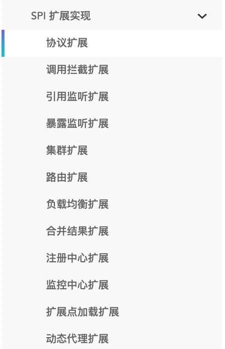

# ⭐️小米 Java 校招面经，已OC

小米 Java 岗位的面试难度并不大，问题也较为常规，主要以技术八股文为主，手撕算法题基本来自 Leetcode 上的常见题目，整体难度适中。

下面，分享一篇武汉小米 Java 岗位的校招面经（一二面核心问题整理，附带详细参考答案），大家可以感受一下具体的面试难度。

这些问题涵盖了 Java 基础、分布式系统、缓存技术、身份验证、密码安全以及算法题等方面的内容，是面试中较为常见的考察点：

1. 谈谈对反射的理解
2. 两种动态代理的区别
3. SPI 是什么？和 API 有什么区别？
4. Java 同步锁的实现
5. synchronized 代码块或方法的代码如果抛出异常，锁会释放吗？
6. 项目为什么要用 Redis？
7. 为什么用 Redis 而不用本地缓存呢？
8. 本地缓存和 Redis 能搭配使用吗？
9. 除了缓存，Redis 还能用来做什么？
10. Redis 分布式锁实现
11. 你项目中怎么向前端传数据的？
12. 为什么选择 JWT 做身份验证？
13. 项目怎么保存用户密码的？
14. 手撕算法
    * Leetcode.217. 存在重复元素
    * Leetcode.61. 旋转链表

## 谈谈对反射的理解

如果说大家研究过框架的底层原理或者咱们自己写过框架的话，一定对反射这个概念不陌生。

反射之所以被称为框架的灵魂，主要是因为它赋予了我们在运行时分析类以及执行类中方法的能力。

通过反射你可以获取任意一个类的所有属性和方法，你还可以调用这些方法和属性。

像咱们平时大部分时候都是在写业务代码，很少会接触到直接使用反射机制的场景。

但是，这并不代表反射没有用。相反，正是因为反射，你才能这么轻松地使用各种框架。像 Spring/Spring Boot、MyBatis 等等框架中都大量使用了反射机制。

**这些框架中也大量使用了动态代理，而动态代理的实现也依赖反射。**

比如下面是通过 JDK 实现动态代理的示例代码，其中就使用了反射类 `Method` 来调用指定的方法。

```java
public class DebugInvocationHandler implements InvocationHandler {
    /**
     * 代理类中的真实对象
     */
    private final Object target;

    public DebugInvocationHandler(Object target) {
        this.target = target;
    }


    public Object invoke(Object proxy, Method method, Object[] args) throws InvocationTargetException, IllegalAccessException {
        System.out.println("before method " + method.getName());
        Object result = method.invoke(target, args);
        System.out.println("after method " + method.getName());
        return result;
    }
}

```

另外，像 Java 中的一大利器 **注解** 的实现也用到了反射。

为什么你使用 Spring 的时候 ，一个`@Component`注解就声明了一个类为 Spring Bean 呢？为什么你通过一个 `@Value`注解就读取到配置文件中的值呢？究竟是怎么起作用的呢？

这些都是因为你可以基于反射分析类，然后获取到类/属性/方法/方法的参数上的注解。你获取到注解之后，就可以做进一步的处理。

## 两种动态代理的区别

1. **JDK 动态代理只能代理实现了接口的类或者直接代理接口，而 CGLIB 可以代理未实现任何接口的类。** 另外， CGLIB 动态代理是通过生成一个被代理类的子类来拦截被代理类的方法调用，因此不能代理声明为 final 类型的类和方法。
2. 就二者的效率来说，大部分情况都是 JDK 动态代理更优秀，随着 JDK 版本的升级，这个优势更加明显。

推荐顺带着看看 [Java 代理模式详解](https://javaguide.cn/java/basis/proxy.html)这篇文章，总结的比较全面。

## SPI 是什么？和 API 有什么区别？

SPI 即 Service Provider Interface ，字面意思就是：“服务提供者的接口”，我的理解是：专门提供给服务提供者或者扩展框架功能的开发者去使用的一个接口。

SPI 将服务接口和具体的服务实现分离开来，将服务调用方和服务实现者解耦，能够提升程序的扩展性、可维护性。修改或者替换服务实现并不需要修改调用方。

很多框架都使用了 Java 的 SPI 机制，比如：Spring 框架、数据库加载驱动、日志接口、以及 Dubbo 的扩展实现等等。



**那 SPI 和 API 有啥区别？**

说到 SPI 就不得不说一下 API（Application Programming Interface） 了，从广义上来说它们都属于接口，而且很容易混淆。下面先用一张图说明一下：


一般模块之间都是通过接口进行通讯，因此我们在服务调用方和服务实现方（也称服务提供者）之间引入一个“接口”。

* 当实现方提供了接口和实现，我们可以通过调用实现方的接口从而拥有实现方给我们提供的能力，这就是 **API**。这种情况下，接口和实现都是放在实现方的包中。调用方通过接口调用实现方的功能，而不需要关心具体的实现细节。
* 当接口存在于调用方这边时，这就是 **SPI** 。由接口调用方确定接口规则，然后由不同的厂商根据这个规则对这个接口进行实现，从而提供服务。

举个通俗易懂的例子：公司 H 是一家科技公司，新设计了一款芯片，然后现在需要量产了，而市面上有好几家芯片制造业公司，这个时候，只要 H 公司指定好了这芯片生产的标准（定义好了接口标准），那么这些合作的芯片公司（服务提供者）就按照标准交付自家特色的芯片（提供不同方案的实现，但是给出来的结果是一样的）。

## Java 同步锁的实现

Java 同步锁实现方式主要有下面几类：

1. `synchronized`\*\* 关键字\*\*:`synchronized` 是 Java 内置的同步机制，依赖于 JVM 实现。在 Java 早期版本中，`synchronized` 属于重量级锁，效率低下。在 Java 6 之后， `synchronized` 引入了大量的优化如自旋锁、适应性自旋锁、锁消除、锁粗化、偏向锁、轻量级锁等技术来减少锁操作的开销，这些优化让 `synchronized` 锁的效率提升了很多。因此， `synchronized` 还是可以在实际项目中使用的，像 JDK 源码、很多开源框架都大量使用了 `synchronized` 。
2. `Lock`\*\* 和\*\*`ReadWriteLock`**接口实现类**：基于 Java 代码实现，常见的实现类有：
   * `ReentrantLock`：一个可重入且独占式的锁，和 `synchronized` 关键字类似。不过，`ReentrantLock` 更灵活、更强大，增加了轮询、超时、中断、公平锁和非公平锁等高级功能。
   * `ReentrantReadWriteLock`:`ReentrantReadWriteLock` 实现了 `ReadWriteLock` ，是一个可重入的读写锁，既可以保证多个线程同时读的效率，同时又可以保证有写入操作时的线程安全。
3. `StampedLock`: JDK 1.8 引入的性能更好的读写锁，不可重入且不支持条件变量 `Condition`。不同于一般的 `Lock` 类，`StampedLock` 并不是直接实现 `Lock`或 `ReadWriteLock`接口，而是基于 CLH 锁独立实现的（AQS 也是基于这玩意）。

## synchronized 代码块或方法的代码如果抛出异常，锁会释放吗？

`synchronized`代码块或方法的代码如果抛出异常，锁会**自动释放**。

这是因为 Java 的 `synchronized` 关键字是基于 JVM 的监视器锁（Monitor Lock）机制实现的。当一个线程进入 `synchronized` 代码块或方法时，它会获取该对象的 monitor 锁。当线程离开 `synchronized` 代码块或方法时，它会释放 monitor 锁。JVM 会确保在 `synchronized` 代码块或方法执行结束后（无论是正常结束还是异常结束），锁都会被正确释放。这种机制避免了因异常导致的死锁问题，确保了锁的可靠释放。

下面通过代码来实际演示一下：

```java
private static final Object lock = new Object();
private static int counter = 0;

public static void main(String[] args) {
    Thread thread1 = new Thread(() -> {
        try {
            incrementAndThrow();
        } catch (RuntimeException e) {
            System.out.println(Thread.currentThread().getName() + " 捕获到异常: " + e.getMessage());
        }
    }, "Thread 1");

    Thread thread2 = new Thread(() -> {
        synchronized (lock) {
            System.out.println(Thread.currentThread().getName() + " 获取到锁，计数器值: " + counter);
        }
    }, "Thread 2");

    thread1.start();
    // 稍微延迟一下，确保 thread1 先执行
    try {
        Thread.sleep(100);
    } catch (InterruptedException e) {
        e.printStackTrace();
    }
    thread2.start();
}

private static void incrementAndThrow() {
    synchronized (lock) {
        System.out.println(Thread.currentThread().getName() + " 获取到锁，增加计数器");
        counter++;
        throw new RuntimeException("故意抛出异常");
    }
}
```

输出：

```plain
Thread 1 获取到锁，增加计数器
Thread 1 捕获到异常: 故意抛出异常
Thread 2 获取到锁，计数器值: 1
```

从输出结果可以看出，即使 `thread1` 在持有锁的情况下抛出了异常，`thread2` 仍然能够获取到锁，并访问 `counter` 变量。这证明了 `synchronized` 代码块在抛出异常时会释放锁。 `counter` 的值为 1 也证明了 `thread1` 在抛出异常之前成功执行了 `counter++` 操作。

## 项目为什么要用 Redis？

**1、访问速度更快**

传统数据库数据保存在磁盘，而 Redis 基于内存，内存的访问速度比磁盘快很多。引入 Redis 之后，我们可以把一些高频访问的数据放到 Redis 中，这样下次就可以直接从内存中读取，速度可以提升几十倍甚至上百倍。

**2、高并发**

一般像 MySQL 这类的数据库的 QPS 大概都在 4k 左右（4 核 8g） ，但是使用 Redis 缓存之后很容易达到 5w+，甚至能达到 10w+（就单机 Redis 的情况，Redis 集群的话会更高）。

> QPS（Query Per Second）：服务器每秒可以执行的查询次数；

由此可见，直接操作缓存能够承受的数据库请求数量是远远大于直接访问数据库的，所以我们可以考虑把数据库中的部分数据转移到缓存中去，这样用户的一部分请求会直接到缓存这里而不用经过数据库。进而，我们也就提高了系统整体的并发。

**3、功能全面**

Redis 除了可以用作缓存之外，还可以用于分布式锁、限流、消息队列、延时队列等场景，功能强大！

## 为什么用 Redis 而不用本地缓存呢？

| 特性 | 本地缓存 | Redis |
| --- | --- | --- |
| 数据一致性 | 多服务器部署时存在数据不一致问题 | 数据一致 |
| 内存限制 | 受限于单台服务器内存 | 独立部署，内存空间更大 |
| 数据丢失风险 | 服务器宕机数据丢失 | 可持久化，数据不易丢失 |
| 管理维护 | 分散，管理不便 | 集中管理，提供丰富的管理工具 |
| 功能丰富性 | 功能有限，通常只提供简单的键值对存储 | 功能丰富，支持多种数据结构和功能 |

## 本地缓存和 Redis 能搭配使用吗？

当然可以！本地缓存和分布式缓存虽然都属于缓存，但本地缓存的访问速度要远大于分布式缓存，这是因为访问本地缓存不存在额外的网络开销，我们在上面也提到了。

不过，一般情况下，我们也是不建议使用多级缓存的，这会增加维护负担（比如你需要保证一级缓存和二级缓存的数据一致性）。而且，其实际带来的提升效果对于绝大部分业务场景来说其实并不是很大。

这里简单总结一下适合多级缓存的两种业务场景：

* 缓存的数据不会频繁修改，比较稳定；
* 数据访问量特别大比如秒杀场景。

多级缓存方案中，第一级缓存（L1）使用本地内存（比如 Caffeine)），第二级缓存（L2）使用分布式缓存（比如 Redis）。


读取缓存数据的时候，我们先从 L1 中读取，读取不到的时候再去 L2 读取。这样可以降低 L2 的压力，减少 L2 的读次数。如果 L2 也没有此数据的话，再去数据库查询，数据查询成功后再将数据写入到 L1 和 L2 中。

多级缓存开源实现推荐：

* [J2Cache](https://gitee.com/ld/J2Cache)：基于本地内存和 Redis 的两级 Java 缓存框架。
* [JetCache](https://github.com/alibaba/jetcache)：阿里开源的缓存框架，支持多级缓存、分布式缓存自动刷新、 TTL 等功能。

如果你的项目用到了多级缓存的话，推荐看看《Java 面试指北》的这篇文章，有提到多级缓存一致性的保证，这个在面试中经常会问到：[Redis 基础：为什么要用分布式缓存？](https://www.yuque.com/snailclimb/mf2z3k/fg8lgc)。

## 除了缓存，Redis 还能用来做什么？

* **分布式锁**：通过 Redis 来做分布式锁是一种比较常见的方式。通常情况下，我们都是基于 Redisson 来实现分布式锁。关于 Redis 实现分布式锁的详细介绍，可以看我写的这篇文章：[分布式锁详解](https://javaguide.cn/distributed-system/distributed-lock.html) 。
* **限流**：一般是通过 Redis + Lua 脚本的方式来实现限流。如果不想自己写 Lua 脚本的话，也可以直接利用 Redisson 中的 `RRateLimiter` 来实现分布式限流，其底层实现就是基于 Lua 代码+令牌桶算法。
* **消息队列**：Redis 自带的 List 数据结构可以作为一个简单的队列使用。Redis 5.0 中增加的 Stream 类型的数据结构更加适合用来做消息队列。它比较类似于 Kafka，有主题和消费组的概念，支持消息持久化以及 ACK 机制。
* **延时队列**：Redisson 内置了延时队列（基于 Sorted Set 实现的）。
* **分布式 Session** ：利用 String 或者 Hash 数据类型保存 Session 数据，所有的服务器都可以访问。
* **复杂业务场景**：通过 Redis 以及 Redis 扩展（比如 Redisson）提供的数据结构，我们可以很方便地完成很多复杂的业务场景比如通过 Bitmap 统计活跃用户、通过 Sorted Set 维护排行榜、通过 HyperLogLog 统计网站 UV 和 PV。
* ……

## Redis 分布式锁实现

一般建议使用 Redisson 内置的 Redis 分布式锁实现，自带自动续期机制，使用起来非常简单。

Redisson 是一个开源的 Java 语言 Redis 客户端，提供了很多开箱即用的功能，不仅仅包括多种分布式锁的实现。并且，Redisson 还支持 Redis 单机、Redis Sentinel、Redis Cluster 等多种部署架构。

Redisson 中的分布式锁自带自动续期机制，使用起来非常简单，原理也比较简单，其提供了一个专门用来监控和续期锁的 **Watch Dog（ 看门狗）**，如果操作共享资源的线程还未执行完成的话，Watch Dog 会不断地延长锁的过期时间，进而保证锁不会因为超时而被释放。


看门狗名字的由来于 `getLockWatchdogTimeout()` 方法，这个方法返回的是看门狗给锁续期的过期时间，默认为 30 秒（[redisson-3.17.6](https://github.com/redisson/redisson/releases/tag/redisson-3.17.6)）。

```java
//默认 30秒，支持修改
private long lockWatchdogTimeout = 30 * 1000;

public Config setLockWatchdogTimeout(long lockWatchdogTimeout) {
    this.lockWatchdogTimeout = lockWatchdogTimeout;
    return this;
}
public long getLockWatchdogTimeout() {
   return lockWatchdogTimeout;
}
```

`renewExpiration()` 方法包含了看门狗的主要逻辑：

```java
private void renewExpiration() {
         //......
        Timeout task = commandExecutor.getConnectionManager().newTimeout(new TimerTask() {
            @Override
            public void run(Timeout timeout) throws Exception {
                //......
                // 异步续期，基于 Lua 脚本
                CompletionStage<Boolean> future = renewExpirationAsync(threadId);
                future.whenComplete((res, e) -> {
                    if (e != null) {
                        // 无法续期
                        log.error("Can't update lock " + getRawName() + " expiration", e);
                        EXPIRATION_RENEWAL_MAP.remove(getEntryName());
                        return;
                    }

                    if (res) {
                        // 递归调用实现续期
                        renewExpiration();
                    } else {
                        // 取消续期
                        cancelExpirationRenewal(null);
                    }
                });
            }
         // 延迟 internalLockLeaseTime/3（默认 10s，也就是 30/3） 再调用
        }, internalLockLeaseTime / 3, TimeUnit.MILLISECONDS);

        ee.setTimeout(task);
    }
```

默认情况下，每过 10 秒，看门狗就会执行续期操作，将锁的超时时间设置为 30 秒。看门狗续期前也会先判断是否需要执行续期操作，需要才会执行续期，否则取消续期操作。

Watch Dog 通过调用 `renewExpirationAsync()` 方法实现锁的异步续期：

```java
protected CompletionStage<Boolean> renewExpirationAsync(long threadId) {
    return evalWriteAsync(getRawName(), LongCodec.INSTANCE, RedisCommands.EVAL_BOOLEAN,
            // 判断是否为持锁线程，如果是就执行续期操作，就锁的过期时间设置为 30s（默认）
            "if (redis.call('hexists', KEYS[1], ARGV[2]) == 1) then " +
                    "redis.call('pexpire', KEYS[1], ARGV[1]); " +
                    "return 1; " +
                    "end; " +
                    "return 0;",
            Collections.singletonList(getRawName()),
            internalLockLeaseTime, getLockName(threadId));
}
```

可以看出， `renewExpirationAsync` 方法其实是调用 Lua 脚本实现的续期，这样做主要是为了保证续期操作的原子性。

我这里以 Redisson 的分布式可重入锁 `RLock` 为例来说明如何使用 Redisson 实现分布式锁：

```java
// 1.获取指定的分布式锁对象
RLock lock = redisson.getLock("lock");
// 2.拿锁且不设置锁超时时间，具备 Watch Dog 自动续期机制
lock.lock();
// 3.执行业务
...
// 4.释放锁
lock.unlock();
```

只有未指定锁超时时间，才会使用到 Watch Dog 自动续期机制。

```java
// 手动给锁设置过期时间，不具备 Watch Dog 自动续期机制
lock.lock(10, TimeUnit.SECONDS);
```

Redis 实现分布式锁更详细的介绍，可以参考我写的这篇文章：[分布式锁常见实现方案总结](https://javaguide.cn/distributed-system/distributed-lock-implementations.html) 。

## 你项目中怎么向前端传数据的？

后端向前端传数据的几种常用途径：

1. **RESTful API**：使用 HTTP 请求进行数据交换，前端可以通过 GET、POST、PUT 等方法请求服务端数据或者发送数据到服务端。
2. **Websocket**：提供全双工通信渠道，允许服务端和客户端之间进行实时数据传输。
3. **Server-Sent Events (SSE)**：允许服务端向客户端推送实时数据更新，通常用于单向通信，如推送通知。

这些方法各有优劣，选择哪种方式取决于应用的需求和特定场景。例如，需要实时双向通信可以选择 Websocket，只需要服务端向客户端推送数据可以选择 SSE，标准的客户端和服务端数据交换可以选择 RESTful API（这也是平时用的最频繁的）。

## 为什么选择 JWT 做身份验证？

相比于 Session 认证的方式来说，使用 JWT 进行身份认证主要有下面 4 个优势：

1. **无状态**：JWT 自身包含了身份验证所需要的所有信息，因此，我们的服务器不需要存储 Session 信息。这显然增加了系统的可用性和伸缩性，大大减轻了服务端的压力。不过，也正是由于 JWT 的无状态，也导致了它最大的缺点：**不可控！**
2. **有效避免了 CSRF 攻击**：使用 JWT 进行身份验证不需要依赖 Cookie ，因此可以避免 CSRF 攻击。
3. **适合移动端应用**：使用 Session 进行身份认证的话，需要保存一份信息在服务器端，而且这种方式会依赖到 Cookie（需要 Cookie 保存 `SessionId`），所以不适合移动端。但是，使用 JWT 进行身份认证就不会存在这种问题，因为只要 JWT 可以被客户端存储就能够使用，而且 JWT 还可以跨语言使用。
4. **单点登录友好**：使用 Session 进行身份认证的话，实现单点登录，需要我们把用户的 Session 信息保存在一台电脑上，并且还会遇到常见的 Cookie 跨域的问题。但是，使用 JWT 进行认证的话， JWT 被保存在客户端，不会存在这些问题。

但 JWT 并不是银弹，依然存在很多问题需要解决，例如：

1. **注销登录等场景下 JWT 还有效**：这个问题不存在于 Session 认证方式中，因为在 Session 认证方式中，遇到这种情况的话服务端删除对应的 Session 记录即可。但是，使用 JWT 认证的方式就不好解决了。我们也说过了，JWT 一旦派发出去，如果后端不增加其他逻辑的话，它在失效之前都是有效的。
2. **续签问题**：JWT 通常有一个有效期（`exp` 字段），当令牌过期时，用户需要重新登录或获取一个新的令牌，这就是所谓的续签（refresh）问题。
3. **JWT 体积太大**：JWT 结构复杂（Header、Payload 和 Signature），包含了更多额外的信息，还需要进行 Base64Url 编码，这会使得 JWT 体积较大，增加了网络传输的开销。

推荐阅读：

* [你为什么选择 JWT 做身份验证？有什么问题需要考虑？](https://mp.weixin.qq.com/s/4mS34Aq4n0drLUtLsAv_SA)
* [如何使用 Session-Cookie 方案进行身份验证？多服务器节点下怎么做？](https://mp.weixin.qq.com/s/AXXD4BgpHRuLyEN_Cs5WaQ)

## 项目怎么保存用户密码的？

对于密码，绝对不能直接明文存储。一般情况下，我们都是通过哈希算法来加密密码并保存。也就是说，保存密码到数据库时使用哈希算法进行加密，可以通过比较用户输入密码的哈希值和数据库保存的哈希值是否一致，来判断密码是否正确。

哈希算法分为两类：

1. **加密哈希算法**：安全性较高的哈希算法，它可以提供一定的数据完整性保护和数据防篡改能力，能够抵御一定的攻击手段，安全性相对较高，适用于对安全性要求较高的场景。例如，SHA-256、SHA-512、SM3、Bcrypt、SCrypt 等等。
2. **非加密哈希算法**：安全性相对较低的哈希算法，易受到暴力破解、冲突攻击等攻击手段的影响，但性能较高，适用于对安全性没有要求的业务场景。例如，CRC32、MurMurHash3 等等。

加密密码比较常用的是加密哈希算法 Bcrypt 和 SCrypt。这俩也属于是慢哈希算法，所谓慢哈希，其实就是指执行这个哈希函数非常慢，这样暴力破解需要枚举遍历所有可能结果时，就需要花上非常非常长的时间。

为了进一步保证安全性，还可以进一步加盐（Salt）。Salt 的存在主要是为了让破解密码的成本增加。建议每个用户的 Salt 值不同（最好对不同用户的密码随机生成不同的 salt，salt 库和密码库分离开），这样就没办法用彩虹表进行批量破解。再加上加密哈希算法，暴力破解的成本也呈指数级增加。

可以顺带着看看[《后端面试高频系统设计&场景题》](https://t.zsxq.com/Uv3ByZn)中的这篇文章：

[⭐如何安全传输和存储密码？](https://www.yuque.com/snailclimb/tangw3/pt0w151wtcal7oaf)

## 手撕算法

* [Leetcode.217.存在重复元素](https://leetcode.cn/problems/contains-duplicate/description/):给你一个整数数组 `nums` 。如果任一值在数组中出现 **至少两次** ，返回 `true` ；如果数组中每个元素互不相同，返回 `false` 。
* [Leetcode.61.旋转链表](https://leetcode.cn/problems/rotate-list/description/):给你一个链表的头节点 `head` ，旋转链表，将链表每个节点向右移动 `k` 个位置。


> 更新: 2025-06-17 18:02:13  
> 原文: <https://www.yuque.com/snailclimb/mf2z3k/pfsg8vqfz7690tbw>