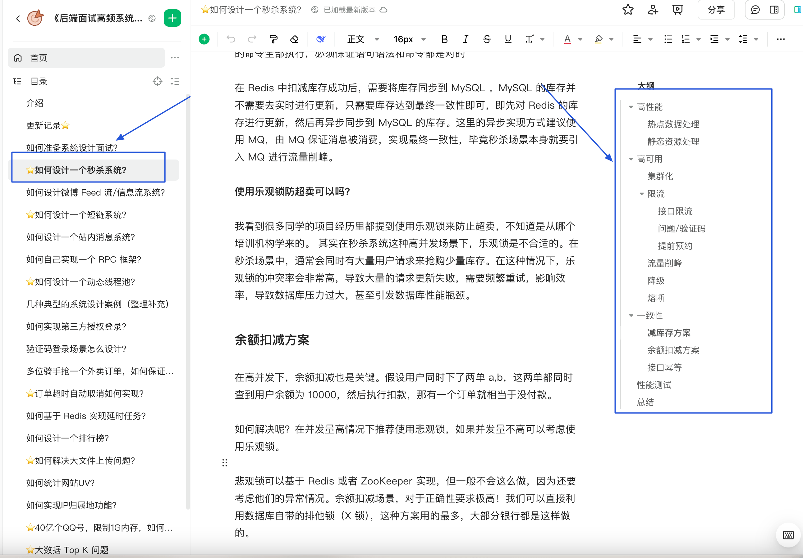
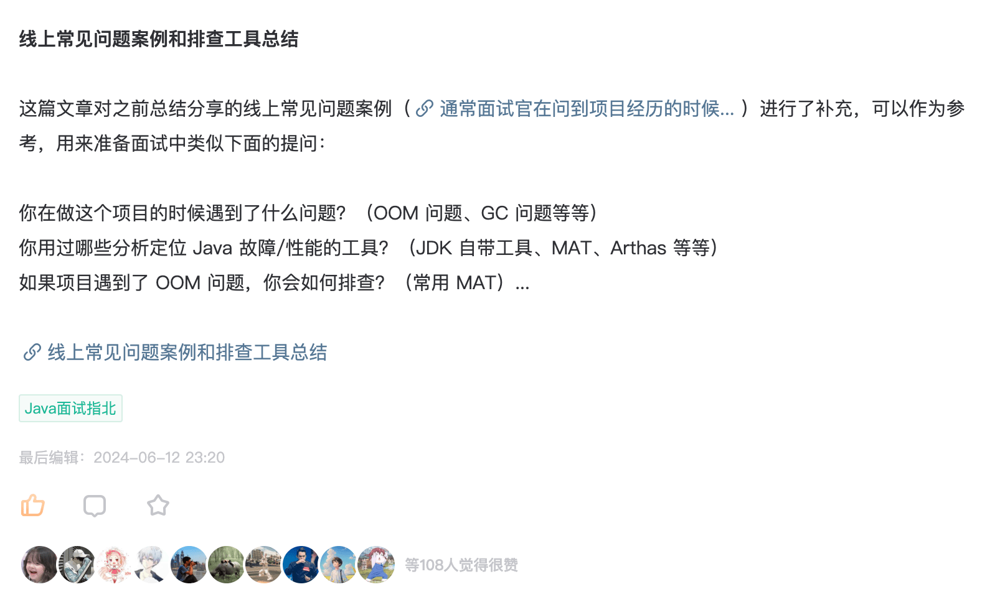
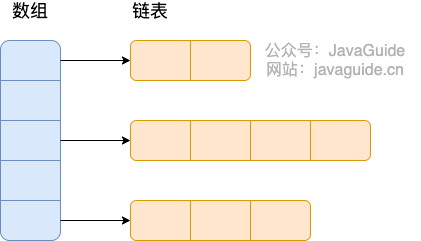
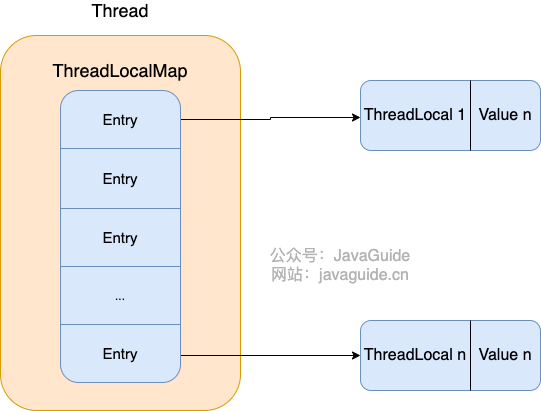
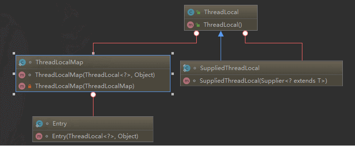
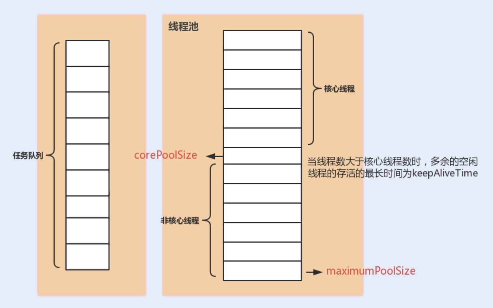

# ⭐️禾赛科技校招面试，小而美的中小厂！

上周五我分享了 10 家竞争相对较小且福利还不错的中小厂和独角兽公司。其中，我还分享了一家激光雷达领域的龙头企业[禾赛科技的面经](https://mp.weixin.qq.com/s/FBE0fVOkb8F5ogYKRioKDQ)。

评论区有读者表示需要这篇面经的详细参考答案。于是，我花了一晚上的时间，对其中最核心的面问题补充了答案解析，还将面试问题按知识模块重新进行了梳理和分类。希望能够对准备面试的朋友有帮助！

| 公司名称 | 亮点介绍 | 额外补充信息 (热招岗位/薪资福利) |
| --- | --- | --- |
| **海能达通信** | 全球领先的专网通信解决方案提供商，业务遍布海外，是行业内的绝对龙头。 | 软件/嵌入式/算法工程师、海外销售/技术支持等。基带硬件岗 12k-20k \* 14 薪。 |
| **MiniMax** | 国内 AGI（通用人工智能）领域的明星创业公司，专注于基础大模型研发，潜力巨大。 | 大模型算法评测工程师、Agent 服务端研发、AI 推理框架工程师等。大模型算法岗 30k-45k \* 16 薪。六险二金、年度调薪、房/餐/交通补贴，福利拉满。 |
| **莉莉丝游戏** | 国内顶尖的游戏研发与发行公司，以精品游戏和超强福利著称，是游戏行业的标杆企业。 | ETL 开发工程师、技术美术、产品经理等。客户端开发岗 18k-28k \* 16 薪。福利补贴名目多，非常丰厚。 |
| **元戎启行** | 国内自动驾驶领域的头部玩家，技术实力硬核，与多家主流车企有深度合作，前景广阔。 | 算法、软件、AI 数据平台等方向。嵌入式开发岗 20k-28k \* 15 薪。 |
| **商米科技** | 专注于智能商用硬件及 IoT 解决方案的科技公司，为员工提供快速的职业成长通道。 | 运维工程师、测试/法务/市场/数据标注等。安卓开发岗 16k-24k \* 14 薪。 |
| **柠檬微趣** | 国内知名的休闲手游研发与运营商，公司氛围好，福利待遇优厚。 | 测试工程师、C++客户端开发、Unity3D、大数据/数仓开发等。游戏策划岗 14k-20k \* 14 薪。七险一金、额外商业保险、丰厚年终奖。 |
| **禾赛科技** | 全球激光雷达领域的绝对龙头企业，技术和市场占有率均处于世界领先地位。 | 自动驾驶、激光雷达相关的软硬件、算法工程师等。上海研发岗月薪可达 30k+，待遇对标一线大厂，并会发放期权激励。 |
| **拓竹科技** | 消费级 3D 打印领域的现象级公司，产品在全球广受欢迎，是行业内的头部玩家。 | 嵌入式、软件、算法、结构等研发类岗位。校招研发岗月薪可开到 30k，薪资在硬件领域非常有竞争力。 |

## 自我介绍

面试时的自我介绍，其实是你给面试官的“第一印象浓缩版”。它不需要面面俱到，但要精准、自信地展现你的核心价值和与岗位的匹配度。通常控制在 1-2 分钟内比较合适。一个好的自我介绍应该包含这几点要素：

1. 用简单的话说清楚自己主要的技术栈于擅长的领域，例如 Java 后端开发、分布式系统开发；
2. 把重点放在自己的优势上，重点突出自己的能力，最好能用一个简短的例子支撑，例如：我比较擅长定位和解决复杂问题。在\[某项目/实习]中，我曾通过\[简述方法，如日志分析、源码追踪、压力测试]成功解决了\[某个具体问题，如一个棘手的性能瓶颈/一个偶现的 Bug]，将\[某个指标]提升了\[百分比/具体数值]。
3. 简要提及 1-2 个最能体现你能力和与岗位要求匹配的项目经历、实习经历或竞赛成绩。不需要展开细节，目的是引出面试官后续的提问。
4. 如果时间允许，可以非常简短地表达对所申请岗位的兴趣和对公司的向往，表明你是有备而来。

## 秒杀项目拷打

### 介绍秒杀项目的整体设计

可以从高性能、高可用和一致性这三个角度去谈：

* 高性能：热点数据处理、静态资源处理、MQ 异步处理
* 高可用：集群、限流、降级熔断、MQ 削峰
* 一致性：扣库存方案、余额扣减方案、接口幂等

[《后端面试高频系统设计&场景题》](https://t.zsxq.com/avfM0)（20+高频系统设计&场景面试题）中详细介绍过秒杀系统的设计。



### 为什么要在下单环节引入消息队列？

对于突发的大流量我们还可以使用消息队列进行流量削峰。秒杀开始之后的流量不是很大，我处理不了嘛！那我就先把这些请求放到消息队列中去。然后，咱后端服务再慢慢根据自己的能力去消费这些消息，这样就避免直接把后端服务打垮掉。

另外，下单操作涉及到多个下游服务，如扣减库存、更新用户积分、发送通知等。引入 MQ后，下单接口只需将消息成功写入队列即可立即向用户返回“排队中”或“下单成功”的提示，后续复杂的业务逻辑被异步化，各个服务之间也实现了解耦，任何一个下游服务的故障都不会影响核心的下单流程。

### 库存的扣减为什么选择 Redis + Lua?

常见的减库存方案有：

* **下单即减库存** ：只要用户下单了，即使不付款，我们就扣库存。
* **付款再减库存** ：当用户付款了之后，我们再减库存。不过， 这种情况可能会造成用户下订单成功，但是付款失败。

一般情况下都是 **下单减扣库存** ，像现在的购物网站比如京东都是这样来做的。

不过，我们还会对业务逻辑做进一步优化，比如说对超过一定时间不付款的订单特殊处理，释放库存。

对应到代码层面，我们应该如何保证不会超卖呢？

我们上面也说，我们一般会提前将秒杀商品的信息放到缓存中去。我们可以通过  Lua 脚本对库存进行原子操作。伪代码如下：

```lua
-- 第一步：先检查 库存是否充足，库存不足，返回 0
local stockNum=tonumber(redis.call("get",key);
if stockNum<1 then
      return 0;
-- 第二步：如果库存充足，减少库存（假设只能购买一件）,返回 1
else
    redis.call('DECRBY',key,1);
  return 1;
end
```

**为什么 用 Redis + Lua？**  主要有两点原因

* **原子性**：Redis 会将整个 Lua 脚本作为一个不可分割的整体来执行，在脚本执行期间，不会有其他任何命令可以插入执行。这完美地解决了“读-改-写”的原子性问题。
* **高性能**：操作完全在内存中进行，性能极高，远超数据库。同时，将多个命令打包在一次网络请求中，也减少了网络开销。

不过，如果 Lua 脚本运行时出错并中途结束，出错之后的命令是不会被执行的。并且，出错之前执行的命令是无法被撤销的，无法实现类似关系型数据库执行失败可以回滚的那种原子性效果。因此， 严格来说的话，通过 Lua 脚本来批量执行 Redis 命令实际也是不完全满足原子性的。如果想要让 Lua 脚本中的命令全部执行，必须保证语句语法和命令都是对的。

### 为什么使用 ZSet 来实现点赞排行榜？

使用 Redis 的 Sorted Set (ZSet) 来实现点赞排行榜，是因为它的数据结构特性与排行榜的需求完美匹配。

1. **排序功能**：ZSet 是一个有序集合，每个元素都关联一个 score（分数）。它会自动根据 score 对元素进行排序。这使得我们可以直接将点赞数作为 score，ZSet 会自动维护一个实时的点赞排行榜。
2. **高性能的排序操作**：
   * **更新/点赞**：使用 ZINCRBY 命令，可以为一个元素（如文章ID）的 score（点赞数）原子性地加一，时间复杂度为 O(log N)，非常高效。
   * **查询 Top N**：使用 ZREVRANGE 命令，可以快速获取分数从高到低的 Top N 列表，时间复杂度为 O(log N + M) (M为返回数量)，性能极高。
   * **查询排名和分数**：使用 ZREVRANK 和 ZSCORE，可以瞬间查到某个特定元素的排名和分数。
   * ......
3. **灵活的排序策略**：ZSet 的 score 是一个浮点数，这给了我们很大的操作空间。例如，如果希望在点赞数相同的情况下，按时间排序（越早点赞的排名越靠前），我们可以巧妙地组合 `score：score = <点赞数>.<MAX_TIMESTAMP - 当前时间戳>`。这样既保证了按点赞数排序，又实现了按时间排序的次级需求。

### 做项目的过程中最大的挑战是什么？

这是一个比较常见的问题，面试被问项目经历的时候经常会碰到。

**切记！！！一定要提前准备，不然被问到就无了，比较影响面试官对你印象。**

你可以在面试之前思考一下项目进行过程中有没有遇到过什么棘手的问题，生产问题、性能问题或者业务问题皆可。相对来说，生产问题和性能问题更有说服力一些，也更容易准备一些。即使不是你自己遇到的问题，你也可以拿来用，只要你搞懂吃透就行了，注意适当润色。

不过，如果你平时不注意思考总结或者项目整体比较简单的话，可能感觉并没有遇到什么比较棘手的问题。

这个时候，你可以从项目技术栈来研究一下，看看项目在使用这些技术的时候可能会遇到哪些生产问题。如果想不出来的话，也没关系，根据技术关键词去搜相关的生产问题案例（我之前在[星球](https://mp.weixin.qq.com/s/lVso6qkDg0WjHqWTDh0ALg)分享过一些线上常见问题案例：<https://t.zsxq.com/0dobVUIx7> ，建议抽空看看，内容涵盖CPU飙升、OOM 问题、GC 问题等常见生产问题的排查和多线程、数据库、消息队列等生产问题案例）。参考别人遇到遇到的生产问题，再结合自己项目的具体情况，改编成自己的就好。不过，一定要搞懂吃透，避免面试的时候回答不上来。类似地，性能问题也是同样的思路。



## Java 集合

### HashMap 的底层实现

#### JDK1.8 之前

JDK1.8 之前 `HashMap` 底层是 **数组和链表** 结合在一起使用也就是 **链表散列**。HashMap 通过 key 的 `hashcode` 经过扰动函数处理过后得到 hash 值，然后通过 `(n - 1) & hash` 判断当前元素存放的位置（这里的 n 指的是数组的长度），如果当前位置存在元素的话，就判断该元素与要存入的元素的 hash 值以及 key 是否相同，如果相同的话，直接覆盖，不相同就通过拉链法解决冲突。

`HashMap` 中的扰动函数（`hash` 方法）是用来优化哈希值的分布。通过对原始的 `hashCode()` 进行额外处理，扰动函数可以减小由于糟糕的 `hashCode()` 实现导致的碰撞，从而提高数据的分布均匀性。

**JDK 1.8 HashMap 的 hash 方法源码:**

JDK 1.8 的 hash 方法 相比于 JDK 1.7 hash 方法更加简化，但是原理不变。

```java
    static final int hash(Object key) {
      int h;
      // key.hashCode()：返回散列值也就是hashcode
      // ^：按位异或
      // >>>:无符号右移，忽略符号位，空位都以0补齐
      return (key == null) ? 0 : (h = key.hashCode()) ^ (h >>> 16);
  }
```

对比一下 JDK1.7 的 HashMap 的 hash 方法源码.

```java
static int hash(int h) {
    // This function ensures that hashCodes that differ only by
    // constant multiples at each bit position have a bounded
    // number of collisions (approximately 8 at default load factor).

    h ^= (h >>> 20) ^ (h >>> 12);
    return h ^ (h >>> 7) ^ (h >>> 4);
}
```

相比于 JDK1.8 的 hash 方法 ，JDK 1.7 的 hash 方法的性能会稍差一点点，因为毕竟扰动了 4 次。

所谓 **“拉链法”** 就是：将链表和数组相结合。也就是说创建一个链表数组，数组中每一格就是一个链表。若遇到哈希冲突，则将冲突的值加到链表中即可。



#### JDK1.8 之后

相比于之前的版本， JDK1.8 之后在解决哈希冲突时有了较大的变化，当链表长度大于阈值（默认为 8）（将链表转换成红黑树前会判断，如果当前数组的长度小于 64，那么会选择先进行数组扩容，而不是转换为红黑树）时，将链表转化为红黑树。

这样做的目的是减少搜索时间：链表的查询效率为 O(n)（n 是链表的长度），红黑树是一种自平衡二叉搜索树，其查询效率为 O(log n)。当链表较短时，O(n) 和 O(log n) 的性能差异不明显。但当链表变长时，查询性能会显著下降。


**为什么优先扩容而非直接转为红黑树？**

数组扩容能减少哈希冲突的发生概率（即将元素重新分散到新的、更大的数组中），这在多数情况下比直接转换为红黑树更高效。

红黑树需要保持自平衡，维护成本较高。并且，过早引入红黑树反而会增加复杂度。

**为什么选择阈值 8 和 64？**

1. 泊松分布表明，链表长度达到 8 的概率极低（小于千万分之一）。在绝大多数情况下，链表长度都不会超过 8。阈值设置为 8，可以保证性能和空间效率的平衡。
2. 数组长度阈值 64 同样是经过实践验证的经验值。在小数组中扩容成本低，优先扩容可以避免过早引入红黑树。数组大小达到 64 时，冲突概率较高，此时红黑树的性能优势开始显现。

> TreeMap、TreeSet 以及 JDK1.8 之后的 HashMap 底层都用到了红黑树。红黑树就是为了解决二叉查找树的缺陷，因为二叉查找树在某些情况下会退化成一个线性结构。

我们来结合源码分析一下 `HashMap` 链表到红黑树的转换。

**1、 **`putVal`** 方法中执行链表转红黑树的判断逻辑。**

链表的长度大于 8 的时候，就执行 `treeifyBin` （转换红黑树）的逻辑。

```java
// 遍历链表
for (int binCount = 0; ; ++binCount) {
    // 遍历到链表最后一个节点
    if ((e = p.next) == null) {
        p.next = newNode(hash, key, value, null);
        // 如果链表元素个数大于TREEIFY_THRESHOLD（8）
        if (binCount >= TREEIFY_THRESHOLD - 1) // -1 for 1st
            // 红黑树转换（并不会直接转换成红黑树）
            treeifyBin(tab, hash);
        break;
    }
    if (e.hash == hash &&
        ((k = e.key) == key || (key != null && key.equals(k))))
        break;
    p = e;
}
```

**2、**`treeifyBin`\*\* 方法中判断是否真的转换为红黑树。\*\*

```java
final void treeifyBin(Node<K,V>[] tab, int hash) {
    int n, index; Node<K,V> e;
    // 判断当前数组的长度是否小于 64
    if (tab == null || (n = tab.length) < MIN_TREEIFY_CAPACITY)
        // 如果当前数组的长度小于 64，那么会选择先进行数组扩容
        resize();
    else if ((e = tab[index = (n - 1) & hash]) != null) {
        // 否则才将列表转换为红黑树

        TreeNode<K,V> hd = null, tl = null;
        do {
            TreeNode<K,V> p = replacementTreeNode(e, null);
            if (tl == null)
                hd = p;
            else {
                p.prev = tl;
                tl.next = p;
            }
            tl = p;
        } while ((e = e.next) != null);
        if ((tab[index] = hd) != null)
            hd.treeify(tab);
    }
}
```

将链表转换成红黑树前会判断，如果当前数组的长度小于 64，那么会选择先进行数组扩容，而不是转换为红黑树。

### HashMap 是线程安全的吗？怎么解决？

JDK1.7 及之前版本，在多线程环境下，`HashMap` 扩容时会造成死循环和数据丢失的问题。

数据丢失这个在 JDK1.7 和 JDK 1.8 中都存在，这里以 JDK 1.8 为例进行介绍。

JDK 1.8 后，在 `HashMap` 中，多个键值对可能会被分配到同一个桶（bucket），并以链表或红黑树的形式存储。多个线程对 `HashMap` 的 `put` 操作会导致线程不安全，具体来说会有数据覆盖的风险。

`Collections` 提供了多个`synchronizedXxx()`方法·，该方法可以将指定集合包装成线程同步的集合，从而解决多线程并发访问集合时的线程安全问题。不过，最好不要用下面这些方法，效率非常低，需要线程安全的集合类型时请考虑使用 JUC （`java.util.concurrent`）包下的并发集合。

```java
synchronizedCollection(Collection<T>  c) //返回指定 collection 支持的同步（线程安全的）collection。
synchronizedList(List<T> list)//返回指定列表支持的同步（线程安全的）List。
synchronizedMap(Map<K,V> m) //返回由指定映射支持的同步（线程安全的）Map。
synchronizedSet(Set<T> s) //返回指定 set 支持的同步（线程安全的）set。
```

`ConcurrentHashMap` 是 JUC 包下专门为高并发场景设计的哈希表，是当前解决 `HashMap` 线程安全问题的首选方案。

## Java 并发

### 介绍一下 Java 中的锁

Java 同步锁实现方式主要有下面几类：

1. `synchronized`\*\* 关键字\*\*:`synchronized` 是 Java 内置的同步机制，依赖于 JVM 实现。在 Java 早期版本中，`synchronized` 属于重量级锁，效率低下。在 Java 6 之后， `synchronized` 引入了大量的优化如自旋锁、适应性自旋锁、锁消除、锁粗化、偏向锁、轻量级锁等技术来减少锁操作的开销，这些优化让 `synchronized` 锁的效率提升了很多。因此， `synchronized` 还是可以在实际项目中使用的，像 JDK 源码、很多开源框架都大量使用了 `synchronized` 。
2. `Lock`\*\* 和\*\*`ReadWriteLock`**接口实现类**：基于 Java 代码实现，常见的实现类有：
   * `ReentrantLock`：一个可重入且独占式的锁，和 `synchronized` 关键字类似。不过，`ReentrantLock` 更灵活、更强大，增加了轮询、超时、中断、公平锁和非公平锁等高级功能。
   * `ReentrantReadWriteLock`:`ReentrantReadWriteLock` 实现了 `ReadWriteLock` ，是一个可重入的读写锁，既可以保证多个线程同时读的效率，同时又可以保证有写入操作时的线程安全。
3. `StampedLock`: JDK 1.8 引入的性能更好的读写锁，不可重入且不支持条件变量 `Condition`。不同于一般的 `Lock` 类，`StampedLock` 并不是直接实现 `Lock`或 `ReadWriteLock`接口，而是基于 CLH 锁独立实现的（AQS 也是基于这玩意）。

### volatile 关键字有什么用？

在 Java 中，`volatile` 关键字可以保证变量的可见性，如果我们将变量声明为 `volatile` ，这就指示 JVM，这个变量是共享且不稳定的，每次使用它都到主存中进行读取。


`volatile` 关键字其实并非是 Java 语言特有的，在 C 语言里也有，它最原始的意义就是禁用 CPU 缓存。如果我们将一个变量使用 `volatile` 修饰，这就指示编译器，这个变量是共享且不稳定的，每次使用它都到主存中进行读取。

**在 Java 中，**`volatile`\*\* 关键字除了可以保证变量的可见性，还有一个重要的作用就是防止 JVM 的指令重排序。\*\* 如果我们将变量声明为 `volatile` ，在对这个变量进行读写操作的时候，会通过插入特定的 **内存屏障** 的方式来禁止指令重排序。

在 Java 中，`Unsafe` 类提供了三个开箱即用的内存屏障相关的方法，屏蔽了操作系统底层的差异：

```java
public native void loadFence();
public native void storeFence();
public native void fullFence();
```

理论上来说，你通过这个三个方法也可以实现和`volatile`禁止重排序一样的效果，只是会麻烦一些。

### 乐观锁和悲观锁呢？

关于乐观锁和悲观锁的详细介绍，推荐阅读笔者写的这篇文章：[什么是乐观锁和悲观锁？Java 中 CAS 是如何实现的？](https://mp.weixin.qq.com/s/L05pSKz07zTU_6uJSKjV1w) 。

### ThreadLocal 的工作原理是什么？为什么可能会导致内存泄漏？

从 `Thread`类源代码入手。

```java
public class Thread implements Runnable {
    //......
    //与此线程有关的ThreadLocal值。由ThreadLocal类维护
    ThreadLocal.ThreadLocalMap threadLocals = null;

    //与此线程有关的InheritableThreadLocal值。由InheritableThreadLocal类维护
    ThreadLocal.ThreadLocalMap inheritableThreadLocals = null;
    //......
}
```

从上面`Thread`类 源代码可以看出`Thread` 类中有一个 `threadLocals` 和 一个 `inheritableThreadLocals` 变量，它们都是 `ThreadLocalMap` 类型的变量,我们可以把 `ThreadLocalMap` 理解为`ThreadLocal` 类实现的定制化的 `HashMap`。默认情况下这两个变量都是 null，只有当前线程调用 `ThreadLocal` 类的 `set`或`get`方法时才创建它们，实际上调用这两个方法的时候，我们调用的是`ThreadLocalMap`类对应的 `get()`、`set()`方法。

`ThreadLocal`类的`set()`方法

```java
public void set(T value) {
    //获取当前请求的线程
    Thread t = Thread.currentThread();
    //取出 Thread 类内部的 threadLocals 变量(哈希表结构)
    ThreadLocalMap map = getMap(t);
    if (map != null)
        // 将需要存储的值放入到这个哈希表中
        map.set(this, value);
    else
        createMap(t, value);
}
ThreadLocalMap getMap(Thread t) {
    return t.threadLocals;
}
```

通过上面这些内容，我们足以通过猜测得出结论：**最终的变量是放在了当前线程的 **`ThreadLocalMap`** 中，并不是存在 **`ThreadLocal`** 上，**`ThreadLocal`\*\* 可以理解为只是\*\*`ThreadLocalMap`**的封装，传递了变量值。** `ThrealLocal` 类中可以通过`Thread.currentThread()`获取到当前线程对象后，直接通过`getMap(Thread t)`可以访问到该线程的`ThreadLocalMap`对象。

**每个**`Thread`**中都具备一个**`ThreadLocalMap`**，而**`ThreadLocalMap`**可以存储以**`ThreadLocal`**为 key ，Object 对象为 value 的键值对。**

```java
ThreadLocalMap(ThreadLocal<?> firstKey, Object firstValue) {
    //......
}
```

比如我们在同一个线程中声明了两个 `ThreadLocal` 对象的话， `Thread`内部都是使用仅有的那个`ThreadLocalMap` 存放数据的，`ThreadLocalMap`的 key 就是 `ThreadLocal`对象，value 就是 `ThreadLocal` 对象调用`set`方法设置的值。

`ThreadLocal` 数据结构如下图所示：



`ThreadLocalMap`是`ThreadLocal`的静态内部类。



`ThreadLocal` 内存泄漏的根本原因在于其内部实现机制。

通过上面的内容我们已经知道：每个线程维护一个名为 `ThreadLocalMap` 的 map。 当你使用 `ThreadLocal` 存储值时，实际上是将值存储在当前线程的 `ThreadLocalMap` 中，其中 `ThreadLocal` 实例本身作为 key，而你要存储的值作为 value。

`ThreadLocal` 的 `set()` 方法源码如下：

```java
public void set(T value) {
    Thread t = Thread.currentThread(); // 获取当前线程
    ThreadLocalMap map = getMap(t);   // 获取当前线程的 ThreadLocalMap
    if (map != null) {
        map.set(this, value);         // 设置值
    } else {
        createMap(t, value);          // 创建新的 ThreadLocalMap
    }
}
```

`ThreadLocalMap` 的 `set()` 和 `createMap()` 方法中，并没有直接存储 `ThreadLocal` 对象本身，而是使用 `ThreadLocal` 的哈希值计算数组索引，最终存储于类型为`static class Entry extends WeakReference<ThreadLocal<?>>`的数组中。

```java
int i = key.threadLocalHashCode & (len-1);
```

`ThreadLocalMap` 的 `Entry` 定义如下：

```java
static class Entry extends WeakReference<ThreadLocal<?>> {
    Object value;

    Entry(ThreadLocal<?> k, Object v) {
        super(k);
        value = v;
    }
}
```

`ThreadLocalMap` 的 `key` 和 `value` 引用机制：

* **key 是弱引用**：`ThreadLocalMap` 中的 key 是 `ThreadLocal` 的弱引用 (`WeakReference<ThreadLocal<?>>`)。 这意味着，如果 `ThreadLocal` 实例不再被任何强引用指向，垃圾回收器会在下次 GC 时回收该实例，导致 `ThreadLocalMap` 中对应的 key 变为 `null`。
* **value 是强引用**：即使 `key` 被 GC 回收，`value` 仍然被 `ThreadLocalMap.Entry` 强引用存在，无法被 GC 回收。

当 `ThreadLocal` 实例失去强引用后，其对应的 value 仍然存在于 `ThreadLocalMap` 中，因为 `Entry` 对象强引用了它。如果线程持续存活（例如线程池中的线程），`ThreadLocalMap` 也会一直存在，导致 key 为 `null` 的 entry 无法被垃圾回收，即会造成内存泄漏。

也就是说，内存泄漏的发生需要同时满足两个条件：

1. `ThreadLocal` 实例不再被强引用；
2. 线程持续存活，导致 `ThreadLocalMap` 长期存在。

虽然 `ThreadLocalMap` 在 `get()`, `set()` 和 `remove()` 操作时会尝试清理 key 为 null 的 entry，但这种清理机制是被动的，并不完全可靠。

**如何避免内存泄漏的发生？**

1. 在使用完 `ThreadLocal` 后，务必调用 `remove()` 方法。 这是最安全和最推荐的做法。 `remove()` 方法会从 `ThreadLocalMap` 中显式地移除对应的 entry，彻底解决内存泄漏的风险。 即使将 `ThreadLocal` 定义为 `static final`，也强烈建议在每次使用后调用 `remove()`。
2. 在线程池等线程复用的场景下，使用 `try-finally` 块可以确保即使发生异常，`remove()` 方法也一定会被执行。

### 线程池的核心参数有哪些？

`ThreadPoolExecutor` 3 个最重要的参数：

* `corePoolSize` : 任务队列未达到队列容量时，最大可以同时运行的线程数量。
* `maximumPoolSize` : 任务队列中存放的任务达到队列容量的时候，当前可以同时运行的线程数量变为最大线程数。
* `workQueue`: 新任务来的时候会先判断当前运行的线程数量是否达到核心线程数，如果达到的话，新任务就会被存放在队列中。

`ThreadPoolExecutor`其他常见参数 :

* `keepAliveTime`:线程池中的线程数量大于 `corePoolSize` 的时候，如果这时没有新的任务提交，核心线程外的线程不会立即销毁，而是会等待，直到等待的时间超过了 `keepAliveTime`才会被回收销毁。
* `unit` : `keepAliveTime` 参数的时间单位。
* `threadFactory` :executor 创建新线程的时候会用到。
* `handler` :拒绝策略（后面会单独详细介绍一下）。

下面这张图可以加深你对线程池中各个参数的相互关系的理解（图片来源：《Java 性能调优实战》）：



### 核心线程数和最大线程数的区别是什么？超过最大线程数后会发生什么？

核心线程数（`corePoolSize`）和最大线程数（`maximumPoolSize`）的主要区别在于它们的**创建时机**和**生命周期**：

* **创建时机不同**：
  * **核心线程**：在线程池刚创建或有新任务提交，且当前线程数小于 `corePoolSize` 时被创建。它们是线程池的“常驻员工”。
  * **非核心线程**：仅在核心线程都在忙，并且工作队列也满了之后，为了应急处理新任务而被创建。它们是“临时工”。
* **生命周期不同**：
  * **核心线程**：默认情况下会一直存活在线程池中，即使长时间空闲也不会被销毁。
  * **非核心线程**：有一个 `keepAliveTime` 的存活期。如果在这段时间内没有新任务分配给它，它就会被回收。

简单来说，`corePoolSize` 定义了线程池的日常处理能力，而 `maximumPoolSize` 定义了其极限抗压能力。

### 除了线程池，还在项目中用过其他实现多线程的手段吗？

当我们需要处理一系列有依赖关系的异步任务时，`CompletableFuture` 是一个非常强大的工具。例如，一个请求需要并行调用三个不同的微服务，等它们全部返回结果后再进行聚合。

笔者之前写文章详细介绍过`CompletableFuture`，篇幅问题，这里就不重复提了：[从 5s 到 0.5s！看看人家的 CompletableFuture 异步任务优化技巧，确实优雅！](https://mp.weixin.qq.com/s/L5RLrWTzEr_qVXoMQuYedg)。

## 数据库

### 为什么索引能提高查询速度?什么情况下适合使用索引？

通过索引，数据库可以**大幅减少需要扫描的数据量**，直接定位到符合条件的记录，从而显著加快数据检索速度，减少磁盘 I/O 次数。

下面这些情况看可以考虑使用索引：

* **被频繁查询的字段**：我们创建索引的字段应该是查询操作非常频繁的字段。
* **被作为条件查询的字段**：被作为 WHERE 条件查询的字段，应该被考虑建立索引。
* **频繁需要排序的字段**：索引已经排序，这样查询可以利用索引的排序，加快排序查询时间。
* **被经常频繁用于连接的字段**：经常用于连接的字段可能是一些外键列，对于外键列并不一定要建立外键，只是说该列涉及到表与表的关系。对于频繁被连接查询的字段，可以考虑建立索引，提高多表连接查询的效率。

### 什么情况下索引会失效？

索引失效也是慢查询的主要原因之一，常见的导致索引失效的情况有下面这些：

* \~~使用 ~~`SELECT *`~~ 进行查询;~~ `SELECT *` 不会直接导致索引失效（如果不走索引大概率是因为 where 查询范围过大导致的），但它可能会带来一些其他的性能问题比如造成网络传输和数据处理的浪费、无法使用索引覆盖；
* 创建了组合索引，但查询条件未遵守最左匹配原则；
* 在索引列上进行计算、函数、类型转换等操作；
* 以 % 开头的 LIKE 查询比如 `LIKE '%abc';`；
* 查询条件中使用 OR，且 OR 的前后条件中有一个列没有索引，涉及的索引都不会被使用到；
* IN 的取值范围较大时会导致索引失效，走全表扫描（NOT IN 和 IN 的失效场景相同）；
* 发生隐式转换；
* ……

推荐阅读这篇文章：[美团暑期实习一面：MySQl 索引失效的场景有哪些？](https://mp.weixin.qq.com/s/mwME3qukHBFul57WQLkOYg)。

### 如何查看某条 SQL 语句是否用到了索引？

我们可以使用 `EXPLAIN` 命令来分析 SQL 的 **执行计划** 。执行计划是指一条 SQL 语句在经过 MySQL 查询优化器的优化会后，具体的执行方式。

`EXPLAIN` 并不会真的去执行相关的语句，而是通过 **查询优化器** 对语句进行分析，找出最优的查询方案，并显示对应的信息。

`EXPLAIN` 适用于 `SELECT`, `DELETE`, `INSERT`, `REPLACE`, 和 `UPDATE`语句，我们一般分析 `SELECT` 查询较多。

我们这里简单来演示一下 `EXPLAIN` 的使用。

`EXPLAIN` 的输出格式如下：

```sql
mysql> EXPLAIN SELECT `score`,`name` FROM `cus_order` ORDER BY `score` DESC;
+----+-------------+-----------+------------+------+---------------+------+---------+------+--------+----------+----------------+
| id | select_type | table     | partitions | type | possible_keys | key  | key_len | ref  | rows   | filtered | Extra          |
+----+-------------+-----------+------------+------+---------------+------+---------+------+--------+----------+----------------+
|  1 | SIMPLE      | cus_order | NULL       | ALL  | NULL          | NULL | NULL    | NULL | 997572 |   100.00 | Using filesort |
+----+-------------+-----------+------------+------+---------------+------+---------+------+--------+----------+----------------+
1 row in set, 1 warning (0.00 sec)
```

各个字段的含义如下：

| **列名** | **含义** |
| --- | --- |
| id | SELECT 查询的序列标识符 |
| select\_type | SELECT 关键字对应的查询类型 |
| table | 用到的表名 |
| partitions | 匹配的分区，对于未分区的表，值为 NULL |
| type | 表的访问方法 |
| possible\_keys | 可能用到的索引 |
| key | 实际用到的索引 |
| key\_len | 所选索引的长度 |
| ref | 当使用索引等值查询时，与索引作比较的列或常量 |
| rows | 预计要读取的行数 |
| filtered | 按表条件过滤后，留存的记录数的百分比 |
| Extra | 附加信息 |

## 缓存

### 本地缓存和分布式缓存有什么区别？各自适用于什么场景？

| 特性 | 本地缓存 | 分布式缓存 |
| --- | --- | --- |
| 数据一致性 | 多服务器部署时存在数据不一致问题 | 数据一致 |
| 内存限制 | 受限于单台服务器内存 | 独立部署，内存空间更大 |
| 数据丢失风险 | 服务器宕机数据丢失 | 可持久化，数据不易丢失 |
| 管理维护 | 分散，管理不便 | 集中管理，提供丰富的管理工具 |
| 功能丰富性 | 功能有限，通常只提供简单的键值对存储 | 功能丰富，支持多种数据结构和功能 |

### Redis 有哪些数据类型？

Redis 中比较常见的数据类型有下面这些：

* **5 种基础数据类型**：String（字符串）、List（列表）、Set（集合）、Hash（散列）、Zset（有序集合）。
* **3 种特殊数据类型**：HyperLogLog（基数统计）、Bitmap （位图）、Geospatial (地理位置)。

除了上面提到的之外，还有一些其他的比如 [Bloom filter（布隆过滤器）](https://mp.weixin.qq.com/s/DeqJfw51tPJvdwAkq3iPdg)、Bitfield（位域）。

关于 Redis 5 种基础数据类型和 3 种特殊数据类型的详细介绍请看我写的这篇文章：[Redis 八种常用数据类型常用命令和应用场景](https://mp.weixin.qq.com/s/tjf3nBq0GsTh564NTVUq3g)。

### Redis6.0 之后为何引入了多线程？

**Redis6.0 引入多线程主要是为了提高网络 IO 读写性能**，因为这个算是 Redis 中的一个性能瓶颈（Redis 的瓶颈主要受限于内存和网络）。

虽然，Redis6.0 引入了多线程，但是 Redis 的多线程只是在网络数据的读写这类耗时操作上使用了，执行命令仍然是单线程顺序执行。因此，你也不需要担心线程安全问题。

Redis6.0 的多线程默认是禁用的，只使用主线程。如需开启需要设置 IO 线程数 > 1，需要修改 redis 配置文件 `redis.conf`：

```bash
io-threads 4 #设置1的话只会开启主线程，官网建议4核的机器建议设置为2或3个线程，8核的建议设置为6个线程
```

另外：

* io-threads 的个数一旦设置，不能通过 config 动态设置。
* 当设置 ssl 后，io-threads 将不工作。

开启多线程后，默认只会使用多线程进行 IO 写入 writes，即发送数据给客户端，如果需要开启多线程 IO 读取 reads，同样需要修改 redis 配置文件 `redis.conf`：

```bash
io-threads-do-reads yes
```

但是官网描述开启多线程读并不能有太大提升，因此一般情况下并不建议开启。

### 如果 Redis 宕机了，数据会丢失吗？有哪些持久化机制？如何选择？

使用缓存的时候，我们经常需要对内存中的数据进行持久化也就是将内存中的数据写入到硬盘中。大部分原因是为了之后重用数据（比如重启机器、机器故障之后恢复数据），或者是为了做数据同步（比如 Redis 集群的主从节点通过 RDB 文件同步数据）。

Redis 不同于 Memcached 的很重要一点就是，Redis 支持持久化，而且支持 3 种持久化方式:

* 快照（snapshotting，RDB）
* 只追加文件（append-only file, AOF）
* RDB 和 AOF 的混合持久化(Redis 4.0 新增)

关于 Redis 持久化机制的详细介绍，可以阅读笔者写的这篇文章：[宕机了，Redis 如何避免数据丢失？](https://mp.weixin.qq.com/s/V2Mro9VYp2BCmBnOM-Y-jg)。

## 网络

### TCP 与 UDP 的区别

1. **是否面向连接**：
   * TCP 是面向连接的。在传输数据之前，必须先通过“三次握手”建立连接；数据传输完成后，还需要通过“四次挥手”来释放连接。这保证了双方都准备好通信。
   * UDP 是无连接的。发送数据前不需要建立任何连接，直接把数据包（数据报）扔出去。
2. **是否是可靠传输**：
   * TCP 提供可靠的数据传输服务。它通过序列号、确认应答 (ACK)、超时重传、流量控制、拥塞控制等一系列机制，来确保数据能够无差错、不丢失、不重复且按顺序地到达目的地。
   * UDP 提供不可靠的传输。它尽最大努力交付 (best-effort delivery)，但不保证数据一定能到达，也不保证到达的顺序，更不会自动重传。收到报文后，接收方也不会主动发确认。
3. **是否有状态**：
   * TCP 是有状态的。因为要保证可靠性，TCP 需要在连接的两端维护连接状态信息，比如序列号、窗口大小、哪些数据发出去了、哪些收到了确认等。
   * UDP 是无状态的。它不维护连接状态，发送方发出数据后就不再关心它是否到达以及如何到达，因此开销更小（**这很“渣男”！**）。
4. **传输效率**：
   * TCP 因为需要建立连接、发送确认、处理重传等，其开销较大，传输效率相对较低。
   * UDP 结构简单，没有复杂的控制机制，开销小，传输效率更高，速度更快。
5. **传输形式**：
   * TCP 是面向字节流 (Byte Stream) 的。它将应用程序交付的数据视为一连串无结构的字节流，可能会对数据进行拆分或合并。
   * UDP 是面向报文 (Message Oriented) 的。应用程序交给 UDP 多大的数据块，UDP 就照样发送，既不拆分也不合并，保留了应用程序消息的边界。
6. **首部开销**：
   * TCP 的头部至少需要 20 字节，如果包含选项字段，最多可达 60 字节。
   * UDP 的头部非常简单，固定只有 8 字节。
7. **是否提供广播或多播服务**：
   * TCP 只支持点对点 (Point-to-Point) 的单播通信。
   * UDP 支持一对一 (单播)、一对多 (多播/Multicast) 和一对所有 (广播/Broadcast) 的通信方式。
8. ……

为了更直观地对比，可以看下面这个表格：

| 特性 | TCP | UDP |
| --- | --- | --- |
| **连接性** | 面向连接 | 无连接 |
| **可靠性** | 可靠 | 不可靠 (尽力而为) |
| **状态维护** | 有状态 | 无状态 |
| **传输效率** | 较低 | 较高 |
| **传输形式** | 面向字节流 | 面向数据报 (报文) |
| **头部开销** | 20 - 60 字节 | 8 字节 |
| **通信模式** | 点对点 (单播) | 单播、多播、广播 |
| **常见应用** | HTTP/HTTPS, FTP, SMTP, SSH | DNS, DHCP, SNMP, TFTP, VoIP, 视频流 |

### 列举几个使用 UDP 的网络协议

**UDP** 适用于那些对**实时性要求高、能容忍少量数据丢失**的应用，如域名解析 (DNS)、实时音视频 (RTP)、在线游戏、网络管理 (SNMP) 等。

### DNS 解析的过程

整个过程的步骤比较多，笔者单独写了一篇文章详细介绍：[DNS 如何将 xxxhub.com 转化为 IP 地址？](https://mp.weixin.qq.com/s/lMyWuOdp8_CmH_LoluqMKg)


> 更新: 2025-09-18 21:57:25  
> 原文: <https://www.yuque.com/snailclimb/mf2z3k/gokpul00ugz28nxg>