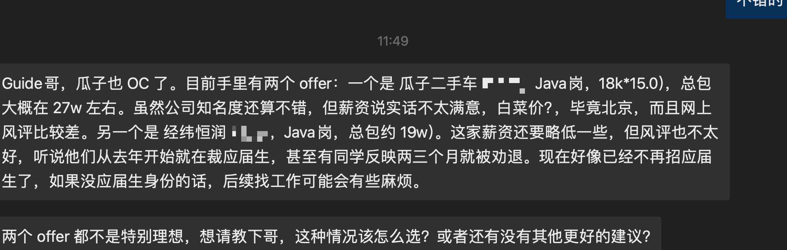

# 瓜子二手车、五八同城校招面经

## 瓜子二手车

瓜子二手车这几年的校招名额比较少，网上相关的面经也比较少。一位球友收到了瓜子二手车的offer，但由于公司风评太差了，非常纠结。

### 一面

一面重点考察基础知识，重点问了Java 并发、JVM 和 MySQL 数据库。面试官很喜欢在回答的基础上进行追问。

1. **数据结构与算法：**
   * 面试官开场先让我简单介绍了一下快速排序的思想和实现步骤，并分析了其在最优和最差情况下的时间复杂度。
   * **手撕代码：** 实现一个LRU缓存机制。写完后，面试官会检查代码，并询问在并发场景下如何保证其线程安全。
2. **Java 并发：**
   * 谈谈你对进程和线程的理解，它们之间有什么核心区别？线程是如何共享进程资源的？
   * 保证线程安全有哪些常见的方式？能具体聊聊 `synchronized` 和 `Lock` 的区别吗？
   * 既然提到了锁，那请介绍一下乐观锁和悲观锁的设计思想、实现方式（如CAS）以及各自的适用场景。
   * Java的线程池是如何工作的？请详细说明一下核心参数（`corePoolSize`, `maximumPoolSize`, `keepAliveTime`等）的含义以及新任务提交后的处理流程。
3. **JVM：**
   * 简单介绍一下JVM的内存区域划分，哪些是线程共享的，哪些是私有的？
   * 谈谈你对JVM垃圾回收（GC）的理解，比如常见的GC算法有哪些？新生代和老年代分别适合用哪种？
4. **数据库（MySQL）：**
   * MySQL的索引为什么普遍采用B+树结构？它相比于B树、哈希表有哪些优势？
   * 我们有一张订单表（order），如果需要频繁根据用户ID和下单时间进行查询，你会如何设计索引？联合索引的创建和使用上有什么需要注意的地方？
   * 什么是覆盖索引？它能带来什么好处？
5. **框架：** Spring是如何解决Bean之间的循环依赖问题的？可以谈谈其三级缓存的设计思想吗？

### 二面

二面由一位技术负责人进行，面试风格明显转向了对项目经验、系统设计和复杂场景处理能力的考察。

1. **项目与场景题：**
   * 首先是常规的项目拷打，让我详细介绍实习期间负责的模块，遇到的挑战以及如何解决的。
   * 如果线上一个核心接口的响应时间突然变得很长，你的排查思路是什么？。
   * 详细介绍一下你的项目是如何基于 Redis 实现分布式锁的？需要注意哪些问题？
   * 详细聊聊你的项目中 Redis 缓存和数据库数据一致性问题的解决方案。
   * 为什么使用 `ThreadLocal` 保存用户信息？`ThreadLocal`的实现原理是什么？它如何保证线程间的变量隔离？使用时有什么需要注意的？
   * 为什么用 RocketMQ 而不是其他消息队列？
2. **数据库（MySQL）：**
   * MySQL的事务隔离级别有哪些？InnoDB是如何通过MVCC（多版本并发控制）来实现可重复读的？
   * 请解释一下MySQL中Redo Log、Undo Log和Binlog的作用和区别，它们在事务处理和数据恢复中分别扮演什么角色？
   * 除了 MySQL，还了解或者用过其他关系型数据库吗？
3. **Java：**
   * `HashMap` 的底层数据结构是什么？它的扩容机制是怎样的？在JDK 1.8中做了哪些优化？
   * 接口和抽象类的区别?如何选择？
4. **手撕代码：**
   * 实现一个单例模式
   * 两个线程交替打印奇偶数

### HR面

技术面通过后，很快就约了HR面。HR主要就个人情况、职业规划、团队协作以及对公司的了解等方面进行了沟通。氛围比较轻松，真诚回答即可。

### 参考资料

下面这几篇文章基本涵盖了上面提到的绝大部分面试题的参考答案（注：这部分为 Guide 补充）：

* **数据结构与算法：**
  * [十大经典排序算法总结](https://javaguide.cn/cs-basics/algorithms/10-classical-sorting-algorithms.html)
  * [非常规 Leetcode 类型的高频笔试题](https://t.zsxq.com/W5ftN)
* **Java：**
  * [Java 基础常见面试题总结(中)](https://javaguide.cn/java/basis/java-basic-questions-02.html)（面向对象基础、字符串、对象的比较与拷贝等）
  * [Java 集合常见面试题总结(下)](https://javaguide.cn/java/collection/java-collection-questions-02.html)（ `HashMap`、`ConcurrentHashMap` 等核心集合）
  * [Java并发常见面试题总结（上）](https://javaguide.cn/java/concurrent/java-concurrent-questions-01.html)（多线程基础知识，例如线程和进程的概念、死锁）
  * [Java并发常见面试题总结（中）](https://javaguide.cn/java/concurrent/java-concurrent-questions-02.html)（各种锁，例如乐观锁和悲观锁、`synchronized`关键字、`ReentrantLock`）
  * [Java并发常见面试题总结（下）](https://javaguide.cn/java/concurrent/java-concurrent-questions-03.html)(`ThreadLocal`、线程池、`Future`、AQS、虚拟线程等)
  * [JVM 垃圾回收详解（重点）](https://javaguide.cn/java/jvm/jvm-garbage-collection.html)（JVM 的垃圾回收机制，包括堆空间结构、内存分配与回收原则、垃圾回收算法、以及 CMS、G1 等主流垃圾收集器的特点）
* **数据库**：
  * [MySQL 常见面试题总结](https://javaguide.cn/database/mysql/mysql-questions-01.html)（MySQL 基础、存储引擎、事务、索引、锁、性能优化等）
  * [Redis 常见面试题总结(下)](https://javaguide.cn/database/redis/redis-questions-02.html)（Redis 事务、性能优化、生产问题、集群、使用规范等）
  * [PostgreSQL 是一个非常优秀、有前景且值得投入的数据库系统](https://t.zsxq.com/V1tRG)（我在星球分享的一篇帖子，主要介绍了  PostgreSQL 相比 MySQL 的主要优势，以及 PostgreSQL 的应用场景）
  * [Redis 常见面试题总结(下)](https://javaguide.cn/database/redis/redis-questions-02.html)（Redis 事务、性能优化、生产问题、集群、使用规范等）
* **分布式**：[分布式锁常见实现方案总结](https://javaguide.cn/distributed-system/distributed-lock-implementations.html)
* **消息队列**： [消息队列基础知识总结](https://javaguide.cn/high-performance/message-queue/message-queue.html)
* **场景题**：[线上常见问题案例和排查工具](https://t.zsxq.com/0fobVUIx7)（内容涵盖CPU飙升、OOM 问题、GC 问题等常见生产问题的排查和多线程、数据库、消息队列等生产问题案例）

## 五八同城

### 一面（30 min）

一面的节奏很快，面试官开场后直接切入正题，先从项目入手，再逐步考察相关的技术栈。

1. **自我介绍**
2. **项目**：
   * 项目中遇到的最大困难是什么？你是如何解决的？
   * 看你项目里同时用到了 MySQL 和 Redis，那你们是如何保证两者数据一致性的？
   * RocketMQ 的广播消息可能会丢失，有考虑过如何处理吗？
   * 了解分布式事务吗？可以介绍一下你了解的解决方案吗？” 面试官在我回答后追问：“RocketMQ 本身能实现分布式事务吗？
3. **数据库（MySQL）**：
   * 能谈谈你对数据库索引的理解吗？
   * 如何进行 SQL 查询优化？
   * 并发事务会带来哪些问题？（脏读、不可重复读、幻读）
   * MySQL 的默认隔离级别是什么？它能完全解决幻读问题吗？
4. **Java**：
   * `synchronized` 和 `volatile` 有什么区别？”，“为什么有了 `synchronized` 之后，还需要 `ReentrantLock`？它们在使用上有什么不同？
   * 接口和抽象类的区别是什么？
   * 泛型的作用是什么？能谈谈类型擦除吗？
   * 说一下 `HashMap` 的底层原理，以及“在什么情况下 `HashMap` 的效率会降低？
5. **手撕算法**：题目是 LeetCode 219. 存在重复元素 II。

### 二面（30 min）

二面面试官的级别应该更高，提问更有深度，并且非常喜欢结合具体场景来考察候选人解决问题的能力和技术视野。

1. **Java**：
   * Java 中的值传递和引用传递，谈谈你的理解。
   * `String`、`StringBuffer` 和 `StringBuilder` 的区别是什么？重点说一下线程安全性。
   * 创建多线程有哪几种方式？你平时用哪种比较多？
   * `ThreadLocal` 的底层原理是什么？它会造成内存泄漏吗？为什么？
   * 能讲一下 `synchronized` 锁的升级过程吗？（无锁 -> 偏向锁 -> 轻量级锁 -> 重量级锁）
2. **JVM**：
   * 讲一下 JVM 的双亲委派模型。你知道哪些场景打破了双亲委派模型吗？（如 Tomcat、SPI 机制）
   * 如果一个类已经加载到 JVM 并且正在运行，现在需要热更新这个类里的部分逻辑，但又不想重启服务，有什么办法可以实现？
3. **Redis**：
   * Redis 的 `zset`（有序集合）底层是如何实现的？
   * 如何基于 Redis 实现一个分布式锁？如果 Redis 是主从架构，获取锁时可能会有什么问题？
4. **场景题**：设想一个场景，多个人在瞬间同时给一个主播打赏，这是一个典型的高并发写操作，你会如何设计这个系统？（我最初提了分批处理的方案，面试官引导说如果请求量巨大，可以考虑使用 MQ 进行削峰填谷，将瞬时的大量写请求异步化处理 ）

### HR 面（20 min）

HR 面相对轻松，主要是一些常规问题，比如：

* 自我介绍
* 为什么选择五八同城？
* 未来的职业规划
* 手头有其他 Offer 吗？
* 期望薪资
* 反问环节（我问了关于团队技术氛围和新人培养机制的问题）

## 参考资料

下面这几篇文章基本涵盖了上面提到的绝大部分面试题的参考答案（注：这部分为 Guide 补充）：

* **Java：**
  * [Java 基础常见面试题总结(中)](https://javaguide.cn/java/basis/java-basic-questions-02.html)（面向对象基础、字符串、对象的比较与拷贝等）
  * [Java 集合常见面试题总结(下)](https://javaguide.cn/java/collection/java-collection-questions-02.html)（ `HashMap`、`ConcurrentHashMap` 等核心集合）
  * [Java并发常见面试题总结（中）](https://javaguide.cn/java/concurrent/java-concurrent-questions-02.html)（各种锁，例如乐观锁和悲观锁、`synchronized`关键字、`ReentrantLock`）
  * [Java并发常见面试题总结（上）](https://javaguide.cn/java/concurrent/java-concurrent-questions-01.html)（多线程基础知识，例如线程和进程的概念、死锁）
  * [Java并发常见面试题总结（下）](https://javaguide.cn/java/concurrent/java-concurrent-questions-03.html)(`ThreadLocal`、线程池、`Future`、AQS、虚拟线程等)
  * [类加载器详解（重点）](https://javaguide.cn/java/jvm/classloader.html)（详细介绍了双亲委派模型）
* **数据库**：
  * [MySQL 常见面试题总结](https://javaguide.cn/database/mysql/mysql-questions-01.html)（MySQL 基础、存储引擎、事务、索引、锁、性能优化等）
  * [Redis 常见面试题总结(下)](https://javaguide.cn/database/redis/redis-questions-02.html)（Redis 事务、性能优化、生产问题、集群、使用规范等）
  * [Redis 为什么用跳表实现有序集合](https://javaguide.cn/database/redis/redis-skiplist.html)
  * [分布式锁常见实现方案总结](https://javaguide.cn/distributed-system/distributed-lock-implementations.html)（详细介绍了如何基于 Redis 实现分布式锁）
* **消息队列**：[RocketMQ 常见问题总结](https://javaguide.cn/high-performance/message-queue/rocketmq-questions.html)

> 更新: 2025-08-03 07:58:32  
> 原文: <https://www.yuque.com/snailclimb/mf2z3k/kf5agzaxtcap112a>