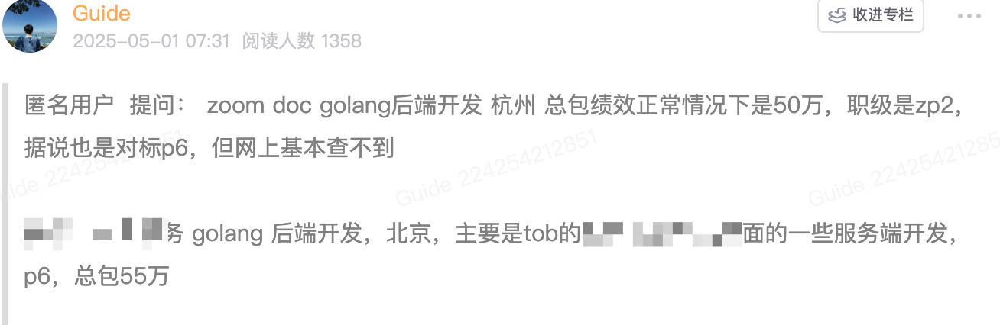
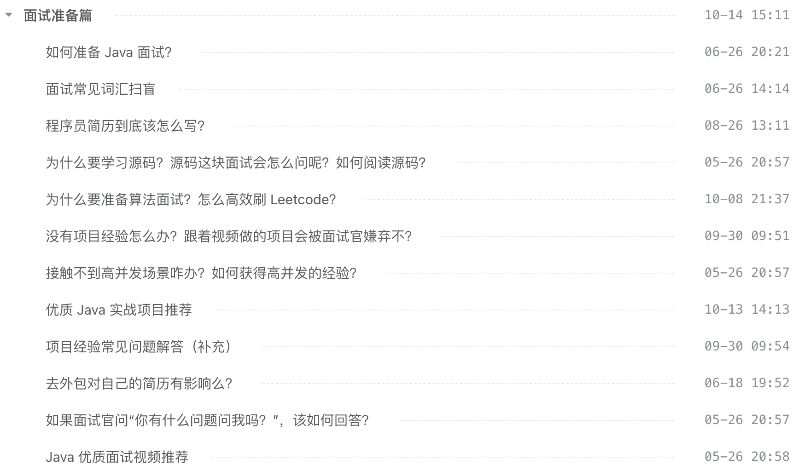
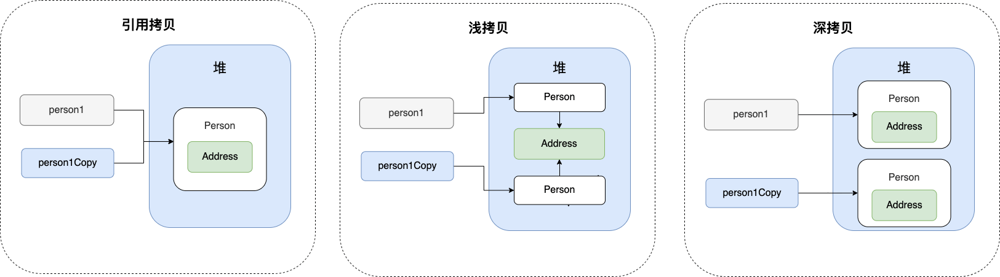
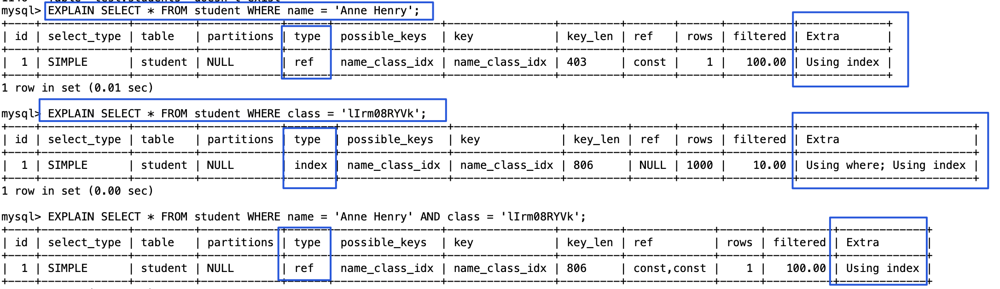
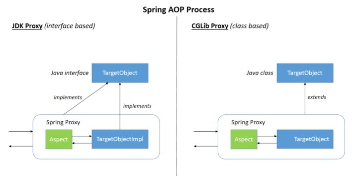
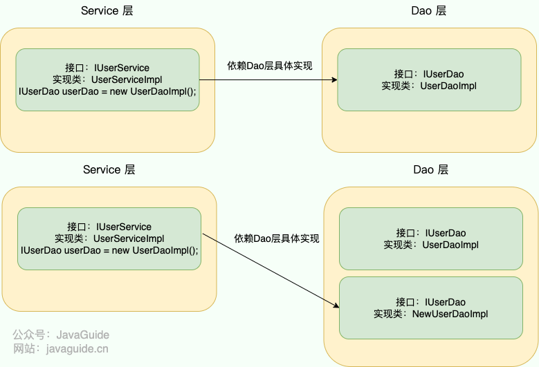
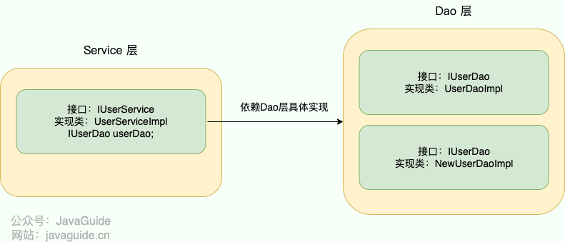
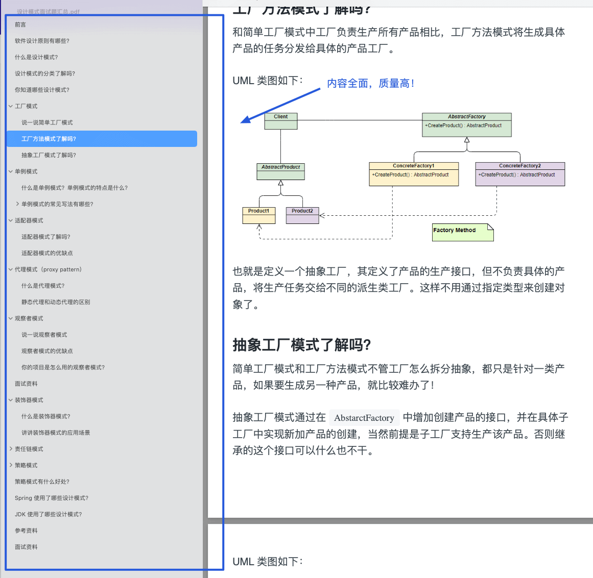

# ⭐️ZOOM 校招面试，被拷打了！

Zoom 以视频会议起家，现已扩展至电话、消息、客服中心、文档协作等完整办公协作栈。

中国是 Zoom 最大海外研发基地，在杭州、合肥、苏州都有办公室。并且，Zoom 的部分岗位还支持远程办公。

作为一家外企，Zoom 的工作强度非常友好，接近 955。并且，福利待遇也是没得说：六险一金，餐补、婚育彩金、免费的下午茶和小吃 10-18 天年假，20 天带薪病假，员工活动丰富。

前段时间，[星球](https://javaguide.cn/about-the-author/zhishixingqiu-two-years.html)里有球友拿到了 ZOOM 的 offer，总包 50w，虽然薪资比不上另外一家，但整体性价比挺高的，时薪很有竞争力！



下面给大家分享一篇 Zoom 的校招一面面经，整体难度一般，但问的也比较全面，大家感受一下难度如何。

**面试形式**：线上 Zoom 会议；**时长**：50 分钟。

## 自我介绍

面试外企建议还是准备一份英文自我介绍，毕竟面试官有可能会让你用英文做自我介绍，甚至让你用英文介绍上一段工作经历。

英语差的朋友也不用担心，国内很多外企招聘求职者对英语其实也没有硬性要求，包容度还是比较高的。

面试时的自我介绍，其实是你给面试官的“第一印象浓缩版”。它不需要面面俱到，但要精准、自信地展现你的核心价值和与岗位的匹配度。通常控制在 1-2 分钟内比较合适。一个好的自我介绍应该包含这几点要素：

1. 用简单的话说清楚自己主要的技术栈于擅长的领域，例如 Java 后端开发、分布式系统开发；
2. 把重点放在自己的优势上，重点突出自己的能力，最好能用一个简短的例子支撑，例如：我比较擅长定位和解决复杂问题。在\[某项目/实习]中，我曾通过\[简述方法，如日志分析、源码追踪、压力测试]成功解决了\[某个具体问题，如一个棘手的性能瓶颈/一个偶现的 Bug]，将\[某个指标]提升了\[百分比/具体数值]。
3. 简要提及 1-2 个最能体现你能力和与岗位要求匹配的项目经历、实习经历或竞赛成绩。不需要展开细节，目的是引出面试官后续的提问。
4. 如果时间允许，可以非常简短地表达对所申请岗位的兴趣和对公司的向往，表明你是有备而来。

《Java面试指北》的 **「面试准备篇」** ，我写了 17+ 篇文章手把手教你如何准备面试，50+ 准备面试过程中的常见问题详细解读。准备面试过程中常见的疑问这里都有解答，内容涵盖项目经验、简历编写、源码学习、算法准备、面试资源等等。



## 实习拷打

### 定时任务怎么实现的？

Spring Boot 项目使用 `@Scheduled` 注解就能很方便地创建一个定时任务。

Spring Task 在多节点部署时，如果不采取措施，每个节点都会执行相同的定时任务，导致重复执行。这主要是因为每个节点上都运行着独立的 Spring 容器，每个容器都拥有自己的定时任务调度器，并独立地根据配置的时间触发任务，互不干扰。如果多个节点的配置相同，就会导致同一任务在多个节点上并发执行。这种情况不仅浪费资源，还可能导致数据不一致、资源竞争等问题，最终导致业务逻辑错误，例如重复处理相同的数据、发送重复的通知。

可以利用数据库或者 Redis、ZooKeeper 等中间件实现分布式锁，确保在同一时刻仅有一个节点可获取锁并触发对应的定时任务。

### 登录这里为什么不用 JWT？

相比于 Session 认证的方式来说，使用 JWT 进行身份认证主要有下面 4 个优势：

1. **无状态**：JWT 自身包含了身份验证所需要的所有信息，因此，我们的服务器不需要存储 Session 信息。这显然增加了系统的可用性和伸缩性，大大减轻了服务端的压力。不过，也正是由于 JWT 的无状态，也导致了它最大的缺点：**不可控！**
2. **有效避免了 CSRF 攻击**：使用 JWT 进行身份验证不需要依赖 Cookie ，因此可以避免 CSRF 攻击。
3. **适合移动端应用**：使用 Session 进行身份认证的话，需要保存一份信息在服务器端，而且这种方式会依赖到 Cookie（需要 Cookie 保存 `SessionId`），所以不适合移动端。但是，使用 JWT 进行身份认证就不会存在这种问题，因为只要 JWT 可以被客户端存储就能够使用，而且 JWT 还可以跨语言使用。
4. **单点登录友好**：使用 Session 进行身份认证的话，实现单点登录，需要我们把用户的 Session 信息保存在一台电脑上，并且还会遇到常见的 Cookie 跨域的问题。但是，使用 JWT 进行认证的话， JWT 被保存在客户端，不会存在这些问题。

但 JWT 并不是银弹，依然存在很多问题需要解决，例如：

1. **注销登录等场景下 JWT 还有效**：这个问题不存在于 Session 认证方式中，因为在 Session 认证方式中，遇到这种情况的话服务端删除对应的 Session 记录即可。但是，使用 JWT 认证的方式就不好解决了。我们也说过了，JWT 一旦派发出去，如果后端不增加其他逻辑的话，它在失效之前都是有效的。
2. **续签问题**：JWT 通常有一个有效期（`exp` 字段），当令牌过期时，用户需要重新登录或获取一个新的令牌，这就是所谓的续签（refresh）问题。
3. **JWT 体积太大**：JWT 结构复杂（Header、Payload 和 Signature），包含了更多额外的信息，还需要进行 Base64Url 编码，这会使得 JWT 体积较大，增加了网络传输的开销。

实际项目中，不用 JWT 直接使用普通的 Token(随机生成的 ID，不包含具体的信息) 结合 Redis 来做身份认证也是可以的。传统的 Token 通常只是一个唯一标识符，对应的信息（例如用户 ID、Token 过期时间、权限信息）存储在服务端，通常会通过 Redis 保存。传统 Token 体积更小，也更容易解决 JWT 存在的一些问题。

详细介绍可以参考笔者写的这两篇文章：

* [什么是 JWT? 如何基于 JWT 进行身份验证？](https://javaguide.cn/system-design/security/jwt-intro.html)
* [JWT 有什么问题？真的是最好的选择吗?](https://javaguide.cn/system-design/security/advantages-and-disadvantages-of-jwt.html)

### 做项目的过程中最大的挑战是什么？

这是一个比较常见的问题，面试被问项目经历的时候经常会碰到。

**切记！！！一定要提前准备，不然被问到就无了，比较影响面试官对你印象。**

你可以在面试之前思考一下项目进行过程中有没有遇到过什么棘手的问题，生产问题、性能问题或者业务问题皆可。相对来说，生产问题和性能问题更有说服力一些，也更容易准备一些。即使不是你自己遇到的问题，你也可以拿来用，只要你搞懂吃透就行了，注意适当润色。

不过，如果你平时不注意思考总结或者项目整体比较简单的话，可能感觉并没有遇到什么比较棘手的问题。

这个时候，你可以从项目技术栈来研究一下，看看项目在使用这些技术的时候可能会遇到哪些生产问题。如果想不出来的话，也没关系，根据技术关键词去搜相关的生产问题案例（我之前在[星球](https://javaguide.cn/about-the-author/zhishixingqiu-two-years.html)分享过一些线上常见问题案例：<https://t.zsxq.com/0dobVUIx7> ，建议抽空看看，内容涵盖CPU飙升、OOM 问题、GC 问题等常见生产问题的排查和多线程、数据库、消息队列等生产问题案例）。参考别人遇到遇到的生产问题，再结合自己项目的具体情况，改编成自己的就好。不过，一定要搞懂吃透，避免面试的时候回答不上来。类似地，性能问题也是同样的思路。


## Java

### 动态代理和静态代理

静态代理中，我们对目标对象的每个方法的增强都是手动完成的，非常不灵活（比如接口一旦新增加方法，目标对象和代理对象都要进行修改）且麻烦(需要对每个目标类都单独写一个代理类）。 实际应用场景非常非常少，日常开发几乎看不到使用静态代理的场景。

相比于静态代理来说，动态代理更加灵活。我们不需要针对每个目标类都单独创建一个代理类，并且也不需要我们必须实现接口，我们可以直接代理实现类(CGLIB 动态代理机制)。

### 深拷贝和浅拷贝

### 浅拷贝和深拷贝

关于深拷贝和浅拷贝区别，我这里先给结论：

* **浅拷贝**：浅拷贝会在堆上创建一个新的对象（区别于引用拷贝的一点），不过，如果原对象内部的属性是引用类型的话，浅拷贝会直接复制内部对象的引用地址，也就是说拷贝对象和原对象共用同一个内部对象。
* **深拷贝**：深拷贝会完全复制整个对象，包括这个对象所包含的内部对象。

上面的结论没有完全理解的话也没关系，我们来看一个具体的案例！

#### 浅拷贝

浅拷贝的示例代码如下，我们这里实现了 `Cloneable` 接口，并重写了 `clone()` 方法。

`clone()` 方法的实现很简单，直接调用的是父类 `Object` 的 `clone()` 方法。

```java
public class Address implements Cloneable{
    private String name;
    // 省略构造函数、Getter&Setter方法
    @Override
    public Address clone() {
        try {
            return (Address) super.clone();
        } catch (CloneNotSupportedException e) {
            throw new AssertionError();
        }
    }
}

public class Person implements Cloneable {
    private Address address;
    // 省略构造函数、Getter&Setter方法
    @Override
    public Person clone() {
        try {
            Person person = (Person) super.clone();
            return person;
        } catch (CloneNotSupportedException e) {
            throw new AssertionError();
        }
    }
}
```

测试：

```java
Person person1 = new Person(new Address("武汉"));
Person person1Copy = person1.clone();
// true
System.out.println(person1.getAddress() == person1Copy.getAddress());
```

从输出结构就可以看出， `person1` 的克隆对象和 `person1` 使用的仍然是同一个 `Address` 对象。

#### 深拷贝

这里我们简单对 `Person` 类的 `clone()` 方法进行修改，连带着要把 `Person` 对象内部的 `Address` 对象一起复制。

```java
@Override
public Person clone() {
    try {
        Person person = (Person) super.clone();
        person.setAddress(person.getAddress().clone());
        return person;
    } catch (CloneNotSupportedException e) {
        throw new AssertionError();
    }
}
```

测试：

```java
Person person1 = new Person(new Address("武汉"));
Person person1Copy = person1.clone();
// false
System.out.println(person1.getAddress() == person1Copy.getAddress());
```

从输出结构就可以看出，显然 `person1` 的克隆对象和 `person1` 包含的 `Address` 对象已经是不同的了。

**那什么是引用拷贝呢？** 简单来说，引用拷贝就是两个不同的引用指向同一个对象。

我专门画了一张图来描述浅拷贝、深拷贝、引用拷贝：



### 线程池有什么好处？

池化技术想必大家已经屡见不鲜了，线程池、数据库连接池、HTTP 连接池等等都是对这个思想的应用。池化技术的思想主要是为了减少每次获取资源的消耗，提高对资源的利用率。

线程池提供了一种限制和管理资源（包括执行一个任务）的方式。 每个线程池还维护一些基本统计信息，例如已完成任务的数量。使用线程池主要带来以下几个好处：

1. **降低资源消耗**：线程池里的线程是可以重复利用的。一旦线程完成了某个任务，它不会立即销毁，而是回到池子里等待下一个任务。这就避免了频繁创建和销毁线程带来的开销。
2. **提高响应速度**：因为线程池里通常会维护一定数量的核心线程（或者说“常驻工人”），任务来了之后，可以直接交给这些已经存在的、空闲的线程去执行，省去了创建线程的时间，任务能够更快地得到处理。
3. **提高线程的可管理性**：线程池允许我们统一管理池中的线程。我们可以配置线程池的大小（核心线程数、最大线程数）、任务队列的类型和大小、拒绝策略等。这样就能控制并发线程的总量，防止资源耗尽，保证系统的稳定性。同时，线程池通常也提供了监控接口，方便我们了解线程池的运行状态（比如有多少活跃线程、多少任务在排队等），便于调优。

### 线程池核心参数有哪些？

```java
    /**
     * 用给定的初始参数创建一个新的ThreadPoolExecutor。
     */
    public ThreadPoolExecutor(int corePoolSize,//线程池的核心线程数量
                              int maximumPoolSize,//线程池的最大线程数
                              long keepAliveTime,//当线程数大于核心线程数时，多余的空闲线程存活的最长时间
                              TimeUnit unit,//时间单位
                              BlockingQueue<Runnable> workQueue,//任务队列，用来储存等待执行任务的队列
                              ThreadFactory threadFactory,//线程工厂，用来创建线程，一般默认即可
                              RejectedExecutionHandler handler//拒绝策略，当提交的任务过多而不能及时处理时，我们可以定制策略来处理任务
                               ) {
        if (corePoolSize < 0 ||
            maximumPoolSize <= 0 ||
            maximumPoolSize < corePoolSize ||
            keepAliveTime < 0)
            throw new IllegalArgumentException();
        if (workQueue == null || threadFactory == null || handler == null)
            throw new NullPointerException();
        this.corePoolSize = corePoolSize;
        this.maximumPoolSize = maximumPoolSize;
        this.workQueue = workQueue;
        this.keepAliveTime = unit.toNanos(keepAliveTime);
        this.threadFactory = threadFactory;
        this.handler = handler;
    }
```

`ThreadPoolExecutor` 3 个最重要的参数：

* `corePoolSize` : 任务队列未达到队列容量时，最大可以同时运行的线程数量。
* `maximumPoolSize` : 任务队列中存放的任务达到队列容量的时候，当前可以同时运行的线程数量变为最大线程数。
* `workQueue`: 新任务来的时候会先判断当前运行的线程数量是否达到核心线程数，如果达到的话，新任务就会被存放在队列中。

`ThreadPoolExecutor`其他常见参数 :

* `keepAliveTime`:当线程池中的线程数量大于 `corePoolSize` ，即有非核心线程（线程池中核心线程以外的线程）时，这些非核心线程空闲后不会立即销毁，而是会等待，直到等待的时间超过了 `keepAliveTime`才会被回收销毁。
* `unit` : `keepAliveTime` 参数的时间单位。
* `threadFactory` :executor 创建新线程的时候会用到。
* `handler` :拒绝策略（后面会单独详细介绍一下）。

下面这张图可以加深你对线程池中各个参数的相互关系的理解（图片来源：《Java 性能调优实战》）：


### 如何想要给线程池命名应该怎么做？

初始化线程池的时候需要显示命名（设置线程池名称前缀），有利于定位问题。

默认情况下创建的线程名字类似 `pool-1-thread-n` 这样的，没有业务含义，不利于我们定位问题。

给线程池里的线程命名通常有下面两种方式：

\*\*1、利用 guava 的 \*\*`ThreadFactoryBuilder`

```java
ThreadFactory threadFactory = new ThreadFactoryBuilder()
                        .setNameFormat(threadNamePrefix + "-%d")
                        .setDaemon(true).build();
ExecutorService threadPool = new ThreadPoolExecutor(corePoolSize, maximumPoolSize, keepAliveTime, TimeUnit.MINUTES, workQueue, threadFactory);
```

**2、自己实现 **`ThreadFactory`**。**

```java
import java.util.concurrent.ThreadFactory;
import java.util.concurrent.atomic.AtomicInteger;

/**
 * 线程工厂，它设置线程名称，有利于我们定位问题。
 */
public final class NamingThreadFactory implements ThreadFactory {

    private final AtomicInteger threadNum = new AtomicInteger();
    private final String name;

    /**
     * 创建一个带名字的线程池生产工厂
     */
    public NamingThreadFactory(String name) {
        this.name = name;
    }

    @Override
    public Thread newThread(Runnable r) {
        Thread t = new Thread(r);
        t.setName(name + " [#" + threadNum.incrementAndGet() + "]");
        return t;
    }
}
```

## 数据库

### 索引为什么快？

索引之所以快，核心原因是它**大大减少了磁盘I/O的次数**。

它的本质是一种**排好序的数据结构**，就像书的目录，让我们不用一页一页地翻（全表扫描）。

在MySQL中，这个数据结构是**B+树**。B+树结构主要从两方面做了优化：

1. B+树的特点是“矮胖”，一个千万数据的表，索引树的高度可能只有3-4层。这意味着，最多只需要**3-4次磁盘I/O**，就能精确定位到我想要的数据，而全表扫描可能需要成千上万次，所以速度极快。
2. B+树的叶子节点是**用链表连起来的**。找到开头后，就能顺着链表**顺序读**下去，这对磁盘非常友好，还能触发预读。

### 什么是聚簇索引？

聚簇索引（Clustered Index）即索引结构和数据一起存放的索引，并不是一种单独的索引类型。InnoDB 中的主键索引就属于聚簇索引。

在 MySQL 中，InnoDB 引擎的表的 `.ibd`文件就包含了该表的索引和数据，对于 InnoDB 引擎表来说，该表的索引（B+ 树）的每个非叶子节点存储索引，叶子节点存储索引和索引对应的数据。

### 最左前缀匹配原则是什么？

使用表中的多个字段创建索引，就是 **联合索引**，也叫 **组合索引** 或 **复合索引**。

以 `score` 和 `name` 两个字段建立联合索引：

```sql
ALTER TABLE `cus_order` ADD INDEX id_score_name(score, name);
```

最左前缀匹配原则指的是在使用联合索引时，MySQL 会根据索引中的字段顺序，从左到右依次匹配查询条件中的字段。如果查询条件与索引中的最左侧字段相匹配，那么 MySQL 就会使用索引来过滤数据，这样可以提高查询效率。

最左匹配原则会一直向右匹配，直到遇到范围查询（如 >、<）为止。对于 >=、<=、BETWEEN 以及前缀匹配 LIKE 的范围查询，不会停止匹配。

假设有一个联合索引 `(column1, column2, column3)`，其从左到右的所有前缀为 `(column1)`、`(column1, column2)`、`(column1, column2, column3)`（创建 1 个联合索引相当于创建了 3 个索引），包含这些列的所有查询都会走索引而不会全表扫描。

我们在使用联合索引时，可以将区分度高的字段放在最左边，这也可以过滤更多数据。

我们这里简单演示一下最左前缀匹配的效果。

1、创建一个名为 `student` 的表，这张表只有 `id`、`name`、`class` 这 3 个字段。

```sql
CREATE TABLE `student` (
  `id` int NOT NULL,
  `name` varchar(100) DEFAULT NULL,
  `class` varchar(100) DEFAULT NULL,
  PRIMARY KEY (`id`),
  KEY `name_class_idx` (`name`,`class`)
) ENGINE=InnoDB DEFAULT CHARSET=utf8mb4;
```

2、下面我们分别测试三条不同的 SQL 语句。



```sql
# 可以命中索引
SELECT * FROM student WHERE name = 'Anne Henry';
EXPLAIN SELECT * FROM student WHERE name = 'Anne Henry' AND class = 'lIrm08RYVk';
# 无法命中索引
SELECT * FROM student WHERE class = 'lIrm08RYVk';
```

再来看一个常见的面试题：如果有索引 `联合索引（a，b，c）`，查询 `a=1 AND c=1` 会走索引么？`c=1` 呢？`b=1 AND c=1` 呢？ `b = 1 AND a = 1 AND  c = 1` 呢？

先不要往下看答案，给自己 3 分钟时间想一想。

1. 查询 `a=1 AND c=1`：根据最左前缀匹配原则，查询可以使用索引的前缀部分。因此，该查询仅在 `a=1` 上使用索引，然后对结果进行 `c=1` 的过滤。
2. 查询 `c=1`：由于查询中不包含最左列 `a`，根据最左前缀匹配原则，整个索引都无法被使用。
3. 查询 `b=1 AND c=1`：和第二种一样的情况，整个索引都不会使用。
4. 查询 `b=1 AND a=1 AND c=1`：这个查询是可以用到索引的。查询优化器分析 SQL 语句时，对于联合索引，会对查询条件进行重排序，以便用到索引。会将 `b=1` 和 `a=1` 的条件进行重排序，变成 `a=1 AND b=1 AND c=1`。

MySQL 8.0.13 版本引入了索引跳跃扫描（Index Skip Scan，简称 ISS），它可以在某些索引查询场景下提高查询效率。在没有 ISS 之前，不满足最左前缀匹配原则的联合索引查询中会执行全表扫描。而 ISS 允许 MySQL 在某些情况下避免全表扫描，即使查询条件不符合最左前缀。不过，这个功能比较鸡肋。

### 知道如何分析 SQL 语句是否走索引查询?

我们可以使用 `EXPLAIN` 命令来分析 SQL 的 **执行计划** ，这样就知道语句是否命中索引了。执行计划是指一条 SQL 语句在经过 MySQL 查询优化器的优化会后，具体的执行方式。

`EXPLAIN` 并不会真的去执行相关的语句，而是通过 **查询优化器** 对语句进行分析，找出最优的查询方案，并显示对应的信息。

`EXPLAIN` 的输出格式如下：

```sql
mysql> EXPLAIN SELECT `score`,`name` FROM `cus_order` ORDER BY `score` DESC;
+----+-------------+-----------+------------+------+---------------+------+---------+------+--------+----------+----------------+
| id | select_type | table     | partitions | type | possible_keys | key  | key_len | ref  | rows   | filtered | Extra          |
+----+-------------+-----------+------------+------+---------------+------+---------+------+--------+----------+----------------+
|  1 | SIMPLE      | cus_order | NULL       | ALL  | NULL          | NULL | NULL    | NULL | 997572 |   100.00 | Using filesort |
+----+-------------+-----------+------------+------+---------------+------+---------+------+--------+----------+----------------+
1 row in set, 1 warning (0.00 sec)
```

各个字段的含义如下：

| **列名** | **含义** |
| --- | --- |
| id | SELECT 查询的序列标识符 |
| select\_type | SELECT 关键字对应的查询类型 |
| table | 用到的表名 |
| partitions | 匹配的分区，对于未分区的表，值为 NULL |
| type | 表的访问方法 |
| possible\_keys | 可能用到的索引 |
| key | 实际用到的索引 |
| key\_len | 所选索引的长度 |
| ref | 当使用索引等值查询时，与索引作比较的列或常量 |
| rows | 预计要读取的行数 |
| filtered | 按表条件过滤后，留存的记录数的百分比 |
| Extra | 附加信息 |

更多 MySQL 高频面试题总结，可以阅读笔者写的这几篇文章：

* [MySQL 常见面试题总结](https://javaguide.cn/database/mysql/mysql-questions-01.html)（MySQL 基础、存储引擎、事务、索引、锁、性能优化等）
* [MySQL 索引详解](https://javaguide.cn/database/mysql/mysql-index.html)
* [MySQL 三大日志(binlog、redo log 和 undo log)详解](https://javaguide.cn/database/mysql/mysql-logs.html)
* [MySQL 事务隔离级别详解](https://javaguide.cn/database/mysql/transaction-isolation-level.html)
* [InnoDB 存储引擎对 MVCC 的实现](https://javaguide.cn/database/mysql/innodb-implementation-of-mvcc.html)
* [SQL 语句在 MySQL 中的执行过程](https://javaguide.cn/database/mysql/how-sql-executed-in-mysql.html)

## Spring

### Spring 的 AOP 和 IoC

AOP(Aspect-Oriented Programming:面向切面编程)能够将那些与业务无关，却为业务模块所共同调用的逻辑或责任（例如事务处理、日志管理、权限控制等）封装起来，便于减少系统的重复代码，降低模块间的耦合度，并有利于未来的可拓展性和可维护性。

Spring AOP 就是基于动态代理的，如果要代理的对象，实现了某个接口，那么 Spring AOP 会使用 **JDK Proxy**，去创建代理对象，而对于没有实现接口的对象，就无法使用 JDK Proxy 去进行代理了，这时候 Spring AOP 会使用 **Cglib** 生成一个被代理对象的子类来作为代理，如下图所示：



当然你也可以使用 **AspectJ** ！Spring AOP 已经集成了 AspectJ ，AspectJ 应该算的上是 Java 生态系统中最完整的 AOP 框架了。

IoC （Inversion of Control ）即控制反转/反转控制。它是一种思想不是一个技术实现。描述的是：Java 开发领域对象的创建以及管理的问题。

例如：现有类 A 依赖于类 B

* **传统的开发方式** ：往往是在类 A 中手动通过 new 关键字来 new 一个 B 的对象出来
* **使用 IoC 思想的开发方式** ：不通过 new 关键字来创建对象，而是通过 IoC 容器(Spring 框架) 来帮助我们实例化对象。我们需要哪个对象，直接从 IoC 容器里面去取即可。

从以上两种开发方式的对比来看：我们 “丧失了一个权力” (创建、管理对象的权力)，从而也得到了一个好处（不用再考虑对象的创建、管理等一系列的事情）

**为什么叫控制反转?**

* **控制** ：指的是对象创建（实例化、管理）的权力
* **反转** ：控制权交给外部环境（IoC 容器）


IoC 的思想就是两方之间不互相依赖，由第三方容器来管理相关资源。这样有什么好处呢？

1. 对象之间的耦合度或者说依赖程度降低；
2. 资源变的容易管理；比如你用 Spring 容器提供的话很容易就可以实现一个单例。

例如：现有一个针对 User 的操作，利用 Service 和 Dao 两层结构进行开发

在没有使用 IoC 思想的情况下，Service 层想要使用 Dao 层的具体实现的话，需要通过 new 关键字在`UserServiceImpl` 中手动 new 出 `IUserDao` 的具体实现类 `UserDaoImpl`（不能直接 new 接口类）。

很完美，这种方式也是可以实现的，但是我们想象一下如下场景：

开发过程中突然接到一个新的需求，针对`IUserDao` 接口开发出另一个具体实现类。因为 Server 层依赖了`IUserDao`的具体实现，所以我们需要修改`UserServiceImpl`中 new 的对象。如果只有一个类引用了`IUserDao`的具体实现，可能觉得还好，修改起来也不是很费力气，但是如果有许许多多的地方都引用了`IUserDao`的具体实现的话，一旦需要更换`IUserDao` 的实现方式，那修改起来将会非常的头疼。



使用 IoC 的思想，我们将对象的控制权（创建、管理）交由 IoC 容器去管理，我们在使用的时候直接向 IoC 容器 “要” 就可以了



详细介绍可以参考这篇文章：[IoC & AOP详解（快速搞懂）](https://javaguide.cn/system-design/framework/spring/ioc-and-aop.html)。

### Spring 中如何进行事务管理？

Spring 中的事务管理主要分为 **编程式事务管理** 和 **声明式事务管理** 两种方式：

1. **编程式事务管理**：通过 `TransactionTemplate`或者`TransactionManager`手动管理事务，代码侵入性较高，实际应用中较少使用，但有助于理解事务管理的原理。
2. **声明式事务管理**：推荐使用，代码侵入性低，基于 AOP，通过 `@Transactional` 注解实现，实际应用最广泛。

### Spring 事务超时指的是？

所谓事务超时，就是指一个事务所允许执行的最长时间，如果超过该时间限制但事务还没有完成，则自动回滚事务。在 `TransactionDefinition` 中以 int 的值来表示超时时间，其单位是秒，默认值为-1，这表示事务的超时时间取决于底层事务系统或者没有超时时间。

更多 Spring 高频面试题总结，可以阅读笔者写的这篇文章：[Spring 常见面试题总结](https://javaguide.cn/system-design/framework/spring/spring-knowledge-and-questions-summary.html)（Spring 基础、IoC、AOP、MVC、事务、循环依赖等）

## 设计模式

我总结过设计模式相关的高频面试题，需要的朋友可以自取：[后端面试 PDF 合集！](https://mp.weixin.qq.com/s/8Pb6ksy7pYFqgK6DhMuOBg)。



### 什么是责任链模式？

责任链模式（Chain of Responsibility Pattern）是一种**行为型设计模式**。它将请求的发送者和接收者解耦，通过创建一个处理请求的接收者链来处理请求。链上的每个接收者（也称为处理器或节点）都负责对请求进行一部分的处理或校验，并决定是否将请求传递给链上的下一个接收者，或者中断处理流程。

举个例子，你提交了一个电商订单，这个订单需要经过多个步骤的校验才能完成：库存校验 -->  风控校验 --> 支付信息校验 --> ... --> 订单完成 。每个校验步骤都像链条上的一个环节，只有通过当前环节的校验，订单才能进入下一个环节。任何一个环节校验失败，整个订单流程都会终止。

责任链模式的结构相对简单：

* **Handler (处理器):** 这是一个接口或抽象类，定义了处理请求的接口（如 `handleRequest()` ），以及一个指向下一个处理器的引用（`setNext()` / `getNext()`）。
* **ConcreteHandler (具体处理器):** 它实现了 `Handler` 接口。在处理方法中，它首先判断自己是否能处理当前请求。如果能，就处理它；如果不能，就将请求传递给链上的下一个处理器。

### 讲讲责任链模式的应用场景

适用于多节点的流程处理，每个节点完成各自负责的部分，节点之间不知道彼此的存在，比如：

* **订单校验：**  一个订单可能需要进行多种校验，例如商品库存校验、风控校验、支付信息校验等。可以将这些校验规则组成一个责任链，每个校验规则负责一种校验，如果校验不通过，则中断流程并返回错误信息；如果校验通过，则将请求传递给下一个校验规则。
* **OA的审批流：** 不同的审批级别（例如部门经理、总经理等）组成一个责任链。每个审批级别都负责审批一部分内容，如果审批不通过，则中断流程并返回原因；如果审批通过，则将请求传递给下一个审批级别。
* **Filter（过滤器）：**  多个Filter组成一个责任链，实现对 HTTP 请求的过滤功能，比如鉴权、限流、记录日志、验证参数等等。
* **Interceptor（拦截器）：**  类似于Filter，Interceptor也可以拦截请求并在请求处理前后执行一些操作。


> 更新: 2025-10-29 17:58:29  
> 原文: <https://www.yuque.com/snailclimb/mf2z3k/dq38ex3qrhs94x4n>