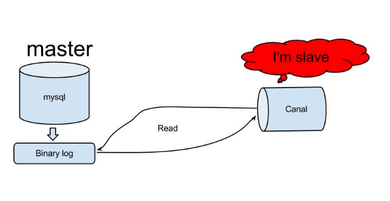
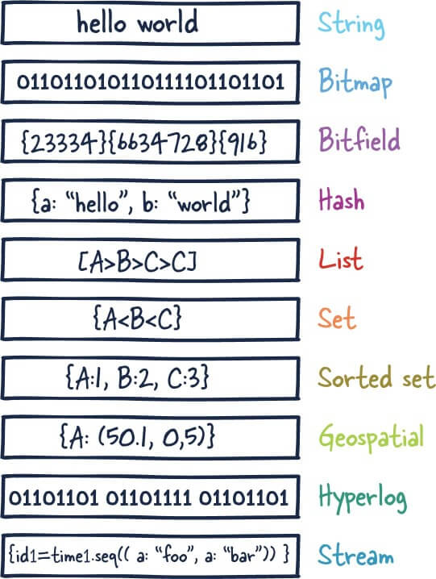
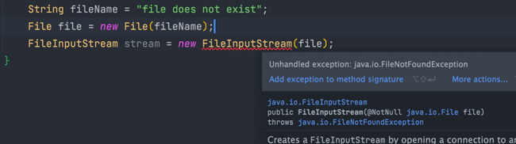
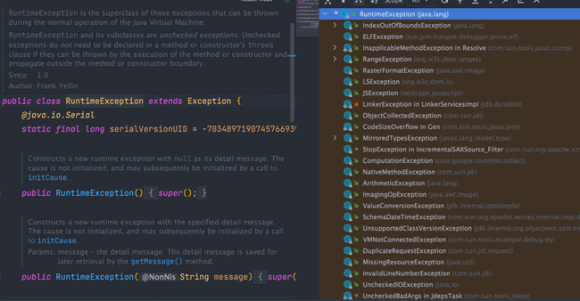

# 微策略校招面试，项目拷打用英文

Microstrategy 是全球最大独立上市的分析和商业智能公司，总部位于美国，在全球设有 5 个开发中心，其中，位于中国的研发中心在杭州，也是其最大的一个海外研发中心。

作为一家外企，Microstrategy 的工作强度非常友好，接近 955。并且，福利待遇也是没得说：六险一金，免费水果+下午茶，20 天年假，10 天带薪病假，办公室内设游戏室与健身。

一般来说，微策略的面试流程是：**笔试 + 技术二面 + 非技术二面**。

微策略的技术面试一般更多的是考察的项目，可能会穿插一些常见的八股，都是比较简单的。另外，会有手撕算法 / 编程题，可以用自己的 IDE，需要提前做好准备！

下面给大家分享一篇微策略校招的技术一面和二面的面经，整体问的不多，主要花费时间在手撕编程题上，大家感受一下难度如何。

## 自我介绍（英文）

面试外企，尽量还是提前准备一份自我介绍的英文版，背下来就好了，不然面试需要用英文介绍就手足无措了。

面试时的自我介绍，其实是你给面试官的“第一印象浓缩版”。它不需要面面俱到，但要精准、自信地展现你的核心价值和与岗位的匹配度。通常控制在 1-2 分钟内比较合适。一个好的自我介绍应该包含这几点要素：

1. 用简单的话说清楚自己主要的技术栈于擅长的领域，例如 Java 后端开发、分布式系统开发；
2. 把重点放在自己的优势上，重点突出自己的能力，最好能用一个简短的例子支撑，例如：我比较擅长定位和解决复杂问题。在\[某项目/实习]中，我曾通过\[简述方法，如日志分析、源码追踪、压力测试]成功解决了\[某个具体问题，如一个棘手的性能瓶颈/一个偶现的 Bug]，将\[某个指标]提升了\[百分比/具体数值]。
3. 简要提及 1-2 个最能体现你能力和与岗位要求匹配的项目经历、实习经历或竞赛成绩。不需要展开细节，目的是引出面试官后续的提问。
4. 如果时间允许，可以非常简短地表达对所申请岗位的兴趣和对公司的向往，表明你是有备而来。

## 项目经历（英文）

### 介绍自己的项目经历

作为求职者，我们可以从这些方案去准备项目经历的回答：

1. 你对项目基本情况（比如项目背景、核心功能）以及整体设计（比如技术栈、系统架构）的了解（面试官可能会让你画系统的架构图、让你讲解某个模块或功能的数据库表设计）
2. 你在这个项目中你担任了什么角色？负责了什么？有什么贡献？（具体说明你在项目中的职责和贡献）
3. 你在这个项目中是否解决过什么问题？怎么解决的？收获了什么？（展现解决问题的能力）
4. 你在这个项目用到了哪些技术？这些技术你吃透了没有？（举个例子，你的项目经历使用了 Seata 来做分布式事务，那 Seata 相关的问题你要提前准备一下吧，比如说 Seata 支持哪些配置中心、Seata 的事务分组是怎么做的、Seata 支持哪些事务模式，怎么选择？）
5. 你在这个项目中犯过的错误，最后是怎么弥补的？（承认不足并改进才能走的更远）
6. 从这个项目中你学会了那些东西？学会了那些新技术的使用？（总结你在这个项目中的收获）

### 这个项目你是如何进行拆分？

我们采用了领域驱动设计（DDD）的思想，结合业务边界进行了拆分。主要拆分为了用户中心（负责认证授权）、课程中心（课程管理与搜索）、媒资中心（视频上传与转码）、订单支付中心（处理支付与订阅）和通知中心（发送异步消息）等几个核心服务。

### Canal 同步 MySQL 数据到 Elasticsearch 的原理是？

Canal 的原理本质上是 **模拟了 MySQL 的主从复制协议** ：

1. **伪装成从库 (Slave)：** Canal Server 会向 MySQL Master 发送和标准 MySQL Slave 完全一样的握手包，将自己伪装成一个从库。
2. **订阅 Binlog：** MySQL Master 验证通过后，就会把它当成一个真正的从库。从 Canal 指定的位点（Position 或 GTID）开始，持续地、流式地把二进制日志（Binlog）推送给 Canal。Binlog 记录了数据库中所有的数据变更操作（INSERT, UPDATE, DELETE）。
3. **解析与投递：** Canal 接收到这些原始的二进制日志流后，会在内部进行解析，将它们转换成结构化的、易于消费的数据格式（比如 JSON）。最后，再将这些结构化的变更事件投递出去，通常是投递到像 Kafka 或 RocketMQ 这样的消息队列中，由下游的消费程序（比如我们的同步服务）订阅并写入到 Elasticsearch。



### 如果遇到数据不一致怎么办？

三层保障机制：

* **监控告警：** 监控 Canal 消费的位点（Position）是否延迟过大，并设置告警。
* **定期对账：** 开发一个了后台定时任务脚本，每天凌晨业务低峰期，对 MySQL 和 ES 中的核心数据进行抽样对账或总量对账。一旦发现不一致，就会记录详细的差异日志。
* **手动/自动修复：** 对于少量不一致，可以编写脚本手动修复。对于大量不一致，通常会选择在业务低峰期进行一次全量同步来覆盖修复。

### 视频转码用到了 XXL-Job，这里的阶段状态是如何保证最终一致性的？

1. 在数据库中为视频任务设计几个状态，例如：`UPLOADING` (上传中), `UPLOADED` (上传完成/待转码), `TRANSCODING` (转码中), `SUCCESS` (转码成功), `FAIL` (转码失败)。
2. XXL-Job 任务触发后，先将状态更新为 `TRANSCODING`。转码成功后，将结果（如不同码率的视频 URL）写回数据库，并将状态更新为 `SUCCESS`。
3. 如果转码过程中任务失败或服务器宕机，任务状态会停留在 `TRANSCODING`。
4. 我们有另一个 XXL-Job 补偿任务，定期扫描那些长时间处于 `TRANSCODING` 状态的任务，并进行重试或标记为 FAIL，从而保证了最终状态的正确性。

### 如果现在让你重新设计，有哪些地方你觉得可以做得更好？

这种就是开放性比较强的问题了，提前准备一下就好了！比较简单的一种回答方式还是从技术实现方案是否可以优化改进这个角度去谈。

## 八股

### 什么是 Redis？

[Redis](https://redis.io/) （**RE**mote **DI**ctionary **S**erver）是一个基于 C 语言开发的开源 NoSQL 数据库（BSD 许可）。与传统数据库不同的是，Redis 的数据是保存在内存中的（内存数据库，支持持久化），因此读写速度非常快，被广泛应用于分布式缓存方向。并且，Redis 存储的是 KV 键值对数据。

为了满足不同的业务场景，Redis 内置了多种数据类型实现（比如 String、Hash、Sorted Set、Bitmap、HyperLogLog、GEO）。并且，Redis 还支持事务、持久化、Lua 脚本、发布订阅模型、多种开箱即用的集群方案（Redis Sentinel、Redis Cluster）。



### NoSQL 数据库除了 Redis，还知道用过哪些？

MongoDB 是一个基于 **分布式文件存储** 的开源 NoSQL 数据库系统，由 **C++** 编写的。MongoDB 提供了 **面向文档** 的存储方式，操作起来比较简单和容易，支持“**无模式**”的数据建模，可以存储比较复杂的数据类型，是一款非常流行的 **文档类型数据库** 。

在高负载的情况下，MongoDB 天然支持水平扩展和高可用，可以很方便地添加更多的节点/实例，以保证服务性能和可用性。在许多场景下，MongoDB 可以用于代替传统的关系型数据库或键/值存储方式，皆在为 Web 应用提供可扩展的高可用高性能数据存储解决方案。

**MongoDB 的优势在于其数据模型和存储引擎的灵活性、架构的可扩展性以及对强大的索引支持。**

选用 MongoDB 应该充分考虑 MongoDB 的优势，结合实际项目的需求来决定：

* 随着项目的发展，使用类 JSON 格式（BSON）保存数据是否满足项目需求？MongoDB 中的记录就是一个 BSON 文档，它是由键值对组成的数据结构，类似于 JSON 对象，是 MongoDB 中的基本数据单元。
* 是否需要大数据量的存储？是否需要快速水平扩展？MongoDB 支持分片集群，可以很方便地添加更多的节点（实例），让集群存储更多的数据，具备更强的性能。
* 是否需要更多类型索引来满足更多应用场景？MongoDB 支持多种类型的索引，包括单字段索引、复合索引、多键索引、哈希索引、文本索引、 地理位置索引等，每种类型的索引有不同的使用场合。
* ……

### SQL 注入攻击

SQL 注入是一种非常常见且危害巨大的代码注入攻击。它的本质是，**应用程序在拼接 SQL 语句时，错误地将用户的输入数据当作了 SQL 代码的一部分来执行**，从而让攻击者有机会篡改原始的 SQL 逻辑。

**我来举一个最经典的登录绕过攻击的例子：**

假设我们有一个登录验证的 SQL，是通过字符串拼接实现的：

```sql
String sql = "SELECT * FROM users WHERE username = '" + username + "' AND password = '" + password + "'";
```

正常情况下，用户输入用户名"admin"和密码"123456"，拼接后的 SQL 是：

```sql
SELECT * FROM users WHERE username = 'admin' AND password = '123456'

```

这没有问题。但如果一个攻击者在用户名输入框里输入了 admin' -- （注意--后面有个空格），密码随便输。那么拼接后的 SQL 就变成了：

```sql
SELECT * FROM users WHERE username = 'admin' -- ' AND password = '...irrelevant...'
```

在 SQL 中，-- 是注释符，它会把后面的所有内容都注释掉。

这样，密码验证就被完全绕过了，攻击者成功实现了无密码登录。这就是一次典型的 SQL 注入攻击。

**如何防御 SQL 注入呢？**

最根本、最有效的防御手段就是**使用预编译语句（Prepared Statements）**，比如 Java 中的 `PreparedStatement` 或者 MyBatis 中的 `#{}` 占位符。它的原理很简单，就是将代码和数据分离：它会先把 SQL 的“语法骨架”发给数据库编译好，然后再把用户输入作为“纯数据”传过去。

除了预编译，我们还应该遵循一些辅助的安全原则，比如对用户输入进行合法性校验（比如校验邮箱格式、手机号格式等）。

关于数据校验可以参考笔者写的这篇文章：[为什么前后端都要做数据校验](https://javaguide.cn/system-design/security/data-validation.html)。

### Checked Exception 和 Unchecked Exception 有什么区别？

**Checked Exception** 即 受检查异常 ，Java 代码在编译过程中，如果受检查异常没有被 `catch`或者`throws` 关键字处理的话，就没办法通过编译。

比如下面这段 IO 操作的代码：



除了`RuntimeException`及其子类以外，其他的`Exception`类及其子类都属于受检查异常 。常见的受检查异常有：IO 相关的异常、`ClassNotFoundException`、`SQLException`...。

**Unchecked Exception** 即 **不受检查异常** ，Java 代码在编译过程中 ，我们即使不处理不受检查异常也可以正常通过编译。

`RuntimeException` 及其子类都统称为非受检查异常，常见的有（建议记下来，日常开发中会经常用到）：

* `NullPointerException`(空指针错误)
* `IllegalArgumentException`(参数错误比如方法入参类型错误)
* `NumberFormatException`（字符串转换为数字格式错误，`IllegalArgumentException`的子类）
* `ArrayIndexOutOfBoundsException`（数组越界错误）
* `ClassCastException`（类型转换错误）
* `ArithmeticException`（算术错误）
* `SecurityException` （安全错误比如权限不够）
* `UnsupportedOperationException`(不支持的操作错误比如重复创建同一用户)
* ……



### 面向对象三大特征

#### 封装

封装是指把一个对象的状态信息（也就是属性）隐藏在对象内部，不允许外部对象直接访问对象的内部信息。但是可以提供一些可以被外界访问的方法来操作属性。就好像我们看不到挂在墙上的空调的内部的零件信息（也就是属性），但是可以通过遥控器（方法）来控制空调。如果属性不想被外界访问，我们大可不必提供方法给外界访问。但是如果一个类没有提供给外界访问的方法，那么这个类也没有什么意义了。就好像如果没有空调遥控器，那么我们就无法操控空凋制冷，空调本身就没有意义了（当然现在还有很多其他方法 ，这里只是为了举例子）。

```java
public class Student {
    private int id;//id属性私有化
    private String name;//name属性私有化

    //获取id的方法
    public int getId() {
        return id;
    }

    //设置id的方法
    public void setId(int id) {
        this.id = id;
    }

    //获取name的方法
    public String getName() {
        return name;
    }

    //设置name的方法
    public void setName(String name) {
        this.name = name;
    }
}
```

#### 继承

不同类型的对象，相互之间经常有一定数量的共同点。例如，小明同学、小红同学、小李同学，都共享学生的特性（班级、学号等）。同时，每一个对象还定义了额外的特性使得他们与众不同。例如小明的数学比较好，小红的性格惹人喜爱；小李的力气比较大。继承是使用已存在的类的定义作为基础建立新类的技术，新类的定义可以增加新的数据或新的功能，也可以用父类的功能，但不能选择性地继承父类。通过使用继承，可以快速地创建新的类，可以提高代码的重用，程序的可维护性，节省大量创建新类的时间 ，提高我们的开发效率。

**关于继承如下 3 点请记住：**

1. 子类拥有父类对象所有的属性和方法（包括私有属性和私有方法），但是父类中的私有属性和方法子类是无法访问，**只是拥有**。
2. 子类可以拥有自己属性和方法，即子类可以对父类进行扩展。
3. 子类可以用自己的方式实现父类的方法。（以后介绍）。

#### 多态

多态，顾名思义，表示一个对象具有多种的状态，具体表现为父类的引用指向子类的实例。

**多态的特点:**

* 对象类型和引用类型之间具有继承（类）/实现（接口）的关系；
* 引用类型变量发出的方法调用的到底是哪个类中的方法，必须在程序运行期间才能确定；
* 多态不能调用“只在子类存在但在父类不存在”的方法；
* 如果子类重写了父类的方法，真正执行的是子类重写的方法，如果子类没有重写父类的方法，执行的是父类的方法。

## IDE 手撕

1. 二叉树中序遍历，递归和非递归
2. 在树上执行操作以后得到的最大分数

## 智力题

### 赛马问题

**问题** ： 有 25 匹马和 5 条赛道，赛马过程无法进行计时，只能知道相对快慢。问最少需要几场赛马可以知道前 3 名?

**解答** ： 先把 25 匹马分成 5 组，进行 5 场赛马，得到每组的排名。

再将每组的第 1 名选出，进行 1 场赛马，按照这场的排名将 5 组先后标为 A、B、C、D、E。

可以知道，A 组的第 1 名就是所有 25 匹马的第 1 名。而第 2、3 名只可能在 A 组的 2、3 名，B 组的第 1、2 名，和 C 组的第 1 名，总共 5 匹马。

让这 5 匹马再进行 1 场赛马，前两名就是第 2、3 名。所以总共是 5+1+1=7 场赛马。

```plain
A 组：1，2，3，4，5
B 组：1，2，3，4，5
C 组：1，2，3，4，5
D 组：1，2，3，4，5
E 组：1，2，3，4，5
```

### 分金条问题

**问题** ： 你让工人为你工作 7 天，回报是一根金条，这个金条平分成相连的 7 段，你必须在每天结束的时候给他们一段金条。如果只允许你两次把金条弄断，你如何给你的工人付费？

**解答** ： 切两刀，分为 1/7、2/7、4/7 三段。

1. 第一天给 1/7；
2. 第二天给 2/7，要回 1/7；
3. 第三天给 1/7 ；
4. 第四天给 4/7 要回 1/7 + 2/7；
5. 第五天给 1/7；
6. 第六天给 2/7，要回 1/7；
7. 第七天给 1/7

感谢能看到这里，希望 JavaGuide 的读者都能找到一家舒服福利也不错的公司！


> 更新: 2025-10-29 17:46:33  
> 原文: <https://www.yuque.com/snailclimb/mf2z3k/yp9n7kyth1dexmg8>