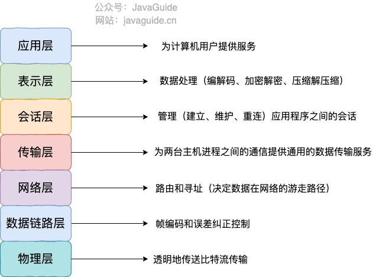
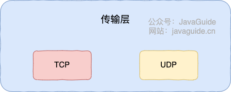
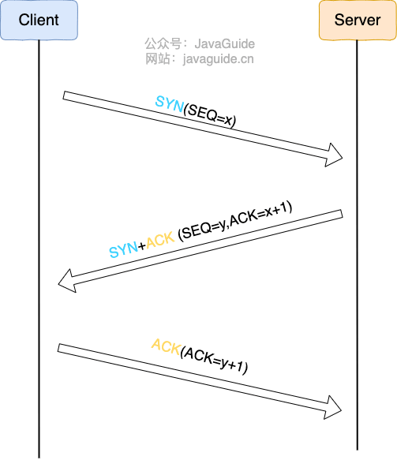
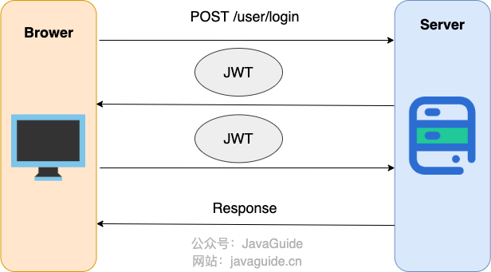
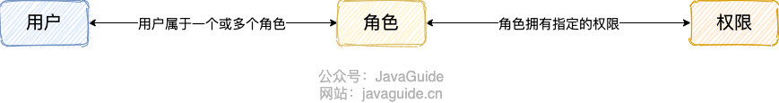
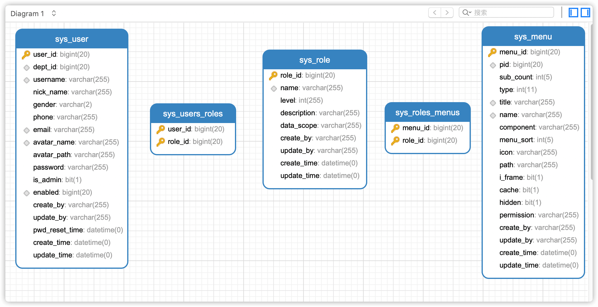
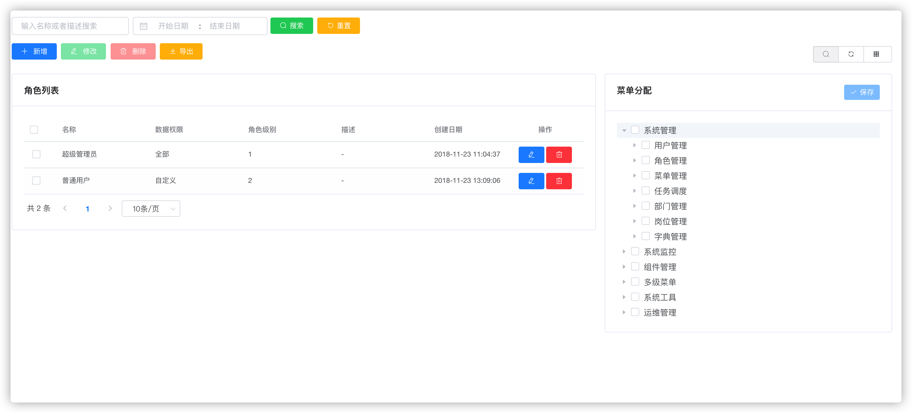
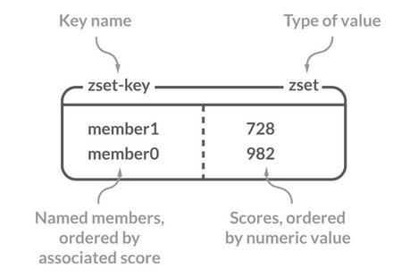

# 虾皮校招面试，速通！

Shopee 是东南亚电商巨头，中国的研发部门主要在深圳。作为一家外企，虾皮的福利待遇还是很不错的，公积金10%，全年15天年假，14天全薪病假，针对新员工有培训和发展体系。

不过，还是尽量不要把虾皮当做传统的外企看，很多部门也卷得很，被很多人戏称为“假外企”。而且，前几年确实存在裁员的情况，包括应届生，尤其是2023届，这两年稍微好一些。

如果对自己能力比较有信心，也愿意承担一定的裁员风险（补偿一般还行）的话，虾皮还是非常值得去的！那虾皮的面试难度怎么样呢？

相比较于互联网大厂来说，虾皮的面试整体还是要简单一些的。虾皮一般技术二面+HR 面，通过之后就开始谈意向。技术一面通常主要考察常见的技术八股，例如数据库、缓存、网络、操作系统，技术二面通常主要考察实习经历/项目经历。

下面给大家分享一篇虾皮今年秋招的后端面经。我精选了一二面中的一些比较典型的面试问题进行解答， 大家可以感受一下虾皮的面试难度如何。

## 一面

### 网络分层的模型

**OSI 七层模型** 是国际标准化组织提出的一个网络分层模型，其大体结构以及每一层提供的功能如下图所示：



每一层都专注做一件事情，并且每一层都需要使用下一层提供的功能比如传输层需要使用网络层提供的路由和寻址功能，这样传输层才知道把数据传输到哪里去。

**TCP/IP 四层模型** 是目前被广泛采用的一种模型,我们可以将 TCP / IP 模型看作是 OSI 七层模型的精简版本，由以下 4 层组成：

1. 应用层
2. 传输层
3. 网络层
4. 网络接口层

需要注意的是，我们并不能将 TCP/IP 四层模型 和 OSI 七层模型完全精确地匹配起来，不过可以简单将两者对应起来，如下图所示：


关于每一层作用的详细介绍，请看 [OSI 和 TCP/IP 网络分层模型详解（基础）](https://javaguide.cn/cs-basics/network/osi-and-tcp-ip-model.html) 这篇文章。

### 传输层有哪些常见的协议？



* **TCP（Transmission Control Protocol，传输控制协议 ）**：提供 **面向连接** 的，**可靠** 的数据传输服务。
* **UDP（User Datagram Protocol，用户数据协议）**：提供 **无连接** 的，**尽最大努力** 的数据传输服务（不保证数据传输的可靠性），简单高效。

### TCP 连接建立过程



建立一个 TCP 连接需要“三次握手”，缺一不可：

1. **第一次握手 (SYN)**: 客户端向服务端发送一个 SYN（Synchronize Sequence Numbers）报文段，其中包含一个由客户端随机生成的初始序列号（Initial Sequence Number, ISN），例如 seq=x。发送后，客户端进入 **SYN\_SEND** 状态，等待服务端的确认。
2. **第二次握手 (SYN+ACK)**: 服务端收到 SYN 报文段后，如果同意建立连接，会向客户端回复一个确认报文段。该报文段包含两个关键信息：
   * **SYN**：服务端也需要同步自己的初始序列号，因此报文段中也包含一个由服务端随机生成的初始序列号，例如 seq=y。
   * **ACK** (Acknowledgement)：用于确认收到了客户端的请求。其确认号被设置为客户端初始序列号加一，即 ack=x+1。
   * 发送该报文段后，服务端进入 **SYN\_RECV** 状态。
3. **第三次握手 (ACK)**: 客户端收到服务端的 SYN+ACK 报文段后，会向服务端发送一个最终的确认报文段。该报文段包含确认号 ack=y+1。发送后，客户端进入 **ESTABLISHED** 状态。服务端收到这个 ACK 报文段后，也进入 **ESTABLISHED** 状态。

至此，双方都确认了连接的建立，TCP 连接成功创建，可以开始进行双向数据传输。

### TPC 建立连接为什么要三次握手?

TCP 三次握手的核心目的是为了在客户端和服务器之间建立一个**可靠的**、**全双工的**通信信道。这需要实现两个主要目标：

**1. 确认双方的收发能力，并同步初始序列号 (ISN)**

TCP 通信依赖序列号来保证数据的有序和可靠。三次握手是双方交换和确认彼此初始序列号（ISN）的过程，通过这个过程，双方也间接验证了各自的收发能力。

* **第一次握手 (客户端 → 服务器)** ：客户端发送 SYN 包。
  * 服务器：能确认客户端的发送能力正常，自己的接收能力正常。
  * 客户端：无法确认任何事。
* **第二次握手 (服务器 → 客户端)** ：服务器回复 SYN+ACK 包。
  * 客户端：能确认自己的发送和接收能力正常，服务器的接收和发送能力正常。
  * 服务端：能确认对方发送能力正常，自己接收能力正常
* **第三次握手 (客户端 → 服务器)** ：客户端发送 ACK 包。
  * 客户端：能确认双方发送和接收能力正常。
  * 服务端：能确认双方发送和接收能力正常。

经过这三次交互，双方都确认了彼此的收发功能完好，并完成了初始序列号的同步，为后续可靠的数据传输奠定了基础。

**2. 防止已失效的连接请求被错误地建立**

这是“为什么不能是两次握手”的关键原因。

设想一个场景：客户端发送的第一个连接请求（SYN1）因网络延迟而滞留，于是客户端重发了第二个请求（SYN2）并成功建立了连接，数据传输完毕后连接被释放。此时，延迟的 SYN1 才到达服务端。

* **如果是两次握手**：服务端收到这个失效的 SYN1 后，会误认为是一个新的连接请求，并立即分配资源、建立连接。但这将导致服务端单方面维持一个无效连接，白白浪费系统资源，因为客户端并不会有任何响应。
* **有了第三次握手**：服务端收到失效的 SYN1 并回复 SYN+ACK 后，会等待客户端的最终确认（ACK）。由于客户端当前并没有发起连接的意图，它会忽略这个 SYN+ACK 或者发送一个 RST (Reset) 报文。这样，服务端就无法收到第三次握手的 ACK，最终会超时关闭这个错误的连接，从而避免了资源浪费。

因此，三次握手是确保 TCP 连接可靠性的**最小且必需**的步骤。它不仅确认了双方的通信能力，更重要的是增加了一个最终确认环节，以防止网络中延迟、重复的历史请求对连接建立造成干扰。

### HTTP 与 HTTPS 运行在哪一层？区别是？

HTTP 与 HTTPS 运行在应用层，这一层的协议还有SMTP（Simple Mail Transfer Protocol，简单邮件发送协议）、POP3/IMAP（邮件接收协议）、FTP（File Transfer Protocol，文件传输协议）、Telnet（远程登陆协议）、SSH（Secure Shell Protocol，安全的网络传输协议）等等。

**HTTP 与 HTTPS 的区别如下**：


* **端口号**：HTTP 默认是 80，HTTPS 默认是 443。
* **URL 前缀**：HTTP 的 URL 前缀是 `http://`，HTTPS 的 URL 前缀是 `https://`。
* **安全性和资源消耗**：HTTP 协议运行在 TCP 之上，所有传输的内容都是明文，客户端和服务器端都无法验证对方的身份。HTTPS 是运行在 SSL/TLS 之上的 HTTP 协议，SSL/TLS 运行在 TCP 之上。所有传输的内容都经过加密，加密采用对称加密，但对称加密的密钥用服务器方的证书进行了非对称加密。所以说，HTTP 安全性没有 HTTPS 高，但是 HTTPS 比 HTTP 耗费更多服务器资源。
* **SEO（搜索引擎优化）**：搜索引擎通常会更青睐使用 HTTPS 协议的网站，因为 HTTPS 能够提供更高的安全性和用户隐私保护。使用 HTTPS 协议的网站在搜索结果中可能会被优先显示，从而对 SEO 产生影响。

关于 HTTP 和 HTTPS 更详细的对比总结，可以看我写的这篇文章：[HTTP vs HTTPS（应用层）](https://javaguide.cn/cs-basics/network/http-vs-https.html) 。

### 浏览器输入 URL 过程

先来看一张图（来源于《图解 HTTP》）：


上图有一个错误需要注意：是 OSPF 不是 OPSF。 OSPF（Open Shortest Path First，ospf）开放最短路径优先协议, 是由 Internet 工程任务组开发的路由选择协议

总体来说分为以下几个步骤:

1. 在浏览器中输入指定网页的 URL。
2. 浏览器通过 DNS 协议，获取域名对应的 IP 地址。
3. 浏览器根据 IP 地址和端口号，向目标服务器发起一个 TCP 连接请求。
4. 浏览器在 TCP 连接上，向服务器发送一个 HTTP 请求报文，请求获取网页的内容。
5. 服务器收到 HTTP 请求报文后，处理请求，并返回 HTTP 响应报文给浏览器。
6. 浏览器收到 HTTP 响应报文后，解析响应体中的 HTML 代码，渲染网页的结构和样式，同时根据 HTML 中的其他资源的 URL（如图片、CSS、JS 等），再次发起 HTTP 请求，获取这些资源的内容，直到网页完全加载显示。
7. 浏览器在不需要和服务器通信时，可以主动关闭 TCP 连接，或者等待服务器的关闭请求。

详细介绍可以查看这篇文章：[访问网页的全过程（知识串联）](https://javaguide.cn/cs-basics/network/the-whole-process-of-accessing-web-pages.html)（强烈推荐）。

### MySQL 事务隔离级别？每个级别解决了什么问题？

SQL 标准定义了四种事务隔离级别，用来平衡事务的隔离性（Isolation）和并发性能。级别越高，数据一致性越好，但并发性能可能越低。这四个级别是：

* **READ-UNCOMMITTED(读取未提交)** ：最低的隔离级别，允许读取尚未提交的数据变更，可能会导致脏读、幻读或不可重复读。这种级别在实际应用中很少使用，因为它对数据一致性的保证太弱。
* **READ-COMMITTED(读取已提交)** ：允许读取并发事务已经提交的数据，可以阻止脏读，但是幻读或不可重复读仍有可能发生。这是大多数数据库（如 Oracle, SQL Server）的默认隔离级别。
* **REPEATABLE-READ(可重复读)** ：对同一字段的多次读取结果都是一致的，除非数据是被本身事务自己所修改，可以阻止脏读和不可重复读，但幻读仍有可能发生。MySQL InnoDB 存储引擎的默认隔离级别正是 REPEATABLE READ。并且，InnoDB 在此级别下通过 MVCC（多版本并发控制） 和 Next-Key Locks（间隙锁+行锁） 机制，在很大程度上解决了幻读问题。
* **SERIALIZABLE(可串行化)** ：最高的隔离级别，完全服从 ACID 的隔离级别。所有的事务依次逐个执行，这样事务之间就完全不可能产生干扰，也就是说，该级别可以防止脏读、不可重复读以及幻读。

| 隔离级别 | 脏读 (Dirty Read) | 不可重复读 (Non-Repeatable Read) | 幻读 (Phantom Read) |
| --- | --- | --- | --- |
| READ UNCOMMITTED | √ | √ | √ |
| READ COMMITTED | × | √ | √ |
| REPEATABLE READ | × | × | √ (标准) / ≈× (InnoDB) |
| SERIALIZABLE | × | × | × |

MySQL InnoDB 存储引擎的默认隔离级别是 **REPEATABLE READ**。

标准的 SQL 隔离级别定义里，REPEATABLE READ 是无法防止幻读的。但 InnoDB 的实现通过以下机制很大程度上避免了幻读：

* **快照读 (Snapshot Read)**:普通的 SELECT 语句，通过 **MVCC** 机制实现。事务启动时创建一个数据快照，后续的快照读都读取这个版本的数据，从而避免了看到其他事务新插入的行（幻读）或修改的行（不可重复读）。
* **当前读 (Current Read)**:像 `SELECT ... FOR UPDATE`, `SELECT ... LOCK IN SHARE MODE`, `INSERT`, `UPDATE`, `DELETE` 这些操作。InnoDB 使用 **Next-Key Lock** 来锁定扫描到的索引记录及其间的范围（间隙），防止其他事务在这个范围内插入新的记录，从而避免幻读。Next-Key Lock 是行锁（Record Lock）和间隙锁（Gap Lock）的组合。

值得注意的是，虽然通常认为隔离级别越高、并发性越差，但 InnoDB 存储引擎通过 MVCC 机制优化了 REPEATABLE READ 级别。对于许多常见的只读或读多写少的场景，其性能**与 READ COMMITTED 相比可能没有显著差异**。不过，在写密集型且并发冲突较高的场景下，RR 的间隙锁机制可能会比 RC 带来更多的锁等待。

此外，在某些特定场景下，如需要严格一致性的分布式事务（XA Transactions），InnoDB 可能要求或推荐使用 SERIALIZABLE 隔离级别来确保全局数据的一致性。

### 主键和外键有什么区别?

从定义和属性上看，它们的区别是：

* **主键 (Primary Key):** 它的核心作用是唯一标识表中的每一行数据。因此，主键列的值必须是唯一的 (Unique) 且不能为空 (Not Null)。一张表只能有一个主键。主键保证了实体完整性。
* **外键 (Foreign Key):** 它的核心作用是建立并强制两张表之间的关联关系。一张表中的外键列，其值必须对应另一张表中某行的主键值（或者是一个 NULL 值）。因此，外键的值可以重复，也可以为空。一张表可以有多个外键，分别关联到不同的表。外键保证了引用完整性。

用一个简单的电商例子来说明：假设我们有两张表：`users` (用户表) 和 `orders` (订单表)。

* 在 `users` 表中，`user_id` 列是**主键**。每个用户的 `user_id` 都是独一无二的，我们用它来区分张三和李四。
* 在 `orders` 表中，`order_id` 是它自己的**主键**。同时，它会有一个 `user_id` 列，这个列就是一个**外键**，它引用了 `users` 表的 `user_id` 主键。

这个外键约束就保证了：

1. 你不能创建一个不属于任何已知用户的订单（ `user_id` 在 `users` 表中不存在）。
2. 你不能删除一个已经下了订单的用户（除非设置了级联删除等特殊规则）。

### 为什么实际项目里建议不用外键

对于外键和级联，阿里巴巴开发手册这样说到：

> 【强制】不得使用外键与级联，一切外键概念必须在应用层解决。
>
> 说明: 以学生和成绩的关系为例，学生表中的 student\_id 是主键，那么成绩表中的 student\_id 则为外键。如果更新学生表中的 student\_id，同时触发成绩表中的 student\_id 更新，即为级联更新。外键与级联更新适用于单机低并发，不适合分布式、高并发集群；级联更新是强阻塞，存在数据库更新风暴的风险；外键影响数据库的插入速度

为什么不要用外键呢？大部分人可能会这样回答：

1. **增加了复杂性：** a. 每次做 DELETE 或者 UPDATE 都必须考虑外键约束，会导致开发的时候很痛苦, 测试数据极为不方便; b. 外键的主从关系是定的，假如哪天需求有变化，数据库中的这个字段根本不需要和其他表有关联的话就会增加很多麻烦。
2. **增加了额外工作**：数据库需要增加维护外键的工作，比如当我们做一些涉及外键字段的增，删，更新操作之后，需要触发相关操作去检查，保证数据的的一致性和正确性，这样会不得不消耗数据库资源。如果在应用层面去维护的话，可以减小数据库压力；
3. **对分库分表不友好**：因为分库分表下外键是无法生效的。
4. ……

我个人觉得上面这种回答不是特别的全面，只是说了外键存在的一个常见的问题。实际上，我们知道外键也是有很多好处的，比如：

1. 保证了数据库数据的一致性和完整性；
2. 级联操作方便，减轻了程序代码量；
3. ……

所以说，不要一股脑的就抛弃了外键这个概念，既然它存在就有它存在的道理，如果系统不涉及分库分表，并发量不是很高的情况还是可以考虑使用外键的。

### 数据库慢查询如何优化

为了优化慢 SQL ，我们首先要找到哪些 SQL 语句执行速度比较慢。

MySQL 慢查询日志是用来记录 MySQL 在执行命令中，响应时间超过预设阈值的 SQL 语句。因此，通过分析慢查询日志我们就可以找出执行速度比较慢的 SQL 语句。

出于性能层面的考虑，慢查询日志功能默认是关闭的，你可以通过以下命令开启：

```sql
# 开启慢查询日志功能
SET GLOBAL slow_query_log = 'ON';
# 慢查询日志存放位置
SET GLOBAL slow_query_log_file = '/var/lib/mysql/ranking-list-slow.log';
# 无论是否超时，未被索引的记录也会记录下来。
SET GLOBAL log_queries_not_using_indexes = 'ON';
# 慢查询阈值（秒），SQL 执行超过这个阈值将被记录在日志中。
SET SESSION long_query_time = 1;
# 慢查询仅记录扫描行数大于此参数的 SQL
SET SESSION min_examined_row_limit = 100;
```

设置成功之后，使用 `show variables like 'slow%';` 命令进行查看。

```bash
| Variable_name       | Value                                |
+---------------------+--------------------------------------+
| slow_launch_time    | 2                                    |
| slow_query_log      | ON                                   |
| slow_query_log_file | /var/lib/mysql/ranking-list-slow.log |
+---------------------+--------------------------------------+
3 rows in set (0.01 sec)
```

我们故意在百万数据量的表(未使用索引)中执行一条排序的语句：

```sql
SELECT `score`,`name` FROM `cus_order` ORDER BY `score` DESC;
```

确保自己有对应目录的访问权限：

```bash
chmod 755 /var/lib/mysql/
```

查看对应的慢查询日志：

```bash
 cat /var/lib/mysql/ranking-list-slow.log
```

我们刚刚故意执行的 SQL 语句已经被慢查询日志记录了下来：

```plain
# Time: 2022-10-09T08:55:37.486797Z
# User@Host: root[root] @  [172.17.0.1]  Id:    14
# Query_time: 0.978054  Lock_time: 0.000164 Rows_sent: 999999  Rows_examined: 1999998
SET timestamp=1665305736;
SELECT `score`,`name` FROM `cus_order` ORDER BY `score` DESC;
```

这里对日志中的一些信息进行说明：

* `Time` ：被日志记录的代码在服务器上的运行时间。
* `User@Host`：谁执行的这段代码。
* `Query_time`：这段代码运行时长。
* `Lock_time`：执行这段代码时，锁定了多久。
* `Rows_sent`：慢查询返回的记录。
* `Rows_examined`：慢查询扫描过的行数。

实际项目中，慢查询日志通常会比较复杂，我们需要借助一些工具对其进行分析。像 MySQL 内置的 `mysqldumpslow` 工具就可以把相同的 SQL 归为一类，并统计出归类项的执行次数和每次执行的耗时等一系列对应的情况。

找到了慢 SQL 之后，我们可以通过 `EXPLAIN` 命令分析对应的 `SELECT` 语句：

```sql
mysql> EXPLAIN SELECT `score`,`name` FROM `cus_order` ORDER BY `score` DESC;
+----+-------------+-----------+------------+------+---------------+------+---------+------+--------+----------+----------------+
| id | select_type | table     | partitions | type | possible_keys | key  | key_len | ref  | rows   | filtered | Extra          |
+----+-------------+-----------+------------+------+---------------+------+---------+------+--------+----------+----------------+
|  1 | SIMPLE      | cus_order | NULL       | ALL  | NULL          | NULL | NULL    | NULL | 997572 |   100.00 | Using filesort |
+----+-------------+-----------+------------+------+---------------+------+---------+------+--------+----------+----------------+
1 row in set, 1 warning (0.00 sec)
```

比较重要的字段说明：

* `select_type` ：查询的类型，常用的取值有 SIMPLE（普通查询，即没有联合查询、子查询）、PRIMARY（主查询）、UNION（UNION 中后面的查询）、SUBQUERY（子查询）等。
* `table` ：表示查询涉及的表或衍生表。
* `type` ：执行方式，判断查询是否高效的重要参考指标，结果值从差到好依次是：ALL < index < range ~ index\_merge < ref < eq\_ref < const < system。
* `rows` : SQL 要查找到结果集需要扫描读取的数据行数，原则上 rows 越少越好。
* ......

## 二面

### 介绍一下你比较熟悉的项目

建议优先把你觉得最好的项目放在首位，重点去准备这个项目。

作为求职者，我们可以从下面这些方面去准备项目经历的回答：

1. **梳理项目全貌**：
   * **一句话概括项目**：用简洁的语言说清楚这个项目是做什么的（核心业务/目标）以及为什么要做（项目背景、要解决什么痛点）。
   * **核心功能与亮点**：介绍项目的主要功能模块，特别是那些技术含量高或业务价值大的部分。
   * **技术架构与选型**：能清晰地说明项目的整体技术架构（比如是微服务、单体？用了哪些中间件？），并解释为什么选择这些技术（技术选型的考量）。准备好可能被要求画简要架构图或解释关键模块设计。
2. **明确你的角色与贡献**：
   * **你的角色**：清楚说明你在项目中担任的角色（比如核心开发者、模块负责人、项目经理等）。
   * **具体职责**：你具体负责了哪些模块或任务？
   * **关键贡献（重中之重！）**：用 STAR 法则 (Situation, Task, Action, Result) 来准备几个实际案例。重点突出你通过具体行动取得了可量化的成果或解决了关键问题，一定要具体场景，而非罗列技术。例如，“负责优化 XX 接口，通过 A、B、C 措施，将响应时间从 X 降低到 Y，提升了 Z% 的用户体验”。
3. **准备解决问题的亮点案例**：
   * **挖掘挑战**：回忆项目中遇到的最棘手的技术难题、性能瓶颈、或者复杂的业务逻辑实现。这个在面试中很可能会问到，例如面试官会问你：“面试中遇到了什么困难？如何解决的？”。
   * **展现思路**：详细说明你是如何分析问题（用了什么工具？怎么定位的？）、思考解决方案（考虑了哪些方案？为什么选择最终方案？）、最终如何解决的，以及结果如何。
   * **提炼收获**：从解决这个问题的过程中，你学到了什么？技术上有什么成长？或者对业务有了更深的理解？
4. **深入理解关键技术**：吃透你在这个项目中用到的技术（举个例子，你的项目经历使用了 Seata 来做分布式事务，那 Seata 相关的问题你要提前准备一下吧，比如说 Seata 支持哪些配置中心、Seata 的事务分组是怎么做的、Seata 支持哪些事务模式，怎么选择？）。

### 登录鉴权怎么做的？

实际项目中，登录鉴权比较常用的方案是：**基于 SpringSecurity + JWT 实现了登录认证，权限模型使用业界主流的 RBAC。**

JWT （JSON Web Token） 是目前最流行的跨域认证解决方案，是一种基于 Token 的认证授权机制。 从 JWT 的全称可以看出，JWT 本身也是 Token，一种规范化之后的 JSON 结构的 Token。这个方案不一定是最好的，它本身其实存在挺多缺陷。可能是网上的教程的原因，导致这个方案在校招生简历中出现的非常频繁。

在基于 JWT 进行身份验证的的应用程序中，服务器通过 Payload、Header 和 Secret(密钥)创建 JWT 并将 JWT 发送给客户端。客户端接收到 JWT 之后，会将其保存在 Cookie 或者 localStorage 里面，以后客户端发出的所有请求都会携带这个令牌。



简化后的步骤如下：

1. 用户向服务器发送用户名、密码以及验证码用于登陆系统；
2. 如果用户用户名、密码以及验证码校验正确的话，服务端会返回已经签名的 Token，也就是 JWT；
3. 客户端收到 Token 后自己保存起来（比如浏览器的 `localStorage` ）；
4. 用户以后每次向后端发请求都在 Header 中带上这个 JWT ；
5. 服务端检查 JWT 并从中获取用户相关信息。

两点建议：

1. 建议将 JWT 存放在 localStorage 中，放在 Cookie 中会有 CSRF 风险。
2. 请求服务端并携带 JWT 的常见做法是将其放在 HTTP Header 的 `Authorization` 字段中（`Authorization: Bearer Token`）。

系统权限控制最常采用的访问控制模型就是 **RBAC 模型** 。

**什么是 RBAC 呢？** RBAC 即基于角色的权限访问控制（Role-Based Access Control）。这是一种通过角色关联权限，角色同时又关联用户的授权的方式。

简单地说：一个用户可以拥有若干角色，每一个角色又可以被分配若干权限，这样就构造成“用户-角色-权限” 的授权模型。在这种模型中，用户与角色、角色与权限之间构成了多对多的关系。



在 RBAC 权限模型中，权限与角色相关联，用户通过成为包含特定角色的成员而得到这些角色的权限，这就极大地简化了权限的管理。

为了实现 RBAC 权限模型，数据库表的常见设计如下（一共 5 张表，2 张用户建立表之间的联系）：



通过这个权限模型，我们可以创建不同的角色并为不同的角色分配不同的权限范围（菜单）。



通常来说，如果系统对于权限控制要求比较严格的话，一般都会选择使用 RBAC 模型来做权限控制。

### 为什么用 JWT？

JWT 相较于 Session 认证，主要有以下优势：

1. **无状态：** 服务端无需存储 Session 信息，减轻服务器压力，提高可用性和伸缩性。但也因此存在 JWT 失效不可控的缺点，需要额外处理。
2. **防 CSRF 攻击：** JWT 通常存储在 localStorage 中，不依赖 Cookie，避免了 CSRF 攻击。但需注意 XSS 攻击风险，可通过过滤可疑字符串等方式防范。
3. **适合移动端：** JWT 可被客户端存储，且可跨语言使用，解决了 Session 认证在移动端状态管理、兼容性和安全性上的问题。
4. **单点登录友好：** JWT 保存在客户端，避免了 Session 认证中 Cookie 跨域等问题，更易实现单点登录。

推荐阅读：[你为什么选择 JWT 做身份验证？有什么问题需要考虑？](https://mp.weixin.qq.com/s/4mS34Aq4n0drLUtLsAv_SA)

### 排行榜是怎么做的？为什么用 zset？

可以基于 Redis 的 Sorted Set（有序集合）数据类型来维护排行榜，使用 SpringTask/XXL-JOB 实现排行榜的定时维护更新。尽量支持当天、最近七天、最近一个月多个维度的热度分析。

**为什么用 zset？**

zset 是 Redis 的有序集合实现，全称是 Sorted Set 。Sorted Set 类似于 Set，但和 Set 相比，Sorted Set 增加了一个权重参数 `score`，使得集合中的元素能够按 `score` 进行有序排列，还可以通过 `score` 的范围来获取元素的列表。有点像是 Java 中 `HashMap` 和 `TreeSet` 的结合体。不过，从底层实现来看，更像是 `ConcurrentSkipListMap`，两者底层都用到了跳表，且都支持并发访问。



Sorted Set 应用场景：

* 需要随机获取数据源中的元素根据某个权重进行排序的场景。例如，各种排行榜比如直播间送礼物的排行榜、朋友圈的微信步数排行榜、王者荣耀中的段位排行榜、话题热度排行榜等等。
* 需要存储的数据有优先级或者重要程度的场景，比如优先级任务队列。

使用 Sorted Set（有序集合）来实现排行榜是因为它能高效地支持排行榜所需的几个关键操作：

1. **排序:** Sorted Set 的核心特性就是自动排序。每个成员都关联一个分数，Sorted Set 会根据分数自动对成员进行排序。
2. **快速获取指定范围的排名:** Sorted Set 提供了`ZRANGE` (从小到大排序) / `ZREVRANGE` （从大到小排序），可以快速获取指定排名范围内的成员。例如，查找前三名的排行榜：`ZREVRANGE cus_order_set 0 2`，查找所有排名数据：`ZREVRANGE cus_order_set 0 -1`。
3. **快速查找指定成员的排名:** Sorted Set 提供了 `ZREVRANK` 命令，可以快速查找某个成员在集合中的排名。例如，查找 user3 的排名： `ZREVRANK cus_order_set "user3"`。
4. **快速更新分数:** 当用户分数变化时，使用 `ZINCRBY` 命令可以快速更新分数，Sorted Set 会自动重新排序。例如，对 user1 的分数加 2：`ZINCRBY cus_order_set +2 "user1"`。

### 你觉得这个项目的技术难点是什么？

**STAR 法则** 是介绍项目经验的黄金法则：

* **Situation (背景):** “我参与的项目是 X（比如，一个电商秒杀系统/一个内容推荐平台/一个内部管理系统）。这个项目的主要目标是解决 Y 问题（比如，应对高并发抢购/提升用户点击率/提高管理效率）。”
* **Task (任务):** “我在其中主要负责 Z 模块（比如，订单处理模块/推荐算法实现/权限管理部分）的开发和维护。”
* **Action (行动 - 重点讲难点和解决):** “项目中遇到的一个主要挑战是 A（比如，秒杀场景下的库存超卖问题/推荐接口响应时间过长/复杂的权限校验逻辑）。为了解决这个问题，我/我们采取了以下措施：1.（比如，引入 Redis 分布式锁控制库存扣减的原子性）；2.（比如，对推荐算法进行优化，并使用缓存减少计算量）；3.（比如，设计了基于角色的访问控制模型 RBAC，并进行了细粒度的权限设计）。我具体做了 B（比如，负责锁方案的调研和编码实现/优化了部分算法逻辑/设计并实现了权限校验的核心代码）。”
* **Result (结果):** “通过这些努力，我们成功解决了 A 问题，最终效果是 C（比如，秒杀成功率提升了 X%，接口 RT 降低了 Y ms，系统安全性得到了保障），项目也顺利上线/达到了预期目标。通过这个项目，我深入学习了 D 技术（比如，分布式锁的应用/性能调优方法/复杂业务逻辑的设计），也提升了 E 能力（比如，解决复杂问题的能力/团队协作能力）。”

针对自己简历上的每个项目，至少准备 1-2 个有技术含量或业务复杂度的难点，想清楚解决过程和结果。不要只说功能实现，要突出技术选型、优化思路和遇到的挑战。

### 平时怎么学新技术

推荐官方文档+书籍+博客的学习方式：

1. 官方文档是必须要看的，通过官方文档你才能知道你学习的技术最新的技术动态，才能知道这个技术有哪些模块需要学习，才能知道这个技术具体可以帮你解决什么问题。
2. 书籍的内容更成体系，更系统。任何时候，书籍都是我们最重要的学习途径！不过，书籍存在时效问题，更适合理论性的知识。
3. 遇到搞不懂的问题或者想要深入研究某个知识点，都可以去找一些优质的博客来阅读。

遇到你觉得比较难的知识点时，可以去看视频学习。视频不仅适合初学者，对进阶学习也有帮助。不过，单纯看视频是不够的，建议搭配文字资料。

还需要了解获取技术最新动向的一些方法：

1. Github Trending、Gitee 榜单。
2. 公开的技术分享，比如 [JavaOne](https://www.oracle.com/javaone/) 、 [InfoQ 技术大会](https://con.infoq.cn/conference/intro)、[Red Hat Summit](https://www.redhat.com/en/summit)、[GitHub Universe](https://githubuniverse.com/) 等。
3. 技术无国界，国内外都有很多优秀的工程师。多关注一下他们在干什么，在研究什么技术，或许能给你很大的启发和动力。
4. 国内外有很多优质的社区，比如 [Reddit 上的 Java 社区](https://www.reddit.com/r/java/)，[InfoQ 中文社区](https://www.infoq.cn/) （近几年质量有所下降）、[Medium 上的技术社区](https://medium.com/tag/technology)等。
5. 关注或者订阅一些干货比较多的技术博客比如美团技术团队、ThoughtWorks 洞见，不光能够获取到技术最新动向，还可以让自己深入学习很多知识点。如果你不知道国内有哪些值得推荐的技术博客的话，可以看看这篇文章：[坦白帖！我订阅了哪些技术团队的博客？](https://mp.weixin.qq.com/s/4Cpz4U2QAYdxJbJF_sDi1Q)。
6. ……

注意事项：

1. 一定要学会利用 AI 工具（如 ChatGPT）来辅助自己学习，这可以极大地提高学习效率和效果。不过，不要完全信任 AI，要保持独立思考，可以通过查阅官方文档、书籍或权威网站等方式来验证信息的准确性。
2. 学习过程中没弄懂的知识点一定要尽快解决。如何解决？首选Google/Bing，通过搜索引擎解决不了的话就找身边的朋友或者网上认识的一些人。
3. 在学习框架使用的时候，没有太大必要花大量时间的整理做笔记贴代码，意义不大。忘记了随时查文档，你只需要记住关键词即可，比如 Spring Boot+ Redis、Spring Boot+ RestTemplate 。
4. 对于重要的实战性知识点比如框架应用、中间件整合，尽量还是要去实践一下。学习编程，不动手实践那都是扯淡。如果自己比较喜欢做项目的话，可以通过项目实战的方式去实践，这样效果会比单纯写 Demo 要好很多。
5. 推荐养成记录博客的习惯。这样不光可以加强你对这个知识点的认识，还可以增加个人影响力。相关阅读：[坚持写技术博客六年了!](https://javaguide.cn/about-the-author/writing-technology-blog-six-years.html)。


> 更新: 2025-12-24 14:41:39  
> 原文: <https://www.yuque.com/snailclimb/mf2z3k/rdoggk8dt2o2swsi>