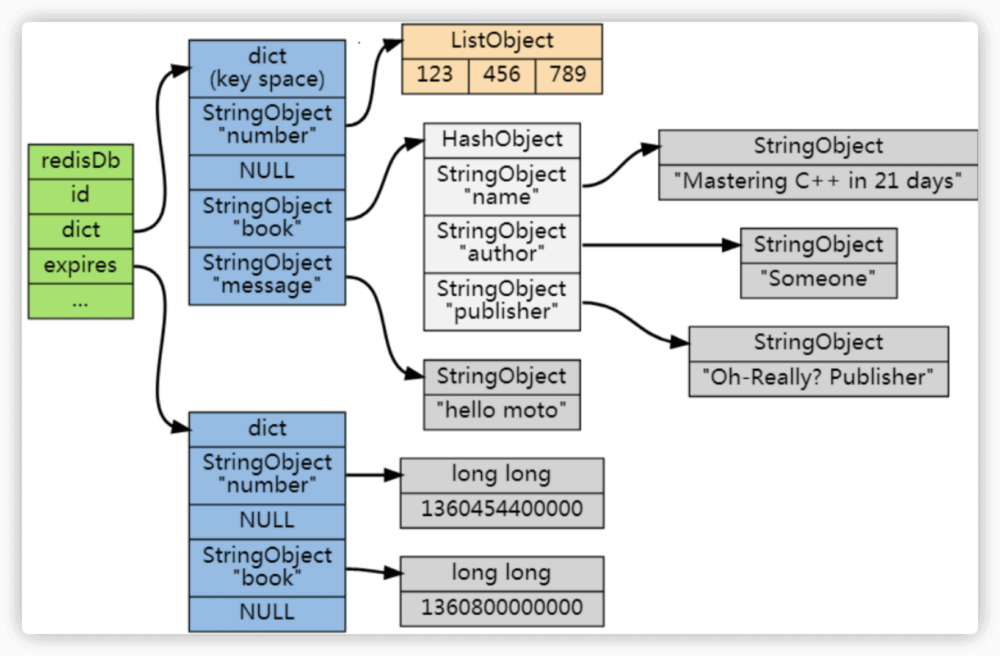
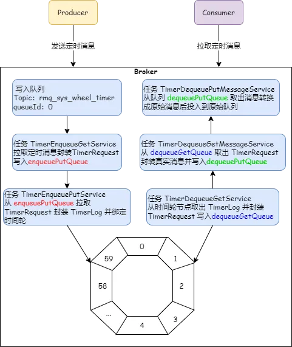
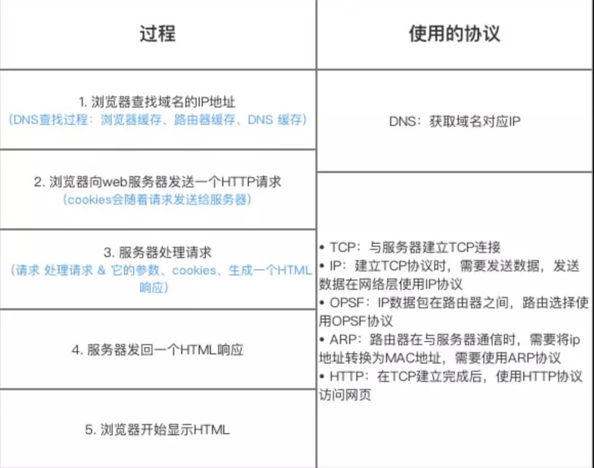

# ⭐️字节抖音电商一面，被虐的很惨！

面经系列中，凉经的分享一直比较少，今天就来给大家分享一篇字节跳动抖音电商后端秋招一面的凉经，结果直接秒挂！不得不说，字节的面试问题确实非常底层，这些问题至少能难倒 **95%** 的求职者，甚至更多！现在的面试竞争真是太卷了，卷到让人怀疑人生！

想要通过字节的面试，光靠手撕算法是远远不够的，还得深入钻研底层原理，扎实掌握计算机基础知识。只有技术功底足够深厚，才能在面试中脱颖而出！

## Java

### 线程池作用是什么？

**线程池**提供了一种限制和管理资源（包括执行一个任务）的方式。 每个**线程池**还维护一些基本统计信息，例如已完成任务的数量。

这里借用《Java 并发编程的艺术》提到的来说一下**使用线程池的好处**：

* **降低资源消耗**。通过重复利用已创建的线程降低线程创建和销毁造成的消耗。
* **提高响应速度**。当任务到达时，任务可以不需要等到线程创建就能立即执行。
* **提高线程的可管理性**。线程是稀缺资源，如果无限制的创建，不仅会消耗系统资源，还会降低系统的稳定性，使用线程池可以进行统一的分配，调优和监控。

### Java 线程池参数有哪些？

`ThreadPoolExecutor` 3 个最重要的参数：

* `corePoolSize` : 任务队列未达到队列容量时，最大可以同时运行的线程数量。
* `maximumPoolSize` : 任务队列中存放的任务达到队列容量的时候，当前可以同时运行的线程数量变为最大线程数。
* `workQueue`: 新任务来的时候会先判断当前运行的线程数量是否达到核心线程数，如果达到的话，新任务就会被存放在队列中。

`ThreadPoolExecutor`其他常见参数 :

* `keepAliveTime`:线程池中的线程数量大于 `corePoolSize` 的时候，如果这时没有新的任务提交，核心线程外的线程不会立即销毁，而是会等待，直到等待的时间超过了 `keepAliveTime`才会被回收销毁。
* `unit` : `keepAliveTime` 参数的时间单位。
* `threadFactory` :executor 创建新线程的时候会用到。
* `handler` :拒绝策略（后面会单独详细介绍一下）。

下面这张图可以加深你对线程池中各个参数的相互关系的理解（图片来源：《Java 性能调优实战》）：


### `keepAliveTime` 对核心线程是否生效，是否能杀死核心线程?

默认情况下，核心线程是不会被销毁的，即使它们处于空闲状态。`keepAliveTime` 默认只适用于非核心线程，非核心线程在空闲时间超过 `keepAliveTime` 后会被销毁。

这是为了减少创建线程的开销，因为核心线程通常是要长期保持活跃的。

### 如果我想杀死核心线程应该怎么做?

从 **JDK 1.6** 开始，`ThreadPoolExecutor` 类新增了一个 `allowCoreThreadTimeOut` 字段，允许核心线程的存活状态也受 `keepAliveTime` 控制。这个字段的默认值是 `false`，也就是说，核心线程即便空闲也会一直存活。如果你希望核心线程在空闲一段时间后也能被销毁，可以通过调用 `ThreadPoolExecutor` 的 `allowCoreThreadTimeOut(true)` 方法，让 `keepAliveTime` 对核心线程生效，核心线程在空闲超过 `keepAliveTime` 后也会被销毁。

```java
public void allowCoreThreadTimeOut(boolean value) {
    // 核心线程的 keepAliveTime 必须大于 0 才能启用超时机制
    if (value && keepAliveTime <= 0) {
        throw new IllegalArgumentException("Core threads must have nonzero keep alive times");
    }
    // 设置 allowCoreThreadTimeOut 的值
    if (value != allowCoreThreadTimeOut) {
        allowCoreThreadTimeOut = value;
        // 如果启用了超时机制，清理所有空闲的线程，包括核心线程
        if (value) {
            interruptIdleWorkers();
        }
    }
}
```

借助这个方法实现一个可自动关闭且核心线程数不为 0 的线程池：

```java
// 创建一个核心线程数为5的线程池，keepAliveTime为10秒
ThreadPoolExecutor executor = new ThreadPoolExecutor(5, 5,
        10L, TimeUnit.SECONDS, new LinkedBlockingQueue<>(15));

// 允许核心线程超时销毁
executor.allowCoreThreadTimeOut(true);

// 提交10个任务到线程池
for (int i = 0; i < 10; i++) {
    executor.execute(() -> {
        System.out.println(Thread.currentThread().getName());
    });
}
```

这段代码打印线程名称结束后，程序等待10s退出：

```bash
pool-1-thread-1
pool-1-thread-2
pool-1-thread-3
pool-1-thread-4
pool-1-thread-4
pool-1-thread-5
pool-1-thread-1
pool-1-thread-2
pool-1-thread-4
pool-1-thread-3

Process finished with exit code 0
```

需要注意的是：启用 `allowCoreThreadTimeOut` 后，确保 `keepAliveTime` 的值大于 0，否则会抛出异常。

## Redis

### Redis 为什么这么快？

Redis 内部做了非常多的性能优化，比较重要的有下面 3 点：

1. Redis 基于内存，内存的访问速度比磁盘快很多；
2. Redis 基于 Reactor 模式设计开发了一套高效的事件处理模型，主要是单线程事件循环和 IO 多路复用；
3. Redis 内置了多种优化过后的数据类型/结构实现，性能非常高。
4. Redis 通信协议实现简单且解析高效。

### Redis 怎么设置过期时间，底层是怎么实现的，过期删除策略是？

Redis 可以通过独立命令设置过期时间：

* `EXPIRE key seconds`：设置键在指定的秒数后过期。
* `PEXPIRE key milliseconds`：设置键在指定的毫秒数后过期。
* `EXPIREAT key timestamp`：设置键在特定的时间戳（以秒为单位）后过期。
* `PEXPIREAT key millisecondsTimestamp`：设置键在特定的时间戳（以毫秒为单位）后过期。

可以使用 `TTL key`（秒）或 `PTTL key`（毫秒）查看键的剩余过期时间。

另外，字符串中有几个直接操作过期时间的方法：

* `SET key value EX seconds`：设置键值对并指定过期时间（以秒为单位）。
* `SET key value PX milliseconds`：设置键值对并指定过期时间（以毫秒为单位）。
* `SETEX key seconds value`：设置键值对并指定过期时间（以秒为单位）。

Redis 通过一个叫做过期字典（可以看作是 hash 表）来保存数据过期的时间。过期字典的键指向 Redis 数据库中的某个 key(键)，过期字典的值是一个 long long 类型的整数，这个整数保存了 key 所指向的数据库键的过期时间（毫秒精度的 UNIX 时间戳）。



过期字典是存储在 redisDb 这个结构里的：

```c
typedef struct redisDb {
    ...

    dict *dict;     //数据库键空间,保存着数据库中所有键值对
    dict *expires   // 过期字典,保存着键的过期时间
    ...
} redisDb;
```

在查询一个 key 的时候，Redis 首先检查该 key 是否存在于过期字典中（时间复杂度为 O(1)），如果不在就直接返回，在的话需要判断一下这个 key 是否过期，过期直接删除 key 然后返回 null。

Redis 采用的是 **定期删除+惰性/懒汉式删除** 结合的过期删除策略，这也是大部分缓存框架的选择。定期删除对内存更加友好，惰性删除对 CPU 更加友好。两者各有千秋，结合起来使用既能兼顾 CPU 友好，又能兼顾内存友好。

Redis 过期删除策略的详细介绍可以参考我写的这篇文章：[为什么 Redis 不立刻删除已经过期的数据？](https://mp.weixin.qq.com/s/xkHyitlakAAhVEm86u_I_Q)。

### Redis 热 key 是什么？有什么需要注意的？

如果一个 key 的访问次数比较多且明显多于其他 key 的话，那这个 key 就可以看作是 **hotkey（热 Key）**。例如在 Redis 实例的每秒处理请求达到 5000 次，而其中某个 key 的每秒访问量就高达 2000 次，那这个 key 就可以看作是 hotkey。

hotkey 出现的原因主要是某个热点数据访问量暴增，如重大的热搜事件、参与秒杀的商品。

处理 hotkey 会占用大量的 CPU 和带宽，可能会影响 Redis 实例对其他请求的正常处理。此外，如果突然访问 hotkey 的请求超出了 Redis 的处理能力，Redis 就会直接宕机。这种情况下，大量请求将落到后面的数据库上，可能会导致数据库崩溃。

因此，hotkey 很可能成为系统性能的瓶颈点，需要单独对其进行优化，以确保系统的高可用性和稳定性。

hotkey 的常见处理以及优化办法如下（这些方法可以配合起来使用）：

* **读写分离**：主节点处理写请求，从节点处理读请求。
* **使用 Redis Cluster**：将热点数据分散存储在多个 Redis 节点上。
* **二级缓存**：hotkey 采用二级缓存的方式进行处理，将 hotkey 存放一份到 JVM 本地内存中（可以用 Caffeine）。

Redis 热 key 的详细介绍可以参考我写的这篇文章：[如何发现 Redis 热 Key，有哪些解决方案？](https://mp.weixin.qq.com/s/VZLCtEilwPk7SfTzLISl_w) 。

### 介绍一下 zset，底层实现是什么？

zset 是 Redis 的有序集合实现，全称是 Sorted Set 。Sorted Set 类似于 Set，但和 Set 相比，Sorted Set 增加了一个权重参数 `score`，使得集合中的元素能够按 `score` 进行有序排列，还可以通过 `score` 的范围来获取元素的列表。有点像是 Java 中 `HashMap` 和 `TreeSet` 的结合体。不过，从底层实现来看，更像是 `ConcurrentSkipListMap`，两者底层都用到了跳表，且都支持并发访问。


Sorted Set 应用场景：

* 需要随机获取数据源中的元素根据某个权重进行排序的场景。例如，各种排行榜比如直播间送礼物的排行榜、朋友圈的微信步数排行榜、王者荣耀中的段位排行榜、话题热度排行榜等等。
* 需要存储的数据有优先级或者重要程度的场景，比如优先级任务队列。

为了节约宝贵的内存空间，在 Sorted Set 元素小于 64 字节且个数小于 128 的时候，会使用 **ziplist**，而这个阈值的默认值的设置就来自下面这两个配置项。

```bash
zset-max-ziplist-value 64
zset-max-ziplist-entries 128
```

一旦 Sorted Set 中的某个元素超出这两个其中的一个阈值它就会转为 **skiplist**（实际是 dict+skiplist，还会借用字典来提高获取指定元素的效率）。

### 为什么用跳表实现有序集合？

这个问题挺难的，想要回答清楚需要考虑的点比较多，推荐大家看看这篇文章：[⭐️Redis 为什么用跳表实现有序集合？](https://javaguide.cn/database/redis/redis-skiplist.html)，介绍的非常非常详细！

## MQ

### 看你项目用了 MQ，为什么用它？

通常来说，使用消息队列能为我们的系统带来下面三点好处：

1. **通过异步处理提高系统性能（减少响应所需时间）**
2. **削峰/限流**
3. **降低系统耦合性。**

如果在面试的时候你被面试官问到这个问题的话，一般情况是你在你的简历上涉及到消息队列这方面的内容，这个时候推荐你结合你自己的项目来回答。

### MQ 的解耦举个具体的场景

使用消息队列还可以降低系统耦合性。我们知道如果模块之间不存在直接调用，那么新增模块或者修改模块就对其他模块影响较小，这样系统的可扩展性无疑更好一些。还是直接上图吧：


生产者（客户端）发送消息到消息队列中去，接受者（服务端）处理消息，需要消费的系统直接去消息队列取消息进行消费即可而不需要和其他系统有耦合，这显然也提高了系统的扩展性。

**消息队列使用发布-订阅模式工作，消息发送者（生产者）发布消息，一个或多个消息接受者（消费者）订阅消息。** 从上图可以看到**消息发送者（生产者）和消息接受者（消费者）之间没有直接耦合**，消息发送者将消息发送至分布式消息队列即结束对消息的处理，消息接受者从分布式消息队列获取该消息后进行后续处理，并不需要知道该消息从何而来。**对新增业务，只要对该类消息感兴趣，即可订阅该消息，对原有系统和业务没有任何影响，从而实现网站业务的可扩展性设计**。

例如，我们商城系统分为用户、订单、财务、仓储、消息通知、物流、风控等多个服务。用户在完成下单后，需要调用财务（扣款）、仓储（库存管理）、物流（发货）、消息通知（通知用户发货）、风控（风险评估）等服务。使用消息队列后，下单操作和后续的扣款、发货、通知等操作就解耦了，下单完成发送一个消息到消息队列，需要用到的地方去订阅这个消息进行消息即可。


### 你用的这个 MQ 支持延时消息吗?底层怎么实现的？

RocketMQ 4.x 版本及其之前的版本支持基于预定义的延时等级的延时消息处理。消息发送者可以指定一个延时等级（如 1s、5s、10s 等），然后消息会在相应的延时级别到达后被发送到消费者队列。这些延时等级是固定的，不能灵活配置。

如下表所示，一共 18 个延时等级，具体时间如下：

| 投递等级（delay level） | 延迟时间 | 投递等级（delay level） | 延迟时间 |
| --- | --- | --- | --- |
| 1 | 1s | 10 | 6min |
| 2 | 5s | 11 | 7min |
| 3 | 10s | 12 | 8min |
| 4 | 30s | 13 | 9min |
| 5 | 1min | 14 | 10min |
| 6 | 2min | 15 | 20min |
| 7 | 3min | 16 | 30min |
| 8 | 4min | 17 | 1h |
| 9 | 5min | 18 | 2h |

RocketMQ 5.0 基于时间轮算法引入了定时消息，解决了延时级别只有 18 个、延时时间不准确等问题。

RocketMQ 定时消息的底层实现可以看看我朋友写的这篇：[弥补延时消息的不足，RocketMQ 基于时间轮算法实现了定时消息！](https://mp.weixin.qq.com/s/I91QRel-7CraP7zCRh0ISw)。



## 计算机网络

### 浏览器输入一个地址到跳出网页这个过程中发生了哪些事情？

先来看一张图（来源于《图解 HTTP》）：



上图有一个错误需要注意：是 OSPF 不是 OPSF。 OSPF（Open Shortest Path First，ospf）开放最短路径优先协议, 是由 Internet 工程任务组开发的路由选择协议

总体来说分为以下几个步骤:

1. 在浏览器中输入指定网页的 URL。
2. 浏览器通过 DNS 协议，获取域名对应的 IP 地址。
3. 浏览器根据 IP 地址和端口号，向目标服务器发起一个 TCP 连接请求。
4. 浏览器在 TCP 连接上，向服务器发送一个 HTTP 请求报文，请求获取网页的内容。
5. 服务器收到 HTTP 请求报文后，处理请求，并返回 HTTP 响应报文给浏览器。
6. 浏览器收到 HTTP 响应报文后，解析响应体中的 HTML 代码，渲染网页的结构和样式，同时根据 HTML 中的其他资源的 URL（如图片、CSS、JS 等），再次发起 HTTP 请求，获取这些资源的内容，直到网页完全加载显示。
7. 浏览器在不需要和服务器通信时，可以主动关闭 TCP 连接，或者等待服务器的关闭请求。

详细流程可以阅读我写的这篇文章，强烈推荐，能够将很多计算机网络知识串联起来：[访问网页的全过程（知识串联）](https://javaguide.cn/cs-basics/network/the-whole-process-of-accessing-web-pages.html)。

### HTTP 和 HTTPS 的区别？


* **端口号**：HTTP 默认是 80，HTTPS 默认是 443。
* **URL 前缀**：HTTP 的 URL 前缀是 `http://`，HTTPS 的 URL 前缀是 `https://`。
* **安全性和资源消耗**：HTTP 协议运行在 TCP 之上，所有传输的内容都是明文，客户端和服务器端都无法验证对方的身份。HTTPS 是运行在 SSL/TLS 之上的 HTTP 协议，SSL/TLS 运行在 TCP 之上。所有传输的内容都经过加密，加密采用对称加密，但对称加密的密钥用服务器方的证书进行了非对称加密。所以说，HTTP 安全性没有 HTTPS 高，但是 HTTPS 比 HTTP 耗费更多服务器资源。
* **SEO（搜索引擎优化）**：搜索引擎通常会更青睐使用 HTTPS 协议的网站，因为 HTTPS 能够提供更高的安全性和用户隐私保护。使用 HTTPS 协议的网站在搜索结果中可能会被优先显示，从而对 SEO 产生影响。

### HTTPS 是如何保证传输安全的？

字节是真的喜欢问这个问题呀，面试字节的话，一定一定一定要提前搞懂！

HTTPS 解决了两个问题：

1. 数据传输过程中的安全问题，因为它对数据进行了加密，只有浏览器和服务器可以对其进行解密。
2. 浏览器对服务器的信任问题，数字证书以及其中的数字签名，保证了我们访问的就是我们想要访问的服务器，不可能被钓鱼网站欺骗，也不可能被中间人攻击所欺骗。

HTTPS 保证传输安全的详细介绍以及和 HTTP 的对比可以阅读下面这两篇文章：

* [HTTPS 是如何保证传输安全的？](https://mp.weixin.qq.com/s/_SNaXy4qeWGhhPFg8O1zmw)。
* [HTTP vs HTTPS（应用层）](https://javaguide.cn/cs-basics/network/http-vs-https.html)

## 算法

Leetcode 3. 无重复字符的最长子串（中等难度）：<https://leetcode.cn/problems/longest-substring-without-repeating-characters/>


> 更新: 2025-02-21 14:46:10  
> 原文: <https://www.yuque.com/snailclimb/mf2z3k/ybneym6cnusxo95r>