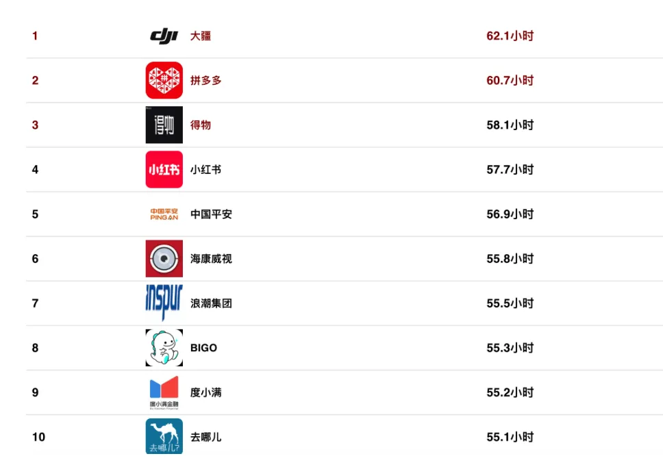
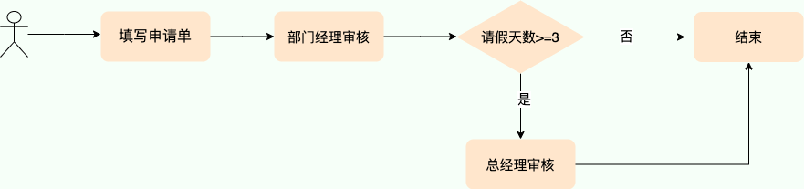
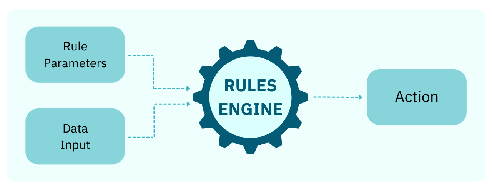
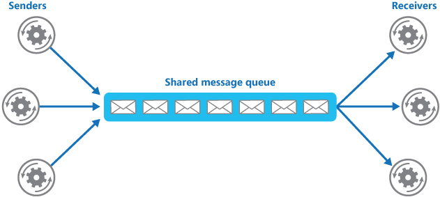
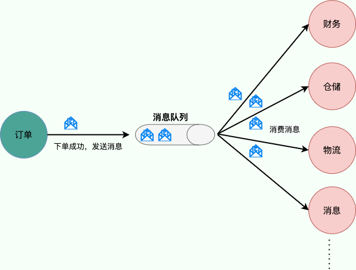
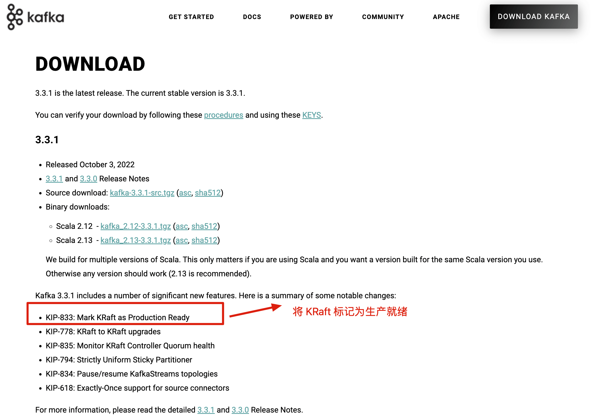
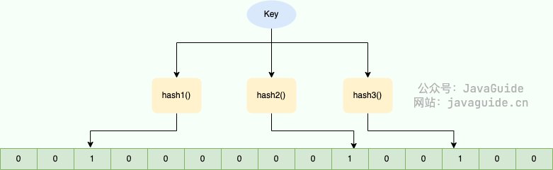

# ⭐️小红书校招面试，有点难度！

小红书的今年的校招薪资开的是真的离谱啊！根据网上已经爆出的薪资来看，下面是小红书 26 届已经开奖岗位的薪资情况：

* 后端：（32k~33k）\*16，上海，白菜
* 后端：35k\*16，上海，SP，无期权
* 后端：（36k~39k）\*16，上海，SSP，期权大概 10W 分四年

是的，你没看错，小红书的今年校招的大白菜一年都能给到 51w+（应该是大白菜，暂时没看到比这更低的了），比别家的很多 SP 和 SSP 还要高很多，太猛了呀！

这还要啥自行车啊！这薪资就是工作强度大，绩效考核，咱也得认啊！不过，小红书确实高压环境，流动性比较大。

小红书技术岗整体流程较长，通常包括：**笔试（校招） + 3~4 轮技术面 + HR面**。时间跨度大，可能从首轮到 Offer 要 1~2 个月。

技术面重点突出“项目 + 场景 + 基础”结合，几乎每一轮必问项目/实习。并且， 场景题这几年出现的越来越频繁了。八股比重大体适中，视面试官风格而定：

* 有些面试几乎不问八股，完全围绕项目聊；
* 有些则会结合八股基础进行延伸（如事务、注解、微服务等）；
* 面试官整体风格偏工程实战导向。

下图是网友爆料的 2025 年互联网公司工作强度排行榜，可以看到小红书仅次于大疆、PDD 和得物。



下面给大家分享一篇小红去年秋招的后端面经。我精选了一二面中的一些比较典型的面试问题进行解答， 大家可以感受一下小红书的面试难度如何。

## UDP 和 TCP 区别

1. **是否面向连接**：
   * TCP 是面向连接的。在传输数据之前，必须先通过“三次握手”建立连接；数据传输完成后，还需要通过“四次挥手”来释放连接。这保证了双方都准备好通信。
   * UDP 是无连接的。发送数据前不需要建立任何连接，直接把数据包（数据报）扔出去。
2. **是否是可靠传输**：
   * TCP 提供可靠的数据传输服务。它通过序列号、确认应答 (ACK)、超时重传、流量控制、拥塞控制等一系列机制，来确保数据能够无差错、不丢失、不重复且按顺序地到达目的地。
   * UDP 提供不可靠的传输。它尽最大努力交付 (best-effort delivery)，但不保证数据一定能到达，也不保证到达的顺序，更不会自动重传。收到报文后，接收方也不会主动发确认。
3. **是否有状态**：
   * TCP 是有状态的。因为要保证可靠性，TCP 需要在连接的两端维护连接状态信息，比如序列号、窗口大小、哪些数据发出去了、哪些收到了确认等。
   * UDP 是无状态的。它不维护连接状态，发送方发出数据后就不再关心它是否到达以及如何到达，因此开销更小（**这很“渣男”！**）。
4. **传输效率**：
   * TCP 因为需要建立连接、发送确认、处理重传等，其开销较大，传输效率相对较低。
   * UDP 结构简单，没有复杂的控制机制，开销小，传输效率更高，速度更快。
5. **传输形式**：
   * TCP 是面向字节流 (Byte Stream) 的。它将应用程序交付的数据视为一连串无结构的字节流，可能会对数据进行拆分或合并。
   * UDP 是面向报文 (Message Oriented) 的。应用程序交给 UDP 多大的数据块，UDP 就照样发送，既不拆分也不合并，保留了应用程序消息的边界。
6. **首部开销**：
   * TCP 的头部至少需要 20 字节，如果包含选项字段，最多可达 60 字节。
   * UDP 的头部非常简单，固定只有 8 字节。
7. **是否提供广播或多播服务**：
   * TCP 只支持点对点 (Point-to-Point) 的单播通信。
   * UDP 支持一对一 (单播)、一对多 (多播/Multicast) 和一对所有 (广播/Broadcast) 的通信方式。
8. ……

为了更直观地对比，可以看下面这个表格：

| 特性 | TCP | UDP |
| --- | --- | --- |
| **连接性** | 面向连接 | 无连接 |
| **可靠性** | 可靠 | 不可靠 (尽力而为) |
| **状态维护** | 有状态 | 无状态 |
| **传输效率** | 较低 | 较高 |
| **传输形式** | 面向字节流 | 面向数据报 (报文) |
| **头部开销** | 20 - 60 字节 | 8 字节 |
| **通信模式** | 点对点 (单播) | 单播、多播、广播 |
| **常见应用** | HTTP/HTTPS, FTP, SMTP, SSH | DNS, DHCP, SNMP, TFTP, VoIP, 视频流 |

## TCP 为什么可靠呢

1. **基于数据块传输**：应用数据被分割成 TCP 认为最适合发送的数据块，再传输给网络层，数据块被称为报文段或段。
2. **对失序数据包重新排序以及去重**：TCP 为了保证不发生丢包，就给每个包一个序列号，有了序列号能够将接收到的数据根据序列号排序，并且去掉重复序列号的数据就可以实现数据包去重。
3. **校验和** : TCP 将保持它首部和数据的检验和。这是一个端到端的检验和，目的是检测数据在传输过程中的任何变化。如果收到段的检验和有差错，TCP 将丢弃这个报文段和不确认收到此报文段。
4. **重传机制** : 在数据包丢失或延迟的情况下，重新发送数据包，直到收到对方的确认应答（ACK）。TCP 重传机制主要有：基于计时器的重传（也就是超时重传）、快速重传（基于接收端的反馈信息来引发重传）、SACK（在快速重传的基础上，返回最近收到的报文段的序列号范围，这样客户端就知道，哪些数据包已经到达服务器了）、D-SACK（重复 SACK，在 SACK 的基础上，额外携带信息，告知发送方有哪些数据包自己重复接收了）。
5. **流量控制** : TCP 连接的每一方都有固定大小的缓冲空间，TCP 的接收端只允许发送端发送接收端缓冲区能接纳的数据。当接收方来不及处理发送方的数据，能提示发送方降低发送的速率，防止包丢失。TCP 使用的流量控制协议是可变大小的滑动窗口协议（TCP 利用滑动窗口实现流量控制）。
6. **拥塞控制** : 当网络拥塞时，减少数据的发送。TCP 在发送数据的时候，需要考虑两个因素：一是接收方的接收能力，二是网络的拥塞程度。接收方的接收能力由滑动窗口表示，表示接收方还有多少缓冲区可以用来接收数据。网络的拥塞程度由拥塞窗口表示，它是发送方根据网络状况自己维护的一个值，表示发送方认为可以在网络中传输的数据量。发送方发送数据的大小是滑动窗口和拥塞窗口的最小值，这样可以保证发送方既不会超过接收方的接收能力，也不会造成网络的过度拥塞。

更多网络高频知识点和面试题总结，可以阅读笔者写的这几篇文章：

* [计算机网络常见面试题总结（上）](https://javaguide.cn/cs-basics/network/other-network-questions.html)（网络分层模型、常见网路协议总结、HTTP、WebSocket、DNS 等）
* [计算机网络常见面试题总结（下）](https://javaguide.cn/cs-basics/network/other-network-questions2.html)（TCP 和 UDP、IP、ARP 等）

## 你的项目用过什么设计模式？

我的项目用到了责任链模式。责任链模式（Chain of Responsibility Pattern）是一种**行为型设计模式**。它将请求的发送者和接收者解耦，通过创建一个处理请求的接收者链来处理请求。链上的每个接收者（也称为处理器或节点）都负责对请求进行一部分的处理或校验，并决定是否将请求传递给链上的下一个接收者，或者中断处理流程。

举个例子，在我的项目的订单场景，一个订单可能需要进行多种校验，例如商品库存校验、风控校验、支付信息校验等。可以将这些校验规则组成一个责任链，每个校验规则负责一种校验，如果校验不通过，则中断流程并返回错误信息；如果校验通过，则将请求传递给下一个校验规则。

我总结过设计模式相关的高频面试题，需要的朋友可以自取：[后端面试 PDF 合集！](https://mp.weixin.qq.com/s/8Pb6ksy7pYFqgK6DhMuOBg)。


## 什么是工作流？

维基百科是这样介绍工作流的：

> 工作流（Workflow），是对工作流程及其各操作步骤之间业务规则的抽象、概括描述。工作流建模，即将工作流程中的工作如何前后组织在一起的逻辑和规则，在计算机中以恰当的模型表达并对其实施计算。工作流要解决的主要问题是：为实现某个业务目标，利用计算机在多个参与者之间按某种预定规则自动传递文档、信息或者任务。

简单来说，工作流就是定义“为了完成一件事，需要按照什么顺序和规则做哪些事情”。例如，请假审批、订单处理、报销申请等等，这些都是工作流。 它们都包含多个步骤，并且这些步骤需要按照一定的顺序和规则执行。

拿公司员工请假审批流程来说，我们可能会涉及到下面这些流程：



一个业务流程中涉及的环节（比如部门经理审核），按照特定规则组织在一起，这个特定规则可以单纯硬编码来实现和维护。但是，这样很难让我们适应业务流程的变化，并且无法直观地看到每个环节执行的具体的业务逻辑。

**那么，有没有一种方法可以让我们更容易地定义、管理和修改这些业务流程呢？**

答案就是：**使用工作流引擎！**

工作流引擎就像一个流程“机器人”，它可以根据我们预先定义好的规则自动执行整个流程。 我们只需要用可视化的方式定义好流程的各个步骤、规则和参与者，剩下的就交给工作流引擎去处理。

## 为什么要用工作流？

还是拿公司员工请假审批流程来说。在没有工作流的情况下，每一步流程都需要在代码中手动维护请假业务的状态。例如，在“部门经理审核”之后，需要编写代码判断请假天数，以决定是否需要“总经理审核”。

这种方式存在诸多问题，主要体现在下面两个方面：

1. **代码复杂且难以维护：** 业务流程的每一步都需要在代码中实现，导致代码冗长、复杂，难以理解和维护。 任何流程的修改都需要修改代码并重新部署，成本高且容易出错。
2. **难以适应变化：** 如果需要修改流程，例如在“部门经理审核”之前添加“项目负责人审核”，则需要修改大量的代码，工作量巨大且容易引入 bug。 业务流程的调整变得缓慢且困难。

引入工作流引擎后，这两个问题都能得到有效解决：

1. **简化开发和维护：** 通过可视化的流程设计器，可以将业务流程定义为一系列节点和连接，无需编写复杂的代码。 流程的修改只需要修改流程定义，无需修改代码，大大简化了开发和维护工作。
2. **灵活适应变化：** 工作流引擎可以轻松地添加、删除或修改流程节点，快速适应业务流程的变化。 例如，添加“项目负责人审核”节点只需在流程定义中添加一个节点即可，无需修改其他代码。

## 流程引擎和规则引擎有什么区别？

很多小伙伴容易把流程引擎（工作流是流程的定义，流程引擎是流程的具体执行者）和规则引擎的概念混淆，虽然两者都与业务逻辑相关，但它们解决的问题和应用场景有所不同。

### 流程引擎

流程引擎的核心是定义和执行业务流程，它关注的是业务活动在不同参与者（通常是不同角色）之间的流转和协作。

流程引擎主要解决以下问题：

* **规范和标准化流程：** 流程引擎将业务流程以清晰、标准化的方式定义，确保流程执行的一致性和可控性，减少人为错误和偏差。
* **实时监控和管理：** 提供对流程执行状态的实时监控，可以跟踪每个步骤的进展、识别瓶颈和潜在问题，并及时采取干预措施。
* **提升效率，减少人工干预：** 通过自动化任务分配、数据传递和流程流转，减少人工操作，显著提高业务流程的执行效率，并释放人力资源。
* **降低开发和维护成本：** 流程引擎通常提供可视化的流程设计工具，使业务人员也能参与到流程设计中，减少对专业开发人员的依赖，从而降低开发和维护成本，并提高流程的适应性。

简单来说，流程引擎的重点是**控制业务活动的执行顺序和参与者之间的交互**，例如：

* 请假审批流程：员工提交请假申请，逐级审批，最终决定是否批准。
* 报销流程：按照审批流程（直属上级、财务部门）逐级审核。财务确认无误后进行打款，并通知申请人。
* 订单处理流程：客户下单，系统进行订单处理、发货、确认收货等一系列操作。
* ......

### 规则引擎

规则引擎的核心是将业务决策逻辑从应用程序代码中解耦出来，并使用预定义的语义模块（例如规则语言、决策表、决策树、流程图等）来表达和执行这些决策。它接受数据输入，根据配置的规则进行匹配和计算，并根据结果触发相应的动作，最终产出决策结果或执行预设的操作。

下图很好的展示了规则引擎的基本工作原理（规则参数 + 数据输入 --> 规则引擎 --> 动作）：



规则引擎主要解决以下问题：

* **易变逻辑的管理：** 业务规则经常变化，使用规则引擎可以将这些规则外部化，方便业务人员修改和管理，无需修改和部署代码，提高了业务敏捷性。
* **降低业务与代码的耦合度：** 将业务规则从代码中分离，使代码更简洁、更易维护，降低了修改代码带来的风险。
* **实现复杂的业务决策：** 通过组合多个规则，可以实现复杂的业务决策逻辑，提高决策的灵活性和精度。
* **提高决策效率：** 规则引擎可以自动化执行决策过程，提高决策效率，减少人工干预。

简单来说，规则引擎的重点是**根据输入数据进行判断和决策**，例如：

* 贷款审批：根据用户的信用评分、收入等信息决定是否批准贷款申请。
* 风控：根据交易金额、地点、设备、IP 等信息判断是否存在欺诈交易。
* 广告投放策略调整：根据目标客户的特征（地区、年龄、兴趣等）和预算限制，动态调整广告投放策略，例如竞价金额、投放时段等。
* 电商优惠卷发放：根据用户的行为数据、购买意图等规则，自动发放优惠券或促销活动。
* 折扣结算：根据不同的规则（商品金额是否大于某个数值、用户是否是 VIP、是否有优惠卷等）计算商品折扣。
* ......

### 总结

规则引擎关注的是**决策**，流程引擎关注的是**流程**。两者并非是竞争关系，在实际应用中通常是**互补的**，可以结合使用。例如，在流程引擎的某个节点引入规则引擎，根据不同的条件决定流程的下一步走向，使流程更加灵活和智能。 规则引擎可以作为流程引擎的一个组件，为流程引擎提供决策支持。

## 你的项目为什么要用 MQ？

通常来说，使用消息队列能为我们的系统带来下面三点好处：

1. **通过异步处理提高系统性能（减少响应所需时间）**
2. **削峰/限流**
3. **降低系统耦合性。**

如果在面试的时候你被面试官问到这个问题的话，一般情况是你在你的简历上涉及到消息队列这方面的内容，这个时候推荐你结合你自己的项目来回答。

这里以 MQ 解耦为例说明。

使用消息队列还可以降低系统耦合性。我们知道如果模块之间不存在直接调用，那么新增模块或者修改模块就对其他模块影响较小，这样系统的可扩展性无疑更好一些。还是直接上图吧：



生产者（客户端）发送消息到消息队列中去，接受者（服务端）处理消息，需要消费的系统直接去消息队列取消息进行消费即可而不需要和其他系统有耦合，这显然也提高了系统的扩展性。

**消息队列使用发布-订阅模式工作，消息发送者（生产者）发布消息，一个或多个消息接受者（消费者）订阅消息。** 从上图可以看到**消息发送者（生产者）和消息接受者（消费者）之间没有直接耦合**，消息发送者将消息发送至分布式消息队列即结束对消息的处理，消息接受者从分布式消息队列获取该消息后进行后续处理，并不需要知道该消息从何而来。**对新增业务，只要对该类消息感兴趣，即可订阅该消息，对原有系统和业务没有任何影响，从而实现网站业务的可扩展性设计**。

例如，我们商城系统分为用户、订单、财务、仓储、消息通知、物流、风控等多个服务。用户在完成下单后，需要调用财务（扣款）、仓储（库存管理）、物流（发货）、消息通知（通知用户发货）、风控（风险评估）等服务。使用消息队列后，下单操作和后续的扣款、发货、通知等操作就解耦了，下单完成发送一个消息到消息队列，需要用到的地方去订阅这个消息进行消息即可。



## 你用的这个 MQ 支持延时消息吗?

RocketMQ 4.x 版本及其之前的版本支持基于预定义的延时等级的延时消息处理。消息发送者可以指定一个延时等级（如 1s、5s、10s 等），然后消息会在相应的延时级别到达后被发送到消费者队列。这些延时等级是固定的，不能灵活配置。

如下表所示，一共 18 个延时等级，具体时间如下：

| 投递等级（delay level） | 延迟时间 | 投递等级（delay level） | 延迟时间 |
| --- | --- | --- | --- |
| 1 | 1s | 10 | 6min |
| 2 | 5s | 11 | 7min |
| 3 | 10s | 12 | 8min |
| 4 | 30s | 13 | 9min |
| 5 | 1min | 14 | 10min |
| 6 | 2min | 15 | 20min |
| 7 | 3min | 16 | 30min |
| 8 | 4min | 17 | 1h |
| 9 | 5min | 18 | 2h |

RocketMQ 5.0 基于时间轮算法引入了定时消息，解决了延时级别只有 18 个、延时时间不准确等问题。

RocketMQ 定时消息的底层实现可以看看我朋友写的这篇：[弥补延时消息的不足，RocketMQ 基于时间轮算法实现了定时消息！](https://mp.weixin.qq.com/s/I91QRel-7CraP7zCRh0ISw)。

## 了解其他的消息队列吗？

### 常见的消息队列

#### Kafka


Kafka 是 LinkedIn 开源的一个分布式流式处理平台，已经成为 Apache 顶级项目，早期被用来用于处理海量的日志，后面才慢慢发展成了一款功能全面的高性能消息队列。

流式处理平台具有三个关键功能：

1. **消息队列**：发布和订阅消息流，这个功能类似于消息队列，这也是 Kafka 也被归类为消息队列的原因。
2. **容错的持久方式存储记录消息流**：Kafka 会把消息持久化到磁盘，有效避免了消息丢失的风险。
3. **流式处理平台：** 在消息发布的时候进行处理，Kafka 提供了一个完整的流式处理类库。

Kafka 是一个分布式系统，由通过高性能 TCP 网络协议进行通信的服务器和客户端组成，可以部署在在本地和云环境中的裸机硬件、虚拟机和容器上。

在 Kafka 2.8 之前，Kafka 最被大家诟病的就是其重度依赖于 Zookeeper 做元数据管理和集群的高可用。在 Kafka 2.8 之后，引入了基于 Raft 协议的 KRaft 模式，不再依赖 Zookeeper，大大简化了 Kafka 的架构，让你可以以一种轻量级的方式来使用 Kafka。

不过，要提示一下：**如果要使用 KRaft 模式的话，建议选择较高版本的 Kafka，因为这个功能还在持续完善优化中。Kafka 3.3.1 版本是第一个将 KRaft（Kafka Raft）共识协议标记为生产就绪的版本。**



Kafka 官网：<http://kafka.apache.org/>

Kafka 更新记录（可以直观看到项目是否还在维护）：<https://kafka.apache.org/downloads>

#### RocketMQ


RocketMQ 是阿里开源的一款云原生“消息、事件、流”实时数据处理平台，借鉴了 Kafka，已经成为 Apache 顶级项目。

RocketMQ 的核心特性（摘自 RocketMQ 官网）：

* 云原生：生与云，长与云，无限弹性扩缩，K8s 友好
* 高吞吐：万亿级吞吐保证，同时满足微服务与大数据场景。
* 流处理：提供轻量、高扩展、高性能和丰富功能的流计算引擎。
* 金融级：金融级的稳定性，广泛用于交易核心链路。
* 架构极简：零外部依赖，Shared-nothing 架构。
* 生态友好：无缝对接微服务、实时计算、数据湖等周边生态。

根据官网介绍：

> Apache RocketMQ 自诞生以来，因其架构简单、业务功能丰富、具备极强可扩展性等特点被众多企业开发者以及云厂商广泛采用。历经十余年的大规模场景打磨，RocketMQ 已经成为业内共识的金融级可靠业务消息首选方案，被广泛应用于互联网、大数据、移动互联网、物联网等领域的业务场景。

RocketMQ 官网：<https://rocketmq.apache.org/> （文档很详细，推荐阅读）

RocketMQ 更新记录（可以直观看到项目是否还在维护）：<https://github.com/apache/rocketmq/releases>

#### RabbitMQ


RabbitMQ 是采用 Erlang 语言实现 AMQP(Advanced Message Queuing Protocol，高级消息队列协议）的消息中间件，它最初起源于金融系统，用于在分布式系统中存储转发消息。

RabbitMQ 发展到今天，被越来越多的人认可，这和它在易用性、扩展性、可靠性和高可用性等方面的卓著表现是分不开的。RabbitMQ 的具体特点可以概括为以下几点：

* **可靠性：** RabbitMQ 使用一些机制来保证消息的可靠性，如持久化、传输确认及发布确认等。
* **灵活的路由：** 在消息进入队列之前，通过交换器来路由消息。对于典型的路由功能，RabbitMQ 己经提供了一些内置的交换器来实现。针对更复杂的路由功能，可以将多个交换器绑定在一起，也可以通过插件机制来实现自己的交换器。这个后面会在我们讲 RabbitMQ 核心概念的时候详细介绍到。
* **扩展性：** 多个 RabbitMQ 节点可以组成一个集群，也可以根据实际业务情况动态地扩展集群中节点。
* **高可用性：** 队列可以在集群中的机器上设置镜像，使得在部分节点出现问题的情况下队列仍然可用。
* **支持多种协议：** RabbitMQ 除了原生支持 AMQP 协议，还支持 STOMP、MQTT 等多种消息中间件协议。
* **多语言客户端：** RabbitMQ 几乎支持所有常用语言，比如 Java、Python、Ruby、PHP、C#、JavaScript 等。
* **易用的管理界面：** RabbitMQ 提供了一个易用的用户界面，使得用户可以监控和管理消息、集群中的节点等。在安装 RabbitMQ 的时候会介绍到，安装好 RabbitMQ 就自带管理界面。
* **插件机制：** RabbitMQ 提供了许多插件，以实现从多方面进行扩展，当然也可以编写自己的插件。感觉这个有点类似 Dubbo 的 SPI 机制

RabbitMQ 官网：<https://www.rabbitmq.com/> 。

RabbitMQ 更新记录（可以直观看到项目是否还在维护）：<https://www.rabbitmq.com/news.html>

#### Pulsar


Pulsar 是下一代云原生分布式消息流平台，最初由 Yahoo 开发 ，已经成为 Apache 顶级项目。

Pulsar 集消息、存储、轻量化函数式计算为一体，采用计算与存储分离架构设计，支持多租户、持久化存储、多机房跨区域数据复制，具有强一致性、高吞吐、低延时及高可扩展性等流数据存储特性，被看作是云原生时代实时消息流传输、存储和计算最佳解决方案。

Pulsar 的关键特性如下（摘自官网）：

* 是下一代云原生分布式消息流平台。
* Pulsar 的单个实例原生支持多个集群，可跨机房在集群间无缝地完成消息复制。
* 极低的发布延迟和端到端延迟。
* 可无缝扩展到超过一百万个 topic。
* 简单的客户端 API，支持 Java、Go、Python 和 C++。
* 主题的多种订阅模式（独占、共享和故障转移）。
* 通过 Apache BookKeeper 提供的持久化消息存储机制保证消息传递 。
* 由轻量级的 serverless 计算框架 Pulsar Functions 实现流原生的数据处理。
* 基于 Pulsar Functions 的 serverless connector 框架 Pulsar IO 使得数据更易移入、移出 Apache Pulsar。
* 分层式存储可在数据陈旧时，将数据从热存储卸载到冷/长期存储（如 S3、GCS）中。

Pulsar 官网：<https://pulsar.apache.org/>

Pulsar 更新记录（可以直观看到项目是否还在维护）：<https://github.com/apache/pulsar/releases>

#### ActiveMQ

目前已经被淘汰，不推荐使用，不建议学习。

### 如何选择？

[消息队列基础知识总结](https://javaguide.cn/high-performance/message-queue/message-queue.html)这篇文章有详细介绍到。

推荐阅读：

* [Disruptor 常见知识点&面试题总结](https://javaguide.cn/high-performance/message-queue/disruptor-questions.html)
* [RabbitMQ 常见知识点&面试题总结](https://javaguide.cn/high-performance/message-queue/rabbitmq-questions.html)
* [RocketMQ 常见知识点&面试题总结](https://javaguide.cn/high-performance/message-queue/rocketmq-questions.html)
* [Kafka 常常见知识点&面试题总结](https://javaguide.cn/high-performance/message-queue/kafka-questions-01.html)

## 项目为什么使用 Redis？

**1、访问速度更快**

传统数据库数据保存在磁盘，而 Redis 基于内存，内存的访问速度比磁盘快很多。引入 Redis 之后，我们可以把一些高频访问的数据放到 Redis 中，这样下次就可以直接从内存中读取，速度可以提升几十倍甚至上百倍。

**2、高并发**

一般像 MySQL 这类的数据库的 QPS 大概都在 4k 左右（4 核 8g） ，但是使用 Redis 缓存之后很容易达到 5w+，甚至能达到 10w+（就单机 Redis 的情况，Redis 集群的话会更高）。

> QPS（Query Per Second）：服务器每秒可以执行的查询次数；

由此可见，直接操作缓存能够承受的数据库请求数量是远远大于直接访问数据库的，所以我们可以考虑把数据库中的部分数据转移到缓存中去，这样用户的一部分请求会直接到缓存这里而不用经过数据库。进而，我们也就提高了系统整体的并发。

**3、功能全面**

Redis 除了可以用作缓存之外，还可以用于分布式锁、限流、消息队列、延时队列等场景，功能强大！

## Redis 数据结构有哪些？

Redis 中比较常见的数据类型有下面这些：

* **5 种基础数据类型**：String（字符串）、List（列表）、Set（集合）、Hash（散列）、Zset（有序集合）。
* **3 种特殊数据类型**：HyperLogLog（基数统计）、Bitmap （位图）、Geospatial (地理位置)。

Redis 5 种基本数据类型其底层实现主要依赖这 8 种数据结构：简单动态字符串（SDS）、LinkedList（双向链表）、Dict（哈希表/字典）、SkipList（跳跃表）、Intset（整数集合）、ZipList（压缩列表）、QuickList（快速列表）。

Redis 5 种基本数据类型对应的底层数据结构实现如下表所示：

| String | List | Hash | Set | Zset |
| :--- | :--- | :--- | :--- | :--- |
| SDS | LinkedList/ZipList/QuickList | Dict、ZipList | Dict、Intset | ZipList、SkipList |

Redis 3.2 之前，List 底层实现是 LinkedList 或者 ZipList。Redis 3.2 之后，引入了 LinkedList 和 ZipList 的结合 QuickList，List 的底层实现变为 QuickList。从 Redis 7.0 开始， ZipList 被 ListPack 取代。

除了上面提到的之外，还有一些其他的比如 [Bloom filter（布隆过滤器）](https://mp.weixin.qq.com/s/DeqJfw51tPJvdwAkq3iPdg)、Bitfield（位域）。

关于 Redis 5 种基础数据类型和 3 种特殊数据类型的详细介绍请看我写的这篇文章：[Redis 八种常用数据类型常用命令和应用场景](https://mp.weixin.qq.com/s/tjf3nBq0GsTh564NTVUq3g)。

## HyperLogLog 适合什么场景？

HyperLogLog (HLL) 是一种非常巧妙的概率性数据结构，它专门解决一类非常棘手的大数据问题：在海量数据中，用极小的内存，估算一个集合中不重复元素的数量，也就是我们常说的基数（Cardinality）

HLL 做的最核心的权衡，就是用一点点精确度的损失，来换取巨大的内存空间节省。它给出的不是一个 100%精确的数字，而是一个带有很小标准误差（Redis 中默认是 0.81%）的近似值。

**基于这个核心权衡，HyperLogLog 最适合以下特征的场景：**

1. **数据量巨大，内存敏感：** 这是 HLL 的主战场。比如，要统计一个亿级日活 App 的每日独立访客数。如果用传统的 Set 来存储用户 ID，一个 ID 占几十个字节，上亿个 ID 可能需要几个 GB 甚至几十 GB 的内存，这在很多场景下是不可接受的。而 HLL，在 Redis 中只需要固定的 12KB 内存，就能处理天文数字级别的基数，这是一个颠覆性的优势。
2. **对结果的精确度要求不是 100%：** 这是使用 HLL 的前提。比如，产品经理想知道一个热门帖子的 UV（独立访客数）是大约 1000 万还是 1010 万，这个细微的差别通常不影响商业决策。但如果场景是统计一个交易系统的准确交易笔数，那 HLL 就完全不适用，因为金融场景要求 100%的精确。

**所以，HyperLogLog 具体的应用场景就非常清晰了：**

* **网站/App 的 UV（Unique Visitor）统计：** 比如统计首页每天有多少个不同的 IP 或用户 ID 访问过。
* **搜索引擎关键词统计：** 统计每天有多少个不同的用户搜索了某个关键词。
* **社交网络互动统计：** 比如统计一条微博被多少个不同的用户转发过。

在这些场景下，我们关心的是数量级和趋势，而不是个位数的差异。

最后，Redis 的实现还非常智能，它内部会根据基数的大小，在**稀疏矩阵**（占用空间更小）和**稠密矩阵**（固定的 12KB）之间自动切换，进一步优化了内存使用。总而言之，当您需要对海量数据进行去重计数，并且可以接受微小误差时，HyperLogLog 就是不二之选。

## 如果我想判断一个元素是否不在海量元素集合中，用什么？

这是布隆过滤器的经典应用场景。布隆过滤器可以告诉你一个元素一定不存在或者可能存在，它也有极高的空间效率和一定的误判率，但绝不会漏报。也就是说，布隆过滤器说某个元素存在，小概率会误判。布隆过滤器说某个元素不在，那么这个元素一定不在。

Bloom Filter 的简单原理图如下：



当字符串存储要加入到布隆过滤器中时，该字符串首先由多个哈希函数生成不同的哈希值，然后将对应的位数组的下标设置为 1（当位数组初始化时，所有位置均为 0）。当第二次存储相同字符串时，因为先前的对应位置已设置为 1，所以很容易知道此值已经存在（去重非常方便）。

如果我们需要判断某个字符串是否在布隆过滤器中时，只需要对给定字符串再次进行相同的哈希计算，得到值之后判断位数组中的每个元素是否都为 1，如果值都为 1，那么说明这个值在布隆过滤器中，如果存在一个值不为 1，说明该元素不在布隆过滤器中。

## Redis 的缓存淘汰策略，过期键怎么删除？

Redis 的内存淘汰策略只有在运行内存达到了配置的最大内存阈值时才会触发，这个阈值是通过`redis.conf`的`maxmemory`参数来定义的。64 位操作系统下，`maxmemory` 默认为 0 ，表示不限制内存大小。32 位操作系统下，默认的最大内存值是 3GB。

你可以使用命令 `config get maxmemory` 来查看 `maxmemory`的值。

```bash
> config get maxmemory
maxmemory
0
```

Redis 提供了 6 种内存淘汰策略：

1. **volatile-lru（least recently used）**：从已设置过期时间的数据集（`server.db[i].expires`）中挑选最近最少使用的数据淘汰。
2. **volatile-ttl**：从已设置过期时间的数据集（`server.db[i].expires`）中挑选将要过期的数据淘汰。
3. **volatile-random**：从已设置过期时间的数据集（`server.db[i].expires`）中任意选择数据淘汰。
4. **allkeys-lru（least recently used）**：从数据集（`server.db[i].dict`）中移除最近最少使用的数据淘汰。
5. **allkeys-random**：从数据集（`server.db[i].dict`）中任意选择数据淘汰。
6. **no-eviction**（默认内存淘汰策略）：禁止驱逐数据，当内存不足以容纳新写入数据时，新写入操作会报错。

4.0 版本后增加以下两种：

7. **volatile-lfu（least frequently used）**：从已设置过期时间的数据集（`server.db[i].expires`）中挑选最不经常使用的数据淘汰。
8. **allkeys-lfu（least frequently used）**：从数据集（`server.db[i].dict`）中移除最不经常使用的数据淘汰。

`allkeys-xxx` 表示从所有的键值中淘汰数据，而 `volatile-xxx` 表示从设置了过期时间的键值中淘汰数据。

`config.c`中定义了内存淘汰策略的枚举数组：

```c
configEnum maxmemory_policy_enum[] = {
    {"volatile-lru", MAXMEMORY_VOLATILE_LRU},
    {"volatile-lfu", MAXMEMORY_VOLATILE_LFU},
    {"volatile-random",MAXMEMORY_VOLATILE_RANDOM},
    {"volatile-ttl",MAXMEMORY_VOLATILE_TTL},
    {"allkeys-lru",MAXMEMORY_ALLKEYS_LRU},
    {"allkeys-lfu",MAXMEMORY_ALLKEYS_LFU},
    {"allkeys-random",MAXMEMORY_ALLKEYS_RANDOM},
    {"noeviction",MAXMEMORY_NO_EVICTION},
    {NULL, 0}
};
```

你可以使用 `config get maxmemory-policy` 命令来查看当前 Redis 的内存淘汰策略。

```bash
> config get maxmemory-policy
maxmemory-policy
noeviction
```

可以通过`config set maxmemory-policy 内存淘汰策略` 命令修改内存淘汰策略，立即生效，但这种方式重启 Redis 之后就失效了。修改 `redis.conf` 中的 `maxmemory-policy` 参数不会因为重启而失效，不过，需要重启之后修改才能生效。

```properties
maxmemory-policy noeviction
```

过期键删除的详细介绍可以参考我写的这篇文章的「内存管理」模块：[Redis 常见面试题总结（上）](https://javaguide.cn/database/redis/redis-questions-01.html)。


> 更新: 2025-12-24 15:25:18  
> 原文: <https://www.yuque.com/snailclimb/mf2z3k/qsalff95e6pgk502>