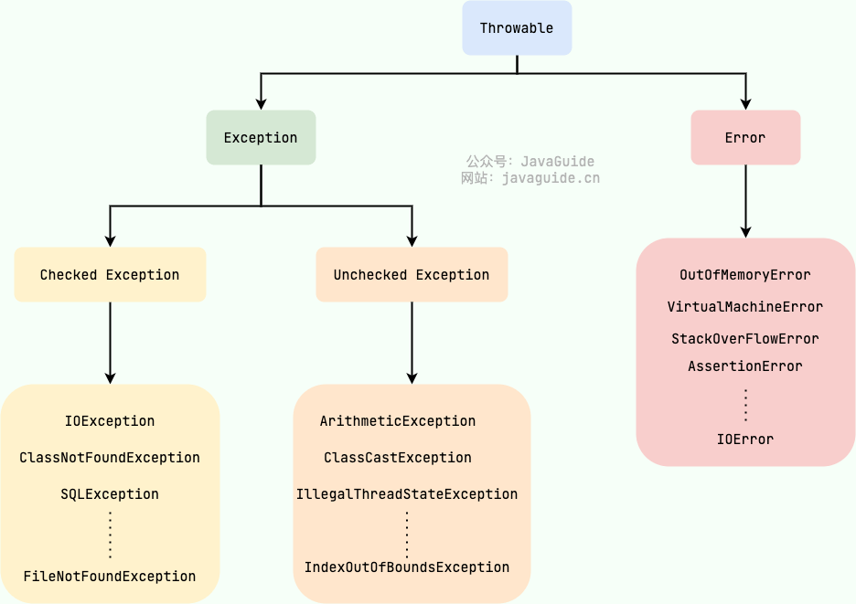
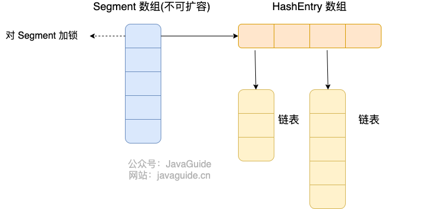
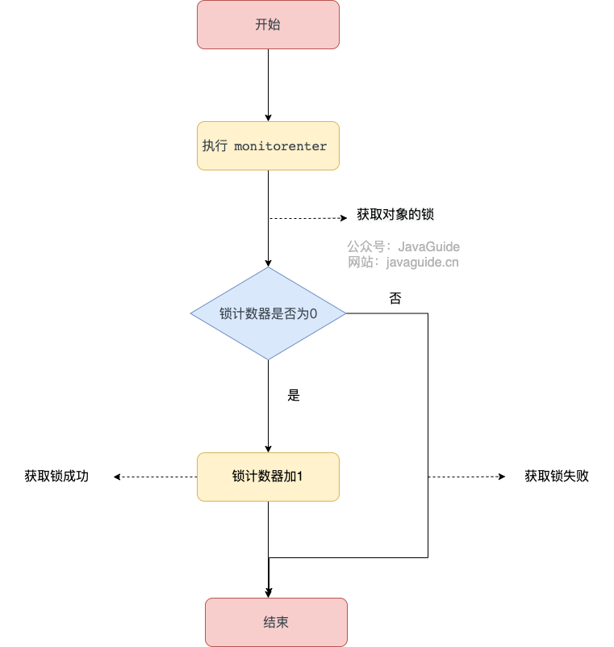
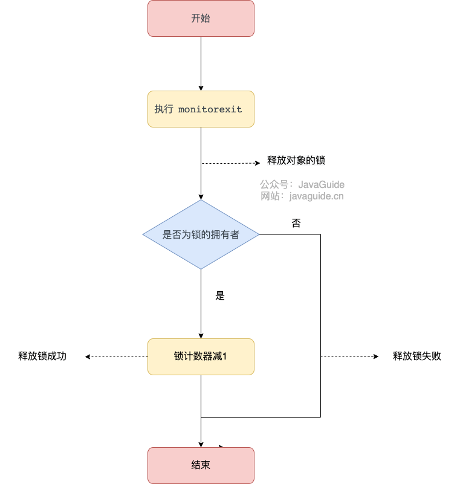
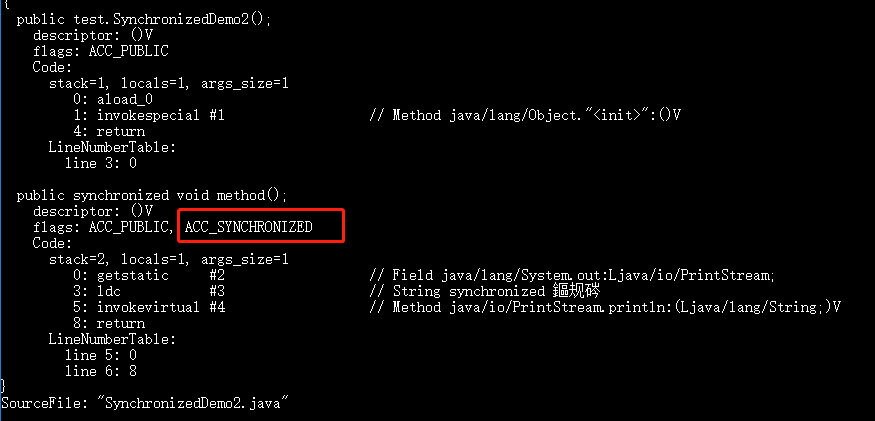
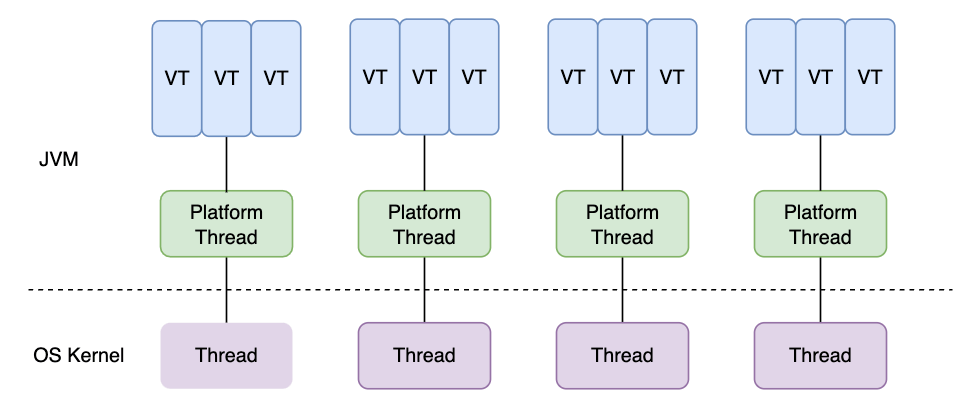
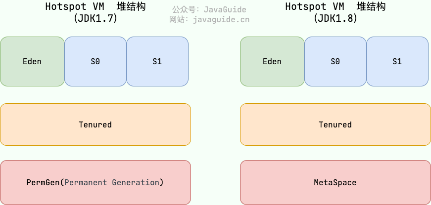

# ⭐️快手校招面试，难度不大，但体验感很差！

几个月前，一位读者参加秋招面试快手 Java 后端岗位，整个过程非常不愉快，据他所说是整个秋招体验最差的一次面试。

我身边不少面试快手的读者并没有反馈过类似的问题。个人觉得这个主要和面试官有关系，毕竟每个公司参与面试招聘的人非常多，鱼龙混杂的。

接下来，分享一下这位读者的面经，我会对涉及到的面试题补充上对应的参考答案。

## 拷打项目

### 认证登录这块为什么用 JWT？

相比于 Session 认证的方式来说，使用 JWT 进行身份认证主要有下面 4 个优势：

1. **无状态**：JWT 自身包含了身份验证所需要的所有信息，因此，我们的服务器不需要存储 JWT。这显然增加了系统的可用性和伸缩性，大大减轻了服务端的压力。
2. **有效避免了 CSRF 攻击**：CSRF 攻击需要依赖 Cookie。一般情况下我们使用 JWT 的话，在我们登录成功获得 JWT 之后，一般会选择存放在 localStorage 中。前端的每一个请求后续都会附带上这个 JWT，整个过程压根不会涉及到 Cookie。因此，即使你点击了非法链接发送了请求到服务端，这个非法请求也是不会携带 JWT 的，所以这个请求将是非法的。
3. **适合移动端应用**：只要 JWT 可以被客户端存储就能够使用。
4. **单点登录友好**：使用 Session 进行身份认证的话，实现单点登录，需要我们把用户的 Session 信息保存在一台电脑上，并且还会遇到常见的 Cookie 跨域的问题。但是，使用 JWT 进行认证的话， JWT 被保存在客户端，不会存在这些问题。

### 数据库直接保存的密码还是？

如果我们需要保存密码这类敏感数据到数据库的话，需要先加密再保存。

Spring Security 提供了多种加密算法的实现，开箱即用，非常方便。这些加密算法实现类的接口是 `PasswordEncoder` ，如果你想要自己实现一个加密算法的话，也需要实现 `PasswordEncoder` 接口。

`PasswordEncoder` 接口一共也就 3 个必须实现的方法。

```java
public interface PasswordEncoder {
    // 加密也就是对原始密码进行编码
    String encode(CharSequence var1);
    // 比对原始密码和数据库中保存的密码
    boolean matches(CharSequence var1, String var2);
    // 判断加密密码是否需要再次进行加密，默认返回 false
    default boolean upgradeEncoding(String encodedPassword) {
        return false;
    }
}
```


官方推荐使用基于 bcrypt 强哈希函数的加密算法实现类。

### 无状态有什么问题考虑过吗？强制让用户下线怎么弄？

由于 JWT 的无状态，也导致了它最大的缺点：**不可控！**

就比如说，我们想要在 JWT 有效期内废弃一个 JWT 或者更改它的权限的话，并不会立即生效，通常需要等到有效期过后才可以。再比如说，当用户 Logout 的话，JWT 也还有效。除非，我们在后端增加额外的处理逻辑比如将失效的 JWT 存储起来，后端先验证 JWT 是否有效再进行处理。

常见的解决办法有两种：

1. **将 JWT 存入数据库**：将有效的 JWT 存入数据库中，更建议使用内存数据库比如 Redis。如果需要让某个 JWT 失效就直接从 Redis 中删除这个 JWT 即可。但是，这样会导致每次使用 JWT 都要先从 Redis 中查询 JWT 是否存在的步骤，而且违背了 JWT 的无状态原则。
2. **黑名单机制**：和方案1类似，使用内存数据库比如 Redis 维护一个黑名单，如果想让某个 JWT 失效的话就直接将这个 JWT 加入到 **黑名单** 即可。然后，每次使用 JWT 进行请求的话都会先判断这个 JWT 是否存在于黑名单中。

虽然这两种方案都违背了 JWT 的无状态原则，但是一般实际项目中我们通常还是会使用这两种方案。

### 为什么用 Redis 而不用本地缓存呢？

| 特性 | 本地缓存 | Redis |
| --- | --- | --- |
| 数据一致性 | 多服务器部署时存在数据不一致问题 | 数据一致 |
| 内存限制 | 受限于单台服务器内存 | 独立部署，内存空间更大 |
| 数据丢失风险 | 服务器宕机数据丢失 | 可持久化，数据不易丢失 |
| 管理维护 | 分散，管理不便 | 集中管理，提供丰富的管理工具 |
| 功能丰富性 | 功能有限，通常只提供简单的键值对存储 | 功能丰富，支持多种数据结构和功能 |

### 项目用 Redis 缓存了什么数据？

Redis 除了可以用来缓存高频访问的数据之外，还以用来实现：

* **分布式锁**：通过 Redis 来做分布式锁是一种比较常见的方式。通常情况下，我们都是基于 Redisson 来实现分布式锁。关于 Redis 实现分布式锁的详细介绍，可以看我写的这篇文章：[如何基于 Redis 实现分布式锁？](https://mp.weixin.qq.com/s/y8kAflIenRpa4zIwCP_8iA)。
* **限流**：一般是通过 Redis + Lua 脚本的方式来实现限流。如果不想自己写 Lua 脚本的话，也可以直接利用 Redisson 中的 `RRateLimiter` 来实现分布式限流，其底层实现就是基于 Lua 代码+令牌桶算法。
* **消息队列**：Redis 自带的 List 数据结构可以作为一个简单的队列使用。Redis 5.0 中增加的 Stream 类型的数据结构更加适合用来做消息队列。它比较类似于 Kafka，有主题和消费组的概念，支持消息持久化以及 ACK 机制。
* **延时队列**：Redisson 内置了延时队列（基于 Sorted Set 实现的）。
* **分布式 Session** ：利用 String 或者 Hash 数据类型保存 Session 数据，所有的服务器都可以访问。
* **复杂业务场景**：通过 Redis 以及 Redis 扩展（比如 Redisson）提供的数据结构，我们可以很方便地完成很多复杂的业务场景比如通过 Bitmap 统计活跃用户、通过 Sorted Set 维护排行榜。

面试中，根据你项目的实际情况去回答即可！

相关阅读：

* [Redis 除了缓存还能做什么？可以做消息队列吗？](https://mp.weixin.qq.com/s/mSbI05eyZMe3hDBeRzuKvA)
* [Redis 八种常用数据类型常用命令和应用场景](https://mp.weixin.qq.com/s/tjf3nBq0GsTh564NTVUq3g)

### Redis 和 MySQL 数据是否会不一致，如何解决?

缓存和数据库中的数据不一致是很常见的一个问题，只要用缓存就会遇到。

举个例子：如果数据库中的数据有更新，但没有及时更新缓存或者更新缓存的时候缓存突然宕机，就会导致缓存中的数据是过期的，读取缓存就会返回旧数据。

缓存和数据库一致性保证细说的话可以扯很多，但是我觉得其实没太大必要。我个人觉得引入缓存之后，如果为了短时间的不一致性问题，选择让系统设计变得更加复杂的话，完全没必要。

下面单独对 **Cache Aside Pattern（旁路缓存模式）** 来聊聊。

Cache Aside Pattern 中遇到写请求是这样的：更新数据库，然后直接删除缓存 。

如果更新数据库成功，而删除缓存这一步失败的情况的话，简单说有两个解决方案：

1. **缓存失效时间变短（不推荐，治标不治本）**：我们让缓存数据的过期时间变短，这样的话缓存就会从数据库中加载数据。另外，这种解决办法对于先操作缓存后操作数据库的场景不适用。
2. **增加缓存更新重试机制（常用）**：如果缓存服务当前不可用导致缓存删除失败的话，我们就隔一段时间进行重试，重试次数可以自己定。不过，这里更适合引入消息队列实现异步重试，将删除缓存重试的消息投递到消息队列，然后由专门的消费者来重试删除缓存，直到成功。虽然说多引入了一个消息队列，但其整体带来的收益还是要更高一些。

相关文章推荐：[缓存和数据库一致性问题，看这篇就够了 - 水滴与银弹](https://mp.weixin.qq.com/s?__biz=MzIyOTYxNDI5OA==\&mid=2247487312\&idx=1\&sn=fa19566f5729d6598155b5c676eee62d\&chksm=e8beb8e5dfc931f3e35655da9da0b61c79f2843101c130cf38996446975014f958a6481aacf1\&scene=178\&cur_album_id=1699766580538032128#rd)。

### 项目统一异常处理这块是怎么做的？

推荐使用注解的方式统一异常处理，具体会使用到 `@ControllerAdvice` + `@ExceptionHandler` 这两个注解 。

```java
@ControllerAdvice
@ResponseBody
public class GlobalExceptionHandler {

    @ExceptionHandler(BaseException.class)
    public ResponseEntity<?> handleAppException(BaseException ex, HttpServletRequest request) {
      //......
    }

    @ExceptionHandler(value = ResourceNotFoundException.class)
    public ResponseEntity<ErrorReponse> handleResourceNotFoundException(ResourceNotFoundException ex, HttpServletRequest request) {
      //......
    }
}
```

这种异常处理方式下，会给所有或者指定的 `Controller` 织入异常处理的逻辑（AOP），当 `Controller` 中的方法抛出异常的时候，由被`@ExceptionHandler` 注解修饰的方法进行处理。

`ExceptionHandlerMethodResolver` 中 `getMappedMethod` 方法决定了异常具体被哪个被 `@ExceptionHandler` 注解修饰的方法处理异常。

```java
@Nullable
  private Method getMappedMethod(Class<? extends Throwable> exceptionType) {
    List<Class<? extends Throwable>> matches = new ArrayList<>();
    //找到可以处理的所有异常信息。mappedMethods 中存放了异常和处理异常的方法的对应关系
    for (Class<? extends Throwable> mappedException : this.mappedMethods.keySet()) {
      if (mappedException.isAssignableFrom(exceptionType)) {
        matches.add(mappedException);
      }
    }
    // 不为空说明有方法处理异常
    if (!matches.isEmpty()) {
      // 按照匹配程度从小到大排序
      matches.sort(new ExceptionDepthComparator(exceptionType));
      // 返回处理异常的方法
      return this.mappedMethods.get(matches.get(0));
    }
    else {
      return null;
    }
  }
```

从源代码看出：`getMappedMethod()`**会首先找到可以匹配处理异常的所有方法信息，然后对其进行从小到大的排序，最后取最小的那一个匹配的方法(即匹配度最高的那个)。**

## Java

### Java 异常类分为哪两种？有什么区别？

<font style="color:rgb(59, 69, 78);">Java 异常类层次结构图概览：</font>



<font style="color:rgb(59, 69, 78);">在 Java 中，所有的异常都有一个共同的祖先 </font><code><font style="color:rgb(59, 69, 78);">java.lang</font></code><font style="color:rgb(59, 69, 78);"> 包中的 </font><code><font style="color:rgb(59, 69, 78);">Throwable</font></code><font style="color:rgb(59, 69, 78);"> 类。</font><code><font style="color:rgb(59, 69, 78);">Throwable</font></code><font style="color:rgb(59, 69, 78);"> 类有两个重要的子类:</font>

* <code>**<font style="color:rgb(59, 69, 78);">Exception</font>**</code><font style="color:rgb(59, 69, 78);"> :程序本身可以处理的异常，可以通过 </font><code><font style="color:rgb(59, 69, 78);">catch</font></code><font style="color:rgb(59, 69, 78);"> 来进行捕获。</font><code><font style="color:rgb(59, 69, 78);">Exception</font></code><font style="color:rgb(59, 69, 78);"> 又可以分为 Checked Exception (受检查异常，必须处理) 和 Unchecked Exception (不受检查异常，可以不处理)。</font>
* <code>**<font style="color:rgb(59, 69, 78);">Error</font>**</code><font style="color:rgb(59, 69, 78);">：</font><code><font style="color:rgb(59, 69, 78);">Error</font></code><font style="color:rgb(59, 69, 78);"> 属于程序无法处理的错误 ，</font>~~<font style="color:rgb(59, 69, 78);">我们没办法通过 </font>~~<code>~~<font style="color:rgb(59, 69, 78);">catch</font>~~</code>~~<font style="color:rgb(59, 69, 78);"> 来进行捕获</font>~~<font style="color:rgb(59, 69, 78);">不建议通过</font><code><font style="color:rgb(59, 69, 78);">catch</font></code><font style="color:rgb(59, 69, 78);">捕获 。例如 Java 虚拟机运行错误（</font><code><font style="color:rgb(59, 69, 78);">Virtual MachineError</font></code><font style="color:rgb(59, 69, 78);">）、虚拟机内存不够错误(</font><code><font style="color:rgb(59, 69, 78);">OutOfMemoryError</font></code><font style="color:rgb(59, 69, 78);">)、类定义错误（</font><code><font style="color:rgb(59, 69, 78);">NoClassDefFoundError</font></code><font style="color:rgb(59, 69, 78);">）等 。这些异常发生时，Java 虚拟机（JVM）一般会选择线程终止。</font>

### <font style="color:rgb(59, 69, 78);">try-with-resources 怎么使用？</font>

1. **适用范围（资源的定义）：**<font style="color:rgb(59, 69, 78);"> 任何实现 </font><code><font style="color:rgb(59, 69, 78);">java.lang.AutoCloseable</font></code><font style="color:rgb(59, 69, 78);">或者 </font><code><font style="color:rgb(59, 69, 78);">java.io.Closeable</font></code><font style="color:rgb(59, 69, 78);"> 的对象</font>
2. **关闭资源和 finally 块的执行顺序：**<font style="color:rgb(59, 69, 78);"> 在 </font><code><font style="color:rgb(59, 69, 78);">try-with-resources</font></code><font style="color:rgb(59, 69, 78);"> 语句中，任何 catch 或 finally 块在声明的资源关闭后运行</font>

<font style="color:rgb(59, 69, 78);">《Effective Java》中明确指出：</font>

> <font style="color:rgb(59, 69, 78);">面对必须要关闭的资源，我们总是应该优先使用 </font><code><font style="color:rgb(59, 69, 78);">try-with-resources</font></code><font style="color:rgb(59, 69, 78);"> 而不是</font><code><font style="color:rgb(59, 69, 78);">try-finally</font></code><font style="color:rgb(59, 69, 78);">。随之产生的代码更简短，更清晰，产生的异常对我们也更有用。</font><code><font style="color:rgb(59, 69, 78);">try-with-resources</font></code><font style="color:rgb(59, 69, 78);">语句让我们更容易编写必须要关闭的资源的代码，若采用</font><code><font style="color:rgb(59, 69, 78);">try-finally</font></code><font style="color:rgb(59, 69, 78);">则几乎做不到这点。</font>

<font style="color:rgb(59, 69, 78);">Java 中类似于</font><code><font style="color:rgb(59, 69, 78);">InputStream</font></code><font style="color:rgb(59, 69, 78);">、</font><code><font style="color:rgb(59, 69, 78);">OutputStream</font></code><font style="color:rgb(59, 69, 78);">、</font><code><font style="color:rgb(59, 69, 78);">Scanner</font></code><font style="color:rgb(59, 69, 78);">、</font><code><font style="color:rgb(59, 69, 78);">PrintWriter</font></code><font style="color:rgb(59, 69, 78);">等的资源都需要我们调用</font><code><font style="color:rgb(59, 69, 78);">close()</font></code><font style="color:rgb(59, 69, 78);">方法来手动关闭，一般情况下我们都是通过</font><code><font style="color:rgb(59, 69, 78);">try-catch-finally</font></code><font style="color:rgb(59, 69, 78);">语句来实现这个需求，如下：</font>

```java
//读取文本文件的内容
Scanner scanner = null;
try {
    scanner = new Scanner(new File("D://read.txt"));
    while (scanner.hasNext()) {
        System.out.println(scanner.nextLine());
    }
} catch (FileNotFoundException e) {
    e.printStackTrace();
} finally {
    if (scanner != null) {
        scanner.close();
    }
}
```

<font style="color:rgb(59, 69, 78);">使用 Java 7 之后的 </font><code><font style="color:rgb(59, 69, 78);">try-with-resources</font></code><font style="color:rgb(59, 69, 78);"> 语句改造上面的代码:</font>

```java
try (Scanner scanner = new Scanner(new File("test.txt"))) {
    while (scanner.hasNext()) {
        System.out.println(scanner.nextLine());
    }
} catch (FileNotFoundException fnfe) {
    fnfe.printStackTrace();
}
```

<font style="color:rgb(59, 69, 78);">当然多个资源需要关闭的时候，使用 </font><code><font style="color:rgb(59, 69, 78);">try-with-resources</font></code><font style="color:rgb(59, 69, 78);"> 实现起来也非常简单，如果你还是用</font><code><font style="color:rgb(59, 69, 78);">try-catch-finally</font></code><font style="color:rgb(59, 69, 78);">可能会带来很多问题。</font>

<font style="color:rgb(59, 69, 78);">通过使用分号分隔，可以在</font><code><font style="color:rgb(59, 69, 78);">try-with-resources</font></code><font style="color:rgb(59, 69, 78);">块中声明多个资源。</font>

```java
try (BufferedInputStream bin = new BufferedInputStream(new FileInputStream(new File("test.txt")));
     BufferedOutputStream bout = new BufferedOutputStream(new FileOutputStream(new File("out.txt")))) {
    int b;
    while ((b = bin.read()) != -1) {
        bout.write(b);
    }
}
catch (IOException e) {
    e.printStackTrace();
}
```

<font style="color:rgb(59, 69, 78);">更多 Java 基础相关的面试题，可以参考这几篇文章：</font>

* [Java 基础常见面试题总结（上）](https://javaguide.cn/java/basis/java-basic-questions-01.html)
* [Java 基础常见面试题总结（中）](https://javaguide.cn/java/basis/java-basic-questions-02.html)
* [Java 基础常见面试题总结（下）](https://javaguide.cn/java/basis/java-basic-questions-03.html)

### HashMap 为什么不是线程安全的？

JDK1.7 及之前版本，在多线程环境下，`HashMap` 扩容时会造成死循环和数据丢失的问题。

数据丢失这个在 JDK1.7 和 JDK 1.8 中都存在，这里以 JDK 1.8 为例进行介绍。

JDK 1.8 后，在 `HashMap` 中，多个键值对可能会被分配到同一个桶（bucket），并以链表或红黑树的形式存储。多个线程对 `HashMap` 的 `put` 操作会导致线程不安全，具体来说会有数据覆盖的风险。

举个例子：

* 两个线程 1,2 同时进行 put 操作，并且发生了哈希冲突（hash 函数计算出的插入下标是相同的）。
* 不同的线程可能在不同的时间片获得 CPU 执行的机会，当前线程 1 执行完哈希冲突判断后，由于时间片耗尽挂起。线程 2 先完成了插入操作。
* 随后，线程 1 获得时间片，由于之前已经进行过 hash 碰撞的判断，所有此时会直接进行插入，这就导致线程 2 插入的数据被线程 1 覆盖了。

```java
public V put(K key, V value) {
    return putVal(hash(key), key, value, false, true);
}

final V putVal(int hash, K key, V value, boolean onlyIfAbsent,
                   boolean evict) {
    // ...
    // 判断是否出现 hash 碰撞
    // (n - 1) & hash 确定元素存放在哪个桶中，桶为空，新生成结点放入桶中(此时，这个结点是放在数组中)
    if ((p = tab[i = (n - 1) & hash]) == null)
        tab[i] = newNode(hash, key, value, null);
    // 桶中已经存在元素（处理hash冲突）
    else {
    // ...
}
```

还有一种情况是这两个线程同时 `put` 操作导致 `size` 的值不正确，进而导致数据覆盖的问题：

1. 线程 1 执行 `if(++size > threshold)` 判断时，假设获得 `size` 的值为 10，由于时间片耗尽挂起。
2. 线程 2 也执行 `if(++size > threshold)` 判断，获得 `size` 的值也为 10，并将元素插入到该桶位中，并将 `size` 的值更新为 11。
3. 随后，线程 1 获得时间片，它也将元素放入桶位中，并将 size 的值更新为 11。
4. 线程 1、2 都执行了一次 `put` 操作，但是 `size` 的值只增加了 1，也就导致实际上只有一个元素被添加到了 `HashMap` 中。

```java
public V put(K key, V value) {
    return putVal(hash(key), key, value, false, true);
}

final V putVal(int hash, K key, V value, boolean onlyIfAbsent,
                   boolean evict) {
    // ...
    // 实际大小大于阈值则扩容
    if (++size > threshold)
        resize();
    // 插入后回调
    afterNodeInsertion(evict);
    return null;
}
```

### 那 HashMap 线程安全的替代品是？

<font style="color:rgb(59, 69, 78);">我们知道，</font><code><font style="color:rgb(59, 69, 78);">HashMap</font></code><font style="color:rgb(59, 69, 78);"> 是线程不安全的，如果在并发场景下使用，一种常见的解决方式是通过 </font><code><font style="color:rgb(59, 69, 78);">Collections.synchronizedMap()</font></code><font style="color:rgb(59, 69, 78);"> 方法对 </font><code><font style="color:rgb(59, 69, 78);">HashMap</font></code><font style="color:rgb(59, 69, 78);"> 进行包装，使其变为线程安全。不过，这种方式是通过一个全局锁来同步不同线程间的并发访问，会导致严重的性能瓶颈，尤其是在高并发场景下。</font>

<font style="color:rgb(59, 69, 78);">为了解决这一问题，</font><code><font style="color:rgb(59, 69, 78);">ConcurrentHashMap</font></code><font style="color:rgb(59, 69, 78);"> 应运而生，作为 </font><code><font style="color:rgb(59, 69, 78);">HashMap</font></code><font style="color:rgb(59, 69, 78);"> 的线程安全版本，它提供了更高效的并发处理能力。</font>

<font style="color:rgb(59, 69, 78);">在 JDK1.7 的时候，</font><code><font style="color:rgb(59, 69, 78);">ConcurrentHashMap</font></code><font style="color:rgb(59, 69, 78);"> 对整个桶数组进行了分割分段(</font><code><font style="color:rgb(59, 69, 78);">Segment</font></code><font style="color:rgb(59, 69, 78);">，分段锁)，每一把锁只锁容器其中一部分数据（下面有示意图），多线程访问容器里不同数据段的数据，就不会存在锁竞争，提高并发访问率。</font>



<font style="color:rgb(59, 69, 78);">到了 JDK1.8 的时候，</font><code><font style="color:rgb(59, 69, 78);">ConcurrentHashMap</font></code><font style="color:rgb(59, 69, 78);"> 取消了 </font><code><font style="color:rgb(59, 69, 78);">Segment</font></code><font style="color:rgb(59, 69, 78);"> 分段锁，采用 </font><code><font style="color:rgb(59, 69, 78);">Node + CAS + synchronized</font></code><font style="color:rgb(59, 69, 78);"> 来保证并发安全。数据结构跟 </font><code><font style="color:rgb(59, 69, 78);">HashMap</font></code><font style="color:rgb(59, 69, 78);"> 1.8 的结构类似，数组+链表/红黑二叉树。Java 8 在链表长度超过一定阈值（8）时将链表（寻址时间复杂度为 O(N)）转换为红黑树（寻址时间复杂度为 O(log(N))）。</font>

<font style="color:rgb(59, 69, 78);">Java 8 中，锁粒度更细，</font><code><font style="color:rgb(59, 69, 78);">synchronized</font></code><font style="color:rgb(59, 69, 78);"> 只锁定当前链表或红黑二叉树的首节点，这样只要 hash 不冲突，就不会产生并发，就不会影响其他 Node 的读写，效率大幅提升。</font>


<font style="color:rgb(59, 69, 78);">更多 Java 集合相关的面试题，可以参考这几篇文章：</font>

* [Java 集合常见面试题总结（上）](https://javaguide.cn/java/collection/java-collection-questions-01.html)
* [Java 集合常见面试题总结（中）](https://javaguide.cn/java/collection/java-collection-questions-02.html)
* [Java 集合常见面试题总结（下）](https://javaguide.cn/java/collection/java-collection-questions-01.html)

### 可重入锁指的是？

**可重入锁** 也叫递归锁，指的是线程可以再次获取自己的内部锁。比如一个线程获得了某个对象的锁，此时这个对象锁还没有释放，当其再次想要获取这个对象的锁的时候还是可以获取的，如果是不可重入锁的话，就会造成死锁。

### synchronized 是可重入锁吗？

JDK 提供的所有现成的 `Lock` 实现类，包括 `synchronized` 关键字锁都是可重入的。

在下面的代码中，`method1()` 和 `method2()`都被 `synchronized` 关键字修饰，`method1()`调用了`method2()`。

```java
public class SynchronizedDemo {
    public synchronized void method1() {
        System.out.println("方法1");
        method2();
    }

    public synchronized void method2() {
        System.out.println("方法2");
    }
}
```

由于 `synchronized`锁是可重入的，同一个线程在调用`method1()` 时可以直接获得当前对象的锁，执行 `method2()` 的时候可以再次获取这个对象的锁，不会产生死锁问题。假如`synchronized`是不可重入锁的话，由于该对象的锁已被当前线程所持有且无法释放，这就导致线程在执行 `method2()`时获取锁失败，会出现死锁问题。

### 讲一下synchronized这个锁

`synchronized` 是 Java 中的一个关键字，翻译成中文是同步的意思，主要解决的是多个线程之间访问资源的同步性，可以保证被它修饰的方法或者代码块在任意时刻只能有一个线程执行。

在 Java 早期版本中，`synchronized` 属于 **重量级锁**，效率低下。这是因为监视器锁（monitor）是依赖于底层的操作系统的 `Mutex Lock` 来实现的，Java 的线程是映射到操作系统的原生线程之上的。如果要挂起或者唤醒一个线程，都需要操作系统帮忙完成，而操作系统实现线程之间的切换时需要从用户态转换到内核态，这个状态之间的转换需要相对比较长的时间，时间成本相对较高。

不过，在 Java 6 之后， `synchronized` 引入了大量的优化如自旋锁、适应性自旋锁、锁消除、锁粗化、偏向锁、轻量级锁等技术来减少锁操作的开销，这些优化让 `synchronized` 锁的效率提升了很多。因此， `synchronized` 还是可以在实际项目中使用的，像 JDK 源码、很多开源框架都大量使用了 `synchronized` 。

关于偏向锁多补充一点：由于偏向锁增加了 JVM 的复杂性，同时也并没有为所有应用都带来性能提升。因此，在 JDK15 中，偏向锁被默认关闭（仍然可以使用 `-XX:+UseBiasedLocking` 启用偏向锁），在 JDK18 中，偏向锁已经被彻底废弃（无法通过命令行打开）。

### synchronized 底层命令

`synchronized` 同步语句块的实现使用的是 `monitorenter` 和 `monitorexit` 指令，其中 `monitorenter` 指令指向同步代码块的开始位置，`monitorexit` 指令则指明同步代码块的结束位置。





`synchronized` 修饰的方法并没有 `monitorenter` 指令和 `monitorexit` 指令，取而代之的是 `ACC_SYNCHRONIZED` 标识，该标识指明了该方法是一个同步方法。



不过，两者的本质都是对对象监视器 monitor 的获取。

### 讲一下 CAS

CAS 的全称是 **Compare And Swap（比较与交换）** ，用于实现乐观锁，被广泛应用于各大框架中。CAS 的思想很简单，就是用一个预期值和要更新的变量值进行比较，两值相等才会进行更新。

CAS 是一个原子操作，底层依赖于一条 CPU 的原子指令。

> **原子操作** 即最小不可拆分的操作，也就是说操作一旦开始，就不能被打断，直到操作完成。

CAS 涉及到三个操作数：

* **V**：要更新的变量值(Var)
* **E**：预期值(Expected)
* **N**：拟写入的新值(New)

当且仅当 V 的值等于 E 时，CAS 通过原子方式用新值 N 来更新 V 的值。如果不等，说明已经有其它线程更新了 V，则当前线程放弃更新。

**举一个简单的例子**：线程 A 要修改变量 i 的值为 6，i 原值为 1（V = 1，E=1，N=6，假设不存在 ABA 问题）。

1. i 与 1 进行比较，如果相等， 则说明没被其他线程修改，可以被设置为 6 。
2. i 与 1 进行比较，如果不相等，则说明被其他线程修改，当前线程放弃更新，CAS 操作失败。

当多个线程同时使用 CAS 操作一个变量时，只有一个会胜出，并成功更新，其余均会失败，但失败的线程并不会被挂起，仅是被告知失败，并且允许再次尝试，当然也允许失败的线程放弃操作。

关于 Java 中 CAS 的底层实现方式可以阅读这篇文章：[什么是乐观锁和悲观锁？Java 中 CAS 是如何实现的？](https://mp.weixin.qq.com/s/L05pSKz07zTU_6uJSKjV1w)。

更多 Java 并发相关的面试题，可以参考这几篇文章：

* [Java 并发常见面试题总结（上）](https://javaguide.cn/java/concurrent/java-concurrent-questions-01.html)
* [Java 并发常见面试题总结（中）](https://javaguide.cn/java/concurrent/java-concurrent-questions-02.html)
* [Java 并发常见面试题总结（下）](https://javaguide.cn/java/concurrent/java-concurrent-questions-03.html)

### 说一下 JDK 21 最重要的新特性

虚拟线程在 JDK21 顺利转正，这是非常有标志性的一个新特性。

虚拟线程（Virtual Thread）是 JDK 而不是 OS 实现的轻量级线程(Lightweight Process，LWP），由 JVM 调度。许多虚拟线程共享同一个操作系统线程，虚拟线程的数量可以远大于操作系统线程的数量。

在引入虚拟线程之前，`java.lang.Thread` 包已经支持所谓的平台线程，也就是没有虚拟线程之前，我们一直使用的线程。JVM 调度程序通过平台线程（载体线程）来管理虚拟线程，一个平台线程可以在不同的时间执行不同的虚拟线程（多个虚拟线程挂载在一个平台线程上），当虚拟线程被阻塞或等待时，平台线程可以切换到执行另一个虚拟线程。

虚拟线程、平台线程和系统内核线程的关系图如下所示（图源：[How to Use Java 19 Virtual Threads](https://medium.com/javarevisited/how-to-use-java-19-virtual-threads-c16a32bad5f7)）：



相比较于平台线程来说，虚拟线程是廉价且轻量级的，使用完后立即被销毁，因此它们不需要被重用或池化，每个任务可以有自己专属的虚拟线程来运行。虚拟线程暂停和恢复来实现线程之间的切换，避免了上下文切换的额外耗费，兼顾了多线程的优点，简化了高并发程序的复杂，可以有效减少编写、维护和观察高吞吐量并发应用程序的工作量。

虚拟线程在其他多线程语言中已经被证实是十分有用的，比如 Go 中的 Goroutine、Erlang 中的进程。

### 堆内存的结构是？

<font style="color:rgb(59, 69, 78);">在 JDK 7 版本及 JDK 7 版本之前，堆内存被通常分为下面三部分：</font>

1. <font style="color:rgb(59, 69, 78);">新生代内存(Young Generation)</font>
2. <font style="color:rgb(59, 69, 78);">老生代(Old Generation)</font>
3. <font style="color:rgb(59, 69, 78);">永久代(Permanent Generation)</font>

<font style="color:rgb(59, 69, 78);">下图所示的 Eden 区、两个 Survivor 区 S0 和 S1 都属于新生代，中间一层属于老年代，最下面一层属于永久代。</font>



**<font style="color:rgb(59, 69, 78);">JDK 8 版本之后 PermGen(永久) 已被 Metaspace(元空间) 取代，元空间使用的是直接内存</font>**<font style="color:rgb(59, 69, 78);"> 。</font>

### 对象会被分配都哪个区域？

<font style="color:rgb(59, 69, 78);">大部分情况，对象都会首先在 Eden 区域分配。如果对象在 Eden 出生并经过第一次 Minor GC 后仍然能够存活，并且能被 Survivor 容纳的话，将被移动到 Survivor 空间（s0 或者 s1）中，并将对象年龄设为 1(Eden 区->Survivor 区后对象的初始年龄变为 1)。</font>

<font style="color:rgb(59, 69, 78);">对象在 Survivor 中每熬过一次 MinorGC,年龄就增加 1 岁，当它的年龄增加到一定程度（默认为 15 岁），就会被晋升到老年代中。对象晋升到老年代的年龄阈值，可以通过参数 </font><code><font style="color:rgb(59, 69, 78);">-XX:MaxTenuringThreshold</font></code><font style="color:rgb(59, 69, 78);"> 来设置。</font>

### JDK 默认垃圾回收器是？

* **<font style="color:rgb(59, 69, 78);">JDK 1.8 默认垃圾回收器</font>**<font style="color:rgb(59, 69, 78);">：Parallel Scanvenge（新生代）+ Parallel Old（老年代）。 这个组合也被称为 Parallel GC 或 Throughput GC，侧重于吞吐量。</font>
* **<font style="color:rgb(59, 69, 78);">JDK 1.9 及以后默认垃圾回收器</font>**<font style="color:rgb(59, 69, 78);">：G1 GC (Garbage-First Garbage Collector)。 G1 GC 是一个更现代化的垃圾回收器，旨在平衡吞吐量和停顿时间，尤其适用于堆内存较大的应用。</font>

<font style="color:rgb(59, 69, 78);">更多 JVM 相关的面试题，可以参考这几篇文章：</font>

* [Java 内存区域详解（重点）](https://javaguide.cn/java/jvm/memory-area.html)
* [JVM 垃圾回收详解（重点）](https://javaguide.cn/java/jvm/jvm-garbage-collection.html)
* [类文件结构详解](https://javaguide.cn/java/jvm/class-file-structure.html)
* [类加载过程详解](https://javaguide.cn/java/jvm/class-loading-process.html)
* [类加载器详解（重点）](https://javaguide.cn/java/jvm/classloader.html)

### 你知道哪些 Java 性能优化和问题排查工具？

<font style="color:rgb(59, 69, 78);">JDK 自带的可视化分析工具：</font>

* **<font style="color:rgb(59, 69, 78);">JConsole</font>**<font style="color:rgb(59, 69, 78);"> ：基于 JMX 的可视化监视、管理工具，可以用于查看应用程序的运行概况、内存、线程、类、VM 概括、MBean 等信息。</font>
* **<font style="color:rgb(59, 69, 78);">VisualVM</font>**<font style="color:rgb(59, 69, 78);">：基于 NetBeans 平台开发，具备了插件扩展功能的特性。利用它不仅能够监控服务的 CPU、内存、线程、类等信息，还可以捕获有关 JVM 软件实例的数据，并将该数据保存到本地系统，以供后期查看或与其他用户共享。根据《深入理解 Java 虚拟机》介绍：“VisualVM 的性能分析功能甚至比起 JProfiler、YourKit 等专业且收费的 Profiling 工具都不会逊色多少，而且 VisualVM 还有一个很大的优点：不需要被监视的程序基于特殊 Agent 运行，因此他对应用程序的实际性能的影响很小，使得他可以直接应用在生产环境中。这个优点是 JProfiler、YourKit 等工具无法与之媲美的”。</font>

<font style="color:rgb(59, 69, 78);">JDK 自带的命令行工具：</font>

* <code>**<font style="color:rgb(59, 69, 78);">jps</font>**</code><font style="color:rgb(59, 69, 78);"> (JVM Process Status）: 类似 UNIX 的 </font><code><font style="color:rgb(59, 69, 78);">ps</font></code><font style="color:rgb(59, 69, 78);"> 命令。用于查看所有 Java 进程的启动类、传入参数和 Java 虚拟机参数等信息；</font>
* <code>**<font style="color:rgb(59, 69, 78);">jstat</font>**</code><font style="color:rgb(59, 69, 78);">（JVM Statistics Monitoring Tool）: 用于收集 HotSpot 虚拟机各方面的运行数据;</font>
* <code>**<font style="color:rgb(59, 69, 78);">jinfo</font>**</code><font style="color:rgb(59, 69, 78);"> (Configuration Info for Java) : Configuration Info for Java,显示虚拟机配置信息;</font>
* <code>**<font style="color:rgb(59, 69, 78);">jmap</font>**</code><font style="color:rgb(59, 69, 78);"> (Memory Map for Java) : 生成堆转储快照;</font>
* <code>**<font style="color:rgb(59, 69, 78);">jhat</font>**</code><font style="color:rgb(59, 69, 78);"> (JVM Heap Dump Browser) : 用于分析 heapdump 文件，它会建立一个 HTTP/HTML 服务器，让用户可以在浏览器上查看分析结果。JDK9 移除了 jhat；</font>
* <code>**<font style="color:rgb(59, 69, 78);">jstack</font>**</code><font style="color:rgb(59, 69, 78);"> (Stack Trace for Java) : 生成虚拟机当前时刻的线程快照，线程快照就是当前虚拟机内每一条线程正在执行的方法堆栈的集合。</font>

<font style="color:rgb(59, 69, 78);">第三方工具：</font>

* **<font style="color:rgb(59, 69, 78);">MAT</font>**<font style="color:rgb(59, 69, 78);">：一款功能强大的 Java 堆内存分析器，可以用于查找内存泄漏以及查看内存消耗情况，用户可以利用 VisualVM 或者是 </font><code><font style="color:rgb(59, 69, 78);">jmap</font></code><font style="color:rgb(59, 69, 78);"> 命令生产堆文件，然后导入工具中进行分析。</font>
* **<font style="color:rgb(59, 69, 78);">GCeasy</font>**<font style="color:rgb(59, 69, 78);">：一款在线的 GC 日志分析器，使用起来非常方便，用户可以通过它的 Web 网站导入 GC 日志，实时进行内存泄漏检测、GC 暂停原因分析、JVM 配置建议优化等功能。网站地址：</font><https://gceasy.io/><font style="color:rgb(59, 69, 78);"> 。</font>
* **<font style="color:rgb(59, 69, 78);">GCViewer</font>**<font style="color:rgb(59, 69, 78);">：一款非常强大的 GC 日志可视化分析工具，功能强大而且完全免费。</font>
* **<font style="color:rgb(59, 69, 78);">JProfiler</font>**<font style="color:rgb(59, 69, 78);">：一款商用的性能分析利器，功能强大，但需要付费使用。 它提供更深入的性能分析功能，例如方法调用分析、内存分配分析等。</font>
* **<font style="color:rgb(59, 69, 78);">Arthas</font>**<font style="color:rgb(59, 69, 78);">：阿里开源的一款线上监控诊断工具，可以查看应用负载、内存、gc、线程等信息。</font>

### <font style="color:rgb(59, 69, 78);">怎么查看 Java 中的内存占用？</font>

<font style="color:rgb(59, 69, 78);">JDK 内置工具：</font>

1. <font style="color:rgb(59, 69, 78);">JConsole：基于 JMX 的可视化监视、管理工具。可以很方便的监视本地及远程服务器的 Java 进程的内存使用情况。</font>
2. <font style="color:rgb(59, 69, 78);">JVisualVM：比JConsole更强大，支持Java进程监控、堆内存使用情况分析等功能。</font>

<font style="color:rgb(59, 69, 78);">JDK 内置命令：</font>

1. <font style="color:rgb(59, 69, 78);">jstat ：显示本地或者远程（需要远程主机提供 RMI 支持）虚拟机进程中的类信息、内存、垃圾收集、JIT 编译等运行数据。</font>
2. <font style="color:rgb(59, 69, 78);">jmap：生成堆转储快照。</font>

<font style="color:rgb(59, 69, 78);">功能更强大的工具：</font>

1. <font style="color:rgb(59, 69, 78);">Arthas：阿里开源的一款线上监控诊断产品，通过全局视角实时查看应用 load、内存、gc、线程的状态信息，并能在不修改应用代码的情况下，对业务问题进行诊断，包括查看方法调用的出入参、异常，监测方法执行耗时，类加载信息等，大大提升线上问题排查效率。</font>
2. <font style="color:rgb(59, 69, 78);">MAT：一款快速便捷且功能强大丰富的 JVM 堆内存离线分析工具。其通过展现 JVM 异常时所记录的运行时堆转储快照（Heap dump）状态（正常运行时也可以做堆转储分析），帮助定位内存泄漏问题或优化大内存消耗逻辑。</font>

## Spring Boot

### Spring Boot 的自动配置是如何实现的?

Spring Boot 的自动配置机制是通过 `@SpringBootApplication` 注解启动的，这个注解本质上是几个关键注解的组合。我们可以将 `@SpringBootApplication` 看作是 `@Configuration`、`@EnableAutoConfiguration` 和 `@ComponentScan` 注解的集合。

* `@EnableAutoConfiguration`: 启用 Spring Boot 的自动配置机制。它是自动配置的核心，允许 Spring Boot 根据项目的依赖和配置自动配置 Spring 应用的各个部分。
* `@ComponentScan`: 启用组件扫描，扫描被 `@Component`（以及 `@Service`、`@Controller` 等）注解的类，并将这些类注册为 Spring 容器中的 Bean。默认情况下，它会扫描该类所在包及其子包下的所有类。
* `@Configuration`: 允许在上下文中注册额外的 Bean 或导入其他配置类。它相当于一个具有 `@Bean` 方法的 Spring 配置类。

`@EnableAutoConfiguration`是启动自动配置的关键，源码如下(建议自己打断点调试，走一遍基本的流程)：

```java
import java.lang.annotation.Documented;
import java.lang.annotation.ElementType;
import java.lang.annotation.Inherited;
import java.lang.annotation.Retention;
import java.lang.annotation.RetentionPolicy;
import java.lang.annotation.Target;
import org.springframework.context.annotation.Import;

@Target({ElementType.TYPE})
@Retention(RetentionPolicy.RUNTIME)
@Documented
@Inherited
@AutoConfigurationPackage
@Import({AutoConfigurationImportSelector.class})
public @interface EnableAutoConfiguration {
    String ENABLED_OVERRIDE_PROPERTY = "spring.boot.enableautoconfiguration";

    Class<?>[] exclude() default {};

    String[] excludeName() default {};
}
```

这个注解通过 `@Import` 导入了 `AutoConfigurationImportSelector` 类，而 `AutoConfigurationImportSelector` 是自动配置的核心类之一。`@Import` 注解的作用是将指定的配置类或 Bean 导入到当前的配置类中。

`AutoConfigurationImportSelector` 类的 `getCandidateConfigurations` 方法会加载所有可用的自动配置类，并将这些类的信息以 `List` 的形式返回。这些配置类会被 Spring 容器管理为 Bean，从而实现自动配置。

```java
    protected List<String> getCandidateConfigurations(AnnotationMetadata metadata, AnnotationAttributes attributes) {
        List<String> configurations = SpringFactoriesLoader.loadFactoryNames(getSpringFactoriesLoaderFactoryClass(),
                getBeanClassLoader());
        Assert.notEmpty(configurations, "No auto configuration classes found in META-INF/spring.factories. If you "
                + "are using a custom packaging, make sure that file is correct.");
        return configurations;
    }
```

这里使用了 `SpringFactoriesLoader` 来加载位于 `META-INF/spring.factories` 文件中的自动配置类。这些配置类会根据应用的具体条件（例如类路径中的依赖）自动配置相应的组件。

**自动配置信息有了，那么自动配置还差什么呢？**

`@Conditional` 注解！在自动配置类中，Spring Boot 使用了一系列条件注解（如 `@Conditional`、`@ConditionalOnClass`、`@ConditionalOnBean` 等）来判断某些配置是否应该生效。这些注解是 `@Conditional` 注解的扩展，用于在特定条件满足时才启用相应的配置。

例如，在 Spring Security 的自动配置中，有一个名为 `SecurityAutoConfiguration` 的自动配置类，它导入了 `WebSecurityEnablerConfiguration` 类。

`WebSecurityEnablerConfiguration` 类的源码如下：

```java
@Configuration
@ConditionalOnBean(WebSecurityConfigurerAdapter.class)
@ConditionalOnMissingBean(name = BeanIds.SPRING_SECURITY_FILTER_CHAIN)
@ConditionalOnWebApplication(type = ConditionalOnWebApplication.Type.SERVLET)
@EnableWebSecurity
public class WebSecurityEnablerConfiguration {

}
```

`WebSecurityEnablerConfiguration`类中使用`@ConditionalOnBean`指定了容器中必须还有`WebSecurityConfigurerAdapter` 类或其实现类。所以，一般情况下 Spring Security 配置类都会去实现 `WebSecurityConfigurerAdapter`，这样自动将配置就完成了。

最后，简单总结一下：Spring Boot 的自动配置机制通过 `@EnableAutoConfiguration` 启动。该注解利用 `@Import` 注解导入了 `AutoConfigurationImportSelector` 类，而 `AutoConfigurationImportSelector` 类则负责加载并管理所有的自动配置类。这些自动配置类通常在`META-INF/spring.factories` 文件中声明，并根据项目的依赖和配置条件，通过条件注解（如 `@ConditionalOnClass`、`@ConditionalOnBean` 等）判断是否应该生效。

### 常用的 Bean 映射工具有哪些？

我们经常在代码中会对一个数据结构封装成DO、SDO、DTO、VO等，而这些Bean中的大部分属性都是一样的，所以使用属性拷贝类工具可以帮助我们节省大量的 set 和 get 操作。

常用的 Bean 映射工具有：Spring BeanUtils、Apache BeanUtils、MapStruct、ModelMapper、Dozer、Orika、JMapper 。

由于 Apache BeanUtils 、Dozer 、ModelMapper 性能太差，所以不建议使用。MapStruct 性能更好而且使用起来比较灵活，是一个比较不错的选择。

### Spring Boot 中如何实现定时任务 ?

我们使用 `@Scheduled` 注解就能很方便地创建一个定时任务。

```java
@Component
public class ScheduledTasks {
    private static final Logger log = LoggerFactory.getLogger(ScheduledTasks.class);
    private static final SimpleDateFormat dateFormat = new SimpleDateFormat("HH:mm:ss");

    /**
     * fixedRate：固定速率执行。每5秒执行一次。
     */
    @Scheduled(fixedRate = 5000)
    public void reportCurrentTimeWithFixedRate() {
        log.info("Current Thread : {}", Thread.currentThread().getName());
        log.info("Fixed Rate Task : The time is now {}", dateFormat.format(new Date()));
    }
}
```

单纯依靠 `@Scheduled` 注解 还不行，我们还需要在 SpringBoot 中我们只需要在启动类上加上`@EnableScheduling` 注解，这样才可以启动定时任务。`@EnableScheduling` 注解的作用是发现注解 `@Scheduled` 的任务并在后台执行该任务。

### Spring Task 多节点重复执行如何避免？

Spring Task 在多节点部署时，如果不采取措施，每个节点都会执行相同的定时任务，导致重复执行。这主要是因为每个节点上都运行着独立的 Spring 容器，每个容器都拥有自己的定时任务调度器，并独立地根据配置的时间触发任务，互不干扰。如果多个节点的配置相同，就会导致同一任务在多个节点上并发执行。这种情况不仅浪费资源，还可能导致数据不一致、资源竞争等问题，最终导致业务逻辑错误，例如重复处理相同的数据、发送重复的通知。

**如何防止多节点重复执行？**

**1、分布式锁**

利用数据库或者 Redis、ZooKeeper 等中间件实现分布式锁，确保在同一时刻仅有一个节点可获取锁并触发对应的定时任务。[分布式锁常见实现方案总结](https://javaguide.cn/distributed-system/distributed-lock-implementations.html)这篇文章对基于 Redis 或者 ZooKeeper 实现分布式锁进行了详细介绍。

另外，[ShedLock](https://github.com/lukas-krecan/ShedLock)是一个专门用于解决定时任务重复执行问题的开源库，支持多种存储方式（如数据库、Redis、ZooKeeper 等）来实现分布式锁，使用简单方便，直接利用 `@SchedulerLock` 注解即可：

```java
// 每 15 分钟执行一次任务
@Scheduled(cron = "0 */15 * * * *")
// scheduledTaskName 是锁的名称
// lockAtLeastFor 可以确保锁最少被持有的时间，这里为 10 分钟。lockAtMostFor 可以确保即使节点死亡，锁也会被释放。
@SchedulerLock(name = "scheduledTaskName", lockAtLeastFor = "10m", lockAtMostFor = "16m")
public void scheduledTask() {
    logger.info("Executing scheduled task");
    // Simulate some work by sleeping
    try {
        Thread.sleep(15000); // Sleep for 15 seconds
    } catch (InterruptedException e) {
        Thread.currentThread().interrupt();
    }
}
```

这种方式简单灵活，但需要额外维护分布式锁的获取与释放逻辑，对异常情况需要专门处理（例如节点故障导致锁无法正常释放）。

这种方式可能需要引入额外的中间件，例如 Redis，但如果项目本身就用到了，那就不需要引入了。并且，可以直接基于数据库实现分布式锁，这样就不需要依赖中间件了。

**2、使用分布式任务调度工具**

使用专门的分布式任务调度工具，可以有效避免多节点重复执行，例如 Elastic Job、XXL-JOB、PowerJob。关于这些分布式任务调度工具的详细介绍，可以参考我写的这篇文章：[Java 定时任务详解](https://javaguide.cn/system-design/schedule-task.html)。

这种方式支持更强大的分布式任务管理功能，易于扩展，适合大规模的分布式环境。不过，需要引入额外的框架，增加了系统的复杂性。


> 更新: 2025-03-18 15:47:48  
> 原文: <https://www.yuque.com/snailclimb/mf2z3k/rb2461a7p18vizmu>