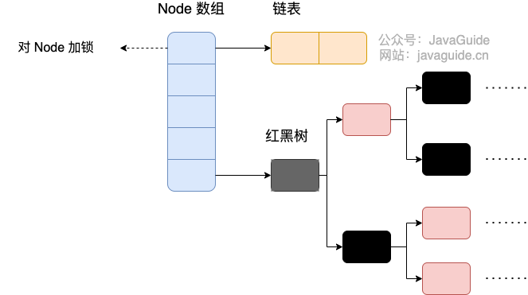
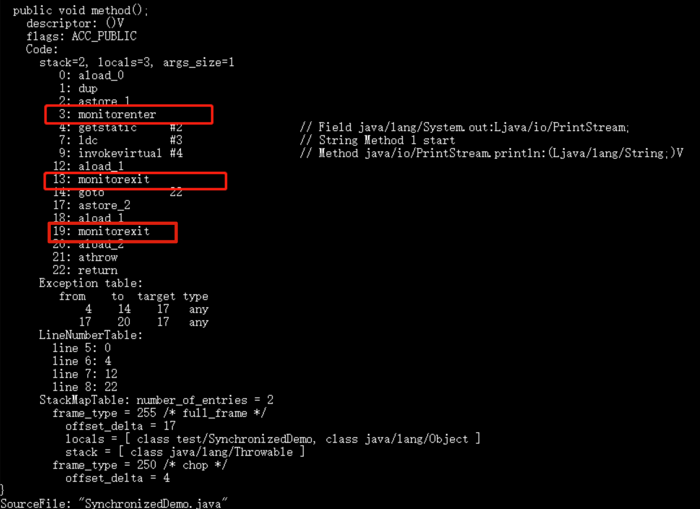
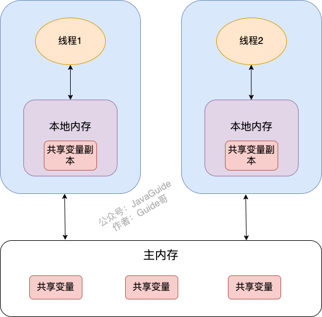
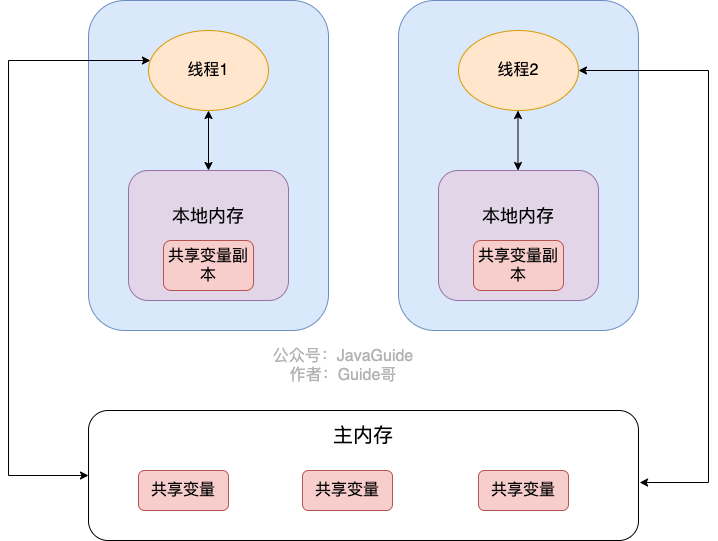
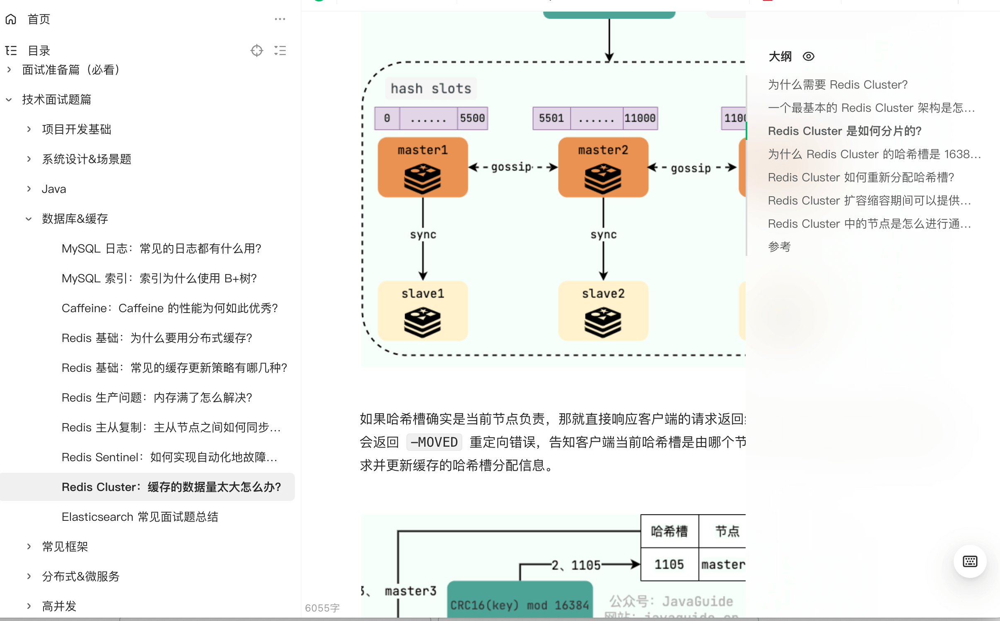
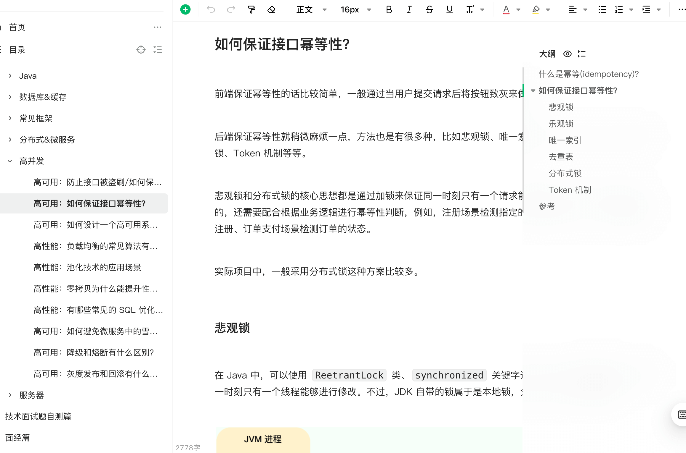

# 小红书四年经验社招面试，过了！

小红书这几年还是挺香的，和 PDD 一样，都非常舍得开薪资，毕竟目前还是高速发展时期。不过，这两家工作强度也是真的不小，在所有互联网公司中都是能排的上号的。

小红书技术岗整体流程较长，通常包括：**笔试（校招） + 3~4 轮技术面 + HR面**。时间跨度大，可能从首轮到 Offer 要 1~2 个月。

技术面重点突出“项目 + 场景 + 基础”结合，几乎每一轮必问项目/实习。并且， 场景题这几年出现的越来越频繁了。八股比重大体适中，视面试官风格而定：

* 有些面试几乎不问八股，完全围绕项目聊；
* 有些则会结合八股基础进行延伸（如事务、注解、微服务等）；
* 面试官整体风格偏工程实战导向。

下面的题目来源于《Java面试指北》的这篇面经，每一个问题我都添加了详细的参考答案：

[大厂四年，2024 阿里、字节、蚂蚁、小红书面试经历分享](https://www.yuque.com/snailclimb/mf2z3k/guh0u9hb3pr70rtk)

## ConcurrentHashMap 的原理？为什么要用红黑树？为什么不一开始就使用红黑树？

#### JDK1.8 之前


首先将数据分为一段一段（这个“段”就是 `Segment`）的存储，然后给每一段数据配一把锁，当一个线程占用锁访问其中一个段数据时，其他段的数据也能被其他线程访问。

`ConcurrentHashMap`\*\* 是由 **`Segment`** 数组结构和 **`HashEntry`** 数组结构组成\*\*。

`Segment` 继承了 `ReentrantLock`,所以 `Segment` 是一种可重入锁，扮演锁的角色。`HashEntry` 用于存储键值对数据。

```java
static class Segment<K,V> extends ReentrantLock implements Serializable {
}
```

一个 `ConcurrentHashMap` 里包含一个 `Segment` 数组，`Segment` 的个数一旦**初始化就不能改变**。 `Segment` 数组的大小默认是 16，也就是说默认可以同时支持 16 个线程并发写。

`Segment` 的结构和 `HashMap` 类似，是一种数组和链表结构，一个 `Segment` 包含一个 `HashEntry` 数组，每个 `HashEntry` 是一个链表结构的元素，每个 `Segment` 守护着一个 `HashEntry` 数组里的元素，当对 `HashEntry` 数组的数据进行修改时，必须首先获得对应的 `Segment` 的锁。也就是说，对同一 `Segment` 的并发写入会被阻塞，不同 `Segment` 的写入是可以并发执行的。

#### JDK1.8 之后



Java 8 几乎完全重写了 `ConcurrentHashMap`，代码量从原来 Java 7 中的 1000 多行，变成了现在的 6000 多行。

`ConcurrentHashMap` 取消了 `Segment` 分段锁，采用 `Node + CAS + synchronized` 来保证并发安全。数据结构跟 `HashMap` 1.8 的结构类似，数组+链表/红黑二叉树。Java 8 在链表长度超过一定阈值（8）时将链表（寻址时间复杂度为 O(N)）转换为红黑树（寻址时间复杂度为 O(log(N))）。

红黑树需要保持自平衡，维护成本较高。并且，过早引入红黑树反而会增加复杂度。泊松分布表明，链表长度达到 8 的概率极低（小于千万分之一）。在绝大多数情况下，链表长度都不会超过 8。阈值设置为 8，可以保证性能和空间效率的平衡。

Java 8 中，锁粒度更细，`synchronized` 只锁定当前链表或红黑二叉树的首节点，这样只要 hash 不冲突，就不会产生并发，就不会影响其他 Node 的读写，效率大幅提升。

## volatile 和 synchonized 基本原理？

synchronized 关键字底层原理属于 JVM 层面的东西。

### synchonized 原理

#### synchronized 同步语句块的情况

```java
public class SynchronizedDemo {
    public void method() {
        synchronized (this) {
            System.out.println("synchronized 代码块");
        }
    }
}
```

通过 JDK 自带的 `javap` 命令查看 `SynchronizedDemo` 类的相关字节码信息：首先切换到类的对应目录执行 `javac SynchronizedDemo.java` 命令生成编译后的 .class 文件，然后执行`javap -c -s -v -l SynchronizedDemo.class`。



从上面我们可以看出：`synchronized`\*\* 同步语句块的实现使用的是 **`monitorenter`** 和 **`monitorexit`** 指令，其中 **`monitorenter`** 指令指向同步代码块的开始位置，**`monitorexit`** 指令则指明同步代码块的结束位置。\*\*

上面的字节码中包含一个 `monitorenter` 指令以及两个 `monitorexit` 指令，这是为了保证锁在同步代码块代码正常执行以及出现异常的这两种情况下都能被正确释放。

当执行 `monitorenter` 指令时，线程试图获取锁也就是获取 \*\*对象监视器 \*\*`monitor` 的持有权。

> 在 Java 虚拟机(HotSpot)中，Monitor 是基于 C++实现的，由[ObjectMonitor](https://github.com/openjdk-mirror/jdk7u-hotspot/blob/50bdefc3afe944ca74c3093e7448d6b889cd20d1/src/share/vm/runtime/objectMonitor.cpp)实现的。每个对象中都内置了一个 `ObjectMonitor`对象。
>
> 另外，`wait/notify`等方法也依赖于`monitor`对象，这就是为什么只有在同步的块或者方法中才能调用`wait/notify`等方法，否则会抛出`java.lang.IllegalMonitorStateException`的异常的原因。

在执行`monitorenter`时，会尝试获取对象的锁，如果锁的计数器为 0 则表示锁可以被获取，获取后将锁计数器设为 1 也就是加 1。


对象锁的拥有者线程才可以执行 `monitorexit` 指令来释放锁。在执行 `monitorexit` 指令后，将锁计数器设为 0，表明锁被释放，其他线程可以尝试获取锁。


如果获取对象锁失败，那当前线程就要阻塞等待，直到锁被另外一个线程释放为止。

#### synchronized 修饰方法的情况

```java
public class SynchronizedDemo2 {
    public synchronized void method() {
        System.out.println("synchronized 方法");
    }
}

```


`synchronized` 修饰的方法并没有 `monitorenter` 指令和 `monitorexit` 指令，取而代之的是 `ACC_SYNCHRONIZED` 标识，该标识指明了该方法是一个同步方法。JVM 通过该 `ACC_SYNCHRONIZED` 访问标志来辨别一个方法是否声明为同步方法，从而执行相应的同步调用。

如果是实例方法，JVM 会尝试获取实例对象的锁。如果是静态方法，JVM 会尝试获取当前 class 的锁。

#### 总结

`synchronized` 同步语句块的实现使用的是 `monitorenter` 和 `monitorexit` 指令，其中 `monitorenter` 指令指向同步代码块的开始位置，`monitorexit` 指令则指明同步代码块的结束位置。

`synchronized` 修饰的方法并没有 `monitorenter` 指令和 `monitorexit` 指令，取而代之的是 `ACC_SYNCHRONIZED` 标识，该标识指明了该方法是一个同步方法。

**不过，两者的本质都是对对象监视器 monitor 的获取。**

### volatile 原理

在 Java 中，`volatile` 关键字可以保证变量的可见性，如果我们将变量声明为 `volatile` ，这就指示 JVM，这个变量是共享且不稳定的，每次使用它都到主存中进行读取。





`volatile` 关键字其实并非是 Java 语言特有的，在 C 语言里也有，它最原始的意义就是禁用 CPU 缓存。如果我们将一个变量使用 `volatile` 修饰，这就指示编译器，这个变量是共享且不稳定的，每次使用它都到主存中进行读取。

**在 Java 中，**`volatile`\*\* 关键字除了可以保证变量的可见性，还有一个重要的作用就是防止 JVM 的指令重排序。\*\* 如果我们将变量声明为 `volatile` ，在对这个变量进行读写操作的时候，会通过插入特定的 **内存屏障** 的方式来禁止指令重排序。

在 Java 中，`Unsafe` 类提供了三个开箱即用的内存屏障相关的方法，屏蔽了操作系统底层的差异：

```java
public native void loadFence();
public native void storeFence();
public native void fullFence();
```

理论上来说，你通过这个三个方法也可以实现和`volatile`禁止重排序一样的效果，只是会麻烦一些。

## synchonized 可以保证可见性吗？

`volatile` 关键字能保证数据的可见性，但不能保证数据的原子性。`synchronized` 关键字两者都能保证。

`synchonized` 保证可见性的原因：

* **获取锁时**：当线程获取锁时，会强制从 **主内存**（main memory）中读取共享变量的最新值，清除工作内存中该变量的值。这样可以确保线程看到的共享变量始终是最新的。
* **释放锁时**：当线程释放锁时，会将工作内存中被修改过的共享变量的值刷新回 **主内存**。这样可以确保其他线程获取该锁时，能够看到最新的共享变量值。

## Redis 集群中节点之间的通信方式？Gossip 原理？

Redis Cluster 是一个典型的分布式系统，分布式系统中的各个节点需要互相通信。既然要相互通信就要遵循一致的通信协议，Redis Cluster 中的各个节点基于 **Gossip 协议** 来进行通信共享信息，每个 Redis 节点都维护了一份集群的状态信息。

Redis Cluster 的节点之间会相互发送多种 Gossip 消息：

* **MEET** ：在 Redis Cluster 中的某个 Redis 节点上执行 `CLUSTER MEET ip port` 命令，可以向指定的 Redis 节点发送一条 MEET 信息，用于将其添加进 Redis Cluster 成为新的 Redis 节点。
* **PING/PONG** ：Redis Cluster 中的节点都会定时地向其他节点发送 PING 消息，来交换各个节点状态信息，检查各个节点状态，包括在线状态、疑似下线状态 PFAIL 和已下线状态 FAIL。
* **FAIL** ：Redis Cluster 中的节点 A 发现 B 节点 PFAIL ，并且在下线报告的有效期限内集群中半数以上的节点将 B 节点标记为 PFAIL，节点 A 就会向集群广播一条 FAIL 消息，通知其他节点将故障节点 B 标记为 FAIL 。
* ......

有了 Redis Cluster 之后，不需要专门部署 Sentinel 集群服务了。Redis Cluster 相当于是内置了 Sentinel 机制，Redis Cluster 内部的各个 Redis 节点通过 Gossip 协议互相探测健康状态，在故障时可以自动切换。

`cluster.h` 文件中定义了所有的消息类型（源码地址：<https://github.com/redis/redis/blob/7.0/src/cluster.h）> 。Redis 3.0 版本的时候只有 9 种消息类型，到了 7.0 版本的时候已经有 11 种消息类型了。

```c
// 注意，PING 、 PONG 和 MEET 实际上是同一种消息。
// PONG 是对 PING 的回复，它的实际格式也为 PING 消息，
// 而 MEET 则是一种特殊的 PING 消息，用于强制消息的接收者将消息的发送者添加到集群中（如果节点尚未在节点列表中的话）
#define CLUSTERMSG_TYPE_PING 0          /* Ping 消息 */
#define CLUSTERMSG_TYPE_PONG 1          /* Pong 用于回复Ping */
#define CLUSTERMSG_TYPE_MEET 2          /* Meet 请求将某个节点添加到集群中 */
#define CLUSTERMSG_TYPE_FAIL 3          /* Fail 将某个节点标记为 FAIL */
#define CLUSTERMSG_TYPE_PUBLISH 4       /* 通过发布与订阅功能广播消息 */
#define CLUSTERMSG_TYPE_FAILOVER_AUTH_REQUEST 5 /* 请求进行故障转移操作，要求消息的接收者通过投票来支持消息的发送者 */
#define CLUSTERMSG_TYPE_FAILOVER_AUTH_ACK 6     /* 消息的接收者同意向消息的发送者投票 */
#define CLUSTERMSG_TYPE_UPDATE 7        /* slots 已经发生变化，消息发送者要求消息接收者进行相应的更新 */
#define CLUSTERMSG_TYPE_MFSTART 8       /* 为了进行手动故障转移，暂停各个客户端 */
#define CLUSTERMSG_TYPE_MODULE 9        /* 模块集群API消息 */
#define CLUSTERMSG_TYPE_PUBLISHSHARD 10 /* 通过发布与订阅功能广播分片消息 */
#define CLUSTERMSG_TYPE_COUNT 11        /* 消息总数 */
```

`cluster.h` 文件中定义了消息结构 `clusterMsg`（源码地址：<https://github.com/redis/redis/blob/7.0/src/cluster.h）> ：

```c
typedef struct {
    char sig[4];        /* 标志位，"RCmb" (Redis Cluster message bus). */
    uint32_t totlen;    /* 消息总长度 */
    uint16_t ver;       /* 消息协议版本 */
    uint16_t port;      /* 端口 */
    uint16_t type;      /* 消息类型 */
    char sender[CLUSTER_NAMELEN];  /* 消息发送节点的名字（ID） */
    // 本节点负责的哈希槽信息,16384/8 个 char 数组，一共为16384bit
    unsigned char myslots[CLUSTER_SLOTS/8];
    // 如果消息发送者是一个从节点，那么这里记录的是消息发送者正在复制的主节点的名字
    // 如果消息发送者是一个主节点，那么这里记录的是 REDIS_NODE_NULL_NAME
    // （一个 40 字节长，值全为 0 的字节数组）
    char slaveof[CLUSTER_NAMELEN];
    // 省略部分属性
    // ......
    // 集群的状态
    unsigned char state;
    // 消息的内容
    union clusterMsgData data;
} clusterMsg;
```

`clusterMsgData` 是一个联合体(union）,可以为 PING，MEET，PONG 、FAIL 等消息类型。当消息为 PING、MEET 和 PONG 类型时，都是 ping 字段是被赋值的，这也就解释了为什么我们上面说 PING 、 PONG 和 MEET 实际上是同一种消息。

```c
union clusterMsgData {
    /* PING, MEET and PONG */
    struct {
        /* Array of N clusterMsgDataGossip structures */
        clusterMsgDataGossip gossip[1];
    } ping;

    /* FAIL */
    struct {
        clusterMsgDataFail about;
    } fail;

    /* PUBLISH */
    struct {
        clusterMsgDataPublish msg;
    } publish;

    /* UPDATE */
    struct {
        clusterMsgDataUpdate nodecfg;
    } update;

    /* MODULE */
    struct {
        clusterMsgModule msg;
    } module;
};
```

[《Java 面试指北》](https://mp.weixin.qq.com/s/JNJIKnUMc0MU_i2VNXb50A)（面试专版，Java 面试必备）中详细总结了 Redis 集群相关的问题：



[Redis Cluster：缓存的数据量太大怎么办？](https://www.yuque.com/snailclimb/mf2z3k/ikf0l2)

关于 Gossip 协议的详细介绍，可以参考我写的这篇文章：[Redis 集群中节点之间的通信方式？](https://javaguide.cn/distributed-system/protocol/gossip-protocl.html)。

## Kafka 是如何持久化消息的？

Kafka 将消息持久化到磁盘，这与其他一些消息队列将消息存储在内存中的做法不同。 这种持久化机制使得 Kafka 能够处理大量的消息，而不会受到内存容量的限制。

* **顺序写机制**：Kafka 将消息顺序写入磁盘，这避免了随机磁盘访问，从而提高了写入性能。 这是因为影响磁盘 IO 性能的因素主要在寻道、旋转和数据传输这三个步骤，而顺序写文件减少了磁盘寻道和旋转的次数。
* **操作系统页缓存技术**：Kafka 利用操作系统的页缓存（Page Cache）来提高读写性能。 当消息被写入磁盘时，它们首先会被写入页缓存，然后由操作系统异步地刷新到磁盘。至于什么时候将数据刷入磁盘文件，就是操作系统的事情了，这里其实相当于是在写内存。当消费者读取消息时，如果数据仍然存在于页缓存中（尚未被刷出或覆盖），则可以直接从内存中读取，而无需访问磁盘，显著提升了读取性能。
* **日志段**：Kafka 通过日志段（LogSegment）持久化消息。每个日志段包含消息日志文件、稀疏的位移索引文件和时间戳索引文件，并以起始位移命名。消息顺序追加写入日志文件，利用页缓存提升性能。日志段基于时间和大小切分，并根据删除或压缩策略进行清理。 Kafka 的分段存储和索引机制兼顾了高吞吐量、快速查找和高效的磁盘空间管理。
* **日志切分和清理**：日志段基于时间和大小切分，支持高效的磁盘空间管理。Kafka 提供了基于时间、大小和压缩的日志清理策略。

## Kafka 如何保证消息不丢失？

**生产者端**：

1. 使用同步确认或异步回调确保消息成功发送。
2. 配置重试机制（`retries`）和合理的重试间隔。

**消费者端**：

1. 手动提交 offset，确保消息处理完成后再提交。
2. 实现幂等消费，避免重复消费导致数据不一致。

**Kafka 服务端**：

1. 设置 `acks=all`，确保消息被所有 ISR 副本接收。
2. 配置 `replication.factor >= 3` 和 `min.insync.replicas > 1`，保证数据冗余和高可用性。
3. 设置 `unclean.leader.election.enable=false`，避免从不同步的副本中选举 Leader。

## Raft 原理？

JavaGuide 网站上有一篇文章详细介绍了 Raft 算法，感兴趣的朋友可以详细看看，还是比较有难度的：[Raft 算法详解](https://javaguide.cn/distributed-system/protocol/raft-algorithm.html) 。

## Redis 的数据结构有哪些？跳表的原理是什么？

Redis 中比较常见的数据类型有下面这些：

* **5 种基础数据类型**：String（字符串）、List（列表）、Set（集合）、Hash（散列）、Zset（有序集合）。
* **3 种特殊数据类型**：HyperLogLog（基数统计）、Bitmap （位图）、Geospatial (地理位置)。

Redis 5 种基本数据类型其底层实现主要依赖这 8 种数据结构：简单动态字符串（SDS）、LinkedList（双向链表）、Dict（哈希表/字典）、SkipList（跳跃表）、Intset（整数集合）、ZipList（压缩列表）、QuickList（快速列表）。

Redis 5 种基本数据类型对应的底层数据结构实现如下表所示：

| String | List | Hash | Set | Zset |
| :--- | :--- | :--- | :--- | :--- |
| SDS | LinkedList/ZipList/QuickList | Dict、ZipList | Dict、Intset | ZipList、SkipList |

Redis 3.2 之前，List 底层实现是 LinkedList 或者 ZipList。Redis 3.2 之后，引入了 LinkedList 和 ZipList 的结合 QuickList，List 的底层实现变为 QuickList。从 Redis 7.0 开始， ZipList 被 ListPack 取代。

除了上面提到的之外，还有一些其他的比如 [Bloom filter（布隆过滤器）](https://javaguide.cn/cs-basics/data-structure/bloom-filter.html)、Bitfield（位域）。

关于 Redis 5 种基础数据类型和 3 种特殊数据类型的详细介绍请看我写的这两篇文章：

* [Redis 5 种基本数据类型详解](https://javaguide.cn/database/redis/redis-data-structures-01.html)
* [Redis 3 种特殊数据类型详解](https://javaguide.cn/database/redis/redis-data-structures-02.html)

跳表的原理涉及到的内容比较多，可以参考我写的这篇文章：[⭐️Redis 为什么用跳表实现有序集合？](https://javaguide.cn/database/redis/redis-skiplist.html)。

## 你是如何做幂等的？

前端保证幂等性的话比较简单，一般通过当用户提交请求后将按钮致灰来做到。

后端保证幂等性就稍微麻烦一点，方法也是有很多种，比如悲观锁、唯一索引、去重表、乐观锁 、分布式锁、Token 机制等等。

悲观锁和分布式锁的核心思想都是通过加锁来保证同一时刻只有一个请求能被执行。但仅仅这样是不够的，还需要配合根据业务逻辑进行幂等性判断，例如，注册场景检测指定的电话/邮箱/用户名是否已经被注册、订单支付场景检测订单的状态。

实际项目中，一般采用分布式锁这种方案比较多。

[《Java 面试指北》](https://mp.weixin.qq.com/s/JNJIKnUMc0MU_i2VNXb50A)（面试专版，Java 面试必备）的高并发章节详细进行了总结：



[高可用：如何保证接口幂等性？](https://www.yuque.com/snailclimb/mf2z3k/mlnfrc6kk95kmli6)

## 分布式 ID 的常见方案？

### 数据库主键自增

* **实现**：利用数据库的自增主键功能生成唯一 ID。通过 `REPLACE INTO` 插入数据，获取 `LAST_INSERT_ID`。
* **优点**：实现起来比较简单、ID 有序递增、存储消耗空间小
* **缺点**：支持的并发量不大、存在数据库单点问题（可以使用数据库集群解决，不过增加了复杂度）、ID 没有具体业务含义、安全问题（比如根据订单 ID 的递增规律就能推算出每天的订单量，商业机密啊！ ）、每次获取 ID 都要访问一次数据库（增加了对数据库的压力，获取速度也慢）

### 数据库号段模式

* **实现**：通过数据库表维护一个`current_max_id` 字段（当前最大 ID）和`step`字段（号段的长度），批量分配一段 ID，存储到内存中，减少频繁访问数据库。
* **优点**：ID 有序递增、存储消耗空间小
* **缺点**：存在数据库单点问题（可以使用数据库集群解决，不过增加了复杂度）、ID 没有具体业务含义、安全问题（比如根据订单 ID 的递增规律就能推算出每天的订单量，商业机密啊！ ）

### Redis

* **实现**：使用 Redis 的 `INCR` 命令生成自增 ID。提高可用性和并发性能时，可使用 Redis Cluster。
* **优点**：性能不错并且生成的 ID 是有序递增的
* **缺点**：和数据库主键自增方案的缺点类似

### MongoDB

* **实现**：MongoDB 内置的 ObjectId，用 12 字节存储，包含时间戳、机器 ID、进程 ID、自增值。
* **优点**：性能不错并且生成的 ID 是有序递增的
* **缺点**：需要解决重复 ID 问题（当机器时间不对的情况下，可能导致会产生重复 ID）、有安全性问题（ID 生成有规律性）

### UUID

* **实现**：UUID 是 Universally Unique Identifier（通用唯一标识符） 的缩写。UUID 包含 32 个 16 进制数字（8-4-4-4-12）。
* **优点**：生成速度比较快、简单易用
* **缺点**：存储消耗空间大（32 个字符串，128 位）、 不安全（基于 MAC 地址生成 UUID 的算法会造成 MAC 地址泄露)、无序（非自增）、没有具体业务含义、需要解决重复 ID 问题（当机器时间不对的情况下，可能导致会产生重复 ID）

### Snowflake（雪花算法）

* **实现**：Twitter 开源算法，由 64 位组成，包含符号位（1 位）、时间戳（41 位）、机器 ID（10 位）和序列号（12 位）。
* **优点**：生成速度比较快、生成的 ID 有序递增、比较灵活（可以对 Snowflake 算法进行简单的改造比如加入业务 ID）
* **缺点**：需要解决重复 ID 问题（ID 生成依赖时间，在获取时间的时候，可能会出现时间回拨的问题，也就是服务器上的时间突然倒退到之前的时间，进而导致会产生重复 ID）、依赖机器 ID 对分布式环境不友好（当需要自动启停或增减机器时，固定的机器 ID 可能不够灵活）。

### 其他

还有一些开源框架实现方案例如 UidGenerator(百度)、Leaf(美团)、Tinyid(滴滴)，这里就不详细介绍了，具体可以参考我写的这篇文章：[分布式ID介绍&实现方案总结](https://javaguide.cn/distributed-system/distributed-id.html)。


> 更新: 2025-12-24 15:22:00  
> 原文: <https://www.yuque.com/snailclimb/mf2z3k/gnxse7rkc5buoffm>