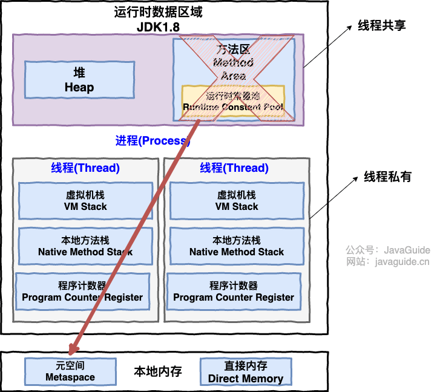
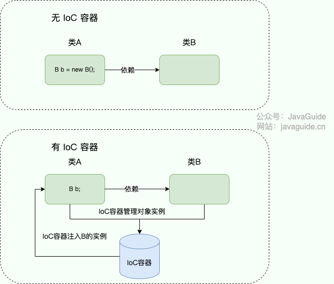
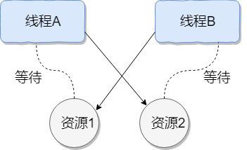
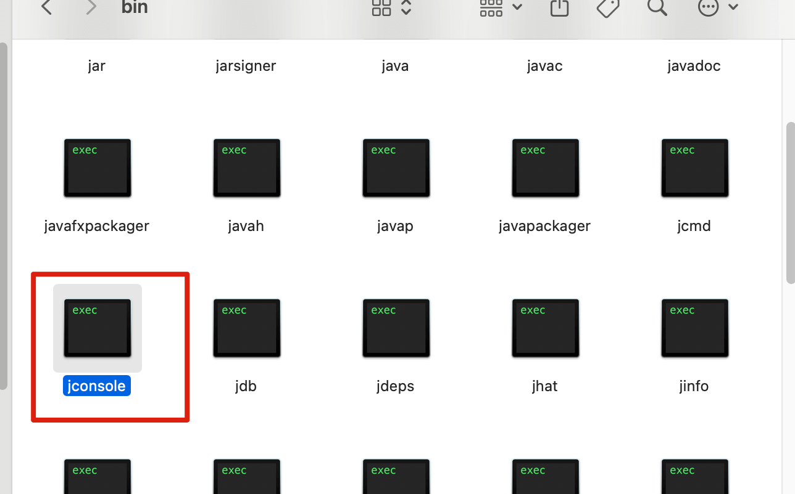
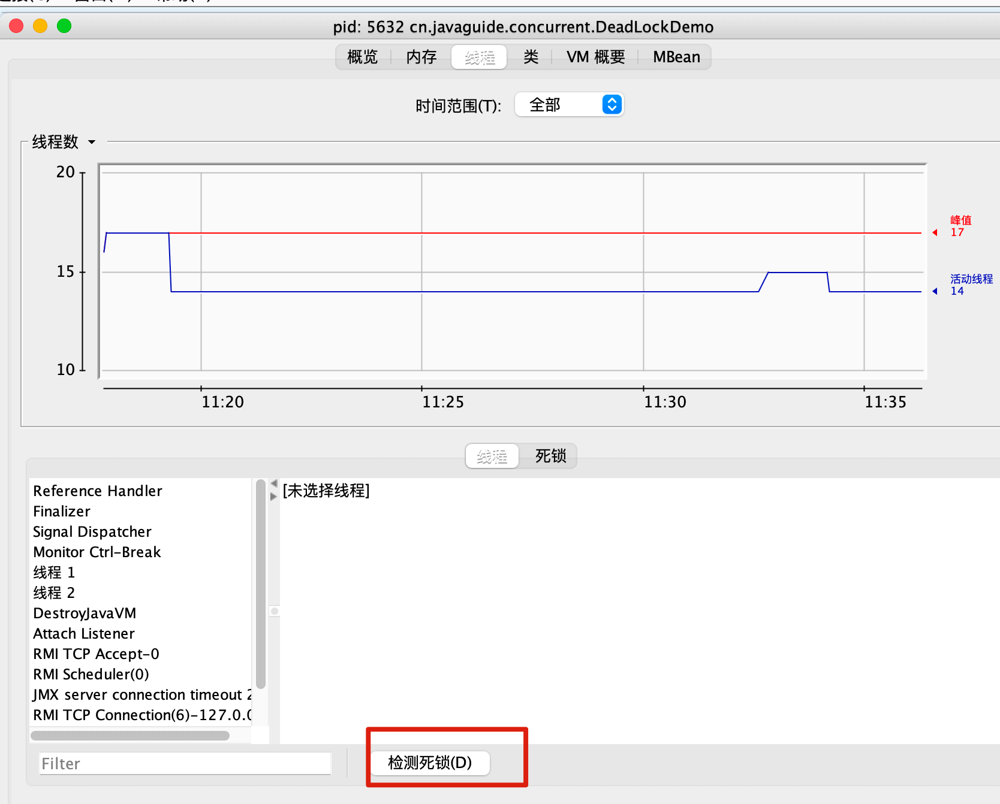
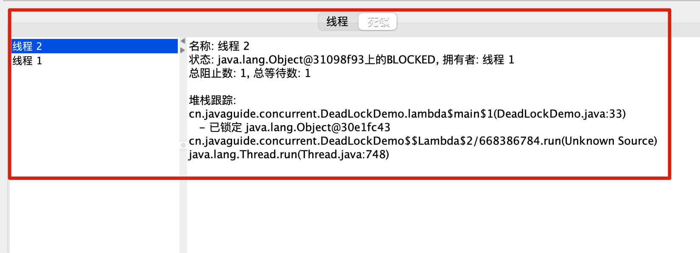
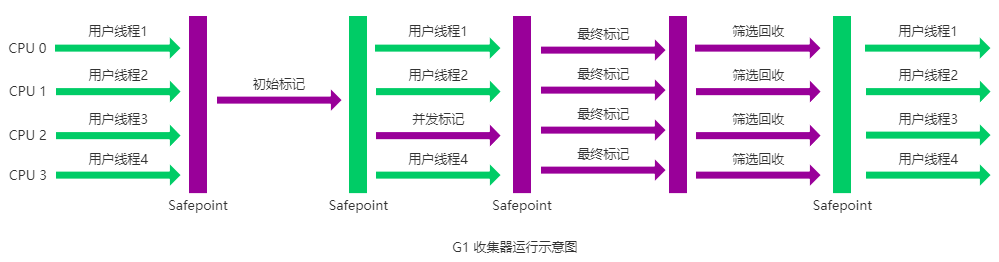

# 华为 OD 校招面经，问了贼多！

有不少朋友因为考研、考公或是其他原因，不慎错过了宝贵的校招窗口，失去了“应届生”这一身份。随之而来的，是求职路上的重重困难：简历投递石沉大海，面试机会寥寥无几，仿佛被主流招聘市场拒之门外。

在这样的背景下，华为 OD 提供了一个相对友好的机会窗口，它通常愿意接给这些有“空窗期”或失去应届身份的同学一个面试机会。这对于许多处于困境中的求职者来说，无疑是一个非常不错的选择。

虽然华为 OD 在网上被黑的比较惨，但也确实是给很多人提供了一个不错的机会。

下面，给大家分享一篇读者的华为 OD 面经，从准备到最终上岸华为 OD 的全过程，希望对大家有帮助！

下面是正文。

我本科毕业于一所末流 211，软工专业。毕业后由于就业形式不太好，我选择 GAP 一年，全职投入二战考研，但今年考研形势严峻，加上自身准备不够充分，最终再次遗憾落榜。

我的技术背景比较薄弱，虽然是科班出身，但大学期间学得不扎实，基本忘得差不多了。没有亮眼的项目经验，只有一些毕设和课设，实习经历也与代码开发无关，主要是打杂。

由于一年空窗期的问题和我已经不是应届生的尴尬身份，导致我求职更加艰难，投递的简历几乎石沉大海。最后，听 Guide 哥的建议把目标放在华为 OD 上。

## 准备阶段

1. **复习 Java 基础知识**：我花了三天左右，重新系统过了一遍 Java 基础知识，包括集合、多线程、JVM 等。
2. **优化项目经验**： 这是我的短板，也是我投入精力最多的部分。我参考了[《Java 面试指北》](https://javaguide.cn/zhuanlan/java-mian-shi-zhi-bei.html)的建议对项目进行优化改进，顺便趁这个过程进一步学习缓存、框架和数据库。不得不说，在实践过学习效果真的好不少。通过 AI 协助，效率也能提高不少。
3. **算法**：我主要在 LeetCode 上刷题，重点练习了 OD 机考中常见的回溯、动态规划、字符串处理等题型，并参考了一些网上的华为 OD 机试真题题库进行模拟训练。
4. **八股文**：为了应对技术面试，我主要通过 [JavaGuide](https://javaguide.cn/) 和 [《Java 面试指北》](https://javaguide.cn/zhuanlan/java-mian-shi-zhi-bei.html)准备技术八股，重点放在 Java、MySQL、Redis 上。

## 机考

150 分钟，三道编程题（两道 100 分，一道 200 分）。整体难度适中，我遇到的是两道字符串处理题和一道动态规划题。

## HR 面

1. 自我介绍。
2. 详细询问了 GAP 一年的原因（考研经历）。
3. 是否还会继续考研？（表达了专注工作的意愿）
4. 这期间除了考研，有没有持续学习编程?
5. 为什么选择 XX 作为工作地？是否有长期发展的打算？
6. 有没有女朋友
7. 如何看待加班？
8. 未来的职业规划是怎样的？
9. 期望的薪资范围是多少？

## 技术一面

### 进程和线程的区别与联系



从上图可以看出：一个进程中可以有多个线程，多个线程共享进程的**堆**和**方法区 (JDK1.8 之后的元空间)****资源，但是每个线程有自己的****&#x7A0B;序计数器**、**虚拟机栈** 和 **本地方法栈**。

**总结：** 线程是进程划分成的更小的运行单位。线程和进程最大的不同在于基本上各进程是独立的，而各线程则不一定，因为同一进程中的线程极有可能会相互影响。线程执行开销小，但不利于资源的管理和保护；而进程正相反。

### HashMap 扩容为什么是 2 的幂次？

1. 位运算效率更高：位运算(&)比取余运算(%)更高效。当长度为 2 的幂次方时，`hash % length` 等价于 `hash & (length - 1)`。
2. 可以更好地保证哈希值的均匀分布：扩容之后，在旧数组元素 hash 值比较均匀的情况下，新数组元素也会被分配的比较均匀，最好的情况是会有一半在新数组的前半部分，一半在新数组后半部分。
3. 扩容机制变得简单和高效：扩容后只需检查哈希值高位的变化来决定元素的新位置，要么位置不变（高位为 0），要么就是移动到新位置（高位为 1，原索引位置+原容量）。

详细介绍可以参考这篇文章：[Java 集合常见面试题总结(下)](https://javaguide.cn/java/collection/java-collection-questions-02.html) 。

### 解释一下 `@Component`、`@Bean` 注解的作用和关系

* `@Component` 注解作用于类，而`@Bean`注解作用于方法。
* `@Component`通常是通过类路径扫描来自动侦测以及自动装配到 Spring 容器中（我们可以使用 `@ComponentScan` 注解定义要扫描的路径从中找出标识了需要装配的类自动装配到 Spring 的 bean 容器中）。`@Bean` 注解通常是我们在标有该注解的方法中定义产生这个 bean,`@Bean`告诉了 Spring 这是某个类的实例，当我需要用它的时候还给我。
* `@Bean` 注解比 `@Component` 注解的自定义性更强，而且很多地方我们只能通过 `@Bean` 注解来注册 bean。比如当我们引用第三方库中的类需要装配到 `Spring`容器时，则只能通过 `@Bean`来实现。

`@Bean`注解使用示例：

```java
@Configuration
public class AppConfig {
    @Bean
    public TransferService transferService() {
        return new TransferServiceImpl();
    }

}
```

上面的代码相当于下面的 xml 配置

```xml
<beans>
    <bean id="transferService" class="com.acme.TransferServiceImpl"/>
</beans>

```

下面这个例子是通过 `@Component` 无法实现的。

```java
@Bean
public OneService getService(status) {
    case (status)  {
        when 1:
                return new serviceImpl1();
        when 2:
                return new serviceImpl2();
        when 3:
                return new serviceImpl3();
    }
}
```

### 注入 Bean 的注解有哪些？

Spring 内置的 `@Autowired` 以及 JDK 内置的 `@Resource` 和 `@Inject` 都可以用于注入 Bean。

| Annotation | Package | Source |
| --- | --- | --- |
| `@Autowired` | `org.springframework.bean.factory` | Spring 2.5+ |
| `@Resource` | `javax.annotation` | Java JSR-250 |
| `@Inject` | `javax.inject` | Java JSR-330 |

`@Autowired` 和`@Resource`使用的比较多一些。

### 你对 IoC 和 AOP 的理解

IoC （Inversion of Control ）即控制反转/反转控制：

* **控制** ：指的是对象创建（实例化、管理）的权力
* **反转** ：控制权交给外部环境（IoC 容器）



IoC 的思想就是两方之间不互相依赖，由第三方容器来管理相关资源。这样有什么好处呢？

1. 对象之间的耦合度或者说依赖程度降低；
2. 资源变的容易管理；比如你用 Spring 容器提供的话很容易就可以实现一个单例。

AOP（Aspect Oriented Programming）即面向切面编程，AOP 是 OOP（面向对象编程）的一种延续，二者互补，并不对立。

AOP 的目的是将横切关注点（如日志记录、事务管理、权限控制、接口限流、接口幂等等）从核心业务逻辑中分离出来，通过动态代理、字节码操作等技术，实现代码的复用和解耦，提高代码的可维护性和可扩展性。OOP 的目的是将业务逻辑按照对象的属性和行为进行封装，通过类、对象、继承、多态等概念，实现代码的模块化和层次化（也能实现代码的复用），提高代码的可读性和可维护性。

详细介绍可以参考这篇文章：[IoC & AOP 详解（快速搞懂）](https://javaguide.cn/system-design/framework/spring/ioc-and-aop.html)

### Spring 事务失效场景

1. **数据库引擎不支持事务：** 例如 MySQL 的 MyISAM 引擎不支持事务（默认 InnoDB 引擎支持事务），需确认表引擎配置。
2. `@Transactional`\*\* 作用于非 public 方法：\*\* `@Transactional` 注解仅对 `public` 方法生效，`protected` / 默认 /`private` 修饰的方法会失效。
3. **类内部方法自调用：** 同一类中方法 A 调用被 `@Transactional` 修饰的方法 B，事务不生效（Spring AOP 动态代理无法拦截自调用）。
4. **类未被 Spring 容器管理:** 未被 `@Service`/`@Component` 等注解标识，或所在包未被扫描，事务注解不生效。
5. **异常被内部捕获且未重新抛出：** 被 `@Transactional` 修饰的方法内部捕获异常（如 `try-catch` 后未抛出），事务无法感知异常，不会回滚。
6. **传播行为设置不当：** 例如外层方法传播行为为 `REQUIRED`，内层方法为 `NOT_SUPPORTED`（内层以非事务方式运行）。
7. **未正确设置回滚规则：** 默认仅回滚 `RuntimeException` 和 `Error`，若方法抛出 `CheckedException`（如 `IOException`）且未配置 `rollbackFor`，事务不回滚。
8. **多线程调用事务方法：** 事务基于当前线程绑定，子线程无法共享父线程的事务上下文，子线程内的事务方法失效。

详细介绍可以参考这篇文章：[Spring 事务详解](https://javaguide.cn/system-design/framework/spring/spring-transaction.html)

### TCP/UDP 的区别是什么？

| 特性 | TCP | UDP |
| --- | --- | --- |
| **连接性** | 面向连接 | 无连接 |
| **可靠性** | 可靠 | 不可靠 (尽力而为) |
| **状态维护** | 有状态 | 无状态 |
| **传输效率** | 较低 | 较高 |
| **传输形式** | 面向字节流 | 面向数据报 (报文) |
| **头部开销** | 20 - 60 字节 | 8 字节 |
| **通信模式** | 点对点 (单播) | 单播、多播、广播 |
| **常见应用** | HTTP/HTTPS, FTP, SMTP, SSH | DNS, DHCP, SNMP, TFTP, VoIP, 视频流 |

### TCP 是如何保证可靠传输的？

TCP 通过**编号+确认+重传**确保不丢数据，**校验和**确保数据正确，**滑动窗口**控制流量，**拥塞控制**避免网络过载，从而实现**可靠、有序、无差错**的数据传输。

详细介绍可以参考这篇文章：[TCP 传输可靠性保障（传输层）](https://javaguide.cn/cs-basics/network/tcp-reliability-guarantee.html)

### 手撕代码：合并两个有序链表

Leetcode 原题：[21. 合并两个有序链表](https://leetcode.cn/problems/merge-two-sorted-lists/)。

## 技术二面

### 自我介绍

面试时的自我介绍，其实是你给面试官的“第一印象浓缩版”。它不需要面面俱到，但要精准、自信地展现你的核心价值和与岗位的匹配度。通常控制在 1-2 分钟内比较合适。一个好的自我介绍应该包含这几点要素：

1. 用简单的话说清楚自己主要的技术栈于擅长的领域，例如 Java 后端开发、分布式系统开发；
2. 把重点放在自己的优势上，重点突出自己的能力，最好能用一个简短的例子支撑，例如：我比较擅长定位和解决复杂问题。在\[某项目/实习]中，我曾通过\[简述方法，如日志分析、源码追踪、压力测试]成功解决了\[某个具体问题，如一个棘手的性能瓶颈/一个偶现的 Bug]，将\[某个指标]提升了\[百分比/具体数值]。
3. 简要提及 1-2 个最能体现你能力和与岗位要求匹配的项目经历、实习经历或竞赛成绩。不需要展开细节，目的是引出面试官后续的提问。
4. 如果时间允许，可以非常简短地表达对所申请岗位的兴趣和对公司的向往，表明你是有备而来。

### 画项目架构图

架构图的种类有多种，例如业务架构图、应用架构图、技术架构图，面试的时候一定要问清楚具体是画哪种。一般来说，面试中更多的是让你画技术架构图。

下面这张图是开源项目 RuoYi 微服务版的技术架构图：


关于如何画架构图可以阅读这篇文章：[如何画好一张架构图？](https://mp.weixin.qq.com/s/y5qjTHyvy8brwogAjhS4vg) 。

### 项目里用到了异步，具体怎么做的？

常见的实现异步的方式有：

* `Thread`或者线程池
* `Future`
* `CompletableFuture`
* Spring `SimpleApplicationEventMulticaster` （需要设置`ThreadPoolTaskExecutor` 实现异步调用）
* Spring `@Async` 注解（建议自定义线程池）
* 消息队列
* ……

实际项目中，根据你具体使用的方案去谈即可。

### AOP 结合 Redisson 限流，为什么要用 AOP？

使用 AOP（面向切面编程）来结合 Redisson 实现限流，核心目的在于**实现限流逻辑与业务逻辑的彻底解耦，提高代码的可维护性和复用性**。

业务代码只需专注于其核心职责。开发者在编写业务接口时，完全不需要关心限流是如何实现的。我们通过一个简单的注解（例如 `@RateLimit`）就能“声明式”地为接口开启限流功能，代码会变得非常整洁。所有的限流逻辑都被封装在唯一的切面类（`Aspect`）中。无论是 key 的生成策略（比如结合 SpEL 表达式动态获取参数）、限流算法的选择、还是被限流后的统一响应，都在这一个地方进行管理。修改一次，所有使用了该注解的地方全部生效，极大地提升了可维护性。

下面这段代码是我开源的一个[网盘	项目](https://gitee.com/SnailClimb/cloud-drive)中的一段限流逻辑：

```java
@PostMapping("/{shareCode}/verification")
@RateLimit(dimensions = { Dimension.IP }, permitsPerSecond = 3.0, timeout = 1000)// 限制 IP 访问频率为 1 QPS，允许等待 1 秒
public Result<ShareFileVO> verifyShare(@PathVariable String shareCode, @Valid @RequestBody ShareAccessDTO dto) {
    // ... 业务逻辑 ...
}
```

### `List`、`Set`、`Map` 的区别？

* `List`(对付顺序的好帮手): 存储的元素是有序的、可重复的。
* `Set`(注重独一无二的性质): 存储的元素不可重复的。
* `Map`(用 key 来搜索的专家): 使用键值对（key-value）存储，类似于数学上的函数 y=f(x)，"x" 代表 key，"y" 代表 value，key 是无序的、不可重复的，value 是无序的、可重复的，每个键最多映射到一个值。

### `HashMap` 和 `HashTable` 的主要区别是什么？

* **线程是否安全：** `HashMap` 是非线程安全的，`Hashtable` 是线程安全的,因为 `Hashtable` 内部的方法基本都经过`synchronized` 修饰。（如果你要保证线程安全的话就使用 `ConcurrentHashMap` 吧！）；
* **效率：** 因为线程安全的问题，`HashMap` 要比 `Hashtable` 效率高一点。另外，`Hashtable` 基本被淘汰，不要在代码中使用它；
* **对 Null key 和 Null value 的支持：** `HashMap` 可以存储 null 的 key 和 value，但 null 作为键只能有一个，null 作为值可以有多个；Hashtable 不允许有 null 键和 null 值，否则会抛出 `NullPointerException`。
* **初始容量大小和每次扩充容量大小的不同：** ① 创建时如果不指定容量初始值，`Hashtable` 默认的初始大小为 11，之后每次扩充，容量变为原来的 2n+1。`HashMap` 默认的初始化大小为 16。之后每次扩充，容量变为原来的 2 倍。② 创建时如果给定了容量初始值，那么 `Hashtable` 会直接使用你给定的大小，而 `HashMap` 会将其扩充为 2 的幂次方大小（`HashMap` 中的`tableSizeFor()`方法保证，下面给出了源代码）。也就是说 `HashMap` 总是使用 2 的幂作为哈希表的大小,后面会介绍到为什么是 2 的幂次方。
* **底层数据结构：** JDK1.8 以后的 `HashMap` 在解决哈希冲突时有了较大的变化，当链表长度大于阈值（默认为 8）时，将链表转化为红黑树（将链表转换成红黑树前会判断，如果当前数组的长度小于 64，那么会选择先进行数组扩容，而不是转换为红黑树），以减少搜索时间（后文中我会结合源码对这一过程进行分析）。`Hashtable` 没有这样的机制。
* **哈希函数的实现**：`HashMap` 对哈希值进行了高位和低位的混合扰动处理以减少冲突，而 `Hashtable` 直接使用键的 `hashCode()` 值。

`HashMap`\*\* 中带有初始容量的构造函数：\*\*

```java
    public HashMap(int initialCapacity, float loadFactor) {
        if (initialCapacity < 0)
            throw new IllegalArgumentException("Illegal initial capacity: " +
                                               initialCapacity);
        if (initialCapacity > MAXIMUM_CAPACITY)
            initialCapacity = MAXIMUM_CAPACITY;
        if (loadFactor <= 0 || Float.isNaN(loadFactor))
            throw new IllegalArgumentException("Illegal load factor: " +
                                               loadFactor);
        this.loadFactor = loadFactor;
        this.threshold = tableSizeFor(initialCapacity);
    }
     public HashMap(int initialCapacity) {
        this(initialCapacity, DEFAULT_LOAD_FACTOR);
    }
```

下面这个方法保证了 `HashMap` 总是使用 2 的幂作为哈希表的大小。

```java
/**
 * Returns a power of two size for the given target capacity.
 */
static final int tableSizeFor(int cap) {
    int n = cap - 1;
    n |= n >>> 1;
    n |= n >>> 2;
    n |= n >>> 4;
    n |= n >>> 8;
    n |= n >>> 16;
    return (n < 0) ? 1 : (n >= MAXIMUM_CAPACITY) ? MAXIMUM_CAPACITY : n + 1;
}
```

### Java 8 的新特性了解吗？

* **Lambda 表达式**: 这是 Java 8 最核心的特性。它允许我们像传递一个对象一样传递一段代码，极大地简化了匿名内部类的写法。它的语法是`(参数列表) -> { 代码块 }`，使得代码非常简洁。
* **函数式接口 (Functional Interface)**: Lambda 表达式能够成立的基础就是函数式接口。这是一个只包含一个抽象方法的接口。Java 8 使用 @FunctionalInterface 注解来强制编译器进行检查。我们熟悉的 Runnable、Comparator 都是函数式接口。同时，Java 8 在 `java.util.function` 包下新增了大量通用的函数式接口，如 `Predicate<T>` (断言)、`Consumer<T>` (消费)、`Function<T, R>` (转换)、`Supplier<T>` (供给)等。
* **方法引用 (Method Reference)**: 它是 Lambda 表达式的一种语法糖，当 Lambda 表达式的实现恰好是调用一个已存在的方法时，就可以使用方法引用来让代码更加精炼。它有三种主要形式：`类名::静态方法`、`对象::实例方法` 和 `类名::实例方法`。
* **Stream API**：它不是数据结构，也不存储数据，而是像一个流水的管道，数据源（如集合）在管道中经过一系列操作。
* **Optional 类**：它是一个容器类，代表一个值可以存在也可以不存在，用于解决 Java 中长期存在的 `NullPointerException` (NPE) 问题。
* **接口的默认方法与静态方法**：接口中允许创建一个方法的默认实现和静态方法。
* **全新的日期和时间 API**：新增了 `LocalDate`, `LocalTime`, `LocalDateTime` 等线程安全的日期类，且新增了大量简单直观的方法进行日期时间的计算和调整，例如 `plusDays()`, `withMonth()`。
* `ConcurrentHashMap`\*\* 改进\*\*: 内部实现上做了大量优化，比如用 CAS + synchronized 替代了分段锁，大大提升了高并发场景下的性能。
* ......

### 创建线程有哪几种方式？

一般来说，创建线程有很多种方式，例如继承`Thread`类、实现`Runnable`接口、实现`Callable`接口、使用线程池、使用`CompletableFuture`类等等。

不过，这些方式其实并没有真正创建出线程。准确点来说，这些都属于是在 Java 代码中使用多线程的方法。

严格来说，Java 就只有一种方式可以创建线程，那就是通过`new Thread().start()`创建。不管是哪种方式，最终还是依赖于`new Thread().start()`。

### 线程池的七个核心参数分别是什么？

`ThreadPoolExecutor` 3 个最重要的参数：

* `corePoolSize` : 任务队列未达到队列容量时，最大可以同时运行的线程数量。
* `maximumPoolSize` : 任务队列中存放的任务达到队列容量的时候，当前可以同时运行的线程数量变为最大线程数。
* `workQueue`: 新任务来的时候会先判断当前运行的线程数量是否达到核心线程数，如果达到的话，新任务就会被存放在队列中。

`ThreadPoolExecutor`其他常见参数 :

* `keepAliveTime`:线程池中的线程数量大于 `corePoolSize` 的时候，如果这时没有新的任务提交，核心线程外的线程不会立即销毁，而是会等待，直到等待的时间超过了 `keepAliveTime`才会被回收销毁。
* `unit` : `keepAliveTime` 参数的时间单位。
* `threadFactory` :executor 创建新线程的时候会用到。
* `handler` :拒绝策略（后面会单独详细介绍一下）。

下面这张图可以加深你对线程池中各个参数的相互关系的理解（图片来源：《Java 性能调优实战》）：


### 多个线程访问共享变量时，如何保证线程安全？

1. **悲观锁**：总是假设最坏的情况，认为数据在任何时候都可能被其他线程修改，所以在访问共享资源前必须先独占式地加锁，确保同一时刻只有一个线程能操作数据。操作完成后再释放锁。适合写多读少、线程冲突概率高的场景。因为冲突频繁，直接加锁的成本反而低于不断重试的成本。最典型的悲观锁实现：`synchronized` 关键字和 `ReentrantLock`。
2. **乐观锁**：假设线程冲突是小概率事件，所以操作数据时不会加锁。而是在更新时去检查，看在此期间数据有没有被别的线程修改过。适合读多写少、线程冲突概率低的场景。在这种情况下，可以避免加锁带来的性能开销。但如果冲突频繁，会导致大量自旋重试，反而会消耗更多 CPU 资源。`java.util.concurrent.atomic` 包下的原子类（如`AtomicInteger`, `AtomicLong`, `AtomicBoolean`）可以针对单个变量进行原子操作。
3. `ThreadLocal`：提供了一个线程内的局部变量。每个线程通过 `ThreadLocal` 对象读写的数据，实际上都存储在该线程自己内部的一个 `ThreadLocalMap` 中，与其他线程完全隔离。

### 介绍一下观察者模式，并举一个实际应用场景。

观察者模式是一种非常经典和实用的**行为型设计模式**。它的核心思想在于定义了一种**一对多**的依赖关系：当一个对象（我们称之为“被观察者”或“主题”）的状态发生改变时，所有依赖于它的对象（即“观察者”）都会自动收到通知并进行相应的更新。

这种模式的本质是**解耦**，它将被观察者和观察者分离开来，使得它们可以独立地变化和复用，而不需要知道对方的具体实现细节。

观察者模式通常包含四个核心角色：

* **主题/被观察者 (Subject):** 这是一个接口或抽象类，它负责维护一个观察者列表，并提供添加、删除观察者的接口。最关键的是，它还定义了通知所有观察者的 notify() 方法。
* **具体主题/具体被观察者 (ConcreteSubject):** 它是 Subject 的具体实现。它包含了业务逻辑，并在自身状态发生变化时，调用继承自 Subject 的 notify() 方法，通知所有已注册的观察者。
* **观察者 (Observer):** 同样是一个接口或抽象类，它定义了一个 update() 方法。当观察者接收到来自主题的通知时，这个方法就会被调用。
* **具体观察者 (ConcreteObserver):** 它是 Observer 的具体实现。在 update() 方法中，它会根据收到的通知，完成具体的业务逻辑，比如更新自身状态、执行某个操作等。

在一个电商系统中，当用户支付成功后，我们需要触发一系列独立的后续操作，比如：

* 更新订单状态为“已支付”。
* 给用户的账户增加积分。
* 通知仓储系统准备发货。
* 给用户发送一封确认邮件。

**如果不用设计模式，** 我们可能会在支付成功的方法里，把这四个操作串行地写下来。这样做的问题显而易见：支付核心逻辑与各种业务逻辑紧紧地耦合在一起，每次新增一个类似“赠送优惠券”的需求，都必须去修改这个已经很庞大和脆弱的核心方法，这严重违反了开闭原则。

**我们的解决方案是：**

我们将“支付成功”这个事件抽象为**具体主题 (ConcreteSubject)**。而上述的“更新订单”、“增加积分”、“通知仓库”、“发送邮件”等操作，则分别被设计成独立的**具体观察者 (**`ConcreteObserver`**)**。

**工作流程是：**

在系统初始化时，这些观察者会把自己注册到“支付成功”这个主题上。当支付网关回调我们的接口，确认支付成功后，主题的 `setState()` 方法被调用，然后它会立即执行 `notify()`，遍历内部的观察者列表，并依次调用它们的 `update()` 方法。

**这样做的价值在于：**

* **高度解耦：** 支付核心流程完全不关心后续有哪些业务，它只负责发布“我成功了”这个消息。
* **极强的扩展性：** 未来如果需要增加“支付成功后赠送一张抽奖券”的新功能，我们只需要新增一个 `LotteryObserver` 类，并在系统启动时完成注册即可，原有代码一行都不用动。

### 手撕算法：最长回文子串

Leetcode 原题：[5. 最长回文子串](https://leetcode.cn/problems/longest-palindromic-substring/description/)。

## 技术三面（加面）

### 自我介绍

前面已近给了参考，这里就不重复回答了。

### 介绍一下项目的亮点

**当你需要向别人（尤其是面试官）介绍项目中的亮点时，我强烈推荐你使用 B-T-A-R 模型来组织思路和语言。**

这个模型能帮你把一个技术故事讲得既清晰又有条理，还能突出你的能力和贡献。它包含四个关键部分：

* **B - Background (项目背景):**
  * **做什么：** 用一两句话概括这个项目是干什么的，它解决了什么业务问题，或者满足了什么用户需求。
  * **为什么重要：** 简单说明当时的业务场景或技术上下文，让听众明白你接下来要讲的亮点是在什么样的大环境下产生的。
* **T - Task/Challenge (任务/挑战):**
  * **遇到什么坎：** 具体描述在这个项目中，你或团队面临的最棘手的技术难题或业务挑战是什么。
  * **钩子在这里：** 这个问题越具体、越有挑战性，就越能吸引听众的注意力，为后续你的解决方案做铺垫。避免泛泛而谈，比如“性能优化”，要具体到“某个核心接口在高并发下响应时间超过 2 秒，无法满足 SLA 要求”。
* **A - Action (行动/方案):**
  * **你是怎么干的：** 这是展示你技术深度和解决问题能力的核心部分。详细说明：
    * **问题分析：** 你是如何定位问题根源的？用了什么工具或方法？
    * **方案思考与选择：** 你考虑过哪些备选方案？为什么最终选择了当前这个方案？（这里可以体现你的技术视野和权衡能力）
    * **具体实施：** 你的方案是如何设计的？涉及哪些关键技术点或架构调整？
    * **克服困难：** 在实施过程中遇到了哪些新的问题？你是如何克服的？
* **R - Result (结果/成果):**
  * **带来了什么价值：** 用具体、可量化的数据来展示你的解决方案所带来的积极成果。
  * **用数据说话：** 这是最有说服力的部分。比如：“接口响应时间从平均 2 秒降低到 200 毫秒”、“系统吞吐量提升了 3 倍”、“错误率降低了 80%”、“为公司节省了 XX%的服务器成本”等。
  * **其他影响：** 也可以提及一些非量化的积极影响，如“提升了用户体验”、“增强了系统稳定性”、“为后续业务扩展打下了基础”等。

### 多线程死锁

线程死锁描述的是这样一种情况：多个线程同时被阻塞，它们中的一个或者全部都在等待某个资源被释放。由于线程被无限期地阻塞，因此程序不可能正常终止。

如下图所示，线程 A 持有资源 2，线程 B 持有资源 1，他们同时都想申请对方的资源，所以这两个线程就会互相等待而进入死锁状态。



下面通过一个例子来说明线程死锁,代码模拟了上图的死锁的情况 (代码来源于《并发编程之美》)：

```java
public class DeadLockDemo {
    private static Object resource1 = new Object();//资源 1
    private static Object resource2 = new Object();//资源 2

    public static void main(String[] args) {
        new Thread(() -> {
            synchronized (resource1) {
                System.out.println(Thread.currentThread() + "get resource1");
                try {
                    Thread.sleep(1000);
                } catch (InterruptedException e) {
                    e.printStackTrace();
                }
                System.out.println(Thread.currentThread() + "waiting get resource2");
                synchronized (resource2) {
                    System.out.println(Thread.currentThread() + "get resource2");
                }
            }
        }, "线程 1").start();

        new Thread(() -> {
            synchronized (resource2) {
                System.out.println(Thread.currentThread() + "get resource2");
                try {
                    Thread.sleep(1000);
                } catch (InterruptedException e) {
                    e.printStackTrace();
                }
                System.out.println(Thread.currentThread() + "waiting get resource1");
                synchronized (resource1) {
                    System.out.println(Thread.currentThread() + "get resource1");
                }
            }
        }, "线程 2").start();
    }
}
```

Output

```plain
Thread[线程 1,5,main]get resource1
Thread[线程 2,5,main]get resource2
Thread[线程 1,5,main]waiting get resource2
Thread[线程 2,5,main]waiting get resource1
```

线程 A 通过 `synchronized (resource1)` 获得 `resource1` 的监视器锁，然后通过 `Thread.sleep(1000);` 让线程 A 休眠 1s，为的是让线程 B 得到执行然后获取到 resource2 的监视器锁。线程 A 和线程 B 休眠结束了都开始企图请求获取对方的资源，然后这两个线程就会陷入互相等待的状态，这也就产生了死锁。

上面的例子符合产生死锁的四个必要条件：

1. **互斥条件**：该资源任意一个时刻只由一个线程占用。
2. **请求与保持条件**：一个线程因请求资源而阻塞时，对已获得的资源保持不放。
3. **不剥夺条件**：线程已获得的资源在未使用完之前不能被其他线程强行剥夺，只有自己使用完毕后才释放资源。
4. **循环等待条件**：若干线程之间形成一种头尾相接的循环等待资源关系。

**如何检测死锁呢？**

* 使用`jmap`、`jstack`等命令查看 JVM 线程栈和堆内存的情况。如果有死锁，`jstack` 的输出中通常会有 `Found one Java-level deadlock:`的字样，后面会跟着死锁相关的线程信息。另外，实际项目中还可以搭配使用`top`、`df`、`free`等命令查看操作系统的基本情况，出现死锁可能会导致 CPU、内存等资源消耗过高。
* 采用 VisualVM、JConsole 等工具进行排查。

这里以 JConsole 工具为例进行演示。

首先，我们要找到 JDK 的 bin 目录，找到 jconsole 并双击打开。



对于 MAC 用户来说，可以通过 `/usr/libexec/java_home -V`查看 JDK 安装目录，找到后通过 `open . + 文件夹地址`打开即可。例如，我本地的某个 JDK 的路径是：

```bash
 open . /Users/guide/Library/Java/JavaVirtualMachines/corretto-1.8.0_252/Contents/Home
```

打开 jconsole 后，连接对应的程序，然后进入线程界面选择检测死锁即可！





### 线程池的原理？拒绝策略有哪些？

为了搞懂线程池的原理，我们需要首先分析一下 `execute`方法。 在使用线程池时，我们可以使用 `executor.execute(worker)`来提交一个任务到线程池中去。

这个方法非常重要，下面我们来看看它的源码：

```java
   // 存放线程池的运行状态 (runState) 和线程池内有效线程的数量 (workerCount)
   private final AtomicInteger ctl = new AtomicInteger(ctlOf(RUNNING, 0));

    private static int workerCountOf(int c) {
        return c & CAPACITY;
    }
    //任务队列
    private final BlockingQueue<Runnable> workQueue;

    public void execute(Runnable command) {
        // 如果任务为null，则抛出异常。
        if (command == null)
            throw new NullPointerException();
        // ctl 中保存的线程池当前的一些状态信息
        int c = ctl.get();

        //  下面会涉及到 3 步 操作
        // 1.首先判断当前线程池中执行的任务数量是否小于 corePoolSize
        // 如果小于的话，通过addWorker(command, true)新建一个线程，并将任务(command)添加到该线程中；然后，启动该线程从而执行任务。
        if (workerCountOf(c) < corePoolSize) {
            if (addWorker(command, true))
                return;
            c = ctl.get();
        }
        // 2.如果当前执行的任务数量大于等于 corePoolSize 的时候就会走到这里，表明创建新的线程失败。
        // 通过 isRunning 方法判断线程池状态，线程池处于 RUNNING 状态并且队列可以加入任务，该任务才会被加入进去
        if (isRunning(c) && workQueue.offer(command)) {
            int recheck = ctl.get();
            // 再次获取线程池状态，如果线程池状态不是 RUNNING 状态就需要从任务队列中移除任务，并尝试判断线程是否全部执行完毕。同时执行拒绝策略。
            if (!isRunning(recheck) && remove(command))
                reject(command);
                // 如果当前工作线程数量为0，新创建一个线程并执行。
            else if (workerCountOf(recheck) == 0)
                addWorker(null, false);
        }
        //3. 通过addWorker(command, false)新建一个线程，并将任务(command)添加到该线程中；然后，启动该线程从而执行任务。
        // 传入 false 代表增加线程时判断当前线程数是否少于 maxPoolSize
        //如果addWorker(command, false)执行失败，则通过reject()执行相应的拒绝策略的内容。
        else if (!addWorker(command, false))
            reject(command);
    }
```

这里简单分析一下整个流程（对整个逻辑进行了简化，方便理解）：

1. 如果当前运行的线程数小于核心线程数，那么就会新建一个线程来执行任务。
2. 如果当前运行的线程数等于或大于核心线程数，但是小于最大线程数，那么就把该任务放入到任务队列里等待执行。
3. 如果向任务队列投放任务失败（任务队列已经满了），但是当前运行的线程数是小于最大线程数的，就新建一个线程来执行任务。
4. 如果当前运行的线程数已经等同于最大线程数了，新建线程将会使当前运行的线程超出最大线程数，那么当前任务会被拒绝，拒绝策略会调用`RejectedExecutionHandler.rejectedExecution()`方法。


在 `execute` 方法中，多次调用 `addWorker` 方法。`addWorker` 这个方法主要用来创建新的工作线程，如果返回 true 说明创建和启动工作线程成功，否则的话返回的就是 false。

```java
    // 全局锁，并发操作必备
    private final ReentrantLock mainLock = new ReentrantLock();
    // 跟踪线程池的最大大小，只有在持有全局锁mainLock的前提下才能访问此集合
    private int largestPoolSize;
    // 工作线程集合，存放线程池中所有的（活跃的）工作线程，只有在持有全局锁mainLock的前提下才能访问此集合
    private final HashSet<Worker> workers = new HashSet<>();
    //获取线程池状态
    private static int runStateOf(int c)     { return c & ~CAPACITY; }
    //判断线程池的状态是否为 Running
    private static boolean isRunning(int c) {
        return c < SHUTDOWN;
    }


    /**
     * 添加新的工作线程到线程池
     * @param firstTask 要执行
     * @param core参数为true的话表示使用线程池的基本大小，为false使用线程池最大大小
     * @return 添加成功就返回true否则返回false
     */
   private boolean addWorker(Runnable firstTask, boolean core) {
        retry:
        for (;;) {
            //这两句用来获取线程池的状态
            int c = ctl.get();
            int rs = runStateOf(c);

            // Check if queue empty only if necessary.
            if (rs >= SHUTDOWN &&
                ! (rs == SHUTDOWN &&
                   firstTask == null &&
                   ! workQueue.isEmpty()))
                return false;

            for (;;) {
               //获取线程池中工作的线程的数量
                int wc = workerCountOf(c);
                // core参数为false的话表明队列也满了，线程池大小变为 maximumPoolSize
                if (wc >= CAPACITY ||
                    wc >= (core ? corePoolSize : maximumPoolSize))
                    return false;
               //原子操作将workcount的数量加1
                if (compareAndIncrementWorkerCount(c))
                    break retry;
                // 如果线程的状态改变了就再次执行上述操作
                c = ctl.get();
                if (runStateOf(c) != rs)
                    continue retry;
                // else CAS failed due to workerCount change; retry inner loop
            }
        }
        // 标记工作线程是否启动成功
        boolean workerStarted = false;
        // 标记工作线程是否创建成功
        boolean workerAdded = false;
        Worker w = null;
        try {

            w = new Worker(firstTask);
            final Thread t = w.thread;
            if (t != null) {
              // 加锁
                final ReentrantLock mainLock = this.mainLock;
                mainLock.lock();
                try {
                   //获取线程池状态
                    int rs = runStateOf(ctl.get());
                   //rs < SHUTDOWN 如果线程池状态依然为RUNNING,并且线程的状态是存活的话，就会将工作线程添加到工作线程集合中
                  //(rs=SHUTDOWN && firstTask == null)如果线程池状态小于STOP，也就是RUNNING或者SHUTDOWN状态下，同时传入的任务实例firstTask为null，则需要添加到工作线程集合和启动新的Worker
                   // firstTask == null证明只新建线程而不执行任务
                    if (rs < SHUTDOWN ||
                        (rs == SHUTDOWN && firstTask == null)) {
                        if (t.isAlive()) // precheck that t is startable
                            throw new IllegalThreadStateException();
                        workers.add(w);
                       //更新当前工作线程的最大容量
                        int s = workers.size();
                        if (s > largestPoolSize)
                            largestPoolSize = s;
                      // 工作线程是否启动成功
                        workerAdded = true;
                    }
                } finally {
                    // 释放锁
                    mainLock.unlock();
                }
                //// 如果成功添加工作线程，则调用Worker内部的线程实例t的Thread#start()方法启动真实的线程实例
                if (workerAdded) {
                    t.start();
                  /// 标记线程启动成功
                    workerStarted = true;
                }
            }
        } finally {
           // 线程启动失败，需要从工作线程中移除对应的Worker
            if (! workerStarted)
                addWorkerFailed(w);
        }
        return workerStarted;
    }
```

更多关于线程池源码分析的内容推荐这篇文章：硬核干货：[4W 字从源码上分析 JUC 线程池 ThreadPoolExecutor 的实现原理](https://www.cnblogs.com/throwable/p/13574306.html)。

### 知道那些 JVM 参数

JVM 常见的参数总结可以参考这篇文章：[最重要的 JVM 参数总结](https://javaguide.cn/java/jvm/jvm-parameters-intro.html)。

### JDK 默认垃圾回收器是？

在 Java 8 的时候，默认垃圾回收器是 Parallel Scavenge（新生代）+Parallel Old（老年代）。到了 Java 9, CMS 垃圾回收器被废弃了，**G1（Garbage-First Garbage Collector）** 成为了默认垃圾回收器。

G1 还是在 Java 7 中被引入的，经过两个版本优异的表现成为成为默认垃圾回收器。

### G1 垃圾回收的过程

G1 收集器的运作大致分为以下几个步骤：

* **初始标记**： 短暂停顿（Stop-The-World，STW），标记从 GC Roots 可直接引用的对象，即标记所有直接可达的活跃对象
* **并发标记**：与应用并发运行，标记所有可达对象。 这一阶段可能持续较长时间，取决于堆的大小和对象的数量。
* **最终标记**： 短暂停顿（STW），处理并发标记阶段结束后残留的少量未处理的引用变更。
* **筛选回收**：根据标记结果，选择回收价值高的区域，复制存活对象到新区域，回收旧区域内存。这一阶段包含一个或多个停顿（STW），具体取决于回收的复杂度。



**G1 收集器在后台维护了一个优先列表，每次根据允许的收集时间，优先选择回收价值最大的 Region(这也就是它的名字 Garbage-First 的由来)** 。这种使用 Region 划分内存空间以及有优先级的区域回收方式，保证了 G1 收集器在有限时间内可以尽可能高的收集效率（把内存化整为零）。

### 手撕算法：找到指定长度的回文数

Leetcode 原题：[2217. 找到指定长度的回文数](https://leetcode.cn/problems/find-palindrome-with-fixed-length/)。

## 主管面

技术二面完了之后，等了几天就通知主管面了。主管面很快，聊了 20 分钟左右，没有问技术问题。

1. 自我介绍
2. 介绍了自己大学的经历，有什么印象深的经历吗？
3. 考研失败的主要原因是什么？反思过吗？
4. 机考多少分？
5. 平时是怎么学习编程的？
6. 介绍一下你做的项目

HR 面常见问题和回答，可以参考 HR 面常见问题总结：<https://t.zsxq.com/0pi8Q> 。


> 更新: 2025-08-17 08:21:55  
> 原文: <https://www.yuque.com/snailclimb/mf2z3k/dgc86qddlpewoxp3>