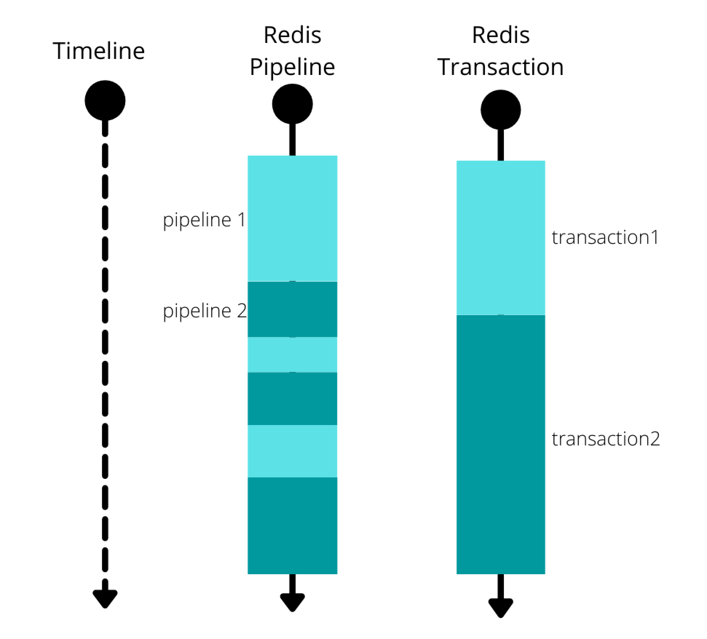
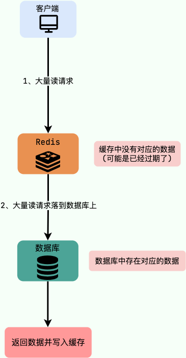
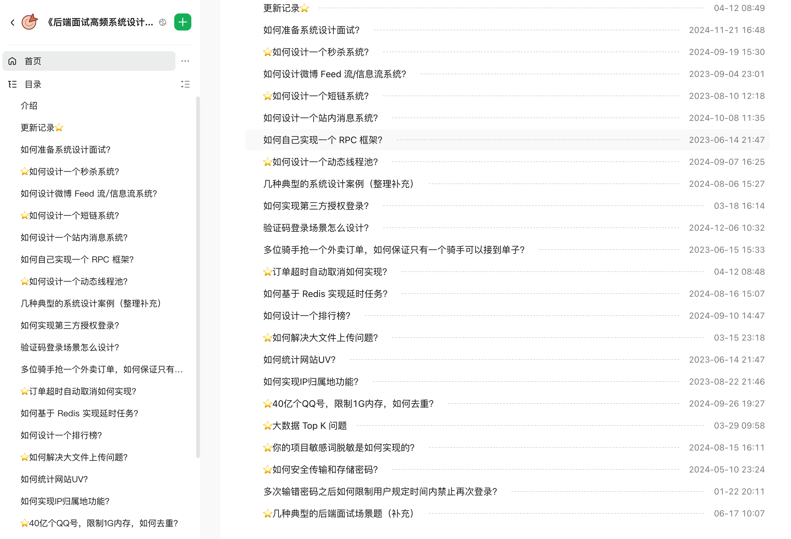

# 数字马力（蚂蚁内包）Java 面经，含答案复盘

给球友们深度复盘一篇热乎的**数字马力校招面经**，并附上我整理的详细的参考答案。

在开始之前，我们先快速厘清一个概念：**大厂“内包”**。

像数字马力（蚂蚁集团 100%控股）和腾讯云智（腾讯 100%控股）这类公司，就是典型的“内包”。它们是大型企业为了解决传统外包带来的**数据安全、协同管理和成本问题**，而催生出的新型用工形态。

**客观来说：** 这类公司的整体待遇通常优于大部分中小厂，但面试难度也往往不低。

这份面经的主人公，经历了一段非常艰难的求-职期。在面试了众多公司后，这几乎是他收到的**唯一一个 Offer**。虽然他对数字马力也有犹豫，但在别无选择的情况下，也只能先接下。他感慨道：“身心俱疲，再也不想经历面试了。”

### 自我介绍

面试时的自我介绍，其实是你给面试官的“第一印象浓缩版”。它不需要面面俱到，但要精准、自信地展现你的核心价值和与岗位的匹配度。通常控制在 1-2 分钟内比较合适。一个好的自我介绍应该包含这几点要素：

1. 用简单的话说清楚自己主要的技术栈于擅长的领域，例如 Java 后端开发、分布式系统开发；
2. 把重点放在自己的优势上，重点突出自己的能力，最好能用一个简短的例子支撑，例如：我比较擅长定位和解决复杂问题。在\[某项目/实习]中，我曾通过\[简述方法，如日志分析、源码追踪、压力测试]成功解决了\[某个具体问题，如一个棘手的性能瓶颈/一个偶现的 Bug]，将\[某个指标]提升了\[百分比/具体数值]。
3. 简要提及 1-2 个最能体现你能力和与岗位要求匹配的项目经历、实习经历或竞赛成绩。不需要展开细节，目的是引出面试官后续的提问。
4. 如果时间允许，可以非常简短地表达对所申请岗位的兴趣和对公司的向往，表明你是有备而来。

### 介绍项目的亮点

**当你需要向别人（尤其是面试官）介绍项目中的亮点时，我强烈推荐你使用 B-T-A-R 模型来组织思路和语言。**

这个模型能帮你把一个技术故事讲得既清晰又有条理，还能突出你的能力和贡献。它包含四个关键部分：

* **B - Background (项目背景):**
  * **做什么：** 用一两句话概括这个项目是干什么的，它解决了什么业务问题，或者满足了什么用户需求。
  * **为什么重要：** 简单说明当时的业务场景或技术上下文，让听众明白你接下来要讲的亮点是在什么样的大环境下产生的。
* **T - Task/Challenge (任务/挑战):**
  * **遇到什么坎：** 具体描述在这个项目中，你或团队面临的最棘手的技术难题或业务挑战是什么。
  * **钩子在这里：** 这个问题越具体、越有挑战性，就越能吸引听众的注意力，为后续你的解决方案做铺垫。避免泛泛而谈，比如“性能优化”，要具体到“某个核心接口在高并发下响应时间超过 2 秒，无法满足 SLA 要求”。
* **A - Action (行动/方案):**
  * **你是怎么干的：** 这是展示你技术深度和解决问题能力的核心部分。详细说明：
    * **问题分析：** 你是如何定位问题根源的？用了什么工具或方法？
    * **方案思考与选择：** 你考虑过哪些备选方案？为什么最终选择了当前这个方案？（这里可以体现你的技术视野和权衡能力）
    * **具体实施：** 你的方案是如何设计的？涉及哪些关键技术点或架构调整？
    * **克服困难：** 在实施过程中遇到了哪些新的问题？你是如何克服的？
* **R - Result (结果/成果):**
  * **带来了什么价值：** 用具体、可量化的数据来展示你的解决方案所带来的积极成果。
  * **用数据说话：** 这是最有说服力的部分。比如：“接口响应时间从平均 2 秒降低到 200 毫秒”、“系统吞吐量提升了 3 倍”、“错误率降低了 80%”、“为公司节省了 XX%的服务器成本”等。
  * **其他影响：** 也可以提及一些非量化的积极影响，如“提升了用户体验”、“增强了系统稳定性”、“为后续业务扩展打下了基础”等。

### 抽象类和接口有什么区别

* **设计目的**：接口主要用于对类的行为进行约束，你实现了某个接口就具有了对应的行为。抽象类主要用于代码复用，强调的是所属关系。
* **继承和实现**：一个类只能继承一个类（包括抽象类），因为 Java 不支持多继承。但一个类可以实现多个接口，一个接口也可以继承多个其他接口。
* **成员变量**：接口中的成员变量只能是 `public static final` 类型的，不能被修改且必须有初始值。抽象类的成员变量可以有任何修饰符（`private`, `protected`, `public`），可以在子类中被重新定义或赋值。
* **方法**：
  * Java 8 之前，接口中的方法默认是 `public abstract` ，也就是只能有方法声明。自 Java 8 起，可以在接口中定义 `default`（默认） 方法和 `static` （静态）方法。 自 Java 9 起，接口可以包含 `private` 方法。
  * 抽象类可以包含抽象方法和非抽象方法。抽象方法没有方法体，必须在子类中实现。非抽象方法有具体实现，可以直接在抽象类中使用或在子类中重写。

在 Java 8 及以上版本中，接口引入了新的方法类型：`default` 方法、`static` 方法和 `private` 方法。这些方法让接口的使用更加灵活。

Java 8 引入的`default` 方法用于提供接口方法的默认实现，可以在实现类中被覆盖。这样就可以在不修改实现类的情况下向现有接口添加新功能，从而增强接口的扩展性和向后兼容性。

```java
public interface MyInterface {
    default void defaultMethod() {
        System.out.println("This is a default method.");
    }
}
```

Java 8 引入的`static` 方法无法在实现类中被覆盖，只能通过接口名直接调用（ `MyInterface.staticMethod()`），类似于类中的静态方法。`static` 方法通常用于定义一些通用的、与接口相关的工具方法，一般很少用。

```java
public interface MyInterface {
    static void staticMethod() {
        System.out.println("This is a static method in the interface.");
    }
}
```

Java 9 允许在接口中使用 `private` 方法。`private`方法可以用于在接口内部共享代码，不对外暴露。

```java
public interface MyInterface {
    // default 方法
    default void defaultMethod() {
        commonMethod();
    }

    // static 方法
    static void staticMethod() {
        commonMethod();
    }

    // 私有静态方法，可以被 static 和 default 方法调用
    private static void commonMethod() {
        System.out.println("This is a private method used internally.");
    }

      // 实例私有方法，只能被 default 方法调用。
    private void instanceCommonMethod() {
        System.out.println("This is a private instance method used internally.");
    }
}
```

### Java 可变长参数有什么用？

从 Java5 开始，Java 支持定义可变长参数，所谓可变长参数就是允许在调用方法时传入不定长度的参数。就比如下面这个方法就可以接受 0 个或者多个参数。

```java
public static void method1(String... args) {
   //......
}
```

另外，可变参数只能作为函数的最后一个参数，但其前面可以有也可以没有任何其他参数。

```java
public static void method2(String arg1, String... args) {
   //......
}
```

可变长参数的核心价值在于**用一种优雅的方式替代了繁琐的方法重载和不便的数组传参**，让代码更加灵活、简洁和易读。它的本质是编译器的语法糖，可变长参数在编译后，会被编译器自动转换成一个数组。

### Spring Boot 如何读取配置信息？

1. `@Value`：注入单个配置属性值。简单直接，适用于注入少量、零散的配置。支持设置默认值和 Spring 表达式语言（SpEL），功能灵活。
2. `@ConfigurationProperties`：批量将一组相关的配置属性绑定到一个 Java 对象（POJO）上。支持复杂的配置结构（如列表、嵌套对象）。代码更清晰，是更推荐、更常用的方式。
3. `@PropertySource`：加载指定的、非默认的配置文件（如 myconfig.properties）。用于将不同模块的配置进行分离管理，让项目结构更清晰。

详细介绍以及更多 Spring Boot 面试题可以查看《Java 面试指北》的这篇文章：

[SpringBoot 常见面试题总结](https://www.yuque.com/snailclimb/mf2z3k/vqe4gz)

### Spring Boot 默认使用的日志框架是？

Spring Boot 默认选用 SLF4J (Simple Logging Facade for Java) 作为其日志门面 (Facade) / 日志抽象层，并搭配 Logback 作为默认的具体日志实现库 (Implementation)。

关于日志框架的详细介绍，可以参考《Java 面试指北》 的这篇文章：<https://www.yuque.com/snailclimb/mf2z3k/srwasy4ubg4htbzg>。

### 索引的优缺点

**索引的优点：**

1. **查询速度起飞 (主要目的)**：通过索引，数据库可以**大幅减少需要扫描的数据量**，直接定位到符合条件的记录，从而显著加快数据检索速度，减少磁盘 I/O 次数。
2. **保证数据唯一性**：通过创建**唯一索引 (Unique Index)**，可以确保表中的某一列（或几列组合）的值是独一无二的，比如用户 ID、邮箱等。主键本身就是一种唯一索引。
3. **加速排序和分组**：如果查询中的 ORDER BY 或 GROUP BY 子句涉及的列建有索引，数据库往往可以直接利用索引已经排好序的特性，避免额外的排序操作，从而提升性能。

**索引的缺点：**

1. **创建和维护耗时**：创建索引本身需要时间，特别是对大表操作时。更重要的是，当对表中的数据进行**增、删、改 (DML 操作)** 时，不仅要操作数据本身，相关的索引也必须动态更新和维护，这会**降低这些 DML 操作的执行效率**。
2. **占用存储空间**：索引本质上也是一种数据结构，需要以物理文件（或内存结构）的形式存储，因此会**额外占用一定的磁盘空间**。索引越多、越大，占用的空间也就越多。
3. **可能被误用或失效**：如果索引设计不当，或者查询语句写得不好，数据库优化器可能不会选择使用索引（或者选错索引），反而导致性能下降。

**那么，用了索引就一定能提高查询性能吗？**

**不一定。** 大多数情况下，合理使用索引确实比全表扫描快得多。但也有例外：

* **数据量太小**：如果表里的数据非常少（比如就几百条），全表扫描可能比通过索引查找更快，因为走索引本身也有开销。
* **查询结果集占比过大**：如果要查询的数据占了整张表的大部分（比如超过 20%-30%），优化器可能会认为全表扫描更划算，因为通过索引多次回表（随机 I/O）的成本可能高于一次顺序的全表扫描。
* **索引维护不当或统计信息过时**：导致优化器做出错误判断。

### 数据库中哪些字段适合索引优化？

* **被频繁查询的字段(WHERE 子句)**：我们创建索引的字段应该是查询操作非常频繁的字段。高选择性的列效果更好：也就是说，列中不重复的值越多（比如用户 ID、订单号），通过索引筛选出的数据就越少，索引效率越高。像性别这种选择性很低的列，单独建索引效果通常不佳，但可以作为组合索引的一部分。
* **频繁需要排序的字段 (ORDER BY 子句)**：索引已经排序，这样查询可以利用索引的排序，加快排序查询时间。
* **被经常频繁用于连接的字段(JOIN ON 子句)**：经常用于连接的字段可能是一些外键列，对于外键列并不一定要建立外键，只是说该列涉及到表与表的关系。对于频繁被连接查询的字段，可以考虑建立索引，提高多表连接查询的效率。
* **尽量选择非 NULL 且短小的字段**：
  * **关于 NULL 值**：虽然现代数据库对 NULL 值的索引处理有所改进，但索引列中包含大量 NULL 值有时会影响优化器的效率和索引占用的空间（不同数据库处理方式有差异）。如果业务允许，并且字段经常被查询，可以考虑用一个有明确业务含义的默认值（如 0, 'N/A'）代替 NULL。但这不是绝对的，具体情况需具体分析。
  * **短小字段**：索引列的值越短，索引本身占用的空间就越小，一次 I/O 能加载的索引项就越多，查询效率相对更高。例如，用 INT 类型存储年龄比用 VARCHAR(100) 好。

### Redis 如何同时执行多条命令？

当我们需要向 Redis 发送多条命令时，如果一条一条地发送，每次命令都会产生一次网络往返 (RTT)，这在命令数量很多时会非常低效。为了解决这个问题，Redis 提供了几种批量执行命令的方式，主要是 **Pipeline (流水线)** 和 **Lua 脚本**。

Pipeline 允许客户端将**一批 Redis 命令打包起来，一次性发送给 Redis 服务器**。服务器收到这些命令后，会按顺序执行它们，然后将所有命令的执行结果一次性返回给客户端。本来 N 条命令需要 N 次网络往返，用了 Pipeline 后，理想情况下只需要 1 次（发送批命令）+ 1 次（接收批结果）。不过，Pipeline 中的命令是按顺序执行，但它们**不是原子操作**。如果在执行过程中，有其他客户端的命令插入进来，是可能发生的（虽然 Redis 单线程模型保证了单个命令的原子性，但 Pipeline 整体不是）。



Lua 脚本同样支持批量操作多条命令。一段 Lua 脚本可以视作一条命令执行，可以看作是 **原子操作**。也就是说，一段 Lua 脚本执行过程中不会有其他脚本或 Redis 命令同时执行，保证了操作不会被其他指令插入或打扰，这是 pipeline 所不具备的。并且，Lua 脚本中支持一些简单的逻辑处理比如使用命令读取值并在 Lua 脚本中进行处理，这同样是 pipeline 所不具备的。

**总结对比：**

| 特性 | Pipeline (流水线) | Lua 脚本 |
| --- | --- | --- |
| **原子性** | 非原子 | 原子 |
| **网络开销** | 显著减少 RTT | 显著减少 RTT |
| **服务端逻辑** | 不支持 | 支持简单的条件、循环等 |
| **命令依赖** | 命令间结果不能直接用于后续命令 (客户端处理) | 脚本内命令可以依赖前序命令结果 |
| **主要用途** | 提升批量操作吞吐量 | 保证多操作原子性，服务端简单逻辑处理 |

### 缓存击穿问题注意过吗？

缓存击穿中，请求的 key 对应的是 **热点数据**，该数据 **存在于数据库中，但不存在于缓存中（通常是因为缓存中的那份数据已经过期）**。这就可能会导致瞬时大量的请求直接打到了数据库上，对数据库造成了巨大的压力，可能直接就被这么多请求弄宕机了。



举个例子：秒杀进行过程中，缓存中的某个秒杀商品的数据突然过期，这就导致瞬时大量对该商品的请求直接落到数据库上，对数据库造成了巨大的压力。

**有哪些解决办法？**

1. **永不过期**（不推荐）：设置热点数据永不过期或者过期时间比较长。
2. **提前预热**（推荐）：针对热点数据提前预热，将其存入缓存中并设置合理的过期时间比如秒杀场景下的数据在秒杀结束之前不过期。
3. **加锁**（看情况）：在缓存失效后，通过设置互斥锁确保只有一个请求去查询数据库并更新缓存。

### 分布式下 Session 一致性如何保证

将 Session 数据集中存储在像 **Redis** 或 **Memcached** 这样的分布式缓存系统中。所有服务器都通过访问这个共享缓存来获取和更新 Session。

这是目前最广泛使用的方案。

* **优点**：
  * **高性能**：缓存系统基于内存操作，读写速度非常快，能轻松应对高并发的 Session 访问。
  * **易于水平扩展**：缓存集群（如 Redis Cluster）可以方便地扩展以支持更大的数据量和并发。
  * **相对简单**：很多框架（如 Spring Session）都对这种方式提供了很好的支持，集成方便。
* **缺点**：
  * **数据可能丢失**：如果缓存服务（如 Redis）宕机且没有配置好持久化或高可用方案（如哨兵、集群），可能会丢失部分 Session 数据，导致用户需要重新登录。不过，通过合理的持久化和集群配置可以大大降低风险。
  * **引入额外依赖**：需要维护一套独立的缓存系统。

### 为什么要用 XXL-JOB？在你项目中有什么用？

XXL-JOB 是一个非常流行的轻量级分布式任务调度平台。简单来说，当你的项目里有很多需要在特定时间自动执行，或者需要跨多台服务器协调执行的任务时，XXL-JOB 就是一个很好的选择。

**它主要解决以下几类业务场景的需求：**

1. **定时执行需求**：在固定的时间点或时间间隔执行某些任务，例如每天凌晨进行数据备份、生成业务报表、定时清理过期数据、未支付订单超时取消等任务。
2. **延迟执行需求**：在某个事件发生后等待一段时间再执行任务，比如订单过期处理、用户注册后的延迟通知、延迟执行的营销活动推送等。
3. **广播执行需求**：在分布式系统中，任务需要在所有节点上同时执行，例如使用广播执行模式在集群中清理日志、同步配置文件、更新缓存等操作。
4. **分布式处理需求**：将一个耗时较长的任务分解成多个子任务，分发到集群中的多个节点上并行执行，以加速任务的处理，例如处理大量数据的更新或复杂计算任务，将任务分片后分发到集群中的多个节点上并行执行，缩短整体处理时间。

**实际面试中一定要结合你项目中对 XXL-JOB 的实际使用来说，介绍一下你项目用到了 XXL-JOB 的业务是什么，XXL-JOB 在其中的作用是什么。**

### 能用 Spring Task 替代 XXL-JOB 吗？

XXL-JOB 是一个轻量级分布式任务调度平台，在项目中有以下几个优势：

1. **支持分布式任务调度**：XXL-JOB 支持在多个节点上均衡地分配任务，适用于分布式环境。而 Spring Task 主要用于单机环境，缺乏对分布式任务调度的支持。
2. **统一的管理和监控界面**：XXL-JOB 提供友好的可视化界面，方便对任务进行集中管理和监控。通过这个界面，用户可以方便地新增、更新、删除任务，并查看任务的执行日志和状态。Spring Task 缺乏这样的统一管理和监控界面，不便于集中管理和监控任务。
3. **复杂的调度策略**：XXL-JOB 支持多种复杂的调度策略和任务依赖关系配置，可以满足多样化的调度需求。相比之下，Spring Task 的调度策略相对简单，无法满足一些复杂的调度需求。
4. **任务分片和弹性扩容**：XXL-JOB 支持任务的分片执行，可以将大任务拆分成多个子任务并行处理，提高执行效率。此外，XXL-JOB 支持动态扩容，可以根据需要增加或减少执行器节点，灵活适应任务负载的变化。Spring Task 不具备原生的任务分片和弹性扩容能力。
5. **任务依赖管理**：XXL-JOB 支持任务之间的依赖关系配置，可以确保依赖任务按顺序执行，适用于复杂的任务链路管理。Spring Task 的任务依赖管理功能相对较弱，难以处理复杂的任务依赖关系。
6. **任务失败告警和重试机制**：XXL-JOB 提供任务执行失败后的告警功能，并且支持任务重试机制，确保任务在失败后能够被及时处理。而 Spring Task 缺乏内置的告警和重试机制，需要自行实现这些功能。
7. ......

总结来说，对于需要可靠、灵活、可扩展的任务调度解决方案的项目，XXL-JOB 是一个非常合适的选择。Spring Task 虽然在简单的单机任务调度中也能发挥作用，但在分布式任务调度、任务管理和监控、复杂调度策略支持等方面存在不足，难以替代 XXL-JOB。

**实际面试中一定要结合你项目中对 XXL-JOB 的实际使用来说，核心是提到你项目用到了哪些 Spring Task 无法提供给你的功能。**

### 大量 Excel 导出时出现 OOM 问题，如何解决？

Excel 导出时发生 OOM (Out Of Memory) 是个常见问题，尤其当数据量非常大的时候。根本原因在于，很多传统的 Excel 操作库会尝试**一次性把所有数据加载到内存中**来构建 Excel 文件，数据一大，内存自然就爆了。

解决这个问题的核心思路是避免全量数据驻留内存，采用流式处理或者分批处理的方式。

EasyExcel 是阿里巴巴开源的一个优秀 Java Excel 处理框架，它的核心设计理念就是为了解决 OOM 问题。它采用\*\*“边读边写”的流式处理机制\*\*，逐行读取数据并写入到输出流，内存占用极低，非常适合大数据量的导出。FastExcel 可以看作是 EasyExcel 的升级版或增强版，由原作者在 EasyExcel 停止积极维护后推出，继承了其优点并在性能和功能上有所提升。

如果你因为历史项目原因或者其他特定需求必须使用 Apache POI，那么一定要用它提供的 **SXSSFWorkbook (Streaming Usermodel API)**。SXSSFWorkbook 允许你定义一个“内存窗口大小”（比如，只在内存中保留最近的 100 行数据）。当写入的行数超过这个窗口时，最早的行数据会被自动刷新（flush）到磁盘上的一个临时文件中，从而释放内存。最后，这些临时文件会被整合成最终的 Excel 文件。

其他建议：

* **分页查询导出**：不要一次性从数据库查询所有数据。可以分页查询，每次处理一小批数据，然后通过流式库写入 Excel。这可以显著降低数据库压力和应用服务器的瞬时内存占用。
* **按需导出字段**：只导出用户真正需要的列，避免导出不必要的宽表数据，减少数据量。
* **异步导出与任务队列**：对于非常大的数据导出，可以将其设计成一个异步任务。用户提交导出请求后，后端将任务放入消息队列（如 Kafka, RabbitMQ），由专门的 worker 服务异步处理导出，完成后再通知用户下载。这样可以避免长时间占用 HTTP 连接，提升用户体验，并且更利于资源控制。

更多场景题，推荐阅读星球的《后端面试高频系统设计&场景题》：<https://t.zsxq.com/avfM0> 。




> 更新: 2025-07-03 14:25:37  
> 原文: <https://www.yuque.com/snailclimb/mf2z3k/sgbhauahmlt0ngf5>