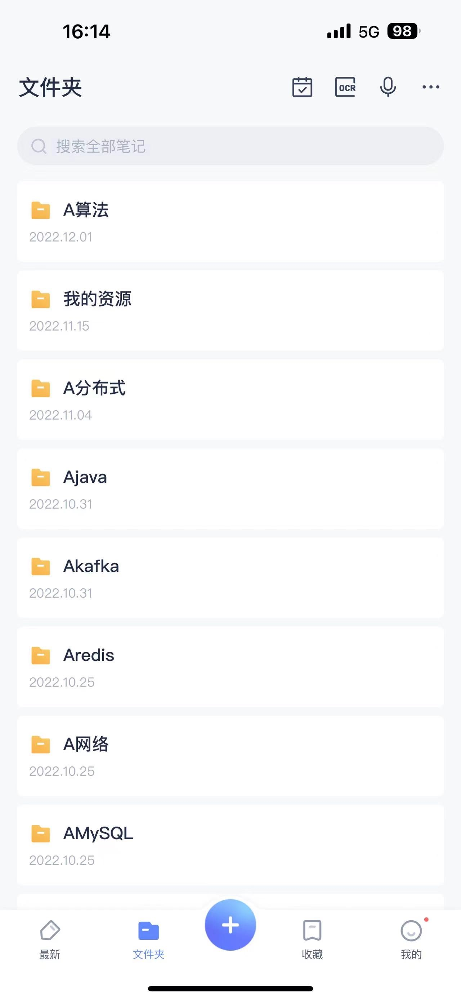

# 四年半经验社招，腾讯、滴滴、字节、京东、快手、美团、蚂蚁等大中厂面试总结

## 背景介绍

大家好，本人 2018 年毕业于一所普通 211 学校，专业是软件工程，学历背景还说的过去，至少大部分情况下不会给自己拖后腿。

我于今年 1 月份在百度毕业，先后参加过腾讯、滴滴、字节、京东、快手、美团、蚂蚁等大中厂的面试。offer 阶段是在快手、滴滴和京东之间选择了京东。薪资的话，总包是 51w。

参加了很多次面试，总结了一些个人对于面试的见解，希望能给大家以后的面试带来些许帮助。本人平时注重总结一些理论知识，所以遇到毕业的情况也不太慌，也建议大家平时要卷安思危以应对未来的多种可能性的发生。下面介绍一下我在面试阶段遇到的部分面试真题与个人总结。

下面是我个人复习的一些笔记记录(笔记软件：有道)：

## 算法

算法需要长期的准备，个人觉得 leetcode 上刷 200+个题目就足以涵盖国内大厂的面试范围了，可以在 leetcode 上去刷热门的前二百个题目。因为大概率面试官也是刷的这些题目。

### 面试真题

1、三数之和(经典题 注意结果的去重)

2、回文链表(链表的题目都不难 热门的几个题目刷通就 ok 了)

3、数组中的第 k 个最大元素(借助快排思想来做 所以快排当然得熟练)

4、寻找旋转排序数组中的最小值(标准二分查找的变体)

5、二叉树(比较热门 遇到过层序遍历、最近公共祖先 、最长路径和等题型)

6、复原 ip 地址(经典回溯题目)

7、动态规划(这类型题目不会太难 基础的动态规划题型要会 比如背包、打家劫舍、股票买卖等 核心是推敲出状态转移方程)

### 总结

算法一定要提前准备，临时抱佛脚效率非常低，有跳槽想法的兄弟，可以在日常工作中没事就刷一两个，而且一定要自己思考，不要上来就看答案，如果没有思路，那么可以看下思路解析，然后再去自己动手写，这样也可以锻炼编程能力，对于题目的记忆也会更加深刻。

## Java

Java 相关的内容非常的多，对于集合、io、多线程、jvm 相关的问题比较热门。

### 面试真题

1、除了 `clone()` 还有哪些方式可以对对象进行深拷贝？

2、java 对象的内存结构？标记字是做什么的？

3、写个单例？为何静态内部类实现的单例可以做到线程安全且可延迟加载？

4、`new Hashmap<1000>` 和 `new Hashmap<10000>` 在数据都塞满的时候有什么区别？（提示 扩容相关）

5、java 弱引用和虚引用的区别？

6、垃圾回收时标记存活对象的三色标记法原理，以及在出现漏标、错标情况时是如何解决的？

7、jvm 调优你如何做的？现象->排查过程->解决方式->不同解决方案的对比与选择

8、为何引入 JIT 编译？逃逸分析是什么？

9、多线程中的三大问题 java 是如何解决的？

10、`synchronized` 底层实现原理？释放锁之后如何通知其他线程获取锁？

11、讲讲 AQS?

12、`synchronized` 做了哪些优化？（偏向锁、轻量级锁、自旋锁、锁粗化、锁消除等）

13、`LongAdder` 实现原理？

14、动态代理的实现方式有哪些？对比与选择？

### 总结

这些知识很杂，需要大家平时多积累一下，我推荐[《Java 面试指北》](https://javaguide.cn/zhuanlan/java-mian-shi-zhi-bei.html) 以及 [JavaGuide](https://javaguide.cn/)，这里面对上面的问题均有涉及，知识面非常广，对我的帮助也很大。

## 数据库和消息队列

### MySQL

#### 面试真题

1、索引(为何使用 b+树而不是使用别的数据结构？ 索引下推？倒排索引？)

2、事务(ACID 隔离级别 幻读如何出现的 又是如何解决？)

3、锁(给一个 sql 问这条 sql 在不同隔离级别下是如何加锁的？)

4、mvcc 机制(实现原理以及 rr 和 rc 隔离级别下实现的区别？)

5、redolog undolog binlog(会问分别是用来做什么的 有什么共同点 区别？)

6、sql 优化(选择一个适合自己业务的 sql 场景 描述清楚自己如何通过 explain 命令来分析和优化的？)

#### 总结

MySQL 在后端面试中几乎是必问的重点，一定要提前认真准备，像索引、锁、事务等知识点，一定要多复习几遍。

### Redis

#### 面试真题

1、底层数据结构有哪些？跳表实现原理？为何不用红黑树？

2、Redis 的过期策略？

3、Redis 的持久化？

4、Redis 主从、哨兵、集群工作原理？三种部署方式的区别？

5、缓存穿透、击穿、打满、雪崩出现的原因与常用解决办法

6、热 key 的解决方案（如何发现 如何优化）

#### 总结

Redis 在后端面试中几乎也是必问的重点，一定要提前认真准备，像底层数据结构、持久化策略、集群等知识点，一定要多复习几遍。

### MQ

#### 面试真题

1、Kafka 基本工作原理？

2、Kafka 为何高吞吐？

3、Kafka 消息的可靠性、顺序性是如何实现的的？

4、Kafka 的 ISR 机制？

5、Kafka 与其他 MQ 的对比与选择

#### 总结

可选择自己熟悉的 MQ 进行面试，我选择的是 Kafka。

### 总结

很多人在准备数据库和消息队列这块面试的时候会选择看一些经典的书籍，但是我觉得如果是应付面试的话，有点没必要，书中知识枯燥乏味，且重点不突出，所以我建议这部分内容的准备可以去针对性的看一下文档，一定要深入理解其实现原理以及为何这样实现。我还是选择在  [《Java 面试指北》](https://javaguide.cn/zhuanlan/java-mian-shi-zhi-bei.html) 以及 [JavaGuide](https://javaguide.cn/) 中看了很多关于数据库和消息队列的资料，这些资料足以去应对面试了（非托，真心推荐，内容真心不错！！！）。。

## 项目

这部分的内容比较活，但是也需要提前模拟与准备

### 面试真题

1、 介绍一下你的项目以及你做了哪些？

2、说一下在项目中你觉得有挑战（亮点、难点）的工作？

3、生产环境遇到过哪些问题？

4、在这个项目中你学到了什么？

### 总结

这部分因人而异，关键在于你要去挖掘你项目中的亮点，没有亮点就去编造一些亮点，但是前提是一定要符合你们具体的业务场景，不然会假的很明显，给面试官留下不好的印象。

另一个比较重要的点就是你在项目中做了什么，这部分内容也需要提前好好准备，是必问的。其次是需要提前准备一些在项目生产环境中出现的异常，以及你的解决方式是什么。对于项目的准备，我认为这三点是非常重要的，大家可以按照自己实际项目来认真思考。项目部分很大程度上会决定你是否能过通过这次面试。

## 分布式

分布式就不多说了，什么 base 理论，raft 协议都需要知道。另外就是分布式锁、分布式事务相关的一些知识，大家用到过的可以讲讲，比较加分，没用到过的面试官一般也不会问到

## 总结

面试说到底还是两个人沟通的过程，所以表达能力要好，逻辑思维要清晰，要说可以让面试官听懂的话，而不是自己能听懂的话。对于技术知识，技术最终还是要回归到实践，只有真正的实践过，才可以更好的掌握技术，最后希望大家都可以拿到自己心仪的 offer。

> 更新: 2024-07-26 18:18:02  
> 原文: <https://www.yuque.com/snailclimb/mf2z3k/uxdcv9arn0q1r09r>