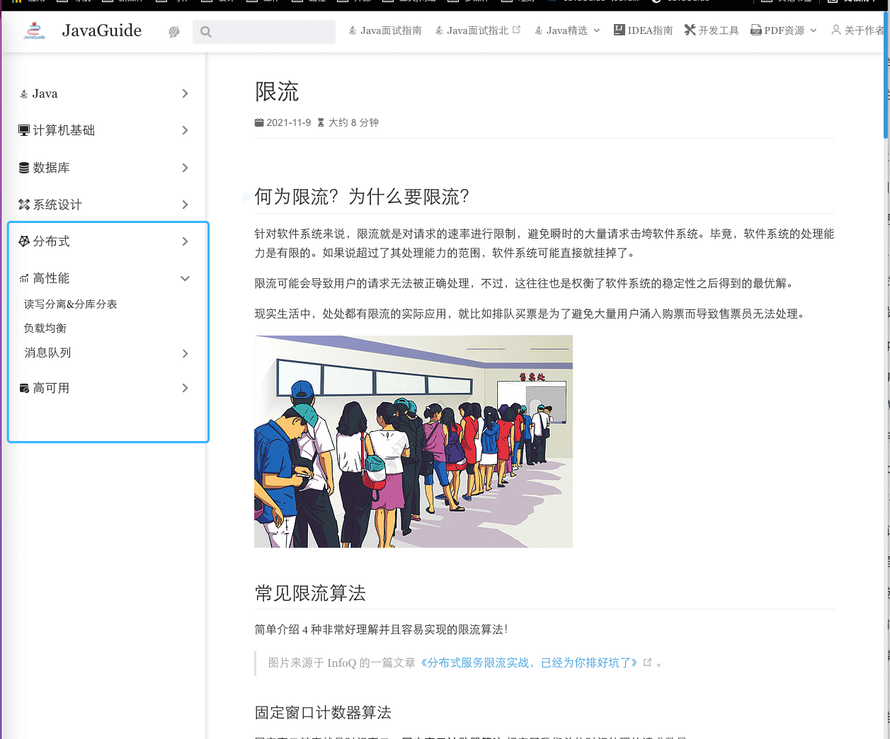

# 如何获得高并发的项目经验？

不论是应届生还是有几年工作经验的程序员，都可能会面临一个问题：**接触不到高并发场景**。

不要慌！说实话，能接触到高并发这类业务场景的人还是极少数的。即使在阿里、京东这种公司，你也还是很有可能接触不到。

我在大学那会的时候，自己就比较喜欢捣鼓各种高并发相关的技术了（还是因为太卷，工作之后实际并没有怎么用到，哈哈哈），自己在手动搭建过 Redis 集群、Zookeeeper 集群，动手实现过分库分表、读写分离。

在介绍方法之前，我们首先知道 **高并发系统设计的三大目标** ：

+ **高性能** ：系统的处理请求的速度很快，响应时间很短。
+ **高可用** ：系统几乎可以一直正常提供服务。也就是说系统具备较高的无故障运行的能力。
+ **可扩展** ：流量高峰时能否在短时间内完成扩容，更平稳地承接峰值流量，比如双 11 活动、明星离婚、明星恋爱等热点事件。

**实现高性能的常用手段**  ：

+ 数据库 
    - 分库分表&读写分离
    - NoSQL
+ 缓存
+ 消息队列 （待重构）
+ 负载均衡
+ 池化技术
+ ......

**实现高可用的常用手段**  ：

+ 限流
+ 降级
+ 熔断
+ 排队
+ 集群
+ 超时和重试机制
+ 灾备设计
+ 异地多活

**实现可扩展架构的常用手段**：

+ 分层架构：面向流程拆分
+ SOA、微服务：面向服务拆分
+ 微内核架构：面向功能拆分

你可以在 JavaGuide 的在线阅读网站上找到上面这些手段对应的详细讲解。篇幅问题，我这里就不帖原文了。网站地址：[https://javaguide.cn/](https://javaguide.cn/) 。

知道了高并发系统设计相关的概念和手段之后，废话不多说，直接推荐两种我觉得比较靠谱的方法。

**第一种方法是自己研究某个技术然后对已有项目进行改进**，具体步骤如下：

1. 自己研究某个技术比如读写分离。
2. 将自己研究的成果应用到自己的项目比如为项目增加读写分离来提高读数据库的速度。
3. 想一想项目用了某个技术比如读写分离之后，会不会遇到什么问题，项目的性能到底提升了多少。如果你能模拟一下真实场景就更好了，既能真正学到，又能让自己项目经历更真实。
4. 简单复盘总结一下自己对项目所做的完善改进。

这里要说明一点的是：**一定不要为了学习实践某个技术而直接用在自己公司的项目上。**

技术是为了服务业务的，没必要用的技术就不要用！我之前有个同事天天喜欢在项目上用自己学到的新技术，结果，有一天就出现生产问题了。我现在想着这件事，都想锤他！

**你完全可以私下对项目进行改进。** 甚至说，你就只是搞懂了这个技术，并没有将其用在真实的项目中。面试官会专门去调查你这个项目么？那大概率是不会。不过，一定要确保自己是真的搞懂了！

我们只是迫于压力，为了找工作而简单润色一下项目经历而已嘛！

**第二种方法是你可以跟着视频/教程做一个分布式相关的项目**，然后把它吃透，最好还可以对这个项目进行改进，具体步骤如下：

1. 跟着视频/教程写一个分布式相关的项目（自己从头开始做也是一样的）。
2. 深入研究并搞懂项目涉及到的一些技术。
3. 思考有没有可以改进的地方？
4. 思考线上环境可能会有一些什么问题出现？该怎么解决？
5. 简单复盘总结复盘一下自己从这个项目中学到的什么东西。

我在大学的时候就是通过这种方法获得的高并发相关的经验。我还记得我当时做的那个分布式项目使用到了 Redis 是单机并且消息队列用的是已经淘汰的 ActiveMQ。所以，我就自己搭建了 Redis 集群，模拟各种可能出现的问题。同时，我使用 RocketMQ 替换了 ActiveMQ 并提取封装了消息队列相关的代码。

通过上面这两种方法来获得高并发经验的话，还有一点非常重要： **自己不光要模拟一些生产环境可能会遇到的问题，还要知道这些问题是怎么解决的。** 就比如说你用到了 Redis 的话，你自己肯定要私下模拟一下缓存穿透、单机内存不够用、Redis突然宕机等等情况。

基本上，你用到的大部分中间件可能会遇到的问题，你都能够在网上找到对应的案例和解答。多花点时间看看，自己实践一下，研究思考一下。这样的话，在面试中才不会掉链子。

> 更新: 2025-08-23 16:39:24  
> 原文: <https://www.yuque.com/snailclimb/mf2z3k/zcq5mh>