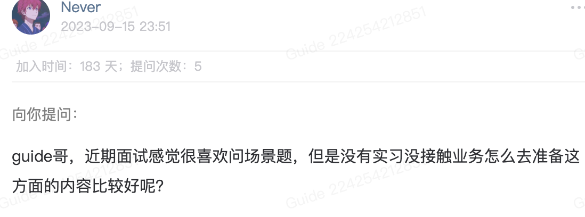

# 介绍

最近两年，越来越多的公司开始在面试中考察系统设计和场景问题的解决。相对于常规的八股文来说，系统设计和场景问题更能全面地考察求职者的技术能力。  

不过，也不用太担心。面试官一般会在面试中穿插一两个系统设计和场景题来考察你，全是场景题的情况还是极少的。

于是，我总结了这份《后端面试高频系统设计&场景题》，包含了常见的系统设计案例比如短链系统、秒杀系统、Feed流系统以及高频的场景题比如订单延时取消、海量数据去重、第三方授权登录、排行榜、IP归属地、多次输错密码后限制用户。

即使不是准备面试，我也强烈推荐你认真阅读这一系列文章，这对于提升自己系统设计思维和解决实际问题的能力还是非常有帮助的。并且，涉及到的很多案例都可以用到自己的项目上比如抽奖系统设计、第三方授权登录、Redis实现延时任务的正确方式。

**内容概览**：

- [x] [如何准备系统设计面试？](https://www.yuque.com/snailclimb/tangw3/vkuy43dm5dkwomwc)
- [x] [⭐如何设计一个秒杀系统？](https://www.yuque.com/snailclimb/tangw3/fbg3437sebnnphyg)
- [x] [如何设计微博 Feed 流/信息流系统？](https://www.yuque.com/snailclimb/tangw3/avp597scie2oltqy)
- [x] [⭐如何设计一个短链系统？](https://www.yuque.com/snailclimb/tangw3/pdgwuq7o87tp1xgb)
- [x] [如何设计一个站内消息系统？](https://www.yuque.com/snailclimb/tangw3/hxgr1wqsg7grt8k5)
- [x] [如何自己实现一个 RPC 框架？](https://www.yuque.com/snailclimb/tangw3/gh6t0eytthqxa5a2)
- [x] [⭐如何设计一个动态线程池？](https://www.yuque.com/snailclimb/tangw3/neiydtd79u8pgple)
- [x] [几种典型的系统设计案例（整理补充）](https://www.yuque.com/snailclimb/tangw3/mnnsr8xty6u5nsl6)
- [x] [如何实现第三方授权登录？](https://www.yuque.com/snailclimb/tangw3/kp5ug75dku4yu2q5)
- [x] [多位骑手抢一个外卖订单，如何保证只有一个骑手可以接到单子？](https://www.yuque.com/snailclimb/tangw3/dmi5t01gacg3wa5u)
- [x] [订单超时自动取消如何实现？](https://www.yuque.com/snailclimb/tangw3/sgageiesw7cqi1o7)
- [x] [如何基于 Redis 实现延时任务？](https://www.yuque.com/snailclimb/tangw3/dq6dco1estpldhv7)
- [x] [如何设计一个排行榜？](https://www.yuque.com/snailclimb/tangw3/at9ogbghb5090sh0)
- [x] [⭐如何解决大文件上传问题？](https://www.yuque.com/snailclimb/tangw3/hnkifck1z5erisgc)
- [x] [如何统计网站UV？](https://www.yuque.com/snailclimb/tangw3/ylfks98yh4cd48rr)
- [x] [如何实现IP归属地功能？](https://www.yuque.com/snailclimb/tangw3/eimghlwfbeifz53b)
- [x] **大数据量**：
    - [x] [⭐40亿个QQ号，限制1G内存，如何去重？](https://www.yuque.com/snailclimb/tangw3/ma15vethu5rp3fc7)
    - [x] [⭐日活上亿，如何保证给用户推荐视频不是重复的？](https://www.yuque.com/snailclimb/tangw3/rytwm8uriyitkp8y)
    - [x] [⭐大数据 Top K 问题](https://www.yuque.com/snailclimb/tangw3/eqvz9cgiwa75m38o)
- [x] [⭐你的项目敏感词脱敏是如何实现的？](https://www.yuque.com/snailclimb/tangw3/boag1pp6rurr5mxa)
- [x] [⭐如何安全传输和存储密码？](https://www.yuque.com/snailclimb/tangw3/pt0w151wtcal7oaf)
- [x] [多次输错密码之后如何限制用户规定时间内禁止再次登录？](https://www.yuque.com/snailclimb/tangw3/bkag5r9o4frnoee3)
- [x] [几种典型的后端面试场景题（补充）](https://www.yuque.com/snailclimb/tangw3/dq1bxf73l9xo1xdk)

最后，真心希望这一系列文章能够对你真正有帮助！如果有问题的话，欢迎在评论区与我交流。如果有帮助的话，也不要忘记点赞鼓励！

> 更新: 2025-12-17 21:40:18  
> 原文: <https://www.yuque.com/snailclimb/tangw3/vqzs6pygh5l1z5l4>