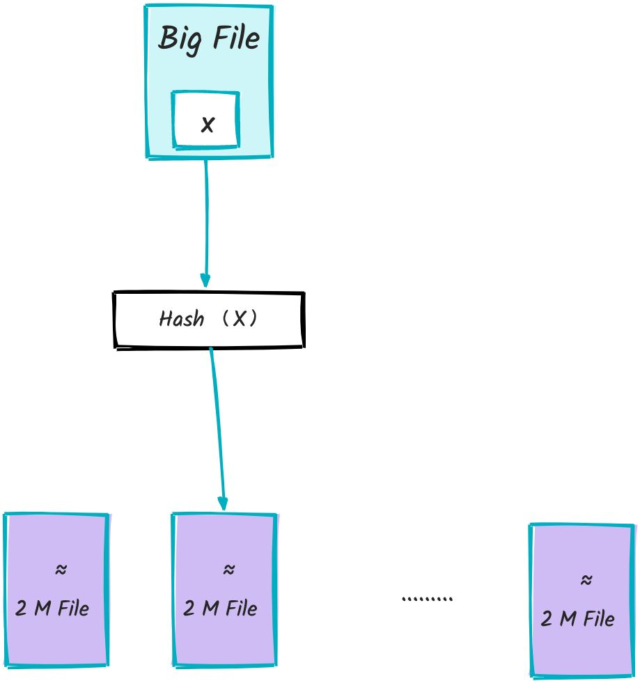

# ⭐大数据 Top K 问题

> 整理完善自：[海量数据场景高频面试题汇总](https://t.zsxq.com/HtRQ1) 。

Top K 问题一直是面试中的常客，这里分享几道经典的 Top K 问题：

1. 出现频率最高的 100 个词
2. 最热门的 10 个查询串
3. 每天热门 100 词

搞懂这几个问题之后，其他类似的 Top K 问题也就迎刃而解了。

# 出现频率最高的 100 个词

**题目描述**：假如有一个 1G 大小的文件，文件里每一行是一个词，每个词的大小不超过 16 bytes，要求返回出现频率最高的 100 个词。内存限制是 10M。

## 解法 1：分治法

由于内存限制（10MB），无法一次性将整个1GB文件加载到内存中进行处理。因此，我们采用**分治**的策略，将大文件分解成多个小文件，确保每个小文件的大小不超过10MB，从而在内存中进行高效处理。



***

**步骤1：分桶处理**

***

遍历大文件，读取每一行的词，并通过哈希函数将每个词分配到不同的桶（小文件）中。具体来说，使用 `hash(x) % 500`（相同的词一定落在同一个小文件中），将词 x 分配到编号为 i（0 ≤ i < 500）的桶文件 `f(i)` 中。

通过哈希分桶，将大文件分割成大约 500 个小文件，每个小文件的大小约为 **2MB（1GB / 500 ≈ 2MB）**，保证每个小文件能够在内存限制内完成词频统计。

**步骤2：统计每个桶中的词频**

***

统计每个小文件中出现频率最高的 100 个词。可以用 `HashMap` 来实现，其中 key 为词，value 为该次出现的频率（伪代码如下）。

```java
BufferedReader br = new BufferedReader(new FileReader(fin));
String line = null;
while ((line = br.readLine()) != null) {
	if(map.containsKey(line)){
        map.put（line，map.get(x) + 1）
    }else{
        map.put(line,1);
    }
}

br.close();
```

对于遍历到的词 x，如果在 `map` 中不存在，则执行 `map.put(x，1)`。若存在，则执行 `map.put(x，map.get(x) + 1)`,将该词出现的次数 + 1。

**步骤3：合并所有桶中的 Top 100 词**

***

具体方法是：

1. 创建一个大小为 100 的小顶堆 (Min-Heap)。
2. 遍历这 500 个列表/哈希表中所有的 (词, 频率) 对。
3. 对于每一个 (词, 频率) 对：
   * 如果堆的大小 < 100，直接将该对（基于频率）加入堆中。
   * 如果堆的大小 == 100，将当前词的频率与堆顶元素（堆中频率最小的词）的频率比较。
   * 如果当前词的频率 > 堆顶词的频率，则移除堆顶元素，并将当前 (词, 频率) 对插入堆中。

* 当遍历完所有 500 个小文件的所有词频信息后，小顶堆中剩下的 100 个元素就是全局频率最高的 100 个词。

最后，总结一下，这个解法的主要思路如下：

1. 采用**分治**的思想，进行哈希取余
2. 使用 HashMap 统计每个小文件单词出现的次数
3. 使用\*\*小顶堆，\*\*遍历步骤 2 中的小文件，找到词频 Top 100 的单词。

在上述步骤中，有一个潜在的问题需要解决：如果某个词在大文件中出现频率过高，可能导致其所属的小桶超过 10MB 的内存限制。这会违反内存使用的要求，无法在内存中完成该桶的词频统计。

对于这种问题的缓解方案如下：

* **增加桶的数量**：例如使用 1000 个或更多的桶，进一步减小每个桶的预期大小，降低单个桶过大的风险。对于 1GB 文件和 10MB 限制，500 个桶（预期 2MB/桶）通常是一个不错的起点，但增加桶数更安全。
* **特殊处理大桶**：如果某个桶在分桶后仍然过大，可以对这个特定的桶再进行一次或多次哈希分桶，直到子桶大小符合内存限制。这会增加实现的复杂度。

## 解法 2：多路归并排序方法

**步骤1：多路归并排序对大文件进行排序**

***

多路归并排序对大文件排序的步骤如下：

1. 将 1GB 的文件按顺序切分成多个小文件，每个文件大小不超过 2MB ，总共 500 个小文件。这样可以确保每个小文件在后续处理时能够被完全加载到内存中，满足 10MB 的内存限制。
2. 使用 10MB 的内存分别对每个小文件中的单词进行排序。这样可以确保每个小文件内部是有序的，这为后续的多路归并排序打下基础。
3. 使用一个大小为 500 的最小堆，将所有 500 个已排序的小文件进行合并，生成一个完全有序的文件。

其中第 3 步，对 500 个小文件进行多路排序的思路如下：

1. 初始化一个最小堆，大小就是有序小文件的个数 500。堆中的每个节点存放每个有序小文件对应的输入流。
2. 按照每个有序文件中的下一行数据对所有文件输入流进行排序，单词小的输入文件流放在堆顶。
3. 拿出堆顶的输入流，并且将下一行数据写入到最终排序的文件中，如果拿出来的输入流还有数据的话，那么就将这个输入流再次添加到栈中。否则说明该文件输入流中没有数据了，那么可以关闭这个流。
4. 循环这个过程，直到所有文件输入流中没有数据为止。

**步骤2：统计出现频率最高的100个词**

1. 初始化一个 100 个节点的小顶堆，用于保存 100 个出现频率最高的单词。
2. 遍历整个文件，一个单词一个单词地从文件中读取出来，并且进行计数。
3. 等到遍历的单词和上一个单词不同的话，那么上一个单词及其频率如果大于堆顶的词的频率，那么放在堆中。否则不放

归并排序涉及大量的磁盘读写操作，可能会成为性能瓶颈。下面是一些优化建议：

* 缓冲区大小：合理设置缓冲区大小，减少磁盘I/O次数。
* 使用更高效的存储介质：如 SSD 以提高读写速度。
* 并行归并：在硬件支持的情况下，进行多线程或多进程的并行归并，提升整体速度。

# <font style="color:rgb(38, 38, 38);">最热门的 10 个查询串</font>

**题目描述**：<font style="color:rgb(38, 38, 38);">搜索引擎会通过日志文件把用户每次检索使用的所有查询串都记录下来，每个查询床的长度不超过 255 字节。假设目前有 1000w 个记录（这些查询串的重复度比较高，虽然总数是 1000w，但如果除去重复后，则不超过 300w 个）。请统计最热门的 10 个查询串，要求使用的内存不能超过 1G（一个查询串的重复度越高，说明查询它的用户越多，也就越热门）。</font>

## <font style="color:rgb(38, 38, 38);">解法 1：分治法</font>

<font style="color:rgb(38, 38, 38);">  
</font><font style="color:rgb(38, 38, 38);">分治法依然是一个非常实用的方法。</font>

<font style="color:rgb(38, 38, 38);"></font>

我们还可以在划分数据时，保证相同的查询串总是被分配到同一个文件，这可以通过哈希函数来实现：

1. **划分数据**：使用哈希函数（例如 `hash(查询串) % 小文件数量N`）将查询串分配到 N 个不同的小文件中。
2. **局部统计**： 对每一个小文件，使用哈希表统计所有查询串在该块内的出现频率。在这一步计算出的某个查询串的频率，实际上就是它在整个数据集中的全局总频率，不需要后续再跨文件合并计数值了。
3. **全局合并**：遍历 N 个文件的统计结果。维护一个大小为 10 的小顶堆。对于每个遇到的 (查询串, 频率) 对，与堆顶元素比较：如果频率大于堆顶频率，则弹出堆顶，将当前项插入堆中。
4. **最终 Top 10**：处理完所有小文件的统计结果后，小顶堆里剩下的 10 个元素就是全局频率最高的 10 个查询串。

<font style="color:rgb(38, 38, 38);"></font>

<font style="color:rgb(38, 38, 38);">相比于直接用一个大哈希表处理所有数据，这种方法通过分区，降低了单个处理步骤中的峰值内存需求。如果内存非常紧张（比如远小于 1GB），这种方法可能是唯一可行的。</font>

<font style="color:rgb(38, 38, 38);"></font>

<font style="color:rgb(38, 38, 38);">分治法适用于数据量非常大的情况，可以并行处理，提高效率。不过，需要多次读取和写入磁盘，可能导致 I/O 瓶颈，并且实现相对复杂。</font>

## <font style="color:rgb(38, 38, 38);">解法 2：HashMap 法</font>

<font style="color:rgb(38, 38, 38);"></font>

尽管字符串总数较多，但去重后不超过 300 万条，因此可以考虑使用 `HashMap` 来统计每个查询串的出现次数。假设每个查询串平均占用 255 字节，加上 4 字节的计数器，总内存消耗约为 300 万 × (255 + 4) ≈ 777MB，这在 1GB 的内存限制内是可行的。

1. **初始化一个 HashMap**：创建一个空的哈希表（比如 Java 的 `HashMap<String, Integer> `或 Python 的 `dict`），用于存储查询串（作为 Key）和它的出现次数（作为 Value）。
2. **遍历所有记录**：从头到尾读取日志文件中的每一条查询串记录（共 1000 万条）。对于读取到的每一个查询串：检查它是否已经在 `HashMap` 的 Key 中存在。如果存在，则获取当前的计数值，将其加 1，然后更新回 `HashMap`。如果不存在，则将这个 查询串作为新的 Key 加入 `HashMap`，并将计数值设为 1。
3. **统计完成**：当遍历完所有 1000 万条记录后，这个 `HashMap` 就包含了所有**唯一**的查询串（最多 300 万个）以及它们各自在整个日志文件中出现的总次数。
4. **找出 Top 10**：现在需要从这个包含最终频率的 `HashMap` 中找出频率最高的 10 个。这可以通过以下方式完成：
   * **小顶堆（Min-Heap）**：维护一个大小为 10 的小顶堆。遍历 `HashMap` 中的每一个 (查询串, 频率) 对。如果堆的大小小于 10，直接将元素（通常是频率和查询串本身）加入堆。如果堆已满（大小为 10），将当前项的频率与堆顶元素的频率比较。如果当前频率更高，则移除堆顶元素，并将当前项插入堆。遍历结束后，堆中的 10 个元素就是 Top 10。这是最高效的方法，时间复杂度约为 **O(M log K)**，其中 M 是唯一查询串数量（最多 300 万），K=10。
   * **排序**：将 `HashMap` 中的所有条目（或 Key-Value 对）提取出来，然后根据频率进行降序排序，取前 10 个。时间复杂度主要是排序的 **O(M log M)**。对于 300 万条目，排序也是可行的，但通常比小顶堆慢。

<font style="color:rgb(38, 38, 38);"></font>

<font style="color:rgb(38, 38, 38);">该方法实现简单，代码易于编写。并且由于内存充足，</font><code><font style="color:rgb(38, 38, 38);">HashMap</font></code><font style="color:rgb(38, 38, 38);"> 的操作效率高。不过，若去重后的查询串数远超预期，可能导致内存不足。</font>

## <font style="color:rgb(38, 38, 38);">解法 3：前缀树法</font>

<font style="color:rgb(38, 38, 38);"></font>

<font style="color:rgb(38, 38, 38);">我们在介绍解法 2 的时候也提到该解法的缺点：若去重后的查询串数远超预期，可能导致内存不足。</font>

<font style="color:rgb(38, 38, 38);"></font>

**<font style="color:rgb(38, 38, 38);">如何优化呢？ </font>**<font style="color:rgb(38, 38, 38);">当这些字符串有大量相同前缀时，可以考虑使用前缀树来统计字符串出现的次数，树的结点保存字符串出现次数，0 表示没有出现。</font>

<font style="color:rgb(38, 38, 38);"></font>

**思路如下**：

1. **构建前缀树**<font style="color:rgb(38, 38, 38);">：</font>
   * <font style="color:rgb(38, 38, 38);">遍历所有查询串，对于每个查询串，在前缀树中逐字符插入。</font>
   * <font style="color:rgb(38, 38, 38);">每当插入到一个查询串的末尾节点时，增加该节点的计数器。</font>
2. **统计频次**<font style="color:rgb(38, 38, 38);">：前缀树的每个叶子节点或标记节点保存该查询串的出现次数。</font>
3. **筛选前十**<font style="color:rgb(38, 38, 38);">：遍历前缀树中的所有终端节点，使用一个大小为 10 的小顶堆来维护当前最热门的 10 个查询串。</font>

<font style="color:rgb(38, 38, 38);"></font>

<font style="color:rgb(38, 38, 38);">可以看到最后依然是使用小顶堆来对字符串的出现次数进行排序。</font>

该方法<font style="color:rgb(38, 38, 38);">当存在大量共享前缀的查询串时，能够显著节省内存。并且，适用于需要频繁前缀查询的场景。不过，当查询串分布较为分散时，可能不如 </font><code><font style="color:rgb(38, 38, 38);">HashMap</font></code><font style="color:rgb(38, 38, 38);"> 高效。</font>

## <font style="color:rgb(38, 38, 38);">方法总结</font>

<font style="color:rgb(38, 38, 38);"></font>

这三种方法各有优缺点：

1. **分治法**<font style="color:rgb(38, 38, 38);">适用于数据极大且无法在内存中处理的情况，但实现复杂且 I/O 开销较大。</font>
2. <code>**HashMap**</code>\*\* 法\*\*<font style="color:rgb(38, 38, 38);">在内存充足且实现简便时是最佳选择，适用于当前问题的规模。</font>
3. **前缀树法**<font style="color:rgb(38, 38, 38);">在查询串有大量公共前缀且内存使用需要优化时具有优势，但实现复杂度较高。</font>

<font style="color:rgb(38, 38, 38);"></font>

<font style="color:rgb(38, 38, 38);">结合当前问题的特点，</font><code>**HashMap**</code>\*\* 法\*\*<font style="color:rgb(38, 38, 38);">由于其简单高效且内存满足要求，是最推荐的解决方案。</font>

<font style="color:rgb(38, 38, 38);"></font>

# <font style="color:rgb(38, 38, 38);">每天热门 100 词</font>

**题目描述**<font style="color:rgb(38, 38, 38);"> : 某搜索公司一天的用户搜索词汇量达到百亿级别，请设计一种方法在内存和计算资源允许的情况下，求出每天热门的 Top 100 词汇。</font>

## <font style="color:rgb(38, 38, 38);">解法：分流 + 哈希</font>

<font style="color:rgb(38, 38, 38);">针对海量数据（百亿级）的搜索词汇统计，采用分布式处理和高效的哈希计数策略是可行的。具体步骤如下：</font>

### <font style="color:rgb(38, 38, 38);">步骤 1：数据分流</font>

<font style="color:rgb(38, 38, 38);">将海量的搜索词汇数据均匀分配到多台机器上，确保每台机器处理的数据量在可控范围内。</font>

<font style="color:rgb(38, 38, 38);"></font>

<font style="color:rgb(38, 38, 38);">可以使用哈希函数对每个词汇进行哈希计算，按照 </font><code><font style="color:rgb(38, 38, 38);">hash(word) % N</font></code><font style="color:rgb(38, 38, 38);"> 的方式将词汇分配到 </font><code><font style="color:rgb(38, 38, 38);">N</font></code><font style="color:rgb(38, 38, 38);"> 台机器上，其中 </font><code><font style="color:rgb(38, 38, 38);">N</font></code><font style="color:rgb(38, 38, 38);"> 根据具体的资源限制和数据量确定。</font>

<font style="color:rgb(38, 38, 38);"></font>

<font style="color:rgb(38, 38, 38);">这样的好处在于：</font>

<font style="color:rgb(38, 38, 38);"></font>

* **均匀分布**<font style="color:rgb(38, 38, 38);">：哈希分流能够保证词汇在各机器之间的分布尽可能均匀，避免单台机器过载。</font>
* **并行处理**<font style="color:rgb(38, 38, 38);">：多台机器可并行处理不同的数据片，显著提升处理效率。</font>

### <font style="color:rgb(38, 38, 38);">步骤 2：进一步分割（如有必要）</font>

<font style="color:rgb(38, 38, 38);">如果单机内存仍然无法容纳哈希表（例如，预估每个分区词汇量仍然巨大），则在每台机器上根据</font>**另一个**<font style="color:rgb(38, 38, 38);">哈希函数将数据进一步拆分成更小的文件或分区。使用不同的哈希函数可以避免将相同的词汇再次分配到同一文件/分区，从而失去分流的效果。</font>

### <font style="color:rgb(38, 38, 38);">步骤 3：词频统计</font>

<font style="color:rgb(38, 38, 38);">在每个分区/机器上，使用哈希表（如 </font><code><font style="color:rgb(38, 38, 38);">HashMap</font></code><font style="color:rgb(38, 38, 38);">）统计每个词汇的出现次数，其中 key 为词汇，value 为对应的词频。哈希表的初始容量可以根据预估的词汇量和负载因子来确定，避免频繁的扩容操作影响性能。</font>

<font style="color:rgb(38, 38, 38);"></font>

1. <font style="color:rgb(38, 38, 38);">遍历分流后的数据。</font>
2. <font style="color:rgb(38, 38, 38);">对于每个词汇：</font>
   * <font style="color:rgb(38, 38, 38);">若不在哈希表中，则添加词汇并设置计数为 1。</font>
   * <font style="color:rgb(38, 38, 38);">若已存在，则将对应的计数器加 1。</font>

### <font style="color:rgb(38, 38, 38);">步骤 4：筛选每个分区的 Top 100</font>

<font style="color:rgb(38, 38, 38);">使用大小为 100 的小顶堆（Min Heap）维护当前的 Top 100 词汇。</font>

<font style="color:rgb(38, 38, 38);"></font>

1. <font style="color:rgb(38, 38, 38);">遍历哈希表中的所有词汇及其频次。</font>
2. <font style="color:rgb(38, 38, 38);">若堆的大小小于 100，则将词汇和频次加入堆中。</font>
3. <font style="color:rgb(38, 38, 38);">若堆的大小等于 100，比较当前词汇的频次与堆顶（最小频次）的词汇：</font>
   * <font style="color:rgb(38, 38, 38);">若当前词汇频次更高，则替换堆顶元素，并调整堆结构。</font>
   * <font style="color:rgb(38, 38, 38);">否则，不做任何操作。</font>

<font style="color:rgb(38, 38, 38);"></font>

<font style="color:rgb(38, 38, 38);">时间复杂度为 </font>**O(M log 100)**<font style="color:rgb(38, 38, 38);">，其中 M 为分区内去重后的词汇数量。</font>

### <font style="color:rgb(38, 38, 38);">步骤 5：合并所有分区的 Top 100</font>

<font style="color:rgb(38, 38, 38);">将各分区的 Top 100 合并，得到全局的 Top 100 词汇。为了避免单节点瓶颈，可以采用多路归并排序的思想进行合并。</font>

<font style="color:rgb(38, 38, 38);"></font>

1. **多路归并**<font style="color:rgb(38, 38, 38);">: 将所有分区的 Top 100 看作已排序的列表，使用多路归并算法合并这些列表，得到全局 Top 100。</font>
2. **小顶堆**<font style="color:rgb(38, 38, 38);">: 也可以将所有分区的 Top 100 (共 100 \* N 个元素) 放入一个大小为 100 的小顶堆中，最终堆中剩余的元素即为全局 Top 100.</font>

## <font style="color:rgb(38, 38, 38);">进一步优化</font>

1. **优化哈希函数**<font style="color:rgb(38, 38, 38);">: 选择性能优良且分布均匀的哈希函数，避免数据倾斜。MurmurHash3 是一个不错的选择.</font>
2. **压缩存储**<font style="color:rgb(38, 38, 38);">: 使用压缩数据结构或词汇编码，减少哈希表的内存占用，例如 Trie 数据结构。</font>
3. **并行处理**<font style="color:rgb(38, 38, 38);">: 在每台机器内部进一步并行化数据处理，充分利用多核 CPU 资源。</font>
4. **流式算法**<font style="color:rgb(38, 38, 38);">: 对于实时性要求高且允许一定误差的场景，可以采用 Count-Min Sketch 等流式算法进行近似计数，进一步提升处理速度和节省内存。需要注意的是，流式算法会牺牲一定的准确性。</font>
5. **分布式计算框架**<font style="color:rgb(38, 38, 38);">: 采用 Hadoop 或 Spark 等分布式计算框架，简化分布式处理和故障恢复的实现。Hadoop 适合批处理，Spark 适合迭代计算和实时处理。</font>

## <font style="color:rgb(38, 38, 38);">总结</font>

<font style="color:rgb(38, 38, 38);">通过分流与哈希结合的方法，配合高效的词频统计和 Top K 筛选机制，能够在海量数据下有效地统计出每天的热门 Top 100 词汇。该方法具有良好的可扩展性和高效性，适用于大规模数据处理的实际应用场景。</font>

<font style="color:rgb(38, 38, 38);"></font>

<font style="color:rgb(38, 38, 38);">对于 Top K 的问题，除用哈希函数分流和用哈希表做词频统计之外，还经常用堆结构和外排序的手段进行处理。</font>


> 更新: 2025-03-29 09:58:14  
> 原文: <https://www.yuque.com/snailclimb/tangw3/eqvz9cgiwa75m38o>