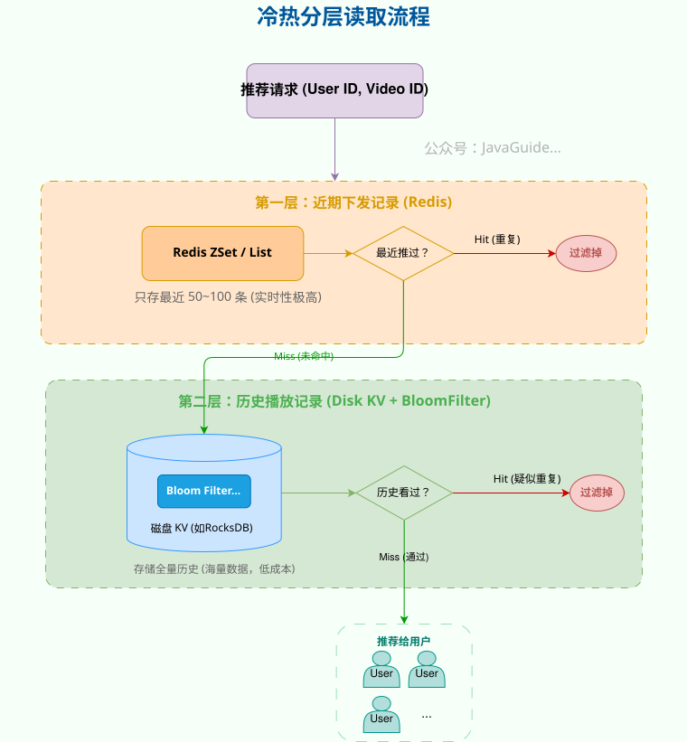
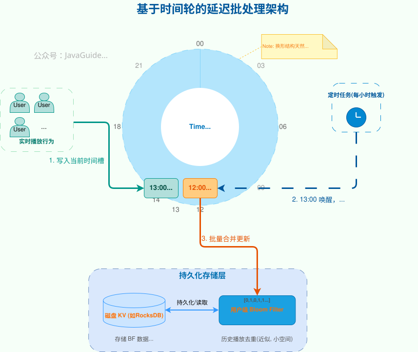
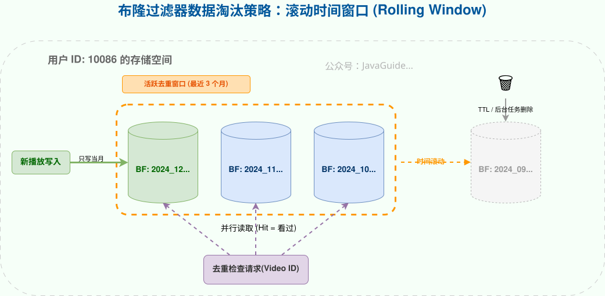
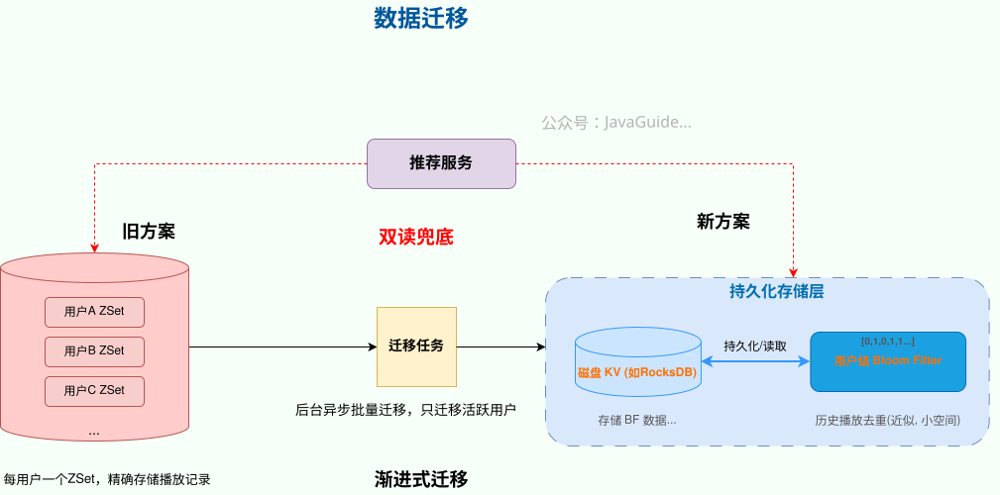
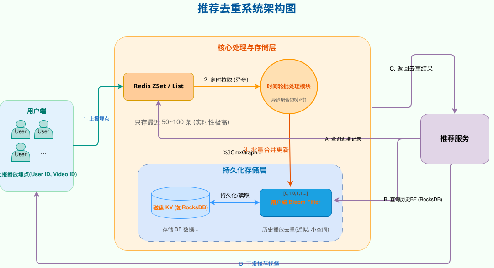

# ⭐日活上亿，如何保证给用户推荐视频不是重复的？

在上一篇文章[《40 亿个 QQ 号，限制 1G 内存，如何去重？》](https://www.yuque.com/snailclimb/tangw3/ma15vethu5rp3fc7)中，我们探讨了如何利用 Bitmap 和布隆过滤器，在有限内存下解决海量数据的**静态、全局性**去重问题。

然而，在真实的互联网业务中，我们面临的挑战往往是**动态的、个性化的**。比如，一个日活上亿的视频 App，如何保证给**每一个用户**推荐的视频，都是他们没看过的？

这个问题，让挑战的量级发生了质变：

* **从全局到个体：** 不再是维护一个全局去重集合，而是要为上亿用户，各自维护一份去重集合。
* **存储成本爆炸：** 如果为每个用户都创建一个独立的布隆过滤器，即使每个只占 1MB，1 亿用户也需要近 100TB 的存储，这对内存型存储（如 Redis）来说是不可接受的。
* **高频写入压力：** 用户每刷一个视频，播放记录就上报一次。对于千万级日活，这意味着每天有数十亿次的写入请求，对存储系统的写入性能提出了极高要求。

在这样的规模下，“给每个用户搞一个布隆过滤器”这种朴素方案已经远远不够了。下面结合一些真实公司的落地实践，一步步拆解：**一个工业级的推荐去重系统是怎么设计出来的。**

> 说明：文中方案主要用于教学讨论，笔者并不了解抖音、快手等公司的具体实现。

## 基础方案：每个用户一个 Redis ZSet

最容易想到的实现，是为每个用户在 Redis 里维护一个有序集合（ZSet）:

* **Key**: `played_videos:{user_id}`
* **Score**: 播放时间戳
* **Member**: `video_id`

这种方案实现极其简单，读写性能极高，能精准去重。不过，致命缺点是内存成本太高。设 `video_id` 的平均长度约为 25 字节（只算字符串本身），一个重度用户 90 天观看了 10,000 条视频，仅存储这些 ID 就需要 `25B * 10000 ≈ 250KB` 的内存。对于一亿活跃用户，仅去重数据就需要 **25TB** 左右的纯内存。而且，这还没有把 Redis ZSet 自身的数据结构（`listpack`/`ziplist`、`skiplist` ）开销算进去。若算上 Redis 对象头、指针等额外开销，实际内存占用甚至可能翻倍。

现实中很多团队能做的只剩下一个无奈的兜底策略：**限制每个用户只能记录最近 N 条播放历史（比如 1 万条）**。这虽能勉强压住成本，但会**严重伤害重度用户体验**：老用户的很多老内容会“失忆”，推荐系统很难真正做到“见过一次就不再刷”。

## 优化方案：空间与介质的双重置换

要解决这个问题，必须在存储内容和存储介质这两个维度做取舍。

### 数据结构的降级：从原始 ID 到布隆过滤器

推荐去重场景只关心一件事：**“这个用户是否看过这条视频？”**

换句话说，推荐去重本质上是一个 **“存在性判断”** 问题，而非 **“数据检索”** 问题。 我们需要的是一个 **近似集合** ，而不需要精确地存下每一个 `video_id`。

在可接受少量“误判重复”的前提下（偶尔误把没看过的视频当成看过，不算致命），**布隆过滤器**是最合适的结构：牺牲极低的误判率，换取存储空间的数量级下降。

### 存储介质的置换：从纯内存到“内存+磁盘”混合

即便使用了布隆过滤器，对于 TB 级的数据量，全放内存依然太贵。我们需要引入\*\*分层存储（Tiered Storage）\*\*架构：

* **Redis（内存）**：只作为高速缓存和写缓冲区，处理高频热数据。
* **磁盘 KV（如 RocksDB）**：作为海量冷数据的主存储。它的读写性能虽不及 Redis，但胜在容量成本极其低廉，单机可承载 TB 级数据。

### 业务数据的分层：下发记录 vs 播放记录

在实际推荐链路中，跟“是否看过”强相关的有两类数据：

1. **下发记录（近期，待确认）：** 用户刚刚刷到的视频，用于短时去重。这部分数据量小、时效高，适合保留在 **Redis ZSet** 中（如仅保留最近 100 条）。
2. **播放记录（历史，体量巨大）：** 用户历史看过的海量视频，用于长期去重。这部分数据适合压缩进 **布隆过滤器**，并持久化到 **磁盘 KV** 中。

**去重流程变成了“双重检查”：**

1. 先查 Redis 中的「下发记录」（拦截几分钟内重复推荐）。
2. 再查磁盘 KV 中的「历史布隆过滤器」（拦截长期历史重复）。

既兼顾了实时性，又把大头存储成本从 Redis 迁移到了磁盘。

## 核心难点：如何解决“写磁盘”的性能瓶颈？

> 这部分属于偏工程落地的进阶内容，在日常面试中不一定会展开到这个深度。

确定了混合存储架构后，最大的挑战来了：**磁盘 KV 的写性能远低于 Redis，如何应对千万级 QPS 的播放埋点写入？**

直接写入，必然会压垮磁盘 KV。

解决思路是：**削峰填谷**。 我们利用 Redis 做“蓄水池”，将高频的**实时流式写入**，转化为低频的**批量顺序写入**。这里引入一个优雅的架构模式——**基于时间轮（Time Wheel）的延迟批处理**。

### Redis 暂存

当用户产生播放行为时，系统不直接操作磁盘，而是做两件轻量级的事：

1. **记录播放行为**：将 `video_id` 追加到该用户在 Redis 的“暂存列表”（List/ZSet）。
2. **标记活跃用户**：将 `user_id` 加入到一个全局的“活跃用户桶”（Set）。这个桶按小时划分，例如 `played_users:2024102615` 存储了 15:00~16:00 所有产生过播放行为的用户 ID。

### 时间轮批处理

有了暂存数据，如何高效、可靠地进行批量写入？这里借鉴了**时间轮**的思想。

1. **构建一个 24 槽的时间环**，每个槽代表一个小时。每个小时，都有一个对应的 `played_users:{hour}` 集合；
2. 设计一个分布式定时任务（如 XXL-Job、SchedulerX 等），**每小时执行一次**。但关键在于：16:00 的任务处理的是「15:00 那一槽」的数据，而不是当前 16:00 的数据。

**延迟处理的好处是避免读写冲突**：15:00–16:00 产生的数据，在 16:00 之后数据不再变动（Sealed），批处理时不用担心增量写入干扰。

这种环形结构天然地提供了**失败补偿**能力。如果 16 点的任务因为某种原因失败了，那么第二天 16 点的任务在执行时，依然会处理 15 号槽位的数据，从而自动完成了对前一天失败任务的补偿。实际工程实践中，也可以对时间进行取模（例如 `hour % 6`）来缩短补偿周期。

### 定时任务的具体流程

定时任务在跑某个时间槽时，大致会执行以下步骤：

1. 读取上一个时间槽的用户集合，例如：`played_users:2024102615`；
2. 遍历集合中的每个 `user_id`：
   1. 从磁盘 KV 中读出该用户已有的**历史布隆过滤器**；
   2. 从 Redis 中读出该用户这一小时的**暂存播放列表**；
   3. 将这些 `video_id` 逐个写入布隆过滤器，得到**更新后的 BF**；
   4. 将新的 BF 序列化，**一次性写回磁盘 KV**；
   5. 清理该用户在 Redis 中的暂存记录。
3. 最后，删除本次时间槽对应的 `played_users:{hour}` 集合。

通过这套流程，系统成功地把：

> **千万级 QPS 的实时写入 → 变成了「按用户、按小时」的低频批量磁盘写**

既保护了磁盘 KV，又保证了整体数据的完整性与可追踪性。

## 布隆过滤器的痛点：数据淘汰

布隆过滤器的缺点众所周知：**不支持删除**。

在推荐去重场景下，用户看过的视频会越来越多，如果永远只往 BF 里加：

* 误判率会持续升高；
* 存储本身也会膨胀。

工程实践中，比较常见的做法是引入**时间窗口滑动策略**：

* **分片存储**：为每个用户维护按月/季滚动的多个布隆过滤器：比如 `bf:{user_id}:2024_10`、`bf:{user_id}:2024_11` 等；
* **滑动去重**：去重时，只需要检查最近（例如最近 3 个月）的 BF 即可。这既杜绝了“短期内的重复推荐”，又天然实现了数据的自动老化，给算法留出了“老视频二次唤醒”的空间（即允许召回很久以前看过的经典内容）；
* **过期清理**：利用磁盘 KV 的 TTL 或后台任务删除。过期时间可以加一点随机抖动，避免大量 Key 在同一时间集中淘汰造成抖动。

除了上面这种定期重建的方法之外，还有两种技术选型：

* **Counting Bloom Filter（计数布隆过滤器）**：每个槽用 4~8 bit 计数器代替 1 bit，支持删除。配合后台定期重建，可以清理已失效元素，保持低误判率。代价是内存占用涨到 4~8 倍。
* **Cuckoo Filter（布谷鸟过滤器）**：当前最推荐的现代替代品。优势在于天然支持删除且空间利用率极高（95%+）。每次查询只需访问 2 个桶，且桶内内存连续，相比标准 BF 对 CPU 缓存更友好。不过，当装载率超过 90%~95% 时，插入可能触发“连锁踢出”导致性能急剧下降甚至失败，设计时务必预留 20% 左右余量。并且，需防止“误删除”，若尝试删除一个未实际插入的元素，可能会损坏数据结构。

当然，若业务场景需**保留全量数据而不进行淘汰**，Scalable Bloom Filter（可伸缩布隆过滤器，SBF）是更具弹性的方案。它采用**级联结构**：当当前层填装率饱和时，自动追加一个新的子过滤器（Layer），通常设定为容量翻倍且误判率收紧，以确保全局误判率不随层数增加而恶化。在查询机制上，SBF 遵循**逻辑或（OR）原则**：任一层判定存在即短路返回；但**要确认元素不存在（这是推荐去重的高频场景），则必须遍历所有 Layer**。因此，SBF 的核心 Trade-off 不仅在于查询路径随层数增加而变长，更在于内存随数据量持续膨胀且无法局部释放。

## 更进一步：从旧 ZSet 方案一步步切到新架构

现实里很少有“停机切换”的机会，**如何从原来的 Redis ZSet 精确存储平滑迁到「布隆过滤器 + 磁盘」架构**，是另一个工程重点。

一个相对稳妥的策略是：**延迟迁移 + 双读兜底**。

上线初期，对于未迁移的用户，去重时同时读取新旧两份数据。在后台，通过定时任务，将被触发的用户数据异步地、批量地迁移到新的布隆过滤器结构中，整个过程对用户无感。实际迁移时，一般只会针对“最近 N 天有活跃”的用户做迁移，历史沉默用户按需懒迁或者不迁，进一步节省资源。

## 总结

把全文浓缩成几句话：

1. **从全局到个体**：日活上亿的推荐系统，本质是为每个用户维护一个“看过集合”，量级是“用户数 × 人均播放数”。
2. **从精确到近似**：去重只关心“看没看过”，用布隆过滤器替代原始 ID，可以在可控误判率下大幅压缩存储。
3. **从内存到磁盘 + 分层**：把大头数据放在「布隆过滤器 + 磁盘 KV」，把近期高频数据放在 Redis，形成冷热分层。
4. **从实时写到批量写**：通过 Redis 暂存 + 时间轮批处理，把千万级 QPS 的实时写入，重塑为可控的、分批的磁盘操作。
5. **从一次性改造到渐进式迁移**：用双读、异步迁移、时间分桶等手段，在不影响线上体验的前提下，慢慢把老方案替换掉。

下面，带来一个完整的推荐去重系统架构图：

> 更新: 2025-12-17 21:46:03  
> 原文: <https://www.yuque.com/snailclimb/tangw3/rytwm8uriyitkp8y>